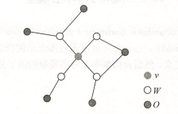
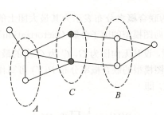
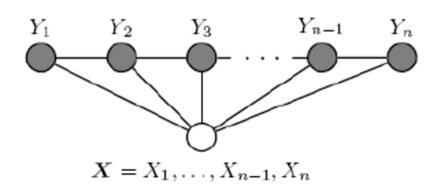

# ML 10_条件随机场（CRF）

条件随机场是给定一组输入随机变量条件下另一组输出随机变量的条件概率分布模型，其特点是假设输出随机变量构成马尔可夫随机场。

主要介绍在线性链上的特殊的条件随机场，称为线性链条件随机场，可用于序列标注等问题。

## 1. 概率无向图

图是由结点及连接结点的边组成的集合。结点和边分别记作 $v$ 和 $e$，结点和边的集合分别记作$V$ 和 $E$，图记作$G=(V,E)$。无向图是指边没有方向的图。

概率图模型是由图表示的概率分布。设有联合概率分布 $P(Y)$，$Y∈J$ 是一组随机变量。由无向图 $G=(V,E)$ 表示概率分布 $ P(Y)$，即在图G中，结点 $v∈V$ 表示一个随机变量$Y_v$，$Y=(Y_v)_{v∈V}$；边 $e∈E$ 表示随机变量之间的概率依赖关系。

- 成对马尔可夫性

  设 $u$ 和 $v$ 是无向图 $G$ 中任意两个没有边连接的结点，结点 $u$ 和 $v$ 分别对应随机变量$Y_u$ 和 $Y_v$。其他所有结点为 $O$，对应的随机变量组是$Y_O$。成对马尔可夫性是指给定随机变量组 $Y_O$的条件下随机变量 $Y_u$ 和 $Y_v$ 是条件独立的。

- 局部马尔可夫性：设 $v∈V$ 是无向图 $G$ 中任意一个结点，$W$ 是与 $v$ 有边连接的所有结点，$O$ 是 $v$ 和 $W$ 以外的其他所有结点。$v$ 表示的随机变量是$Y_v$，$W$ 表示的随机变量组是$Y_W$，$O$ 表示的随机变量组是 $Y_O$。局部马尔可夫性是指在给定随机变量组$Y_W$ 的条件下随机变量$Y_v$，与随机变量组 $Yo$ 是独立的。

  

- 全局马尔可夫性：设结点集合 $A$，$B$是在无向图 $G$ 中被结点集合 $C$ 分开的任意结点集合。结点集合$A$，$B$ 和 $C$ 所对应的随机变量组分别是$Y_A$，$Y_B$和 $Y_C$。全局马尔可夫性是指给定随机变量组 $Y_C$ 条件下随机变量组 $Y_A$ 和 $Y_B$ 是条件独立的。

  

  

设有联合概率分布$P(Y)$，由无向图$G=(V,E)$表示，在图 $G$ 中，结点表示随机变量，边表示随机变量之间的依赖关系。如果联合概率分布 $P(Y)$ 满足成对、局部或全局马尔可夫性，就称此联合概率分布为概率无向图模型。

## 2. 条件随机场

线性链条件随机场如下图所示，输出变量仅与输入变量以及相邻输出变量有连线。

### 参数化表示

CRF通常存在两类特征函数，第一类特征函数是定义在边上的特征函数，称为转移函数，依赖于当前和前一个位置；第二类特征函数是定义在结点的特征函数，称为状态函数，依赖于当前位置。两类特征函数此处均用 $f(y_{i-1},y_i,x,i)$ 表示，设有K个特征函数，第k个特征函数 $f_k(y_{i-1},y_i,x,i)$ 对应的权重为 $w_k$ ，则在随机变量X取值为x的时候随机变量Y取值为y的条件概率为：
$$
P(y|x)=\frac{e^{\sum_{k=1}^{K}w_k\sum_{i=1}^{n}f_k(y_{i-1},y_i,x,i)}}{Z(x)}
\\\\ Z(x)=\sum_ye^{\sum_{k=1}^{K}w_k\sum_{i=1}^{n}f_k(y_{i-1},y_i,x,i)}
$$

其中n为序列x的长度，令
$$
F_k(x,y)=\sum_{i=1}^{n}f_k(y_{i-1},y_i,x,i)
\\\\ F(x,y)=[F_1,...,F_K]^T
\\\\ F(y_{i-1},y_i,x,i)=[f_1(y_{i-1},y_i,x,i),...,f_K(y_{i-1},y_i,x,i)]^T
\\\\ w=[w_1,...,w_K]^T
$$
则上式可以改写为：
$$
P(y|x)=\frac{e^{w^TF(x,y)}}{Z_w(x)}
\\\\ Z_w(x)=\sum_ye^{w^TF(x,y)}
$$
对 $P(y|x)$ 取对数得：
$$
\ln{P(y|x)}=w^TF(x,y)-\ln{\sum_ye^{w^TF(x,y)}}
$$

### 概率计算

在输出序列最前面添加一个开始标签start，最后添加一个结束标签end，输出序列变为：
$$
y=(y_0,y_1,...,y_n,y_{n+1})
\\\\ y_0=start
\\\\ y_{n+1}=end
$$
定义 $n+1$ 个 m 阶矩阵$M_1(x),M_2(x),...,M_{n+1}(x)$，第 $i$ 个矩阵$M_i$第$y_{i-1}$行$y_i$列代表i-1时刻标签为$a$，第 $i$ 时刻标签为 $b$ 的得分取指数，即：
$$
M_i(y_{i-1},y_i|x)=e^{\sum_{k=1}^Kw_kf_k(y_{i-1},y_i,x,i)}=e^{w^TF(y_{i-1},y_i,x,i)}
$$
设m为添加了开始、结束标签后标签的个数，m维向量$\alpha_i$的任意一维表示i时刻取该维度对应标签的所有路径到位置i的前半部分的得分取指数的和，则：
$$
\alpha_0=\left\{\begin{aligned}
1 \qquad if\quad t_j=start \\
0 \qquad\qquad otherwise
\end{aligned}\right.
\\ \alpha_i=(\alpha_{i-1}^TM_i(x))^T \quad i=1,2,...,n+1
$$
设m维向量$\beta_i$的任意一维表示i时刻取该维度对应标签的所有路径从位置i+1开始的后半部分的得分取指数的和，则：
$$
\beta_{n+1}=\left\{\begin{aligned}
1 \qquad if\quad t_j=end \\
0 \quad\qquad otherwise
\end{aligned}\right.

\\ \beta_i=M_{i+1}(x)\beta_{i+1} \quad i=n,n-1,...,0
$$
根据以上定义的两个前向、后向向量，可以很容易得到以下几个计算公式：
$$
Z_w(x)=\boldsymbol{1}^T\alpha_n=\boldsymbol{1}^T\beta_0=\alpha_i^T\beta_i=(M_1(x)M_2(x),...,M_{n+1}(x))[start,end]
\\ P(y|x)=\frac{\prod_{i=1}^{n+1}M_i(y_{i-1},y_i|x)}{Z_w(x)}
\\ P(y_i|x)=\frac{\alpha_i[y_i]\beta_i[y_i]}{Z_w(x)}
\\ P(y_{i-1},y_i|x)=\frac{\alpha_{i-1}[y_{i-1}]M_i(y_{i-1},y_i|x)\beta_i[y_i]}{Z_w(x)}
$$
以负对数似然函数为损失函数，即：
$$
L(w)=-\ln{P(y|x)}=\ln{\sum_ye^{w^TF(x,y)}}-w^TF(x,y)
$$
对 $w$ 求导：
$$
\frac{\partial{L(w)}}{\partial{w}}=\frac{1}{Z_w(x)}\sum_ye^{w^TF(x,y)}F(x,y)-F(x,y)
\\ =\sum_yP(y|x)F(x,y)-F(x,y)
\\ =\sum_{i=1}^{n+1}\sum_{y_{i-1},y_i}P(y_{i-1},y_i|x)F(y_{i-1},y_i,x,i)-F(x,y)
\\ =\sum_{i=1}^{n+1}\sum_{y_{i-1},y_i}\frac{\alpha_{i-1}[y_{i-1}]M_i(y_{i-1},y_i|x)\beta_i[y_i]}{Z_w(x)}F(y_{i-1},y_i,x,i)-F(x,y)
$$
可以使用一次前向遍历求出各个时刻的$\alpha_i,M_i(x),Z_w(x)$，再通过一次后向遍历求出$\beta_i$即可求出上式中的前半部分，可以使用矩阵运算对累加进行批量操作。

最后，可以使用梯度下降法对 $ w$ 进行更新：
$$
w=w-learning\_rate*\frac{\partial{L(w)}}{\partial{w}}
$$
