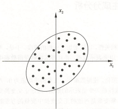
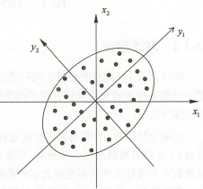

# ML 12_主成分分析（PCA）

主成分分析是一种常用的无监督学习方法，这一方法利用正交变换把由线性相关变量表示的观测数据转换为少数几个由线性无关变量表示的数据，线性无关的变量称为主成分。主成分的个数通常小于原始变量的个数，所以主成分分析属于降维方法。

主成分分析主要用于发现数据中的基本结构，即数据中变量之间的关系，是数据分析的有力工具，也用于其他机器学习方法的前处理。

## 1. 基本思想

主成分分析中，首先对给定数据进行规范化，使得数据每一变量的平均值为 0 ，方差为 1。之后对数据进行正交变换，原来由线性相关变量表示的数据，通过正交变换变成由若干个线性无关的新变量表示的数据。新变量是可能的正交变换中变量的方差的和(信息保存)最大的，方差表示在新变量上信息的大小。将新变量依次称为第一主成分、第二主成分等。

> 数据集合中的样本由实数空间(正交坐标系)，中的点表示，空间的一个坐标轴表示一个变量，规范化处理后得到的数据分布在原点附近。对原坐标系中的数据进行主成分分析等价于进行坐标系旋转变换，将数据投影到新坐标系的坐标轴上；新坐标系的第一坐标轴、第二坐标轴等分别表示第一主成分、第二主成分等，数据在每一轴上的坐标值的平方表示相应变量的方差；并且，这个坐标系是在所有可能的新的坐标系中，坐标轴上的方差的和最大的。
>
> 数据由两个变量 $x_1$ 和 $x_2$ 表示，存在于二维空间中，每个点表示一个样本。对数据已做规范化处理，可以看出，这些数据分布在以原点为中心的左下至右上倾斜的椭圆之内。很明显在这个数据中的变量 $x_1$ 和 $x_2$ 是线性相关的，具体地，当知道其中一个变量 $x_1$ 的取值时，对另一个变量 $x_2$的预测不是完全随机的。
>
> 
>
> 主成分分析对数据进行正交变换，具体地，对原坐标系进行旋转变换，并将数据在新坐标系表示。数据在原坐标系由变量 $x_1$ 和 $x_2$ 表示，通过正交变换后，在新坐标系里，由变量 $y_1$ 和 $y_2$ 表示。主成分分析选择方差最大的方向(第一主成分)作为新坐标系的第一坐标轴，即 $y_1$ 轴，在这里意味着选择椭圆的长轴作为新坐标系的第一坐标轴；之后选择与第一坐标轴正交，且方差次之的方向(第二主成分)作为新坐标系的第二坐标轴，即 $y_2$ 轴，在这里意味着选择椭圆的短轴作为新坐标系的第二坐标轴。在新坐标系里，数据中的变量 $y_1$ 和 $y_2$ 是线性无关的，当知道其中一个变量  $y_1$ 的取值时，对另一个变量 $y_2$ 的预测是完全随机的；反之亦然。
>
> 

在数据总体上进行的主成分分析称为总体主成分分析，在有限样本上进行的主成分分析称为样本主成分分析。

## 2. 总体主成分分析

- 总体主成分

  线性变换如果满足下列条件：

  1. 系数向量 $\alpha_i^T$ 是单位向量；
  2. 变量 $y_i$ 与 $y_j$ 互不相关，即 $cov(y_i,y_j)=0(i≠j)$；
  3. 变量 $y_1$ 是 $x$ 的所有线性变换中方差最大的；$y_2$ 是与 $y_1$ 不相关的 $x$ 的所有线性变换中方差最大的；一般地，$y_i$ 是与 $y_1$，$y_2$，…，$y_{i-1}$ $(i=1,2,… ,m)$都不相关的 $x$ 的所有线性变换中方差最大的；这时分别称 $y_1$，$y_2$ ,…, $y_m$ 为 $x$ 的第一主成分、第二主成分、…、第 $m$ 主成分。
  
- 总体主成分的性质：设 $x$ 是 $m$ 维随机变量，$∑$ 是 $x$ 的协方差矩阵，$∑$ 的特征值分别是$λ_1≥λ_2≥…≥λ_m≥0$，特征值对应的单位特征向量分别是$α_1,α_2,…,α_m$,则 $x$ 的第 $k$ 主成分是 $y_k = \alpha^T_kx$。$x$ 的第 $k$ 主成分的方差是 $λ_k$。

- 总体主成分的个数：主成分分析的主要目的是降维，所以一般选择 $k(k<m)$ 个主成分(线性无关变量)来代替 $m$ 个原有变量(线性相关变量),使问题得以简化，并能保留原有变量的大部分信息。