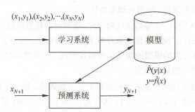
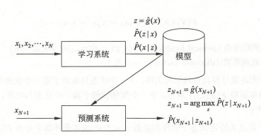
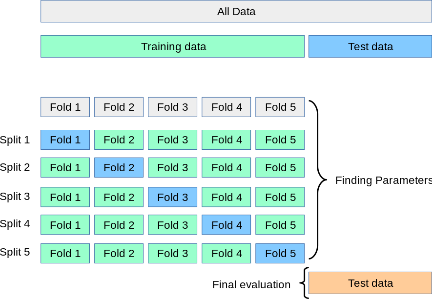

# 1_机器学习概述

## 1. 机器学习基本概念

机器学习算法是一类从数据中自动分析获得规律，并利用规律对未知数据进行预测的算法。

- 机器学习的对象是数据，数据的基本假设是同类数据具有一定的统计规律性。机器学习的目的是对数据进行预测和分析。

- 机器学习分为监督学习，无监督学习和强化学习等方法。

  > 机器学习从给定的，有限的，用于学习的训练数据集出发，假设数据为独立同分布，并假设需要学习的模型属于某个函数的集合，称为假设空间，应用某个评价准则，从假设空间中选取一个最优模型，使得它对一致的训练数据集和测试数据集在给定的评价准则下有最优的预测。
  >
  > **机器学习的三要素**：模型，策略和算法（模型的假设空间，模型的选择准则，模型学习的算法）


- 机器学习的步骤：

  > 1. 得到有限的训练数据集；
  > 2. 确定包含所有可能的模型的假设空间，即学习模型的集合；
  > 3. 确定模型选择准则（策略）；
  > 4. 实现求解最优模型的算法（算法）；
  > 5. 通过学习方法确定最优模型；
  > 6. 使用得到的最优模型对新数据进行预测和分析。

## 2. 机器学习的分类

### 监督学习

- 监督学习是指从标注数据中学习预测模型的机器学习问题，其本质是学习**输入到输出的映射的统计规律**。

> - 输入空间：输入的所有可能取值的集合；
> - 实例：每一个具体的输入，通常由特征向量进行表示；（此特征代数非特征向量中的特征向量）
> - 特征空间：所有特征向量存在的空间，模型定义在特征空间上；
> - 输出空间：输出所有可能取值的集合。

> - 回归问题：输入变量和输出变量均为连续变量的预测问题；
> - 分类问题：输出变量为有限个离散变量的预测问题；
> - 标注问题：输入变量和输出变量均为变量序列的预测问题。

输入变量用 $X$ 表示，输入变量取值用 $x$ 表示；输出变量用 $Y$ 表示，输出变量的取值用 $y$ 表示。
$$
 \bold{x} = (x^{(1)},x^{(2)},\cdots,x^{(n)})^T 
$$
样本容量为 N 的训练集可以表示为：
$$
T = \{(\bold{x}_1,y_1),(\bold{x}_2,y_2),\cdots,(\bold{x}_N,y_N)\}
$$

- 监督学习的基本假设：$X$ 和 $Y$ 有联合概率分布 $P(X,Y)$；

- 监督学习的目的：学习一个输入到输出的映射，该映射用模型（条件概率 $P(Y|X)$ 或者决策函数 $Y = f(X)$）表示。
- 监督学习分为**学习**和**预测**两个过程：



> 学习系统利用给定的训练数据集，通过学习或者训练得到一个模型；
>
> 预测系统对于给定的测试样本集中的输入 $x_{N+1}$ ，由模型 $y_{N+1} = argmax\hat{P}(y|x_{N+1})$或者$y_{N+1}=\hat{f}(x_{N+1})$给出相应的输出。

### 无监督学习

- 无监督学习是指从无标注数据（自然得到的数据）中学习预测模型的机器学习问题，其本质是**学习数据中的统计规律或者潜在结构**。

> - 输入空间：输入的所有可能取值的集合；
> - 实例：每一个具体的输入，通过特征向量表示；
> - 输出空间：输出所有可能取值的集合。输出是对输入的分析结果（不是映射），通过输入的类别/概率进行表示。

- 无监督学习可以进行数据的聚类/概率估计。

样本容量为 N 的训练集可以表示为：
$$
U = \{x_1,x_2,\cdots,x_N\}
$$


- 无监督学习的目的：选出在给定评价标准下最优的模型，该模型条件概率分布 $P(z|x)$，$P(x|z)$ 或者函数 $z = g(x)$ 表示。

- 无监督学习分为学习和预测两个过程：



> 学习系统利用给定的训练数据集，通过学习或者训练得到一个模型；
>
> 预测系统对于给定的测试样本集中的输入 $x_{N+1}$ ，由模型 $y_{N+1} = argmax\hat{P}(y|z_{N+1})$或者$z_{N+1}=\hat{g}(z_{N+1})$给出相应的输出，进行聚类或者概率估计。

## 3.机器学习的要素

### 模型

假设空间：所有可能的条件概率分布或者决策函数的集合。

- 如果是决策函数的集合：$\{f|Y=f(X)\}$，则该集合由一个参数向量$\bold{\theta}$决定的函数族构成。参数向量构成参数空间。
- 如果是条件概率的集合：$\{P|P(Y|X)\}$，则该集合由一个参数向量$\bold{\theta}$决定的条件概率分布族构成。参数向量构成参数空间。

### 策略

- 损失函数$L(Y,f(X))$：衡量模型一次预测的好坏；

> - 风险函数$R_{exp}(f)$：衡量平均意义下模型预测的好坏；
>
> $$
> R_{exp}(f) = 
> \int L(y,f(x))P(x,y)dxdy
> $$
>
> - 经验风险$R_{emp}(f)$：衡量模型$f(X)$关于训练数据集的平均损失。
>
> $$
> R_{emp}(f) = 
> \frac{1}{N}\sum^N_{i_1}L(y_i,f(x_i))
> $$

> - 常见的损失函数：
>
> 1. 0-1 损失函数：
>
> $$
> L(Y,f(X)) = 
> \left\{  
> \begin{array}{**lr**}  
> 0,& Y = f(X)		\\
> 1,& Y \neq f(X)
> \end{array}  
> \right.
> $$
>
> 2. 平方损失函数：
>
> $$
> L(Y,f(X)) =  (Y-f(X))^2
> $$
>
> 3. 绝对损失函数：
>
> $$
> L(Y,f(X)) = |Y-f(X)|
> $$
>
> 4. 对数损失函数：
>
> $$
> L(Y,P(Y|X)) = -logP(Y|X)
> $$

- 策略：选定损失函数，使得损失函数某一个指标最小化。

> 1. 经验风险最小化：样本容量足够大时，经验风险最小化能保证有比较好的学习效果。模型是条件概率分布，损失函数是对数损失函数时，经验风险最小化等价于极大似然估计法。样本容量很小时容易产生过拟合。
> 2. 结构风险最小化（正则化）：在经验风险上加入正则化项（罚项）以表达模型复杂度。
>
> $$
> R_{srm}(f) = \frac{1}{N}\sum^N_{i=1}L(y_i,f(x_i))+\lambda J(f)
> $$
>
> 式中$J(f)$为假设空间内的泛函，衡量复杂度，$\lambda$用于加权。

### 算法

- 算法：求解最优模型，通常采用迭代方法。

## 4. 模型评估和模型选择

### 训练误差和测试误差

- 训练误差是模型 $Y=\hat f(X)$ 关于训练数据集的平均损失：

$$
R_{srm}(f) = \frac{1}{N}\sum^N_{i=1}L(y_i,\hat f(x_i))
$$

- 测试误差是模型 $Y=\hat f(X)$ 关于测试数据集的平均损失：

$$
e_{test} = \frac{1}{N^,}\sum^{N^,}_{i=1}L(y_i,\hat f(x_i))
$$

训练误差的大小，对判断给定的问题是不是一个容易学习的问题是有意义的，但本质上不重要。测试误差反映了学习方法对未知的测试数据集的预测能力，是学习中的重要概念。显然，给定两种学习方法，测试误差小的方法具有更好的预测能力，是更有效的方法。通常将学习方法对未知数据的预测能力称为泛化能力。

### 泛化能力

学习方法的泛化能力是指由该方法学习到的模型对未知数据的预测能力。

泛化误差：如果学到的模型是 $\hat f$,那么用这个模型对未知数据预测的误差即为泛化误差。
$$
R_{exp}(\hat f) = \int L(y,\hat f(x))P(x,y)dxdy
$$
泛化误差反映了学习方法的泛化能力，如果一种方法学习的模型比另一种方法学习的模型具有更小的泛化误差，那么这种方法就更有效。事实上，泛化误差就是所学习到的模型的期望风险。

泛化误差上界是样本容量的函数，当样本容量增加时，泛化上界趋于0；它是假设空间容量的函数，假设空间容量越大，模型就越难学，泛化误差上界就越大。

### 过拟合

当假设空间含有不同复杂度(例如，不同的参数个数)的模型时，就要面临模型选择的问题。我们希望选择或学习一个合适的模型。如果在假设空间中存在“真”模型，那么所选择的模型应该逼近真模型。具体地，所选择的模型要与真模型的参数个数相同，所选择的模型的参数向量与真模型的参数向量相近。如果一味追求提高对训练数据的预测能力，所选模型的复杂度则往往会比真模型更高。这种现象称为过拟合。**过拟合是指学习时选择的模型所包含的参数过多，以至出现这一模型对已知数据预测得很好，但对未知数据预测得很差的现象。**可以说模型选择旨在**避免过拟合并提高模型的预测能力**。

### 正则化

模型选择的典型方法是正则化。正则化是结构风险最小化策略的实现，是在经验风险上加一个正则化项/罚项。

正则化项一般是模型复杂度的单调递增函数，模型越复杂，正则化值就越大。比如模型参数向量的范数。

**在所有可能选择的模型中，能够很好地解释已知数据并且十分简单才是最好的模型，也就是应该选择的模型。**

从贝叶斯估计的角度来看，正则化项对应于模型的先验概率。可以假设复杂的模型有较小的先验概率，简单的模型有较大的先验概率。

正则化通常用于使得模型有较好的泛化能力，抑制过拟合。通常在模型的损失函数中添加一个惩罚项，以限制模型参数的大小，从而迫使模型变得更加简单，提高泛化能力。

1. L1 正则化 (Lasso)

   惩罚项是模型参数绝对值之和；倾向于产生稀疏权重矩阵，即会将一些不重要的特征系数直接压缩为 0。因此它不仅用于正则化，还常用于特征选择。

2. L2 正则化（Ridge）

   惩罚项是模型参数平方和的平方根；倾向于让所有特征的系数都变得很小，使得模型对所有特征都有微小但均衡的影响。

3. 弹性网络 (Elastic-Net)

   惩罚项 L1 和 L2 正则化项按权重相加；平衡特征选择（L1）和防止过拟合（L2）两种优势。

### 交叉验证



如果给定的样本数据充足，进行模型选择的一种简单方法是随机地将数据集切分成三部分，分别为训练集、验证集和测试集。

训练集用来训练模型，测试集用于模型的选择，而验证集用于最终对学习方法的评估，即验证集不参与学习。

在学习到的不同复杂度的模型中，选择对测试集有最小预测误差的模型。由于测试集有足够多的数据，用它对模型进行选择也是有效的。

但是，在许多实际应用中数据是不充足的。很难再分出三个组，为了选择好的模型，可以采用交叉验证方法。交叉验证的基本想法是重复地使用数据；把给定的数据进行切分，将切分的数据集组合为训练集与测试集，在此基础上反复地进行训练、测试以及模型选择。

1. 简单交叉验证

简单交叉验证方法是：首先随机地将已给训练集数据分为两部分，一部分作为训练集，另一部分作为测试集(例如，70%数据为训练集，30%数据为测试集)；然后用训练集在各种条件下(例如，不同的参数个数)训练模型，从而得到不同的模型；在验证集上评价各个模型的测试误差，选出测试误差最小的模型。

2. S折交叉验证

首先随机地将已给数据切分为S个互不相交、大小相同的子集；然后利用 S-1 个子集的数据训练模型，利用余下的子集测试模型；将这一过程对可能的 S 种选择重复进行；最后选出 S 次评测中平均测试误差最小的模型。

3. 留一交叉验证

S折交叉验证的特殊情形是$S = N$,称为留一交叉验证，往往在数据缺乏的情况下使用。这里，$N$是给定数据集的容量。

#### `sklearn` 内的交叉验证

`cross_val_score` 函数用于交叉验证进行性能评估，该函数通过交叉验证的方式评估模型的性能，并返回每次交叉验证的分数数组。

```python
"""
	通过交叉验证评估分数
	estimator:	实现了 fit 方法的模型对象
	X:			特征数据
	y:			目标变量
	scoring:	评估指标字符串或可调用对象
	cv:			确定交叉验证拆分策略
"""
sklearn.model_selection.cross_val_score(estimator, X, y=None, *, groups=None, scoring=None, cv=None, n_jobs=None, verbose=0, params=None, pre_dispatch='2*n_jobs', error_score=nan)
```

> 1. `scoring` (评估指标)：
>    - **分类问题**: `'accuracy'` (准确率), `'precision'` (精确率), `'recall'` (召回率), `'f1'` (F1-score)。
>    - **回归问题**: `'r2'` (决定系数), `'neg_mean_squared_error'` (负均方误差), `'neg_mean_absolute_error'` (负平均绝对误差)。
>
> 2. `cv` (交叉验证拆分器)：
>
>    - **`cv=int`**：指定一个整数，例如 `cv=5`，表示使用 K 折交叉验证；
>    - CV splitter：可以传入一个交叉验证生成器对象，例如 `KFold`(K折交叉验证), `StratifiedKFold`(分层交叉验证), `ShuffleSplit`, `LeaveOneOut`(留一交叉验证) 等，这样可以更精细地控制数据拆分的策略；
>    - 可迭代对象：可以传入一个产生 (训练集索引, 测试集索引) 划分的可迭代对象。

### 数据预处理

许多机器学习算法（SVM、逻辑回归、KNN、K-Means 和基于梯度下降的算法）都有一个共同点：它们对特征的尺度非常敏感。通常在获得的数据点中，有一些特征尺度很大，另一些特征尺度很小，如果不进行处理，可能会忽略掉尺度较小的特征。

缩放的目的就是将所有特征转换到大致相同的数值尺度上，从而消除量纲带来的偏见。

1. 标准化
   $$
   z = \frac{x-\mu}{\sigma}
   $$
   $\mu$ 为数据均值，$\sigma$ 为数据标准差，处理后，数据的均值为 0，标准差为 1。

   > - 不改变数据的原始分布。
   > - 对异常值有一定的抵抗能力，但并非免疫。
   > - 生成的数据范围没有严格的边界。

   ```python
   from sklearn.preprocessing import StandardScaler
   from sklearn.datasets import load_iris
   import numpy as np
   
   # 导入数据
   data = load_iris()
   X = data.data
   
   # 标准化
   scaler = StandardScaler()
   X_standardized = scaler.fit_transform(X)
   ```

   > - 适用于基于距离的模型；
   > - 适用于假设数据服从正态分布的模型；
   > - 适用于使用梯度下降进行优化的算法。

2. 归一化
   $$
   z = \frac{x-x_{min}}{x_{max}-x_{min}}
   $$

   > - 处理后，数据被缩放到一个固定的范围。
   > - 对异常值非常敏感。

   ```python
   from sklearn.preprocessing import MinMaxScaler
   from sklearn.datasets import load_iris
   import numpy as np
   
   # 导入数据
   data = load_iris()
   X = data.data
   
   # 归一化
   scaler = MinMaxScaler(feature_range=(0, 1))
   X_normalized = scaler.fit_transform(X)
   ```

3. 鲁棒缩放器
   $$
   z = \frac{x-Q_2}{Q_3-Q_1}
   $$
   $Q_2$ 是中位数 (50%)，$Q_1$ 是第一四分位数 (25%)，$Q_3$ 是第三四分位数 (75%)。

   > - 适合处理有异常值的数据。

   ```python
   from sklearn.preprocessing import RobustScaler
   from sklearn.datasets import load_iris
   import numpy as np
   
   # 导入数据
   data = load_iris()
   X = data.data
   
   robust_scaler = RobustScaler()
   X_robust = robust_scaler.fit_transform(X)
   ```

4. 样本归一化

   对每个样本进行缩放，使其的范数等于 1。它不考虑特征之间的关系。

   ```python
   from sklearn.preprocessing import Normalizer
   
   normalizer = Normalizer(norm='l2') # 也可以选择 'l1' 或 'max'
   X_normalized_samples = normalizer.fit_transform(X)
   ```

**数据泄露的避免**：

不应当在整个数据集上进行数据预处理，这时由于使用了测试集的信息，使得测试集不再是一个未知的、可以模拟真实环境的数据集，导致模型评估结果过于乐观。

只在训练集上 `fit` 缩放器，学习其参数（如均值、方差、最小最大值）。用从训练集学到的参数去 `transform` 训练集和测试集。

```python
from sklearn.model_selection import train_test_split

X_train, X_test, y_train, y_test = train_test_split(X, y, test_size=0.2, random_state=42)

scaler = StandardScaler()

X_train_scaled = scaler.fit_transform(X_train)
X_test_scaled = scaler.transform(X_test) 
```


