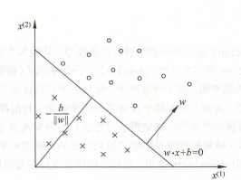

# ML 2_感知机 (perceptron)

## 1. 感知机算法

### 感知机的定义

感知机是二类分类的线性分类模型，其输入为实例的特征向量，输出为实例的类别，取 +1 和 -1 二值。感知机对应于输入空间(特征空间)中将实例划分为正负两类的分离超平面，属于判别模型。

假设输入$x\in \mathbb{R}^n$，输出$y\in\{-1,+1\}$，感知机为如下函数：
$$
f(x)=sign(w^Tx+b),
   \\sign(z)=\left\{\begin{aligned}
   1 \qquad \quad x\ge0\\
   -1 \qquad\quad x<0
   \end{aligned}\right.
$$
 其中，$w$叫做权重，是分类超平面的法向量；$b$叫做偏置，是超平面的截距。

这个超平面将特征空间划分为两个部分。位于两部分的点(特征向量)分别被分为正负两类。

### 感知机的学习策略

- 线性可分数据集：给定数据集 $T =\{(x_1,y_1),(x_2,y_2),\cdots,(x_N,y_N) \}$，$y_i = \{-1,1\}$，如果存在超平面将数据集的正实例点和负实例点分割在超平面两侧， 即对所有$ y_i=1$ 的实例 $i$，有 $w^Tx_i+b>0$，对所有 $y_i=-1$ 的实例 ，有 $w^Tx_i+b<0$ ；则称数据集T为线性可分数据集。

- 假设训练数据集是线性可分的，感知机学习的目标是求得一个能够将训练集正实例点和负实例点完全正确分开的分离超平面。

- 损失函数的一个自然选择是误分类点的总数。但是，这样的损失函数不是参数 $w$ , $b$ 的连续可导函数，不易优化。损失函数的另一个选择是误分类点到超平面 $S$ 的总距离，这是感知机所采用的。

  首先空间中任意一点到超平面 $S$ 的距离为 $\frac{1}{||w||}|w^Tx+b|$。其次，对于误分类的数据：$-y_i(w^Tx_i+b)>0$；所以误分类点到超平面的总距离为$-\frac{1}{||w||}\sum y_i(wx_i+b)$；可以定义损失函数：
  $$
  L(w,b)=-\sum_{x_i\in M}y_i(w^Tx_i+b)
  $$
  其中 $M$ 为误分类点的集合。如果没有误分类点，损失函数值是0。而且，误分类点越少，误分类点离超平面越近，损失函数值就越小。一个特定的样本点的损失函数：在误分类时是参数 $w$，$b$ 的线性函数，在正确分类时是0。因此，给定训练数据集$T$，损失函数$L(w,b)$是 $w$ , $b$ 的连续可导函数。

- 梯度下降法：首先，任意选取一个超平面$w_0$，$b_0$，然后用梯度下降法不断地极小化目标函数。极小化过程中不是一次使 $M$ 中所有误分类点的梯度下降，而是一次随机选取一个误分类点使其梯度下降。

  考虑到损失函数的梯度由下式决定：
  $$
  \nabla_wL(w,b) = -\sum  y_ix_i \\
  \nabla_bL(w,b) = -\sum  y_i
  $$
  
  则按照下述方式更新参数：
  $$
  w \leftarrow w+\eta y_ix_i   \\
  b \leftarrow b+\eta y_i
  $$
  
  学习率$\eta\in(0,1]$。
  
- > - 随机任选一个超平面$w_0,b_0$，一般都初始化为0；
  >
  > - 在训练集中选取数据$(x_i,y_i)$；
  >
  > - 如果$y_i(w^Tx_i+b)\le 0$，则更新$w$和$b$：
  >   $$
  >   w=w+\eta y_ix_i
  >   \\b=b+\eta y_i
  >   $$
  >
  > - 转至第二步，直到训练集中没有误分点。

