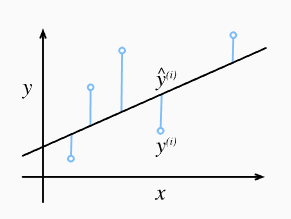

# 2_线性回归

线性回归是最简单且最流行的回归工具。根据已有的数据集进行线性回归，得到线性模型，根据该模型预测新数据。

## 1. 线性回归基本原理

### 线性回归模型

线性回归的基本假设：

> 1. 假设自变量 $\bold x$ 和因变量 $y$ 之间的关系是线性的，数据集内的样本是独立同分布的；
> 2. 数据和线性模型之间的误差符合独立同分布，满足正态分布；

线性模型：
$$
\hat y = \bold w^T \bold x + b
$$
$\bold w$ 为模型的权重，$b$ 为模型的偏置。线性回归的目的是寻找合适的权重和偏置，使得根据模型做出的预测大体符合数据。$\bold x$ 是单个样本的特征 (假设有 $d$ 个特征，是 $d$ 维向量)，对于整个数据集( $n$ 个数据)而言，使用 $\bold X$ 表示整个数据集，每一行表示一个样本，每一列表示一个特征。预测值为：
$$
\hat{\bold y} = \bold X \bold w + b
$$

### 损失函数

假设误差符合高斯分布：
$$
y = \bold w^T \bold x + b + \epsilon \\
p(\epsilon) = \frac{1}{\sqrt{2\pi}\sigma}e^{-\frac{\epsilon^2}{2\sigma^2}}
$$
可以得到单个数据的似然函数(对于特征$\bold x$，有多大可能组合得到目标 $y$)：
$$
p(y|\bold x;\bold w,b) = \frac{1}{\sqrt{2\pi}\sigma}e^{-\frac{(y-\bold w^T \bold x + b)^2}{2\sigma^2}}
$$
整个数据集的似然函数为：
$$
L(\bold w,b) = \prod_{i=1}^n \frac{1}{\sqrt{2\pi}\sigma}e^{-\frac{(y-\bold w^T \bold x + b)^2}{2\sigma^2}}
$$
乘法难以进行优化，通过对数转化为加法：
$$
lnL(\bold w,b) = \sum_{i=1}^n ln(\frac{1}{\sqrt{2\pi}\sigma}e^{-\frac{(y-\bold w^T \bold x + b)^2}{2\sigma^2}})=nln\frac{1}{\sqrt{2\pi}\sigma}-\frac{1}{\sigma^2}\frac{1}{2}\sum_{i=1}^n(y-\bold w^T \bold x + b)^2
$$
所以损失函数定义为：
$$
J(\bold w,b)=\frac{1}{2}\sum_{i=1}^n(y-\bold w^T \bold x + b)^2
$$
这就是**最小二乘法**。其几何意义就是让数据离模型的误差越小越好：



### 参数的解和梯度下降法

1. 解析解：

   首先把偏置 $b$ 和参数 $\bold w$ 合并，在 $\bold X$ 之后附加一个1列，在 $\bold w$ 向量中添加偏置元素即可。
   $$
   \hat{\bold y} = \bold X \bold w
   $$
   目标是最小化 $||\bold{y-Xw}||^2$。
   $$
   J(\bold w) = \frac{1}{2}(\bold{y-Xw})^T(\bold{y-Xw}) \\
   \nabla_\bold w J(\bold w) = \nabla_\bold w (\frac{1}{2}(\bold w^T \bold X^T\bold X\bold w - \bold w^T\bold X^T\bold y-\bold y^T\bold X\bold w+\bold y^T\bold y))= \frac{1}{2}(2\bold X^T\bold X\bold w-\bold X^T\bold y-(\bold y^T\bold X)^T)=\bold X^T\bold X\bold w-\bold X^T\bold y
   $$
   则最优 $\bold w$ 的解析解为：
   $$
   \bold w = (\bold X^T\bold X)^{-1}\bold X^T\bold y
   $$

2. 梯度下降

   线性回归这样的简单问题存在解析解，但并不是所有的问题都存在解析解。解析解可以进行很好的数学分析，但解析解对问题的限制很严格，导致它无法广泛应用在机器学习里。

   梯度下降最简单的用法是计算损失函数（数据集中所有样本的损失均值）关于模型参数的梯度。但实际中的执行可能会非常慢：因为在每一次更新参数之前必须遍历整个数据集。因此，通常会在每次需要计算更新的时候随机抽取一小批样本，称为**小批量随机梯度下降法**。
   
   在每次迭代中，首先随机抽样一个小批量(batch)，由固定数量的训练样本组成，然后计算小批量的平均损失关于模型参数的梯度（得到损失下降最快的方向），然后将梯度乘以预先确定的正数 $\eta$，从当前参数的值中减掉。
   
   梯度更新过程如下：
   $$
   \bold w \leftarrow \bold w - \frac{\eta}{|B|}\sum_{i\in B}\nabla_\bold wJ^{(i)}(\bold w,b) = \bold w - \frac{\eta}{|B|}\sum_{i\in B}\bold x^{(i)}(\bold w^T\bold x^{(i)}+b-y^{(i)}) \\
   b \leftarrow b - \frac{\eta}{|B|}\sum_{i\in B}\nabla_bJ^{(i)}(\bold w,b) = b - \frac{\eta}{|B|}\sum_{i\in B}(\bold w^T\bold x^{(i)}+b-y^{(i)})
   $$
   $|B|$ 为小批量中的样本数，称为批量大小，$\eta$ 为学习率。批量大小和学习率的值通常是手动预先指定，而不是通过模型训练得到的。这些可以调整但不在训练过程中更新的参数称为超参数。一般学习率选取较小的值。

## 2. 线性回归的实现

### `sklearn` 实现线性回归

使用 `sklearn` 回归，可以不必考虑梯度下降的问题(当然可以自行编写梯度下降程序)，接下来讲述如何使用 `sklearn` 实现线性回归。

#### 基本方法

1. 导入必要的库

   ```python
   from sklearn.linear_model import LinearRegression
   from sklearn.model_selection import train_test_split
   ```

2. 准备数据集

   ```python
   np.random.seed(42)
   # 3个特征，100个样本
   n_samples = 100
   n_features = 3	
   # 生成目标
   true_coef = np.array([3.5, 2.0, -1.2])					# 真实参数
   y = X.dot(true_coef) + np.random.randn(n_samples) * 0.5 # 添加噪声后生成目标
   # 切分训练集和测试集
   X_train, X_test, y_train, y_test = train_test_split(
       X, y, test_size=0.2, random_state=42
   )
   ```

3. 创建和训练模型

   ```python
   model = LinearRegression()
   model.fit(X_train, y_train)
   
   # 查看模型参数
   print(f"模型系数: {model.coef_}")
   print(f"模型截距: {model.intercept_}")
   ```

4. 使用模型进行预测

   ```python
   y_pred = model.predict(X_test)
   ```

5. 模型性能评估

   ```python
   from sklearn.metrics import mean_squared_error, r2_score
   mse = mean_squared_error(y_test, y_pred)		# MSE
   r2 = r2_score(y_test, y_pred)					# R2 得分
   ```

   > - **均方误差($MSE$)**: 预测值与实际值之间差异的平方的平均值。
   > - **决定系数($R^2$)**: 表示模型对数据变异的解释程度，值越接近1越好。

#### 正则化

L2 正则化对应 Ridge Regression (岭回归)：
$$
J(\bold w)=\frac{1}{2}\sum_{i=1}^n(y-\bold w^T \bold x)^2 + \alpha \frac{1}{2}\sum^n_{i=1}||\bold w||^2
$$
L1 正则化对应 Lasso Regression：
$$
J(\bold w)=\frac{1}{2}\sum_{i=1}^n(y-\bold w^T \bold x)^2 + \alpha \sum^n_{i=1}||\bold w||
$$
仍然可以使用 Elastic-Net Regression：
$$
J(\bold w)=\frac{1}{2}\sum_{i=1}^n(y-\bold w^T \bold x)^2 + \alpha (C\sum^n_{i=1}||\bold w||+(1-C)\frac{1}{2}\sum^n_{i=1}||\bold w||^2)
$$

```python
import numpy as np
import matplotlib.pyplot as plt
from sklearn.model_selection import train_test_split
from sklearn.linear_model import LinearRegression, Ridge, Lasso, ElasticNet
from sklearn.datasets import make_regression
from sklearn.metrics import mean_squared_error

# 生成一个有20个特征，其中只有5个特征有真实信息的样本数据，这样更容易看出过拟合和正则化的效果
X, y = make_regression(n_samples=100, n_features=20, n_informative=5, noise=10, random_state=42)

# 划分训练集和测试集
X_train, X_test, y_train, y_test = train_test_split(X, y, test_size=0.3, random_state=42)

# 训练普通线性回归模型
lr = LinearRegression()
lr.fit(X_train, y_train)

# 查看性能
lr_train_score = lr.score(X_train, y_train)
lr_test_score = lr.score(X_test, y_test)

# 训练 Ridge 模型，尝试一个较大的 alpha 值
ridge = Ridge(alpha=10.0) # 正则化强度
ridge.fit(X_train, y_train)

# 查看性能
ridge_train_score = ridge.score(X_train, y_train)
ridge_test_score = ridge.score(X_test, y_test)

# 训练 Lasso 模型
lasso = Lasso(alpha=0.1) # 正则化强度
lasso.fit(X_train, y_train)

# 查看性能
lasso_train_score = lasso.score(X_train, y_train)
lasso_test_score = lasso.score(X_test, y_test)

# 训练 ElasticNet 模型，混合50%的L1和50%的L2
elastic_net = ElasticNet(alpha=0.1, l1_ratio=0.5)
elastic_net.fit(X_train, y_train)

# 查看性能
en_train_score = elastic_net.score(X_train, y_train)
en_test_score = elastic_net.score(X_test, y_test)
```


 
