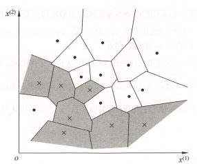
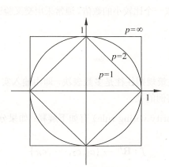
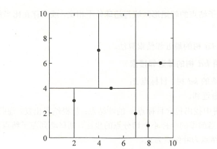
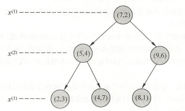
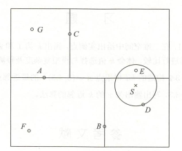

# ML 3_K近邻(K-Nearest Neighbour)

K近邻法的输入为实例的特征向量，对应于特征空间的点；输出为实例的类别，可以取多类。K近邻法假设给定一个训练数据集，其中的实例类别已定。分类时，对新的实例，根据其k个最近邻的训练实例的类别，通过多数表决等方式进行预测。

## 1. KNN 算法的基本含义

- KNN 算法

假设输入$x\in \mathbb{R}^n$，输出$y \in \{c_1,c_2,\cdots,c_k\}$，根据给定的距离度量，在训练集 $T$ 中找出与 $x$ 最邻近的 $k$ 个点，涵盖这 $k$ 个点的 $x$ 的邻域记作 $N_k(x)$。在 $N_k(x)$ 中根据分类决策规则（如多数表决）决定 $x$ 的类别 $y$ 。

KNN 法的特殊情况是 $k=1$ 的情形，称为最近邻算法。对于输入的实例点(特征向量) $x$ ,最近邻法将训练数据集中与 $x$ 最邻近点的类作为 $x$ 的类。$k$ 近邻法没有显式的学习过程。

特征空间中，对每个训练实例点 $x_i$ ，距离该点比其他点更近的所有点组成一个区域，叫作单元(cell)。每个训练实例点拥有一个单元，所有训练实例点的单元构成对特征空间的一个划分。最近邻法将实例 $x_i$ 的类 $y_i$ 作为其单元中所有点的类标记。

- KNN 三要素

1. 距离度量

    特征空间中两个实例点的距离是两个实例点相似程度的反映。设输入实例$x\in \mathbb{R}^n$，   $x_i$ 和 $x_j$ 的 $L_p$ 距离定义为：
    $$
    L_p(x_i,x_j)=(\sum_{l=1}^n|x_i^{l}-x_j^{l}|^p)^{(\frac{1}{p})}
    $$
    当 $p$ 为1时成为曼哈顿距离，当 $p$ 为2时为欧氏距离，当 $p$ 为正无穷大时为各个坐标轴距离的最大值。不同的$p$值可能导致最近邻点的选取不同。

    

2. $k$ 值选择

  $k$ 值的选择会对 KNN 法的结果产生重大影响。

  如果选择较小的 $k$ 值，就相当于用较小的邻域中的训练实例进行预测，模型的近似误差会减小，只有与输入实例较近的(相似的)训练实例才会对预测结果起作用。但缺点是模型的估计误差会增大，预测结果会对近邻的实例点非常敏感。如果邻近的实例点恰巧是噪声，预测就会出错。换句话说，**$k$ 值的减小就意味着整体模型变得复杂，容易发生过拟合**。

  如果选择较大的 $k$ 值，就相当于用较大邻域中的训练实例进行预测。其优点是可以减少学习的估计误差，但缺点是学习的近似误差会增大。这时与输入实例较远的(不相似的)训练实例也会对预测起作用，使预测发生错误。**$k$ 值的增大就意味着整体的模型变得简单**。

  在应用中，$k$ 值一般取一个比较小的数值。通常采用交叉验证法来选取最优的 $k$ 值。

3. 分类决策规则
	
	KNN 法中的分类决策规则往往是多数表决，即由输入实例的 $k$ 个邻近的训练实例中的多数类决定输入实例的类。

## 2. KNN 的实现 —— kd 树

> KNN 法最简单的实现方法是线性扫描。这时要计算输入实例与每一个训练实例的距离。当训练集很大时，计算非常耗时，这种方法是不可行的。
>
> 为了提高 KNN 搜索的效率，可以考虑使用特殊的结构存储训练数据，以减少计
> 算距离的次数。

kd 树是一种对 $k$ 维空间中的实例点进行存储以便对其进行快速检索的二叉树结构，表示对l维空间的一个划分。构造 kd 树相当于不断地用垂直于坐标轴的超平面将 $l$ 维空间切分，构成一系列的l维超矩形区域。kd 树的每个结点对应于一个k维超矩形区域。

### 平衡 kd 树的实现

- 输入：$k$ 维空间数据集$T=\{x_1,x_2,..,x_N\}$，其中$x_i=(x_i^{(0)},x_i^{(1)},...,x_i^{(l-1)})$为 $l$ 维向量。

- 输出：kd树。

1. 开始：构造根结点，根结点对应于包含T的l维空间的超矩形区域。

   选择$x^{(0)}$为坐标轴，以 $T$ 中所有实例在该坐标轴上的中位数为切分点，将根结点对应的超矩形区域切分为两个子区域。切分由通过切分点并于坐标轴$x^{(0)}$垂直的超平面实现。

   由根结点生成深度为1的左、右子结点，分别对应坐标轴$x^{(0)}$小于和大于切分点的子区域，将落在切分超平面上的实例点保存在根结点。

2. 对深度为 $j$ 的结点，选择$x^{j\bmod l}$为切分坐标轴（也可选择方差最大的坐标轴），重复1所述的切分过程。

3. 直到两个子区域没有实例存在时停止，从而形成 kd 树的区域划分。

### 使用 kd 树进行 KNN

- 输入：kd 树，目标点 $x$ ；

- 输出：$x$ 的最近邻；

1. 在 kd 树中从根结点出发，递归向下查找包含目标点 $x$ 的叶结点；
2. 以此叶结点为当前最近点；
3. 递归向上回退，在每个结点进行以下操作：
   - 如果该结点保存到实例点比当前最近点距离目标点更近，则以该实例点位当前最近点。
   - 检查该结点的另一子结点是否与以目标点为球心，以目标点与当前最近点间的距离为半径的超球体相交。如果相交，则移动到另一子结点进行递归搜索，否则向上回退。
   - 当回退到根结点时，搜索结束，当前最近点即为x的最近邻点。

