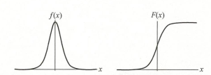

# 3_逻辑回归

逻辑回归主要用于进行二分类。

## 1. 逻辑回归基本原理

### Sigmoid 函数

Logistic 分布的分布函数如下所示：
$$
F(x) = P(X \leq x) = \frac{1}{1+e^\frac{-(x-\mu)}{\gamma}}
$$



其图形是一条 S 形曲线。该曲线以点 $(\mu,\frac{1}{2})$ 中心对称。曲线在中心附近增长速度较快，在两端增长速度较慢。形状参数 $\gamma$ 的值越小，曲线在中心附近增长得越快。$\gamma$ 取为 1，$\mu$ 取为 0 时形成 Sigmoid 函数。

Sigmoid 函数将任意的输入映射到 $(0,1)$ 区间，这样可以先通过线性回归得到一个预测值，在通过 Sigmoid 函数进行映射，实现回归到分类的转换。

### 逻辑回归模型

数据集的标签是二分类结果 $y \in \{0,1\}$，逻辑回归通过以下公式建立模型（某个特征在该模型下属于 1 的概率）：
$$
P(y = 1|\bold x;\bold w,b)=\sigma(\bold w^T\bold x+b)=h_{\bold w,b}(\bold x) \\
P(y = 0|\bold x;\bold w,b)=1-h_{\bold w,b}(\bold x)
$$
整合可以得到：
$$
P(y|\bold x;\bold w,b)=(h_{\bold w,b}(\bold x))^{y}(1-h_{\bold w,b}(\bold x))^{1-y}
$$

### 损失函数

单个数据的似然函数已经在上式中给出，数据集的似然函数：
$$
L(\bold w,b) = \prod_{i=1}^n(h_{\bold w,b}(\bold x_i))^{y}(1-h_{\bold w,b}(\bold x_i))^{1-y}
$$
取对数似然函数：
$$
lnL(\bold w,b)=\sum_{i=1}^n (y_ilnh_{\bold w,b}(\bold x_i)+(1-y_i)ln(1-h_{\bold w,b}(\bold x_i))
$$
损失函数定义为：
$$
J(\bold w,b)=-\frac{1}{n}lnL(\bold w,b)
$$

### 梯度下降法

梯度更新过程如下(这里不做推导)：
$$
\bold w \leftarrow \bold w - \frac{\eta}{|B|}\sum_{i\in B}\nabla_\bold wJ^{(i)}(\bold w,b) = \bold w - \frac{\eta}{|B|}\sum_{i\in B}(h_{\bold w,b}(\bold x^{(i)})-y^{(i)})x^{(i)} \\
b \leftarrow b - \frac{\eta}{|B|}\sum_{i\in B}\nabla_bJ^{(i)}(\bold w,b) = b - \frac{\eta}{|B|}\sum_{i\in B}(h_{\bold w,b}(\bold x^{(i)})-y^{(i)})
$$

### 多分类逻辑回归模型

$$
\bold h_{\bold w,b}(\bold x) = 
\left[
\begin{matrix}
P(y = 1|\bold x;\bold w,b) \\
P(y = 2|\bold x;\bold w,b) \\
\cdots \\
P(y = k|\bold x;\bold w,b)
\end{matrix}
\right]
 = \frac{1}{\sum_{j=1}^ke^{\bold w_j^T\bold x_i+b_j}}
 \left[
\begin{matrix}
e^{\bold w_1^T\bold x_i+b_1} \\
e^{\bold w_2^T\bold x_i+b_2} \\
\cdots \\
e^{\bold w_k^T\bold x_i+b_k}
\end{matrix}
\right]
$$

## 2. 逻辑回归的实现

### `sklearn` 实现逻辑回归

```python
import numpy as np
import matplotlib.pyplot as plt
from sklearn.datasets import load_iris
from sklearn.model_selection import train_test_split
from sklearn.linear_model import LogisticRegression
from sklearn.metrics import accuracy_score, confusion_matrix, classification_report

# 加载数据集
iris = load_iris()
X = iris.data[:, :2]  # 只使用前两个特征
y = (iris.target != 0) * 1  # 将目标转化为二分类问题

# 划分训练集和测试集
X_train, X_test, y_train, y_test = train_test_split(X, y, test_size=0.3, random_state=42)


# 创建逻辑回归模型
model = LogisticRegression()

# 训练模型
model.fit(X_train, y_train)

# 预测测试集
y_pred = model.predict(X_test)

# 可视化决策边界
x_min, x_max = X[:, 0].min() - 1, X[:, 0].max() + 1
y_min, y_max = X[:, 1].min() - 1, X[:, 1].max() + 1
xx, yy = np.meshgrid(np.arange(x_min, x_max, 0.01),
                     np.arange(y_min, y_max, 0.01))

Z = model.predict(np.c_[xx.ravel(), yy.ravel()])
Z = Z.reshape(xx.shape)

plt.contourf(xx, yy, Z, alpha=0.8)
plt.scatter(X[:, 0], X[:, 1], c=y, edgecolors='k', marker='o')
plt.xlabel('Sepal length')
plt.ylabel('Sepal width')
plt.title('Logistic Regression Decision Boundary')
plt.show()
```

