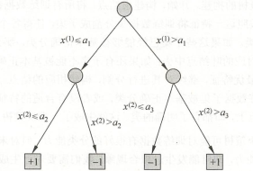

# 4_决策树

决策树是一种基本的分类与回归方法。决策树模型呈树形结构，表示基于特征对实例进行分类/预测的过程。

## 1. 决策树简介

决策树模型是一种描述对实例进行分类的树形结构。决策树由结点(node)和有向边(directed edge)组成。结点有两种类型：内部结点(internal node)和叶结点(leaf node)。内部结点表示一个特征或属性，叶结点表示一个分类/回归结果。

用决策树分类，从根结点开始，对实例的某一特征进行测试，根据测试结果，将实例分配到其子结点；这时，每一个子结点对应着该特征的一个取值。如此递归地对实例进行测试并分配，直至达到叶结点。最后将实例分到叶结点的类中。

> **决策树和 if - then 规则**：
>
> 由决策树的根结点到叶结点的每一条路径构建一条规则；路径上内部结点的特征对应着规则的条件，而叶结点的类对应着规则的结论。
>
> 决策树的路径或其对应的 if - then 规则集合具有一个重要的性质：互斥并且完备。
>
> 每一个实例都被一条路径或一条规则所覆盖，而且只被一条路径或一条规则所覆盖。这里所谓覆盖是指实例的特征与路径上的特征一致或实例满足规则的条件。

> **决策树和条件概率**：
>
> 决策树还表示给定特征条件下类的条件概率分布。这一条件概率分布定义在特征空间的一个划分上。将特征空间划分为互不相交的单元或区域，并在每个单元定义一个类的概率分布就构成了一个条件概率分布。
>
> 决策树的一条路径对应于划分中的一个单元。决策树所表示的条件概率分布由各个单元给定条件下类的条件概率分布组成。
>
> 假设 $X$ 为表示特征的随机变量，$Y$ 为表示类的随机变量，那么这个条件概率分布可以表示为 $P(Y|X)$ 。$X$ 取值于给定划分下单元的集合，$Y$ 取值于类的集合。各叶结点(单元)上的条件概率往往偏向某一个类，即属于某一类的概率较大。决策树分类时将该结点的实例强行分到条件概率大的那一类去。

## 2. 决策树的学习方法

### 特征选择

参考链接：[链接](https://www.bilibili.com/video/BV1uVEXzFEXb?spm_id_from=333.788.videopod.episodes&vd_source=2d2507d13250e2545de99f3c552af296&p=31)

根节点的特征应当足够显著以便于实现更好的切分效果，也就是说，从根节点到其下的内部节点，特征的显著性是逐渐降低的。由此，首先需要解决特征选择的问题。

1. **信息熵**

   设 $X$ 是一个取有限个值的离散随机变量，其概率分布为：
   $$
   P(X=x_i) = p_i
   $$
   则随机变量 $X$ 的熵定义为：
   $$
   H(X) = -\sum^n_{i=1}p_ilogp_i
   $$
   熵只依赖于 $X$ 的分布，而与 $X$ 的取值无关。**熵越大，随机变量的不确定性就越大。**从特征的角度来说，特征越显著，对应的信息熵越小。

   设有随机变量 $(X,Y)$ ，其联合概率分布为
   $$
   P(X = x_i,Y= y_i)=p_{ij}
   $$

   条件熵 $H(Y|X)$ 表示在已知随机变量 $X$ 的条件下随机变量 $Y$ 的不确定性。随机变量 $X$ 给定的条件下随机变量 $Y$ 的条件熵 $H(Y|X)$，定义为 $X$ 给定条件下 $Y$ 的条件概率分布的熵对 $X$ 的数学期望。
   $$
   H(Y|X) = \sum^n_{i=1}p_iH(Y|X=x_i)
   $$
   当熵和条件熵中的概率由数据估计(特别是极大似然估计)得到时，所对应的熵与条件熵分别称为经验熵和经验条件熵。

2. **信息增益**

   信息增益表示得知特征 $X$ 的信息而使得类 $Y$ 的信息的不确定性减少的程度。

   特征 $A$ 对训练数据集 $D$ 的信息增益 $g(D, A)$，定义为集合 $D$ 的经验熵 $H(D)$ 与特征 $A$ 给定条件下 $D$ 的经验条件熵 $H(D|A)$ 之差。
   $$
   g(D,A)= H(D)-H(D|A)
   $$
   一般地，熵 $H(Y)$ 与条件熵 $H(Y|X)$ 之差称为互信息。决策树学习中的信息增益等价于训练数据集中类与特征的互信息。

   信息增益表征了以某种特征划分数据集前后数据集信息熵的差值，对于数据集 $D$ 而言，信息增益依赖于特征，不同的特征往往具有不同的信息增益。**信息增益大的特征具有更强的分类能力。**

   > 设训练数据集为 $D$，$|D|$ 表示其样本容量，即样本个数。设有 $K$ 个类 $C_K$。$|C_K|$ 为属于类 $C_K$ 的样本个数，特征 $A$ 有 $n$ 个不同的取值,根据特征 $A$ 的取值将 $D$ 划分为 $n$ 个子集，$|D_i|$ 为 $D_i$ 的样本个数。记子集 $D_i$ 中属于类 $C_K$ 的样本的集合为 $D_{iK}$。于是信息增益的算法如下：
   >
   > - 计算数据集 $D$ 的经验熵 $H(D)$；
   >   $$
   >   H(D) = -\sum^K_{k=1}\frac{|C_k|}{|D|}log_2\frac{|C_k|}{|D|}
   >   $$
   >
   >
   > - 计算特征 $A$ 对数据集 $D$ 的经验条件熵 $H(D|A)$；
   >   $$
   >   H(D|A) = -\sum^n_{i=1}\frac{|D_i|}{|D|}\sum^K_{k=1}\frac{|D_{ik}|}{|D_i|}log_2\frac{|D_{ik}|}{|D_i|}
   >   $$
   >
   > - 计算信息增益。

3. **信息增益率**

   **信息增益作为划分训练数据集的特征，存在偏向于选择取值较多的特征的问题。**使用信息增益比可以对这一问题进行校正。$H_A(D)$ 是特征 $A$ 的信息熵，如果特征 $A$ 的不确定性越大，信息增益率越小，越不倾向于使用特征 $A$ 进行切分。
   $$
   g_R(D,A) = \frac{g(D,A)}{H_A(D)}
   $$

4. **基尼系数**

   基尼值：从数据集中随机抽取两个样本，类别标记不一致的概率。基尼值越小，数据纯度越高。
   $$
   Gini(D) = 1-\sum_{k=1}^{|y|}p_k^2
   $$
   $y$ 为类别的数量。

   基尼系数：
   $$
   Gini(D,A) = \sum_{v=1}^V\frac{|D_v|}{|D|}Gini(D_v)
   $$
   划分后基尼系数最小的属性是最优划分属性（**同时还可以得到最优划分点**）。

### 决策树的生成

决策树构造过程如下：

> **输入**：训练数据集 $D$（包含特征集 $A$ 和类别 $C$）；
>
> **输出**：决策树；
>
> 1. 创建根节点；
>
> 2. 检查停止条件：满足任一条件则停止递归，将当前节点标记为叶节点；
>
>    - $D$ 中所有样本属于同一个类别 $C$，将当前节点标记为 $C$ 类的叶结点；
>    - $A$ 为空集，或者当前数据集 $D$ 在所有特征上取值相同，将当前结点标记为叶结点，类别是 $D$ 中样本数最多的类别。
>
> 3. 选择最优分裂特征 $A^*$，根据该特征划分子集 $D_1,D_2,\cdots,D_v$；对于 $A^*$ 的每一个取值 $v$：
>
>    1. 创建分支结点；
>
>    2. 如果 $D_v$ 为空集（没有该种特征的数据），则创建一个叶子结点，类别为 $D$ 中样本数最多的类别。
>
>       反之，将 $D_v$ 作为新的训练数据集，$A/A^*$ 为新的特征集，重复 2-3 步构建决策树。

**ID3 算法的特征选择依据是特征的信息增益；C4.5 算法的特征选择依据是特征的信息增益率；CART 算法的选择特征是基尼系数。**

ID3 算法只能对离散属性的数据集构造决策树。

C4.5 算法可以处理连续数值型的属性，具有对缺失值的处理，同时采用了后剪枝方法。但是占用内存较大。

### 决策树的剪枝

**决策树生成算法递归地产生决策树，直到不能继续下去为止。这样产生的树往往对训练数据的分类很准确，但对未知的测试数据的分类却没有那么准确，即出现过拟合现象。**过拟合的原因在于学习时过多地考虑如何提高对训练数据的正确分类，从而构建出过于复杂的决策树。

**在决策树学习中将已生成的树进行简化的过程称为剪枝(pruning)。**具体地，剪枝从已生成的树上裁掉一些子树或叶结点，并将其根结点或父结点作为新的叶结点，从而简化分类树模型。

- 预剪枝：其中的核心思想就是，在每一次实际对结点进行进一步划分之前，先采用某一种指标来判断划分是否能提高增益，如**验证集的数据的准确性、信息增益是否大于最低标准、样本个数**是否小于最低标准等，如果是，就把结点标记为叶结点并退出进一步划分，否则就继续递归生成结点。

- 后剪枝：后剪枝则是先从训练集生成一颗完整的决策树，然后自底向上地对非叶结点进行考察，若将该结点对应的子树替换为叶结点能带来泛化性能提升（如验证集的准确率），则将该子树替换为叶结点。

  - ID3/C4.5 的后剪枝：使用如下损失函数来判断是否剪枝：
  
    $$
    C_\alpha(T)=\sum_{t=1}^{|T|}N_tH_t(T)+\alpha|T|
    \\H_t(T)=-\sum_{k}\frac{N_{tk}}{N_t}\log \frac{N_{tk}}{N_t}
    $$
  
    其中 $|T|$ 为叶结点数量，$\alpha$ 控制经验风险与结构风险所占比例（正则项），$\alpha$ 越小树越复杂，过拟合风险越大。若将非叶结点替换为叶结点后损失函数降低，则将该子树替换为叶结点。
    
  - CART 的后剪枝方法：
  
    对于CART树，剪枝算法由两步组成：
  
    1. 剪枝，形成一个子树序列
    2. 通过交叉验证选取最优子树
  
    定义子树的损失函数为：
    $$
    C_\alpha(T)=C(T)+\alpha|T|
    $$
    其中，$T$ 为任意子树，$C(T)$ 为对训练数据的预测误差（基尼指数、平方误差），$|T|$ 为子树的叶节点个数，$\alpha>0$为参数，$C_\alpha(T)$为参数是 $\alpha$ 时 $T$ 的整体损失，$\alpha$ 权衡训练数据的拟合程度与模型的复杂度。
  
    对固定的$\alpha$，一定存在使损失函数$C_\alpha(T)$最小的唯一最小子树。当$\alpha$较大时，子树偏小；当$\alpha$较小时，子树偏大。考虑将$\alpha$从小增大，得到$0=\alpha_0<\alpha_1<...<\alpha_n<+\infty$，每个区间$[\alpha_i,\alpha_{i+1})$都对应一棵剪枝得到的子树，子树序列为$\{T_0,T_1,...,T_n\}$，序列中的子树是嵌套的。
  
    对任意子树 $T_t$ ，其剪枝前的损失为：
    $$
    C_\alpha(T_t)=C(T_t)+\alpha|T_t|
    $$
    以 $t$ 为单结点的子树的损失为：
    $$
    C_\alpha(t)=C(t)+\alpha
    $$
    当 $\alpha$ 为 0 或者充分小的时候，$C_\alpha(T_t)<C_\alpha(t)$。当 $\alpha$ 从 0 开始增大时，$C_\alpha(T_t)$的增幅要比$C_\alpha(t)$大，因此存在一个 $\alpha$ 使得二者相等，二者相等时：
    $$
    \alpha=\frac{C(t)-C(T_t)}{|T_t|-1}
    $$
    此时二者有相同的损失函数值，而 $t$ 的结点少，所以选择对 $T_t$ 剪枝。
  
    为此，对整体树 $T_0$ 中每一个内部结点t计算：
    $$
    g(t)=\frac{C(t)-C(T_t)}{|T_t|-1}
    $$
    它表示该内部结点被剪枝的阈值。为了得到一个从小到大的$\alpha$序列，每次选择剪去 $g(t)$ 最小的内部结点。容易证明剪去该结点后包含该结点的剩余内部结点对应的阈值会增大，因此不必担心得到的 $\alpha$ 序列不是单调递增的。
  
    具体地，CART 剪枝算法的完整流程为：
  
    1. 设 $k=0$，$\alpha_0=0$，$T=T_0$；
  
    2. 设 $\alpha=+\infty$；
  
    3. 自下而上地对各内部结点t计算：
       $$
       g(t)=\frac{C(t)-C(T_t)}{|T_t|-1}
       $$
       更新$\alpha$：
       $$
       \alpha=\min (\alpha,g(t))
       $$
  
    4. 对 $g(t)=\alpha$ 的内部结点t进行剪枝；
  
    5. 设 $k=k+1$，$\alpha_k=\alpha,T_k=T$；
  
      6. 如果 $T_k$ 不是由根结点及两个叶结点构成的树，则回到步骤2；否则令 $T_k=T_n$；
  
      7. 采用交叉验证法在子树序列 $\{T_0,T_1,...,T_n\}$ 中选取最优子树 $T_\alpha$。
  
  

> 1. 后剪枝决策树通常比预剪枝决策树保留了更多分支；
> 2. 后剪枝决策树的泛化性能通常由于预剪枝决策树；
> 3. 后剪枝决策树训练的开销更大。