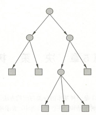
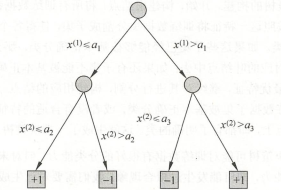

# ML 5_决策树(decision tree)

决策树是一种基本的分类与回归方法。本章主要讨论用于分类的决策树。决策树模型呈树形结构，在分类问题中，表示基于特征对实例进行分类的过程。可以认为是 if-then 规则的集合，也可以认为是定义在特征空间与类空间上的条件概率分布。

## 1. 决策树简介

分类决策树模型是一种描述对实例进行分类的树形结构。决策树由结点(node)和有向边(directed edge)组成。结点有两种类型：内部结点(internal node)和叶结点(leaf node)。内部结点表示一个特征或属性，叶结点表示一个类。

用决策树分类，从根结点开始，对实例的某一特征进行测试，根据测试结果，将实例分配到其子结点；这时，每一个子结点对应着该特征的一个取值。如此递归地对实例进行测试并分配，直至达到叶结点。最后将实例分到叶结点的类中。

> - **决策树和 if - then 规则**：
>
> 由决策树的根结点到叶结点的每一条路径构建一条规则；路径上内部结点的特征对应着规则的条件，而叶结点的类对应着规则的结论。
>
> 决策树的路径或其对应的 if - then 规则集合具有一个重要的性质：互斥并且完备。
>
> 每一个实例都被一条路径或一条规则所覆盖，而且只被一条路径或一条规则所覆盖。这里所谓覆盖是指实例的特征与路径上的特征一致或实例满足规则的条件。

> - **决策树和条件概率**：
>
> 决策树还表示给定特征条件下类的条件概率分布。这一条件概率分布定义在特征空间的一个划分上。将特征空间划分为互不相交的单元或区域，并在每个单元定义一个类的概率分布就构成了一个条件概率分布。
>
> 决策树的一条路径对应于划分中的一个单元。决策树所表示的条件概率分布由各个单元给定条件下类的条件概率分布组成。
>
> 假设 $X$ 为表示特征的随机变量，$Y$ 为表示类的随机变量，那么这个条件概率分布可以表示为 $P(Y|X)$ 。$X$ 取值于给定划分下单元的集合，$Y$ 取值于类的集合。各叶结点(单元)上的条件概率往往偏向某一个类，即属于某一类的概率较大。决策树分类时将该结点的实例强行分到条件概率大的那一类去。
>
> 

## 2. 分类决策树学习方法

### 决策树特征选择

- 信息熵

    设 $X$ 是一个取有限个值的离散随机变量，其概率分布为：
    $$
    P(X=x_i) = p_i
    $$
    则随机变量 $X$ 的熵定义为：
    $$
    H(X) = -\sum^n_{i=1}p_ilogp_i
    $$
    熵只依赖于 $X$ 的分布，而与 $X$ 的取值无关。熵越大，随机变量的不确定性就越大。

    设有随机变量 $(X,Y)$ ，其联合概率分布为
    $$
    P(X = x_i,Y= y_i)=p_{ij}
    $$

    条件熵 $H(Y|X)$ 表示在已知随机变量 $X$ 的条件下随机变量 $Y$ 的不确定性。随机变量$X$ 给定的条件下随机变量 $Y$ 的条件熵 $H(Y|X)$，定义为 $X$ 给定条件下Y的条件概率分布的熵对 $X$ 的数学期望。
    $$
    H(Y|X) = \sum^n_{i=1}p_iH(Y|X=x_i)
    $$
    当熵和条件熵中的概率由数据估计(特别是极大似然估计)得到时，所对应的熵与条件熵分别称为经验熵和经验条件熵。

- 信息增益

  信息增益表示得知特征 $X$ 的信息而使得类 $Y$ 的信息的不确定性减少的程度。

  特征 $A$ 对训练数据集 $D$ 的信息增益 $g(D, A)$，定义为集合 $D$ 的经验熵 $H(D)$ 与特征 $A$ 给定条件下 $D$ 的经验条件熵 $H(D|A)$ 之差。
  $$
  g(D,A)= H(D)-H(D|A)
  $$
  一般地，熵 $H(Y)$ 与条件熵 $H(Y|X)$ 之差称为互信息。决策树学习中的信息增益等价于训练数据集中类与特征的互信息。

  决策树学习应用信息增益准则选择特征。给定训练数据集 $D$ 和特征 $A$，经验熵$H(D)$ 表示对数据集 $D$ 进行分类的不确定性。而经验条件熵 $H(D|A)$ 表示在特征 $A$ 给定的条件下对数据集 $D$ 进行分类的不确定性。那么它们的差，即信息增益，就表示由于特征 $A$ 而使得对数据集 $D$ 的分类的不确定性减少的程度。显然，对于数据集 $D$ 而言，信息增益依赖于特征，不同的特征往往具有不同的信息增益。**信息增益大的特征具有更强的分类能力。**
  
  信息增益按以下方法计算：
  
  > 设训练数据集为 $D$，$|D|$ 表示其样本容量，即样本个数。设有 $K$ 个类 $C_K$。$|C_K|$ 为属于类 $C_K$ 的样本个数，特征 $A$ 有 $n$ 个不同的取值,根据特征 $A$ 的取值将 $D$ 划分为 $n$ 个子集，$|D_i|$ 为 $D_i$ 的样本个数。记子集 $D_i$ 中属于类 $C_K$ 的样本的集合为 $D_{iK}$。于是信息增益的算法如下：
  >
  > - 计算数据集 $D$ 的经验熵 $H(D)$；
  >   $$
  >   H(D) = -\sum^K_{k=1}\frac{|C_k|}{|D|}log_2\frac{|C_k|}{|D|}
  >   $$
  >   
  >
  > - 计算特征 $A$ 对数据集 $D$ 的经验条件熵 $H(D|A)$；
  >   $$
  >   H(D|A) = -\sum^n_{i=1}\frac{|D_i|}{|D|}\sum^K_{k=1}\frac{|D_{ik}|}{|D_i|}log_2\frac{|D_{ik}|}{|D_i|}
  >   $$
  >
  > - 计算信息增益。
  
- 信息增益作为划分训练数据集的特征，存在偏向于选择取值较多的特征的问题。使用信息增益比可以对这一问题进行校正。
  $$
  g_R(D,A) = \frac{g(D,A)}{H_A(D)}
  $$

### 决策树的生成

#### ID3 算法

1. 若 $D$ 中所有实例属于同一类 $C_k$，则 $T$ 为单结点树，并将类 $C_k$ 作为该结点的类标记，返回 $T$。
2. 若 $A=\varnothing$，则 $T$ 为单结点树，并将 $D$ 中实例数最大的类 $C_k$ 作为该结点的类标记，返回 $T$。
3. 否则，计算 $A$ 中各特征对 $D$ 的信息增益，选择信息增益最大的特征 $A_g$ ；
4. 如果 $A_g$ 的信息增益小于阈值 $e$，则置 $T$ 为单结点树，并将 $D$ 中实例数最大的类 $C_k$ 作为该结点的类标记，返回$T$；
5. 否则，对 $A_g$ 的每一可能值 $a_i$，依 $A_g= a_i$ 将 $D$ 分割为若干非空子集 $D$，将 $D$ 中实例数最大的类作为标记，构建子结点，由结点及其子结点构成树$T$，返回$T$；
6. 对第 $i$ 个子结点，以 $D_i$ 为训练集，以 $A-{A_g}$ 为特征集，递归地调用 1-5 ，得到子树$T$，返回 $T$。

> ID3 算法只有树的生成，所以该算法生成的树容易产生过拟合。

#### C4.5 算法

1. 若 $D$ 中所有实例属于同一类 $C_k$，则 $T$ 为单结点树，并将类 $C_k$ 作为该结点的类标记，返回 $T$。
2. 若 $A=\varnothing$，则 $T$ 为单结点树，并将 $D$ 中实例数最大的类 $C_k$ 作为该结点的类标记，返回 $T$。
3. 否则，计算 $A$ 中各特征对 $D$ 的信息增益比，选择信息增益最大的特征 $A_g$ ；
4. 如果 $A_g$ 的信息增益比小于阈值 $e$，则置 $T$ 为单结点树，并将 $D$ 中实例数最大的类 $C_k$ 作为该结点的类标记，返回$T$；
5. 否则，对 $A_g$ 的每一可能值 $a_i$，依 $A_g= a_i$ 将 $D$ 分割为若干非空子集 $D$，将 $D$ 中实例数最大的类作为标记，构建子结点，由结点及其子结点构成树$T$，返回$T$；
6. 对第 $i$ 个子结点，以 $D_i$ 为训练集，以 $A-{A_g}$ 为特征集，递归地调用 1-5 ，得到子树$T$，返回 $T$。

#### CART 算法（分类树）

分类树用基尼指数选择最优特征，同时决定该特征的最优二值切分点。

基尼指数：
$$
Gini(D)=\sum_{y=1}^{|y|}p_k(1-p_k)=1-\sum_{y=1}^{|y|}p_k^2
$$
如果样本集合 $D$ 根据特征 $A$ 是否取某一可能值 $a$ 被分割成 $D_1$ 和 $D_2$ 两部分。则在特征 $A$ 的条件下，集合 $D$ 的基尼指数定义为：
$$
Gini(D,A)=\frac{|D_1|}{|D|}Gini(D_1)+\frac{|D_2|}{|D|}Gini(D_2)
$$
基尼指数 $Gini(D)$ 表示集合 $D$ 的不确定性，基尼指数 $Gini(D,A)$ 表示经 $A=a$ 分割后集合 $D$ 的不确定性。基尼指数值越大，样本集合的不确定性也就越大，这一点与熵相似。

1. 设结点的训练数据集为 $D$，计算现有特征对该数据集的基尼指数。此时，对每一个特征 $A$，对其可能取的每个值$a$ ，据样本点对 $A=a$ 的测试为是或否将 $D$ 分割成 $D_1$ 和 $D_2$ 两部分，计算 $A=a$ 时的基尼指数。
2. 在所有可能的特征 $A$ 以及它们所有可能的切分点 $a$ 中，选择基尼指数最小的特征及其对应的切分点作为最优特征与最优切分点。依最优特征与最优切分点，从现结点生成两个子结点，将训练数据集依特征分配到两个子结点中去。
3. 对两个子结点递归地调用1，2，直至满足停止条件。
4. 生成 CART 决策树。

### 决策树的剪枝

决策树生成算法递归地产生决策树，直到不能继续下去为止。这样产生的树往往对训练数据的分类很准确，但对未知的测试数据的分类却没有那么准确，即出现过拟合现象。过拟合的原因在于学习时过多地考虑如何提高对训练数据的正确分类，从而构建出过于复杂的决策树。

在决策树学习中将已生成的树进行简化的过程称为剪枝(pruning)。具体地，剪枝从已生成的树上裁掉一些子树或叶结点，并将其根结点或父结点作为新的叶结点，从而简化分类树模型。

> - 预剪枝：其中的核心思想就是，在每一次实际对结点进行进一步划分之前，先采用某一种指标来判断划分是否能提高增益，如验证集的数据的准确性、信息增益是否大于最低标准、样本个数是否小于最低标准等，如果是，就把结点标记为叶结点并退出进一步划分，否则就继续递归生成结点。
>
> - 后剪枝：后剪枝则是先从训练集生成一颗完整的决策树，然后自底向上地对非叶结点进行考察，若将该结点对应的子树替换为叶结点能带来泛化性能提升（如验证集的准确率），则将该子树替换为叶结点。

#### ID3 / C4.5 剪枝法

可以使用如下损失函数来判断是否剪枝：
$$
C_\alpha(T)=\sum_{t=1}^{|T|}N_tH_t(T)+\alpha|T|
\\H_t(T)=-\sum_{k}\frac{N_{tk}}{N_t}\log \frac{N_{tk}}{N_t}
$$
其中 $T$ 为叶结点数量，$\alpha$控制经验风险与结构风险所占比例，越小树越复杂，过拟合风险越大。若将非叶子结点替换为叶子结点后损失函数降低，则将该子树替换为叶结点。

#### CART 剪枝法

对于CART树，剪枝算法由两步组成：

1. 剪枝，形成一个子树序列
2. 通过交叉验证选取最优子树

定义子树的损失函数为：
$$
C_\alpha(T)=C(T)+\alpha|T|
$$
其中，$T$ 为任意子树，$C(T)$ 为对训练数据的预测误差（基尼指数、平方误差），$|T|为子树的叶节点个数，$\alpha>0$为参数，$C_\alpha(T)$为参数是$\alpha$时T的整体损失，$\alpha$权衡训练数据的拟合程度与模型的复杂度。

对固定的$\alpha$，一定存在使损失函数$C_\alpha(T)$最小的唯一最小子树。当$\alpha$较大时，子树偏小；当$\alpha$较小时，子树偏大。考虑将$\alpha$从小增大，得到$0=\alpha_0<\alpha_1<...<\alpha_n<+\infty$，每个区间$[\alpha_i,\alpha_{i+1})$都对应一棵剪枝得到的子树，子树序列为$\{T_0,T_1,...,T_n\}$，序列中的子树是嵌套的。

对任意子树$T_t$，其剪枝前的损失为：
$$
C_\alpha(T_t)=C(T_t)+\alpha|T_t|
$$
以t为单结点的子树的损失为：
$$
C_\alpha(t)=C(t)+\alpha
$$
当$\alpha$为0或者充分小的时候，$C_\alpha(T_t)<C_\alpha(t)$。当$\alpha$从0开始增大时，$C_\alpha(T_t)$的增幅要比$C_\alpha(t)$大，因此存在一个$\alpha$使得二者相等，易得二者相等时：
$$
\alpha=\frac{C(t)-C(T_t)}{|T_t|-1}
$$
此时二者有相同的损失函数值，而t的结点少，所以选择对$T_t$剪枝。

为此，对整体树$T_0$中每一个内部结点t计算：
$$
g(t)=\frac{C(t)-C(T_t)}{|T_t|-1}
$$
它表示该内部结点被剪枝的阈值。为了得到一个从小到大的$\alpha$序列，每次选择剪去$g(t)$最小的内部结点。容易证明剪去该结点后包含该结点的剩余内部结点对应的阈值会增大，因此不必担心得到的$\alpha$序列不是单调递增的。

具体地，CART剪枝算法的完整流程为：

1. 设 $k=0$，$\alpha_0=0$，$T=T_0$；

2. 设 $\alpha=+\infty$；

3. 自下而上地对各内部结点t计算：
     $$
     g(t)=\frac{C(t)-C(T_t)}{|T_t|-1}
     $$
     更新$\alpha$：
     $$
     \alpha=\min (\alpha,g(t))
     $$

4. 对 $g(t)=\alpha$ 的内部结点t进行剪枝；

5. 设 $k=k+1$，$\alpha_k=\alpha,T_k=T$；

  6. 如果 $T_k$ 不是由根结点及两个叶结点构成的树，则回到步骤2；否则令 $T_k=T_n$；

  7. 采用交叉验证法在子树序列 $\{T_0,T_1,...,T_n\}$ 中选取最优子树 $T_\alpha$。
