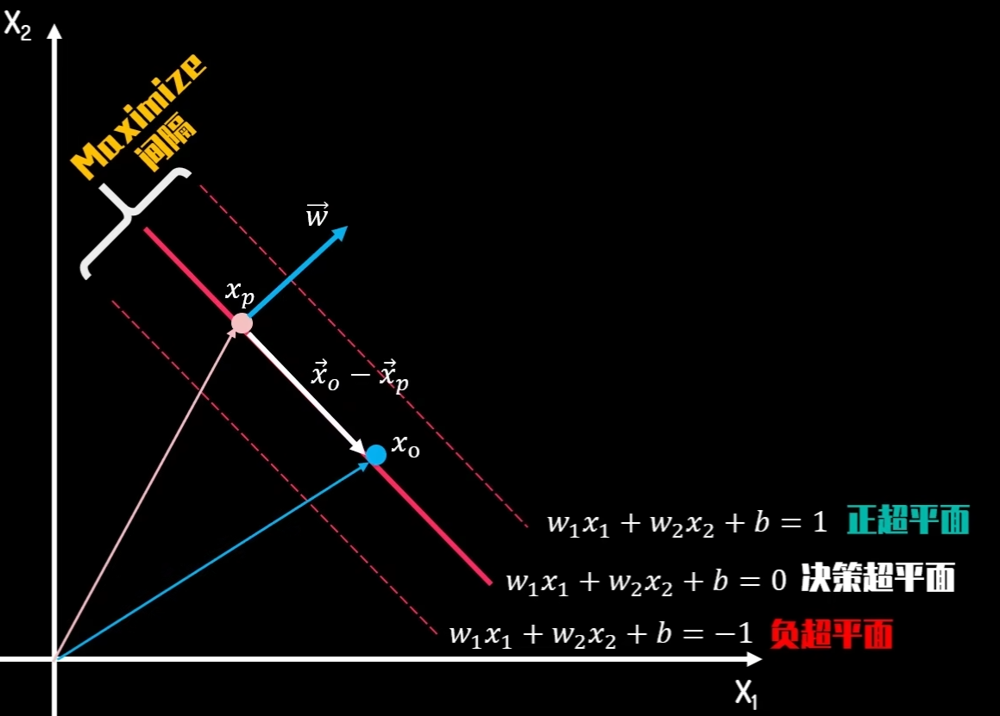

# 5_支持向量机

支持向量机(support vector machines, SVM)是一种二类分类模型。它的基本模型是定义在特征空间上的**间隔最大的线性分类器**，间隔最大使它有别于感知机(逻辑回归)；同时支持向量机还包括核技巧，这使它成为实质上的非线性分类器。

参考链接：[链接](https://www.bilibili.com/video/BV16T4y1y7qj?spm_id_from=333.788.videopod.sections&vd_source=2d2507d13250e2545de99f3c552af296)

支持向量机的学习策略就是**间隔最大化**，可形式化为一个求解凸二次规划的问题，也等价于正则化的合页损失函数的最小化问题。

> 1. 当训练数据集线性可分时，通过硬间隔最大化，学习一个线性的分类器，即线性可分支持向量机，又称为硬间隔支持向量机；
> 2. 当训练数据近似线性可分时，通过软间隔最大化，也学习一个线性的分类器，即线性支持向量机，又称为软间隔支持向量机；
> 3. 当训练数据线性不可分时，通过使用核技巧及软间隔最大化，学习非线性支持向量机。

## 1. 线性可分支持向量机

假设给定一个特征空间上的训练数据集
$$
T=\{(\bold x_1,y_1),(\bold x_2,y_2),\cdots,(\bold x_N,y_N)\}
$$
$\bold x_i$ 为第 $i$ 个特征向量，也称为实例，$y_i$ 为 $\bold x_i$ 的类标记。当 $y_i=+1$ 时，称 $\bold x_i$ 为正例；当 $y_i=-1$ 时，称 $\bold x_i$ 为负例。$(\bold x_i,y_i)$ 称为样本点，再假设训练数据集是线性可分的。

学习的目标是在特征空间中找到一个分离超平面，能将实例分到不同的类。分离超平面对应于方程 $\bold w^T\bold x+b=0$，它由法向量 $\bold w$ 和截距 $b$ 决定，可用 $(\bold w,b)$ 来表示。分离超平面将特征空间划分为两部分，一部分是正类，一部分是负类。法向量指向的一侧为正类，另一侧为负类。

一般地，当训练数据集线性可分时，存在无穷个分离超平面可将两类数据正确分开。**感知机利用误分类最小的策略，求得分离超平面，不过这时的解有无穷多个(如下图)。线性可分支持向量机利用间隔最大化求最优分离超平面，这时，解是唯一的**。

> 如下图，该决策边界可能是通过感知机得到的决策边界，这个边界非常危险，当有一个新数据时，这个新数据容易被误分类：
>
> 
>
> 如下图，该决策边界是支持向量机得到的决策边界，可以看到每个数据点和决策边界线都保持了一定距离：
>
> 
>
> 这个距离相当于数据缓冲区，缓冲区越大，分类结果的可信度越高，缓冲区称为**间隔**，间隔的距离表征两类数据的差异大小，由此，SVM 需要解决的问题是求解两类数据的最大间隔，间隔的中央就是决策超平面。

- 函数间隔和几何间隔

  1. 间隔

     假设决策边界的超平面方程为：$\bold w^T\bold x + b = 0$，将其上下移动 $c$ ，可以得到对应的间隔上下边界 $\bold w^T\bold x + b = ±c$，由于上下边界必然经过一些样本数据点，这些点距离决策边界最近，决定了间隔距离，称决策超平面到这些点的距离对应的向量为支持向量；通常归一化的取 $c=1$ 。

     

     

- 决策超平面的求解

  首先在正负超平面上选取支持向量点 $\bold x_m,\bold x_n$：

  
  $$
  \bold w^T \bold x_m + b = 1 \\
  \bold w^T \bold x_n + b = -1 \\
  \Rightarrow 
  \bold w \cdot (\bold x_m - \bold x_n) = 2 \\
  ||\bold w|| ||\bold x_m-\bold x_n|| cos\theta= 2
  $$
  向量 $\bold w$ 是超平面的法向量：

  

  

  又有：$||\bold x_m-\bold x_n||cos\theta = L$，所以：$L = \frac{2}{||\bold w||}$；此时需要求解 $||\bold w||$ 的最小值。

  一般来说，一个点距离分离超平面的远近可以表示分类预测的确信程度。在超平面确定的情况下，$|\bold w^T\bold x+b|$ 能够相对地表示点 $x$ 距离超平面的远近。而 $\bold w^T\bold x+b$ 的符号与类标记 $y$ 的符号是否一致能够表示分类是否正确。所以可用量 $y(\bold w^T\bold x+b) = \gamma $ 来表示分类的正确性及确信度，此为函数间隔。

  

  约束条件为函数间隔大于等于1，由此可得优化问题：
  $$
  \min \frac{1}{2}||\bold w||^2  \qquad s.t., y_i(\bold w^T\bold x_i+b) ≥ 1
  $$
  约束条件是不等式，为了能使用拉格朗日乘子法，定义变量 $p_i$，约束条件变换为：
  $$
  y_i(\bold w^T\bold x_i+b) - 1 = p_i^2
  $$
  此时构造拉格朗日函数：
  $$
  L(\bold w,b,\lambda_i,p_i) = \frac{1}{2}||\bold w||^2 - \sum_{i=1}^n\lambda_i(y_i(\bold w^T\bold x_i+b) - 1 - p_i^2)
  $$
  由拉格朗日乘子法：
  $$
  \frac{\partial L}{\partial \bold w} = \bold w - \sum_{i=1}^n\lambda_iy_i\bold x_i = 0 \\
  \frac{\partial L}{\partial b} = -\sum_{i=1}^n\lambda_iy_i = 0 \\
  \frac{\partial L}{\partial \lambda_i} = y_i(\bold w^T\bold x_i+b) - 1 - p_i^2 = 0 \\
  \frac{\partial L}{\partial p_i} = 2\lambda_ip_i=0
  $$
  后两式可得：
  $$
  \lambda_i(y_i(\bold w^T\bold x_i+b) - 1) = 0
  $$
  这个式子表明，如果点在正负超平面上，则 $\lambda_i$ 是任取的，如果不在正负超平面上，$\lambda_i = 0$；与此同时，为了向正确方向进行优化，需要令 $\lambda_i ≥ 0$，此时形成 KKT 条件。

  > 如果有点违反了约束项，如果 $\lambda_i < 0$，则拉格朗日函数会减小，这会使得优化方向向鼓励违反约束进行。

  此后求解优化问题可以得到决策超平面

- 对偶算法

  **通过求解对偶问题可以提高求解效率，同时还能更方便应用核技巧。**原有问题的解为 $\bold w^*,b^*$；

  下述方程必然成立：
  $$
  q(\lambda_i) = \min_{\bold w,b}(f(\bold w)-\sum_{i=1}^n \lambda_i(y_i(\bold w^T\bold x_i+b) - 1))) ≤ f(\bold w^*) - \sum_{i=1}^n \lambda_i(y_i(\bold w^{*T}\bold x_i+b^*) - 1)
  $$
  又由于 KKT 条件：$\lambda_i ≥ 0$，$y_i(\bold w^T\bold x_i+b) - 1 ≥ 0$，则有 $q(\lambda_i) ≤ f(\bold w^*) ≤ f(\bold w)$，$q(\lambda_i)$ 为 $f(\bold w)$ 的下界。可以寻找最优的下界使得：$q(\lambda_i) ≤ q(\lambda_i^*) ≤ f(\bold w^*) ≤ f(\bold w)$。由此转化为对偶问题：
  $$
  \max q(\lambda_i) = \min_{\bold w,b}(L(\bold w,b,\lambda_i)) \quad s.t.,\lambda_i ≥ 0
  $$
  如果 $q(\lambda_i^*) < f(\bold w^*)$，为弱对偶；如果 $q(\lambda_i^*) = f(\bold w^*)$，为强对偶，此时对偶问题和原问题同时最优。

  > $q(\lambda_i) ≤ q(\lambda_i^*) = f(\bold w^*) ≤ f(\bold w)$，可以直接得到原问题的最小值和对偶问题的最大值是等价的。

  > **对偶性的一个例子：**
  >
  > 原问题：
  > $$
  > \min f(x) = x^2 \quad s.t.,x-1≥0
  > $$
  > 显然这个问题的解为：$x=1,f(x)=1$；
  >
  > 令 $q(\lambda) = \min_{x}(x^2-\lambda(x-1))$，可以求得 $x=\frac{\lambda}{2}$，则 $q(\lambda) = -\frac{\lambda^2}{4}+\lambda$，这是可以得知 $q(\lambda)$ 为原问题的下界，对 $q(\lambda)$ 取极大值，可以得到原问题一样的解。

  先求解拉格朗日方程的极小值，带入 KKT 条件：
  $$
  q(\lambda_i) = \sum_{i=1}^n\lambda_i-\frac{1}{2}\sum_{i=1}^n\sum_{j=1}^n\lambda_i\lambda_jy_iy_j(\bold x_i \cdot \bold x_j)
  $$
  求解 $\lambda_i$ 之后可以求解 $\bold w = \sum_{i=1}^n\lambda_iy_i\bold x_i$，此时只需要支持向量进行计算。可以看到，求解的结果只和支持向量的点乘结果决定。

## 2. 线性支持向量机

数据联系较为紧密时，如果有一个数据点 $a$ 违反约束条件，使用硬间隔会导致实际的函数间隔很小，对于未知数据的分类效果会大打折扣，此时可以保持原来的间隔并对违反约束条件的数据点施加惩罚，形成软间隔。

违反约束条件的数据点距离对应超平面的距离定义为误差（损失） $\epsilon_a = \max(0,1-y_a*(\bold w^T\bold x_a+b))$，称为合页损失函数。

此时需要优化的目标函数修正为：
$$
f(\bold w) = \frac{1}{2}||\bold w||^2+C\sum_{i=1}^n\epsilon_i
$$
$||\bold w||$ 和 $\sum_{i=1}^n\epsilon_i$ 存在制约关系，$||\bold w||$ 越大，间隔越小，$\sum_{i=1}^n\epsilon_i$ 越小。

合页损失函数等价于约束条件：$y_i(\bold w^T\bold x_i+b) - 1 + \epsilon_i ≥ 0,\epsilon_i ≥ 0$。

同时 $C$ 为超参数，用于对误差进行惩罚。大的 $C$ 使得函数对误差敏感，趋向于硬间隔问题。

## 3. 非线性支持向量机

对于非线性分类问题，原维度的决策超平面是无解的，此时可以通过升维转换 $T(\bold x)$ 在新的维度空间中求解决策超平面：

此时原有的目标函数转换为：
$$
q(\lambda_i) = \sum_{i=1}^n\lambda_i-\frac{1}{2}\sum_{i=1}^n\sum_{j=1}^n\lambda_i\lambda_jy_iy_j(T(\bold x_i) \cdot T(\bold x_j))
$$
关键问题是获取原有数据特征向量转换后的特征向量点乘结果。当然可以通过升维转换得到的向量进行点乘求解，但是使用核技巧将会更加快速的获得点乘结果（直接通过 $\bold x_i \cdot \bold x_j$ 求解 $T(\bold x_i) \cdot T(\bold x_j)$）。定义核函数：
$$
K(\bold x_i,\bold x_j) = T(\bold x_i) \cdot T(\bold x_j)
$$

1. 多项式核
   $$
   K(\bold x_i,\bold x_j) = (c+\bold x_i \cdot \bold x_j)^d
   $$
   $c$ 的存在保证了维度变换后的维度多样性，可以在更高维度中判断数据相似性。如果没有常数项 $c$ ，只能通过不同多项式核的线性组合丰富维度多样性。

2. 高斯核
   $$
   K(\bold x_i,\bold x_j) = e^{-\gamma||\bold x_i - \bold x_j||^2}
   $$
   高斯核的含义是显著的：特征向量距离越远，相似度越低，$\gamma$ 决定了高斯曲线的宽窄，表征和函数对相似度的判定标准。$\gamma$ 越小，距离较远的特征向量相似度越高，数据更容易被超平面划分。（相似度低会让特征向量之间越来越孤立，难以直接划分超平面）

   同时可以数学推导得出，高斯核代表的维度转换是转换到无限维度的。
