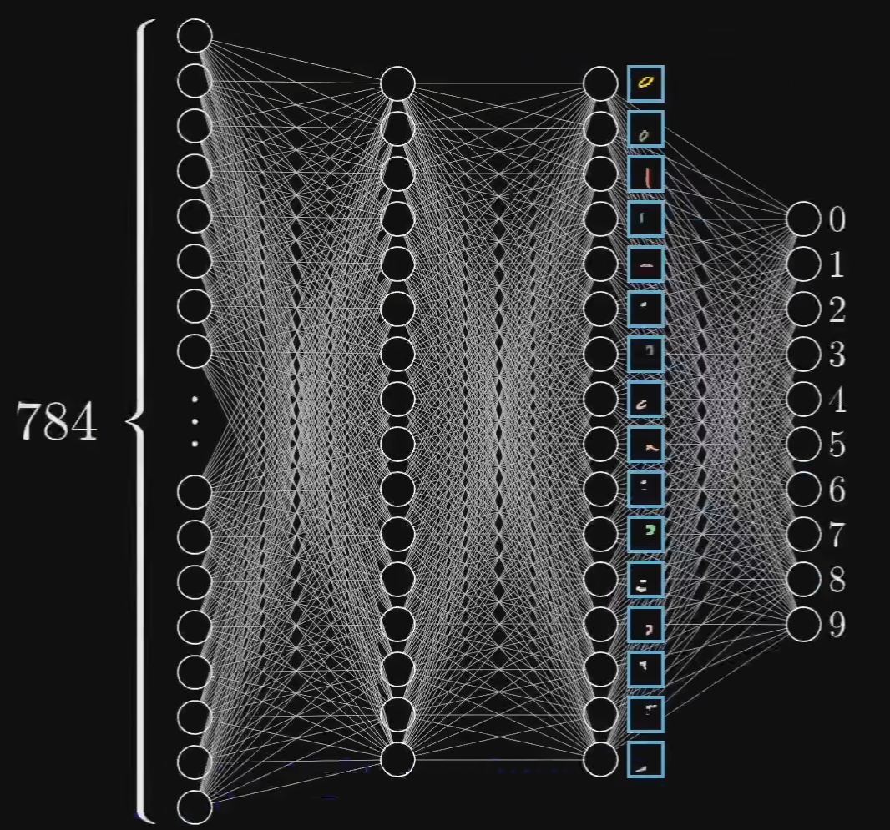

# 1_神经网络基本原理

> 参考链接：
>
> [3Blue1Brown 的视频](https://www.bilibili.com/video/BV1bx411M7Zx/?spm_id_from=333.1387.homepage.video_card.click&vd_source=2d2507d13250e2545de99f3c552af296)
>
> [阿岳的视频](https://www.bilibili.com/video/BV1bx411M7Zx/?spm_id_from=333.1387.homepage.video_card.click&vd_source=2d2507d13250e2545de99f3c552af296)

> 神经网络是一种模仿人脑处理信息方式的计算模型，它由许多相互连接的节点（神经元）组成，这些节点按层次排列。神经网络的强大之处在于其能够自动从大量数据中学习复杂的模式和特征，无需人工设计特征提取器。

> 神经网络是深度学习的一个重要部分。

## 1. 神经网络基本原理

### 网络结构

神经网络的运行结果从外部看来类似于：给定了一堆输入，通过一个黑箱，形成输出：

以数字识别为例，给定了一个图像(每个像素灰度值是一个输入)，通过这个"黑箱"，输出识别的结果。接下来讨论如何识别出来图像中的数字。

神经网络类比了生物学中神经元连接的方式，通过上一层"神经元"激活下一层"神经元"，层层激活，最后激活输出层，对于数字识别而言，每一个输出代表这张图像是哪个数字的可能性，可能性最大的就是神经网络的识别结果：

这里简要的说明这种层状的连接结构如何实现"识别"这个功能的，本质上，神经网络能够实现**对目标特征的拆解**（特征工程）。

比如数字可以拆成"横"，"竖"，"圆圈"的特征：

所以，神经网络的倒数第二层更希望能够识别出这些特征：

### 正向传播

### 权重调整

