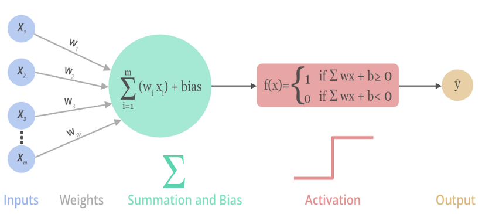
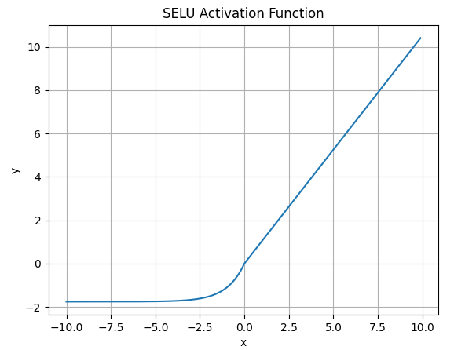

# 1_神经网络基本原理

> 参考链接：
>
> [3Blue1Brown 的视频](https://www.bilibili.com/video/BV1bx411M7Zx/?spm_id_from=333.1387.homepage.video_card.click&vd_source=2d2507d13250e2545de99f3c552af296)
>
> [阿岳的视频](https://www.bilibili.com/video/BV1Vj411P7N6/?spm_id_from=333.1387.homepage.video_card.click&vd_source=2d2507d13250e2545de99f3c552af296)

> 神经网络是一种模仿人脑处理信息方式的计算模型，它由许多相互连接的节点（神经元）组成，这些节点按层次排列。神经网络的强大之处在于其能够自动从大量数据中学习复杂的模式和特征，无需人工设计特征提取器。

> 神经网络是深度学习的一个重要部分。

## 1. 神经网络基本原理

### 网络结构

神经网络的运行结果从外部看来类似于：给定了一堆输入，通过一个黑箱，形成输出：

以数字识别为例，给定了一个图像(每个像素灰度值是一个输入)，通过这个"黑箱"，输出识别的结果。接下来讨论如何识别出来图像中的数字。

神经网络类比了生物学中神经元连接的方式，通过上一层"神经元"激活下一层"神经元"，层层激活，最后激活输出层，对于数字识别而言，每一个输出代表这张图像是哪个数字的可能性，可能性最大的就是神经网络的识别结果：

这里简要的说明这种层状的连接结构如何实现"识别"这个功能的，本质上，神经网络能够实现**对目标特征的拆解**（特征工程）。

比如数字可以拆成"横"，"竖"，"圆圈"的特征：

所以，神经网络的倒数第二层更希望能够识别出这些特征，当识别到这些被拆解的特征时，对应的神经元会被更强的激活，此时从倒数第二层到输出层的任务就是学习哪些组件能够组合出哪些数字：

而这些被拆解的特征在上一层中可以被拆解成更细微的特征：

以此类推，最后可以得知，神经网络通过识别各个小特征，然后激活识别到大的特征，最后根据大的特征输出最终的识别结果：

但是神经网络可能学习得到的特征并不是我们想象到的特征，很多时候都难以得知神经网络究竟学习到了什么样的特征。

### 正向传播

正向传播就是神经网络的"激发"过程。

首先会对每一条神经元之间的连线定义一个权重 $w$，表征上一层神经元的激活值对下一层神经元的激活值的影响程度。下一层神经元会将连接的上一层神经元的激活值通过加权相加得到自身的激活值(原始值，未加入偏置和激活函数处理)，同时，下一层神经元为控制自身的激活程度，通常需要加入一个偏置。

同时网络中对神经元的激活程度进行处理，比如激活程度小，神经元可以选择不激活；激活程度大，神经元可以得到一个大的激活值，这时通常需要一个激活函数对神经元加权得到的值进行处理。

由此正向传播的过程如下：

> ***激活函数***：激活函数可以分为饱和和非饱和两类。使用激活函数能够给神经元引入非线性因素，使得**神经网络可以任意逼近任何非线性函数**，使深层神经网络表达能力更加强大。
>
> 参考链接：[链接](https://blog.csdn.net/qq_42691298/article/details/126590726)
>
> > - **饱和激活函数：**`sigmoid`、`tanh` ...
> > - **非饱和激活函数:**`ReLU`、`Leaky Relu`、`ELU`、`PReLU`、`RReLU` ...
> >
> > 非饱和激活函数能解决深度神经网络（层数非常多）带来的梯度消失问题，而且使用非饱和激活函数能加快收敛速度。
>
> 1. `sigmoid` 函数
>    $$
>    f(x) = \frac{1}{1+e^{-x}}\\
>    f^,(x) = f(x)(1-f(x))
>    $$
>    
>
> 2. `tanh` 函数
>    $$
>    f(x) = \frac{e^x-e^{-x}}{e^x+e^{-x}} = 2sigmoid(2x)-1
>    $$
>    
>
> 3. `ReLU` 函数
>    $$
>    f(x) = \max(0,x)
>    $$
>    
>
> 4. `Leaky Relu` 函数
>    $$
>    f(x;\alpha) = \max(\alpha x,x)
>    $$
>    
>
> 5. `PRelu` 函数
>    $$
>    f(x;\alpha)=
>    \begin{equation*}
>    \begin{cases}
>    \alpha x , x \textless 0 \\
>    x,x\geq 0 
>    \end{cases}
>    \end{equation*}
>    $$
>    $\alpha$ 通过学习得到。
>
>    
>
> 6. `ELU` 函数
>    $$
>    f(x;\alpha)=
>    \begin{equation*}
>    \begin{cases}
>    \alpha(e^x-1), x \leq 0 \\
>    x,x \textgreater 0
>    \end{cases}
>    \end{equation*}
>    $$
>    
>
> 7. `SELU` 函数
>    $$
>    f(x;\alpha)=
>    \begin{equation*}
>    \begin{cases}
>    \lambda\alpha(e^x-1), x \leq 0 \\
>    \lambda x,x \textgreater 0
>    \end{cases}
>    \end{equation*} \\
>    \alpha = 1.6733 \\
>    \lambda = 1.0507
>    $$
>    
>
> 8. `Swish` 函数
>    $$
>    f(x) = x sigmoid(x)
>    $$
>    
>
> 9. `Mish` 函数
>    $$
>    f(x) = x tanh(ln(1+e^x))
>    $$
>    
>
> 10. `softmax` 函数
>     $$
>     f(x) = \frac{e^{x_i}}{\sum e^{x_i}}
>     $$
>     

神经网络训练的目标是寻找出合适的**权重 $w$** 和**偏置 $b$** 使得损失函数最小化。

### 权重调整

最初的时候权重是随机分配的，当然，随机分配需要遵循特定的规则，比如一个神经元有 $n$ 条线和上一层神经元连接，那么每条线上的权重在 $-\frac{1}{\sqrt n }$ 和 $\frac{1}{\sqrt n }$ 之间随机分配；或者使用高斯分布的方法进行随机分配。

训练过程中，对一组输入，总会对应着一组神经网络的输出和标准的输出：

神经网络的输出和标准输出总存在差别，通常需要定义损失函数 $J$（比如对应输出层的神经元1，定义损失函数 $\frac{1}{2}(y_1-\hat y_1)^2$），训练的目标就是使得 $J$ 最小。

首次以下面这个简单的神经网络为例子，当1层神经元输入 $x$ 时，输出为 $\hat y$，但是期望的输出为 $y$。

这时并不能直接改变激活值 $x$，只能尝试改变权重 $w$ 和偏置 $b$ 来实现损失函数 $J(w,b)$ 的最小化。
$$
J(w,b) = \frac{1}{2} (y-\hat y)^2 = \frac{1}{2}(f(wx+b)-\hat y)^2
$$

> 此时损失函数和 $\hat y$ 并没有关系。

这时可以采用梯度下降法优化 $w,b$。
$$
w \leftarrow w - \lambda\nabla_wJ(w,b) \\
b \leftarrow b - \lambda\nabla_bJ(w,b) \\
$$
如果神经元有多个输入，做法仍然是一致的：通过损失函数(用 $w,b,\hat y$ 表示)计算得到关于 $w,b$ 的梯度，乘以一个学习率，实现梯度下降。这样能实现对该神经元和上一层神经元所有连线的权重和偏置优化。

### 误差反向传播

对于没有隐藏层的神经网络，权重调整是很容易的，因为输出层的目标值是知道的。但是对于多层神经网络，隐藏层的损失是多少，目标是多少还是未知的，如何优化权重和偏置，这就是反向传播需要解决的另一个问题（误差反向传播）。

> 反向传播**先进行误差的反向传播，再按照各层的误差同时优化各层权重**。

以下图为例：

首先按连线上的权重分割误差：
$$
e_1^{(3)} = \frac{w_{11}^{(23)}}{w_{11}^{(23)}+w_{21}^{(23)}}e_1^{(2)'} + \frac{w_{21}^{(23)}}{w_{11}^{(23)}+w_{21}^{(23)}}e_2^{(2)'} \\
e_2^{(3)} = \frac{w_{12}^{(23)}}{w_{12}^{(23)}+w_{22}^{(23)}}e_1^{(2)''} + \frac{w_{22}^{(23)}}{w_{12}^{(23)}+w_{22}^{(23)}}e_2^{(2)''}
$$
上一层的神经元会得到连线上分配的误差，将这些误差相加可以得到该神经元的误差：
$$
e_1^{(2)} = e_1^{(2)'} + e_1^{(2)''} \\
e_2^{(2)} = e_2^{(2)'} + e_2^{(2)''}
$$
由此可以进行误差反向传播。

但是在计算机中做除法会花费很大的计算开销，实际上可以去掉分母，实现的效果是类似的（只不过是失去了归一化的效果）。

### 反向传播

实际上，反向传播的本质是**偏导数的链式法则**（因为本质上就是对各个权重和偏置求偏导）。接下来从数学方面解释如何进行优化：

- 损失函数：$J=\frac{1}{2}(y-a_1^{(3)})^2$；

- 求隐藏层到输出层的权重梯度：

  $w_{11}^{(23)}$ 的梯度：$\frac{\partial J}{\partial w_{11}^{(23)}} = \frac{\partial J}{\partial a_1^{(3)}}\frac{\partial a_1^{(3)}}{\partial z_1^{(3)}}\frac{\partial z_1^{(3)}}{\partial w_{11}^{(23)}}$；

  $w_{21}^{(23)}$ 的梯度：$\frac{\partial J}{\partial w_{21}^{(23)}} = \frac{\partial J}{\partial a_1^{(3)}}\frac{\partial a_1^{(3)}}{\partial z_1^{(3)}}\frac{\partial z_1^{(3)}}{\partial w_{21}^{(23)}}$；
  
  $b_1^{(3)}$ 的梯度：$\frac{\partial J}{\partial b_{1}^{(3)}} = \frac{\partial J}{\partial a_1^{(3)}}\frac{\partial a_1^{(3)}}{\partial z_1^{(3)}}\frac{\partial z_1^{(3)}}{\partial b_{1}^{(3)}}$。
  
- 求输入层到隐藏层的权重梯度：

  $w_{11}^{(12)}$ 的梯度：$\frac{\partial J}{\partial w_{11}^{(12)}} = \frac{\partial J}{\partial a_1^{(3)}}\frac{\partial a_1^{(3)}}{\partial z_1^{(3)}}\frac{\partial z_1^{(3)}}{\partial a_{1}^{(2)}}\frac{\partial a_1^{(2)}}{\partial z_{1}^{(2)}}\frac{\partial z_1^{(2)}}{\partial w_{11}^{(12)}}$；
  
  $w_{21}^{(12)}$ 的梯度：$\frac{\partial J}{\partial w_{21}^{(12)}} = \frac{\partial J}{\partial a_1^{(3)}}\frac{\partial a_1^{(3)}}{\partial z_1^{(3)}}\frac{\partial z_1^{(3)}}{\partial a_{1}^{(2)}}\frac{\partial a_1^{(2)}}{\partial z_{1}^{(2)}}\frac{\partial z_1^{(2)}}{\partial w_{21}^{(12)}}$；
  
  $w_{12}^{(12)}$ 的梯度：$\frac{\partial J}{\partial w_{12}^{(12)}} = \frac{\partial J}{\partial a_1^{(3)}}\frac{\partial a_1^{(3)}}{\partial z_1^{(3)}}\frac{\partial z_1^{(3)}}{\partial a_{2}^{(2)}}\frac{\partial a_2^{(2)}}{\partial z_{2}^{(2)}}\frac{\partial z_2^{(2)}}{\partial w_{12}^{(12)}}$；
  
  $w_{11}^{(22)}$ 的梯度：$\frac{\partial J}{\partial w_{22}^{(12)}} = \frac{\partial J}{\partial a_1^{(3)}}\frac{\partial a_1^{(3)}}{\partial z_1^{(3)}}\frac{\partial z_1^{(3)}}{\partial a_{2}^{(2)}}\frac{\partial a_2^{(2)}}{\partial z_{2}^{(2)}}\frac{\partial z_2^{(2)}}{\partial w_{22}^{(12)}}$；
  
  $b_1^{(2)}$ 的梯度：$\frac{\partial J}{\partial b_{1}^{(2)}} = \frac{\partial J}{\partial a_1^{(3)}}\frac{\partial a_1^{(3)}}{\partial z_1^{(3)}}\frac{\partial z_1^{(3)}}{\partial a_{1}^{(2)}}\frac{\partial a_1^{(2)}}{\partial z_{1}^{(2)}}\frac{\partial z_1^{(2)}}{\partial b_{1}^{(2)}}$；
  
  $b_2^{(2)}$ 的梯度：$\frac{\partial J}{\partial b_{2}^{(2)}} = \frac{\partial J}{\partial a_1^{(3)}}\frac{\partial a_1^{(3)}}{\partial z_1^{(3)}}\frac{\partial z_1^{(3)}}{\partial a_{2}^{(2)}}\frac{\partial a_2^{(2)}}{\partial z_{2}^{(2)}}\frac{\partial z_2^{(2)}}{\partial b_{2}^{(2)}}$。

> 误差实际上定义为 $\frac{\partial J}{\partial z}$，实际上可以看到，误差反向传播的过程就是去掉分母的按权重分配误差。

总体概括神经网络的训练流程：**正向传播->反向传播更新权重（其中包含了误差的传播）**。