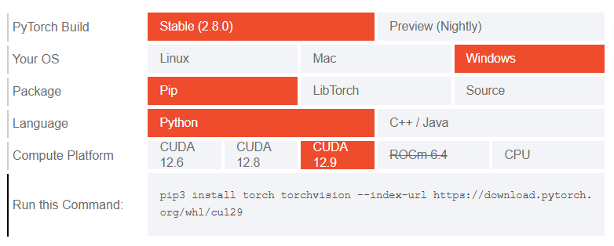
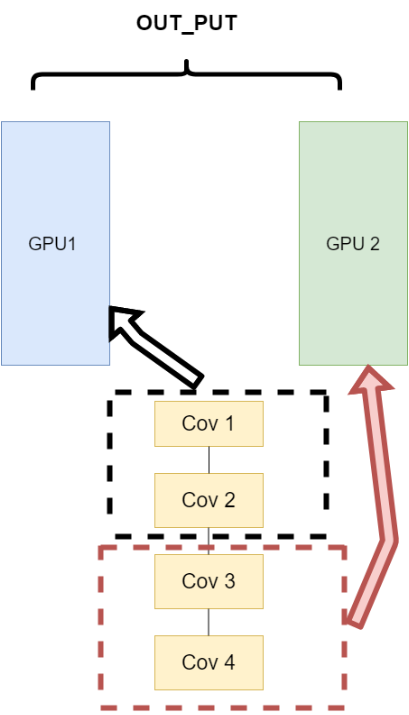
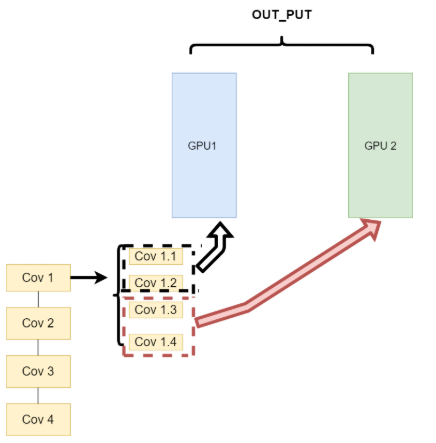
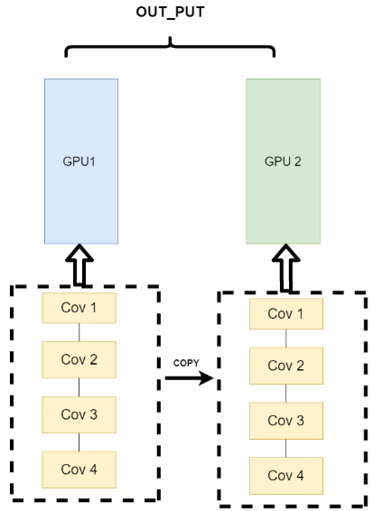

# 2_神经网络的代码实现

## 1. `pytorch` 基础

### 环境配置

神经网络通常使用 `pytorch` 库进行模型训练和导出。

`pytorch` 官网：[链接](https://pytorch.org/get-started/locally/)

根据 CUDA 安装对应版本的 `pytorch`：



```shell
$ pip3 install torch torchvision --index-url https://download.pytorch.org/whl/cu129
```

### 基本概念

`pytorch` API：[链接](https://docs.pytorch.org/docs/stable/pytorch-api.html)

#### 数据描述 —— 张量

几何代数中定义的张量是基于向量和矩阵的推广，可以将**标量视为零阶张量，矢量可以视为一阶张量，矩阵就是二阶张量**。

| 张量维度 | 含义                                         |
| -------- | -------------------------------------------- |
| 0        | 标量                                         |
| 1        | 向量                                         |
| 2        | 矩阵                                         |
| 3        | 时间序列数据/股价/文本数据/单张彩色图片(RGB) |
| 4        | 一系列图像                                   |
| 5        | 一系列视频                                   |

在 `pytorch` 中， `torch.Tensor` 是存储和变换数据的主要工具。`Tensor` 和 `NumPy` 的多维数组非常类似。但是 `Tensor` 提供 GPU 计算和自动求梯度等更多功能，使 `Tensor` 更加适合深度学习。

1. 创建 `Tensor`

   - 随机初始化 —— `torch.rand()`，参数是 `Tensor` 的形状。

     ```python
     X = torch.rand(4, 3) 
     ```

   - 全 0 矩阵 —— `torch.zeros()`，通过 `dtype` 设置数据类型，可以通过 `torch.zero_()` 和 `torch.zeros_like()` 将现有矩阵转换为全 0 矩阵。

     ```python
     X = torch.zeros(4, 3, dtype=torch.long)
     ```
     
   - 全 1 矩阵 —— `torch.ones()`

   - 单位矩阵 —— `torch.eye()`

   - 基于数据构建 —— `torch.tensor()`

     ```python
     X = torch.tensor([5.5, 3]) 
     ```

2. `Tensor` 操作

   - 加法

     直接使用 `+` ，或者使用 `torch.add()` 都可以进行张量加法。

     使用 `Tensor` 的 `add_()` 方法可以进行原值更改。

     ```python
     import torch
     # 方式1
     y = torch.rand(4, 3) 
     print(x + y)
     
     # 方式2
     print(torch.add(x, y))
     
     # 方式3
     y.add_(x) 
     print(y)
     ```

   - 索引

     **索引结果与原数据共享存储地址，**可以使用 `torch.copy()` 方法进行拷贝。

   - 维度变换

     **维度变换不能改变张量中的元素数量。**常见的方法包括 `torch.view()` 和`torch.reshape()`。

     `torch.view()` 返回的 `Tensor` 和原来的 `Tensor` 共享存储地址。

3. 广播机制

   当对两个形状不同的 `Tensor` 按元素运算时，可能会触发广播机制：先适当复制元素使这两个 `Tensor` 形状相同后再按元素运算。

#### 自动求导

`autograd` 包为张量上的所有操作提供了自动求导机制，是一个在运行时定义的框架，这意味着反向传播是根据代码如何运行来决定的，并且每次迭代可以是不同的。

`torch.Tensor` 是这个包的核心类，如果设置属性 ` .requires_grad` 为 `True`，那么它将会追踪对于该张量的所有操作。当完成计算后可以通过调用 `.backward()` 来自动计算所有的梯度。这个张量的所有梯度将会自动累加到 `.grad` 属性。

> 1. 要阻止一个张量被跟踪历史，可以调用 `.detach()` 方法将其与计算历史分离，并阻止它未来的计算记录被跟踪。
>
> 2. **为了防止跟踪历史记录(和使用内存），可以将代码块包装在 `with torch.no_grad(): `中。**在评估模型时特别有用，因为模型可能具有 `requires_grad = True` 的可训练的参数，但是不需要在评估过程中进行梯度计算。

> `Function` 类对自动求导实现十分重要。`Tensor` 和 `Function` 互相连接生成了一个无环图，它编码了完整的计算历史。每个张量都有一个 `.grad_fn` 属性，该属性引用了创建 `Tensor ` 自身的 `Function` (除非这个张量是用户手动创建的，即这个张量的 `grad_fn` 是 `None`)。

如果需要计算导数，可以在 `Tensor` 上调用 `.backward()`。如果 `Tensor` 是一个标量，则不需要为 `backward()` 指定任何参数，但是如果它有更多的元素，则需要指定一个 `gradient` 参数，该参数是形状匹配的张量。

> 对于向量的自动求导，`gradient` 参数，相当于一个权重向量，其返回结果是 $gradient^T · J$，$J$ 为雅可比矩阵。由此，通过反复进行反向传播(需要计算图保持)以求得雅可比矩阵。

**例子：**

1. 正向传播

   ```python
   x = torch.ones(2, 2, requires_grad=True)
   print(x)
   
   """
   输出：
   tensor([[1., 1.],
           [1., 1.]], requires_grad=True)
   """
   
   y = x**2
   print(y)
   
   """
   输出：
   tensor([[1., 1.],
           [1., 1.]], grad_fn=<PowBackward0>)
   """
   
   z = y * y * 3
   print(z)
   
   """
   输出：
   tensor([[3., 3.],
           [3., 3.]], grad_fn=<MulBackward0>) 
   """
   
   out = z.mean()
   print(out)
   
   """
   输出：
   tensor(3., grad_fn=<MeanBackward0>)
   """
   ```

2. 反向传播

   ```python
   # 输出导数 d(out)/d(x)
   out.backward()	# 和 out.backward(torch.tensor(1.)) 等价
   print(x.grad)
   
   """
   输出:
   tensor([[3., 3.],
           [3., 3.]])
   """
   ```

`grad` 在反向传播过程中是累加的，**由此每一次运行反向传播时，梯度都会累加之前的梯度，所以一般在反向传播之前需把梯度清零**。

## 2. GPU 与并行计算

参考链接：[链接](https://www.bilibili.com/video/BV1wbcdeWENh/?spm_id_from=333.1387.homepage.video_card.click&vd_source=2d2507d13250e2545de99f3c552af296)

### CPU 和 GPU

CPU（中央处理器，Central Processing Unit）是一台计算机的运算核心和控制核心，其功能主要是解释计算机指令以及处理计算机软件中的数据。GPU（图形处理器，Graphic Processing Unit），是一个专门的图形核心处理器。

CPU 和 GPU 都是运算的处理器，在架构组成上都包括3个部分：运算单元 ALU、控制单元 Control 和缓存单元 Cache。但是其组成比例差别很大：在 CPU 中缓存单元大概占 50%，控制单元 25%，运算单元 25%；在 GPU 中缓存单元大概占 5%，控制单元 5%，运算单元 90%。由此 CPU 的运算能力更加均衡，但是不适合做大量的运算（**多指令，小数据计算**）；GPU 更适合做大量运算（**单指令，多数据计算**）。

### 并行计算

为了提高运行速度，在模型训练的时候常常需要运用并行计算。常见的并行方法如下：

1. 网络结构分布到不同的设备中(Network partitioning)

   将一个模型的各个部分拆分，然后将不同的部分放入到 GPU 来做不同任务的计算。

   

   不同模型组件在不同的 GPU 上时，GPU 之间的传输就很重要，对于 GPU 之间的通信是一个考验。但是 GPU 的通信在这种密集任务中很难办到。

2. 同一层的任务分布到不同数据中(Layer-wise partitioning)

   同一层的模型做一个拆分，让不同的 GPU 去训练同一层模型的部分任务。

   

   可以保证在不同组件之间传输的问题，但是在需要大量的训练，同步任务加重的情况下，会出现和第一种方式一样的问题。

3. 不同的数据分布到不同的设备中，执行相同的任务(Data parallelism)

   同一个模型在不同 GPU 中训练一部分数据，然后再分别计算一部分数据之后，只需要将输出的数据做一个汇总，然后再反传。

   

### 使用 GPU 加速运算

#### 单卡训练

只需要显式的将数据和模型通过 `.cuda()` 方法转移到 GPU 上就可加速训练。

```python
model = Net()
model.cuda() # 模型显示转移到CUDA上

for image,label in dataloader:
    # 图像和标签显示转移到CUDA上
    image = image.cuda() 
    label = label.cuda()
```

#### 多卡训练

`pytorch` 提供了两种多卡训练的方式，分别为 `DataParallel` (DP)和 `DistributedDataParallel`（DDP)；

##### 单机多卡 DP

计算任务划分成多个子任务并在多个 GPU 卡上同时执行这些子任务。

> - **准备工作**：假设有 N 块 GPU，其中第 0 块作为主 GPU，一个 `batch` 的数据会先被放到主 GPU 上，且当前主 GPU 上有一份完整的网络模型；
> - **数据分配**：输入的 `batch` 数据会被分割成 N 份，然后由主 GPU 分发到另外 N-1 个 GPU 上，此时每个 GPU 都有一份数据；
> - **模型复制**：整个模型也会被复制到其他的 GPU 上，这意味着每张 GPU 都有一份完整的模型副本；
> - **前向传播**：每个 GPU 独立的进行前向传播（线程并行），计算各自的预测输出；
> - **汇总输出、计算损失**：主 GPU 会收集各个 GPU 的输出，并在主 GPU 上计算损失；
> - **反向传播**：将计算之后的损失再分发到对应的 GPU 上，每个 GPU 进行独立的反向传播，计算各自的梯度；
> - **汇总梯度**：每个 GPU 计算完梯度后，这些梯度会被汇总到主 GPU 上，并在主 GPU 求梯度平均值；
> - **参数更新**：主 GPU 使用计算出的平均梯度更新模型的参数
> - 重复上述过程，当执行到下一轮的模型复制时，主 GPU 上更新后的模型参数会同步给其他所有的 GPU，从而保证模型参数的一致性。

```python
model = Net()
model.cuda() # 模型显示转移到CUDA上

if torch.cuda.device_count() > 1: # 含有多张GPU的卡
	model = nn.DataParallel(model) # 单机多卡DP训练
```

也可以指定 GPU 进行并行训练：`nn.DataParallel` 函数传入 `device_ids` 参数，可以指定使用的 GPU 编号。

##### 多机多卡 DDP

通过 DP 进行分布式多卡训练的方式容易造成负载不均衡，有可能第一块 GPU 显存占用更多，因为输出默认都会被集中到第一块 GPU 上。

DDP 方法针对每个 GPU，启动一个进程，然后这些进程在最开始的时候会保持一致（模型的初始化参数也一致，每个进程拥有自己的优化器），同时在更新模型的时候，梯度传播也是完全一致的，这样就可以保证任何一个 GPU 上面的模型参数就是完全一致的。

> - **模型复制**：整个模型会被复制到每张 GPU 上，这意味着每张 GPU 上都有一个完整的模型副本；
> - **数据分配**：通过 DistributedSampler 操作，每个进程独立的加载自己那部分的数据子集；
> - **前向传播**：每个 GPU 独立的进行前向传播，计算各自的预测输出；
> - **反向传播**：每个 GPU 独立的计算损失，进行反向传播，计算梯度；
> - **梯度汇总**：所有 GPU 通过 Ring-Allrecude 操作汇总梯度，使得每个 GPU 上的梯度一致；
> - **参数更新**：每个 GPU 使用汇总后的梯度求平均，更新自己的模型参数，更新后，每个 GPU 上的模型参数都是一致的；

**DDP 的使用：**

1. 基本概念：

   `GROUP`：进程组，默认情况下，只有一个组，一个工作即为一个组，也即一个 `world`。

   `WORLD_SIZE`：全局进程个数，表示 GPU 数量。

   `RANK`：进程序号，用于进程间通讯，表征进程优先级。`rank = 0` 的主机为 `master` 节点，表示第几个 GPU。

   `LOCAL_RANK`：表示进程内 GPU 编号，非显式参数，由 `torch.distributed.launch` 内部指定。多机多卡中 `rank = 3,local_rank = 0` 表示全局的第 4 块 GPU，机器内第 1 块 GPU。

2. 初始化进程组

   通过 `torch.distributed.init_process_group()` 来初始化一个进程组，用于在进程间进行通信。

   > **参数**：
   >
   > - `backend`: 后端, 实际上是多个机器之间交换数据的协议，提供了`gloo`，`nccl`，`mpi`。
   >
   >   > - 一般推荐
   >   >
   >   >   如果是使用 CPU 的分布式计算, 建议使用 `gloo`；如果使用 GPU 进行分布式计算, 建议使用 `nccl`。
   >   >
   >   > - GPU 主机
   >   >
   >   >   - InfiniBand 连接，建议使用 `nccl`，因为它是目前唯一支持 InfiniBand 和 GPUDirect 的后端。
   >   >   - Ethernet连接，建议使用 `nccl`，因为它的分布式 GPU 训练性能目前是最好的，特别是对于多进程单节点或多节点分布式训练。如果在使用 `nccl` 时遇到任何问题，可以使用`gloo` 作为后备选项。
   >   >
   >   > - CPU 主机
   >   >
   >   >   - InfiniBand 连接，如果启用了 IP over IB，那就使用`gloo`，否则使用 `mpi`。
   >   >   - Ethernet连接，建议使用`gloo`，除非有不得已的理由使用`mpi`。
   >
   > - `init_method`: 机器之间交换数据需要指定一个主节点, 这个参数用来指定主节点。初始化 `init_method` 的方法，一种是使用 TCP 进行初始化（ `'tcp://10.1.1.20:23456'`）, 另外一种是使用共享文件系统（`'file:///shared_folder/shared_file'`）进行初始化，默认为 `env://` 从环境变量中获取配置。
   >
   > - `world_size`
   >
   > - `rank`

   ```python
   torch.distributed.init_process_group(backend='nccl')
   ```

   同时通过 `torch.cuda.set_device(local_rank)` 设置当前进程的 GPU。（运行时多个 GPU  运行同一个程序的副本）

   一般通过命令行参数获取 `local_rank`：

   ```python
   import argparse
   parser = argparse.ArgumentParser()
   parser.add_argument("--local_rank", type=int, default=-1)
   args = parser.parse_args()
   torch.cuda.set_device(args.local_rank)
   ```

3. 准备数据加载器

   `torch.utils.data.distributed.DistributedSampler` 实现数据分发。

   ```python
   train_sampler = torch.utils.data.distributed.DistributedSampler(train_dataset)
   train_loader = torch.utils.data.DataLoader(train_dataset, batch_size=16, sampler=train_sampler)
   ```

   > `batch_size` 指的是每个进程下的 `batch_size`。总 `batch_size` 是进程 `batch_size` 再乘以并行数 `world_size`。
   >
   > 测试集可以不用分发。

4. 准备模型

   准备好模型后，将模型放在单独的 GPU 上。

   ```python
   device = torch.device("cuda", local_rank)
   model = model.to(device)
   ```

   包装模型为 DDP：

   ```python
   model = torch.nn.parallel.DistributedDataParallel(model, device_ids=[args.local_rank], output_device=args.local_rank)
   ```

5. 训练循环

   每一轮 `epoch` 前，需要设置 `sampler` 的 `epoch`，`DistributedSampler` 需要这个来维持各个进程之间的相同随机数种子。

   ```python
   for epoch in range(epochs):
       train_loader.sampler.set_epoch(epoch)
       for data, label in train_loader:
   		...
   ```

6. 模型保存

   保存的是 `model.module` 而不是 `model`，只需要在进程0上保存一次。

7. 启动训练（`torch.distributed.launch`）

   > 参数：
   >
   > - `–nnodes` ：有多少台机器；
   > - `–node_rank` ：当前是哪台机器；
   > - `–nproc_per_node` ：每台机器有多少进程；
   >- `–master_address` ：master 进程的网络地址，默认是127.0.0.1；
   > - `–master_port`: master 进程的一个端口，默认29500，使用前需要确认端口是否被其他程序占用。
   
   在每台机器上都运行一次 `torch.distributed.launch`，每个`torch.distributed.launch` 会启动 n 个进程，并给每个进程一个`--local_rank=i`。

   ```shell
   # 单机运行, 8 GPU
   $ python -m torch.distributed.launch --nproc_per_node 8 main.py
   # 双机运行, 2*8 GPU
   $ python -m torch.distributed.launch --nnodes=2 --node_rank=0 --nproc_per_node 8 \ --master_adderss $my_address --master_port $my_port main.py
   $ python -m torch.distributed.launch --nnodes=2 --node_rank=1 --nproc_per_node 8 \ --master_adderss $my_address --master_port $my_port main.py
   ```

### 其他硬件加速设备

GPU 没有独立工作的能力，必须由 CPU 进行控制调用才能工作，且 GPU 的功耗一般比较高。因此，随着人工智能的不断发展，高功耗低效率的 GPU 不再能满足 AI 训练的要求，为此，一大批功能相对单一，但速度更快的专用集成电路相继问世。

专用集成电路（Application-Specific Integrated Circuit，ASIC）是专用定制芯片，即为实现特定要求而定制的芯片。定制的特性有助于提高 ASIC 的性能功耗比。ASIC 的缺点是电路设计需要定制，相对开发周期长，功能难以扩展。但在功耗、可靠性、集成度等方面都有优势，尤其在要求高性能、低功耗的移动应用端体现明显。

#### TPU

TPU 由 Google 设计和推广。它是一种针对云端和数据中心场景设计的高性能 AI 加速器。TPU 的核心是脉动阵列，该结构能够以极高的效率和吞吐量执行大规模的矩阵运算。TPU 与 Google 的 TensorFlow 框架及其云服务平台深度集成，主要目标是在大规模 AI 模型训练和推理中提供强大的算力。

#### NPU

NPU 是专门处理神经网络任务的处理器。它由众多芯片厂商开发，主要目标是部署在终端设备上。NPU 的设计首要考虑是功耗和能效，而非绝对性能。它通常作为核心的一部分被集成到手机、汽车、摄像头等设备的系统级芯片中，专门用于在本地高效地执行AI模型的推理任务，如图像识别、语音助手等。

## 3. 使用 `pytorch` 进行深度学习/代码基本框架

一项机器学习任务时常常有以下的几个重要步骤：

1. **数据的预处理**，包括数据格式的统一、异常数据的消除和必要的数据变换；
2. **划分训练集、验证集、测试集**；
3. **选择模型**，设定**损失函数和优化方法**，以及对应的**超参数**；
4. **用模型去拟合训练集数据**，并在**验证集/测试集上计算模型表现**。

深度学习和机器学习在流程上类似，但在代码实现上有较大的差异。首先，**由于深度学习所需的样本量很大，一次加载全部数据运行可能会超出内存容量而无法实现；同时还有批（batch）训练等提高模型表现的策略，需要每次训练读取固定数量的样本送入模型中训练**，因此深度学习在数据加载上需要有专门的设计。在模型实现上，深度学习和机器学习也有很大差异。由于深度神经网络层数往往较多，同时会有一些用于实现特定功能的层（如卷积层、池化层、批正则化层、LSTM层等），因此**深度神经网络往往需要“逐层”搭建，或者预先定义好可以实现特定功能的模块，再把这些模块组装起来**。这种定制化的模型构建方式能够充分保证模型的灵活性，也对代码实现提出了新的要求。损失函数和优化器的设定部分和经典机器学习的实现是类似的，值得注意的一点是损失函数和优化器要能够保证反向传播能够在用户自行定义的模型结构上实现。

程序默认是在 CPU 上运行的，因此在代码实现中，需要把模型和数据放到 GPU  上去做运算，同时还需要保证损失函数和优化器能够在 GPU 上工作。如果使用多张 GPU 进行训练，还需要考虑模型和数据分配、整合的问题。此外，后续计算一些指标还需要把数据放回 CPU。这里涉及到了一系列有关于 GPU 的配置和操作。

### 基本配置

1. 导入库

   ```python
   import os 
   import numpy as np 
   import torch
   import torch.nn as nn
   from torch.utils.data import Dataset, DataLoader
   import torch.optim as optimizer
   ```

   > - 表格信息的读入：`pandas`；
   > - 图像数据处理：`cv2`；
   > - 可视化：`matplotlib`、`seaborn`；
   > - 分析和指标计算：`sklearn`；

2. 超参数设置

   > - `batch size`：单次训练使用的样本数；
   > - `lr`：初始学习率；
   > - `epoch`：训练次数；
   > - GPU 配置。

   也可以使用 `yaml`、`json`，`dict` 等文件来存储超参数，这样可以方便后续的调试和修改。

   **数据和模型如果没有经过显式指明设备，默认会存储在 CPU 上，为了加速模型的训练，需要显式调用 GPU**：

   ```python
   # 后续对要使用 GPU 的变量用 .to(device) 即可
   # 使用 GPU 0
   device = torch.device("cuda:0" if torch.cuda.is_available() else "cpu")
   ```

### 读取数据

`pytorch` 数据读入是通过 `Dataset` + `DataLoader` 的方式完成的，`Dataset` 定义好数据的格式和数据变换形式，`DataLoader` 用 `iterative` 的方式不断读入批次数据。

1. `Dataset` 构建

   构建 `Dataset` 有两种方式：

   - 下载并使用 `pytorch` 提供的内置数据集；

     这种方式只适用于常见的数据集，如 MNIST，CIFAR10 等， `pytorch` 官方提供了数据下载，这种方式往往适用于快速测试方法。

   - 从网站下载以 `csv` 格式存储的数据，读入并转成预期的格式，此时需要自行定义 `Dataset` 类。主要包含三个函数：

     `__init__`: 用于向类中传入外部参数，同时定义样本集；

     `__getitem__`: 用于逐个读取样本集合中的元素，可以进行一定的变换，并将返回训练/验证所需的数据；

     `__len__`: 用于返回数据集的样本数。

   同时还需要对数据进行必要的变换，比如说需要将图片统一为一致的大小，以便后续能够输入网络训练；需要将数据格式转为 `Tensor` 类，等等。

   ```python
   from torchvision import transforms
   
   image_size = 28
   
   # 设置数据变换
   data_transform = transforms.Compose([
       transforms.ToPILImage(),  
       transforms.Resize(image_size),
       transforms.ToTensor()
   ])
   
   """
   	读取方式一：使用 torchvision 自带数据集，下载可能需要一段时间
   """
   from torchvision import datasets
   
   train_data = datasets.FashionMNIST(root='./', train=True, download=True, transform=data_transform)
   test_data = datasets.FashionMNIST(root='./', train=False, download=True, transform=data_transform)
   
   """
   	读取方式二：读入 csv 格式的数据，自行构建 Dataset 类
   """
   class FMDataset(Dataset):
       def __init__(self, df, transform=None):
           self.df = df
           self.transform = transform
           self.images = df.iloc[:,1:].values.astype(np.uint8)
           self.labels = df.iloc[:, 0].values
           
       def __len__(self):
           return len(self.images)
       
       def __getitem__(self, idx):
           image = self.images[idx].reshape(28,28,1)
           label = int(self.labels[idx])
           if self.transform is not None:
               image = self.transform(image)
           else:
               image = torch.tensor(image/255., dtype=torch.float)
           label = torch.tensor(label, dtype=torch.long)
           return image, label
   
   train_df = pd.read_csv("./FashionMNIST/fashion-mnist_train.csv")
   test_df = pd.read_csv("./FashionMNIST/fashion-mnist_test.csv")
   train_data = FMDataset(train_df, data_transform)
   test_data = FMDataset(test_df, data_transform)
   ```

2. 定义 `DataLoader` 类，以便在训练和测试时加载数据。

   ```python
   train_loader = DataLoader(train_data, batch_size=batch_size, shuffle=True, num_workers=num_workers, drop_last=True)
   test_loader = DataLoader(test_data, batch_size=batch_size, shuffle=False, num_workers=num_workers)
   ```

### 模型构建

`pytorch` 中神经网络构造一般是基于 `nn.Module` 类的模型来完成的，它让模型构造更加灵活。

以 `softmax` 分类为例：

```python
class SoftmaxRegression(nn.Module):
    def __init__(self):
        # 初始化父类 nn.Module
        super(SoftmaxRegression, self).__init__()
        # 定义一个扁平层，在线性层之前调整输入形状
        self.flatten = nn.Flatten()
        # 定义一个线性层，输入为 28*28 个特征，输出为 10 个类别
        self.linear = nn.Linear(28 * 28, 10)
        # 定义激活层，使用 Softmax 激活函数
        self.softmax = nn.Softmax(dim=1)

    def forward(self, x):
        # 前向传播
        x = self.flatten(x)  # 扁平化输入
        x = self.linear(x)  # 线性变换
        x = self.softmax(x)  # Softmax 激活
        return x

# 创建模型实例
model = SoftmaxRegression().to(device)
```

### 模型初始化

在深度学习模型的训练中，权重的初始值极为重要。一个好的初始值，会使模型收敛速度提高，使模型准确率更精确。一般情况下不使用全 0 初始值训练网络。为了利于训练和减少收敛时间，我们需要对模型进行合理的初始化。

`torch.nn.init` 提供了以下初始化方法：

> 1. `torch.nn.init.uniform_(tensor, a=0.0, b=1.0)` 
> 2. `torch.nn.init.normal_(tensor, mean=0.0, std=1.0)` 
> 3. `torch.nn.init.constant_(tensor, val)` 
> 4. `torch.nn.init.ones_(tensor)` 
> 5. `torch.nn.init.zeros_(tensor)` 
> 6. `torch.nn.init.eye_(tensor)` 
> 7. `torch.nn.init.dirac_(tensor, groups=1)` 
> 8. `torch.nn.init.xavier_uniform_(tensor, gain=1.0)` 
> 9. `torch.nn.init.xavier_normal_(tensor, gain=1.0)` 
> 10. `torch.nn.init.kaiming_uniform_(tensor, a=0, mode='fan__in', nonlinearity='leaky_relu')` 
> 11. `torch.nn.init.kaiming_normal_(tensor, a=0, mode='fan_in', nonlinearity='leaky_relu')` 
> 12. `torch.nn.init.orthogonal_(tensor, gain=1)` 
> 13. `torch.nn.init.sparse_(tensor, sparsity, std=0.01)` 
> 14. `torch.nn.init.calculate_gain(nonlinearity, param=None)`

常常将各种初始化方法定义为一个 `initialize_weights()` 的函数并在模型初始后进行使用：

```python
def initialize_weights(model):
	for m in model.modules():
		# 判断是否属于Conv2d
		if isinstance(m, nn.Conv2d):
			torch.nn.init.zeros_(m.weight.data)
			# 判断是否有偏置
			if m.bias is not None:
				torch.nn.init.constant_(m.bias.data,0.3)
		elif isinstance(m, nn.Linear):
			torch.nn.init.normal_(m.weight.data, 0.1)
			if m.bias is not None:
				torch.nn.init.zeros_(m.bias.data)
		elif isinstance(m, nn.BatchNorm2d):
			m.weight.data.fill_(1) 		 
			m.bias.data.zeros_()	
```

遍历当前模型的每一层，然后判断各层属于什么类型，然后根据不同类型层，设定不同的权值初始化方法。最后使用模型的 `.apply()` 方法进行初始化参数。

### 损失函数定义

- `torch.nn.BCELoss(weight=None, size_average=None, reduce=None, reduction='mean')` —— **二分类交叉熵损失函数**；`weight` 是每个类别的 `loss` 权值，`size_average` 为 `True` 时，返回的 `loss` 为平均值；为 `False` 时，返回的各样本的 `loss` 之和。
- `torch.nn.CrossEntropyLoss(weight=None, size_average=None, ignore_index=-100, reduce=None, reduction='mean')` —— **交叉熵损失函数**；
- `torch.nn.L1Loss(size_average=None, reduce=None, reduction='mean')` —— **L1损失函数**；
- `torch.nn.MSELoss(size_average=None, reduce=None, reduction='mean')` —— **MSE损失函数**；
- `torch.nn.SmoothL1Loss(size_average=None, reduce=None, reduction='mean', beta=1.0)` —— **平滑L1损失函数**；
- `torch.nn.PoissonNLLLoss(log_input=True, full=False, size_average=None, eps=1e-08, reduce=None, reduction='mean')` —— **泊松分布的负对数似然损失函数**；
- `torch.nn.KLDivLoss(size_average=None, reduce=None, reduction='mean', log_target=False)` —— **KL散度**；
- `torch.nn.MarginRankingLoss(margin=0.0, size_average=None, reduce=None, reduction='mean')` —— **向量相似度**（用于排序）；
- `torch.nn.MultiLabelMarginLoss(size_average=None, reduce=None, reduction='mean')` —— **多标签边界损失函数**；
- `torch.nn.SoftMarginLoss(size_average=None, reduce=None, reduction='mean')torch.nn.(size_average=None, reduce=None, reduction='mean')` —— **二分类 Logistic 损失函数**；
- `torch.nn.MultiMarginLoss(p=1, margin=1.0, weight=None, size_average=None, reduce=None, reduction='mean')` —— **多分类折页损失函数**；
- `torch.nn.TripletMarginLoss(margin=1.0, p=2.0, eps=1e-06, swap=False, size_average=None, reduce=None, reduction='mean')` —— **三元组损失**；
- `torch.nn.CosineEmbeddingLoss(margin=0.0, size_average=None, reduce=None, reduction='mean')` —— **向量余弦相似度**；
- `torch.nn.CTCLoss(blank=0, reduction='mean', zero_infinity=False)` —— **CTC损失**；

### 优化器定义

`pytorch` 的优化器库 `torch.optim` 提供了多种优化器。

> - `torch.optim.SGD`
> - `torch.optim.ASGD`
> - `torch.optim.Adadelta`
> - `torch.optim.Adagrad`
> - `torch.optim.Adam`
> - `torch.optim.AdamW`
> - `torch.optim.Adamax`
> - `torch.optim.RAdam`
> - `torch.optim.NAdam`
> - `torch.optim.SparseAdam`
> - `torch.optim.LBFGS`
> - `torch.optim.RMSprop`
> - `torch.optim.Rprop`

可以定义优化器并设置超参数。

```python
optimizer = torch.optim.SGD(model.parameters(), lr=learning_rate)
```

### 训练和评估

1. 模型状态的设置：如果是训练状态，那么模型的参数应该支持反向传播的修改；如果是验证/测试状态，则不应该修改模型参数。

   ```python
   model.train()   # 训练状态
   model.eval()    # 验证/测试状态
   ```
2. 训练流程：

   - 用 `for` 循环读取 `DataLoader` 中的全部数据：

     ```python
     for data, label in train_loader:
     ```

   - 将数据放到 GPU 上用于后续计算：

     ```python
     data, label = data.to(device), label.to(device)
     ```

   - 开始用当前批次数据做训练时，应当先将优化器的梯度置零：

     ```python
     optimizer.zero_grad()
     ```

   - 将 `data` 送入模型中训练：

     ```python
     output = model(data)
     ```

   - 根据预先定义的 `criterion` 计算损失函数：

     ```python
     loss = criterion(output, label)
     ```

   - 将 `loss` 反向传播回网络：

     ```python
     loss.backward()
     ```

   - 使用优化器更新模型参数：

     ```python
     optimizer.step()
     ```

3. 评估流程

   - 需要预先设置 `torch.no_grad`，以及将 `model` 调至 `eval` 模式；
   - 不需要将优化器的梯度置零；
   - 不需要将 `loss` 反向回传到网络；
   - 不需要更新 `optimizer`；

   评估时可以计算各个指标。
