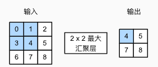

# 3_卷积神经网络(CNN)

## 1. 图像的卷积操作

单层图像的卷积运算如下图所示，其中卷积核为 3×3，步长为 1。


选取合适的卷积核可以进行水平/垂直边缘检测（详见 OpenCV 边缘检测部分）。

### Padding

图像的卷积通常会导致图像的压缩，这一般是需要避免的。如上图所示的卷积，它将一个 6×6 的图像卷积得到 4×4 的图像；一般的，对于 $n×n$ 的图像，$f×f$ 的卷积核大小，1的卷积步长，得到的输出大小就是 $(n-f+1)×(n-f+1)$。

这会导致一些问题：1. 需要重复使用多种卷积核进行特征检测时，每一次卷积后的图像会缩小导致之后的卷积难以进行；2. 图像边缘的信息被大量丢失。

因此需要对图像进行 Padding 操作：


一般使用 0 进行 Padding。填充的圈数可以自定义，这时分为 Valid 卷积（不填充）和 Same 卷积（填充圈数为 $p$）。

填充后的图像大小为 $(n+2p-f+1)×(n+2p-f+1)$，如果需要使得输出和输入大小相等，必须使得 $p = \frac{f-1}{2}$。由此为保证对称性，$f$ 通常设置为奇数。

### 步长

步长为 1 时，卷积核每次平移 1 个像素点；相应的，步长为 $s$ 时，卷积核每次平移 $s$ 个像素。输出图像大小为 $(\frac{n+2p-f}{s}+1)×(\frac{n+2p-f}{s}+1)$。如果不整除，则输出的尺寸均向下取整。

### 三维卷积

三维（RGB）的情况下，卷积核对应的也变为三维：$f×f×3$。扩展到多通道图像（$n_c$ 个通道）时，卷积核也变为对应的维度：$f×f×n_c$，输出的图像维度为：$(\frac{n+2p-f}{s}+1)×(\frac{n+2p-f}{s}+1)×n_c^,$ ，这里的 $n_c^,$ 取决于使用的卷积核个数（比如用垂直边缘卷积核卷积形成通道1，水平边缘卷积核卷积形成通道2）。


## 2. 卷积神经网络

### 卷积层

对于图像处理这类任务，如果只使用全连接层进行识别，将会有十分巨量的参数需要进行训练，需要有大量的 GPU、分布式优化训练的经验和超乎常人的耐心。

使用卷积可以实现参数共享和稀疏连接，极大减少参数训练量。参数共享指的是如果特征检测适用于图片的某个区域，那么它也可能适用于图片的其他区域。稀疏连接指的是卷积运算得到的结果只和卷积核覆盖的区域有关，和区域外像素无关，并不会构成全连接。

使用卷积也可以预防过度拟合。

### 池化层

池化层用于降低卷积层对位置的敏感性，同时降低对空间降采样表示的敏感性。

与卷积层类似，池化层运算符由一个固定形状的窗口组成，该窗口根据其步幅大小在输入的所有区域上滑动，为池化窗口遍历的每个位置计算一个输出。 池化运算是确定的，不需要训练参数，通常计算池化窗口中所有元素的最大值（最大池化）或平均值（平均池化）。

池化的超参数包括窗口大小 $f$ 和步长 $s$ ，通常取 $f=2,s=2$。池化通常不使用 Padding。



### 经典CNN —— LeNet

LeNet 的结构如下：


```python
net = nn.Sequential(
    nn.Conv2d(1, 6, kernel_size=5, padding=2), nn.Sigmoid(),
    nn.AvgPool2d(kernel_size=2, stride=2),
    nn.Conv2d(6, 16, kernel_size=5), nn.Sigmoid(),
    nn.AvgPool2d(kernel_size=2, stride=2),
    nn.Flatten(),
    nn.Linear(16 * 5 * 5, 120), nn.Sigmoid(),
    nn.Linear(120, 84), nn.Sigmoid(),
    nn.Linear(84, 10))
```

