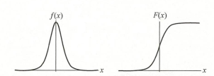

# ML 6_逻辑斯蒂回归(logistic regression)

## 1. 逻辑斯蒂分布

Logistic 分布的分布函数如下所示：
$$
F(x) = P(X \leq x) = \frac{1}{1+e^\frac{-(x-\mu)}{\gamma}}
$$

其图形是一条S形曲线。该曲线以点 $(\mu,\frac{1}{2})$ 中心对称。曲线在中心附近增长速度较快，在两端增长速度较慢。形状参数 $\gamma$ 的值越小，曲线在中心附近增长得越快。

## 2. 二项逻辑斯蒂回归模型

二项逻辑斯谛回归模型是一种分类模型，由条件概率分布 $P(Y|X)$ 表示，形式为参数化的逻辑斯谛分布。这里，随机变量 $X$ 取值为实数，随机变量 $Y$ 取值为1或0。
$$
P(Y=1|x) = \frac{e^{wx+b}}{1+e^{wx+b}} \\
P(Y=0|x) = \frac{1}{1+e^{wx+b}}
$$
对于给定的输入实例，逻辑斯谛回归比较两个条件概率值的大小，将实例 $x$ 分到概率值较大的那一类。

> 一个事件的几率是指该事件发生的概率与其不发生的概率的比值，该事件的对数几率是：
> $$
> logit(p)=\ln \frac{p}{1-p}
> $$
> 将逻辑回归的表达式带入上式得：
> $$
> logit(p)=\ln \frac{\frac{1}{1+e^{-(w^Tx+b)}}}{\frac{e^{-(w^Tx+b)}}{1+e^{-(w^Tx+b)}}}=w^Tx+b
> $$
> 可以看出，输出 $y=1$ 的对数几率是输入 $x$ 的线性组合，即逻辑回归实际上是在对对数几率进行回归，这也是逻辑回归名称的由来。

### 损失函数

1. 设训练集大小为N，则逻辑回归的对数似然函数为：
   $$
   \ln L(w,b)=\ln \prod_{i=1}^Np_i^{y_i}(1-p_i)^{1-y_i}=\sum_{i=1}^N(y_i\ln p_i + (1-y_i)\ln (1-p_i))
   \\=\sum_{i=1}^N(y_i\ln \frac{p_i}{1-p_i}+\ln (1-p_i))=\sum_{i=1}^N(y_i(w^Tx_i+b)-\ln (1+e^{w^Tx_i+b}))
   $$
   使用负对数似然函数的均值作为损失函数，即：
   $$
   Loss(w,b)=-\frac{1}{N}\ln L(w,b)
   $$
   对w和b求偏导得：
   $$
   \frac{\partial Loss(w,b)}{\partial w}=\frac{1}{N}\sum_{i=1}^Nx_i(p_i-y_i)
   \\ \frac{\partial Loss(w,b)}{\partial b}=\frac{1}{N}\sum_{i=1}^N(p_i-y_i)
   $$
   也可以令$z_i=w^Tx_i+b$，通过以下方法进行链式求导：
   $$
   \frac{\partial Loss(w,b)}{\partial w}=\sum_{i=1}^N\frac{\partial Loss(w,b)}{\partial p_i}\frac{\partial p_i}{\partial z_i}\frac{\partial z_i}{\partial w}
   $$
   由于sigmoid函数存在以下性质：
   $$
   \frac{\partial \sigma(z)}{\partial z}=\sigma(z)(1-\sigma(z))
   $$
   所以链式求导也很容易。两种方式结果相同。

