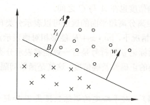

# ML 7_支持向量机(SVM)

支持向量机(support vector machines, SVM)是一种二类分类模型。它的基本模型是定义在特征空间上的**间隔最大的线性分类器**，间隔最大使它有别于感知机；支持向量机还包括核技巧，这使它成为实质上的非线性分类器。

支持向量机的学习策略就是间隔最大化，可形式化为一个求解凸二次规划的问题，也等价于正则化的合页损失函数的最小化问题。

> 1. 当训练数据集线性可分时，通过硬间隔最大化，学习一个线性的分类器，即线性可分支持向量机，又称为硬间隔支持向量机；
> 2. 当训练数据近似线性可分时，通过软间隔最大化，也学习一个线性的分类器，即线性支持向量机，又称为软间隔支持向量机；
> 3. 当训练数据线性不可分时，通过使用核技巧及软间隔最大化，学习非线性支持向量机。

## 1. 线性可分支持向量机

- 线性可分支持向量机的定义

    假设给定一个特征空间上的训练数据集
    $$
    T=\{(x1,y1),(x2,y2),\cdots,(x_N,y_N)\}
    $$
    $x_i$ 为第 $i$ 个特征向量，也称为实例，$y_i$ 为 $x_i$ 的类标记。当 $y_i=+1$ 时，称 $x_i$ 为正例；当$y_i=-1$ 时，称 $x_i$ 为负例。$(x_i,y_i)$ 称为样本点，再假设训练数据集是线性可分的。

    学习的目标是在特征空间中找到一个分离超平面，能将实例分到不同的类。分离超平面对应于方程 $w^Tx+b=0$，它由法向量 $w$ 和截距 $b$ 决定，可用 $(w,b)$ 来表示。

    分离超平面将特征空间划分为两部分，一部分是正类，一部分是负类。法向量指向的
    一侧为正类，另一侧为负类。

    一般地，当训练数据集线性可分时，存在无穷个分离超平面可将两类数据正确分开。感知机利用误分类最小的策略，求得分离超平面，不过这时的解有无穷多个。线性可分支持向量机利用间隔最大化求最优分离超平面，这时，解是唯一的。

- 函数间隔和几何间隔

  1. 函数间隔

     一般来说，一个点距离分离超平面的远近可以表示分类预测的确信程度。在超平面确定的情况下，$|w^Tx+b|$ 能够相对地表示点 $x$ 距离超平面的远近。而 $w^Tx+b$ 的符号与类标记 $y$ 的符号是否一致能够表示分类是否正确。所以可用量 $y(w^Tx+b) = \gamma $ 来表示分类的正确性及确信度，此为函数间隔。

     超平面 $(w,b)$ 关于训练数据集 $T$ 的函数间隔为超平面 $(w,b)$ 关于 $T$ 中所有样本点$(x_i,y_i)$ 的函数间隔之最小值。

     函数间隔可以表示分类预测的正确性及确信度。

     

  2. 几何间隔

     对函数间隔加以规范化可以得到几何间隔：$y(\frac{w^T}{||w||}x+\frac{b}{||w||}) = \gamma $ 

- 最大间隔法

  1. 构造并求解约束最优化问题：
     $$
     \min\frac{1}{2}||w||^2\qquad s.t.,y_if(x_i)\ge1,i=1,2,...,n
     $$

  2. 得到分离超平面：
     $$
     w^{*}x+b^{*} = 0
     $$

  线性可分训练数据集的最大间隔分离超平面是存在且唯一的。
