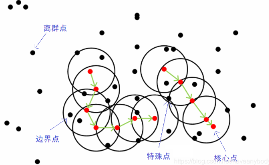
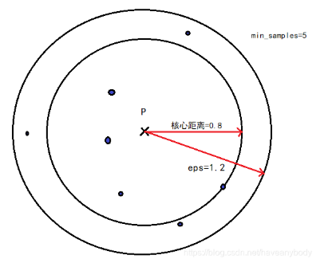
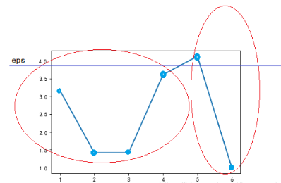

# 8_聚类方法

聚类是针对给定的样本，依据它们特征的相似度或距离，将其归并到若干个类的数据分析问题。一个类是给定样本集合的一个子集。直观上，相似的样本聚集在相同的类，不相似的样本分散在不同的类。

聚类属于无监督学习，因为只是根据样本的相似度或距离将其进行归类，而类或簇事先并不知道。

## 1. 聚类的基本概念

### 基本概念

- 相似度和距离

  聚类的对象是观测数据，或样本集合。假设有 $n$ 个样本，每个样本由 $m$ 个属性的特征向量组成。样本集合可以用矩阵 $X$ 表示。
  $$
  X = [x_{ij}]_{m\times n}
  $$
  矩阵的第 $j$ 列表示第 $j$ 个样本，第 $i$ 行表示第 $i$ 个属性。

  聚类的核心概念是相似度或距离，有多种相似度或距离的定义。因为相似度直接影响聚类的结果，所以其选择是聚类的根本问题。在聚类中，可以将样本集合看作是向量空间中点的集合，以该空间的距离表示样本之间的相似度。

  1. 闵可夫斯基距离
     $$
     d_{ij} = (\sum_{k=1}^m|x_{ki}-x_{kj}|)^{\frac{1}{p}}
     $$
     为样本 $x_i$ 和 $x_j$ 之间的闵可夫斯基距离。当 $p=2$ 时称为欧氏距离，$p=1$ 时称为曼哈顿距离，$p=\infin $ 时称为切比雪夫距离。

     闵可夫斯基距离越大相似度越小，距离越小相似度越大。

  2. 马哈拉诺比斯距离

     马哈拉诺比斯距离考虑各个分量(特征)之间的相关性并与各个分量的尺度无关。
     $$
     d_{ij} = ((x_i-x_j)^TS^{-1}(x_i-x_j))^{\frac{1}{2}}
     $$
     $S$ 为协方差矩阵。马哈拉诺比斯距离越大相似度越小，距离越小相似度越大。

  3. 相关系数
     $$
     r_{ij} = \frac{\sum_{k=1}^m (x_{ki}-\overline x_i )(x_{kj}-\overline x_j )}{(\sum_{k=1}^m (x_{ki}-\overline x_i )^2 \sum_{k=1}^m (x_{kj}-\overline x_j )^2)^{\frac{1}{2}}}
     $$
     相关系数的绝对值越接近于1，表示样本越相似；越接近于0，表示样本越不相似。

- 类或簇

  通过聚类得到的类或簇，本质是样本的子集。如果一个聚类方法假定一个样本只能属于一个类，或类的交集为空集，那么该方法称为**硬聚类方法**。否则，如果一个样本可以属于多个类，或类的交集不为空集，那么该方法称为**软聚类方法**。

  > 设 $T$ 为给定的正数，若集合 $G$ 中任意两个样本 $x_i$ ，$x_j$，有 $d_{ij} \leq T$，则 $G$ 为一个类或簇。

  1. 类的均值 $\overline x_G$，又称为类的中心：
     $$
     \overline x_G  =\frac{1}{n_G}\sum_{i=1}^{n_G}x_i
     $$

  2. 类的直径 $D_G$，类中任意两个样本之间的最大距离。

  3. 类的样本散布矩阵 $A_G$ 与样本协方差矩阵 $S_G$。

- 类的距离

  1. 最短距离或单连接：样本之间的最短距离为两类之间的距离；
  2. 最长距离或完全连接：样本之间的最长距离为两类之间的距离；
  3. 中心距离：$\overline x_p$ 与 $\overline x_q$ 之间的距离为两类之间的距离；
  4. 平均距离：任意两个样本之间距离的平均值为两类之间的距离。

### 评价标准

#### 无监督评价

1. **轮廓系数 Silhouette Coefficient**

   定义 $a$ 为一个样本与同一簇类中的其他样本点的平均距离；$b$ 为一个样本与距离最近簇类中所有样本点的平均距离；则一个样本的轮廓系数为：
   $$
   s = \frac{b-a}{\max(a,b)}
   $$
   一组数据集的轮廓系数等于该数据集中每一个样本轮廓系数的平均值。轮廓系数处于 $[-1,1]$ 的范围内，-1表示错误的聚类，1表示高密度的聚类，0附近表示重叠的聚类。

   对于凸面聚类而言，轮廓系数通常比其他聚类概念要高。

2. **Calinski-Harabasz 指数**

   指标要求同一簇类的数据集尽可能密集，不同簇类的数据集尽可能远离。对于一组数据集（$N$ 个数据），聚类为 $K$ 个类，定义Calinski-Harabasz 指数为簇间离散均值与簇内离散度的比值：
   $$
   s = \frac{tr(B_K)}{tr(W_K)}\frac{N-K}{K-1}
   $$
   $tr(B_K)$ 为簇间离散矩阵的迹，$tr(W_K)$ 为簇内离散矩阵的迹：
   $$
   W_K = \sum_{q=1}^K\sum_{x\in C_q}(x-\mu_q)(x-\mu_q)^T \\
   B_K = \sum_{q=1}^K N_q(\mu_q-\mu)(\mu_q-\mu)^T
   $$
   $C_q$ 为类 $q$ 中的样本集合，$\mu_q$ 为类 $q$ 的中心，$\mu$ 为数据集的中心，$N_q$ 为类 $q$ 的样本数。$tr(W_K)$ 表示同一簇类的密集程度，迹越小，同一簇类的数据集越密集（方差越小）；$tr(B_K)$ 表示不同簇间的远离程度，迹越大，不同簇间的远离程度越大（方差越大），所以当簇内密集且簇间分离较好时，Caliniski-Harabaz 指数越高，聚类性能越好。凸簇的 Caliniski-Harabaz 指数一般要高于其它类型。

3. **Davies-Bouldin 指数**

   $R_{ij}$ 表示类 $i$ 和类 $j$ 的相似度：
   $$
   R_{ij} = \frac{s_i+s_j}{d_{ij}}
   $$
   $s_i$ 表示类 $i$ 内每个样本和簇心之间的平均距离，$d_{ij}$ 表示类 $i$ 和类 $j$ 之间的簇心距离。
   $$
   s = \frac{1}{K}\sum_{i=1}^K\max_{i≠j}R_{ij}
   $$
   凸簇的 Davies-Bouldin 指数比其他类型的簇高。

#### 有监督评价

有监督评价指标也叫外部指标，需要知道样本所属的实际类别，这里要区别于有监督算法，只是在评价阶段需要标签，实际应用较少。

1. **兰德系数 RI**

   定义 $a$ 表示聚类类别和实际类别一样的样本对个数，定义 $b$ 表示聚类类别和实际类别不一样的样本对个数，定义 $N$ 为样本数，则定义兰德系数为：
   $$
   RI = \frac{a+b}{C_N^2}
   $$
   RI 的取值范围为 $[0,1]$，越大表示越相似。

2. **调整兰德系数 ARI**

   RI 系数的缺点是随着聚类数的增加，随机分配簇类向量的 RI 也逐渐增加，这是不符合理论的，随机分配簇类标记向量的 RI 应为 0。ARI 解决了 RI 不能很好的描述随机分配簇类标记向量的相似度问题，ARI 的定义：
   $$
   ARI = \frac{RI-E(RI)}{\max RI-E(RI)}
   $$
   ARI 的取值范围为$[-1,1]$，ARI 越大表示预测簇向量和真实簇向量相似度越高，ARI 接近于 0 表示簇向量是随机分配，ARI 为负数表示效果非常差。从广义的角度来讲，ARI 衡量的是两个数据分布的吻合程度。

3. **互信息 MI**

4. **同质性，完整性，V-measure**

   同质性（homogeneity）衡量每个簇只包含单个类成员：
   $$
   h = 1- \frac{H(C|K)}{H(C)} 
   $$
   完整性（completeness）衡量某个类的所有成员分配给同一簇类：
   $$
   c = 1-\frac{H(K|C)}{H(K)}
   $$
   $H(C|K)$ 为给定簇分配的类的条件熵，计算方法为:
   $$
   H(C|K) = -\sum_{c=1}^{|C|}\sum_{k=1}^{|K|}\frac{N_{c,k}}{N}log(\frac{N_{c,k}}{N_k})
   $$
   $H(C)$ 是各类别的熵：
   $$
   H(C) = -\sum_{c=1}^{|C|}\frac{N_{c}}{N}log(\frac{N_{c}}{N})
   $$
   $N$ 表示样本总数，$N_c$ 和 $N_k$ 分别表示属于类 $c$ 和类 $k$ 的样本个数，最后 $N_{c,k}$ 表示属于类 $c$ 的样本归到类 $k$ 的样本个数。

   V-meansure 是同质性和完整性的调和平均：
   $$
   v = \frac{(1+\beta)hc}{\beta h+c}
   $$
   0 表示相似度最低，1 表示相似度最高，分数与相似度成正相关的关系。

5. **Fowlkes-Mallows 指数**

   成对准确率和召回率的几何平均值：
   $$
   FMI = \frac{TP}{\sqrt{(TP+FP)(TP+FN)}}
   $$
   其中 $TP$ 是真正例（True Positive），即真实标签和预测标签属于相同簇类的样本对个数；FP是假正例（False Positive），即真实标签属于同一簇类，相应的预测标签不属于该簇类的样本对个数；$FN$ 是假负例（False Negative），即预测标签属于同一簇类，相应的真实标签不属于该簇类的样本对个数。
   FMI 范围为 $[0,1]$，值接近于0表示随机分配的标签在很大程度上是相互独立的，接近于1表示一致的簇向量。

6. **Contingency Matrix 和 Pair Confusion Matrix**

## 2. 层次聚类

层次聚类假设类别之间存在层次结构，将样本聚到层次化的类中。

层次聚类又有聚合或自下而上聚类、分裂或自上而下聚类两种方法。

> 聚合聚类开始将每个样本各自分到一个类；之后将**相距最近的两类合并**，建立一个新的类，重复此操作直到满足停止条件；得到层次化的类别。
>
> 分裂聚类开始将所有样本分到一个类；之后将已有类中**相距最远的样本分到两个新的类**，重复此操作直到满足停止条件；得到层次化的类别。

> ***聚合聚类算法：***
>
> 1. 计算 $n$ 个样本两两之间的欧氏距离，记作矩阵$D=[d_{ij}]$；
> 2. 构造 $n$ 个类，每个类只包含一个样本；
> 3. 合并类间距离最小的两个类，构建一个新类；
> 4. 计算新类与当前各类的距离。若类的个数为1，终止计算，否则回到步骤3。

层次聚类适用于那些簇的数量不明确或数据具有自然层次结构的场景。

## 3. K 均值聚类(K-Means)

> ***K-Means 聚类算法：***
>
> 1. 随机选择 $K$ 个点 $\mu_1,\mu_2,...,\mu_K$ 作为聚类中心；
> 2. 对于数据集中的 $N$ 个点 $x_1,x_2,...,x_N$，分别计算每个点与所有聚类中心的距离并将其归入距离最近的一个类簇；
> 3. 计算每个类簇内所有点的均值作为该类簇新的聚类中心；
> 4. 重复上述步骤直到聚类中心不再变化或者变化不大。

- K-Means 的优缺点：
  - 优点：计算简单，速度快；
  - 缺点：
    1. 必须指定聚类数目 $K$；
    2. 可能找到的是局部最优而非全局最优；
    3. 算法不稳定，尤其是受初始中心点的选择影响较大；
    4. 容易受噪音点影响；
    5. 对于不是凸的数据集比较难收敛，很难发现任意形状的簇；
    6. 如果各隐含类别的数据不平衡，比如各隐含类别的数据量严重失衡，或者各隐含类别的方差不同，则聚类效果不佳。

> - K-Means++ 改进了 K-Means 初始聚类中心的选择方法，首先从数据集中随机选取一个样本点作为初始聚类中心；接着计算每个样本与当前已有聚类中心之间的最短距离（即最近的聚类中心的距离），值越大被选择作为下一个聚类中心的概率越大；重复选取 $K$ 个聚类中心。这样做能够让初始的聚类中心分布更加均匀。
>
> - K-Medians 用数据集的中位数而不是均值来计算数据的中心点。K-Medians 的优势是使用中位数来计算中心点不受异常值的影响；缺点是计算中位数时需要对数据集中的数据进行排序，速度相对于 K-Means 较慢。
>   
> - Mini Batch K-Means 适合在数据规模很大的时候使用，每次使用小批次数据进行 K-Means 更新聚类中心直到算法稳定。

- $K$ 的选取方法 —— 手肘法

  将每个簇的质心与簇内样本点的平方距离误差和称为畸变程度，对于一个簇，它的畸变程度越低，代表簇内成员越紧密，畸变程度越高，代表簇内结构越松散。畸变程度会随着类别的增加而降低，但对于有一定区分度的数据，在达到某个临界点时畸变程度会得到极大改善，之后再增加类别数 $K$ 畸变程度的下降就会变得相对缓慢，这个临界点就可以考虑作为聚类性能较好的 $K$ 选择点。

  定义指标 $SSE$：
  $$
  SSE = \sum_{i=1}^{K}\sum_{p\in C_i}(p-\mu_i)^2
  $$
  $i$ 表示第 $i$ 个簇，$p$ 是簇 $C_i$ 的样本点，$\mu_i$ 是簇 $C_i$ 的质心，$SSE$ 是所有样本的聚类误差。

## 4. DBSCAN 聚类

DBSCAN 是一种基于密度的空间聚类算法。该算法**将具有足够密度的区域划分为簇**，并在具有噪声的空间数据库中发现任意形状的簇，它将簇定义为密度相连的点的最大集合。

- 密度定义

  DBSCAN 基于一组邻域来描述样本集的紧密程度，假定样本集为 $D \in \{x_1,x_2,\cdots x_m\}$。

  > 1. eps-邻域：对于 $x_i \in D$，其 eps-邻域包括样本集中与 $x_i$ 的距离不大于 eps 的子样本集，这个子样本集的个数为 $N_i$；
  > 2. 核心对象：对于任意样本 $x_i \in D$，如果其 eps-邻域对应的 $N_i$ 不小于一个阈值 $m$，则 $x_i$ 称为核心对象。
  > 3. 密度直达：如果 $x_j$ 在 $x_i$ 的 eps-邻域中且 $x_i$ 为核心对象，则 $x_i$ 由 $x_j$ 密度直达。
  > 4. 密度可达：对于 $x_i$ 和 $x_j$ ，如果存在序列 $p_1,p_2,\cdots,p_r$，且 $p_1 = x_i$ ，$p_r = x_j$，且 $p_{t+1}$ 由 $p_t$ 密度直达，则 $x_j$ 由 $x_i$ 密度可达。密度可达不满足对称性，可以由密度直达的不对称性得出。
  > 5. 密度相连：对于 $x_i$ 和 $x_j$，如果存在核心样本 $x_k$，使得 $x_i$ 和 $x_j$ 由 $x_k$ 密度可达，则 $x_i$ 和 $x_j$ 密度相连。密度相连满足对称性。
  >
  > 
  
- DBSCAN 聚类过程

  由密度可达关系导出的最大密度相连的样本集合，即为最终聚类的一个类别。任意一个 DBSACN 簇都至少有一个核心对象，如果有多于一个核心对象，则这些核心对象必然可以组成密度可达序列。

  选择一个没有类别的核心对象作为种子，然后找到所有这个核心对象能够密度可达的样本集合，即为一个聚类簇。接着继续选择另一个没有类别的核心对象去寻找密度可达的样本集合，这样就得到另一个聚类簇。一直运行到所有核心对象都有类别为止。
  
  聚类完成后，样本集中的点一般可以分为三类：核心点，边界点和离群点（异常点）。边界点是簇中的非核心点，离群点就是样本集中不属于任意簇的样本点。此外，在簇中还有一类特殊的样本点，该类样本点可以由两个核心对象密度直达，但是这两个核心对象又不能密度可达（属于两个簇），该类样本的最终划分簇一般由算法执行顺序决定，即先被划分到哪个簇就属于哪个簇，也就是说DBSCAN的算法不是完全稳定的算法。
  
- DBSCAN 优缺点

  - 不需要预先指定聚类数量，可以对任意形状的稠密数据集进行聚类；
  - 可以在聚类的同时发现异常点，对数据集中的异常点不敏感。
  - 如果样本集的密度不均匀、聚类间距差相差很大时，聚类质量较差；
  - 如果样本集较大时，聚类收敛时间较长；
  - eps 越大，得到的簇数也就越少，得到的簇就越大，离群点就越少；$m$ 越大，离群点越多，得到的簇越小。

- DBSCAN 的优化 —— OPTICS

  OPTICS 算法的提出就是为了帮助 DBSCAN 算法选择合适的参数，降低输入参数的敏感度。OPTICS并不显式的生成数据聚类结果，只是对数据集中的对象进行排序，得到一个有序的对象列表，通过该有序列表，可以得到一个决策图，通过决策图可以选择不同的 eps 参数进行 DBSCAN 聚类。

  > 1. 核心距离：对于一个给定的核心对象 $x_i$，使得 $x_i$ 成为核心对象的最小邻域距离 $r$ 就是 $x_i$ 的核心距离。
  > 2. 可达距离：如果 $x_i$ 是核心对象，则对象 $x_j$ 到对象 $x_i$ 的可达距离就是 $x_j$ 到 $x_i$ 的欧氏距离和 $x_i$ 的核心距离的最大值，如果 $x_i$ 不是核心对象，则 $x_j$ 和 $x_i$ 之间的可达距离就没有意义。

  

  - OPTICS 算法流程：

    1. 已知数据集 $D$，创建两个队列，有序队列 $O$ 和结果队列 $R$（有序队列用来存储核心对象及其该核心对象的密度直达对象，并按可达距离升序排列；结果队列用来存储样本点的输出次序。可以把有序队列里面放的理解为待处理的数据，而结果队列里放的是已经处理完的数据）。

    2. 如果 $D$ 中所有点都处理完毕或者不存在核心点，则算法结束。否则，选择一个未处理（即不在结果队列 $R$ 中）且为核心对象的样本点 $p$，首先将 $p$ 放入结果队列 $R$ 中，并从 $D$ 中删除 $p$。然后找到 $D$ 中 $p$ 的所有密度直达样本点 $x$，计算 $x$ 到 $p$ 的可达距离，如果 $x$ 不在有序队列 $O$ 中，则将 $x$ 以及可达距离放入 $O$ 中，若 $x$ 在 $O$ 中，则如果 $x$ 新的可达距离更小，则更新 $x$ 的可达距离，最后对 $O$ 中数据按可达距离从小到大重新排序。

    3. 如果有序队列 $O$ 为空，则回到步骤2，否则取出 $O$ 中第一个样本点 $y$（即可达距离最小的样本点），放入 $R$ 中，并从 $D$ 和 $O$ 中删除 $y$。如果 $y$ 不是核心对象，则重复步骤 3（即找 $O$ 中剩余数据可达距离最小的样本点）；如果 $y$ 是核心对象，则找到 $y$ 在 $D$ 中的所有密度直达样本点，并计算到 $y$ 的可达距离，然后按照步骤 2 将所有 $y$ 的密度直达样本点更新到 $O$ 中。

    4. 重复步骤2、3，直到算法结束。最终可以得到一个有序的输出结果，以及相应的可达距离。

    5. 按照最终的输出顺序绘制可达距离图，在波谷之间选择合适的 eps 分隔值，可以聚类为合适的类别。

       

  
