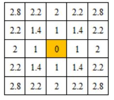
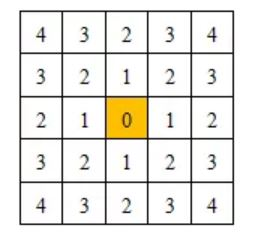
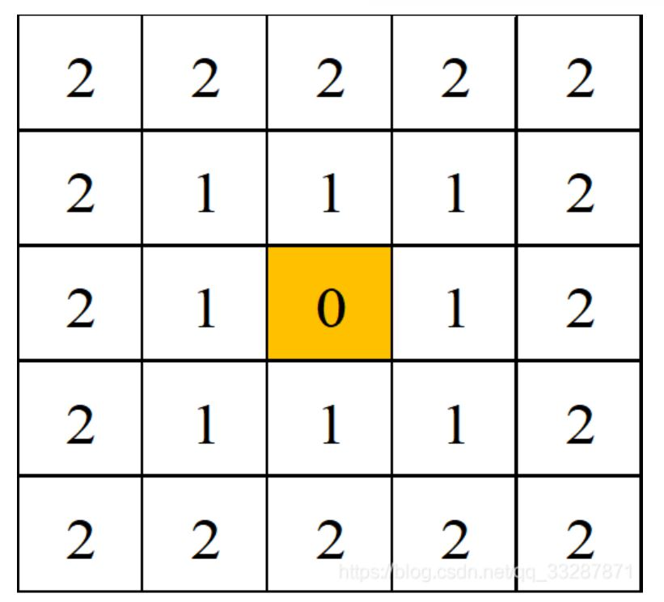

# OpenCV 10_图像距离

## 1. 欧氏距离

两个像素点之间的直线距离。与直角坐标系中两点之间的直线距离求取方式相同，分别计算两个像素在X方向和Y方向上的距离，之后利用勾股定理得到两个像素之间的距离。

$$
d = \sqrt{(x_1-x_2)^2+(y_1-y_2)^2}
$$



## 2. 街区距离

两个像素点X方向和Y方向的距离之和。

$$
d = |x_1-x_2|+|y_1-y_2|
$$



## 3. 棋盘距离


两个像素点X方向距离和Y方向距离的最大值。与街区距离相似，棋盘距离也是假定两个像素点之间不能够沿着连线方向靠近，像素点只能沿着X方向和Y方向移动，但是棋盘距离并不是表示由一个像素点移动到另一个像素点之间的距离，而是表示两个像素点移动到同一行或者同一列时需要移动的最大距离。

$$
d = max\{|x_1-x_2|,|y_1-y_2|\}
$$



```c++
void cv::distanceTransform(InputArray  src,
                           OutputArray  dst,
                           OutputArray  labels,
                           int  distanceType,
                           int  maskSize,
                           int  labelType = DIST_LABEL_CCOMP 
                          );
```


该函数原型在对图像进行距离变换的同时会生成Voronoi图，但是有时只是为了实现对图像的距离变换，并不需要使用Voronoi图，而使用该函数必须要求创建一个Mat类变量用于存放Voronoi图，占用了内存资源。
```c++
void distanceTransform(InputArray  src, 
                       OutputArray  dst,
                       int  distanceType, 
                       int  maskSize, 
                       int  dstType = CV_32F
                      );
```
>src：输入图像，数据类型为CV_8U的单通道图像
>
>dst：输出图像，与输入图像具有相同的尺寸，数据类型为CV_8U或者CV_32F的单通道图像。
>
>distanceType：选择计算两个像素之间距离方法的标志。
>
>maskSize：距离变换掩码矩阵的大小，参数可以选择的尺寸为DIST_MASK_3（3×3）和DIST_MASK_5（5×5）。
>
>dstType：输出图像的数据类型，可以是CV_8U或者CV_32F。

>diatanceType|含义
>-|-
>dist_L1|计算街区距离
>dist_L2|计算欧氏距离
>dist_C|计算棋盘距离