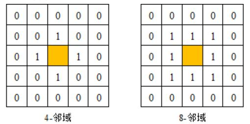
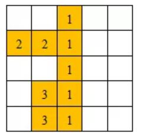
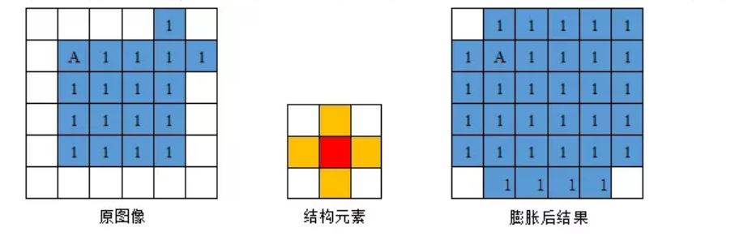
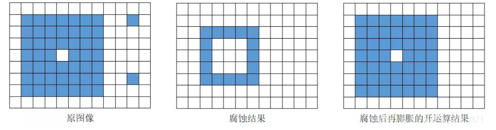
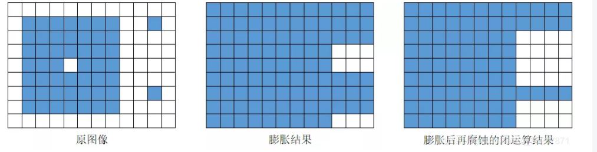
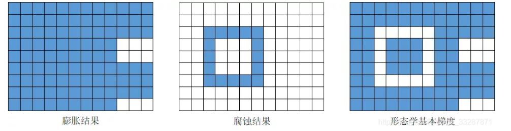
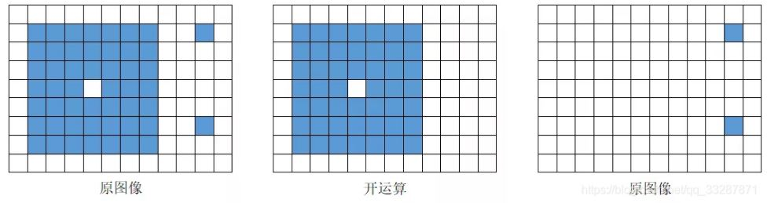
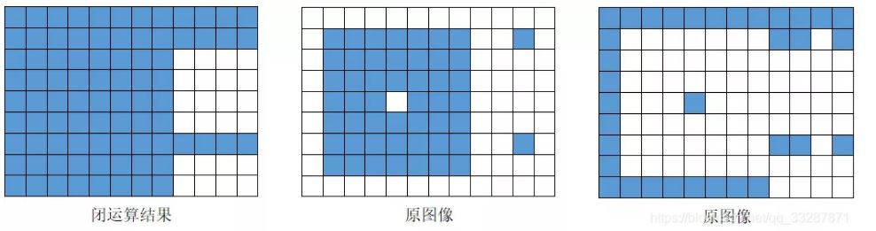
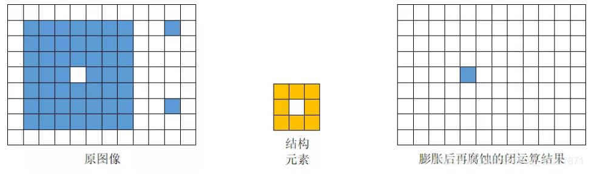

# OpenCV 11_连通域分析和形态学分析

## 1. 连通域分析
**图像的连通域是指图像中具有相同像素值并且位置相邻的像素组成的区域**，连通域分析是指在图像中寻找出彼此互相独立的连通域并将其标记出来。

为了防止像素值波动对提取不同连通域的影响，连通域分析常处理的是二值化后的图像。

- 图像的邻域

图像中两个像素相邻有两种定义方式，分别是**4-邻域**和**8-邻域**。



根据两个像素相邻的定义方式不同，得到的连通域也不相同，因此在分析连通域的同时，一定要声明是在哪种邻域条件下分析得到的结果。

- 两遍扫描法

两遍扫描法会遍历两次图像，第一次遍历图像时会给每一个非0像素赋予一个数字标签，当某个像素的上方和左侧邻域内的像素已经有数字标签时，取两者中的最小值作为当前像素的标签，否则赋予当前像素一个新的数字标签。



第一次遍历图像的时候同一个连通域可能会被赋予一个或者多个不同的标签，第二次遍历需要将这些属于同一个连通域的不同标签合并，最后实现同一个邻域内的所有像素具有相同的标签。

- 种子填充法

种子填充法源于计算机图像学，常用于对某些图形进行填充。该方法首先将所有非0像素放到一个集合中，之后在集合中随机选出一个像素作为种子像素，根据邻域关系不断扩充种子像素所在的连通域，并在集合中删除掉扩充出的像素，直到种子像素所在的连通域无法扩充，之后再从集合中随机选取一个像素作为新的种子像素，重复上述过程直到集合中没有像素。

```c++
int cv::connectedComponents(InputArray  image,
                            OutputArray  labels,
                            int  connectivity,
                            int  ltype,
                            int  ccltype 
                           );
```

>image：待标记不同连通域的单通道图像，数据类型必须为CV_8U。
>
>labels：标记不同连通域后的输出图像，与输入图像具有相同的尺寸。
>
>connectivity：标记连通域时使用的邻域种类，4表示4-邻域，8表示8-邻域。
>
>ltype：输出图像的数据类型，目前支持CV_32S和CV_16U两种数据类型。
>
>ccltype：标记连通域时使用的算法类型标志

>ccltype|值|含义
>-|-|-
>CCL_WU|0|8-邻域SAUF算法，4-邻域SAUF算法
>CCL_DEFAULT|-1|8-邻域BBDT算法，4-邻域SAUF算法
>CCL_GRANA|1|8-邻域BBDT算法，4-邻域SAUF算法

该函数用于计算二值图像中连通域的个数，并在图像中将不同的连通域用不同的数字标签标记出，其中标签0表示图像中的背景区域，同时函数具有一个`int`类型的返回数据，用于表示图像中连通域的数目。

```C++
int cv::connectedComponentsWithStats(InputArray  image,
                                     OutputArray  labels,
                                     OutputArray  stats,
                                     OutputArray  centroids,
                                     int  connectivity,
                                     int  ltype,
                                     int  ccltype 
                                    );
```

>image：待标记不同连通域的单通道图像，数据类型必须为CV_8U。
>
>labels：标记不同连通域后的输出图像，与输入图像具有相同的尺寸。
>
>stats：含有不同连通域统计信息的矩阵，矩阵的数据类型为CV_32S。矩阵中第i行是标签为i的连通域的统计特性。
>
>centroids：每个连通域的质心坐标，数据类型为CV_64F。
>
>connectivity：标记连通域时使用的邻域种类，4表示4-邻域，8表示8-邻域。
>
>ltype：输出图像的数据类型，目前支持CV_32S和CV_16U两种数据类型。
>
>ccltype：标记连通域使用的算法类型标志。

第三个参数为每个连通域统计信息矩阵，如果图像中有N个连通域，那么该参数输出的矩阵尺寸为N×5，矩阵中每一行分别保存每个连通域的统计特性.

>stats|列值|含义
>-|-|-
>CC_STAT_LEFT|0|连通域内最左侧像素x坐标
>CC_STAT_TOP|1|连通域内最上侧像素y坐标
>CC_STAT_WIDTH|2|连通域边界框水平长度
>CC_STAT_HEIGHT|3|连通域边界框的垂直长度
>CC_STAT_AREA|4|连通域面积
>CC_STAT_MAX|5|统计信息种类数目

## 2. 图像腐蚀和膨胀
### 2.1 图像腐蚀

图像的腐蚀过程与图像的卷积操作类似，都需要模板矩阵来控制运算的结果，在图像的腐蚀和膨胀中这个模板矩阵被称为结构元素。与图像卷积相同，结构元素可以任意指定图像的中心点，并且结构元素的尺寸和具体内容都可以根据需求自己定义。**定义结构元素之后，将结构元素的中心点依次放到图像中每一个非0元素处，如果此时结构元素内所有的元素所覆盖的图像像素值均不为0，则保留结构元素中心点对应的图像像素，否则将删除结构元素中心点对应的像素。**


```c++
//结构元素生成函数
Mat cv::getStructuringElement(int  shape,
                              Size  ksize,
                              Point  anchor = Point(-1,-1) 
                             );
```
>shape：结构元素的种类。
>
>ksize：结构元素的尺寸大小
>
>anchor：中心点的位置，默认参数为结构元素的几何中心点。

一般情况下，结构元素的种类相同时，结构元素的尺寸越大腐蚀效果越明显。函数的最后一个参数是结构元素的中心点，只有十字结构元素的中心点位置会影响图像腐蚀后的轮廓形状，其他种类的结构元素的中心点位置只影响形态学操作结果的平移量。

>shape|值|含义
>-|-|-
>MORPH_RECT|0|矩形结构元素，所有值为1
>MORPH_CROSS|1|十字结构元素，所有值为1
>MORPH_ELLIPSE|2|椭圆结构元素，所有值为1
```c++
//腐蚀函数
void cv::erode(InputArray  src,
               OutputArray  dst,
               InputArray  kernel,
               Point  anchor = Point(-1,-1),
               int  iterations = 1,
               int  borderType = BORDER_CONSTANT,
               const Scalar &  borderValue = morphologyDefaultBorderValue() 
               );
```
>src：输入的待腐蚀图像，图像的通道数可以是任意的，但是图像的数据类型必须是CV_8U，CV_16U，CV_16S，CV_32F或CV_64F之一。
>
>dst：腐蚀后的输出图像，与输入图像src具有相同的尺寸和数据类型。
>
>kernel：用于腐蚀操作的结构元素，可以自己定义，也可以用`getStructuringElement()`函数生成。
>
>anchor：中心点在结构元素中的位置，默认参数为结构元素的几何中心点。
>iterations：腐蚀的次数，默认值为1。
>
>borderType：像素外推法选择标志。默认参数为BORDER_DEFAULT，表示不包含边界值倒序填充。
>
>borderValue：使用边界不变外推法时的边界值。


该函数的腐蚀过程只针对图像中的非0像素，因此如果图像是以0像素为背景，那么腐蚀操作后会看到图像中的内容变得更瘦更小；如果图像是以255像素为背景，那么腐蚀操作后会看到图像中的内容变得更粗更大。

### 2.2 图像膨胀

结构元素可以任意指定结构的中心点，并且结构元素的尺寸和具体内容都可以根据需求自己定义。定义结构元素之后，将结构元素的中心点依次放到图像中每一个非0元素处，**如果原图像中某个元素被结构元素覆盖，但是该像素的像素值不与结构元素中心点对应的像素点的像素值相同，那么将原图像中的该像素的像素值修改为结构元素中心点对应点的像素值。**



```c++
void cv::dilate(InputArray  src,
                OutputArray  dst,
                InputArray  kernel,
                Point  anchor = Point(-1,-1),
                int  iterations = 1,
                int  borderType = BORDER_CONSTANT,
                const Scalar &  borderValue = morphologyDefaultBorderValue()
               );
```
>src：输入的待膨胀图像，图像的通道数可以是任意的，但是图像的数据类型必须是CV_8U，CV_16U，CV_16S，CV_32F或CV_64F之一。
>
>dst：膨胀后的输出图像，与输入图像src具有相同的尺寸和数据类型。
>
>kernel：用于膨胀操作的结构元素，可以自己定义，也可以用getStructuringElement()函数生成。
>
>anchor：中心点在结构元素中的位置，默认参数为结构元素的几何中心点
>
>iterations：膨胀的次数，默认值为1。
>
>borderType：像素外推法选择标志，表示不包含边界值倒序填充。
>
>borderValue：使用边界不变外推法时的边界值。

如果图像是以0像素为背景，那么膨胀操作后会看到图像中的内容变得更粗更大；如果图像是以255像素为背景，那么膨胀操作后会看到图像中的内容变得更细更小。

### 2.3 形态学运算

图像形态学腐蚀可以将细小的噪声区域去除，但是会将图像主要区域的面积缩小，造成主要区域的形状发生改变；图像形态学膨胀可以扩充每一个区域的面积，填充较小的空洞，但是同样会增加噪声的面积。根据两者的特性将图像腐蚀和膨胀适当的结合，便可以既去除图像中的噪声，又不缩小图像中主要区域的面积；既填充了较小的空洞，又不增加噪声所占的面积。
```c++
void cv::morphologyEx(InputArray  src,
                      OutputArray  dst,
                      int  op,
                      InputArray  kernel,
                      Point  anchor = Point(-1,-1),
                      int  iterations = 1,
                      int  borderType = BORDER_CONSTANT,
                      const Scalar &  borderValue = morphologyDefaultBorderValue()  
                     );
```
>src：输入图像，图像的通道数可以是任意的，但是图像的数据类型必须是CV_8U，CV_16U，CV_16S，CV_32F或CV_64F之一。
>
>dst：形态学操作后的输出图像，与输入图像具有相同的尺寸和数据类型。
>
>op：形态学操作类型的标志。
>
>kernel：结构元素，可以自己生成，也可以用`getStructuringElement()`函数生成。
>
>anchor：中心点在结构元素中的位置，默认参数为结构元素的几何中心点。
>
>iterations：处理的次数
>
>borderType：像素外推法选择标志。默认参数为BORDER_DEFAULT，表示不包含边界值倒序填充。
>
>borderValue：使用边界不变外推法时的边界值。

>op|值|含义
>-|-|-
>MORPH_ERODE|0|图像腐蚀
>MORPH_DILATE|1|图像膨胀
>MORPH_OPEN|2|开运算
>MORPH_CLOSE|3|闭运算
>MORPH_GRADIENT|4|形态学梯度
>MORPH_TOPHAT|5|顶帽运算
>MORPH_BLACKHAT|6|黑帽运算
>MORPH_HITMISS|7|击中击不中变换

1. 开运算

图像开运算可以去除图像中的噪声，消除较小连通域，保留较大连通域，同时能够在两个物体纤细的连接处将两个物体分离，并且在不明显改变较大连通域的面积的同时能够平滑连通域的边界。开运算是图像腐蚀和膨胀操作的结合。



2. 闭运算

图像闭运算可以去除连通域内的小型空洞，平滑物体轮廓，连接两个临近的连通域。闭运算是图像膨胀和腐蚀操作的结合，首先对图像进行膨胀，填充连通域内的小型空洞，扩大连通域的边界，将临近的两个连通域连接，之后通过腐蚀运算减少由膨胀运算引起的连通域边界的扩大以及面积的增加。



3. 形态学梯度

形态学梯度能够描述目标的边界，根据图像腐蚀和膨胀与原图之间的关系计算得到，形态学梯度可以分为基本梯度、内部梯度和外部梯度。基本梯度是原图像膨胀后图像和腐蚀后图像间的差值图像，内部梯度图像是原图像和腐蚀后图像间的差值图像，外部梯度是膨胀后图像和原图像间的差值图像。



4. 顶帽运算

图像顶帽运算是**原图像与开运算结果之间的差值**，往往用来分离比邻近点亮一些的斑块，因为开运算带来的结果是放大了裂缝或者局部低亮度的区域，因此，**从原图中减去开运算后的图，得到的效果图突出了比原图轮廓周围的区域更明亮的区域**。



5. 黑帽运算

黑帽运算是原图像与闭运算结果之间的差值，往往用来分离比邻近点暗一些的斑块。顶帽运算先对图像进行闭运算，之后从原图像中减去闭运算计算的结果



6. 击中击不中变换

击中击不中变换是比图像腐蚀要求更加苛刻的一种形态学操作，图像腐蚀只需要图像能够将结构元素中所有非0元素包含即可，但是击中击不中变换要求原图像中需要存在与结构元素一模一样的结构，即结构元素中非0元素也需要同时被考虑。

