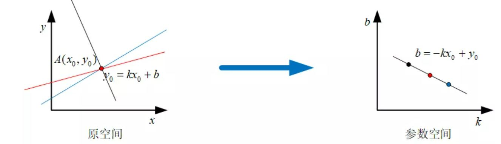
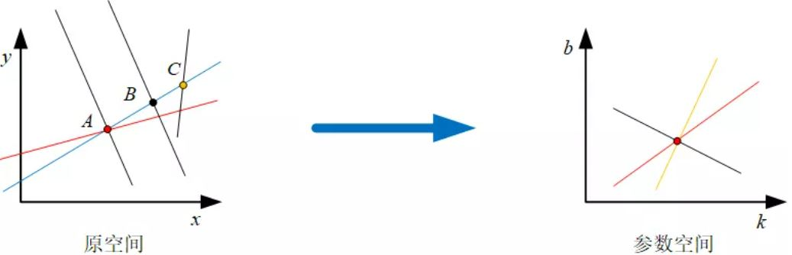
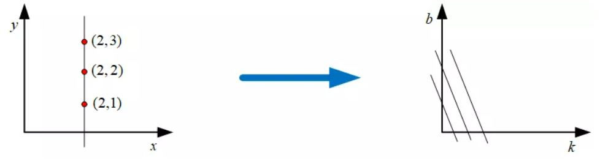
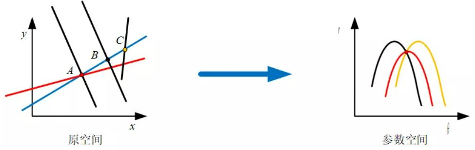
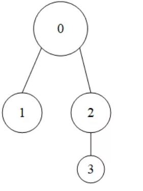

# OpenCV 12_轮廓分析

## 1. 直线检测与拟合

- 霍夫变换

霍夫变换通过将图像中的像素在一个空间坐标系中变换到另一个坐标空间坐标系中，使得在原空间中具有形同特性的曲线或者直线映射到另一个空间中形成峰值，从而把检测任意形状的问题转化为统计峰值的问题。

检测步骤：
1. 将参数空间的坐标轴离散化；
2. 将每个非0像素通过映射关系求取在参数空间通过的方格；
3. 统计参数空间内每个方格出现的次数，选取次数大于某一阈值的方格作为直线的方格；
4. 将参数空间中表示直线的方格的参数作为图像中直线的参数。

>在图像空间x-y直角坐标系中，对于直线可以用解析式来表示。
>$$
y = kx+b
>$$
>其中k是直线的斜率，b是直线的截距。假设图像中存在一像素点$A(x0,y0)$，所有经过这个像素点直线可以用下式表示。
>$$
y_0 = kx_0 + b
>$$
>如果将$x_0$和$y_0$看作是变量， $k$和$b$表示定值，那么上式可以表示在k-b空间的一条直线
>
>
>>- **图像空间中的每条直线在参数空间中都对应着单独一个点来表示；**
>>
>>- **图像空间中的直线上任何像素点在参数空间对应的直线相交于同一个点。**
>
>通过霍夫变换寻找图像中的直线就是寻找参数空间中大量直线相交的一点。
>
>
>但是当图像中存在垂直直线时，即所有的像素点的x坐标相同时，直线上的像素点利用上述霍夫变换方法得到的参数空间中多条直线互相平行，无法相交于一点。
>
>
>为了解决垂直直线在参数空间没有交点的问题，一般采用极坐标方式表示图像空间x-y直角坐标系中的直线
>$$
r = xcos\theta + ysin\theta
>$$
>根据霍夫变换原理，利用极坐标形式表示直线时，在图像空间中经过某一点的所有直线映射到参数空间中是一个正弦曲线。图像空间中直线上的两个点在参数空间中映射的两条正弦曲线相交于一点
>
>

```c++
//标准霍夫变换函数
void cv::HoughLines(InputArray  image,
                    OutputArray  lines,
                    double  rho,
                    double  theta,
                    int  threshold,
                    double  srn = 0,
                    double  stn = 0,
                    double  min_theta = 0,
                    double  max_theta = CV_PI 
                   );
```
>image：待检测直线的原图像，必须是CV_8U的单通道二值图像。
>
>lines：霍夫变换检测到的直线输出量，每一条直线都由两个参数表示，分别表示直线距离坐标原点的距离和坐标原点到直线的垂线与x轴的夹角。
>
>rho：以像素为单位的距离分辨率，即距离离散化时的单位长度。
>
>theta：以弧度为单位的角度分辨率，即夹角离散化时的单位角度。
>
>threshold：累加器的阈值，即参数空间中离散化后每个方格被通过的累计次数大于该阈值时将被识别为直线，否则不被识别为直线。
>
>srn：对于多尺度霍夫变换算法中，该参数表示距离分辨率的除数，粗略的累加器距离分辨率是第三个参数rho，精确的累加器分辨率是rho/srn。这个参数必须是非负数，默认参数为0。
>
>stn：对于多尺度霍夫变换算法中，该参数表示角度分辨率的除数，粗略的累加器距离分辨率是第四个参数rho，精确的累加器分辨率是rho/stn。这个参数必须是非负数，默认参数为0。当这个参数与第六个参数srn同时为0时，此函数表示的是标准霍夫变换。
>
>min_theta：检测直线的最小角度，默认参数为0。
>
>max_theta：检测直线的最大角度，默认参数为CV_PI，是OpenCV
4中的默认数值，具体为3.1415926535897932384626433832795.

该函数用于寻找图像中的直线，并以极坐标的形式将图像中直线的极坐标参数输出。

该函数的第一个参数为输入图像，必须是CV_8U的单通道二值图像，如果需要检测彩色图像或者灰度图像中是否存在直线，可以通过`Canny()`函数计算图像的边缘，并将边缘检测结果二值化后的图像作为输入图像赋值给该参数。

函数的第二个参数是霍夫变换检测到的图像中直线极坐标描述的系数，是一个N×2的vector矩阵，每一行中的第一个元素是直线距离坐标原点的距离，第二个元素是该直线过坐标原点的垂线与x轴的夹角，这里需要注意的是图像中的坐标原点在图像的左上角。

函数第三个和第四个参数是霍夫变换中对参数空间坐标轴进行离散化后单位长度，这两个参数的大小直接影响到检测图像中直线的精度，数值越小精度越高。第三个参数表示参数空间 轴的单位长度，单位为像素，该参数常设置为1；第四个参数表示参数空间 轴的单位长度，单位为弧度，该函数常设置为CV_PI/180。

函数第五个参数是累加器的阈值，表示参数空间中某个方格是否被认定为直线的判定标准，这个数值越大，对应在原图像中构成直线的像素点越多，反之则越少。

第六个和第七个参数起到选择标准霍夫变换和多尺度霍夫变换的作用，当两个参数全为0时，该函数使用标准霍夫变换算法，否则该函数使用多尺度霍夫变换算法，当函数使用多尺度霍夫变换算法时，这两个函数分别表示第三个参数单位距离长度的除数和第四个参数角度单位角度的除数。

```c++
#include<iostream>
#include<opencv2/opencv.hpp>
#include<opencv2/highgui/highgui.hpp>

using namespace std;
using namespace cv;

void Read_Img(Mat& img, string str)
{
	img = imread(str);
	if (img.empty())
	{
		cout << "Fail to open :" << str << " " << endl;
		exit(-1);
	}
}

void drawLIne(Mat& img,                 //要标记的图像
    vector<Vec2f>lines,                 //检测的直线数据
    double rows,                        //原图像的行数
    double cols,                        //原图像的列数
    Scalar scalar,                      //绘制直线的颜色
    int n                               //绘制直线的线宽
)
{
    Point pt1, pt2;
    for (size_t i = 0; i < lines.size(); ++i) 
    {
        float rho = lines[i][0];                    //直线距离坐标原点的距离
        float theta = lines[i][1];                  //直线过坐标原点垂线与x轴夹角
        double a = cos(theta);                      //夹角的余弦值
        double b = sin(theta);                      //夹角的正弦值
        double x0 = a * rho, y0 = b * rho;          //直线与坐标原点垂线的交点
        double length = max(rows, cols);            //图像高宽的最大值

        //计算直线上的一点
        pt1.x = cvRound(x0 + length * (-b));
        pt1.y = cvRound(y0 + length * (a));
        //计算直线上另一点
        pt2.x = cvRound(x0 - length * (-b));
        pt2.y = cvRound(y0 - length * (a));
        //两点绘制一条直线
        line(img, pt1, pt2, scalar, n);
    }
}


int main()
{
	Mat img,edge;
	Read_Img(img, "picture.jpeg");

	Canny(img, edge, 50, 200);
	threshold(edge, edge, 170, 255, THRESH_BINARY);

	vector<Vec2f>lines;
	HoughLines(edge, lines, 1, CV_PI / 100, 50, 0, 0);

    Mat imgl;
    img.copyTo(imgl);
    drawLIne(imgl, lines, edge.rows, edge.cols, Scalar(255), 2);

    imshow("edge", edge);
    imshow("img", img);
    imshow("img1", imgl);
    waitKey(0);
    return 0;

}
```

使用标准霍夫变换和多尺度霍夫变换函数`HoughLines()`提取直线时无法准确知道图像中直线或者线段的长度，只能得到图像中是否存在符合要求的直线以及直线的极坐标解析式。渐进概率式霍夫变换函数HoughLinesP()可以得到图像中满足条件的直线或者线段两个端点的坐标，进而确定直线或者线段的位置.
```c++
void cv::HoughLinesP(InputArray  image,
                     OutputArray  lines,
                     double  rho,
                     double  theta,
                     int  threshold,
                     double  minLineLength = 0,
                     double  maxLineGap = 0 
                    );
```
>image：待检测直线的原图像，必须是CV_8U的单通道二值图像。
>
>lines：霍夫变换检测到的直线输出量，每一条直线都由4个参数进行描述，分别是直线两个端点的坐标。
>
>rho：以像素为单位的距离分辨率，即距离离散化时的单位长度。
>
>theta：以弧度为单位的角度分辨率，即夹角离散化时的单位角度。
>
>threshold：累加器的阈值，即参数空间中离散化后每个方格被通过的累计次数大于阈值时则被识别为直线，否则不被识别为直线。
>
>minLineLength：直线的最小长度，当检测直线的长度小于该数值时将会被剔除。
>
>maxLineGap：允许将同一行两个点连接起来的最大距离。
```c++
#include<iostream>
#include<opencv2/opencv.hpp>
#include<opencv2/highgui/highgui.hpp>
#include<vector>
using namespace std;
using namespace cv;

void Read_Img(Mat& img, string str)
{
    img = imread(str);
    if (img.empty())
    {
        cout << "Fail to open :" << str << " " << endl;
        exit(-1);
    }
}

int main()
{
    Mat img, edge;
    Mat imgl;
    Read_Img(img, "picture.jpg");
    img.copyTo(imgl);
    cvtColor(img, img, COLOR_BGR2GRAY);
    Canny(img, edge, 50, 200);
    threshold(edge, edge, 170, 255, THRESH_BINARY);

    vector<Vec4i>lines;
    HoughLinesP(edge, lines, 1., CV_PI / 100, 50, 10);

    for (int i = 0; i < lines.size(); i++)
    {
        Vec4i point_ = lines[i];
        line(imgl, Point(point_[0], point_[1]), Point(point_[2], point_[3]), Scalar(0, 255, 0));
    }


    imshow("edge", edge);
    imshow("img", img);
    imshow("img1", imgl);
    waitKey(0);
    return 0;

}
```
能够在含有坐标的众多点中寻找是否存在直线的`HoughLinesPointSet()`函数
```c++
void cv::HoughLinesPointSet(InputArray  _point,
                            OutputArray  _lines,
                            int  lines_max,
                            int  threshold,
                            double  min_rho,
                            double  max_rho,
                            double  rho_step,
                            double  min_theta,
                            double  max_theta,
                            double  theta_step 
                           );
```
>_point：输入点的集合，必须是平面内的2D坐标，数据类型必须是CV_32FC2或CV_32SC2。
>
>_lines：在输入点集合中可能存在的直线，每一条直线都具有三个参数，分别是权重、直线距离坐标原点的距离 和坐标原点到直线的垂线与x轴的夹角。
>
>lines_max：检测直线的最大数目。
>
>threshold：累加器的阈值，即参数空间中离散化后每个方格被通过的累计次数大于阈值时则被识别为直线，否则不被识别为直线。
>
>min_rho：检测直线长度的最小距离，以像素为单位。
>
>max_rho：检测直线长度的最大距离，以像素为单位。
>
>rho_step：以像素为单位的距离分辨率，即距离离散化时的单位长度。
>
>min_theta：检测直线的最小角度值，以弧度为单位。
>
>max_theta：检测直线的最大角度值，以弧度为单位。
>
>theta_step：以弧度为单位的角度分辨率，即夹角 离散化时的单位角度。

- 直线拟合

直线拟合的最大特点是将所有数据只拟合出一条直线。

```c++
void cv::fitLine(InputArray  points,
                 OutputArray  line,
                 int  distType,
                 double  param,
                 double  reps,
                 double  aeps 
                );
```
>points：输入待拟合直线的2D或者3D点集。
>
>line：输出描述直线的参数，2D点集描述参数为Vec4f类型，3D点集描述参数为Vec6f类型。
>
>distType：M-estimator算法使用的距离类型标志。
>
>param：某些类型距离的数值参数（C）。如果数值为0，则自动选择最佳值。
>
>reps：坐标原点与直线之间的距离精度，数值0表示选择自适应参数，一般常选择0.01。
>
>aeps：直线角度精度，数值0表示选择自适应参数，一般常选择0.01。

该函数利用最小二乘法拟合出距离所有点距离最小的直线，直线的描述形式可以转化成点斜式。

函数第一个参数是待拟合直线的2D或者3D点集，可以存放在vector<>或者Mat类型的变量中赋值给参数。

函数第二个参数是拟合直线的描述参数，如果是2D点集，输出量为`Vec4f`类型的$(v_x,v_y,x_0,y_0)$，其中$(v_x,v_y)$是与直线共线的归一化向量，$(x_0,y_0)$是拟合直线上的随意一点，根据这四个量可以计算得到2维平面直线的点斜式解析式。

$$ 
y = \frac{v_y}{v_x}(x-x_0)+y_0
$$

如果输入参数是3D点集，输出量为`Vec6f`类型的$(v_x,v_y,v_z,x_0,y_0,z_0)$，其中$(v_x,v_y,v_z)$是与直线共线的归一化向量，$(x_0,y_0,z_0)$是拟合直线上的随意一点。

>diatType|简记|距离计算
>-|-|-
>DIST_L1|1|$\rho(r) = r$
>DIST_L2|2|$\rho(r) = \frac{r^2}{2}$
>DIST_L12|4|$\rho(r) = 2(\sqrt{1+\frac{r^2}{2}}-1)$
>DIST_FAIR|5|$\rho(r) = C^2(\frac{r}{C}-log(1+\frac{r}{C}))$,C = 1.3998
>DIST_WELSCH|6|$\rho(r) = \frac{C^2}{2}(1-exp(-\frac{r^2}{C^2}))$,C = 2.9846
>DIST_HUBER|7|$$\rho(r) = \left \{ \begin{array}{c}\frac{r^2}{2} \\ C(r-\frac{C}{2}) \\ \end{array}\right.$$


## 2. 轮廓检测

图像的轮廓不仅能够提供物体的边缘，而且还能提供物体边缘之间的层次关系以及拓扑关系。

为了描述不同轮廓之间的结构关系，定义由外到内的轮廓级别越来越低，也就是高一层级的轮廓包围着较低层级的轮廓，被同一个轮廓包围的多个不互相包含的轮廓是同一层级轮廓。

为了更够更好的表明各个轮廓之间的层级关系，常用4个参数来描述不同层级之间的结构关系，这4个参数分别是：同层下一个轮廓索引、同层上一个轮廓索引、下一层第一个子轮廓索引和上层父轮廓索引。



```c++
//检测图像中所有轮廓并生成不同轮廓结构关系描述
void cv::findContours(InputArray  image,
                      OutputArrayOfArrays  contours,
                      OutputArray  hierarchy,
                      int  mode,
                      int  method,
                      Point  offset = Point() 
                     );
```
>image：输入图像，数据类型为CV_8U的单通道灰度图像或者二值化图像。
>
>contours：检测到的轮廓，每个轮廓中存放着像素的坐标。
>
>hierarchy：轮廓结构关系描述向量。
>
>mode：轮廓检测模式标志。
>
>method：轮廓逼近方法标志。
>
>offset：每个轮廓点移动的可选偏移量。这个参数主要用在从ROI图像中找出轮廓并基于整个图像分析轮廓的场景中。

>mode|值|含义
>-|-|-
>RETR_EXTE_RNAL|0|只检测最外层轮廓，对所有轮廓设置hierarchy[i][2] = -1
>RETR_LIST|1|提取所有轮廓并放置在list中。不建立等级关系。
>RETR_CCOMP|2|提取所有轮廓，并且将组织成双层结构。顶层为连通域的外围边界，次层为孔的内层边界。
>RETR_TREE|3|提取所有轮廓，并重新建立网状的轮廓结构

>method|值|含义
>-|-|-
>CHAIN_APPROX_NONE|1|获取每个轮廓的每个像素，相邻两个像素点位置差不超过1
>CHAIN_APPROX_SIMPLE|2|压缩水平方向，垂直方向和对角线方向的像素，保留终点坐标。
>CHAIN_APPROX_TC89_L1|3|使用The-Chinl逼近算法的一个
>CHAIN_APPROX_TC89_KCOS|4|使用The-Chinl逼近算法的一个

```c++
//不输出轮廓之间的结构关系信息
void cv::findContours(InputArray  image,
                      OutputArrayOfArrays  contours,
                      int  mode,
                      int  method,
                      Point  offset = Point() 
                     );
```
>image：输入图像，数据类型为CV_8U的单通道灰度图像或者二值化图像。
>
>contours：检测到的轮廓，每个轮廓中存放着像素的坐标。
>
>mode：轮廓检测模式标志。
>
>method：轮廓逼近方法标志。
>
>offset：每个轮廓点移动的可选偏移量。这个函数主要用在从ROI图像中找出轮廓并基于整个图像分析轮廓的场景中。


```c++
//显示轮廓函数
void cv::drawContours(InputOutputArray  image,
                      InputArrayOfArrays  contours,
                      int   contourIdx,
                      const Scalar &  color,
                      int  thickness = 1,
                      int  lineType = LINE_8,
                      InputArray  hierarchy = noArray(),
                      int  maxLevel = INT_MAX,
                      Point  offset = Point() 
                     );
```
>image：绘制轮廓的目标图像。
>
>contours：所有将要绘制的轮廓
contourIdx：要绘制的轮廓的数目，如果是负数，则绘制所有的轮廓。
>
>color：绘制轮廓的颜色。
>
>thickness：绘制轮廓的线条粗细，如果参数为负数，则绘制轮廓的内部，默认参数值为1.
>
>lineType：边界线连接的类型，默认参数值为LINE_8。
>
>hierarchy：可选的结构关系信息，默认值为noArray()。
>
>maxLevel：表示用于绘制轮廓的最大等级，默认值为INT_MAX。
>
>offset：可选的轮廓偏移参数，按指定的移动距离绘制所有的轮廓。

>lineType|值|含义
>-|-|-
>LINE_4|1|4连通线型
>LINE_8|3|8连通线型
>LINE_AA|4|抗锯齿线型

- 轮廓面积
```c++
double cv::contourArea(InputArray  contour,bool  oriented = false );
```

用于统计轮廓像素点围成区域的面积，函数的返回值是统计轮廓面积的结果，数据类型为double。函数第一个参数表示轮廓的像素点，数据类型为vector或者Mat，相邻的两个像素点之间逐一相连构成的多边形区域即为轮廓面积的统计区域。连续的三个像素点之间的连线有可能在同一条直线上，因此为了减少输入轮廓像素点的数目，可以只输入轮廓的顶点像素点，例如一个三角形的轮廓，轮廓中可能具有每一条边上的所有像素点，但是在统计面积时可以只输入三角形的三个顶点。函数第二个参数是区域面积是否具有方向的标志，参数为true时表示统计的面积具有方向性，轮廓顶点顺时针给出和逆时针给出时统计的面积互为相反数；参数为false时表示统计的面积不具有方向性，输出轮廓面积的绝对值。

- 轮廓长度
```c++
double cv::arcLength(InputArray  curve,bool  closed );
```
该函数能够统计轮廓或者曲线的长度，函数返回值为统计长度，单位为像素，数据类型为double。函数的第一个参数是轮廓或者曲线的2D像素点，数据类型为vector或者Mat。函数的第二个参数是轮廓或者曲线是否闭合的标志，true表示闭合。

函数统计的长度是轮廓或者曲线相邻两个像素点之间连线的距离。

- 轮廓外接多边形

1. 最大外接矩形
```c++
Rect cv::boundingRect(InputArray  array);
```
>array：输入的灰度图像或者2D点集，数据类型为vector或者Mat。

该函数的返回值是一个Rect类型的变量，该变量可以直接用rectangle()函数绘制矩形。返回值共有四个参数，前两个参数是最大外接矩形左上角第一个像素的坐标，后两个参数分别表示最大外接矩形的宽和高。

2. 最小外接矩形

最小外接矩形的四个边都与轮廓相交，该矩形的旋转角度与轮廓的形状有关，多数情况下矩形的四个边不与图像的两个轴平行。
```c++
RotatedRect cv::minAreaRect(InputArray  points);
```

函数的返回值是RotatedRect类型的变量，含有矩形的中心位置、矩形的宽和高和矩形旋转的角度。RotatedRect类具有两个重要的方法和属性，可以输出矩形的四个顶点和中心坐标。输出四个顶点坐标的方法是points()

3. 多边形

```c++
void cv::approxPolyDP(InputArray  curve,
                      OutputArray  approxCurve,
                      double  epsilon,
                      bool  closed 
                     );
```

>curve：输入轮廓像素点。
>
>approxCurve：多边形逼近结果，以多边形顶点坐标的形式给出。
>
>epsilon：逼近的精度，即原始曲线和逼近曲线之间的最大距离。
>
>closed：逼近曲线是否为封闭曲线的标志， true表示曲线封闭，即最后一个顶点与第一个顶点相连。