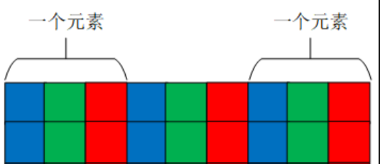

# OpenCV 1_Mat类

## 1. Mat 类简介

- Mat类无需手动分配内存，其在不需要时立即释放。
- Mat包括两个数据部分：Mat头（包含**矩阵大小、存储方法、矩阵存储地址**等信息）和**指向包含像素值矩阵的指针**(采取多少维数，取决于选择的存储方法)。

>每个Mat对象都有自己的矩阵头，但是当两个Mat对象之间共享一个矩阵时，可以通过让两个Mat对象的矩阵指针指向相同的地址。此外，复制操作符将只复制矩阵头和指向大矩阵的指针，而不是数据本身。

```c++
Mat A,C;   //Mat类实例化时只创建了Mat头
A = imread(argv[1],IMREAD_COLOR);  //为A对象分配一个矩阵；
Mat B(A);  //拷贝构造
C = A;     //等号运算符重载

/* 上面创建的A，B，C对象指向同一矩阵，使用其中任何一个对象进行修改都会影响到所有其他对象。象。实际上，不同的对象只是为相同的底层数据提供了不同的访问方法；然而，它们的矩阵头部分是不同的。不同的对象只是为相同的底层数据提供了不同的访问方法； */
```
>若一个矩阵属于多个Mat对象时，最后一个使用该矩阵的对象负责清理该矩阵占用的内存。
>
>采用引用次数来释放存储内容是C++中常见的方式，用这种方式可以避免仍有某个变量引用数据时将这个数据删除造成程序崩溃的问题，同时极大的缩减了程序运行时所占用的内存。

>如果复制矩阵本身，需要使用`cv::Mat::clone()` 和 `cv::Mat::copyTo()` 函数

```c++
Mat F = A.clone();    //将A指向的矩阵拷贝到F对应的内存空间
Mat G;            
A.copyTo(G);          //将A指向的矩阵拷贝到G对应的内存空间
```

- Mat存储的数据类型

Mat类可以存储的数据类型包含double、float、uchar、unsigned char以及自定义的模板等。
```c++
cv::Mat A = Mat_<double>(3,3);  //创建一个3*3的矩阵用于存放double类型数据
```

>OpenCV提出Mat类主要用于存储图像，而**像素值的最大值又决定了图像的质量**，如果用8位无符号整数去存储16位图像，会造成严重的图像颜色失真或造成数据错误。而由于不同位数的编译器对数据长度定义不同，为了避免在不同环境下因变量位数长度不同而造成程序执行问题，OpenCV根据数值变量存储位数长度定义了数据类型。

>数据类型|具体类型|取值范围
>-|-|-
>CV_8U|8位无符号整数|0~255
>CV_8S|8位有符号整数|-128~127
>CV_16U|16位无符号整数|0~65535
>CV_16S|16位有符号整数|-32768~32767
>CV_32S|32位有符号整数|$-2^{31}$~$2^{31}-1$
>CV_32F|32位浮点数|-FLT_MAX~FLT_MAX,INF,NAN
>CV_64F|64位浮点数|-DBL_MAX~DBL_MAX,INF,NAN

- Mat类通道数

OpenCV定义了通道数标识，**C1、C2、C3、C4分别表示单通道、双通道、3通道和4通道**。每一种数据类型都存在多个通道的情况，所以将数据类型与通道数表示结合便得到了OpenCV中对图像数据类型的完整定义，例如CV_8UC1表示的就是8位单通道数据，用于表示8位灰度图，而CV_8UC3表示的是8位3通道数据，用于表示8位彩色图。

```c++
cv::Mat a(640,480,CV_8UC3) //创建一个640*480的3通道矩阵用于存放彩色图像
cv::Mat a(3,3,CV_8UC1)     //创建一个3*3的8位无符号整数的单通道矩阵
cv::Mat a(3,3,CV_8U)       //创建单通道矩阵C1标识可以省略
```

## 2. Mat 对象的创建
1. 默认构造函数
```c++
cv::Mat::Mat();
```
>这种构造方式不需要输入任何的参数，在后续给变量赋值的时候会自动判断矩阵的类型与大小，实现灵活的存储，常用于存储读取的图像数据和某个函数运算输出结果。

2. 有参构造函数
```c++
cv::Mat::Mat( int  rows,int  cols,int  type);
```
>`rows`：构造矩阵的行数
>
>`cols`：矩阵的列数
>
>`type`：矩阵中存储的数据类型。此处除了CV_8UC1、CV_64FC4等从1到4通道以外，还提供了更多通道的参数，通过CV_8UC(n)中的n来构建多通道矩阵，其中n最大可以取到512.

>>这种定义方式清晰、直观、易于阅读，常用在明确需要存储数据尺寸和数据类型的情况下，例如相机的内参矩阵、物体的旋转矩阵等。利用输入矩阵尺寸和数据类型构造Mat类的方法存在一种变形，**通过将行和列组成一个Size()结构进行赋值**
```c++
cv::Mat::Mat(Size size(),int  type);
```
>`size`：2D数组变量尺寸，通过`Size(cols, rows)`进行赋值。

3. 拷贝构造函数
```c++
cv::Mat::Mat( const Mat & m);
```
>`m`：已经构建完成的Mat类矩阵数据。

>**这种构造方式只是复制了Mat类的矩阵头，矩阵指针指向的是同一个地址，因此如果通过某一个Mat类变量修改了矩阵中的数据，另一个变量中的数据也会发生改变。**

4. 构造子类
```c++
cv::Mat::Mat(const Mat & m, const Range & rowRange,const Range & colRange = Range::all())
```

>`m`：已经构建完成的Mat类矩阵数据。
>
>`rowRange`：在已有矩阵中需要截取的行数范围，是一个Range变量，例如从第2行到第5行可以表示为Range(2,5)。
>
>`colRange`：在已有矩阵中需要截取的列数范围，是一个Range变量，例如从第2列到第5列可以表示为Range(2,5)，当不输入任何值时表示所有列都会被截取。

## 3. Mat 对象的赋值

1. **构造时赋值**
```c++
cv::Mat::Mat(int  rows,int  cols,int  type,const Scalar & s)
```
>`s`：给矩阵中每个像素赋值的参数变量，例如Scalar(0, 0, 255)

Scalar结构中变量的个数一定要与定义中的通道数相对应，如果Scalar结构中变量个数大于通道数，则位置大于通道数之后的数值将不会被读取，如果Scalar结构中变量数小于通道数，则会以0补充。

2. **枚举赋值**
```c++
cv::Mat a = (cv::Mat_<int>(3, 3) << 1, 2, 3, 4, 5, 6, 7, 8, 9);
cv::Mat b = (cv::Mat_<double>(2, 3) << 1.0, 2.1, 3.2, 4.0, 5.1, 6.2);
```
>将矩阵中所有的元素都一一枚举出，并用数据流的形式赋值给Mat类。
>
>采用枚举法时，输入的数据个数一定要与矩阵元素个数相同。

3. **循环赋值**

>循环法赋值也是对矩阵中的每一位元素进行赋值，但是可以不在声明变量的时候进行赋值，而且可以对矩阵中的任意部分进行赋值。
```c++
cv::Mat c = cv::Mat_<int>(3, 3); //定义一个3*3的矩阵
for (int i = 0; i < c.rows; i++) //矩阵行数循环
{
for (int j = 0; j < c.cols; j++) //矩阵列数循环
{
c.at<int>(i, j) = i+j;
}
}
```
>给矩阵每个元素进行赋值的时候，赋值函数中声明的变量类型要与矩阵定义时的变量类型相同

4. **类方法赋值**
```c++
cv::Mat a = cv::Mat::eye(3, 3, CV_8UC1);
cv::Mat b = (cv::Mat_<int>(1, 3) << 1, 2, 3);
cv::Mat c = cv::Mat::diag(b);
cv::Mat d = cv::Mat::ones(3, 3, CV_8UC1);
cv::Mat e = cv::Mat::zeros(4, 2, CV_8UC3);
```
>`eye()`：构建一个单位矩阵，前两个参数为矩阵的行数和列数，第三个参数为矩阵存放的数据类型与通道数。如果行和列不相等，则在矩阵的 (1,1)，(2,2)，(3,3)等主对角位置处为1
>
>`diag()`：构建对角矩阵，其参数必须是Mat类型的1维变量，用来存放对角元素的数值。
>
>`ones()`：构建一个全为1的矩阵，参数含义与`eye()`相同。
>
>`zeros()`：构建一个全为0的矩阵，参数含义与`eye()`相同。

5. **数组赋值**
```c++
float a[8] = { 5,6,7,8,1,2,3,4 };
cv::Mat b = cv::Mat(2, 2, CV_32FC2, a);
cv::Mat c = cv::Mat(2, 4, CV_32FC1, a);
```
>这种赋值方式首先将需要存入到Mat类中的变量存入到一个数组中，之后通过设置Mat类矩阵的尺寸和通道数将数组变量拆分成矩阵，这种拆分方式可以自由定义矩阵的通道数，当矩阵中的元素数目大于数组中的数据时，将用-1.0737418e+08填充赋值给矩阵，如果矩阵中元素的数目小于数组中的数据时，将矩阵赋值完成后，数组中剩余数据将不再赋值。
>
>由数组赋值给矩阵的过程是**首先将矩阵中第一个元素的所有通道依次赋值**，之后再赋值下一个元素


## 4. Mat 类的运算
- Mat类与常数运算时，可以直接通过加减乘除符号实现。
```c++
cv::Mat a = (cv::Mat_<int>(3, 3) << 1, 2, 3, 4, 5, 6, 7, 8, 9);
cv::Mat b = (cv::Mat_<int>(3, 3) << 1, 2, 3, 4, 5, 6, 7, 8, 9);
cv::Mat c = (cv::Mat_<double>(3, 3) << 1.0, 2.1, 3.2, 4.0, 5.1, 6.2, 2, 2, 2);
cv::Mat d = (cv::Mat_<double>(3, 3) << 1.0, 2.1, 3.2, 4.0, 5.1, 6.2, 2, 2, 2);
cv::Mat e, f, g, h, i;
e = a + b;
f = c - d;
g = 2 * d;
h = d / 2.0;
i = a – 1;
```
>当两个Mat类变量加减运算时，必须保证两个矩阵中的数据类型是相同的.

- Mat类乘法运算

`A*B`是以数学运算中矩阵相乘的方式实现的，即**Mat矩阵A和B被当做纯粹的矩阵做乘法运算**，这就要求A的列数等于B的行数时，才能定义两个矩阵相乘。

```c++
	Mat A = Mat::ones(3, 3, CV_32FC1);
	Mat B = Mat::ones(3, 3, CV_32FC1);
	Mat AB;

	for (int i = 0; i < A.rows; i++)
	{
		for (int j = 0; j < A.cols; j++)
		{
			A.at<float>(i, j) = (float)(i + j);
		}
	}

	for (int i = 0; i < B.rows; i++)
	{
		for (int j = 0; j < B.cols; j++)
		{
			B.at<float>(i, j) = (float)(i + j);
		}
	}

	AB = A * B;

	cout <<"AB = " << AB << endl;
	cout <<"A = " << A << endl;
	cout <<"B = " << B << endl;
```
>***参与乘法的两个Mat矩阵的数据类型（type）只能是 CV_32F、 CV_64FC1、 CV_32FC2、 CV_64FC2 这4种类型中的一种。***

- Mat类点乘运算

把整个Mat矩阵扩展成一个行（列）向量，之后执行向量的点乘运算，要求参与dot运算的**两个Mat矩阵的行列数完全一致**。

>dot方法声明中显示返回值是double，所以`A.dot(B)`结果是一个double类型数据，不是Mat矩阵，不能把`A.dot(B)`结果赋值给Mat矩阵。
```c++
	Mat A = Mat::ones(3, 3, CV_32FC1);
	Mat B = Mat::ones(3, 3, CV_32FC1);
	Mat AB;


	for (int i = 0; i < A.rows; i++)
	{
		for (int j = 0; j < A.cols; j++)
		{
			A.at<float>(i, j) = (float)(i + j);
		}
	}

	for (int i = 0; i < B.rows; i++)
	{
		for (int j = 0; j < B.cols; j++)
		{
			B.at<float>(i, j) = (float)(i + j);
		}
	}
	double A_dot_B;

	A_dot_B = A.dot(B);
```

- Mat类对应位乘法运算

**参与运算的矩阵A的行列和B的行列数一致**。计算结果是跟A或B行列数一致的一个Mat矩阵。
>`Mat AB=A.mul(B)`，若声明AB时没有定义AB的数据类型，则默认AB的数据类型跟A和B保存一致
>
>若AB精度不够，可能产生溢出，溢出的值被置为当前精度下的最大值;

## 5. Mat 类数据访问
- Mat 矩阵的存储方式

多通道的Mat类矩阵是一个类似于三维的数据，而计算机的存储空间是一个二维空间，因此Mat类矩阵在计算机存储时是将三维数据变成二维数据，先存储第一个元素每个通道的数据，之后再存储第二个元素每个通道的数据。



Mat类的属性：
>属性|含义
>-|-
>cols|矩阵列数
>rows|矩阵行数
>step|以字节为单位的矩阵有效宽度
>elemsize()|每个元素的字节数
>total()|矩阵元素个数
>channels()|矩阵通道数
- at方式读取数据
1. 单通道读取
```c++
Mat a = (Mat_<uchar>(3, 3) << 1, 2, 3, 4, 5, 6, 7, 8, 9);
int value = (int)a.at<uchar>(0, 0);
cout<<"value = "<<value<<endl;
```
>**通过at方法读取元素需要在后面跟上“<数据类型>”**，如果此处的数据类型与矩阵定义时的数据类型不相同，就会出现因数据类型不匹配的报错信息。
>
>该方法以坐标的形式给出需要读取的元素坐标(行数，列数)。
>
>如果矩阵定义的是uchar类型的数据，在需要输入数据的时候，需要强制转换成int类型的数据进行输出，否则输出的结果并不是整数

2. 多通道读取

多通道矩阵每一个元素坐标处都是多个数据，因此引入一个变量用于表示同一元素多个数据。

>在openCV 中，针对3通道矩阵，定义了`Vec3b`、`Vec3s`、`Vec3w`、`Vec3d`、`Vec3f`、`Vec3i`六种类型用于表示同一个元素的三个通道数据。
```c++
Mat b(3, 4, CV_8UC3, Scalar(0, 0, 1));

Vec3b vc3 = b.at<Vec3b>(0, 0);

int first = (int)vc3.val[0];
int second = (int)vc3.val[1];
int third = (int)vc3.val[2];
```

>命名规则：数字表示通道的个数，最后一位是数据类型的缩写，b是uchar类型的缩写、s是short类型的缩写、w是ushort类型的缩写、d是double类型的缩写、f是float类型的缩写、i是int类型的缩写。

- ptr指针读取
```c++
Mat b(3,4,CV_8UC3,Scalar(0,0,1));
for(int i=0;i<b.rows;++i){
    uchar *ptr=b.ptr<uchar>(i);
    for(int j=0;j<b.cols*b.channels();++j){
        cout<<(int)ptr[j]<<" ";
    }
    cout<<endl;
}
```
1. 先遍历行数为外循环；
2. 在内循环中，ptr指针只取每个元素的首地址，读取的数据为对应的通道值数组。
3. ptr为内置指针，ptr<>(i)指向第i行的首地址
- 迭代器读取
```c++
MatIterator_<uchar> it = a.begin<uchar>();
MatIterator_<uchar> it_end = a.end<uchar>();
for (int i = 0; it != it_end; it++)
{
	cout << (int)(*it) << " ";
	if ((++i% a.cols) == 0)
	{
		cout << endl;
	}
}
```

>Mat类迭代器的起始是`Mat.begin< >()`，结束是`Mat.end< >()`，与其他迭代器用法相同，通过“++”运算实现指针位置向下迭代，数据的读取方式是先读取第一个元素的每一个通道，之后再读取第二个元素的每一个通道，直到最后一个元素的最后一个通道。

- 矩阵元素地址定位方式