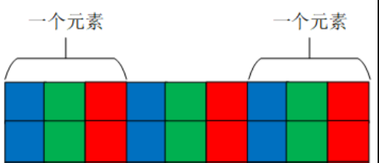

# OpenCV C++ 1_基础类型简介

## 1. `Mat` 类

`Mat`类是 OpenCV 中用于表示数组或者矩阵的类。可用于存储实值或复值向量和矩阵、灰度或彩色图像、体素体积、向量场、点云、张量、直方图。

`Mat`包括两个数据部分：`Mat`头（包含**矩阵大小、存储方法、矩阵存储地址**等信息）和**指向包含像素值矩阵的指针**(采取多少维数，取决于选择的存储方法)。

>每个`Mat`对象都有自己的矩阵头，但是当两个`Mat`对象之间共享一个矩阵时，可以通过让两个`Mat`对象的矩阵指针指向相同的地址。此外，复制操作符将只复制矩阵头和指向大矩阵的指针，而不是数据本身。

### `Mat`对象的创建

1. 构造函数

```c++
/**
  *	@brief	Mat 对象构造函数
  * @param	rows	行数
  * @param	cols 	列数
  * @param 	type 	数组类型
  */
cv::Mat::Mat(int rows,int cols,int type);

/**
  *	@brief	Mat 对象构造函数
  * @param	size  	2D数组变量尺寸，通过Size(cols, rows)进行赋值。
  * @param 	type 	数组类型
  */
cv::Mat::Mat(Size size(),int type);
```

> - `Mat` 的数据类型
>
> `Mat`类可以存储的数据类型包含`double`、`float`、`uchar`以及自定义的模板等。
>
> OpenCV提出Mat类主要用于存储图像，而像素值的最大值又决定了图像的质量，如果用8位无符号整数去存储16位图像，会造成严重的图像颜色失真或造成数据错误。而由于不同位数的编译器对数据长度定义不同，为了避免在不同环境下因变量位数长度不同而造成程序执行问题，OpenCV根据数值变量存储位数长度定义了数据类型。
>
> | 数据类型 | 具体类型       | 取值范围                         |
> | -------- | -------------- | -------------------------------- |
> | `CV_8U`  | 8位无符号整数  | 0~255                            |
> | `CV_8S`  | 8位有符号整数  | -128~127                         |
> | `CV_16U` | 16位无符号整数 | 0~65535                          |
> | `CV_16S` | 16位有符号整数 | -32768~32767                     |
> | `CV_32S` | 32位有符号整数 | $-2^{31}$~$2^{31}-1$             |
> | `CV_32F` | 32位浮点数     | -`FLT_MAX`~`FLT_MAX`,`INF`,`NAN` |
> | `CV_64F` | 64位浮点数     | -`DBL_MAX`~`DBL_MAX`,`INF`,`NAN` |
>
> - `Mat`的通道数
>
> OpenCV定义了通道数标识，`C1`、`C2`、`C3`、`C4`分别表示单通道、双通道、3通道和4通道。每一种数据类型都存在多个通道的情况，所以将数据类型与通道数表示结合便得到了OpenCV中对图像数据类型的完整定义，例如**`CV_8UC1`表示的就是8位单通道数据，用于表示8位灰度图**，而**`CV_8UC3`表示的是8位3通道数据，用于表示8位彩色图**。

```c++
/**
  *	@brief	Mat 对象构造函数
  * @note	这种构造方式不需要输入任何的参数，在后续给变量赋值的时候会自动判断矩阵的类型与大小，实现灵活的存储，常用于存储读取的图像数据和某个函数运算输出结果。
  */
cv::Mat::Mat();
```

2. 子类构造

```c++
/**
  *	@brief	Mat 		对象构造函数
  * @param 	m 			已经构建完成的Mat类矩阵数据。
  * @param	rowRange 	在已有矩阵中需要截取的行数范围，是一个Range变量，例如从第2行到第5行可以表示为Range(2,5)
  * @param  colRange	在已有矩阵中需要截取的列数范围，是一个Range变量，例如从第2列到第5列可以表示为Range(2,5)，当不输入任何值时表示所有列都会被截取
  */
cv::Mat::Mat(const Mat & m, const Range & rowRange,const Range & colRange = Range::all());
```

### `Mat`对象的复制

`Mat`类无需手动分配内存，其在不需要时立即释放。

若一个矩阵属于多个`Mat`对象时，最后一个使用该矩阵的对象负责清理该矩阵占用的内存。采用引用次数来释放存储内容是C++中常见的方式，用这种方式可以避免仍有某个变量引用数据时将这个数据删除造成程序崩溃的问题，同时极大的缩减了程序运行时所占用的内存。如果复制矩阵本身，需要使用`cv::Mat::clone()` 和 `cv::Mat::copyTo()` 函数。

```c++
Mat A,C;   //Mat类实例化时只创建了Mat头
A = imread(argv[1],IMREAD_COLOR);  //为A对象分配一个矩阵；
Mat B(A);  //拷贝构造
C = A;     //等号运算符重载

/* 上面创建的A，B，C对象指向同一矩阵，使用其中任何一个对象进行修改都会影响到所有其他对象。实际上，不同的对象只是为相同的底层数据提供了不同的访问方法；然而，它们的矩阵头部分是不同的。 */

Mat F = A.clone();    //将A指向的矩阵拷贝到F对应的内存空间
Mat G;            
A.copyTo(G);          //将A指向的矩阵拷贝到G对应的内存空间
/* 上面创建的A，F，G对象指向不同矩阵 */
```

### `Mat`对象的赋值

1. 构造赋值

```c++
/**
  *	@brief	Mat 对象构造函数
  * @param	rows	行数
  * @param	cols 	列数
  * @param 	type 	数组类型
  * @param 	s		给矩阵中每个像素赋值的参数变量，例如Scalar(0, 0, 255)(第一层为每个通道的值)
  * @note 	Scalar结构中变量的个数一定要与定义中的通道数相对应，如果Scalar结构中变量个数大于通道数，则位置大于通道数之后的数值将不会被读取，如果Scalar结构中变量数小于通道数，则会以0补充
  */
cv::Mat::Mat(int rows,int cols,int type,const Scalar & s);
```

2. 枚举赋值

```c++
Mat a = (cv::Mat_<int>(3, 3) << 1, 2, 3, 4, 5, 6, 7, 8, 9);
Mat b = (cv::Mat_<double>(2, 3) << 1.0, 2.1, 3.2, 4.0, 5.1, 6.2);

// 将矩阵中所有的元素都一一枚举出，并用数据流的形式赋值给Mat类。
// 采用枚举法时，输入的数据个数一定要与矩阵元素个数相同。

// 循环法赋值也是对矩阵中的每一位元素进行赋值，但是可以不在声明变量的时候进行赋值，而且可以对矩阵中的任意部分进行赋值。
Mat c = Mat_<int>(3, 3); //定义一个3*3的矩阵
for (int i = 0; i < c.rows; i++) //矩阵行数循环
{
	for (int j = 0; j < c.cols; j++) //矩阵列数循环
	{
		c.at<int>(i, j) = i+j;
	}
}
```

3. 其他赋值方法

```c++
Mat a = Mat::eye(3, 3, CV_8UC1);				// 构建单位矩阵
cv::Mat b = (cv::Mat_<int>(1, 3) << 1, 2, 3);	 // 构建行向量
Mat c = Mat::diag(b);						   // 构建对角矩阵
Mat d = Mat::ones(3, 3, CV_8UC1);				// 构建纯1矩阵
Mat e = Mat::zeros(4, 2, CV_8UC3);				// 构建零矩阵
```

### `Mat`类的运算

1. 数乘，矩阵加法：直接通过加减乘除符号实现。

```c++
Mat a = (cv::Mat_<int>(3, 3) << 1, 2, 3, 4, 5, 6, 7, 8, 9);
Mat b = (cv::Mat_<int>(3, 3) << 1, 2, 3, 4, 5, 6, 7, 8, 9);
Mat c = (cv::Mat_<double>(3, 3) << 1.0, 2.1, 3.2, 4.0, 5.1, 6.2, 2, 2, 2);
Mat d = (cv::Mat_<double>(3, 3) << 1.0, 2.1, 3.2, 4.0, 5.1, 6.2, 2, 2, 2);
Mat e, f, g, h, i;
e = a + b;
f = c - d;
g = 2 * d;
h = d / 2.0;
i = a – 1;

// 当两个Mat类变量加减运算时，必须保证两个矩阵中的数据类型是相同的
```

2. 矩阵乘法

```c++
Mat A = Mat::ones(3, 3, CV_32FC1);
Mat B = Mat::ones(3, 3, CV_32FC1);
Mat AB;

for (int i = 0; i < A.rows; i++)
{
    for (int j = 0; j < A.cols; j++)
    {
        A.at<float>(i, j) = (float)(i + j);
    }
}

for (int i = 0; i < B.rows; i++)
{
    for (int j = 0; j < B.cols; j++)
    {
        B.at<float>(i, j) = (float)(i + j);
    }
}

AB = A * B;
// A的列数等于B的行数
// 参与乘法的两个Mat矩阵的数据类型只能是 CV_32F、 CV_64FC1、 CV_32FC2、 CV_64FC2 这4种类型中的一种。
```

3. 点乘

把整个`Mat`矩阵扩展成一个行（列）向量，之后执行向量的点乘运算，要求参与`dot`运算的两个`Mat`矩阵的行列数完全一致。

```c++
Mat A = Mat::ones(3, 3, CV_32FC1);
Mat B = Mat::ones(3, 3, CV_32FC1);
Mat AB;


for (int i = 0; i < A.rows; i++)
{
    for (int j = 0; j < A.cols; j++)
    {
        A.at<float>(i, j) = (float)(i + j);
    }
}

for (int i = 0; i < B.rows; i++)
{
    for (int j = 0; j < B.cols; j++)
    {
        B.at<float>(i, j) = (float)(i + j);
    }
}
double A_dot_B;

A_dot_B = A.dot(B);

// 返回double类型的点乘值
```

4. 对应位乘法

参与运算的矩阵A的行列和B的行列数一致。计算结果是跟A或B行列数一致的一个`Mat`矩阵。

>`Mat AB=A.mul(B)`，若声明AB时没有定义AB的数据类型，则默认AB的数据类型跟A和B保存一致
>
>若AB精度不够，可能产生溢出，溢出的值被置为当前精度下的最大值;

### `Mat`类的访问

多通道的`Mat`类矩阵是一个类似于三维的数据，而计算机的存储空间是一个二维空间，因此`Mat`类矩阵在计算机存储时是将三维数据变成二维数据，先存储第一个元素每个通道的数据，之后再存储第二个元素每个通道的数据。



Mat类的属性：

| 属性         | 含义                       |
| ------------ | -------------------------- |
| `cols`       | 矩阵列数                   |
| `rows`       | 矩阵行数                   |
| `step`       | 以字节为单位的矩阵有效宽度 |
| `elemsize()` | 每个元素的字节数           |
| `total()`    | 矩阵元素个数               |
| `channels()` | 矩阵通道数                 |

- `at`方法读取数据

1. 单通道读取

```c++
Mat a = (Mat_<uchar>(3, 3) << 1, 2, 3, 4, 5, 6, 7, 8, 9);
int value = (int)a.at<uchar>(0, 0);
```

>- 通过`at方法读取元素需要在后面跟上`<数据类型>`，如果此处的数据类型与矩阵定义时的数据类型不相同，就会出现因数据类型不匹配的报错信息。
>
>- 该方法以坐标的形式给出需要读取的元素坐标(行数，列数)。
>
>- 如果矩阵定义的是`uchar`类型的数据，在需要输入数据的时候，需要强制转换成`int`类型的数据进行输出，否则输出的结果并不是整数

2. 多通道读取

多通道矩阵每一个元素坐标处都是多个数据，因此引入一个变量用于表示同一元素多个数据。

>在OpenCV 中，针对3通道矩阵，定义了`Vec3b`、`Vec3s`、`Vec3w`、`Vec3d`、`Vec3f`、`Vec3i`六种类型用于表示同一个元素的三个通道数据。

```c++
Mat b(3, 4, CV_8UC3, Scalar(0, 0, 1));

Vec3b vc3 = b.at<Vec3b>(0, 0);

int first = (int)vc3.val[0];
int second = (int)vc3.val[1];
int third = (int)vc3.val[2];
```

>命名规则：数字表示通道的个数，最后一位是数据类型的缩写，`b`是`uchar`类型的缩写、`s`是`short`类型的缩写、`w`是`ushort`类型的缩写、`d`是`double`类型的缩写、`f`是`float`类型的缩写、`i`是`int`类型的缩写。

- `ptr`指针读取

```c++
Mat b(3, 4, CV_8UC3, Scalar(0, 0, 1));
for(int i = 0 ;i < b.rows; ++i){
    uchar *ptr=b.ptr<uchar>(i);
    for(int j = 0;j < b.cols * b.channels(); ++j){
        cout << (int)ptr[j] << " ";
    }
    cout << endl;
}
```

1. 先遍历行数为外循环；
2. 在内循环中，`ptr`指针只取每个元素的首地址，读取的数据为对应的通道值数组。
3. `ptr`为内置指针，`ptr<>(i)`指向第i行的首地址

- 迭代器读取

```c++
MatIterator_<uchar> it = a.begin<uchar>();
MatIterator_<uchar> it_end = a.end<uchar>();
for (int i = 0; it != it_end; it++)
{
	cout << (int)(*it) << " ";
	if ((++i% a.cols) == 0)
	{
		cout << endl;
	}
}
```

>`Mat`类迭代器的起始是`Mat.begin< >()`，结束是`Mat.end< >()`，与其他迭代器用法相同，通过“++”运算实现指针位置向下迭代，数据的读取方式是先读取第一个元素的每一个通道，之后再读取第二个元素的每一个通道，直到最后一个元素的最后一个通道。