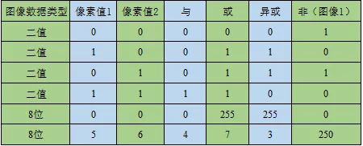

# OpenCV 4_像素统计与二值化

## 1. 像素统计

将数字图像理解成一定尺寸的矩阵，矩阵中每个元素的大小表示了图像中每个像素的亮暗程度，因此统计矩阵中的最大值，就是寻找图像中灰度值最大的像素，计算平均值就是计算图像像素平均灰度，可以用来表示图像整体的亮暗程度。

1. 像素的最大值和最小值
```c++
void cv::minMaxLoc(InputArray src,
                   double * minVal,
                   double * maxVal = 0,
                   Point * minLoc = 0,
                   Point * maxLoc = 0,
                   InputArray mask = noArray())
```
>`src`：需要寻找最大值和最小值的图像或者矩阵，要求必须是单通道矩阵
>
>`minVal`：图像或者矩阵中的最小值。
>
>`maxVal`：图像或者矩阵中的最大值。
>
>`minLoc`：图像或者矩阵中的最小值在矩阵中的坐标。
>
>`maxLoc`：图像或者矩阵中的最大值在矩阵中的坐标。
>
>`mask`：掩模，用于设置在图像或矩阵中的指定区域寻找最值。

- `Point` 数据类型表示图像的像素坐标；
>图像的像素坐标轴以左上角为坐标原点，水平方向为x轴，垂直方向为y轴，因此Point(x,y)对应于图像的行和列表示为Point(列数，行数)。

>针对2D坐标数据类型定义了整型坐标`Point2i`(或者`Point`)、`double`型坐标`Point2d`、浮点型坐标`Point2f`，对于3D坐标同样定义了上述的坐标数据类型。
>>对于坐标中x、y、z轴的具体数据，可以通过变量的x、y、z属性进行访问，例如Point.x可以读取坐标的x轴数据。

- 函数第一个参数是输入单通道矩阵，需要注意的是，该变量必须是一个单通道的矩阵数据，**如果是多通道的矩阵数据，需要用`Mat::reshape()`函数将多通道变成单通道**，或者分别寻找每个通道的最值，然后再进行比较寻找到全局最值。

>第二到第五个参数分别是指向最小值、最大值、最小值位置和最大值位置的指针，如果不需要寻找某一个参数，可以将该参数设置为NULL，函数最后一个参数是寻找最值得掩码矩阵，用于标记寻找上述四个值的范围，参数默认值为`noArray()`，表示寻找范围是矩阵中所有数据。

- `reshape()`函数
```c++
Mat Mat::reshape(int  cn,int  rows = 0);
```
>cn：转换后矩阵的通道数。
>
>rows：转换后矩阵的行数，如果参数为零，则转换后行数与转换前相同。
```c++
#include <iostream>
#include <opencv2/opencv.hpp>
#include <opencv2/highgui/highgui.hpp>

using namespace std;
using namespace cv;

int main()
{
	float a[12] = { 1,2,3,4,5,10,6,7,8,9,10,0 };

	Mat mat_1 = Mat(3, 4, CV_32FC1, a);
	Mat mat_2 = Mat(2, 3, CV_32FC2, a);

	double minVal, maxVal;
	Point minIdx, maxIdx;

	//单通道读取
	minMaxLoc(mat_1, &minVal, &maxVal, &minIdx, &maxIdx);
	cout << "最小值为：" << minVal << " 位置为：" << minIdx << endl;
	cout << "最大值为：" << maxVal << " 位置为：" << maxIdx << endl;

	//多通道读取
	Mat remat_2 = mat_2.reshape(1, 4);
	minMaxLoc(remat_2, &minVal, &maxVal, &minIdx, &maxIdx);
	cout << "最小值为：" << minVal << " 位置为：" << minIdx << endl;
	cout << "最大值为：" << maxVal << " 位置为：" << maxIdx << endl;


	system("pause");

	return 0;
}
```

2. 图像均值和标准方差

图像的均值表示图像整体的亮暗程度，图像的均值越大图像整体越亮。标准方差表示图像中明暗变化的对比程度，标准差越大表示图像中明暗变化越明显。

- 平均值函数
```c++
Scalar mean(InputArray src,InputArray mask = noArray());
```
>`src`：待求平均值的图像矩阵。
>
>`mask`：掩模，用于标记求取哪些区域的平均值。

>函数的第一个参数用来输入待求平均值的图像矩阵，其通道数目可以在1到4之间。需要注意的是，该函数的返回值是一个Scalar类型的变量，函数的返回值有4位，分别表示输入图像4个通道的平均值，如果输入图像只有1个通道，那么返回值的后三位都为0，例如输入该函数一个单通道平均值为1的图像，输出的结果为[1,0,0,0]，可以通过Scalar[n]查看第n个通道的平均值。
>
>该函数的第二个参数用于控制图像求取均值的范围，在第二个参数中去除第一个参数中像素值为0的像素。缺省时为全部求平均值。

$$ 
N = \Sigma_{I,MASK(I)\neq0}1\\
M_c = \Sigma_{I,MASK(I)\neq0}src(I_c)/N
$$

$M_c$表示第c个通道的平均值，$N$表示像素值不为0的像素点个数。

- 平均值与标准方差函数
```c++
void meanStdDev(InputArray src,OutputArray mean,OutputArray stddev,InputArray mask = noArray());
```
>src：待求平均值的图像矩阵。
>
>mean：图像每个通道的平均值，参数为Mat类型变量。
>
>stddev：图像每个通道的标准方差，参数为Mat类型变量。
>
>mask：掩模，用于标记求取哪些区域的平均值和标准方差。

$$ 
N = \Sigma_{I,MASK(I)\neq0}1\\
M_c = \Sigma_{I,MASK(I)\neq0}src(I_c)/N\\
stddev_c=\sqrt{\Sigma_{I,MASK(I)\neq0}(src(I_c)-M_c)^2/N}
$$

## 2. 通道分离与合并
1. 通道分离函数
```c++
void split(const Mat & src,
           Mat * mvbegin
          );
void split(InputArray m,
           OutputArrayOfArrays mv
          );
```
>src：待分离的多通道图像。
>
>mvbegin：分离后的单通道图像，为数组形式，数组大小需要与图像的通道数相同
>
>m：待分离的多通道图像
>
>mv：分离后的单通道图像，为向量vector形式

该函数主要是用于将多通道的图像分离成若干单通道的图像，两个函数原型中不同之处在于前者第二个参数输入的是Mat类型的数组，其数组的长度需要与多通道图像的通道数相等并且提前定义；第二种函数原型的第二个参数输入的是一个vector容器，不需要知道多通道图像的通道数。

2. 通道合并函数
```c++
void merge(const Mat * mv,
           size_t  count,
           OutputArray dst
          ); 
void merge(InputArrayOfArrays mv,
           OutputArray dst
          );
```
>mv：需要合并的图像数组，其中每个图像必须拥有相同的尺寸和数据类型。
>
>count：输入的图像数组的长度，其数值必须大于0.
>
>mv：需要合并的图像向量vector，其中每个图像必须拥有相同的尺寸和数据类型。
>
>dst：合并后输出的图像，与mv[0]具有相同的尺寸和数据类型，通道数等于所有输入图像的通道数总和。

合并函数的输出结果是一个多通道的图像，其通道数目是所有输入图像通道数目的总和。这里需要说明的是，用于合并的图像并非都是单通道的，也可以是多个通道数目不相同的图像合并成一个通道更多的图像，虽然这些图像的通道数目可以不相同，但是需要所有图像具有相同的尺寸和数据类型。

```C++
#include<iostream>
#include<opencv2/opencv.hpp>
#include<opencv2/highgui/highgui.hpp>

using namespace std;
using namespace cv;

int main()
{
	Mat img = imread("picture.jpg");
	if (img.empty())
	{
		cout << "Fail to open!" << endl;
		return -1;
	}

	Mat HSV, dst;
	resize(img, dst, Size(img.cols * 0.5, img.rows * 0.5));

	cvtColor(dst, HSV, COLOR_BGR2HSV);

	Mat img0, img1, img2;
	Mat vimg0, vimg1, vimg2;
	Mat res1, res2, res3;

	Mat imgs[3];
	split(dst, imgs);
	img0 = imgs[0];
	img1 = imgs[1];
	img2 = imgs[2];

	imshow("BGR-R", img0);
	imshow("BGR-G", img1);
	imshow("BGR-B", img2);
	
	//res1为5通道图片，无法调用imshow()函数（导致数据溢出）
	imgs[2] = dst;
	merge(imgs, 3, res1);

	Mat zeros = Mat::zeros(dst.rows, dst.cols, CV_8UC1);
	imgs[0] = zeros;
	imgs[2] = zeros;
	merge(imgs, 3, res2);
	
	imshow("Result_1", res2);

	vector<Mat> hsv;
	split(HSV, hsv);
	vimg0 = hsv.at(0);
	vimg1 = hsv.at(1);
	vimg2 = hsv.at(2);
	imshow("HSV-H", vimg0);
	imshow("HSV-S", vimg1);
	imshow("HSV-V", vimg2);

	hsv.push_back(HSV);
	merge(hsv, res3);
	//res3为5通道图片，无法调用imshow()函数（导致数据溢出）

	waitKey();


	return 0;
}
```

3. 比较运算
```c++
void max(InputArray src1,InputArray src2,OutputArray dst);
void min(InputArray src1,InputArray src2,OutputArray dst);
```
>src1：第一个图像矩阵，可以是任意通道数的矩阵。
>
>src2：第二个图像矩阵，尺寸和通道数以及数据类型都需要与src1一致。
>
>dst：保留对应位置较大（较小）灰度值后的图像矩阵，尺寸、通道数和数据类型与src1一致。

比较运算主要用在对矩阵类型数据的处理，与掩模图像进行比较运算可以实现抠图或者选择通道的效果。

```c++
#include<iostream>
#include<opencv2/opencv.hpp>
#include<opencv2/highgui/highgui.hpp>

using namespace std;
using namespace cv;

int main()
{
	Mat img = imread("picture.jpg");
	if (img.empty())
	{
		cout << "Fail to open!" << endl;
		return -1;
	}

	//创建边框
	Mat mask = Mat::zeros(Size(img.cols, img.rows), CV_8UC3);
	Rect rect(100, 100, 300, 300);
	mask(rect) = Scalar(255, 255, 255);

	Mat res1;
	min(mask, img, res1);
	imshow("抠图结果", res1);

	//创建掩膜
	Mat rmask = Mat(img.rows, img.cols, CV_8UC3, Scalar(0, 0, 255));

	Mat res2;
	min(rmask, img, res2);
	imshow("掩膜结果", res2);
	waitKey();
	return 0;
}
```

4. 逻辑运算
```c++
//像素求与运算
void cv::bitwise_and(InputArray src1，
                     InputArray src2，
                     OutputArray dst，
                     InputArray mask = noArray()
                    );
//像素求或运算
void cv::bitwise_or(InputArray src1,
                    InputArray src2,
                    OutputArray dst,
                    InputArray mask = noArray()
                   );
 //像素求异或运算
void cv::bitwise_xor(InputArray src1,
                     InputArray src2,
                     OutputArray dst,
                     InputArray mask = noArray()
                    );
//像素求非运算
void cv::bitwise_not(InputArray src,
                     OutputArray dst,
                     InputArray mask = noArray()
					);
```
>src1：第一个图像矩阵，可以是多通道图像数据。
>
>src2：第二个图像矩阵，尺寸和通道数以及数据类型都需要与src1一致。
>
>dst：逻辑运算输出结果，尺寸和通道数和数据类型与src1一致。
>
>mask：掩模，用于设置图像或矩阵中逻辑运算的范围。



```c++
#include<iostream>
#include<opencv2/opencv.hpp>
#include<opencv2/highgui/highgui.hpp>

using namespace std;
using namespace cv;

int main()
{
	Mat img = imread("picture.jpg");
	if (img.empty())
	{
		cout << "Fail to open!" << endl;
		return -1;
	}
	Mat res;
	bitwise_not(img, res);

	imshow("result", res);
	waitKey();

	return 0;
}
```

## 3. 图像二值化
“非黑即白”的图像像素的灰度值无论在什么数据类型中只有最大值和最小值两种取值，因此称其为二值图像。二值图像色彩种类少，可以进行高度的压缩，节省存储空间，将非二值图像经过计算变成二值图像的过程称为图像的二值化。

1. 二值化函数
```c++
double cv::threshold(InputArray src,OutputArray dst,double  thresh,double  maxval,int  type);
```
>src：待二值化的图像，**图像只能是CV_8U和CV_32F两种数据类型**。对于图像通道数目的要求和选择的二值化方法相关。
>
>dst：二值化后的图像，与输入图像具有相同的尺寸、数据类型和通道数。
>
>thresh：二值化的阈值。
>
>maxval：二值化过程的最大值，此函数只在`THRESH_BINARY`和`THRESH_BINARY_INV`两种二值化方法中才使用，但是在使用其他方法是也需要输入。
>
>type：选择图像二值化方法的标志。

>type|值|作用
>-|-|-
>THRESH_BINARY|0|灰度值大于阈值为最大值，其他值为0
>THRESH_BINARY_INV|1|灰度值大于阈值为0，其他值为最大值
>THRESH_TRUNC|2|灰度值大于阈值为阈值，其他值不变
>THRESH_TOZERO|3|灰度值大于阈值不变，其他值为0
>THRESH_TOZERO_INV|4|灰度值大于阈值为0，其他值不变
>THRESH_OTSU|8|大津法自动寻求全局阈值
>THRESH_TRIANGLE|16|三角形法自动寻求全局阈值

- THRESH_BINARY和THRESH_BINARY_INV

这两个标志是相反的二值化方法，THRESH_BINARY是将灰度值与阈值（第三个参数thresh）进行比较，如果灰度值大于阈值就将灰度值改为函数中第四个参数maxval的值，否则将灰度值改成0。THRESH_BINARY_INV标志正好与这个过程相反，如果灰度值大于阈值就将灰度值改为0，否则将灰度值改为maxval的值。

$$
Binary(x,y)=\begin{cases}
maxval &  src(x,y)>thresh\\
0 & otherwise
\end{cases}\\
Binary\_INV(x,y)=\begin{cases}
0 & src(x,y)>thresh\\
maxval & otherwise
\end{cases}
$$

- THRESH_TRUNC

这个标志相当于重新给图像的灰度值设定一个新的最大值，将大于新的最大值的灰度值全部重新设置为新的最大值，具体逻辑为将灰度值与阈值thresh进行比较，如果灰度值大于thresh则将灰度值改为thresh，否则保持灰度值不变。这种方法没有使用到函数中的第四个参数maxval的值，因此maxval的值对本方法不产生影响。
$$
TRUNC(x,y)=\begin{cases}
threshold & src(x,y)>thresh\\
src(x,y) & otherwise
\end{cases}
$$

- THRESH_TOZERO和THRESH_TOZERO_INV

这两个标志是相反的阈值比较方法， THRESH_TOZERO表示将灰度值与阈值thresh进行比较，如果灰度值大于thresh则将保持不变，否则将灰度值改为0。THRESH_TOZERO_INV方法与其相反，将灰度值与阈值thresh进行比较，如果灰度值小于等于thresh则将保持不变，否则将灰度值改为0。这种两种方法都没有使用到函数中的第四个参数maxval的值，因此maxval的值对本方法不产生影响。
$$
TOZERO(x,y)=\begin{cases}
src(x,y) & src(x,y)>thresh\\
0 & otherwise
\end{cases}\\
TOZERO(x,y)=\begin{cases}
0 & src(x,y)>thresh\\
src(x,y) & otherwise
\end{cases}
$$

- THRESH_OTSU和THRESH_TRIANGLE

这两种标志是获取阈值的方法，并不是阈值的比较方法的标志，这两个标志可以和前面5种标志一起使用，例如“THRESH_BINARY| THRESH_OTSU”。前面5种标志在调用函数时都需要人为的设置阈值，如果对图像不了解设置的阈值不合理，会对处理后的效果造成严重的影响，这两个标志分别表示利用**大津法（OTSU）和三角形法（TRIANGLE）**结合图像灰度值分布特性获取二值化的阈值，并将阈值以函数返回值的形式给出。因此如果函数最后一个参数设置了这两个标志中的任何一个，那么函数第三个参数thresh将由系统自动给出，但是在调用函数的时候仍然不能缺省，只是程序不会使用这个数值。需要注意的是，目前为止OpenCV 4中针对这两个标志只支持输入CV_8UC1类型的图像。

2. `threshold()`函数
```c++
void cv::adaptiveThreshold(InputArray src,
                           OutputArray dst,
                           double  maxValue,
                           int  adaptiveMethod,
                           int  thresholdType,
                           int  blockSize,
                           double   C
                          );
```
>src：待二值化的图像，图像只能是CV_8UC1数据类型。
>
>dst：二值化后的图像，与输入图像具有相同的尺寸、数据类型。
>
>maxValue：二值化的最大值。
>
>adaptiveMethod：自制应确定阈值的方法，分为均值法ADAPTIVE_THRESH_MEAN_C和高斯法ADAPTIVE_THRESH_GAUSSIAN_C这两种。
>
>thresholdType：选择图像二值化方法的标志，只能是THRESH_BINARY和THRESH_BINARY_INV。
>
>blockSize：自适应确定阈值的像素邻域大小，一般为3，5，7的奇数。
>
>C：从平均值或者加权平均值中减去的常数，可以为正，也可以为负。

```c++
#include<iostream>
#include<opencv2/opencv.hpp>
#include<opencv2/highgui/highgui.hpp>

using namespace std;
using namespace cv;

int main()
{
    Mat img = imread("picture.jpg");
    if (img.empty()) {
        cout << "Fail to open!" << endl;
        return -1;
    }

    Mat gray;
    cvtColor(img, gray, COLOR_BGR2GRAY);
    Mat img_B, img_B_V, gray_B, gray_B_V, gray_T, gray_T_V, gray_TRUNC;

    //彩色图像二值化
    threshold(img, img_B, 125, 255, THRESH_BINARY);
    threshold(img, img_B_V, 125, 255, THRESH_BINARY_INV);
    imshow("img_B", img_B);
    imshow("img_B_V", img_B_V);

    //灰度图像二值化
    threshold(gray, gray_B, 125, 255, THRESH_BINARY);
    threshold(gray, gray_B_V, 125, 255, THRESH_BINARY_INV);
    imshow("gray_B", gray_B);
    imshow("gray_B_V", gray_B_V);

    //灰度图像TOZERO变换
    threshold(gray, gray_T, 125, 255, THRESH_TOZERO);
    threshold(gray, gray_T_V, 125, 255, THRESH_TOZERO_INV);
    imshow("gray_T", gray_T);
    imshow("gray_T_V", gray_T_V);

    //灰度图像TRUNC变换
    threshold(gray, gray_TRUNC, 125, 255, THRESH_TRUNC);
    imshow("gray_TRUNC", gray_TRUNC);

    //灰度图像大津法和三角法二值化
    Mat img_Thr = imread("picture.jpg", IMREAD_GRAYSCALE);
    Mat img_Thr_0, img_Thr_T;
    threshold(img_Thr, img_Thr_0, 100, 255, THRESH_BINARY | THRESH_OTSU);
    threshold(img_Thr, img_Thr_T, 125, 255, THRESH_BINARY | THRESH_TRIANGLE);
    imshow("img_Thr", img_Thr);
    imshow("img_Thr_0", img_Thr_0);
    imshow("img_Thr_T", img_Thr_T);

    //灰度图像自适应二值化
    Mat adaptive_mean, adaptive_gauss;
    adaptiveThreshold(img_Thr, adaptive_mean, 255, ADAPTIVE_THRESH_MEAN_C, THRESH_BINARY, 55, 0);
    adaptiveThreshold(img_Thr, adaptive_gauss, 255, ADAPTIVE_THRESH_GAUSSIAN_C, THRESH_BINARY, 55, 0);

    imshow("adaptive_mean", adaptive_mean);
    imshow("adaptive_gauss", adaptive_gauss);
    waitKey(0);
    return 0;
}
```


3. LUT查找表

如果需要与多个阈值进行比较，就需要用到显示查找表（Look-Up-Table，LUT）。LUT查找表简单来说就是一个像素灰度值的映射表，它以像素灰度值作为索引，以灰度值映射后的数值作为表中的内容。

```c++
void cv::LUT(InputArray src,
             InputArray lut,
             OutputArray dst
            );
```

>src：输入图像矩阵，其数据类型只能是CV_8U。
>
>lut：256个像素灰度值的查找表，单通道或者与src通道数相同。
>
>dst：输出图像矩阵，其尺寸与src相同，数据类型与lut相同。

如果第二个参数是单通道，则输入变量中的每个通道都按照一个LUT查找表进行映射；如果第二个参数是多通道，则输入变量中的第i个通道按照第二个参数的第i个通道LUT查找表进行映射。与之前的函数不同，函数输出图像的数据类型不与原图像的数据类型保持一致，而是和LUT查找表的数据类型保持一致，这是因为将原灰度值映射到新的空间中，因此需要与新空间中的数据类型保持一致。

```c++
#include<iostream>
#include<opencv2/opencv.hpp>
#include<opencv2/highgui/highgui.hpp>

using namespace std;
using namespace cv;

#define LUT_MAX 256

int main()
{
	Mat img = imread("picture.jpg");
	if (img.empty())
	{
		cout << "Fail to open!" << endl;
		return -1;
	}

	uchar LUT_C1[LUT_MAX];
	for (int i = 0; i < 256; ++i) 
	{
		if (i <= 100)
			LUT_C1[i] = 0;
		else if (i > 100 && i <= 200)
			LUT_C1[i] = 100;
		else 
			LUT_C1[i] = 255;
	}
	Mat lut_c1(1, LUT_MAX, CV_8UC1, LUT_C1);

	uchar LUT_C2[LUT_MAX];
	for (int i = 0; i < 256; ++i)
	{
		if (i <= 100)
			LUT_C2[i] = 0;
		else if (i > 100 && i <= 200)
			LUT_C2[i] = 100;
		else
			LUT_C2[i] = 255;
	}
	Mat lut_c2(1, LUT_MAX, CV_8UC1, LUT_C2);

	uchar LUT_C3[LUT_MAX];
	for (int i = 0; i < 256; ++i)
	{
		if (i <= 100)
			LUT_C3[i] = 0;
		else if (i > 100 && i <= 200)
			LUT_C3[i] = 100;
		else
			LUT_C3[i] = 255;
	}
	Mat lut_c3(1, LUT_MAX, CV_8UC1, LUT_C3);

	Mat LUT_List;
	vector<Mat> mergeMats;
	mergeMats.push_back(lut_c1);
	mergeMats.push_back(lut_c2);
	mergeMats.push_back(lut_c3);
	merge(mergeMats, LUT_List);

	Mat res1, res2;
	LUT(img, lut_c1, res1);
	LUT(img, LUT_List, res2);

	imshow("res1", res1);
	imshow("res2", res2);
	waitKey();

	return 0;
}
```