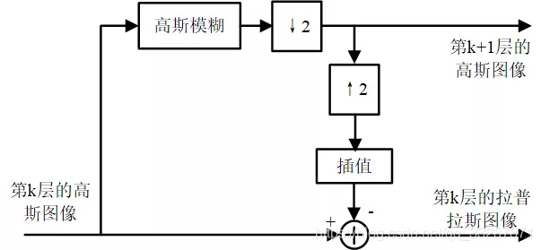

# OpenCV 6_图像金字塔

图像金字塔：
同一张图片**不同分辨率**的子图的集合。


图像金字塔底部是待处理的高分辨率图像，也就是原始图像，顶部是低分辨率的近似图像。一般情况下，都是每向上移动一级，图像的宽和高都降低为原来的1/2。


**下采样与上采样**

>- 下采样：自下而上生成一个图像金字塔，最下面一般就是原图，依次往上的图片尺寸减半。
>- 上采样：自上而下生成一个图像金字塔，最上面一般是一个尺寸较小的特征图，依次往下的图片尺寸变为原来的二倍。

如果通过下采样生成一个金字塔，最简单的做法就是：不断地删除图像的偶数行和偶数列，重复这个过程，就得到一个金字塔。

如果通过上采样生成一个金字塔，最简单的做法就是：在每列像素点的右边插入值为0的列，在每行像素点下面插入值为0的行，不断重复，就生成一个金字塔。

**滤波器**

- 当下采样生成金字塔图像时，是直接删除偶数行偶数列的操作，但这种操作意味着直接丢弃图像中的信息，为了减轻图像信息的丢失，在下采样操作之前先用滤波器对原始图像滤波操作一遍，这样滤波后的图像就是原始图像的近似图像，此时再删偶数行偶数列，就没有直接的信息损失了。而对原始图像进行滤波操作有很多方法，比如用**邻域滤波器**进行操作，这样生成的图像就是**平均金字塔**。如果用**高斯滤波器**处理，生成的是**高斯金字塔**。

- 当上采样生成图像金字塔时，直接右插入列下插入行操作，这种操作会生成大量的0值像素点，这些0值像素点毫无意义，就需要对0值像素点进行赋值。而赋值就是**插值处理**。插值处理也有很多方法，比如用**区域均值补充**，那生成的就是**平均金字塔**，如果用**高斯核填充**就是**高斯金字塔**。

## 1. 采样函数

1. 下采样函数
```c++
void cv::pyrDown(InputArray src,
                 OutputArray dst,
                 const Size & dstsize = Size(),
                 int  borderType = BORDER_DEFAULT
                );
```
>src：输入待下采样的图像。
>
>dst：输出下采样后的图像，图像尺寸可以指定，但是数据类型和通道数与src相同，
>
>dstsize：输出图像尺寸，可以缺省。
>
>borderType：像素边界外推方法的标志

2. 上采样函数
```c++
void cv::pyrUp(InputArray src,
               OutputArray dst,
               const Size & dstsize = Size(),
               int borderType = BORDER_DEFAULT
              );
```

## 2. 高斯金字塔和拉普拉斯金字塔
1. 高斯金字塔

高斯卷积核：
$$
k = \frac{1}{256}\left[
\begin{matrix}
1&4&6&4&1\\
4&16&24&16&4\\
6&24&36&24&6\\
4&16&24&16&4\\
1&4&6&4&1
\end{matrix}
    \right]
$$
下采样：
>1. 对所有像素点使用高斯卷积核进行卷积；
>2. 删除偶数行列；

上采样：
>1. 扩大行列，使用0填充新的行列；
>2. 使用高斯卷积核对像素点进行卷积；

2. 拉普拉斯金字塔


高斯金字塔虽然用高斯核过滤了一遍，但还是有信息丢失，而这些丢失的信息就是拉普拉斯金字塔。拉普拉斯金字塔的作用就在于能够恢复图像的细节，提取特征后还能通过拉普拉斯金字塔数据找回高层像素点对应的底层清晰度更高的图像，就是返回来找到更多图像的细节。
$$
L_i = G_i - PyrUp( PyrDown(G_i) )
$$
其中，$G_i$：原始图像；$L_i$：拉普拉斯金字塔图像

```c++
#include<iostream>
#include<opencv2/opencv.hpp>
#include<opencv2/highgui/highgui.hpp>
#include<vector>

using namespace std;
using namespace cv;

int main()
{
	Mat img = imread("picture.jpg");
	if (img.empty())
	{
		cout << "Fail to open!" << endl;
		return -1;
	}
	Mat dst;
	resize(img, dst, Size(img.cols*2, img.rows*2));

	vector<Mat> Gauss, Lap;
	Gauss.push_back(dst);
	int level = 2;

	//高斯金字塔构造
	for (int i = 0; i < level; ++i)
	{
		Mat gauss;
		pyrDown(Gauss[i], gauss);
		Gauss.push_back(gauss);
	}

	//拉普拉斯金字塔构造
	for (int i = Gauss.size()-1 ; i > 0; --i)
	{
		Mat lap, upgauss;
		if (i == Gauss.size()-1)
		{
			Mat down;
			pyrDown(Gauss[i], down);
			pyrUp(down, upgauss);
			resize(upgauss, upgauss, Size(Gauss[i].cols, Gauss[i].rows));
			lap = Gauss[i] - upgauss;
			Lap.push_back(lap);
		}
		pyrUp(Gauss[i], upgauss);
		resize(upgauss, upgauss, Size(Gauss[i - 1].cols, Gauss[i - 1].rows));
		lap = Gauss[i - 1] - upgauss;
		Lap.push_back(lap);
	}

	for (int i = 0; i < Gauss.size(); ++i) {
		string name = to_string(i);
		imshow("G" + name, Gauss[i]);
		imshow("L" + name, Lap[i]);
	}
	waitKey();
	
	return 0;
}
```