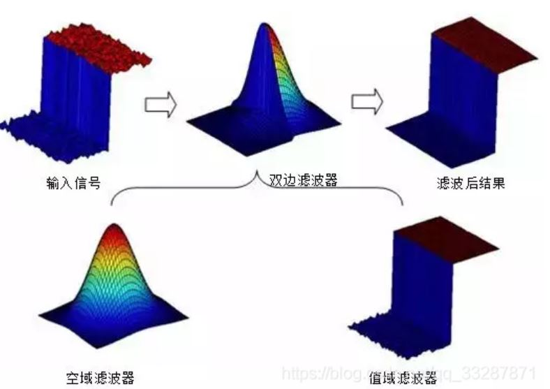

# OpenCV 8_噪声与图像滤波

## 1. 噪声的添加
### 1.1 椒盐噪声
椒盐噪声又被称作脉冲噪声，它会随机改变图像中的像素值，是由相机成像、图像传输、解码处理等过程产生的黑白相间的亮暗点噪声，其样子就像在图像上随机的撒上一些盐粒和黑椒粒，因此被称为椒盐噪声。

随机数生成函数：
```c++
int cvflann::rand();
double cvflann::rand_double(double high = 1.0,double low = 0 );
int cvflann::rand_int(int high = RAND_MAX,int low = 0 );
```

添加步骤：
>1. 确定添加椒盐噪声的位置。根据椒盐噪声会随机出现在图像中任何一个位置的特性，我们可以通过随机数函数生成两个随机数，分别用于确定椒盐噪声产生的行和列。
>2. 确定噪声的种类。不仅椒盐噪声的位置是随机的，噪声点是黑色的还是白色的也是随机的，因此可以再次生成的随机数，通过判断随机数的奇偶性确定该像素是黑色噪声点还是白色噪声点。
>3. 修改图像像素灰度值。判断图像通道数，通道数不同的图像中像素表示白色的方式也不相同。也可以根据需求只改变多通道图像中某一个通道的数值。
>4. 得到含有椒盐噪声的图像。

```c++
#include<iostream>
#include<opencv2/opencv.hpp>
#include<opencv2/highgui/highgui.hpp>

using namespace std;
using namespace cv;

void AddSalt(Mat& img, int n);

int main()
{
	Mat img = imread("picture.jpg");
	if (img.empty())
	{
		cout << "Fail to open!" << endl;
		return -1;
	}

	Mat gray;


	cvtColor(img, gray, COLOR_BGR2GRAY);

	imshow("img", img);
	imshow("gray", gray);

	AddSalt(img, 10000);
	AddSalt(gray, 10000);

	imshow("img", img);
	imshow("gray", gray);

	waitKey();


	return 0;
}

void AddSalt(Mat& img, int n)
{
	for (int i = 0; i < n; i++)
	{
		int a = cvflann::rand_int(img.rows, 0);
		int b = cvflann::rand_int(img.cols, 0);

		int flag = cvflann::rand_int(32767, 0) % 2;
		if (flag == 1)
		{
			if (img.type() == CV_8UC1)
			{
				img.at<uchar>(a, b) = 255;
			}
			else if (img.type() == CV_8UC3)
			{
				img.at<Vec3b>(a, b)[0] = 255;
				img.at<Vec3b>(a, b)[1] = 255;
				img.at<Vec3b>(a, b)[2] = 255;
			}
		}
		if (flag == 0)
		{
			if (img.type() == CV_8UC1)
			{
				img.at<uchar>(a, b) = 0;
			}
			else if (img.type() == CV_8UC3)
			{
				img.at<Vec3b>(a, b)[0] = 0;
				img.at<Vec3b>(a, b)[1] = 0;
				img.at<Vec3b>(a, b)[2] = 0;
			}
		}
	}
}
```

### 1.2 高斯噪声
高斯白噪声是指噪声分布的概率密度服从高斯分布(正态分布)的一类噪声，其产生的主要原因是由于相机在拍摄时视场较暗且亮度不均匀造成的，同时相机长时间工作使得温度过高也会引起高斯噪声，另外电路元器件自身噪声和互相影响也是造成高斯噪声的重要原因之一。

随机数生成函数：
```c++
void cv::RNG::fill(InputOutputArray mat,
                   int  distType,
                   InputArray a,
                   InputArray b,
                   bool  saturateRange = false 
                  );
```
>mat：用于存放随机数的矩阵，目前只支持低于5通道的矩阵。
>
>distType：随机数分布形式选择标志，目前生成的随机数支持均匀分布（RNG::UNIFORM，0）和高斯分布（RNG::NORMAL，1）。
>
>a：确定分布规律的参数。当选择均匀分布时，该参数表示均匀分布的最小下限；当选择高斯分布时，该参数表示高斯分布的均值。
>
>b：确定分布规律的参数。当选择均匀分布时，该参数表示均匀分布的最大上限；当选择高斯分布时，该参数表示高斯分布的标准差。
>
>saturateRange：预饱和标志，仅用于均匀分布。

```c++
#include<iostream>
#include<opencv2/opencv.hpp>
#include<opencv2/highgui/highgui.hpp>

using namespace std;
using namespace cv;

int main()
{
	Mat img = imread("picture.jpg");
	if (img.empty())
	{
		cout << "Fail to open!" << endl;
		return -1;
	}

	Mat gray;
	cvtColor(img, gray, COLOR_BGR2GRAY);

	imshow("img", img);
	imshow("gray", gray);

	Mat noise = Mat::zeros(Size(img.cols, img.rows), CV_8UC3);
    Mat g_noise = Mat::zeros(Size(img.cols, img.rows), CV_8UC1);

	RNG rng;
	rng.fill(noise, RNG::NORMAL, 10, 20);
	rng.fill(g_noise, RNG::NORMAL, 15, 30);

	imshow("img_noise", noise);
	imshow("gray_noise", g_noise);

	img = img + noise;
	gray = gray + g_noise;

	imshow("img", img);
	imshow("gray", gray);

	waitKey();
	return 0;
}
```

## 2. 图像滤波

### 2.1 均值滤波
均值滤波将滤波器内所有的像素值都看作中心像素值的测量，将滤波器内所有的像数值的平均值作为滤波器中心处图像像素值。滤波器内的每个数据表示对应的像素在决定中心像素值的过程中所占的权重，由于滤波器内所有的像素值在决定中心像素值的过程中占有相同的权重，因此滤波器内每个数据都相等。均值滤波的优点是在像素值变换趋势一致的情况下，可以将受噪声影响而突然变化的像素值修正到接近周围像素值变化的一致性下。但是这种滤波方式会缩小像素值之间的差距，使得细节信息变得更加模糊，滤波器范围越大，变模糊的效果越明显。
```c++
void cv::blur(InputArray  src,
              OutputArray  dst,
              Size  ksize,
              Point  anchor = Point(-1,-1),
              int  borderType = BORDER_DEFAULT 
             );
```
>src:待均值滤波的图像，图像的数据类型必须是CV_8U、CV_16U、CV_16S、CV_32F和CV_64F这五种数据类型之一。
>
>dst：均值滤波后的图像，与输入图像具有相同的尺寸和数据类型。
>
>ksize：卷积核尺寸。
>
>anchor：内核的基准点(锚点)，其默认值为(-1,-1)代表内核基准点位于kernel的中心位置。基准点即卷积核中与进行处理的像素点重合的点，其位置必须在卷积核的内部。
>
>borderType：像素外推法选择标志，默认参数BORDER_DEFAULT，表示不包含边界值倒序填充。

第三个参数是滤波器的尺寸，输入滤波器的尺寸后函数会自动确定滤波器，其形式如下：
$$
K = \frac{1}{width*height}\left[\begin{matrix}
1 &1&1 &... &1\\
1&1&1&...&1\\
.&.&.&...&.\\
1&1&1&...&1
\end{matrix}
	\right]
$$

第四个参数为确定滤波器的基准点，默认状态下滤波器的几何中心就是基准点，不过也可以根据需求自由的调整，在均值滤波中调整基准点的位置主要影响图像外推的方向和外推的尺寸。第五个参数是图像外推方法选择标志，根据需求可以自由的选择。原图像边缘位置滤波计算过程需要使用到外推的像素值，但是这些像素值并不能真实反应图像像素值的变化情况，因此在滤波后的图像里边缘处的信息可能会出现巨大的改变，这属于正常现象。如果在边缘处有比较重要的信息，可以适当缩小滤波器尺寸、选择合适的滤波器基准点或者使用合适的图像外推算法。

### 2.2 方框滤波

方框滤波是均值滤波的一般形式，在均值滤波中，将滤波器中所有的像素值求和后的平均值作为滤波后结果，方框滤波也是求滤波器内所有像素值的之和，但是方框滤波可以选择不进行归一化，就是将所有像素值的和作为滤波结果，而不是所有像素值的平均值。

```c++
void cv::boxFilter(InputArray  src,
                   OutputArray  dst,
                   int  ddepth,
                   Size  ksize,
                   Point  anchor = Point(-1,-1),
                   bool  normalize = true,
                   int  borderType = BORDER_DEFAULT 
                  );
```
>src：输入图像。
>
>dst：输出图像，与输入图像具有相同的尺寸和通道数。
>
>ddepth：输出图像的数据类型（深度），根据输入图像的数据类型不同拥有不同的取值范围，当赋值为-1时，输出图像的数据类型自动选择。
>
>ksize：卷积核尺寸。
>
>anchor：内核的基准点(锚点)，其默认值为(-1,-1)代表内核基准点位于kernel的中心位置。基准点即卷积核中与进行处理的像素点重合的点，其位置必须在卷积核的内部。
>
>normalize：是否将卷积核进行归一化的标志，默认参数为true，表示进行归一化。
>
>borderType：像素外推法选择标志，默认参数为BORDER_DEFAULT，表示不包含边界值倒序填充。

`sqrBoxFilter()`函数实现对滤波器内每个像数值的平方求和，之后根据输入参数选择是否进行归一化操作.

```c++
void cv::sqrBoxFilter(InputArray  src,
                      OutputArray  dst,
                      int  ddepth,
                      Size  ksize,
                      Point  anchor = Point(-1, -1),
                      bool  normalize = true,
                      int  borderType = BORDER_DEFAULT 
                     );
```

### 2.3 高斯滤波

高斯噪声是一种常见的噪声，图像采集的众多过程中都容易引入高斯噪声，因此针对高斯噪声的高斯滤波也广泛应用于图像去噪领域。高斯滤波器考虑了像素离滤波器中心距离的影响，以滤波器中心位置为高斯分布的均值，根据高斯分布公式和每个像素离中心位置的距离计算出滤波器内每个位置的数值，从而形成一个高斯滤波器。之后将高斯滤波器与图像之间进行滤波操作，进而实现对图像的高斯滤波。

```c++
void cv::GaussianBlur(InputArray  src,
                       OutputArray  dst,
                       Size  ksize,
                       double  sigmaX,
                       double  sigmaY = 0,
                       int  borderType = BORDER_DEFAULT 
                      );
```
>src：待高斯滤波图像，图像可以具有任意的通道数目，但是数据类型必须为CV_8U，CV_16U，CV_16S，CV_32F或CV_64F。
>
>dst：输出图像，与输入图像src具有相同的尺寸、通道数和数据类型。
>
>ksize：高斯滤波器的尺寸，滤波器可以不为正方形，但是必须是正奇数。如果尺寸为0，则由标准偏差计算尺寸。
>
>sigmaX：X方向的高斯滤波器标准偏差。
>
>sigmaY：Y方向的高斯滤波器标准偏差;如果输入量为0，则将其设置为等于sigmaX，如果两个轴的标准差均为0，则根据输入的高斯滤波器尺寸计算标准偏差。
>
>borderType：像素外推法选择标志，取值范围在表3-5中给出，默认参数为BORDER_DEFAULT，表示不包含边界值倒序填充。

输入滤波器单一方向尺寸和标准偏差生成单一方向高斯滤波器的`getGaussianKernel()`函数:
```c++
Mat cv::getGaussianKernel(int  ksize,
                          double  sigma,
                          int  ktype = CV_64F 
                         );
```
>ksize：高斯滤波器的尺寸。
>
>sigma：高斯滤波的标准差。
>
>ktype：滤波器系数的数据类型，可以是CV_32F或者CV_64F，默认数据类型为CV_64F。

生成一个二维的高斯滤波器需要调用两次`getGaussianKernel()`函数，将X方向的一维高斯滤波器和Y方向的一维高斯滤波器相乘，得到最终的二维高斯滤波器。

### 2.4 可分离滤波

自定义卷积函数
```c++
void cv::filter2D(InputArray   src,
                  OutputArray  dst,
                  int          ddepth,
                  InputArray   kernel,
                  Point        anchor=Point(-1, -1),
                  double       delta=0,
                  int          borderType=BORDER_DEFAULT
                 );
```

两方向卷积函数
```c++
void cv::sepFilter2D(InputArray  src,
                     OutputArray  dst,
                     int  ddepth,
                     InputArray  kernelX,
                     InputArray  kernelY,
                     Point  anchor = Point(-1,-1),
                     double  delta = 0,
                     int  borderType = BORDER_DEFAULT 
                     )
```
>src：待滤波图像
>
>dst：输出图像，与输入图像src具有相同的尺寸、通道数和数据类型。
>
>ddepth：输出图像的数据类型（深度），根据输入图像的数据类型不同拥有不同的取值范围，当赋值为-1时，输出图像的数据类型自动选择。
>
>kernelX：X方向的滤波器，
>
>kernelY：Y方向的滤波器。
>
>anchor：内核的基准点(锚点)，其默认值为(-1,-1)代表内核基准点位于kernel的中心位置。基准点即卷积核中与进行处理的像素点重合的点，其位置必须在卷积核的内部。
>
>delta：偏值，在计算结果中加上偏值。
>
>borderType：像素外推法选择标志。默认参数为BORDER_DEFAULT，表示不包含边界值倒序填充。

该函数将可分离的线性滤波器分离成X方向和Y方向进行处理，与`filter2D()`函数不同之处在于，`filter2D()`函数需要通过滤波器的尺寸区分滤波操作是作用在X方向还是Y方向，例如滤波器尺寸为K×1时是Y方向滤波，1×K尺寸的滤波器是X方向滤波。而`sepFilter2D()`函数通过不同参数区分滤波器是作用在X方向还是Y方向，无论输入滤波器的尺寸是K×1还是1×K，都不会影响滤波结果。

### 2.5 中值滤波

中值滤波就是用滤波器范围内所有像素值的中值来替代滤波器中心位置像素值的滤波方法，是一种基于排序统计理论的能够有效抑制噪声的非线性信号处理方法。

中值滤波将滤波器范围内所有的像素值按照由小到大的顺序排列，选取排序序列的中值作为滤波器中心处黄色像素的新像素值，之后将滤波器移动到下一个位置，重复进行排序取中值的操作，直到将图像所有的像素点都被滤波器中心对应一遍。中值滤波不依赖于滤波器内那些与典型值差别很大的值，因此对斑点噪声和椒盐噪声的处理具有较好的处理效果。

相比于均值滤波，中值滤波对于脉冲干扰信号和图像扫描噪声的处理效果更佳，同时在一定条件下中值滤波对图像的边缘信息保护效果更佳，可以避免图像细节的模糊，但是当中值滤波尺寸变大之后同样会产生图像模糊的效果。在处理时间上，中值滤波所消耗的时间要远大于均值滤波消耗的时间。

```c++
void cv::medianBlur(InputArray src,
                    OutputArray  dst,
                    int  ksize 
                   );
```

### 2.6 双边滤波

双边滤波就是经典的常用的能够保留图像边缘信息的滤波算法之一。双边滤波是一种综合考虑滤波器内图像空域信息和滤波器内图像像素灰度值相似性的滤波算法，可以实现在保留区域信息的基础上实现对噪声的去除、对局部边缘的平滑。双边滤波对高频率的波动信号起到平滑的作用，同时保留大幅值的信号波动，进而实现对保留图像中边缘信息的作用。



双边滤波原理：
$$
g(i,j) = \frac{\Sigma_{k,l}f(k,l)\omega(i,j,k,l)}{\Sigma_{k,l}\omega(i,j,k,l)}
$$
其中$\omega(i,j,k,l)$为加权系数，其取值决定于空域滤波器和值域滤波器的乘积，空域滤波器的表示形式如式(1)所示，值域表示形式如式(2)所示。
$$
d(i,j,k,l)=exp(-\frac{(i-k)^2+(j-l)^2}{2\sigma_d^2})
\\
\\
r(i,j,k,l)=exp(-\frac{||f(i,j)-f(k,l)||^2}{2\sigma_r^2})
$$
则
$$
\omega(i,j,k,l) = exp(-\frac{(i-k)^2+(j-l)^2}{2\sigma_d^2}-\frac{||f(i,j)-f(k,l)||^2}{2\sigma_r^2})
$$
```c++
void cv::bilateralFilter(InputArray  src,
                         OutputArray  dst,
                         int  d,
                         double  sigmaColor,
                         double  sigmaSpace,
                         int  borderType = BORDER_DEFAULT 
                        );
```
>src：待双边滤波图像，图像数据类型为必须是CV_8U、CV_32F和CV_64F三者之一，并且通道数必须为单通道或者三通道。
>
>dst：双边滤波后的图像，尺寸和数据类型与输入图像src相同。
>
>d：滤波过程中每个像素邻域的直径，如果这个值是非正数，则由第五个参数sigmaSpace计算得到。
>
>sigmaColor：颜色空间滤波器的标准差值，这个参数越大表明该像素领域内有越多的颜色被混合到一起，产生较大的半相等颜色区域。
>
>sigmaSpace：空间坐标中滤波器的标准差值，这个参数越大表明越远的像素会相互影响，从而使更大领域中有足够相似的颜色获取相同的颜色。当第三个参数d大于0时，邻域范围由d确定，当第三个参数小于等于0时，邻域范围正比于这个参数的数值。
>
>borderType：像素外推法选择标志，默认参数为BORDER_DEFAULT，表示不包含边界值倒序填充。

当滤波器的直径大于5时，函数的运行速度会变慢，因此如果需要在实时系统中使用该函数，建议将滤波器的半径设置为5，对于离线处理含有大量噪声的滤波图像时，可以将滤波器的半径设为9，当滤波器半径为非正数的时候，会根据空间滤波器的标准差计算滤波器的直径。

函数第四个和第五个参数是两个滤波器的标准差值，为了简单起见可以将两个参数设置成相同的数值，当小于10时，滤波器对图像的滤波作用较弱，当大于150时滤波效果会非常的强烈，使图像看起来具有卡通的效果。该函数运行时间比其他滤波方法时间要长，因此在实际工程中使用的时候，选择合适的参数十分重要。另外比较有趣的现象是，使用双边滤波会具有美颜效果。
