# OpenCV-Python 10_双目视觉

双目视觉主要包括**相机标定、图片畸变矫正、摄像机校正、图片匹配、3D重构**五个部分。

## 0. 打开双目摄像头

- 两个摄像头不共用设备 ID，则可以通过不同的 ID 号打开摄像头。

- 如果两个摄像头共用设备 ID，则可以通过调整分辨率获取到每一帧图像，每一帧图像包含左侧和右侧两个摄像头的图像。

  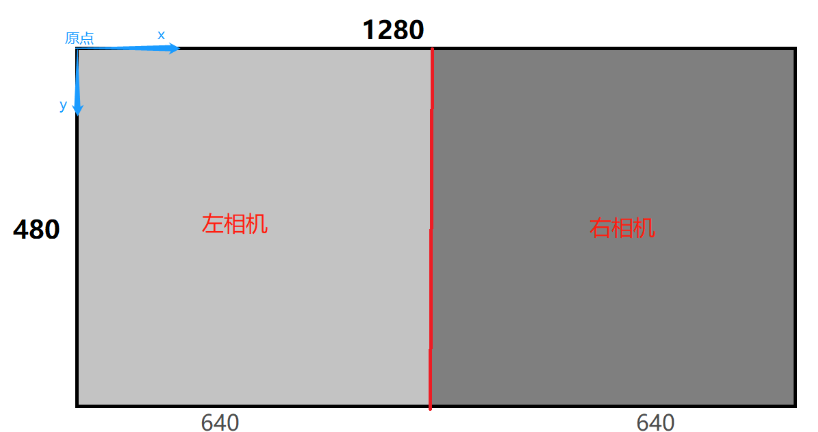

## 1. 单目相机标定

相机参数的估计过程称为相机标定。这意味着我们拥有关于相机的所有信息（参数或系数），这些信息用于确定真实世界中的3D点与其在该标定相机捕获的图像中的相应2D投影（像素）之间的精确关系。

此时需要恢复两种操作：

> 1. 内部参数相机/镜头系统，如透镜的焦距、光学中心和径向畸变系数。
> 2. 外部参数，指相机相对于世界坐标系的方位(旋转和平移)。

相机标定后，图像中的失真将会消除。

### 单目标定原理

#### 坐标系变换

假设在房间里安装了一台照相机。给定三维点P在这个房间里，我们想要找到这个3D点的像素坐标(u，v)在相机拍摄的图像中。在这个设置中有三个坐标系在起作用。

1. 世界坐标系$W$

    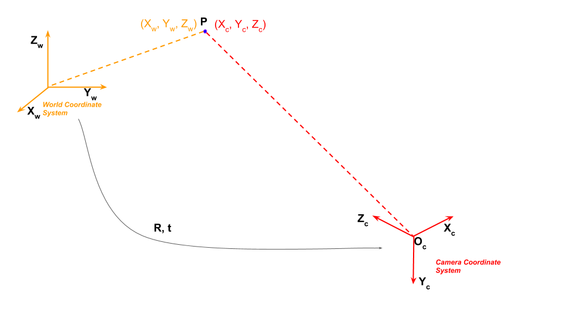

    世界坐标系$W$和相机坐标系$C$通过旋转和平移联系起来。世界坐标系应当按照以下原则定义：

    > 1. 存在一个原点；
    > 2. 沿着地板上的二维定义房间的X轴和Y轴，沿着垂直墙定义房间的Z轴。
    
    世界坐标系的作用：
    
    > 1. 标定时确定标定物的位置；
    > 2. 作为双目视觉的系统参考系，给出两个摄像机相对世界坐标系的关系，从而求出相机之间的相对关系；
    > 3. 作为重建得到三维坐标的容器，存放重建后的物体的三维坐标。世界坐标系是将看见中物体纳入运算的第一站。

2. 相机坐标系$C$

    现在，让我们把相机放在这个房间里。这个房间的图像将用这个相机拍摄，因此，我们感兴趣的是连接到这个相机上的三维坐标系。如果我们将相机放在房间的原点，并使其X,Y和Z轴与房间的x,y,z轴对齐，则两个坐标系将是等同的。

    然而，我们想把相机放在房间里的任何地方，它应该可以在任何地方看到。在这种情况下，我们需要找出三维房间(即世界)坐标和三维相机坐标之间的关系。

    世界坐标和相机坐标由旋转矩阵 $R$ 和一个三元平移矢量 $t$ 关联。
    $$
    \left[
    \begin{matrix}
    X_c \\
    Y_c \\
    Z_c
    \end{matrix}
    \right] = R\left[
    \begin{matrix}
    X_w \\
    Y_w \\
    Z_w
    \end{matrix}
    \right] + t
    $$
    为了方便表示，通常将坐标转换为齐次坐标的形式：
    $$
    \left[
    \begin{matrix}
    X_c \\
    Y_c \\
    Z_c \\
    1
    \end{matrix}
    \right] = 
    \left[
    \begin{matrix}
    R|t
    \end{matrix}
    \right] 
    \left[
    \begin{matrix}
    X_w \\
    Y_w \\
    Z_w \\
    1
    \end{matrix}
    \right]
    $$
    则外参矩阵为矩阵$[R|t]$。

3. 图像坐标系

    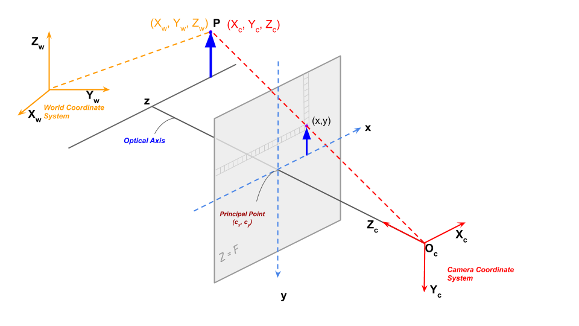

    > 点P在图像平面上的投影如上图所示。一旦我们通过对点世界坐标应用旋转和平移来获得相机三维坐标系中的点，我们就可以将该点投影到图像平面上以获得该点在图像中的位置。

    上图显示了简单针孔相机的相机投影。光学中心（针孔）用$O_c$表示，实际上在像面上形成点的倒像。为了数学上的方便，假定“成像点”在光学中心之前$f$处，且成一个正立像。

    空间三维点$(X_c,Y_c,Z_c)$的投影坐标由下式给出：
    $$
    x = f\frac{X_c}{Y_c} \\
    y = f\frac{Y_c}{Z_c}
    $$
    使用矩阵形式重写为：
    $$
    \left[
    \begin{matrix}
    x^, \\
    y^, \\
    z^, \\
    \end{matrix}
    \right] = \left[
    \begin{matrix}
    f & 0 & 0 \\
    0 & f & 0 \\
    0 & 0 & 1 \\
    \end{matrix}
    \right]\left[
    \begin{matrix}
    X_c \\
    Y_c \\
    Z_c
    \end{matrix}
    \right]
    $$
    矩阵$K$为内参矩阵，包含相机的内在参数。图像传感器中的像素可能不是方形的，因此我们可能有两个不同的焦距$f_x$和$f_y$。光学中心($c_x$, $c_y$)相机的中心可能与图像坐标系的中心不重合。此外，相机传感器的x轴和y轴之间可能有一个小的倾斜$\gamma$。此时，可将内参矩阵改为：
    $$
    K = \left[
    \begin{matrix}
    f_x & \gamma & c_x \\
    0 & f_y & c_y \\
    0 & 0 & 1 \\
    \end{matrix}
    \right]
    $$

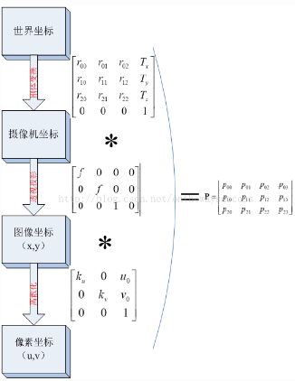

#### 相机畸变

摄像机拍照时通过透镜把实物投影到像平面上，但是透镜由于制造精度以及组装工艺的偏差会引入畸变，导致原始图像的失真。因此我们需要考虑成像畸变的问题。

透镜的畸变主要分为径向畸变和切向畸变，还有薄透镜畸变等等，但都没有径向和切向畸变影响显著，所以我们在这里只考虑径向和切向畸变。

1. 径向畸变

   径向畸变就是沿着透镜半径方向分布的畸变，产生原因是光线在原理透镜中心的地方比靠近中心的地方更加弯曲，这种畸变在普通廉价的镜头中表现更加明显，径向畸变主要包括桶形畸变和枕形畸变两种。

   以下分别是枕形和桶形畸变示意图：

   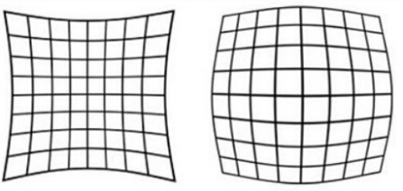

   像平面中心的畸变为0，沿着镜头半径方向向边缘移动，畸变越来越严重。畸变的数学模型可以用主点（principle point）周围的泰勒级数展开式的前几项进行描述，通常使用前两项，即 $k_1$ 和 $k_2$，对于畸变很大的镜头，如鱼眼镜头，可以增加使用第三项 $k_3$ 来进行描述，成像仪上某点根据其在径向方向上的分布位置，调节公式为：
   $$
   x_0 = x(1+k_1r^2+k_2r^4+k_3r^6) \\
   y_0 = y(1+k_1r^2+k_2r^4+k_3r^6)
   $$

2. 切向畸变

   切向畸变是由于透镜本身与相机传感器平面（像平面）或图像平面不平行而产生的，这种情况多是由于透镜被粘贴到镜头模组上的安装偏差导致。畸变模型可以用两个额外的参数 $p_1$ 和 $p_2$ 来描述：
   $$
   x_0 = 2p_1xy+p_2(r^2+2x^2)+1
   $$

径向畸变和切向畸变模型中一共有5个畸变参数，经常被定义为Mat矩阵的形式。

### 单目标定方法

相机标定的目的就是建立摄像机图像像素位置与物体空间位置之间的关系，即世界坐标系与图像坐标系之间的关系。方法就是根据摄像机模型，由已知特征点的坐标求解摄像机的模型参数，从而可以从图像出发恢复出空间点三维坐标，即三维重建。所以要求解的参数包括4个内参数和5个畸变参数，还有外部参数旋转矩阵和平移矩阵。

“张氏标定”是指张正友教授于1998年提出的单平面棋盘格的摄像机标定方法。张氏标定法已经作为工具箱或封装好的函数被广泛应用。张氏标定法为相机标定提供了很大便利，并且具有很高的精度。从此标定可以不需要特殊的标定物，只需要一张打印出来的棋盘格。

标定过程的目标是使用一组已知的三维点$(X_W,Y_W,Z_W)$及其对应的图像坐标$(u,v)$，找到3×3矩阵$K$、3×3旋转矩阵$R$、3×1平移向量$T$。

> - 输入：具有已知二维图像坐标和三维世界坐标的点的图像集合。
> - 输出：3×3相机内参矩阵，每幅图像的旋转和平移。

### OpenCV 的单目相机标定

准备：棋盘格（打印棋盘格（打印机有充足墨水）>电脑屏幕>购买专用棋盘格）

> 棋盘图案是独特的，易于检测的图像。不仅如此，棋盘格上正方形的角点非常适合定位它们，因为它们在两个方向上都有尖锐的梯度。此外，这些角也与它们位于棋盘格线的交点有关。所有这些事实都被用来在棋盘格模式中可靠地定位正方形的角点。

1. 从不同的角度捕获棋盘的多个图像

   接下来，保持棋盘格静止，通过移动相机拍摄棋盘格的多个图像。或者也可以保持相机恒定，在不同方向拍摄棋盘格图案。


2. 查找棋盘的相机坐标

OpenCV提供了一个名为`findChessboardCorners()`的内置函数，该函数查找棋盘并返回角点的坐标。

```python
"""
	查找棋盘格角点函数
	image		棋盘源图像，必须是8位灰度或彩色图像
	patternSize	 每个棋盘行和列的内角点数
	corners		检测到的角点的输出数组
"""
retval, corners = cv2.findChessboardCorners(image, patternSize, flags)
```

输出是真是假取决于是否检测到角点。所以，拍摄质量极其重要，建议通过此函数筛选出可用的图片。为了获得足够好的标定结果，通常使用**20—40张不同方位的棋盘格照片**。

3. 优化坐标

OpenCV的`cornersubix()`函数接收原始图像和角点的位置，并在原始位置的一个小邻域内寻找最佳角点位置。

```python
"""
	优化棋盘格角点函数
	image		棋盘源图像，必须是8位灰度或彩色图像
	corners		输入角点的初始坐标和为输出提供的精确坐标
	WinSize		搜索窗口边长的一半
	zeroZone	搜索区域中间零区大小的一半，在该零区上不进行下式求和。它有时用于避免自相关矩阵的可能奇点。
	criteria	角点精化迭代过程的终止准则。
"""
cv2.cornerSubPix(image, corners, winSize, zeroZone, criteria)
```

4. 相机标定

校准的最后一步是将世界坐标系中的3D点及其在所有图像中的2D位置传递给OpenCV的`caliberecamera()`方法。

```python
"""
	相机校准函数
	objectPoints	三维图像点的矢量
	imagePoints		二维图像点的矢量
	imageSize		图像大小
	cameraMatrix	内参矩阵
	distCoeffs		透镜畸变系数
	rvecs			用于表达旋转的3×1矢量。矢量的方向指定旋转轴，矢量的大小指定旋转角度
	tvecs			用于表达位移的3×1矢量
"""
retval, cameraMatrix, distCoeffs, rvecs, tvecs = cv2.calibrateCamera(objectPoints, imagePoints, imageSize)
```

5. 畸变矫正

首先需要优化得到的相机内参矩阵`getOptimalNewCameraMatrix()`。

```python
"""
	优化内参函数
	cameraMatrix	 畸变图像对应的内参
	distCoeffs	     畸变矫正系数
	imageSize		畸变图像的宽和高
	alpha			因为畸变矫正后有黑边，这个值指示的是保留多少畸变后的像素，选择0，那么就意味着保留最少的黑边，使用1的话，保留全部像素，那么所有黑边都包含进去了
	newImgSize		 矫正后的图像尺寸
	
	roi				得到图像无黑边的ROI值
	newcameramtx	 新得到的相机内参矩阵
"""
newcameramtx, roi = getOptimalNewCameraMatrix(cameraMatrix, distCoeffs, imageSize, alpha, newImgSize, centerPrincipalPoint)
```

随后使用`undistort()`函数裁剪结果

```python
 """
	相机校准函数
	src				原图像
	cameraMatrix	 原相机内参矩阵
	dist			畸变矫正系数
	newCameraMatrix  优化后的相机内参矩阵
"""
dst = undistort(src, cameraMatrix, distCoeffs, dst, newCameraMatrix)
```

使用`undistortPoints`函数可以得到去畸变之后部分点的校正结果。

也可以使用`initUndistortRectifyMap()`和`remap()`函数进行输出映射。

```python
"""
	输出映射函数
	cameraMatrix	 畸变图像对应的内参
	distCoeffs	     畸变矫正系数
	R				旋转矩阵，对于单目视觉通常为单位阵(None)
	newCameraMatrix  矫正图像对应的内参
	size			输出图像大小
	m1type			输出映射1的类型
	map1			输出映射1
	map2			输出映射2
"""
mapx, mapy = initUndistortRectifyMap(cameraMatrix, distCoeffs, R, newCameraMatrix, size, m1type, map1, map2)
```

- 相机校正工具：

```python
import cv2
import numpy as np
import glob


# 找棋盘格角点
# 设置寻找亚像素角点的参数，采用的停止准则是最大循环次数30和最大误差容限0.001
criteria = (cv2.TERM_CRITERIA_EPS + cv2.TERM_CRITERIA_MAX_ITER, 30, 0.001)  # 阈值
# 棋盘格模板规格
w = 9  # 10 - 1
h = 6  # 7  - 1
# 世界坐标系中的棋盘格点,例如(0,0,0), (1,0,0), (2,0,0) ....,(8,5,0)，去掉Z坐标，记为二维矩阵
objp = np.zeros((w * h, 3), np.float32)
objp[:, :2] = np.mgrid[0:w, 0:h].T.reshape(-1, 2)
objp = objp * 18.1  # 18.1 mm

# 储存棋盘格角点的世界坐标和图像坐标对
objpoints = []  # 在世界坐标系中的三维点
imgpoints = []  # 在图像平面的二维点
# 加载pic文件夹下所有的jpg图像
images = glob.glob("./*.jpg")  #   拍摄的十几张棋盘图片所在目录

i = 0
for fname in images:

    img = cv2.imread(fname)
    # 获取画面中心点
    # 获取图像的长宽

    h1, w1 = img.shape[0], img.shape[1]
    gray = cv2.cvtColor(img, cv2.COLOR_BGR2GRAY)
    u, v = img.shape[:2]
    # 找到棋盘格角点
    ret, corners = cv2.findChessboardCorners(gray, (w, h), None)
    # 如果找到足够点对，将其存储起来
    if ret == True:
        print("i:", i)
        i = i + 1
        # 在原角点的基础上寻找亚像素角点
        cv2.cornerSubPix(gray, corners, (11, 11), (-1, -1), criteria)
        # 追加进入世界三维点和平面二维点中
        objpoints.append(objp)
        imgpoints.append(corners)
        # 将角点在图像上显示
        cv2.drawChessboardCorners(img, (w, h), corners, ret)
        cv2.namedWindow("findCorners", cv2.WINDOW_NORMAL)
        cv2.resizeWindow("findCorners", 640, 480)
        cv2.imshow("findCorners", img)
        cv2.waitKey(1000)
    else:
        print("pass")
cv2.destroyAllWindows()
# %% 标定
print("正在计算")
# 标定
ret, mtx, dist, rvecs, tvecs = cv2.calibrateCamera(
    objpoints, imgpoints, gray.shape[::-1], None, None
)


print("ret:", ret)
print("mtx:\n", mtx)  # 内参数矩阵
print(
    "dist畸变值:\n", dist
)  # 畸变系数   distortion cofficients = (k_1,k_2,p_1,p_2,k_3)
print("rvecs旋转（向量）外参:\n", rvecs)  # 旋转向量  # 外参数
print("tvecs平移（向量）外参:\n", tvecs)  # 平移向量  # 外参数
newcameramtx, roi = cv2.getOptimalNewCameraMatrix(mtx, dist, (u, v), 0, (u, v))
print("newcameramtx外参", newcameramtx)
# 打开摄像机
camera = cv2.VideoCapture(0)
while True:
    (grabbed, frame) = camera.read()
    h1, w1 = frame.shape[:2]
    newcameramtx, roi = cv2.getOptimalNewCameraMatrix(mtx, dist, (u, v), 0, (u, v))
    # 纠正畸变
    dst1 = cv2.undistort(frame, mtx, dist, None, newcameramtx)
    # dst2 = cv2.undistort(frame, mtx, dist, None, newcameramtx)
    mapx, mapy = cv2.initUndistortRectifyMap(mtx, dist, None, newcameramtx, (w1, h1), 5)
    dst2 = cv2.remap(frame, mapx, mapy, cv2.INTER_LINEAR)
    # 裁剪图像，输出纠正畸变以后的图片
    x, y, w1, h1 = roi
    dst1 = dst1[y : y + h1, x : x + w1]

    # cv2.imshow('frame',dst2)
    # cv2.imshow('dst1',dst1)
    cv2.imshow("dst2", dst2)
    if cv2.waitKey(1) & 0xFF == ord("q"):  # 按q保存一张图片
        cv2.imwrite("../u4/frame.jpg", dst1)
        break

camera.release()
cv2.destroyAllWindows()
```

## 2. 双目相机标定

### 双目标定原理

#### 坐标系变换

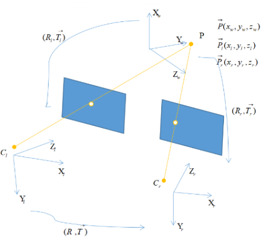

假设空间中有一个点 $P$ ，在世界坐标系下的坐标为 $(x_w,y_w,z_w)$，在单目标定的过程中，获取了从世界坐标系到相机坐标系的旋转平移矩阵。因此如果已知某一点的世界坐标，通过旋转平移矩阵，可以计算出在相机坐标系的坐标。

令 $(x_l,y_l,z_l)$ 为左摄像头坐标系下的坐标，$(x_r,y_r,z_r)$ 为在右摄像头坐标系下的坐标，$[R_l|t_l]$ 为左摄像头的旋转平移矩阵，$[R_r|t_r]$ 为右摄像头的旋转平移矩阵，则可以得到：
$$
\vec{P_l} = R_l\vec{P}+\vec{t_l} \\
\vec{P_r} = R_r\vec{P}+\vec{t_r}
$$
令 $[R|t]$ 为左摄像头到右摄像头的旋转平移矩阵，则有：
$$
R = R_rR_l^T \\
t = t_r - Rt_l
$$
左右相机分别进行单目标定，就可以分别得到 $R_l,t_l,R_r,t_r$。带入上式就可以求出左右相机之间的旋转平移矩阵。

#### 立体校正

双目摄像机系统主要的任务就是测距，而视差求距离公式是在双目系统处于理想情况下推导的，但是在现实的双目立体视觉系统中，是不存在完全的共面行对准的两个摄像机图像平面的。所以我们要进行立体校正。立体校正的目的就是，把实际中消除畸变后的非共面行对准的两幅图像，校正成共面行对准。

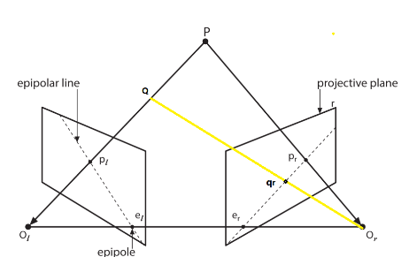

对极几何引入了极点 (epipole) 和极线 (epipole lines) 两个概念。

> - 极点：一个像平面上 (projective plane) 的极点定义为另一个摄像机的投影中心在该像平面上的成像点。(图中的$e_l,e_r$)
> - 极线：连接点 $P$ 的成像点 $p_l$ 和 $e_l$ 的线，称为极线。
> - 对极约束：给定图像上的一点 $P_i$，该点在另一幅图像上的匹配点一定在对应的极线上。
>
> 通常双目校正算法把 $p_{l}e_{l}$ 和 $p_{r}e_{r}$ 调整成平行于 $O_{l}O_{r}$，且行对齐。常见算法有Hartley 算法，Bouguet 算法等。

- Bouguet 算法

  1. 将两个摄像机的投影平面调整成共面，但是极线没有对齐

     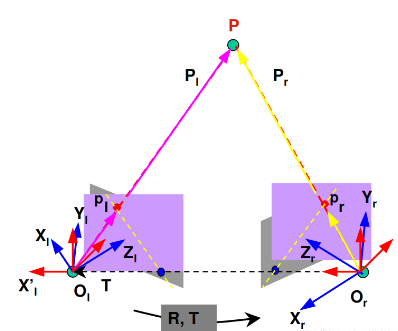

     已知左右摄相机的旋转平移矩阵，只需将一个平面按照此矩阵旋转，就可以将两个平面调整为共面，但是这样容易产生较大的畸变。

     将旋转矩阵 $R$ 和平移矩阵 $t$ 分解成左右相机各旋转一半的旋转和平移矩阵 $R_l,t_l,R_r,t_r$ 。分解的原则是使得左右图像重投影造成的畸变最小，左右视图的共同面积最大。

     第一步，将右图像平面相对于左图像平面的旋转矩阵分解成两个矩阵 $R_l$ 和 $R_r$ 叫做左右相机的合成旋转矩阵。
     $$
     R_l = R^{\frac{1}{2}} \\
     R_r = R^{-\frac{1}{2}}
     $$
     第二步，将左右相机各旋转一半，使得左右相机的光轴平行。

  2. 将极线对齐
  
     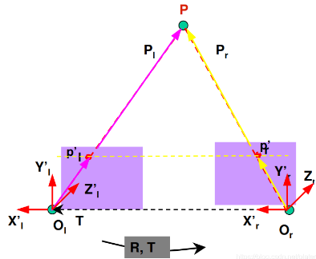
  
     构造变换矩矩阵 $R_{rect}$ 使得基线与成像平面平行。构造的方法是通过右相机相对于左相机的偏移矩阵 $t$ 完成的。
  
     第一步，构造 $e_1$，令新x轴与极线平行。变换矩阵将左视图的极点变换到无穷远处，则使极线达到水平，可见，左右相机的投影中心之间的平移向量就是左极点方向：
     $$
     e_1 = \frac{t}{||t||}
     $$
     第二步，令新y轴与新的x轴正交，且与旧z轴（即光轴）正交。$e_2$ 方向与主光轴方向正交，沿图像方向，与 $e_1$ 垂直，则知 $e_2$ 方向可通过 $e_1$ 与主光轴方向的叉积并归一化获得：
     $$
     e_2 = \frac{[-t_y , t_x,0]}{\sqrt{t_x^2+t_y^2}}
     $$
     第三步，新z轴与新x轴，新y轴正交：
     $$
     e_3 = e_1 \times e_2
     $$
     第四步，得到将左相机的极点转换到无穷远处的矩阵 $R_{rect}$：
     $$
     R_{rect} = \begin{bmatrix}
     e_1^T \\
     e_2^T \\
     e_3^T
     \end{bmatrix}
     $$
     第五步，通过合成旋转矩阵与变换矩阵相乘获得左右相机的整体旋转矩阵。左右相机坐标系乘以各自的整体旋转矩阵就可使得左右相机的主光轴平行，且像平面与基线平行。
     $$
     R_l^, = R_{rect}R_l \\
     R_r^, = R_{rect}R_r
     $$
     校正后根据需要对图像进行裁剪，需重新选择一个图像中心，和图像边缘从而让左、右叠加部分最大。

### OpenCV 的双目相机标定

1. `stereoCalibrate()` 函数

   OpenCV 提供了函数 `stereoCalibrate()`，用来进行双目标定，直接通过`stereoCalibrate()` 来实现双目定标，很容易产生比较大的图像畸变，边角处的变形较厉害。最好先通过 `calibrateCamera()` 对每个摄像头单独进行定标，再利用 `stereoCalibrate()` 进行双目定标。这样定标所得参数才比较准确，随后的校正也不会有明显的畸变。

   ```python
   """
   	立体双目标定函数
   	objectPoints: 标定角点在世界坐标系中的位置
   	imagePoints1: 存储标定角点在第一个摄像机下的投影后的亚像素坐标
   	imagePoints2: 存储标定角点在第二个摄像机下的投影后的亚像素坐标
   	cameraMatrix1: 输入/输出型的第一个摄像机的相机矩阵。如果CV_CALIB_USE_INTRINSIC_GUESS , CV_CALIB_FIX_ASPECT_RATIO ,CV_CALIB_FIX_INTRINSIC , or CV_CALIB_FIX_FOCAL_LENGTH其中的一个或多个标志被设置，该摄像机矩阵的一些或全部参数需要被初始化
   	distCoeffs1: 第一个摄像机的输入/输出型畸变向量。根据矫正模型的不同，输出向量长度由标志决定
   	cameraMatrix2: 输入/输出型的第二个摄像机的相机矩阵。参数意义同第一个相机矩阵相似
   	distCoeffs2: 第一个摄像机的输入/输出型畸变向量。根据矫正模型的不同，输出向量长度由标志决定
   	imageSize: 图像的大小
   	R: 输出型，第一和第二个摄像机之间的旋转矩阵
   	T: 输出型，第一和第二个摄像机之间的平移矩阵
   	E: 输出型，基本矩阵
   	F: 输出型，基础矩阵
   	term_crit: 迭代优化的终止条件
   """
   stereoCalibrate(objectPoints, imagePoints1, imagePoints2, cameraMatrix1, distCoeffs1, cameraMatrix2, distCoeffs2, imageSize, R=None, T=None, E=None, F=None, flags=None, criteria=None)
   ```

   > - `CV_CALIB_FIX_INTRINSIC` ：如果该标志被设置，那么就会固定输入的`cameraMatrix` 和 `distCoeffs` 不变，只求解`R`,`T`,`E`,`F`； 
   > - `CV_CALIB_USE_INTRINSIC_GUESS` ：根据用户提供的`cameraMatrix`和`distCoeffs`为初始值开始迭代；
   > - `CV_CALIB_FIX_PRINCIPAL_POINT` ：迭代过程中不会改变主点的位置；
   > - `CV_CALIB_FIX_FOCAL_LENGTH` ：迭代过程中不会改变焦距；
   > - `CV_CALIB_SAME_FOCAL_LENGTH` ：强制保持两个摄像机的焦距相同；
   > - `CV_CALIB_ZERO_TANGENT_DIST` ：切向畸变保持为零；
   > - `CV_CALIB_FIX_K1,...,CV_CALIB_FIX_K6`： 迭代过程中不改变相应的值。如果设置了 `CV_CALIB_USE_INTRINSIC_GUESS` 将会使用用户提供的初始值，否则设置为零；
   > - `CV_CALIB_RATIONAL_MODEL`: 畸变模型的选择，如果设置了该参数，将会使用更精确的畸变模型，`distCoeffs`的长度就会变成8；

   - 本征矩阵 $E$​：左右图像坐标系相互转换的矩阵，描述的是同一空间点投影在左右摄像机图像平面上对应点之间的关系。

     给定一个目标点 $P$，以左摄像头光心 $O_l$ 为世界坐标系原点，其在世界坐标系下的坐标为 $P_w$ ，其在左右摄像机坐标系下的坐标分别为 $P_{cl}$ 和 $P_{cr}$ ，右摄像机坐标系原点在左摄像机坐标系的坐标为 $[t_x,t_y,t_z]$，则有：
     $$
     P_{cr} = R(P_{cl}-T)
     $$
     则通过点 $T$ 的所有点所组成的平面（即极面）可以用下式表示：
     $$
     (P_{cl}-T)^T\cdot(P_{cl}\times T) = 0
     $$
     向量的叉积又可表示为矩阵与向量的乘积：
     $$
     P_{cl}\times T = SP_{cl}
     $$

     $$
     S = \begin{bmatrix}
     0 & -T_z & T_y \\
     T_z & 0 & -T_x \\
     -T_y & T_x & 0
     \end{bmatrix}
     $$

     令本征矩阵：$E = RS$，则$P_{cr}^TEP_{cl} = 0$。

   - 基础矩阵 $F$：描述同一物理点在左右摄像机像素坐标系下的关系。
     
     像素坐标系与摄相机坐标系的关系：$P_{pix} = MP_c$；
     
     则：
     $$
     F = (M_r^{-1})^TEM_l^{-1} \\
     P_{pix}^TFP_{pix} = 0
     $$
     
     ```python
     import cv2
     import os
     import numpy as np
     
     leftpath = 'images/left'
     rightpath = 'images/right'
     CHECKERBOARD = (11,12)  #棋盘格内角点数
     square_size = (30,30)   #棋盘格大小，单位mm
     criteria = (cv2.TERM_CRITERIA_EPS + cv2.TERM_CRITERIA_MAX_ITER, 30, 0.001)
     imgpoints_l = []    #存放左图像坐标系下角点位置
     imgpoints_r = []    #存放左图像坐标系下角点位置
     objpoints = []   #存放世界坐标系下角点位置
     objp = np.zeros((1, CHECKERBOARD[0]*CHECKERBOARD[1], 3), np.float32)
     objp[0,:,:2] = np.mgrid[0:CHECKERBOARD[0], 0:CHECKERBOARD[1]].T.reshape(-1, 2)
     objp[0,:,0] *= square_size[0]
     objp[0,:,1] *= square_size[1]
     
     
     for ii in os.listdir(leftpath):
         img_l = cv2.imread(os.path.join(leftpath,ii))
         gray_l = cv2.cvtColor(img_l,cv2.COLOR_BGR2GRAY)
         img_r = cv2.imread(os.path.join(rightpath,ii))
         gray_r = cv2.cvtColor(img_r,cv2.COLOR_BGR2GRAY)
         ret_l, corners_l = cv2.findChessboardCorners(gray_l, CHECKERBOARD)   #检测棋盘格内角点
         ret_r, corners_r = cv2.findChessboardCorners(gray_r, CHECKERBOARD)
         if ret_l and ret_r:
             objpoints.append(objp)
             corners2_l = cv2.cornerSubPix(gray_l,corners_l,(11,11),(-1,-1),criteria) 
             imgpoints_l.append(corners2_l)
             corners2_r = cv2.cornerSubPix(gray_r,corners_r,(11,11),(-1,-1),criteria)
             imgpoints_r.append(corners2_r)
             #img = cv2.drawChessboardCorners(img, CHECKERBOARD, corners2,ret)
             #cv2.imwrite('./ChessboardCornersimg.jpg', img)
     ret, mtx_l, dist_l, rvecs_l, tvecs_l = cv2.calibrateCamera(objpoints, imgpoints_l, gray_l.shape[::-1],None,None)  #先分别做单目标定
     ret, mtx_r, dist_r, rvecs_r, tvecs_r = cv2.calibrateCamera(objpoints, imgpoints_r, gray_r.shape[::-1],None,None)
     
     retval, cameraMatrix1, distCoeffs1, cameraMatrix2, distCoeffs2, R, T, E, F = \
         cv2.stereoCalibrate(objpoints, imgpoints_l, imgpoints_r, mtx_l, dist_l, mtx_r, dist_r, gray_l.shape[::-1])   #再做双目标定
     
     print("stereoCalibrate : \n")
     print("Camera matrix left : \n")
     print(cameraMatrix1)
     print("distCoeffs left  : \n")
     print(distCoeffs1)
     print("cameraMatrix left : \n")
     print(cameraMatrix2)
     print("distCoeffs left : \n")
     print(distCoeffs2)
     print("R : \n")
     print(R)
     print("T : \n")
     print(T)
     print("E : \n")
     print(E)
     print("F : \n")
     print(F)
     ```

2.  `stereoRectify()`函数

     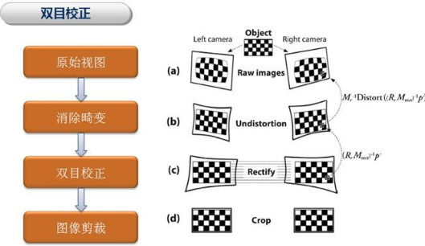
    
    ```python
    """
    	立体双目校正函数
    	cameraMatrix1：左目相机内参矩阵
    	distCoeffs1：左目相机畸变参数
    	cameraMatrix2：右目相机内参矩阵
    	distCoeffs2：右目相机畸变参数
    	imageSize：图像大小
    	R：左目相机坐标系到右目相机坐标系的旋转变换
    	T：左目相机坐标系到右目相机坐标系的平移变换
    	flags：如果设置为 CALIB_ZERO_DISPARITY，函数会将两个相机的principal point 设成一样。否则就会平移图像最大化有用的图像区域。
    	alpha：自由缩放参数。如果设置为 -1 或者不设置，函数执行默认缩放。否则参数应为 0-1 。0：矫正图像会放大和平移使得最终图像中只有有效像素；1：图像会缩小和平移使得原始图像中所有像素都可见。
    	newImageSize：矫正后的图像分辨率。默认（0，0），设置为原始图像大小。设置为高的分辨率可以保持原始图像的更多细节，特别是畸变较大的时候。
    	validPixROI1：一个最多地包含有效像素的长方形。（左目图像）
    	validPixROI2：一个最多地包含有效像素的长方形。（右目图像）
    	R1：矫正旋转矩阵。将第一个相机坐标系下未矫正的点变换到第一个相机矫正坐标系下，即 R_{左矫正坐标系}{左未矫正坐标系}
    	R2：矫正旋转矩阵。将第二个相机坐标系下未矫正的点变换到第二个相机矫正坐标系下，即 R_{右矫正坐标系}{右未矫正坐标系}
    	P1：3x4左相机投影矩阵。将左矫正坐标系下的点投影到左矫正坐标系图像平面坐标系。
    	P2：3x4右相机投影矩阵。将左矫正坐标系下的点投影到右矫正坐标系图像平面坐标系。
    	Q：4x4的视差深度映射矩阵。
    """
    stereoRectify(cameraMatrix1,distCoeffs1,cameraMatrix2,distCoeffs2,imageSize,R,T,R1,R2,P1,P2,Q,flags = CALIB_ZERO_DISPARITY,alpha = -1,newImageSize,validPixROI1 = 0,validPixROI2 = 0) 	
    ```
    

立体校正过程：

> 1. `stereoCalibrate()` 进行双目标定；
> 2. 调用`stereoRectify()`校正图像；
> 3. 通过`initUndistortRectifyMap()`和`remap()`对左右图片做矫正。

```python
import cv2
import numpy as np

def cat2images(limg, rimg):
    HEIGHT = limg.shape[0]
    WIDTH = limg.shape[1]
    imgcat = np.zeros((HEIGHT, WIDTH*2+20,3))
    imgcat[:,:WIDTH,:] = limg
    imgcat[:,-WIDTH:,:] = rimg
    for i in range(int(HEIGHT / 32)):
        imgcat[i*32,:,:] = 255 
    return imgcat

left_image = cv2.imread("images/left/268.jpg")
right_image = cv2.imread("images/right/268.jpg")

imgcat_source = cat2images(left_image,right_image)
HEIGHT = left_image.shape[0]
WIDTH = left_image.shape[1]
cv2.imwrite('imgcat_source.jpg', imgcat_source )

camera_matrix0 = np.array([[1.30991855e+03, 0.00000000e+00, 5.90463086e+02],
                            [0.00000000e+00, 1.31136722e+03, 3.33464608e+02],
                            [0.00000000e+00, 0.00000000e+00, 1.00000000e+00]]
                        ) .reshape((3,3)) #即上文标定得到的 cameraMatrix1
                        
distortion0 = np.array([-4.88890701e-01,  3.27964225e-01, -2.72130825e-04,  1.28030208e-03, -1.85964828e-01]) #即上文标定得到的 distCoeffs1

camera_matrix1 = np.array([[1.30057467e+03, 0.00000000e+00, 6.28445749e+02],
                            [0.00000000e+00, 1.30026325e+03, 3.90475091e+02],
                            [0.00000000e+00, 0.00000000e+00, 1.00000000e+00]]
                        ) .reshape((3,3)) #即上文标定得到的 cameraMatrix2
distortion1 = np.array([-4.95938411e-01,  2.70207629e-01,  1.81014753e-04, -4.58891345e-04, 4.41327829e-01]) #即上文标定得到的 distCoeffs2

R = np.array([[ 0.99989348,  0.01340678, -0.00576869], 
              [-0.01338004,  0.99989967,  0.00465071], 
              [ 0.00583046, -0.00457303,  0.99997255]]
            ) #即上文标定得到的 R
T = np.array([-244.28272039, 3.84124178, 2.0963191]) #即上文标定得到的T


(R_l, R_r, P_l, P_r, Q, validPixROI1, validPixROI2) = \
    cv2.stereoRectify(camera_matrix0, distortion0, camera_matrix1, distortion1, np.array([WIDTH,HEIGHT]), R, T) #计算旋转矩阵和投影矩阵

(map1, map2) = \
    cv2.initUndistortRectifyMap(camera_matrix0, distortion0, R_l, P_l, np.array([WIDTH,HEIGHT]), cv2.CV_32FC1) #计算校正查找映射表

rect_left_image = cv2.remap(left_image, map1, map2, cv2.INTER_CUBIC) #重映射

#左右图需要分别计算校正查找映射表以及重映射
(map1, map2) = \
    cv2.initUndistortRectifyMap(camera_matrix1, distortion1, R_r, P_r, np.array([WIDTH,HEIGHT]), cv2.CV_32FC1)
    
rect_right_image = cv2.remap(right_image, map1, map2, cv2.INTER_CUBIC)

imgcat_out = cat2images(rect_left_image,rect_right_image)
cv2.imwrite('imgcat_out.jpg', imgcat_out)
```

## 3. 立体匹配

参考：[链接](https://guo-pu.blog.csdn.net/article/details/121421543)

### 立体匹配算法概念

立体匹配是一种根据平面图像来恢复真实场景深度信息的技术，其做法是从两个或多个相同场景的图像中找出匹配点对，然后根据三角测量原理计算点对所对应的空间物理点的深度。

- 传统立体匹配方法基于计算机视觉的通用定律和人为观察设计的规则，对匹配像素的搜索进行指引。在判断某个像素和另一幅图像上的一个像素是否匹配时，根据同时考虑匹配情况的周围像素范围是局部的还是全局的，传统立体匹配方法又可分为局部立体匹配方法和全局立体匹配方法，它们有着各自的优点和不足。
- 深度学习立体匹配方法。随着近几年可用训练数据集的增加和计算机性能的提升，基于训练学习的深度学习立体匹配方法得到迅速的发展，逐渐成为立体匹配技术研究的主流。

1. 局部立体匹配

   1. 像素匹配代价计算 

      对左眼视图中的像素，需要计算其与右眼视图中可能的匹配像素之间的匹配代价，用来表征两个像素点的匹配程度。匹配代价越大，表示这两个像素的相似性越低，代表同一个实际空间物理点的可能性越小。

      像素的灰度值是一个像素最基本的信息，所以最简单的方法是使用两个像素的**灰度绝对值**、**灰度差平方值**或者使用**强度值**采样作为两个像素的匹配代价。

      但是在一副图像中会存在很多灰度值相同的像素点，仅仅使用单个像素的灰度值无法区分这些像素。此外，由于左右视图拍摄设备的参数、拍摄噪声不完全相同，拍摄时光照条件不同，一个物体在两幅图像中的成像也会显示不同的颜色，所以这类简单方法在很多情况下是无法正确衡量两个像素的不相似程度的，会导致大量的误匹配。 

      处于图像上的不同位置，其周围的像素集合不同，它们所构成的图像区域结构也就不同。以一个像素为中心去取一个固定大小的窗口（称为特征窗口），然后把比较两个像素的匹配程度转换为比较两个像素其特征窗口的图像块相似性，这样能更加准确地衡量两个像素在图像上表现出来的差异。

      > **归一化互相关方法（NCC）**：计算两个图像块之间的互相关性来代替像素的匹配代价，它对局部的灰度值线性变化具有不变性，抗噪声干扰能力较强，但容易受局部光照变化的影响，且匹配速度较慢；
      >
      > **基于互信息的代价计算方法（MI）**：利用图像灰度值概率分布的信息去计算匹配代价，可以在一定程度上应对噪声干扰和辐射畸变的影响，但是它在无纹理区域和物体边界处的匹配效果差。
      >
      > **基于转换的方法**：这类方法从局部像素灰度值的相对顺序不变的假设出发，认为即使是在光照变化强烈的情况下，单个像素的灰度值会发生变化，但该像素与周围像素的灰度值的大小关系是不变的。所以可以比较图像块内 各个像素灰度值的大小关系，把比较结果作为代表该图像块结构信息的特征，然后把比较两个像素的匹配程度转换为比较两个像素特征的相似性。（CENSUS 算法、LBP 算法、SLBP 算法、FEP算法、RSRT 算法、ADCENSUS 算法）

   2. 匹配代价聚合

      图像上的像素通常与其周围的像素形成一个整体，如都是表示同一个物体，或者表示同一个物体的某部分，这个联系（匹配代价聚合）使得一个像素会和周围的部分像素有着接近的匹配情况。从另外一个方面讲，一个像素的匹配需要受周围其它像素匹配情况的约束，不能孤立地考虑单个像素的匹配情况。 

      局部立体匹配方法在考虑一个像素的匹配情况时，只考虑该像素周围一个小区域内其它像素的匹配情况。对于左右视图中两个像素，通常会分别以这两个像素为中心取相同大小的窗口（称为聚合窗口），然后逐个计算两个窗口内处于相同位置的像素之间的匹配代价，并把这些匹配代价值累加起来作为最终的聚合匹配代价。如果聚合代价越小，则两个像素越有可能是匹配的。 

      左右视图中的两个像素取形状大小相同的聚合窗口，这种做法默认假设了处于聚合窗口内的像素具有相同的视差值，即它们在实际空间中距离相机的距离相同。但是，实际情况中小窗口内的像素不一定具有相同的视差，所以关于代价聚合步骤，研究的主要工作在于如何选择合适的窗口进行聚合。

      有一部分论文致力于找到与中心像素具有相同视差的像素：离中心像素较近的区域内，如果一个像素的灰度值与中心像素的灰度值相近，便认为该像素与中心像素的视差相同，在聚合时也只累加上这部分具有相同视差的像素的匹配代价。

      另外一部分论文无论对待什么情况，都选取一个固定大小的矩形聚合窗口，只是在对窗口内各个像素的匹配代价进行累加时都附加上一个权重，该权重表示该像素与中心像素具有相同视差的可能性大小。如对聚合窗口施加一个高斯滤波权重后进行聚合、对聚合窗口进行引导滤波聚合、把聚合窗口拓展到整幅图像后加权聚合；还有一部分论文认为左边视图中的区域映射到右边视图时，需要先找到该区域所在真实三维空间中的平面法向量，再根据平面法向量进行映射。

   3. 视差计算

      在计算出聚合匹配代价之后，寻找到各个像素最优匹配点，完成匹配任务。局部立体匹配算法中的视差计算一般比较简单，采用 WTA 理论（Winner-Take-All）直接进行视差寻找。

      对于左边图中的一个像素，在右图中有多个可能的匹配像素，逐个比较这些可能匹配像素与当前待匹配像素的聚合代价，其中有着最小匹配代价的像素即为寻找到的匹配像素。

   4. 后处理

      视差图后处理是在初步得到视差图之后，对视差图的结果进行判断，发现可能的匹配错误情况并进行改正。

      常用的后处理方法：**左右一致性检测**、**遮挡填补**、**加权中值滤波。**

      左右一致性检测用于发现错误匹配情况，它的原理是：左边视图中的某个像素p ，其找到的匹配像素为右边视图中的像素 $q$ ，则反过来像素 $q$ 找到的匹配像素也应该为 $p$ ，如果不是则视为错误匹配。

      遮挡填补认为错误的匹配点是该像素在另外一个视图中被遮挡住的原因，所以该像素应该与邻近的背景像素具有相同的视差值。

      中值滤波是为了解决遮挡填补后产生的横向条纹问题，对填补像素的视差进行中值滤波。 

2. 全局立体匹配算法

   与局部立体匹配方法不同的只在于同时考虑匹配情况的周围像素的范围。全局立体匹配算法认为图像的视差在全局范围内是平滑的，对于相邻像素视差值相差较大的情况需要加以惩罚，据此构造全局匹配代价函数来代替局部算法中的代价聚合，整个图像上的所有像素同时进行视差值求解。

   全局立体匹配的难点在于如何最小化匹配代价函数的结果，比较典型的求解方法有：在特定路径下寻找最小匹配代价的动态规划算法，基于马尔科夫场估计最优解的置信度传播算法，采用“最大流”和“最小割”来优化代价函数的图割法。

### BM 算法

这种算法实现起来的优点就是快，缺点是深度图的效果不是很好。BM算法只能对8为灰度图像计算视差。

BM算法会将当前的帧划分为很多小块，将每个小块与另一个摄像头采集的小块进行比较，首先通过匹配代价在右图中计算得出匹配点。然后相同的原理及计算在左图中的匹配点。比较找到的左匹配点和源匹配点是否一致，如果是，则匹配成功。

匹配代价是 SAD （绝对差之和），在计算视差图之前，将两个图转化成灰度图，对每个像素块提取然后找到计算，通过相减得到一个越小的SAD值就代表两个像素块越相似。

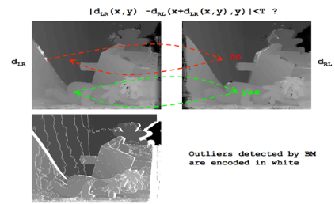

BM 相关类型定义：[链接](https://docs.opencv.org/master/d9/dba/classcv_1_1StereoBM.html)

> **参数配置：**
>
> 1. `preFilterType`：预处理滤波器的类型，用于降低亮度失真，消除噪声，增强纹理。可选`CV_STEREO_BM_XSOBEL`（水平 Sobel 算子），`CV_STEREO_BM_NORMALIZED_RESPONSE`（归一化响应）。
> 2. `preFilterSize`：预处理滤波器卷积核大小。
> 3. `preFilterCap`：预处理滤波器的截断值，输出值仅保留该值以内的值。
> 4. `SADWindowsize`：SAD 窗口大小。
> 5. `minDisparity`：视差最小值。
> 6. `numberOfDisparities`：视差窗口，最大视差和最小视差之差。
> 7. `textureThreshold`：低纹理区域的判断阈值。
> 8. `uniquenessRatio`：视差唯一性百分比。
> 9. `speckleWindowSize`：检查视差连通区域变化度的窗口大小。
> 10. `speckleRange`：视差变化阈值，视差变化大于阈值时，视差清零。

```python
numberOfDisparities = ((640 // 8) + 15) & -16  # 640对应是分辨率的宽
 
stereo = cv2.StereoBM_create(numDisparities=16, blockSize=9)  #立体匹配
stereo.setROI1(camera_config.validPixROI1)
stereo.setROI2(camera_config.validPixROI2)
stereo.setPreFilterCap(31)
stereo.setBlockSize(15)
stereo.setMinDisparity(0)
stereo.setNumDisparities(numberOfDisparities)
stereo.setTextureThreshold(10)
stereo.setUniquenessRatio(15)
stereo.setSpeckleWindowSize(100)
stereo.setSpeckleRange(32)
stereo.setDisp12MaxDiff(1)
 
disparity = stereo.compute(img1_rectified, img2_rectified) # 计算视差
```

### SGBM 算法

参考文章：[链接](https://blog.csdn.net/jin739738709/article/details/124145268?ops_request_misc=&request_id=&biz_id=102&utm_term=opencv sgbm&utm_medium=distribute.pc_search_result.none-task-blog-2~all~sobaiduweb~default-1-124145268.142^v68^control,201^v4^add_ask,213^v2^t3_esquery_v3&spm=1018.2226.3001.4187)

SGBM 算法由 SGM 算法改进得到：

> SGM 算法流程：
>
> 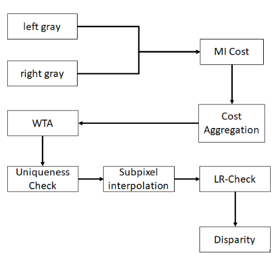
>
> SGBM 算法流程：
>
> 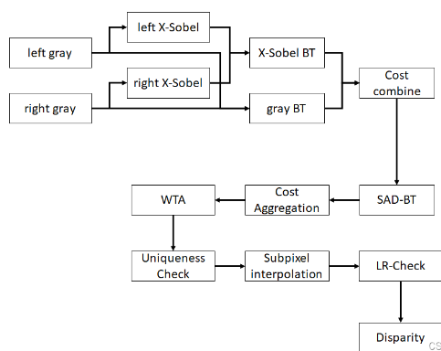


SGBM和SGM区别的地方在于匹配代价的计算：SGBM采用的是SAD-BT，而SGM采用的是MI。

MI是指互信息（MI，Mutual Information），一种全局的代价计算方法，耗时较多。而 OpenCV 在实现 SGBM 的时候采用了 BT 代价，这是一种一维匹配代价，所以在应用中不仅是用 x-sobel 和原图 gray 生成加权融合的 BT 代价，而且采用SAD的思路，采用邻域求和的方法，计算 SAD-BT ，这样计算出来的代价就是局部块代价，每个像素点的匹配代价会包含周围局部区域的信息。

1. BT 代价

   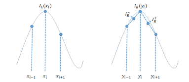

   上图为左右图像在某一行的灰度值函数曲线 $I_L,I_R$，用 $d(x_i,y_i)$ 描述两点相似程度。

   使用插值方法构建代价函数：$d(x_i,y_i) = \overline d (x_i,y_i) + \overline d(y_i,x_i)$ 。

   > 对于 $y_i$，构造：
   > $$
   > I_R^- = \frac{1}{2}(I_R(y_i)+I_R(y_{i-1})) \\
   > I_R^+ = \frac{1}{2}(I_R(y_i)+I_R(y_{i+1})) \\
   > I_min = min\{I_R^-,I_R^+,I_R(y_i)\} \\
   > I_max = max\{I_R^-,I_R^+,I_R(y_i)\} \\
   > \overline d (x_i,y_i) = max\{0,I_L(x_i)-I_{max},I_{min}-I_L(x_i)\}
   > $$
   > 对于 $x_i$，构造：
   > $$
   > I_L^- = \frac{1}{2}(I_L(x_i)+I_L(x_{i-1})) \\
   > I_L^+ = \frac{1}{2}(I_L(x_i)+I_L(x_{i+1})) \\
   > I_min = min\{I_L^-,I_L^+,I_L(x_i)\} \\
   > I_max = max\{I_L^-,I_L^+,I_L(x_i)\} \\
   > \overline d (y_i,x_i) = max\{0,I_R(y_i)-I_{max},I_{min}-I_R(y_i)\}
   > $$

   对于图片的不连续区域，利用BT代价计算法可以有效的进行准确匹配而不会产生过多的误差，证明该方法是可行且具有显著效果的。

   使用 Sobel 算子对灰度图求梯度，可以得到 SAD-BT 代价。
   $$
   cost = BT_{xsobel} + \alpha BT_{gray}
   $$

2. 视差计算

   1. 每个像素选择最小代价作为视差。

   2. 之前的到的结果都是整数，精度要求高的场景可能不满足要求，通过相邻视差处的相邻代价来拟合二次曲线重新计算视差。

      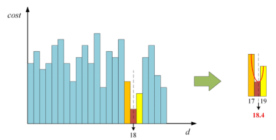

   3. 右图作为基础图用左图来匹配，计算得到的视差图和之前计算的视差图可以用来找遮挡区域和错误匹配区域，对应位置差距不满足要求的视差设置为无效。

- OpenCV 里的 SGBM 算法

  SGBM 相关类型定义：[链接](https://docs.opencv.org/4.5.3/d2/d85/classcv_1_1StereoSGBM.html)

  > **参数配置：**
  >
  > 1. `minDisparity`：最小可能的视差值。正常情况下为零，但有时校正算法会导致图像移位，因此需要相应调整此参数。
  > 2. `numDisparities`：最大视差减去最小视差。该值始终大于零。在当前的实现中，这个参数必须能被 16 整除。
  > 3. `blockSize`：匹配块大小，必须是奇数。通常，它应该在 3 —11 范围内的某个地方。
  > 4. `P1`：第一个参数控制视差平滑度。对相邻像素之间正负 1 的视差变化的惩罚。
  > 5. `P2`：第二个参数控制视差平滑度。值越大，视差越平滑。相邻像素之间视差变化超过 1 的惩罚。该算法需要 `P2` > `P1` 。
  > 6. `disp12MaxDiff`：左右视差检查中允许的最大差异（以整数像素为单位）。将其设置为非正值以禁用检查。
  > 7. `preFilterCap`：预过滤图像像素的截断值。该算法首先计算每个像素的 x 导数，并按 `[-preFilterCap, preFilterCap]` 间隔裁剪其值。结果值传递给 BT 像素成本函数。
  > 8. `uniquenessRatio`：唯一性比率，以百分比为单位的最佳（最小）计算成本函数值应“赢得”第二个最佳值以认为找到的匹配是正确的。通常，5-15 范围内的值就足够了。
  > 9. `speckleWindowSize`：平滑视差区域的最大大小，以考虑它们的噪声斑点并使其无效。将其设置为 0 以禁用斑点过滤。否则，将其设置在 50-200 范围内的某个位置。
  > 10. `speckleRange`：每个连接组件内的最大视差变化。如果做散斑过滤，参数设置为正值，会隐式乘以16，正常情况下，1或2就足够了。
  > 11. `mode`：将其设置为`StereoSGBM::MODE_HH`以运行完整的两遍动态编程算法。它将消耗 $O(W*H*numDisparities)$ 字节，这对于 640 x 480 立体声来说很大，对于 HD 尺寸的图片来说很大。默认情况下，它设置为 `false` 。

    ```python
    # SGBM
    blockSize = 8
    img_channels = 3
    stereo = cv2.StereoSGBM_create(minDisparity = 1,numDisparities = 64,blockSize = blockSize,P1 = 8 * img_channels * blockSize * blockSize,P2 = 32 * img_channels * blockSize * blockSize,disp12MaxDiff = -1,preFilterCap = 1,uniquenessRatio = 10,speckleWindowSize = 100,speckleRange = 100,mode = cv2.STEREO_SGBM_MODE_HH)
    ```

