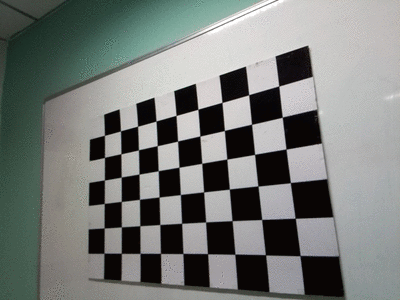

# OpenCV-Python 10_双目视觉

双目视觉主要包括**相机标定、图片畸变矫正、摄像机校正、图片匹配、3D重构**五个部分。

## 1. 单目相机标定

相机参数的估计过程称为相机标定。这意味着我们拥有关于相机的所有信息（参数或系数），这些信息用于确定真实世界中的3D点与其在该标定相机捕获的图像中的相应2D投影（像素）之间的精确关系。

此时需要恢复两种操作：

> 1. 内部参数相机/镜头系统，如透镜的焦距、光学中心和径向畸变系数。
> 2. 外部参数，指相机相对于世界坐标系的方位(旋转和平移)。

相机标定后，图像中的失真将会消除。

### 单目标定原理

#### 坐标系变换

假设在房间里安装了一台照相机。给定三维点P在这个房间里，我们想要找到这个3D点的像素坐标(u，v)在相机拍摄的图像中。在这个设置中有三个坐标系在起作用。

1. 世界坐标系$W$

    

    世界坐标系$W$和相机坐标系$C$通过旋转和平移联系起来。世界坐标系应当按照以下原则定义：

    > 1. 存在一个原点；
    > 2. 沿着地板上的二维定义房间的X轴和Y轴，沿着垂直墙定义房间的Z轴。
    
    世界坐标系的作用：
    
    > 1. 标定时确定标定物的位置；
    > 2. 作为双目视觉的系统参考系，给出两个摄像机相对世界坐标系的关系，从而求出相机之间的相对关系；
    > 3. 作为重建得到三维坐标的容器，存放重建后的物体的三维坐标。世界坐标系是将看见中物体纳入运算的第一站。

2. 相机坐标系$C$

    现在，让我们把相机放在这个房间里。这个房间的图像将用这个相机拍摄，因此，我们感兴趣的是连接到这个相机上的三维坐标系。如果我们将相机放在房间的原点，并使其X,Y和Z轴与房间的x,y,z轴对齐，则两个坐标系将是等同的。

    然而，我们想把相机放在房间里的任何地方，它应该可以在任何地方看到。在这种情况下，我们需要找出三维房间(即世界)坐标和三维相机坐标之间的关系。

    世界坐标和相机坐标由旋转矩阵 $R$ 和一个三元平移矢量 $t$ 关联。
    $$
    \left[
    \begin{matrix}
    X_c \\
    Y_c \\
    Z_c
    \end{matrix}
    \right] = R\left[
    \begin{matrix}
    X_w \\
    Y_w \\
    Z_w
    \end{matrix}
    \right] + t
    $$
    为了方便表示，通常将坐标转换为齐次坐标的形式：
    $$
    \left[
    \begin{matrix}
    X_c \\
    Y_c \\
    Z_c \\
    1
    \end{matrix}
    \right] = 
    \left[
    \begin{matrix}
    R|t
    \end{matrix}
    \right] 
    \left[
    \begin{matrix}
    X_w \\
    Y_w \\
    Z_w \\
    1
    \end{matrix}
    \right]
    $$
    则外参矩阵为矩阵$[R|t]$。

3. 图像坐标系

    

    > 点P在图像平面上的投影如上图所示。一旦我们通过对点世界坐标应用旋转和平移来获得相机三维坐标系中的点，我们就可以将该点投影到图像平面上以获得该点在图像中的位置。

    上图显示了简单针孔相机的相机投影。光学中心（针孔）用$O_c$表示，实际上在像面上形成点的倒像。为了数学上的方便，假定“成像点”在光学中心之前$f$处，且成一个正立像。

    空间三维点$(X_c,Y_c,Z_c)$的投影坐标由下式给出：
    $$
    x = f\frac{X_c}{Y_c} \\
    y = f\frac{Y_c}{Z_c}
    $$
    使用矩阵形式重写为：
    $$
    \left[
    \begin{matrix}
    x^, \\
    y^, \\
    z^, \\
    \end{matrix}
    \right] = \left[
    \begin{matrix}
    f & 0 & 0 \\
    0 & f & 0 \\
    0 & 0 & 1 \\
    \end{matrix}
    \right]\left[
    \begin{matrix}
    X_c \\
    Y_c \\
    Z_c
    \end{matrix}
    \right]
    $$
    矩阵$K$为内参矩阵，包含相机的内在参数。图像传感器中的像素可能不是方形的，因此我们可能有两个不同的焦距$f_x$和$f_y$。光学中心($c_x$, $c_y$)相机的中心可能与图像坐标系的中心不重合。此外，相机传感器的x轴和y轴之间可能有一个小的倾斜$\gamma$。此时，可将内参矩阵改为：
    $$
    K = \left[
    \begin{matrix}
    f_x & \gamma & c_x \\
    0 & f_y & c_y \\
    0 & 0 & 1 \\
    \end{matrix}
    \right]
    $$


#### 相机畸变

摄像机拍照时通过透镜把实物投影到像平面上，但是透镜由于制造精度以及组装工艺的偏差会引入畸变，导致原始图像的失真。因此我们需要考虑成像畸变的问题。

透镜的畸变主要分为径向畸变和切向畸变，还有薄透镜畸变等等，但都没有径向和切向畸变影响显著，所以我们在这里只考虑径向和切向畸变。

1. 径向畸变

   径向畸变就是沿着透镜半径方向分布的畸变，产生原因是光线在原理透镜中心的地方比靠近中心的地方更加弯曲，这种畸变在普通廉价的镜头中表现更加明显，径向畸变主要包括桶形畸变和枕形畸变两种。

   以下分别是枕形和桶形畸变示意图：

   

   像平面中心的畸变为0，沿着镜头半径方向向边缘移动，畸变越来越严重。畸变的数学模型可以用主点（principle point）周围的泰勒级数展开式的前几项进行描述，通常使用前两项，即 $k_1$ 和 $k_2$，对于畸变很大的镜头，如鱼眼镜头，可以增加使用第三项 $k_3$ 来进行描述，成像仪上某点根据其在径向方向上的分布位置，调节公式为：
   $$
   x_0 = x(1+k_1r^2+k_2r^4+k_3r^6) \\
   y_0 = y(1+k_1r^2+k_2r^4+k_3r^6)
   $$

2. 切向畸变

   切向畸变是由于透镜本身与相机传感器平面（像平面）或图像平面不平行而产生的，这种情况多是由于透镜被粘贴到镜头模组上的安装偏差导致。畸变模型可以用两个额外的参数 $p_1$ 和 $p_2$ 来描述：
   $$
   x_0 = 2p_1xy+p_2(r^2+2x^2)+1
   $$

径向畸变和切向畸变模型中一共有5个畸变参数，经常被定义为Mat矩阵的形式。

### 单目标定方法

相机标定的目的就是建立摄像机图像像素位置与物体空间位置之间的关系，即世界坐标系与图像坐标系之间的关系。方法就是根据摄像机模型，由已知特征点的坐标求解摄像机的模型参数，从而可以从图像出发恢复出空间点三维坐标，即三维重建。所以要求解的参数包括4个内参数和5个畸变参数，还有外部参数旋转矩阵和平移矩阵。

“张氏标定”是指张正友教授于1998年提出的单平面棋盘格的摄像机标定方法。张氏标定法已经作为工具箱或封装好的函数被广泛应用。张氏标定法为相机标定提供了很大便利，并且具有很高的精度。从此标定可以不需要特殊的标定物，只需要一张打印出来的棋盘格。

标定过程的目标是使用一组已知的三维点$(X_W,Y_W,Z_W)$及其对应的图像坐标$(u,v)$，找到3×3矩阵$K$、3×3旋转矩阵$R$、3×1平移向量$T$。

> - 输入：具有已知二维图像坐标和三维世界坐标的点的图像集合。
> - 输出：3×3相机内参矩阵，每幅图像的旋转和平移。

### OpenCV 的单目相机标定

准备：棋盘格（打印棋盘格（打印机有充足墨水）>电脑屏幕>购买专用棋盘格）

> 棋盘图案是独特的，易于检测的图像。不仅如此，棋盘格上正方形的角点非常适合定位它们，因为它们在两个方向上都有尖锐的梯度。此外，这些角也与它们位于棋盘格线的交点有关。所有这些事实都被用来在棋盘格模式中可靠地定位正方形的角点。

1. 从不同的角度捕获棋盘的多个图像

   接下来，保持棋盘格静止，通过移动相机拍摄棋盘格的多个图像。或者也可以保持相机恒定，在不同方向拍摄棋盘格图案。



2. 查找棋盘的相机坐标

OpenCV提供了一个名为`findChessboardCorners()`的内置函数，该函数查找棋盘并返回角点的坐标。

```python
"""
	查找棋盘格角点函数
	image		棋盘源图像，必须是8位灰度或彩色图像
	patternSize	 每个棋盘行和列的内角点数
	corners		检测到的角点的输出数组
"""
retval, corners = cv2.findChessboardCorners(image, patternSize, flags)
```

输出是真是假取决于是否检测到角点。所以，拍摄质量极其重要，建议通过此函数筛选出可用的图片。为了获得足够好的标定结果，通常使用**20—40张不同方位的棋盘格照片**。

3. 优化坐标

OpenCV的`cornersubix()`函数接收原始图像和角点的位置，并在原始位置的一个小邻域内寻找最佳角点位置。

```python
"""
	优化棋盘格角点函数
	image		棋盘源图像，必须是8位灰度或彩色图像
	corners		输入角点的初始坐标和为输出提供的精确坐标
	WinSize		搜索窗口边长的一半
	zeroZone	搜索区域中间零区大小的一半，在该零区上不进行下式求和。它有时用于避免自相关矩阵的可能奇点。
	criteria	角点精化迭代过程的终止准则。
"""
cv2.cornerSubPix(image, corners, winSize, zeroZone, criteria)
```

4. 相机标定

校准的最后一步是将世界坐标系中的3D点及其在所有图像中的2D位置传递给OpenCV的`caliberecamera()`方法。

```python
"""
	相机校准函数
	objectPoints	三维图像点的矢量
	imagePoints		二维图像点的矢量
	imageSize		图像大小
	cameraMatrix	内参矩阵
	distCoeffs		透镜畸变系数
	rvecs			用于表达旋转的3×1矢量。矢量的方向指定旋转轴，矢量的大小指定旋转角度
	tvecs			用于表达位移的3×1矢量
"""
retval, cameraMatrix, distCoeffs, rvecs, tvecs = cv2.calibrateCamera(objectPoints, imagePoints, imageSize)
```

5. 畸变矫正

首先需要优化得到的相机内参矩阵`getOptimalNewCameraMatrix()`。

```python
"""
	优化内参函数
	cameraMatrix	 畸变图像对应的内参
	distCoeffs	     畸变矫正系数
	imageSize		畸变图像的宽和高
	alpha			因为畸变矫正后有黑边，这个值指示的是保留多少畸变后的像素，选择0，那么就意味着保留最少的黑边，使用1的话，保留全部像素，那么所有黑边都包含进去了
	newImgSize		 矫正后的图像尺寸
	
	roi				得到图像无黑边的ROI值
	newcameramtx	 新得到的相机内参矩阵
"""
newcameramtx, roi = getOptimalNewCameraMatrix(cameraMatrix, distCoeffs, imageSize, alpha, newImgSize, centerPrincipalPoint)
```

随后使用`undistort()`函数裁剪结果

```python
 """
	相机校准函数
	src				原图像
	cameraMatrix	 原相机内参矩阵
	dist			畸变矫正系数
	newCameraMatrix  优化后的相机内参矩阵
"""
dst = undistort(src, cameraMatrix, distCoeffs, dst, newCameraMatrix)
```

使用`undistortPoints`函数可以得到去畸变之后部分点的校正结果。

也可以使用`initUndistortRectifyMap()`和`remap()`函数进行输出映射。

```python
"""
	输出映射函数
	cameraMatrix	 畸变图像对应的内参
	distCoeffs	     畸变矫正系数
	R				旋转矩阵，对于单目视觉通常为单位阵(None)
	newCameraMatrix  矫正图像对应的内参
	size			输出图像大小
	m1type			输出映射1的类型
	map1			输出映射1
	map2			输出映射2
"""
mapx, mapy = initUndistortRectifyMap(cameraMatrix, distCoeffs, R, newCameraMatrix, size, m1type, map1, map2)
```

- 相机校正工具：

```python
import cv2
import numpy as np
import glob


# 找棋盘格角点
# 设置寻找亚像素角点的参数，采用的停止准则是最大循环次数30和最大误差容限0.001
criteria = (cv2.TERM_CRITERIA_EPS + cv2.TERM_CRITERIA_MAX_ITER, 30, 0.001)  # 阈值
# 棋盘格模板规格
w = 9  # 10 - 1
h = 6  # 7  - 1
# 世界坐标系中的棋盘格点,例如(0,0,0), (1,0,0), (2,0,0) ....,(8,5,0)，去掉Z坐标，记为二维矩阵
objp = np.zeros((w * h, 3), np.float32)
objp[:, :2] = np.mgrid[0:w, 0:h].T.reshape(-1, 2)
objp = objp * 18.1  # 18.1 mm

# 储存棋盘格角点的世界坐标和图像坐标对
objpoints = []  # 在世界坐标系中的三维点
imgpoints = []  # 在图像平面的二维点
# 加载pic文件夹下所有的jpg图像
images = glob.glob("./*.jpg")  #   拍摄的十几张棋盘图片所在目录

i = 0
for fname in images:

    img = cv2.imread(fname)
    # 获取画面中心点
    # 获取图像的长宽

    h1, w1 = img.shape[0], img.shape[1]
    gray = cv2.cvtColor(img, cv2.COLOR_BGR2GRAY)
    u, v = img.shape[:2]
    # 找到棋盘格角点
    ret, corners = cv2.findChessboardCorners(gray, (w, h), None)
    # 如果找到足够点对，将其存储起来
    if ret == True:
        print("i:", i)
        i = i + 1
        # 在原角点的基础上寻找亚像素角点
        cv2.cornerSubPix(gray, corners, (11, 11), (-1, -1), criteria)
        # 追加进入世界三维点和平面二维点中
        objpoints.append(objp)
        imgpoints.append(corners)
        # 将角点在图像上显示
        cv2.drawChessboardCorners(img, (w, h), corners, ret)
        cv2.namedWindow("findCorners", cv2.WINDOW_NORMAL)
        cv2.resizeWindow("findCorners", 640, 480)
        cv2.imshow("findCorners", img)
        cv2.waitKey(1000)
    else:
        print("pass")
cv2.destroyAllWindows()
# %% 标定
print("正在计算")
# 标定
ret, mtx, dist, rvecs, tvecs = cv2.calibrateCamera(
    objpoints, imgpoints, gray.shape[::-1], None, None
)


print("ret:", ret)
print("mtx:\n", mtx)  # 内参数矩阵
print(
    "dist畸变值:\n", dist
)  # 畸变系数   distortion cofficients = (k_1,k_2,p_1,p_2,k_3)
print("rvecs旋转（向量）外参:\n", rvecs)  # 旋转向量  # 外参数
print("tvecs平移（向量）外参:\n", tvecs)  # 平移向量  # 外参数
newcameramtx, roi = cv2.getOptimalNewCameraMatrix(mtx, dist, (u, v), 0, (u, v))
print("newcameramtx外参", newcameramtx)
# 打开摄像机
camera = cv2.VideoCapture(0)
while True:
    (grabbed, frame) = camera.read()
    h1, w1 = frame.shape[:2]
    newcameramtx, roi = cv2.getOptimalNewCameraMatrix(mtx, dist, (u, v), 0, (u, v))
    # 纠正畸变
    dst1 = cv2.undistort(frame, mtx, dist, None, newcameramtx)
    # dst2 = cv2.undistort(frame, mtx, dist, None, newcameramtx)
    mapx, mapy = cv2.initUndistortRectifyMap(mtx, dist, None, newcameramtx, (w1, h1), 5)
    dst2 = cv2.remap(frame, mapx, mapy, cv2.INTER_LINEAR)
    # 裁剪图像，输出纠正畸变以后的图片
    x, y, w1, h1 = roi
    dst1 = dst1[y : y + h1, x : x + w1]

    # cv2.imshow('frame',dst2)
    # cv2.imshow('dst1',dst1)
    cv2.imshow("dst2", dst2)
    if cv2.waitKey(1) & 0xFF == ord("q"):  # 按q保存一张图片
        cv2.imwrite("../u4/frame.jpg", dst1)
        break

camera.release()
cv2.destroyAllWindows()
```

## 2. 双目相机标定

