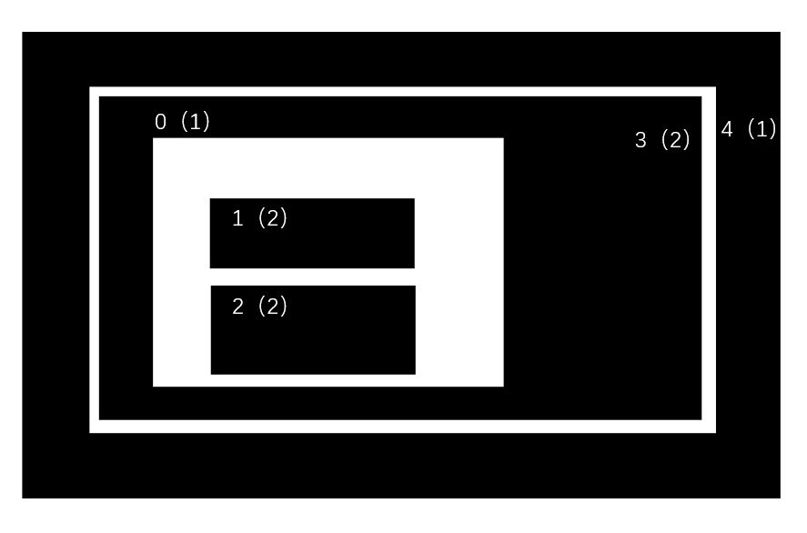

# OpenCV 5_轮廓提取（Counter）

## 1. 轮廓的基本概念

轮廓是将边界点连在一起的曲线，具有相同颜色和灰度。

在寻找轮廓之前需要进行 二值化 或者 Canny 边缘检测以提高准确度。

查找轮廓的代码会修改原始图像，应保存原始图像。

```python
"""
   	查找轮廓图像：
   	第一个参数：输入图像，应为二值化图像；
   	第二个参数：轮廓检索模式
   	第三个参数：轮廓近似方法
   	返回值：第一个：轮廓（使用列表存储，每个轮廓为一个元组）；第二个：层析结构 		   
"""
cv2.findContours()
```

```python
"""
	绘制轮廓函数
	第一个参数：原始图像
	第二个参数：轮廓，为一个列表
	第三个参数：轮廓的索引（-1绘制所有轮廓）
"""
cv2.drawCounters()
```

- 在轮廓近似方法中，使用`cv2.CHAIN_APPROX_SIMPLE`可以去除轮廓上的冗余点，压缩轮廓（比如在直线中保留两个端点），从而节省内存开支。

```python
import cv2
import numpy as np

cap = cv2.VideoCapture(1)
cap.set(10, -1)
kernel = cv2.getStructuringElement(cv2.MORPH_CROSS,(5,5))

while cap.isOpened() == True:
    ret, frame = cap.read()
    if ret == True:
        gray = cv2.cvtColor(frame, cv2.COLOR_BGR2GRAY)
        res, binary = cv2.threshold(gray, 127, 255, cv2.THRESH_BINARY)
        img = cv2.morphologyEx(binary, cv2.MORPH_ERODE,kernel)
        contours, hierarchy = cv2.findContours(
            img, cv2.RETR_TREE, cv2.CHAIN_APPROX_SIMPLE)
        cv2.drawContours(frame, contours, -1, (0, 255, 255), 3)
        cv2.imshow('img', frame)
        key = cv2.waitKey(1)
        if key == 27:
            break
    else:
        break

cv2.destroyAllWindows()
cap.release()
```

## 2. 轮廓的特征

### 2.1 矩（moments）

矩是描述图像特征的算子，被广泛用于图像检索和识别、图像匹配、图像重建、图像压缩以及运动图像序列分析等领域。

#### 普通矩

$$
m_{ji} = \Sigma_{x,y}I(x,y)x^jy^i
$$

其中$I(x,y)$是像素$(x,y)$处的像素值。

当x和y同时取值0时称为零阶矩，零阶矩可以用于计算某个形状的质量

当$x + y = 1$时被称为一阶矩，一阶矩可求出图像的质心。

当$x + y = 2$时被称为二阶矩，二阶矩可求出图像的旋转半径。

当$x+y = 3$时被称为三阶矩，三阶矩可求出目标的方位和斜度以及扭曲程度。

#### 中心矩

具有位移不变性，利用这些矩，可将出现在图像中任意位置的物体与参考图像中可能出现在另外位置的参考物体进行比较；
$$
mu_{ji} = \Sigma_{x,y}I(x,y)(x-\overline x)^j(y - \overline y)^i
$$
其中：
$$
\overline x = \frac{m_{10}}{m_{00}} \\
\overline y = \frac{m_{01}}{m_{00}}
$$
为图像中心。

```python
"""
	图像矩求取函数
	参数：边界
	返回值：图像矩，使用['mij']索引进行特定图像矩的获取
"""
cv2.moments()
```

```python
import cv2
import numpy as np

img = cv2.imread('picture_3.jpg')
gray = cv2.cvtColor(img, cv2.COLOR_BGR2GRAY)
ret, binary = cv2.threshold(gray, 127, 255, cv2.THRESH_BINARY)

# 寻找轮廓
counter, hierarchy = cv2.findContours(
    binary, cv2.RETR_TREE, cv2.CHAIN_APPROX_SIMPLE)
# 求取质心
cnt = counter[0]
M = cv2.moments(cnt)
cx = int(M['m10']/M['m00'])
cy = int(M['m01']/M['m00'])

while True:
    cv2.circle(img, (cx, cy), 5, (0, 255, 0), -1)
    cv2.imshow('res', img)
    key = cv2.waitKey(1)
    if key == 27:
        break

cv2.destroyAllWindows()

```

#### Hu 矩

Hu矩具有旋转、平移和缩放不变性，因此在图像具有旋转和放缩的情况下Hu矩具有更广泛的应用领域。Hu矩是由二阶和三阶中心距计算得到七个不变矩.


由Hu矩形组成的特征量对图片进行识别，速度快但识别率较低，因此常用来进行简单的模板匹配。

```python
"""
	轮廓相似度比较函数
	第一个参数：原图像
	第二个参数：进行匹配的图像
	第三个参数：比较方式
	返回值：相似度，0为完全相似
"""
cv2.matchShape()
```

> Hu矩的形状匹配效果优于模板匹配

```python
import cv2
import numpy as np

img = cv2.imread('picture_2.jpg')
shape = cv2.imread('picture_1.jpg')

img1 = cv2.cvtColor(img, cv2.COLOR_BGR2GRAY)
ret, img1 = cv2.threshold(img1, 127, 255, cv2.THRESH_BINARY)
shape = cv2.cvtColor(shape, cv2.COLOR_BGR2GRAY)
ret, shape = cv2.threshold(shape, 127, 255, cv2.THRESH_BINARY)

counter_img, hierarchy_img = cv2.findContours(
    img1, cv2.RETR_TREE, cv2.CHAIN_APPROX_SIMPLE)
counter_shape, hierarchy_shape = cv2.findContours(
    shape, cv2.RETR_TREE, cv2.CHAIN_APPROX_NONE)

n = len(counter_img)
k = []
# 逐个进行模板匹配
for i in range(n):
    temp = cv2.matchShapes(counter_img[i], counter_shape[0], 1, 0.0)
    print(temp)
    if temp < 2:
        k.append(counter_img[i])
    
cv2.drawContours(img, k, -1, (0, 255, 0), 2)


while True:
    cv2.imshow('shape', shape)
    cv2.imshow('res', img)
    key = cv2.waitKey(1)
    if key == 27:
        break

cv2.destroyAllWindows()
```

### 2.2 周长（Length）和面积（Area）

1. 图像面积可以由0阶矩直接求出，也可由`cv2.counterArea()`直接求出。

```python
"""
	图像面积获取函数
	参数：轮廓
"""
cv2.counterArea()
```

```python
import cv2
import numpy as np

img = cv2.imread('picture_1.jpg')
gray = cv2.cvtColor(img, cv2.COLOR_BGR2GRAY)
ret, binary = cv2.threshold(gray, 127, 255, cv2.THRESH_BINARY)

counter, hierarchy = cv2.findContours(
    binary, cv2.RETR_TREE, cv2.CHAIN_APPROX_SIMPLE)

# 图像矩方法求面积
## M = cv2.moments(counter[0])
## print(M['m00'])

# 函数方法求面积
S = cv2.contourArea(counter[0])
print(S)
```

2. 使用`cv2.arcLength()`可以求得轮廓周长

```python
"""
	轮廓周长获取函数
	第一个参数：轮廓
	第二个参数：闭合参数，True为闭合
"""
cv2.arcLength()
```

```python
import cv2
import numpy as np

img = cv2.imread('picture_1.jpg')
gray = cv2.cvtColor(img, cv2.COLOR_BGR2GRAY)
ret, binary = cv2.threshold(gray, 127, 255, cv2.THRESH_BINARY)

counter, hierarchy = cv2.findContours(
    binary, cv2.RETR_TREE, cv2.CHAIN_APPROX_SIMPLE)

C = cv2.arcLength(counter[0], True)
print(C)
```

### 2.3 多边形拟合

> Douglas-Peucker算法：
>
> 1. 在曲线的起点 A 和终点 B 之间做一条直线 AB，是曲线的弦；
> 2. 寻找曲线上离该直线段距离最大的点 C，计算其与 AB 的距离 d；
> 3. 比较距离 d 与设定的阈值 threshold，如果小于设定阈值则该直线段作为曲线的近似，该段曲线处理完毕。
> 4. 如果距离 d 大于设定阈值，则以 C 点将曲线 AB 分为两段 AC 和 BC，并分别对这两段进行以上步骤的处理。
> 5. 当所有曲线都处理完毕时，依次连接所有分割点形成的折线，作为曲线的近似。

使用`cv2.approxPolyDP()`函数可以用一个指定精度的多边形拟合边界。

```python
"""
	边界多边形拟合函数
	第一个参数：轮廓
	第二个参数：精度，原始图线和近似图线间的最大距离
	第三个参数：闭合标志
"""
cv.approxPolyDP()
```

```python
import cv2
import numpy as np

img = cv2.imread('picture_4.jpg')
gray = cv2.cvtColor(img, cv2.COLOR_BGR2GRAY)
gray = cv2.boxFilter(gray, -1, (5, 5))

ret, binary = cv2.threshold(
    gray, 205, 255, cv2.THRESH_BINARY + cv2.THRESH_OTSU)

counter, hierarchy = cv2.findContours(
    binary, cv2.RETR_TREE, cv2.CHAIN_APPROX_SIMPLE)
# 多边形拟合
epsilon = 0.001 * cv2.arcLength(counter[0], True)
n = len(counter)
approx_counter = []

for i in range(n):
    approx = cv2.approxPolyDP(counter[i], epsilon, True)
    approx_counter.append(approx)

cv2.drawContours(img, approx_counter, -1, (0, 255, 0), 2)

while True:
    cv2.imshow('res', img)
    key = cv2.waitKey(1)
    if key == 27:
        break

cv2.destroyAllWindows()
```

### 2.4 凸包（hull）

给定二维平面上的点集，凸包就是将最外层的点连接起来构成的凸多边形，它能包含点集中所有的点。凸包的计算方法有：卷包裹算法（Gift Wrapping Algorithm），Graham扫描法（Graham Scan Algorithm），快速凸包算法（Quickhull Algorithm）等。

```python
"""
	凸包计算函数
	第一个参数：轮廓
	第二个参数：输出值
	第三个参数：方向标志，True为顺时针
	第四个参数：返回参数，True：返回凸包上点的坐标；False：返回凸包上对应的轮廓点
"""
cv2.convexHull()
```

```python
import cv2
import numpy as np

img = cv2.imread('picture_3.jpg')
gray = cv2.cvtColor(img, cv2.COLOR_BGR2GRAY)
ret, binary = cv2.threshold(gray, 127, 255, cv2.THRESH_BINARY)

counter, hierarchy = cv2.findContours(
    binary, cv2.RETR_TREE, cv2.CHAIN_APPROX_SIMPLE)

hull = cv2.convexHull(counter[0])
cv2.drawContours(img, hull, -1, (0, 255, 0), 2)

while True:
    cv2.imshow('res', img)
    key = cv2.waitKey(1)
    if key == 27:
        break

cv2.destroyAllWindows()
```

另外的，可以使用凸性检测函数`cv2.isCounterConvex()`检查曲线的凸性。

### 2.5 边界矩形

边界矩形分为直边界矩形和旋转边界矩形（直边界矩形不会考虑旋转，旋转边界矩形的面积最小）。

```python
"""
	直边界矩形函数
	第一个参数：轮廓
	返回值：矩形的x,y,w,h
"""
cv2.boundingRect()

"""
	旋转边界矩形函数
	第一个参数：轮廓
	返回值：矩形的Box2D结构
"""
cv2.minArearect()

"""
	Box2D解算函数
	返回值：以y最大点开始的顺时针四点列表
"""
cv2.boxPoints()
```

```python
import cv2
import numpy as np

img = cv2.imread('picture_5.jpg')
gray = cv2.cvtColor(img, cv2.COLOR_BGR2GRAY)
ret, binary = cv2.threshold(gray, 127, 255, cv2.THRESH_BINARY)

counter, hierarchy = cv2.findContours(
    binary, cv2.RETR_TREE, cv2.CHAIN_APPROX_SIMPLE)

# 获取旋转边界矩形
rect_m = cv2.minAreaRect(counter[0])
point = cv2.boxPoints(rect_m)
point = np.int32(point)	# 转为int32或int64即可
cv2.drawContours(img, [point], 0, (255, 255, 255), 1)

rect = cv2.boundingRect(counter[0])


while True:
    cv2.rectangle(img, rect, (255, 0, 0), 1)
    cv2.imshow('res', img)
    key = cv2.waitKey(1)
    if key == 27:
        break

cv2.destroyAllWindows()
```

### 2.6 最小外接圆

```python
"""
	最小外接圆函数：
	第一个参数：轮廓
	返回值：(x,y),radius
"""
cv2.minEnclosingCircle()
```

```python
import cv2
import numpy as np

img = cv2.imread('picture_5.jpg')
gray = cv2.cvtColor(img, cv2.COLOR_BGR2GRAY)
ret, binary = cv2.threshold(gray, 127, 255, cv2.THRESH_BINARY)

counter, hierarchy = cv2.findContours(
    binary, cv2.RETR_TREE, cv2.CHAIN_APPROX_SIMPLE)

(x, y), radius = cv2.minEnclosingCircle(counter[0])


while True:
    # 必须化为整型
    cv2.circle(img, (int(x), int(y)), int(radius), (0, 255, 0), 1)
    cv2.imshow('res', img)
    key = cv2.waitKey(1)
    if key == 27:
        break

cv2.destroyAllWindows()
```

### 2.7 椭圆拟合

```python
"""
	椭圆拟合函数：
	第一个参数：轮廓
	返回值：椭圆
"""
cv2.fitEllipse()
```

```python
import cv2
import numpy as np

img = cv2.imread('picture_5.jpg')
gray = cv2.cvtColor(img, cv2.COLOR_BGR2GRAY)
ret, binary = cv2.threshold(gray, 127, 255, cv2.THRESH_BINARY)

counter, hierarchy = cv2.findContours(
    binary, cv2.RETR_TREE, cv2.CHAIN_APPROX_SIMPLE)

ellipse = cv2.fitEllipse(counter[0])


while True:
    cv2.ellipse(img, ellipse, (0, 255, 0), 1)
    cv2.imshow('res', img)
    key = cv2.waitKey(1)
    if key == 27:
        break

cv2.destroyAllWindows()
```

## 3. 轮廓的特征

### 3.1 长宽比

$$
Aspect \quad Ration =\frac{Width}{Height} 
$$

```python
x,y,w,h = cv2.boundRect(cnt)
aspect_ratio = float(w)/float(h)
```

### 3.2 Extent

Extent 为轮廓面积和边界矩形的比值。
$$
Extent = \frac{Object \quad Area}{Bounding \quad Rectangle \quad Area}
$$

```python
area = cv2.contounerArea(cnt)
x,y,w,h = cv2.boundingRect(cnt)
rect_area = w*h
extent = (float)area/rect_area
```

### 3.3 Solidity

Solidity 为轮廓和凸包面积之比。
$$
Solidity = \frac{Counter \quad Area}{Convex \quad Hull \quad Area}
$$

```python
area = cv2.contounrArea(cnt)
hull = cv2.contexHull(cnt)
hull_area = cv2.contounrArea(cnt)
solidity = float(area)/float(hull_area)
```

### 3.4 Equivalent Diameter

与轮廓相等面积的圆的直径

### 3.5 方向

使用`cv2.fitellipse()`方法返回方向。

### 3.6 掩膜（Mask）

在`cv2.drawContouner()`方法中使用-1填充参数来使用掩膜。

- 使用掩膜求平均灰度

```python
mean_val = cv2.mean(img,mask)
```

- 使用掩膜求最大最小值

```python
min_val,max_val,min_loc,max_loc = minMaxLoc(img,mask)
```

### 3.7 极点

使用列表即可

## 4. 轮廓的层次结构

### 父轮廓和子轮廓

如果一个轮廓在另一个轮廓的**外侧**，则称该轮廓为另一个轮廓的**父轮廓**，另一个轮廓为该轮廓的**子轮廓**。


如图所示，轮廓0为轮廓1的父轮廓，轮廓2为轮廓1的子轮廓，两个轮廓如果无法分辨内外侧关系，为同级轮廓。

对于上图而言，最外层的两个轮廓为轮廓组织结构的0级，接下来的轮廓1为轮廓0的子轮廓，组织结构为1级；剩下的两个轮廓为轮廓1的子轮廓，组织结构为2级。OpenCV 将会按照组织结构对轮廓依序编号

### OpenCV 的轮廓信息

OpenCV 的轮廓信息由一个元组表示。

```python
# OpenCV 的轮廓信息元组
(Next, Previous, First_Child, Parent)
```

- `Next`：**同级组织结构**中的下一个轮廓编号，如果没有同级的下一个轮廓，则为-1；
- `Previous`：**同级组织结构**中的前一个轮廓编号，如果没有同级的上一个轮廓，则为-1；
- `First_Child`：该轮廓的第一个**子轮廓**，如果没有子轮廓，则为-1；
- `Parent`：该轮廓的父轮廓，如果没有父轮廓，则为-1。

### OpenCV 的轮廓检索模式

#### RETR_LIST

提取所有轮廓，**不建立父子关系**，此时轮廓的`First_Child`和`Parent`均为-1.

> 在`cv2.findCounter()`函数的第二个返回值（层析结构）中可以看到每个轮廓的信息。

#### RETR_EXTERNAL

提取最外层轮廓（组织结构0级）。

#### RETR_CCOMP

返回所有轮廓并分为两级结构，如0的最外层轮廓为1级结构，内层空洞轮廓为2级结构，这之内的最外层轮廓为1级结构，内层空洞轮廓为2级结构，以此类推。



1级无父轮廓，2级无子轮廓。

#### RETR_TREE

返回完整的组织列表。
