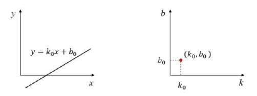

# OpenCV Python 7_其他图像方法

## 1. 傅里叶变换（DFT）

傅里叶变换常用来分析不同滤波器的频率特性，对于图像而言，常用 2D 离散傅里叶变换（DFT）分析频域特性，实现 DFT 的一个快速算法为快速傅里叶变换（FFT）。

对于图像信号而言，如果使用单方向的傅里叶变换，会得到一个方向的频谱图（对于图像而言，频谱是离散的）。图像通常有两个方向（X，Y），通过对两个方向的傅里叶变换，可以得到整个图像的频谱图。

空间频率指的是图像中**不同位置像素灰度值的变化速率**，即图像中不同纹理、边缘和细节等特征的分布和变化。

图像中相邻像素点的幅度变化大，称为高频分量；相反为低频分量。对于图像而言，边界点和噪声为高频分量，所以使用高斯滤波器这一种低通滤波器可以很好的将高频分量滤除，使用 Sobel 或 Laplace 算子这种高通滤波器可以进行边缘检测。

```python
"""
	快速傅里叶变换函数
	参数：灰度图像
"""
np.fft.fft2()
```

`np.fft.fftshift`函数则用于将傅里叶变换的结果进行中心移位，使得低频分量位于图像中心，高频分量位于图像边缘。低频分量代表着图像中的整体形象和背景区域，而高频分量则代表着图像中的突变部分和细节特征。

高通滤波即对频谱图中心区域进行掩膜，低通滤波即对频谱图四周进行掩膜。

```python
img = cv2.imread('apple.jpg', 0)
# FFT 快速傅里叶变换
f = np.fft.fft2(img)
# 中心变换
fshift = np.fft.fftshift(f)
# fft 返回复数数组，通过取模形成波特图
magnitude_spectrum = 20*np.log(np.abs(fshift))
# 掩膜进行高通滤波，提取图像边缘信息
rows,cols = img.shape[:2]
fshift[int(rows/2)-15:int(rows/2)+15,int(cols/2)-15:int(cols/2)+15] = 0
magnitude_spectrum = 20*np.log(np.abs(fshift))
# 进行 FFT 反变换
_ifshift = np.fft.ifftshift(fshift)
_if =  np.abs(np.fft.ifft2(_ifshift))
```

对于不同的算子进行 FFT 可以方便的知道这个算子属于什么滤波器。

```python
"""
	FFT/IFFT 变换函数
	参数：np.float32格式的图像
	返回值：双通道数组，第一个通道为实部，第二个通道为虚部
"""
cv2.dft()
cv2.idft()
```

## 2. 模板匹配（MatchTemplate）

模板匹配是寻找模板图像位置的方法，基于Hu矩形的模板匹配是轮廓形状的匹配，基于直方图反向投影的匹配是颜色的匹配（返回单个像素点的概率图像），模板匹配是颜色和轮廓的匹配。（当然，如果想在不同条件下对同一个物体进行匹配，最好的方法是深度/强化学习）。

OpenCV 进行模板匹配的函数为`cv2.matchTemplate()`，同卷积一样，通过模板图像在输入图像上进行滑动操作，将每一个子图像和模板图像进行比较，最后返回一个灰度图像，每一个像素值表示了此区域与模板的匹配程度。

```python
"""
	模板匹配函数
	第一个参数：输入图像
	第二个参数：模板图像
	第三个参数：匹配方法
	返回值：相似度（0-1），可以由此设定阈值进行筛选
"""
cv2.matchTemplate()

"""
	最大最小值函数
	第一个参数：图像
	返回值：前两个为最小值和最大值，后两个为最小值坐标和最大值坐标
"""
cv2.minMaxLoc()
```

```python
import cv2
import numpy as np
import matplotlib.pyplot as plt

img = cv2.imread('apple_tree.jpg')
plate = cv2.imread('apple.jpg')

img_gray = cv2.cvtColor(img, cv2.COLOR_BGR2GRAY)
plate_gray = cv2.cvtColor(plate, cv2.COLOR_BGR2GRAY)

w, h = plate_gray.shape[::-1]
methods = ['cv2.TM_CCOEFF', 'cv2.TM_CCOEFF_NORMED', 'cv2.TM_CCORR',
           'cv2.TM_CCORR_NORMED', 'cv2.TM_SQDIFF', 'cv2.TM_SQDIFF_NORMED']

for meth in methods:
    method = eval(meth)

    res = cv2.matchTemplate(img_gray, plate_gray, method)
    min_val, max_val, min_loc, max_loc = cv2.minMaxLoc(res)
    if method in [cv2.TM_SQDIFF, cv2.TM_SQDIFF_NORMED]:
        top_left = min_loc
    else:
        top_left = max_loc
    bottom_right = (top_left[0] + w, top_left[1]+h)
    cv2.rectangle(img, top_left, bottom_right, (255, 0, 0), 2)
    
    plt.subplot(121), plt.imshow(img, cmap='gray')
    plt.title('ERes Image'), plt.xticks([]), plt.yticks([])
    plt.suptitle(meth)
    plt.show()
```

## 3. 霍夫变换（Hough）

### 霍夫直线变换

**笛卡尔空间和霍夫空间**

1. 对于一个点的情况

在笛卡尔坐标系中的一条直线$y = k_0x+b_0$对应霍夫空间的一点$(k_0,b_0)$。



- **笛卡儿空间内的一条直线确定了霍夫空间内的一个点。**
- **霍夫空间内的一个点确定了笛卡儿空间内的一条直线。**

> - 笛卡儿空间内的点$(x_0,y_0)$映射到霍夫空间，就是直线$b=−x_0k+y_0$。
> - 霍夫空间内的直线$b=−x_0k+y_0$映射到笛卡儿空间，就是点$(x_0,y_0)$。

2. 对于两个点的情况

- 笛卡儿空间内的两个点会映射为霍夫空间内两条相交于$(k_1,b_1)$的直线。
- 这两个点对应的直线会映射为霍夫空间内的点$(k_1,b_1)$。

**如果在笛卡儿空间内，有N个点能够连成一条直线$y=k_1x+b_1$，那么在霍夫空间内就会有N条直线穿过对应的点$(k_1,b_1)$。或者反过来说，如果在霍夫空间中，有越多的直线穿过点$(k_1,b_1)$，就说明在笛卡儿空间内有越多的点位于斜率为$k_1$，截距为$b_1$的直线$y=k_1x+b_1$上。**

**霍夫变换选择直线的基本思路是：选择有尽可能多直线交汇的点。**

**极坐标系与霍夫空间**

直线的极坐标方程为$\rho = xcos\theta + ysin\theta$，与上述讨论类似，**选择由尽可能多条线汇成的点**。

因此，我们使用累加器，当点对应的霍夫空间直线相交于一点时，累加器加一。设置阈值，当累加器超过一定值时，检测到直线。

OpenCV 中的霍夫直线变换函数为`cv2.HoughLines()`

```python
"""
	霍夫直线变换函数
	第一个参数：二值化图像（应进行二值化或者Canny边缘检测）
	第二个参数：距离的精确度
	第三个参数：角度的精确度
	第四个参数：累加器的阈值
	返回值：元组（距离，角度）
"""
cv2.HoughLines()
```

```python
cap = cv2.VideoCapture(1)
cap.set(10, 2)

while cap.isOpened() == True:
    ret, frame = cap.read()
    if ret == True:
        gray = cv2.cvtColor(frame, cv2.COLOR_BGR2GRAY)
        binary = cv2.Canny(gray, 50, 150, apertureSize=3)

        # 霍夫直线变换
        lines = cv2.HoughLines(binary, 1, np.pi/180, 200)
 
        if not lines is None != False: # 判断列表是空列表还是NoneType类型列表，避免无法遍历
            for line in lines:
                rho, theta = line[0]
                a = np.cos(theta)
                b = np.sin(theta)
                x_0 = a*rho
                y_0 = b*rho
                x1 = int(x_0+1000*(-b))
                y1 = int(y_0+1000*a)
                x2 = int(x_0-1000*(-b))
                y2 = int(y_0-1000*a)

                cv2.line(frame, (x1, y1), (x2, y2), (0, 0, 255), 2)

        cv2.imshow('res', frame)
        key = cv2.waitKey(1)
        if key == 27:
            break
    else:
        break

cv2.destroyAllWindows()
cap.release()
```

### 概率霍夫直线变换

概率霍夫变换对基本霍夫变换算法进行了一些修正，是霍夫变换算法的优化。它没有考虑所有的点。相反，它只需要一个足以进行线检测的随机点子集即可。

为了更好地判断直线，概率霍夫变换算法还对选取直线的方法作了两点改进：

1. **所接受直线的最小长度。**如果有超过阈值个数的像素点构成了一条直线，但是这条直线很短，那么就不会接受该直线作为判断结果，而认为这条直线仅仅是图像中的若干个像素点恰好随机构成了一种算法上的直线关系而已，实际上原图中并不存在这条直线。
2. **接受直线时允许的最大像素点间距。**如果有超过阈值个数的像素点构成了一条直线，但是这组像素点之间的距离都很远，就不会接受该直线作为判断结果，而认为这条直线仅仅是图像中的若干个像素点恰好随机构成了一种算法上的直线关系而已，实际上原始图像中并不存在这条直线。

```python
"""
	概率霍夫直线变换函数
	第一个参数：二值化图像（应进行二值化或者Canny边缘检测）
	第二个参数：距离的精确度
	第三个参数：角度的精确度
	第四个参数：累加器的阈值
	第五个参数：接受直线的最小长度
	第六个参数：用来控制接受共线线段之间的最小间隔，即在一条线中两点的最大间隔。
	返回值：元组（起终点坐标）
"""
cv2.HoughLinesP()
```

### 霍夫圆环变换

用霍夫圆变换来检测图像中的圆，与使用霍夫直线变换检测直线的原理类似。在霍夫圆变换中，需要考虑圆半径和圆心（x坐标、y坐标）共3个参数。

在OpenCV中，采用的策略是两轮筛选。第1轮筛选找出可能存在圆的位置（圆心）；第2轮再根据第1轮的结果筛选出半径大小。

```python
"""
	霍夫圆环变换函数
	第一个参数 image：灰度图。
	第二个参数 method：检测方法。HOUGH_GRADIENT是唯一可用的参数值。
	第三个参数 dp：累计器分辨率，它是一个分割比率，用来指定图像分辨率与圆心累加器分辨率的比例。例如，如果dp=1，则输入图像和累加器具有相同的分辨率。
	第四个参数 minDist：圆心间的最小间距。
	第五个参数 param1：Canny边缘检测器的高阈值（低阈值是高阈值的二分之一）。
	第六个参数 param2：圆心位置必须收到的投票数。只有在第1轮筛选过程中，投票数超过该值的圆，才有资格进入第2轮的筛选。
	第七个参数 minRadius：圆半径的最小值，小于该值的圆不会被检测出来。
	第八个参数 maxRadius：圆半径的最大值，大于该值的圆不会被检测出来。
	返回值：元组（圆心，半径）。
"""
cv2.HoughCircles()
```

```python
import cv2
import numpy as np

cap = cv2.VideoCapture(1)
cap.set(10, 2)

while cap.isOpened() == True:
    ret, frame = cap.read()
    if ret == True:
        gray = cv2.cvtColor(frame, cv2.COLOR_BGR2GRAY)

        # 霍夫直线变换
        circles = cv2.HoughCircles(
            gray, cv2.HOUGH_GRADIENT, 1, 20, param1=50, param2=30, minRadius=50, maxRadius=60)

        if not circles is None != False:  # 判断列表是空列表还是NoneType类型列表，避免无法遍历
            circles = np.uint16(np.around(circles))
            for i in circles[0, :]:
                cv2.circle(frame, (i[0], i[1]), i[2], (0, 255, 0), 2)
                cv2.circle(frame, (i[0], i[1]), 2, (0, 255, 0), 3)

        cv2.imshow('res', frame)
        key = cv2.waitKey(1)
        if key == 27:
            break
    else:
        break

cv2.destroyAllWindows()
cap.release()
```

## 4. 分水岭图像分割

任何一幅灰度图像都可以视为二维拓扑平面。灰度值高的区域为山峰（前景），灰度值低的区域为山谷（背景）。向每一个山谷中灌入不同颜色的水，随着水的升高，不同山谷的水会汇合，需要在水汇合的地方建立堤坝，实现对图像的分割。

以上的方法通常会造成过度分割，是由于白噪声造成。为减少以上影响，OpenCV使用基于掩膜的分水岭算法，在这种算法中需要设置山谷点是否汇合。如果某个区域是肯定的前景（对象），使用标签值进行标记，如果肯定是背景使用另一个标签标记，不确定区使用0标记。

当灌水时，标签被更新，当两个不同的标签的相遇时构建堤坝直到将山峰淹没。

分水岭算法流程如下：

> 1. 对源图像进行灰度化，使用OTSU进行二值化操作。
> 2. 对二值化图像进行形态学开操作。(去除噪声)
> 3. 利用`cv2.distanceTransform`完成图像距离变换操作。
> 4. 将距离变换后的图像进行二值化，与原图像腐蚀后的图像进行比较，得到不确定区。
> 5. 对二值化距离图像进行连通域分析`cv2.connectedComponents()`并进行标签标记。不确定区标记为0，确定区加1
> 6. 分水岭算法进行分割

```python
import cv2
import numpy as np

img = cv2.imread('picture.jpg')
gray = cv2.cvtColor(img, cv2.COLOR_BGR2GRAY)
# 第一步：OTSU二值化
res, binary = cv2.threshold(gray, 0, 255, cv2.THRESH_BINARY+cv2.THRESH_OTSU)
# 第二步：图像进行开运算去除白噪声
kernel = cv2.getStructuringElement(cv2.MORPH_ELLIPSE, (5, 5))
binary = cv2.morphologyEx(binary, cv2.MORPH_OPEN, kernel)
# 第三步：图像距离变换
dist_transform = cv2.distanceTransform(binary, cv2.DIST_L1, 5)
# 二值化距离图像
res, sure_fg = cv2.threshold(
    dist_transform, 0.7 * (dist_transform.max()), 255, 0)
# 第四步：图像腐蚀并寻找不确定区
sure_bg = cv2.dilate(binary, kernel, iterations=3)
sure_fg = np.uint8(sure_fg)
unknown = cv2.subtract(sure_bg, sure_fg)
# 第五步：标记
ret, marker = cv2.connectedComponents(sure_fg)
# 加一使得前景图像标志为1
marker = marker + 1
# 不确定区标记
marker[unknown == 255] = 0
# 深蓝色为未知区域，其余为浅蓝色标记
# 第六步：分水岭算法，边界标记为-1
markers = cv2.watershed(img, marker)
img[markers == -1] = [255, 0, 0]

cv2.imshow('res',img)
cv2.waitKey()
cv2.destroyAllWindows()
```

- 图像距离变换函数

```python
"""
	计算一个二值图像中每个像素到最近零像素的距离
	第一个参数：输入图像
	第二个参数：指定距离类型
		cv2.DIST_L1：使用L1范数计算距离（绝对值差和）。
		cv2.DIST_L2：使用L2范数计算距离（欧几里得距离）。
		cv2.DIST_C：使用Chessboard距离。
		cv2.DIST_L12：使用L1-L2范数计算距离。
	第三个参数：用于指定距离变换的掩膜大小。该参数仅对Chessboard距离有意义。
	返回一个与输入图像大小相同的单通道图像，其中每个像素的值表示该像素到最近零像素的距离。
"""
cv2.distanceTransform()
```

- 连通域分析函数

```python
"""
	用于标记二值图像中的连通区域并返回统计信息
	第一个参数：输入的二值图像，可以是单通道或多通道图像。
	第二个参数：指定连通性
		4：4-邻域连通性（默认）。
		8：8-邻域连通性。
	第三个参数：输出标签的类型
		cv2.CC_STAT_LEFT：返回每个连通区域的左边界坐标（x）。
		cv2.CC_STAT_TOP：返回每个连通区域的顶边界坐标（y）。
		cv2.CC_STAT_WIDTH：返回每个连通区域的宽度。
		cv2.CC_STAT_HEIGHT：返回每个连通区域的高度。
		cv2.CC_STAT_AREA：返回每个连通区域的像素面积。
		cv2.CC_STAT_MAX：返回每个连通区域的最大像素值。
		cv2.CC_STAT_MIN：返回每个连通区域的最小像素值。
		cv2.CC_STAT_AVG：返回每个连通区域的平均像素值。
		cv2.CC_STAT_SUM：返回每个连通区域的像素值总和。
		cv2.CC_STAT_CENTROID：返回每个连通区域的质心坐标。
	返回一个包含统计信息的数组，数组中的每个元素对应一个连通区域。数组的第一列是标签值，后续列是特定类型的统计信息。
"""
cv2.connectedComponents()
```

- 分水岭算法函数

```python
"""
	执行图像分割算法，通常用于分割图像中的对象
	第一个参数：输入图像，可以是灰度图像或彩色图像。
	第二个参数：标记图像，用于指定要分割的对象的位置和数量。标记图像应该与输入图像具有相同的尺寸，并且标记应该是连续的整数。
	返回一个与输入图像大小相同的二值图像，其中每个像素的值表示该像素所属的分割区域。分割区域的值为从1开始的连续整数。边界标记为-1。
"""
cv2.watershed()
```

