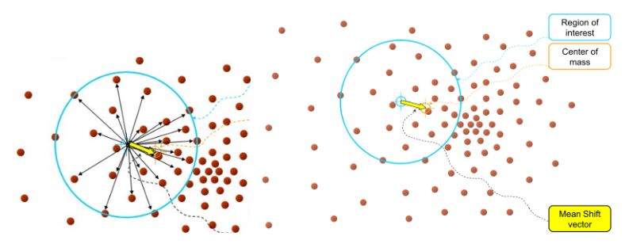

# OpenCV-Python 9_视频分析

## 1. 概率跟踪方法

### Meanshift 算法

[(参考文章)](https://blog.csdn.net/lk3030/article/details/84108765)

Meanshift的本质是一个迭代的过程，在一组数据的密度分布中，使用无参密度估计寻找到局部极值（不需要事先知道样本数据的概率密度分布函数，完全依靠对样本点的计算）。

在d维空间中，任选一个点，然后以这个点为圆心，h为半径做一个高维球，因为有d维，d可能大于2，所以是高维球。落在这个球内的所有点和圆心都会产生一个向量，向量是以圆心为起点落在球内的点位终点。然后把这些向量都相加。相加的结果就是下图中黄色箭头表示的Meanshift向量。



然后，再以这个Meanshift 向量的终点为圆心，继续上述过程，又可以得到一个 Meanshift 向量。

不断地重复这样的过程，可以得到一系列连续的 Meanshift 向量，这些向量首尾相连，最终可以收敛到概率密度最大的点。

Meanshift 算法的本质是从起点开始，一步步迭代从而到达样本特征点的密度中心。

> 由于图像经过直方图反向投影后得到的为概率图像，通过颜色直方图反向投影可以方便的进行最大概率处的跟踪，从而实现图像的跟踪。

```python
"""
	meanShift 算法函数
	probImage:		输入的直方图反向投影图像
	window:			搜索窗口的初始位置和大小
	criteria:		Meanshift算法的终止条件
"""
retval, window = cv2.meanShift(probImage, window, criteria)


## criteria是一个包含三个元素的元组 (type, maxCount, epsilon)
## type: 终止条件的类型。可以是 cv2.TERM_CRITERIA_EPS 表示按照指定精度停止，或者 cv2.TERM_CRITERIA_COUNT 表示按照迭代次数停止，或者两者的组合 cv2.TERM_CRITERIA_EPS | cv2.TERM_CRITERIA_COUNT 表示两者之一满足即可终止。
## maxCount: 最大迭代次数，即算法进行迭代的最大次数。
## epsilon: 指定的精度，用于判断是否达到终止条件。
```

```python
import cv2
import numpy as np

cap = cv2.VideoCapture('test.mp4')

# 确定窗口大小
x, y, w, h = 150, 250, 100, 100
track_window = (x, y, w, h)

# 确定颜色阈值范围
lower_red = np.array([0, 60, 32])
upper_red = np.array([180, 255, 255])

# 读取第一帧
ret, frame = cap.read()
roi = frame[y:y+h, x:x+w]
hsv_roi = cv2.cvtColor(frame, cv2.COLOR_BGR2HSV)

# 创建红色掩膜
mask = cv2.inRange(hsv_roi, lower_red, upper_red)

# 获取红色小球的直方图并归一化
roi_hist = cv2.calcHist([hsv_roi], [0], mask, [180], [0, 180])
roi_hist = cv2.normalize(roi_hist, roi_hist, 0, 255, cv2.NORM_MINMAX)

# 设置Meanshift的终止条件（最大迭代次数为10，移动小于1像素）
term_criteria = (cv2.TERM_CRITERIA_EPS | cv2.TERM_CRITERIA_COUNT, 10, 1)

while True:
    ret, frame = cap.read()
    if not ret:
        break

    hsv = cv2.cvtColor(frame, cv2.COLOR_BGR2HSV)

    # 计算反向投影
    dst = cv2.calcBackProject([hsv], [0], roi_hist, [0, 180], 1)

    # 应用Meanshift算法
    ret, track_window = cv2.meanShift(dst, track_window, term_criteria)

    x, y, w, h = track_window
    img = cv2.rectangle(frame, (x, y), (x + w, y + h), 255, 2)

    cv2.imshow('Meanshift Tracking', img)

    if cv2.waitKey(30) & 0xFF == 27:
        break

cap.release()
cv2.destroyAllWindows()
```

> 1. **优点**
>
> - 算法计算量不大，在目标区域已知的情况下完全可以做到实时跟踪；
>
> - 采用核函数直方图模型，对边缘遮挡、目标旋转、变形和背景运动不敏感。
>
> 2. **缺点**
>
> - 跟踪过程中由于窗口宽度大小保持不变，框出的区域不会随着目标的扩大（或缩小）而扩大（或缩小）；
>
> - 当目标速度较快时，跟踪效果不好；
>
> - 直方图特征在目标颜色特征描述方面略显匮乏，缺少空间信息；
> - 需要指定初始窗口。

### Camshift 算法

Camshift 是连续的自适应 Meanshift 算法，可以在跟踪的过程中随着目标大小的变化实时调整搜索窗口大小，对于视频序列中的每一帧还是采用 Meanshift 来寻找最优迭代结果。

在 Meanshift 算法中寻找搜索窗口的质心用到窗口的零阶矩$M_{00}$和一阶矩$M_{10}$，$M_{01}$，零阶矩是搜索窗口内所有像素的积分，即所有像素值之和，物理上的意义是计算搜索窗口的尺寸。经过目标的直方图反向投影后，目标区域的搜索窗口大部分像素值归一化后应该是最大值255，如果计算出来零阶矩大于某一阈值，可以认为此时目标铺满了整个搜索窗口，有理由认为在搜索窗口之外的区域还存在目标区域，需要增大搜索窗口的尺寸；相应的，如果零阶矩小于某一阈值，则需要缩小搜索窗口的尺寸，如此一来，当目标的大小发生变化的时候，Camshift 算法就可以自适应的调整目标区域进行跟踪。
```python
import cv2
import numpy as np

cap = cv2.VideoCapture('test.mp4')

# 确定窗口大小
x, y, w, h = 150, 250, 100, 100
track_window = (x, y, w, h)

# 确定颜色阈值范围
lower_red = np.array([0, 60, 32])
upper_red = np.array([180, 255, 255])

# 读取第一帧
ret, frame = cap.read()
roi = frame[y:y+h, x:x+w]
hsv_roi = cv2.cvtColor(frame, cv2.COLOR_BGR2HSV)

# 创建红色掩膜
mask = cv2.inRange(hsv_roi, lower_red, upper_red)

# 获取红色小球的直方图并归一化
roi_hist = cv2.calcHist([hsv_roi], [0], mask, [180], [0, 180])
roi_hist = cv2.normalize(roi_hist, roi_hist, 0, 255, cv2.NORM_MINMAX)

# 设置Camshift的终止条件（最大迭代次数为10，移动小于1像素）
term_criteria = (cv2.TERM_CRITERIA_EPS | cv2.TERM_CRITERIA_COUNT, 10, 1)

while True:
    ret, frame = cap.read()
    if not ret:
        break

    hsv = cv2.cvtColor(frame, cv2.COLOR_BGR2HSV)

    # 计算反向投影
    dst = cv2.calcBackProject([hsv], [0], roi_hist, [0, 180], 1)

    # 应用Camshift算法
    res, track_window = cv2.CamShift(dst, track_window, term_criteria)

    pts = cv2.boxPoints(res)
    pts = np.int0(pts)
    img = cv2.polylines(frame, [pts], True, 255, 2)

    cv2.imshow('Meanshift Tracking', img)

    if cv2.waitKey(30) & 0xFF == 27:
        break

cap.release()
cv2.destroyAllWindows()
```

## 2. 光流法

**光流**是一个视频中两个连续帧之间的逐像素运动估计任务。基本上，光流任务意味着计算像素的移动向量作为物体在两个相邻图像之间的位移差。光流的主要思想是估计物体运动或摄像机运动引起的物体的位移矢量。

光流有两种类型，第一种称为稀疏光流。它计算特定对象集合的运动向量(例如，图像上检测到的角)。因此，需要对图像进行预处理以提取特征，这是光流计算的基础。仅使用稀疏特征集意味着将不会有不包含在其中的像素的运动信息。使用密集光流算法可以消除这一限制，该算法假定为图像中的每个像素计算一个运动向量。

光流法基于以下的假设：1. 运动一致性假设：相邻帧中相邻的像素点具有相似的运动；2. 亮度恒定性假设：在短时间内，同一点的亮度保持不变。3. 亮度梯度一致性假设：在运动物体前景和背景之间，亮度的梯度在运动方向上是一致的。

假设第一帧图像的像素$I(x,y,t)$经过移动后得到$I(x+dx,y+dy,t+dt)$，经过泰勒展开得到：
$$
\frac{\partial I}{\partial x}\frac{dx}{dt} + \frac{\partial I}{\partial y}\frac{dy}{dt} + \frac{\partial I}{\partial t} = 0
$$
上式为光流方程。其中 $(u, v)$ 是光流向量。

### 稀疏光流：Lucas-Kanade 法

Lucas-Kanade法步骤如下：

1. 选择图像上的一个小区域，通常是一个3×3窗口。
2. 找到窗口中的像素并列出光流方程。
3. 将构建的方程组进行最小二乘法求解。

结果如下：
$$
\left[\begin{matrix}u \\ v \end{matrix}\right]
= 
\left[\begin{matrix}\Sigma I_{x_i}^2 & \Sigma I_{x_i}I_{y_i} \\ \Sigma I_{x_i}I_{y_i} & \Sigma I_{y_i}^2\end{matrix}\right]^{-1}
\left[\begin{matrix}-\Sigma I_{x_i}I_{t_i}  \\ -\Sigma I_{y_i}I_{t_i}\end{matrix}\right]
$$
如果需要处理在尺度空间较大的运动，就需要使用图像金字塔。

```python
import cv2
import numpy as np

# 读取视频文件
cap = cv2.VideoCapture('test.mp4')

# 读取第一帧
ret, old_frame = cap.read()
old_gray = cv2.cvtColor(old_frame, cv2.COLOR_BGR2GRAY)

# 设置角点初始位置
p0 = cv2.goodFeaturesToTrack(
    old_gray, maxCorners=100, qualityLevel=0.3, minDistance=7, blockSize=7)

# 图像金字塔参数
lk_params = dict(winSize=(15, 15), maxLevel=2, criteria=(
    cv2.TERM_CRITERIA_EPS | cv2.TERM_CRITERIA_COUNT, 10, 0.03))

# 创建一个掩膜用于绘制轨迹
mask = np.zeros_like(old_frame)

while True:
    # 读取新的一帧
    ret, frame = cap.read()
    if not ret:
        break
    frame_gray = cv2.cvtColor(frame, cv2.COLOR_BGR2GRAY)

    # 计算光流
    p1, status, err = cv2.calcOpticalFlowPyrLK(
        old_gray, frame_gray, p0, None, **lk_params)

    # 仅保留跟踪成功的点
    good_new = p1[status == 1]
    good_old = p0[status == 1]

    # 绘制轨迹
    for i, (new, old) in enumerate(zip(good_new, good_old)):
        a, b = new.ravel()
        c, d = old.ravel()
        mask = cv2.line(mask, (int(a), int(b)),
                        (int(c), int(d)), (0, 255, 0), 2)
        frame = cv2.circle(frame, (int(a), int(b)), 5, (0, 0, 255), -1)

    # 合并原始图像和轨迹
    img = cv2.add(frame, mask)

    # 显示结果
    cv2.imshow('Optical Flow Tracking', img)

    # 更新角点位置
    p0 = good_new.reshape(-1, 1, 2)

    # 按下ESC键退出
    if cv2.waitKey(30) & 0xFF == 27:
        break

# 释放资源
cap.release()
cv2.destroyAllWindows()
```

### 稠密光流：Farneback法

Farneback法相较于Lucas-Kanade法使用了更高阶多项式进行Taylor逼近。光流可以由一个多项式运动模型来逼近，这个多项式的系数就是光流的向量。

Farneback算法的优势在于它能够处理较大的光流，并且适用于一定程度的非线性运动。

```python
import cv2
import numpy as np
import matplotlib.pyplot as plt

# 读取视频文件
cap = cv2.VideoCapture('test.mp4')

# 读取第一帧
ret, frame1 = cap.read()
prvs = cv2.cvtColor(frame1, cv2.COLOR_BGR2GRAY)

# 创建一个图像，用于显示光流场
hsv = np.zeros_like(frame1)
hsv[..., 1] = 255

while True:
    # 读取新的一帧
    ret, frame2 = cap.read()
    if not ret:
        break
    next_frame = cv2.cvtColor(frame2, cv2.COLOR_BGR2GRAY)

    # 计算Farneback光流
    flow = cv2.calcOpticalFlowFarneback(prvs, next_frame, None, 0.5, 3, 15, 3, 5, 1.2, 0)

    # 极坐标转换
    mag, ang = cv2.cartToPolar(flow[..., 0], flow[..., 1])

    # 将角度映射到HSV色彩空间
    hsv[..., 0] = ang * 180 / np.pi / 2

    # 将光流的幅度映射到HSV的亮度通道
    hsv[..., 2] = cv2.normalize(mag, None, 0, 255, cv2.NORM_MINMAX)

    # 将HSV图像转回BGR
    bgr = cv2.cvtColor(hsv, cv2.COLOR_HSV2BGR)

    # 显示结果
    cv2.imshow('Optical Flow Analysis', bgr)

    # 更新上一帧图像
    prvs = next_frame

    # 按下ESC键退出
    if cv2.waitKey(30) & 0xFF == 27:
        break

# 释放资源
cap.release()
cv2.destroyAllWindows()
```

## 3. 背景减除

**（摄像头静止时使用）**

### BackgroundSubtractorMOG 算法

以混合高斯模型为基础的前景/背景分割算法,使用 K（K = 3 或 5）个高斯分布混合对 背景像素进行建模。使用这些颜色（在整个视频中）存在时间的长短作为混合的权重。背景的颜色一般持续的时间最长，而且更加静止。
```python
"""
	背景对象创建函数
	history：时间长度，默认200
	nmixtures：高斯混合成分的数量，默认5
	backgroundRatio：背景比率，默认0.7
	noiseSigma：噪声强度（亮度或每个颜色通道的标准偏差）。默认 0表示一些自动值。
"""
fgbg = cv2.bgsegm.createBackgroundSubtractorMOG(history, nmixtures, backgroundRatio, noiseSigma)
```

### BackgroundSubtractorMOG2 算法

以高斯混合模型为基础的背景/前景分割算法，它为每 一个像素选择一个合适数目的高斯分布。这样就会对由于亮度等发生变化引起的场景变化产生更好的适应。
```python
"""
	背景对象创建函数
	history：时间长度，默认500
	varThreshold：像素和模型之间的平方Mahalanobis距离的阈值，以确定背景模型是否很好地描述了像素。此参数不会影响后台更新。默认16
	detectShadows：如果为true（默认），则算法将检测阴影并标记它们。它会略微降低速度，因此如果您不需要此功能，请将参数设置为false。
"""
fgbg = cv2.createBackgroundSubtractorMOG2(history, varThreshold, detectShadows)
```

```python
import cv2

# 创建背景减除器对象
## bg_subtractor = cv2.createBackgroundSubtractorMOG2()
bg_subtractor = cv2.bgsegm.createBackgroundSubtractorMOG()
cap = cv2.VideoCapture(1)

while True:
    # 读取当前帧
    ret, frame = cap.read()

    if not ret:
        break

    # 对当前帧应用背景减除算法
    fg_mask = bg_subtractor.apply(frame)

    # 可以对结果进行一些后处理，比如去除小的噪点
    fg_mask = cv2.medianBlur(fg_mask, 5)

    cv2.imshow('Original Frame', frame)
    cv2.imshow('Foreground Mask', fg_mask)

    if cv2.waitKey(30) & 0xFF == ord('q'):
        break

cap.release()
cv2.destroyAllWindows()
```

### BackgroundSubtractorGMG算法

结合了静态背景图像估计和每个像素的贝叶斯分割。它使用前面很少的图像（默认为前 120 帧）进行背景建模。使用了概率前景估计算法（使用贝叶斯估计鉴定前景）。这是一种自适应的估计，新观察到的对象比旧的对象具有更高的权重，从而对光照变化产生适应。一些形态学操作 如开运算闭运算等被用来除去不需要的噪音。在前几帧图像中会得到一个黑色窗口。

对结果进行形态学开运算对与去除噪声很有帮助。

```python
"""
	背景对象创建函数
	initializationFrames：于初始化背景模型的帧数，默认120
	decisionThreshold：阈值，超过该阈值，标记为前景，否则为背景，默认0.8
"""
fgbg = cv2.bgsegm.createBackgroundSubtractorGMG(initializationFrames，decisionThreshold)
```

```python
import numpy as np
import cv2

cap = cv2.VideoCapture(1)
kernel = cv2.getStructuringElement(cv2.MORPH_ELLIPSE, (3, 3))
fgbg = cv2.bgsegm.createBackgroundSubtractorGMG()
while True:
    ret, frame = cap.read()
    fgmask = fgbg.apply(frame)
    fgmask = cv2.morphologyEx(fgmask, cv2.MORPH_OPEN, kernel)
    cv2.imshow('frame', fgmask)
    cv2.imshow('original', frame)
    k = cv2.waitKey(30) & 0xff
    if k == 27:
        break
cap.release()
cv2.destroyAllWindows()
```


