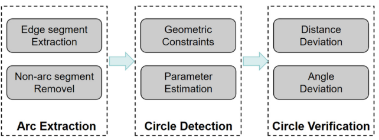

# OpenCV Python A1_1 基于圆内接三角形的快速高精圆检测

[原文链接](https://blog.csdn.net/qq_39709535/article/details/122386697)

传统的圆形检测算法是基于Hough变换的投票机制，但是Hough变换存在以下问题：

1. 对参数的要求较高，对噪声十分敏感，容易过度测量和丢失，依赖离散的像素；
2. 检测速度慢。

本算法基于连续圆弧进行圆检测，精度更高，检测速度也更快。

## 1. 算法简介

算法包括三个主要模块：**弧段提取**->**圆检测**->**圆验证**

### 弧段提取

