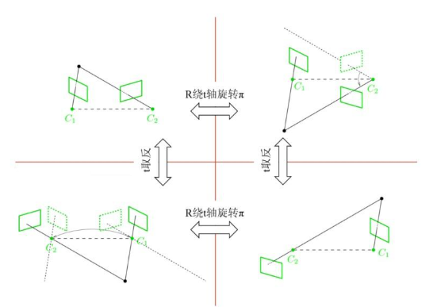
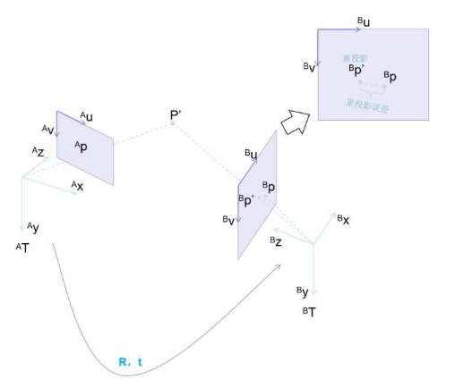

# OpenCV-Python 11_位姿估计

位姿估计指通过图像估计摄像头的当前位姿。

本节参考：[链接](https://zhuanlan.zhihu.com/p/1920148496880731273)

## 1. 2D-2D 位姿估计


2D-2D 位姿估计问题指：给定两帧图像，求拍摄这两帧图像时的相机位姿变化。解 2D-2D 问题需要两个步骤：**特征匹配(匹配两帧图像拍摄到的相同点)和解 2D-2D 问题(基于匹配的特征点求解位姿变化)**。算法的输入是两帧图像和相机的内参矩阵。


相机在位姿 $^AT$ 下拍摄一组像素坐标的点 $\{^Ap_1,^Ap_2,...,^Ap_n\}$，其中 $^Ap_i$ 为 $(^Au_i,^Av_i)$； 在位姿 $^BT$ 下拍摄一组像素坐标的点 $\{^Bp_1,^Bp_2,...,^Bp_n\}$，其中 $^Bp_i$ 为 $(^Bu_i,^Bv_i)$； 其中 $^Ap_i$ 和 $^Bp_i$ 匹配，求变换 $^AT_B$;


### 由本质矩阵求R/t

#### 对极几何和对极约束

三维空间的物点在相机 $^AT$ 位姿下的成像点为 $^Ap$ ，在相机 $^BT$ 位姿下的成像点为 $^Bp$，相机坐标系的光心为 $^AO$ 和 $^BO$，其连线为基线，基线与成像平面的交点为极点 $^Ae$，$^Be$。成像面上的极点和成像点的连线为极线，由此所有极线相交于极点，两个光心和物点构成极平面。


对于不同物点，极平面绕基线旋转时，对应的在成像平面上极线绕极点旋转。接下来推导对极约束。


向量 $\vec{^BO^AO}$，$\vec{^AOP}$，$\vec{^BOP}$ 在同一个平面上，必有：
$$
\vec{^BOP} \cdot (\vec{^BO^AO} \times \vec{^AOP}) = 0
$$
目前已知 $\vec{^BO^AO}$，$\vec{^BOP}$ 在位姿 $^BT$ 对应的坐标系下的向量为：
$$
\vec{^BO^AO} = ^Bt_A \\
 \vec{^BOP} = \left[
\begin{matrix}
^Bx \\
^By \\
^Bz \\
\end{matrix}
\right]
$$
$\vec{^AOP}$ 在位姿 $^AT$ 对应的坐标系下的向量为：
$$
\vec{^AOP} = \left[
\begin{matrix}
^Ax \\
^Ay \\
^Az \\
\end{matrix}
\right]
$$
需要写出 $\vec{^AOP}$ 在位姿 $^BT$ 对应的坐标系下的向量：
$$
\vec{^AOP} = \vec{^AO^BO} + \vec{^BOP} \\
\vec{^BO^AO} = ^Bt_A \\
\vec{^BOP} = ^BR_A \left[
\begin{matrix}
^Ax \\
^Ay \\
^Az \\
\end{matrix}
\right] + ^Bt_A \\
\vec{^AOP} = ^BR_A \left[
\begin{matrix}
^Ax \\
^Ay \\
^Az \\
\end{matrix}
\right]
$$
整理可得：
$$
\left[
\begin{matrix}
^Bx \\
^By \\
^Bz \\
\end{matrix}
\right]^T(^Bt_A \times ^BR_A\left[
\begin{matrix}
^Ax \\
^Ay \\
^Az \\
\end{matrix}
\right]) = 0
$$
将 $^Bt_A$ 写成反对称矩阵：
$$
[^Bt_A] = \left[
\begin{matrix}
0 & -t_z & t_y \\
t_z & 0 & -t_x \\
-t_y & t_x & 0
\end{matrix}
\right]
$$
则可以用矩阵乘法表示向量叉乘，得到对极约束：
$$
\left[
\begin{matrix}
^Bx \\
^By \\
^Bz \\
\end{matrix}
\right]^T([^Bt_A] {^BR_A}\left[
\begin{matrix}
^Ax \\
^Ay \\
^Az \\
\end{matrix}
\right]) = 0
$$
其中 $E = [^Bt_A] {^BR_A}$ 为**本质矩阵**。

接下来考虑相机内参，由针孔相机的相机模型可以得到：
$$
z\left[
\begin{matrix}
u \\
v \\
1 
\end{matrix}
\right] = K \left[
\begin{matrix}
x \\ y \\ z
\end{matrix}
\right]
$$
对极约束可以改写为：
$$
\left[
\begin{matrix}
^Bu \\
^Bv \\
1 
\end{matrix}
\right]^T(K^{-1})^TE(K^{-1})
\left[
\begin{matrix}
^Au \\
^Av \\
1 
\end{matrix}
\right] = 0
$$
其中 $F = (K^{-1})^TE(K^{-1})$ 为**基础矩阵**。

#### 用对极约束求R/t

1. 由对极约束求本质矩阵 $E$
   $$
   \left[
   \begin{matrix}
   ^Bx \\
   ^By \\
   ^Bz \\
   \end{matrix}
   \right]^T
   E
   \left[
   \begin{matrix}
   ^Ax \\
   ^Ay \\
   ^Az \\
   \end{matrix}
   \right] = 0
   $$
   可以由已知的像素点坐标和相机内参求得相机坐标系的坐标。将本质矩阵 $E$ 展开可以得到：
   $$
   \left[
   \begin{matrix}
   ^Bx \\
   ^By \\
   ^Bz \\
   \end{matrix}
   \right]^T
   \left[
   \begin{matrix}
   e_1 & e_2 & e_3 \\
   e_4 & e_5 & e_6 \\
   e_7 & e_8 & e_9 \\
   \end{matrix}
   \right]
   \left[
   \begin{matrix}
   ^Ax \\
   ^Ay \\
   ^Az \\
   \end{matrix}
   \right] = 0
   $$
   该方程可以得到关于 $e_1$ 到 $e_9$ 的线性方程组 $Ae = 0$，其中 $A$ 的每一行对应一对点。

   > 注意，某一组本质矩阵的解乘以任意非零实数仍然为该方程的解，由于 $|^BR_A|=1$ 无法缩放，所以最后得到的 $^At_B$ 可以缩放，由此产生了**尺度不确定性**。由此需要规定一个 $t$ 的长度。

   该方程是齐次方程，根据线性齐次方程组有非零齐次解的条件，只需要知道 8 个点即可得到一个基础解系，这称为**八点法**。(但是由于 $E$ 本质上有5个自由度(3个旋转+2个平移方向)，使用五点法即可)

   但是实际中配对点数通常超过 8 对，这个方程就成为超定方程导致无解，由此只能求得最小二乘解(最小二乘拟合)，即求 $argmin \sum^n_{i=1}(A_ie)^2$。

   这里介绍一种求解方法：对 $A$ 做 SVD 奇异值分解：
   $$
   A = U\Sigma V^T
   $$
   

   > $U$ 为正交矩阵，$V$ 为正交矩阵的转置，$\Sigma$ 为对角矩阵。

   $V$ 的最后一列向量即为最小二乘解。

   - 使用 RANSAC 增加稳定性

     由于实际特征匹配可能有误匹配，因此通常使用 RANSAC 可以增加稳定性。

     

     > 1. 选取原始数据的随机子集，将这个子集称为假设的内点；
     > 2. 将模型拟合到一组假设的内点；
     > 3. 针对于拟合的模型测试其他数据，根据一个损失函数，那些很好的拟合估计模型的点可以视为共识集的一部分，如果足够多的点进入共识集，则估计模型相当好。
     > 4. 通过共识集合的所有成员重新进行拟合。

2. 由本质矩阵求$R/t$

   $E = [^Bt_A] {^BR_A}$，求得 $E$ 之后需要分解为 $R/t$。

   先求 $R$：

   - 反对称矩阵 $[^Bt_A] = kUZU^T$，其中 $k$ 为尺度不确定性，$U$ 为正交矩阵，$Z = \left[
     \begin{matrix}
     0 & 1 & 0 \\ -1 & 0 & 0 \\ 0 & 0 & 0\end{matrix}
     \right]$

   - 引入正交矩阵$W = \left[
     \begin{matrix}
     0 & -1 & 0 \\ 1 & 0 & 0 \\ 0 & 0 & 1\end{matrix}
     \right]$和对角矩阵$diag(1,1,0)$，$Z=diag(1,1,0)W$；

   - $E = kUdiag(1,1,0)WU^TR$，$WU^TR$ 为正交矩阵，根据 SVD 分解直接得到：
     $$
     R_1 = UW^TV^T
     $$
     

     考虑到 $E$ 的符号不确定，由$E = kUdiag(1,1,0)WU^TR = kUdiag(-1,-1,0)W^TU^TR$ 得到：
     $$
     R_2 = UWV^T
     $$
     

   再求 $t$：

   假设 $[t] = UZU^T = A$，由于向量自身的叉乘是零向量，则 $At=0$，限定尺度 $||t|| = 1$。

   则 $t$ 是 $A$ 的 SVD 分解之后的最后一列，则 $t_1 = U(0,0,1)^T$， $t_2 = U(0,0,-1)^T$。

   由此可以得到四组解。

   这四组解之间有关系：$t_1+t_2 = 0$ 且 $R_2$ 和 $R_1$ 绕 $t$ 轴旋转相差 $\pi$ 弧度。

   

   只有 $R_1$ 和 $t_1$ 是符合深度为正的解。

   由于摄像头可能只是纯旋转，对极约束不再适用，由此需要通过单应矩阵进行求解。($t$ 很小时/配对点的深度远大于相机平移/配对点在一个平面上)

### 由单应矩阵求R/t

针对配对点近似在一个平面上的问题，用单应矩阵求解。


假设 $^Ap$ 和 $^Bp$ 在同一个平面上，这两个点存在单应变换。
$$
\left[
\begin{matrix}
^Bu \\
^Bv \\
1 
\end{matrix}
\right]
\propto
K(R+\frac{t\cdot n^T}{d})K^{-1}
\left[
\begin{matrix}
^Au \\
^Av \\
1 
\end{matrix}
\right]
$$

#### 单应变换


将物点 $P$ 在 $A$ 坐标系(相机坐标系)下的坐标视为一个向量，其与 $\pi$ 平面的法向量 $\vec{n}$ 点乘为 $^AP$ 在 $\vec{n}$ 方向上的投影，也是 $A$ 坐标系原点到 $\pi$ 平面的距离 $d$。
$$
\vec{n}^T\cdot^AP = d
$$
 引入相机内参可以得到：

$$
^Az\vec{n}^TK^{-1}\left[
\begin{matrix}
^Au \\
^Av \\
1 
\end{matrix}
\right] = d
$$

同时有：
$$
^BzK^{-1}\left[
\begin{matrix}
^Bu \\
^Bv \\
1 
\end{matrix}
\right] = ^BP \\
^BP=^BR_A{^AP}+^Bt_A
$$
可以整理得到：
$$
\left[
\begin{matrix}
^Bu \\
^Bv \\
1 
\end{matrix}
\right]
\propto
K(R+\frac{t\cdot n^T}{d})K^{-1}
\left[
\begin{matrix}
^Au \\
^Av \\
1 
\end{matrix}
\right]
$$
其中 $H = K(R+\frac{t\cdot n^T}{d})K^{-1}$ 为单应矩阵，和 $E$ 类似，$H$ 同样具备尺度不确定性。

#### 由单应变换求R/t

1. 由单应变换求单应矩阵$H$

   考虑叉乘为0：
   $$
   \left[
   \begin{matrix}
   ^Bu \\
   ^Bv \\
   1 
   \end{matrix}
   \right] \times H
   \left[
   \begin{matrix}
   ^Au \\
   ^Av \\
   1 
   \end{matrix}
   \right] = 0
   $$
   由此得到以下方程组：
   $$
   \left[
   \begin{matrix}
   0 &  -1 & ^Bv_i \\
   1 & 0 & -^Bu_i \\
   -^Bv_i & ^Bu_i & 0
   \end{matrix}
   \right]H
   \left[
   \begin{matrix}
   ^Au \\
   ^Av \\
   1 
   \end{matrix}
   \right] = 0
   $$
   类似于本质矩阵求解的方法得到齐次方程组：$Ah = 0$。由于 $H$ 的自由度为 8，通常取 8 个配对点可以得到 $H$，但是可以通过约束条件实现四点法。

   实际配对点远超过 4 对。同样求取最小二乘解，通过 RANSAC 增加稳定性。

2. 由单应矩阵求 $R/t$

   > 有三种方法：
   >
   > Faugeras SVD-based decomposition (ORB-SLAM)；
   >
   > Zhang SVD-based decomposition；
   >
   > Analytical decomposition (OpenCV)；

   这里介绍 Zhang SVD-based decomposition。

   - 令 $A = dR+tn^T = K^{-1}HK$，此时求出 $A$；

   - 对 $A$ 进行 SVD 分解：$A = dR+tn^T = Udiag(d_1,d_2,d_3)V^T$；

   - 解 $d^,$，$n^,$，$R^,$，$t^,$：

     1. $d_1＞d_2＞d_3$/$d_1＞d_2=d_3$/$d_1=d_2＞d_3$
        $$
        \left\{  
        \begin{array}{**lr**}  
        d^, = d_2 \\
        n^, = (x_1,0,x_3)^T \\
        R^, = \left[\begin{matrix}
        cos\theta & 0 &-sin\theta \\
        0 & 1 & 0 \\
        sin\theta & 0 & cos\theta 
        \end{matrix}\right] \\
        t^, = (d_1-d_3)\left[\begin{matrix}
        x_1 \\ 0 \\-x_3
        \end{matrix}\right]
        \end{array}  
        \right.
        \\
        x_1 = \epsilon_1 \sqrt{\frac{d_1^2-d_2^2}{d_1^2-d_3^2}} \\
        x_3 = \epsilon_3 \sqrt{\frac{d_2^2-d_3^2}{d_1^2-d_3^2}}
        \\
        sin\theta = (d_1-d_3)\frac{x_1x_3}{d_2} \\
        cos\theta = \frac{d_3x_1^2+d_1x_3^2}{d_2} \\
        \epsilon_1,\epsilon_3 = ±1
        $$

     2. $d_1＞d_2＞d_3$/$d_1＞d_2=d_3$/$d_1=d_2＞d_3$
        $$
        \left\{  
        \begin{array}{**lr**}  
        d^, = -d_2 \\
        n^, = (x_1,0,x_3)^T \\
        R^, = \left[\begin{matrix}
        cos\theta & 0 &sin\theta \\
        0 & -1 & 0 \\
        sin\theta & 0 & -cos\theta 
        \end{matrix}\right] \\
        t^, = (d_1+d_3)\left[\begin{matrix}
        x_1 \\ 0 \\x_3
        \end{matrix}\right]
        \end{array}  
        \right.
        \\
        x_1 = \epsilon_1 \sqrt{\frac{d_1^2-d_2^2}{d_1^2-d_3^2}} \\
        x_3 = \epsilon_3 \sqrt{\frac{d_2^2-d_3^2}{d_1^2-d_3^2}}
        \\
        sin\theta = (d_1+d_3)\frac{x_1x_3}{d_2} \\
        cos\theta = \frac{d_3x_1^2-d_1x_3^2}{d_2} \\
        \epsilon_1,\epsilon_3 = ±1
        $$

     3. $d_1=d_2=d_3$
        $$
        \left\{  
        \begin{array}{**lr**}  
        d^, = d_2 \\
        n^, 不确定 \\
        R^, = I \\
        t^, = 0
        \end{array}  
        \right.
        $$

     4. $d_1=d_2=d_3$
        $$
        \left\{  
        \begin{array}{**lr**}  
        d^, = -d_2 \\
        n^, 不确定 \\
        R^, = -I + 2n^,n^T \\
        t^, = 2d_2n^,
        \end{array}  
        \right.
        $$

   - 解 $d$，$n$，$R$，$t$：

     $$
     \left\{  
     \begin{array}{**lr**}  
     d=sd^, \\
     R=sUR^,V^T \\
     t=Ut^, \\
     n=Vn^, \\
     \end{array}  
     \right.
     $$
     
   
   根据匹配点深度筛选出最优解。

### 解的选择——重投影


将特征点从一帧图像投影到另一帧图像上，测量投影坐标和测量坐标误差。

#### 三角测量

通过两处观察同一个物点以确定距离：


已知像素坐标和两处观测点的位姿变化，通过三角测量和相机内参可以得到物点的相机坐标系坐标。
$$
^AzK^{-1}\left[
\begin{matrix}
^Au \\
^Av \\
1 
\end{matrix}
\right] = \left[
\begin{matrix}
^Ax \\
^Ay \\
^Az \\
\end{matrix}
\right] \\
^BzK^{-1}\left[
\begin{matrix}
^Bu \\
^Bv \\
1 
\end{matrix}
\right] = \left[
\begin{matrix}
^Bx \\
^By \\
^Bz \\
\end{matrix}
\right] = ^BR_A\left[
\begin{matrix}
^Ax \\
^Ay \\
^Az \\
\end{matrix}
\right]+^Bt_A
$$
通过两式即可求得 P 在两个相机坐标系的三维坐标，通过世界坐标系可以完成地图初始化。

#### 重投影误差计算



将像素坐标系 A 下的像素点 $^Ap$ 重投影到像素坐标系 B 下。通过内参转换->坐标变换->内参转换得到重投影坐标，通过距离误差对 R/t 筛选。


## 2. 3D-2D 位姿估计

3D-2D 位姿估计问题(PnP问题)指已知物体在世界坐标系下的坐标，以及物体在相机的图像平面的像素坐标，求解相机的位姿。


解 3D-2D 问题需要两个步骤：**特征匹配(匹配图像和地图(三维坐标点和特征描述子构成)之间的相同特征点)和解 3D-2D 问题(基于匹配的特征点求解位姿)**。算法的输入是一帧图像，相机的内参矩阵和地图点。

3D-2D 问题的解法包括 DLT，P3P，EPnP，BA 等等。

### DLT 直接线性变换

参考链接：[链接](https://blog.csdn.net/weixin_44197735/article/details/124341862)
$$
z_c\left[
\begin{matrix}
u \\
v \\
1 
\end{matrix}
\right] = K[R|t]\left[
\begin{matrix}
x_w \\
y_w \\
z_w \\
1
\end{matrix}
\right] \\
z_c\left[
\begin{matrix}
u \\
v \\
1 
\end{matrix}
\right] = 
\left[
\begin{matrix}
f_{11} & f_{12} & f_{13} & f_{14} \\
f_{21} & f_{22} & f_{23} & f_{24} \\
f_{31} & f_{32} & f_{33} & f_{34} \\
\end{matrix}
\right]
\left[
\begin{matrix}
x_w \\
y_w \\
z_w \\
1
\end{matrix}
\right] \\
\left\{  
\begin{array}{**lr**}  
z_cu = f_{11}x_w + f_{12}y_w + f_{13}z_w + f_{14} \\
z_cv = f_{21}x_w + f_{22}y_w + f_{23}z_w + f_{24} \\
z_c = f_{31}x_w + f_{32}y_w + f_{33}z_w + f_{34}
\end{array}  
\right.\\
\left\{  
\begin{array}{**lr**}  
f_{11}x_w+f_{12}y_w+f_{13}z_w+f_{14}-f_{31}x_wu-f_{32}y_wu-f_{33}z_wu-f_{34}u = 0\\
f_{21}x_w+f_{22}y_w+f_{23}z_w+f_{24}-f_{31}x_wv-f_{32}y_wv-f_{33}z_wv-f_{34}v = 0
\end{array}  
\right.
$$
一对匹配点需要两个方程，由此需要6对匹配点。上述式子可以整理为 $Af= 0$；

实际中可能超过6对匹配点，此时可以获得最小二乘解或者用 RANSAC 得到解。得到的解先乘以$K^{-1}$ 去除内参，此时得到的解 $\overline{R}$ 是无尺度和无约束的，此时利用旋转矩阵 $R$ 得到带有尺度的解。即解优化问题：$argmin||R-\overline{R}||$。

对 $\overline{R}$ 做 SVD 分解得到 $\overline{R} = U\Sigma V^T$，可以得到 $R = ±UV^T$。可以得到比例系数 $\beta = ±\frac{3}{tr(\Sigma)}$，此时 $t = \beta \overline{t}$。对于正负，需要保证深度为正，由此需要使得：
$$
\beta(x_w\overline{f_{31}} + y_w\overline{f_{32}} + z_w\overline{f_{33}} + \overline{f_{34}}) ＞ 0
$$

### P3P

参考链接：[链接](https://blog.csdn.net/leonardohaig/article/details/120756834)

通过已知的3对精准匹配的 2D-3D 点求解图像间相对的位姿变换。


假设相机坐标中心为 $O$，$X_1,X_2,X_3$ 是不共线的 3D 点，图像投影点为 $x_1,x_2,x_3$；设 $\overline{OX_i} = d_i$，$\overline{X_iX_j} = d_{ij}$，$ \angle X_iOX_j = \theta_{ij}$；


由余弦定理可以得到公式组：
$$
d_i^2+d_j^2-2d_id_jcos\theta_{ij} = d_{ij}^2
$$
假设 $x = \frac{d_2}{d_1}$，$y=\frac{d_3}{d_1}$，则：
$$
\left\{  
\begin{array}{**lr**}  
d_1^2+x^2d_1^2-2d_1^2xcos\theta_{12} = d_{12}^2 \\
x^2d_1^2+y^2d_1^2-2d_1^2xycos\theta_{23} = d_{23}^2 \\
d_1^2+y^2d_1^2-2d_1^2ycos\theta_{12} = d_{13}^2 \\
\end{array}  
\right.
$$
消元 $d_1^2$ 得到：
$$
\left\{  
\begin{array}{**lr**}  
d_{23}^2(1+x^2-2xcos\theta_{12}) = d_{12}^2(x^2+y^2-2xycos\theta_{23}) \\
d_{23}^2(1+x^2-2xcos\theta_{13}) = d_{13}^2(x^2+y^2-2xycos\theta_{23})
\end{array}  
\right.
$$
再假设 $K_1 = (\frac{d_{23}}{d_{13}})^2$，$K_2 = (\frac{d_{23}}{d_{12}})^2$，则：
$$
\left\{  
\begin{array}{**lr**}  
(1-K_1)y^2+2(K_1cos\theta_{13}-xcos\theta_{23})y+(x^2-K_1) = 0 \\
y^2 + 2(-xcos\theta_{23})y+(x^2(1-K_2)+2xK_2cos\theta_{12}-K_2) = 0
\end{array}  
\right.
$$
替换为以下表示：
$$
\left\{  
\begin{array}{**lr**}  
my^2+py+q = 0\\
m^,y^2+p^,y+q^,=0
\end{array}  
\right.
$$
整理并消元得到：
$$
(m^,q-mq^,)^2-(pm^,-p^,m)(p^,q-pq^,) = 0
$$
可以得到关于 $x$ 的四次方程：
$$
G_4x^4+G_3x^3+G_2x^2+G_1x+G_0=0 \\
G_4 = (K_1K_2-K_1-K_2)^2-4K_1K_2^2cos\theta_{23} \\
G_3 = 4(K_1K_2-K_1-K_2)K_2(1-K_1)cos\theta_{12}+4K_1cos\theta_{23}((K_1K_2-K_1+K_2)cos\theta_{13}+2K_2cos\theta_{12}cos\theta_{23}) \\
G_2 = (2K_2(1-K_1)cos\theta_{12})^2+2(K_1K_2-K_1-K_2)(K_1K_2+K_1-K_2)+4K_1((K_1-K_2)cos^2\theta_{23}+K_1(1-K_2)cos^2\theta_{13}-2(1+K_1)K_2cos\theta_{12}cos\theta_{13}cos\theta_{23})\\
G_1 = 4(K_1K_2+K_1-K_2)K_2(1-K_1)cos\theta_{12}+4K_1((K_1K_2-K_1+K_2)cos\theta_{13}cos\theta_{23}+2K_1K_2cos\theta_{13}cos^2\theta_{23}) \\
G_0 = (K_1K_2+K_1-K_2)^2-4K_1^2K_2cos^2\theta_{13}
$$
角度余弦值可以通过内参得到。

一元四次方程共有四个解，通常用伴随矩阵法进行求解。

同理得到关于 $y$ 的一次方程：
$$
H_1y+H_0 = 0 \\
H_1 = 2K_1(cos\theta_{13}-xcos\theta_{23}) \\
H_0 = x^2-K_1-(K_1-1)(x^2(K_2-1)-2k_2xcos\theta_{12}+K_2)
$$
先求出 $x$，再求出 $y$，然后可以得到 $d_1,d_2,d_3$。

- 角度 $\theta$ 的计算

  根据内积公式：
  $$
  cos\theta_{ij} = \frac{\vec{OX_i}}{|\vec{OX_i}|}\frac{\vec{OX_j}}{|\vec{OX_j}|}
  $$
  但是 $X_i$ 的 $z$ 坐标未知但是 $x_i$ 的 $z$ 坐标已知。可以改写为：
  $$
  cos\theta_{ij} = \frac{\vec{Ox_i}}{|\vec{Ox_i}|}\frac{\vec{Ox_j}}{|\vec{Ox_j}|}
  $$
  而 $\vec{Ox_i} = K^{-1}\left[
  \begin{matrix}
  u_i \\ v_i \\1 
  \end{matrix}
  \right]$ ，由此可得角度余弦。

得到距离和方向角之后可以直接得到坐标，根据世界坐标系下的坐标可以直接得到外参。一般可得到4组解，根据深度可以减少到两个解。

### EPnP

> EPnP 的复杂度是 $O(n)$，其他算法的复杂度基本上是 $O(n^3)$，所以对于特征点较多PnP问题，非常高效。
>
> EPnP 将 3D 点表示为4个控制点的组合，优化也只针对4个控制点，所以速度很快。

- 选择控制点

  选择 3D 参考点的重心为第一个控制点：
  $$
  c_1^w = \frac{1}{n}\sum_{i=1}^nP_i^w
  $$
  对 3D 参考点重心化得到矩阵 $A$：
  $$
  A = 
  \left[
  \begin{matrix}
  (P_1^w)^T-(c_1^w)^T \\
  (P_2^w)^T-(c_2^w)^T \\
  \cdots \\
  (P_n^w)^T-(c_n^w)^T 
  \end{matrix}
  \right]
  $$
  计算矩阵 $A^TA$ 的特征值 $\lambda_{1,2,3}$，特征向量 $v_1,v_2,v_3$，则按以下方式确定剩余三个控制点：
  $$
  c^w_{i+1} = c_1^w + \sqrt{\lambda_i}v_i
  $$
  
- 计算齐次重心坐标系

  参考点的坐标表示为控制点坐标的加权和：
  $$
  P_i^w = \sum_{j=1}^4 \alpha_{ij}c_j^w \\
  \sum_{j=1}^4 \alpha_{ij} = 1
  $$
  $\alpha_{ij}$ 为齐次坐标，控制点确定后唯一确定。摄像头坐标系加权关系一致：
  $$
  P_i^c= \sum_{j=1}^4 \alpha_{ij}c_j^c
  $$
  
  $$
  \left[
  \begin{matrix}
  \alpha_{i1} \\
  \alpha_{i2} \\
  \alpha_{i3} \\
  \alpha_{i4} \\
  \end{matrix}
  \right] = 
  \left[
  \begin{matrix}
  c_1^w & c_2^w & c_3^w & c_4^w \\
  1 & 1 & 1 & 1
  \end{matrix}
  \right]^{-1}
  \left[
  \begin{matrix}
  P_i^w \\
  1
  \end{matrix}
  \right]
  $$
  
  
  
- 计算控制点在相机坐标系的坐标

  齐次重心坐标 $\alpha_{ij}$，相机内参数和2D投影的像素坐标都是已知量，未知量是4个控制点在相机坐标系下的坐标，一共有 12 个未知数。
  根据投影模型：
  $$
  z\left[
  \begin{matrix}
  u_i \\ v_i \\1 
  \end{matrix}
  \right] = KP_i^c = K\sum_{j=1}^4\alpha_{ij}c_j^c
  $$
  将投影方程展开并消去 $z$ (用第三行除以前两行)，对于每个点可以得到两个线性方程：
  $$
  \sum_{j=1}^4 \alpha_{ij}(f_xc_{j,x}^c+(c_x-u_i)c_{j,z}^c) = 0 \\
  \sum_{j=1}^4 \alpha_{ij}(f_yc_{j,y}^c+(c_y-v_i)c_{j,z}^c) = 0
  $$
  得到齐次方程 $Mx = 0$，$x$ 是 4 个控制点在相机坐标系下的坐标向量。
  
  一般用 SVD 分解法即可，但是为了减少计算复杂度，通常对 $M^TM$ 进行特征值分解求解：
  $$
  x = \sum^N_{i=1}\beta_iv_i
  $$
  $v_i$ 是 $M$ 的 $N$ 个零特征值对应的特征向量。对于第 $i$ 个控制点，
  $$
  c_i^c = \sum_{k=1}^N \beta_kv_k^{[i]}
  $$
  $v_k^{[i]}$ 是特征向量的第 $i$ 个子向量。
  
  
  
  考虑到成像过程中唯一丢失的信息是场景点与摄像机之间的深度信息，因此 $N$ 在透视投影模型下的取值为 1。但随着焦距的增加，投影模型会从透视投影逐渐转变为正交投影，在正交投影模型下，场景点的投影位置与距离无关，因此 $M$ 的零空间维数 $N$ 此时应当为4。综上，矩阵 $M$ 的零空间维数可能为一个在 1 到 4 之间变化的整数。
  
  控制点在相机坐标系和世界坐标系的相对位置关系是不会发生改变的，引入相对位置约束条件：
  $$
  ||c_i^c-c_j^c|| = ||c_i^w - c_j^w||
  $$
  在 4 个控制点中任取两个点，一个为 $i$，一个为 $j$，进行相对位置关系计算。共有 6 个方程。
  
  > 1. $N=1$：
  >    $$
  >    x = \beta v \\
  >    ||\beta v^{[i]}-\beta v^{[j]}||^2 = ||c_i^w-c_j^w||^2 \\
  >    \beta = \frac{\sum||v^{[i]}-v^{[j]}||\cdot||c_i^w-c_j^w||}{\sum||v^{[i]}-v^{[j]}||^2}
  >    $$
  >    
  > 2. $N=2$:
  >    $$
  >    x = \beta_1v_1 + \beta_2v_2
  >    $$
  >    整理得到：
  >    $$
  >    ||\beta_1(v_1^{[i]}-v_1^{[j]})+\beta(v_2^{[i]}-v_2^{[j]})||^2 = ||c_i^w-c_j^w||^2 
  >    $$
  >    改写为：
  >    $$
  >    ||\beta_1s_1+\beta_2s_2||^2=c
  >    $$
  >    展开后，令$\beta_{11} = \beta_1^2,\beta_{12}=\beta_1\beta_2,\beta_{22}=\beta_2^2$，
  >    $$
  >    \left[
  >    \begin{matrix}
  >    s_1s_1^T & 2s_1^Ts_2 & s_2^Ts_2
  >    \end{matrix}
  >    \right]
  >    \left[
  >    \begin{matrix}
  >    \beta_{11} \\ \beta_{12} \\ \beta_{22}
  >    \end{matrix}
  >    \right] = c
  >    $$
  >    由此可以得到 6 个方程，组合形成矩阵方程 $L\beta = C$，此时是超定方程，求最小二乘解。
  >    $$
  >    L = U
  >    \left[
  >    \begin{matrix}
  >    \Sigma & 0 \\
  >    0 & 0
  >    \end{matrix}
  >    \right]V^T \\
  >    \beta = V\left[
  >    \begin{matrix}
  >    \Sigma^{-1} & 0 \\
  >    0 & 0
  >    \end{matrix}
  >    \right]U^TC
  >    $$
  >
  > 3. $N=3$:
  >
  >    同理可得：$L\beta = C$，正常解方程即可。
  >
  > 4. $N=4$:
  >
  >    同理可得：$L\beta = C$，10个未知数6个方程。但是由于未知数有相关性，求$\beta_{11},\beta_{12},\beta_{13},\beta_{14}$ 即可。
  >
  >    $$
  >    \left[
  >    \begin{matrix}
  >    s_1s_1^T & 2s_1^Ts_2 & 2s_1^Ts_3 & 2s_1^Ts_4
  >    \end{matrix}
  >    \right]
  >    \left[
  >    \begin{matrix}
  >    \beta_{11} \\ \beta_{12} \\ \beta_{13} \\ \beta_{14}
  >    \end{matrix}
  >    \right] = c
  >    $$
  >    
  >    变为和 $N=2$ 类似的问题。
  >
  >    用高斯-牛顿法优化：
  >    $$
  >    e_{ij}(\beta) = ||c_i^c-c_j^c||^2 - ||c_i^w - c_j^w||^2 
  >    = \beta_1^2s_1^Ts_1 + 2\beta_1\beta_2s_1^Ts_2 + 2\beta_1\beta_3s_1^Ts_3 + 2\beta_1\beta_4s_1^Ts_4 + \beta_2^2s_2^Ts_2 + 2\beta_2\beta_3s_2^Ts_3 + 2\beta_2\beta_4s_2^Ts_4 + \beta_3^2s_3^Ts_3 +2\beta_3\beta_4s_3^Ts_4 + \beta_4^2s_4^Ts_4-c^w
  >    $$
  >    求雅可比矩阵：
  >    $$
  >    J_{ij} =
  >    \left[
  >    \begin{matrix}
  >    2\beta_1s_1^Ts_1+2\beta_2s_1^Ts_2+2\beta_3s_1^Ts_3+2\beta_4s_1^Ts_4 \\
  >    2\beta_1s_1^Ts_2+2\beta_2s_2^Ts_2+2\beta_3s_2^Ts_3+2\beta_4s_2^Ts_4 \\
  >    2\beta_1s_1^Ts_3+2\beta_2s_2^Ts_3+2\beta_3s_1^Ts_3+2\beta_4s_3^Ts_4 \\
  >    2\beta_1s_1^Ts_4+2\beta_2s_2^Ts_4+2\beta_3s_3^Ts_4+2\beta_4s_4^Ts_4 
  >    \end{matrix}
  >    \right]^T
  >    $$
  >    合并6个矩阵形成 $J$ 和 $e$。
  >    
  >    增量方程 $J^TJ\delta\beta = -J^Te$，通常进行 QR 分解得到 $\delta\beta$。
  >    
  >    然后进行更新。
  
  根据 $N=1,2,3,4$ 确定 4 组 $\beta,v$，最后需要通过重投影误差选择哪一组参数。
  
- 求解R/t

  转变成了已知一组3D点在不同坐标系下的坐标求位姿的问题，也就是典型的ICP问题。这个问题在之后讲述。

### BA(光束平差法)

参考链接：[链接](https://zhuanlan.zhihu.com/p/1924764480241383038)

1. 确定待优化的变量 $[R|t]$；

2. 重投影误差列式：
   $$
   P^c_m = TP^w_m
   $$
   根据相机模型：
   $$
   z^c_m\left[
   \begin{matrix}
   u^c_m \\
   v^c_m \\
   1 
   \end{matrix}
   \right] = K \left[
   \begin{matrix}
   x^c_m \\ y^c_m \\ z^c_m
   \end{matrix}
   \right]
   $$
   

   现在有根据地图点推算得到的投影坐标和匹配的相机像素坐标，取二者距离为重投影误差：
   $$
   \sum_{i=1}^n||p^c_i-p^c_{mi}||^2
   $$
   接下来对 $T$ 非线性优化(仍然使用高斯-牛顿法)即可。

   这里简略介绍以下雅可比矩阵求解：
   $$
   f_i(T) = p_i^c - \frac{KTP_i}{z_i^c}
   $$
   其雅可比矩阵为(推导略)：
   $$
   J_i =
   -\left[
   \begin{matrix}
   \frac{f_x}{z^c_{mi}} & 0 & -\frac{f_xx^c_{mi}}{z^{c2}_{mi}} &  -\frac{f_xx^c_{mi}y^c_{mi}}{z^{c2}_{mi}} & f_x+\frac{f_xx^{c2}_{mi}}{z^{c2}_{mi}} & -\frac{f_xy^c_{mi}}{z^{c2}_{mi}} \\
   0 & \frac{f_y}{z^c_{mi}} &  -\frac{f_yy^c_{mi}}{z^{c2}_{mi}} & -f_y-\frac{f_yy^{c2}_{mi}}{z^{c2}_{mi}} &  \frac{f_yx^c_{mi}y^c_{mi}}{z^{c2}_{mi}} & \frac{f_yx^c_{mi}}{z^{c2}_{mi}}
   \end{matrix}
   \right]
   $$
   增量方程：
   $$
   (\sum_{i=1}^nJ_i^TJ_i)\delta\xi=-(\sum_{i=1}^nJ_i^Tf_i)
   $$
   迭代：$exp(\delta\xi)T$ 赋值。

### OpenCV 中的 PnP 函数

OpenCV 已经封装了 PnP 函数 `solvePnP()`

```python
"""
	PnP 解算函数
	objectPoints：		特征点的世界坐标
	imagePoints：		特征点在图像中的像素坐标
	cameraMatrix：		相机内参矩阵
	distCoeffs：			相机的畸变参数
	rvec：				输出的旋转向量
	tvec：				输出的平移向量
	useExtrinsicGuess： 	用于SOLVEPNP迭代的参数.如果为true,函数使用提供的rvec和tvec值分别作为旋转和平移向量的初始近似,并进一步优化它们.默认值为False.
	flags：				PnP的计算方法(1:EPnP;2:P3P;3:DLS;4:UPnP;5:AP3P)
"""
cv.solvePnP(	objectPoints, imagePoints, cameraMatrix, distCoeffs[, rvec[, tvec[, useExtrinsicGuess[, flags]]]]	) ->	retval, rvec, tvec
```

## 3. 3D-3D 位姿估计(点云配准)

已知一个位姿下的一组三维坐标和另一个位姿下的三维坐标，求位姿之间的转换关系。


主要解法有基于线性代数的求解法 SVD 和基于非线性优化的 BA 法，BA 法前述已经有讲解，这里不再赘述。

### SVD 

参考链接：[链接](https://zhuanlan.zhihu.com/p/536069770)

定义第 $i$ 对点的误差项：
$$
e_i = p_i-(Rp_i^,+t)
$$
优化目的是使得误差平方之和最小。定义两组点的质心为 $p$ 和 $p^,$。

误差函数做以下处理，注意交叉项求和为0：
$$
\frac{1}{2}\sum_{i=1}^n||p_i-(Rp_i^,+t)||^2 \\= \frac{1}{2}\sum_{i=1}^n(||p_i-p-R(p_i^,-p^,)||^2+||p-Rp^,-t||^2+2(p_i-p-R(p_i^,-p^,))^T(p-Rp^,-t))\\
= \frac{1}{2}\sum_{i=1}^n(||p_i-p-R(p_i^,-p^,)||^2+||p-Rp^,-t||^2)
$$
第一项只和 $R$ 有关，第二项只和质心有关。

> 1. 求解两组点的质心 $p,p^,$，计算去质心坐标 $q_i,q_i^,$。
>
> 2. 根据优化问题求旋转矩阵：
>    $$
>    R^* = argmin\frac{1}{2}\sum_{i=1}^n||q_i-Rq_i^,||^2
>    $$
>
> 3. 计算 $t$（令第二项为0）
>    $$
>    t^* = p-Rp^,
>    $$

接下来计算 $R$:
$$
\frac{1}{2}\sum_{i=1}^n||q_i-Rq_i^,||^2 = \frac{1}{2}\sum_{i=1}^n(q_i^Tq_i+q_i^,R^TRq_i^,-2q_i^TRq_i^,)
$$
第一项和第二项与 $R$ 无关。优化函数变为：
$$
\sum_{i=1}^n-q_i^TRq_i^, =  -tr(R\sum_{i=1}^nq_i^,q_i^T)
$$
定义矩阵:
$$
W =\sum_{i=1}^nq_iq_i^{,T}
$$
对 $W$ 做 SVD 分解，得到 $R = ±UV^T$。

