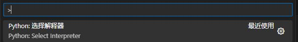

# OpenCV Python 1_环境配置

> 本笔记使用 Python 环境，旨在学习 OpenCV 算法本身。
>
> Python 适合学习算法，C++ 更适合实际部署。

[OpenCV - Open Computer Vision Library](https://opencv.org/)

## 0. OpenCV 简介

OpenCV（Open Source Computer Vision Library）是一个开源的计算机视觉库。

OpenCV 使用 C/C++ 开发，同时也提供了 Python、Java、MATLAB 等其他语言的接口。

OpenCV 是跨平台的，可以在 Windows、Linux、Mac OS、Android、iOS 等操作系统上运行。

OpenCV 的应用领域非常广泛，包括图像拼接、图像降噪、产品质检、人机交互、人脸识别、动作识别、动作跟踪、无人驾驶等。

OpenCV 还提供了机器学习模块，你可以使用正态贝叶斯、K最近邻、支持向量机、决策树、随机森林、人工神经网络等机器学习算法。

## 1. Python 环境配置

> C++ 的算力显著强于 Python，尤其是在工控机等算力要求较高的场合。（听说 Python 将数据进行缓存从而导致不及时处理数据）
>
> Python 通常用于前期算法的验证，后期可以将 Python 改写为 C++ 从而适应算力。 

（推荐使用Anaconda创建虚拟环境）

1. 安装Python环境或者Anaconda虚拟环境。
2. 下载 OpenCV Python 包

```shell
pip install opencv-python			# opencv-python 的基础功能包
pip install opencv-contrib-python	 # opencv-python 的基础和扩展功能包，如果上一行无法使用则使用此行
```

3. 在 VSCode 中按 F1 选择合适的解释器



选择安装有opencv python包的解释器即可。

4. 测试

```python
import numpy as np
import cv2

img = cv2.imread('test.jpg', cv2.IMREAD_UNCHANGED)
cv2.namedWindow('img', cv2.WINDOW_AUTOSIZE)
cv2.imshow('img', img)
cv2.waitKey(0)
```

