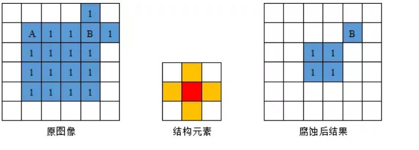
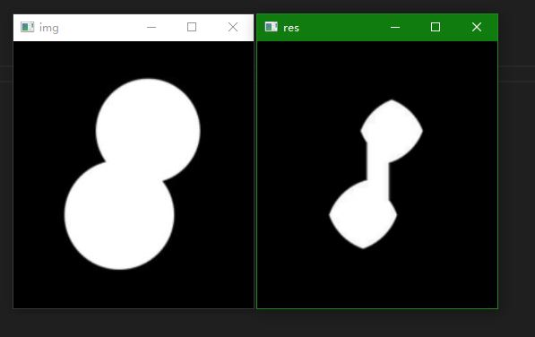
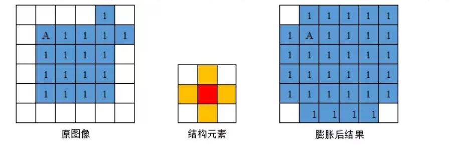
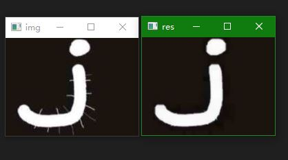
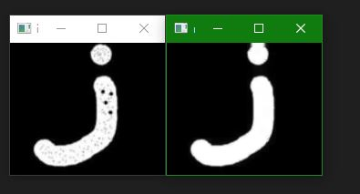
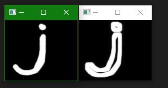
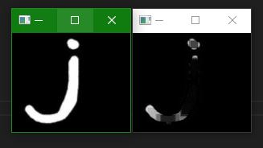
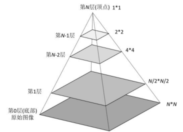

# OpenCV Python 4_图像处理

## 1. 颜色空间转换

OpenCV中使用`cv2.cvtColor()`函数转换颜色空间。

常用的颜色空间转换有BGR->Gray，BGR->HSV。

```python
"""
	颜色空间转换函数
	第一个参数：待转换图像
	第二个参数：转换方式，若为BGR->Gray，选择cv2.COLOR_BGR2Gray;若为BGR->HSV，选择cv2.COLOR_BGR2HSV
"""
cv2.cvtcolor()
```

### HSV 颜色空间

HSV是**色度（Hue）、饱和度（Saturation）和亮度（Value）的简写**，该模型通过这三个特性对颜色进行描述。

>色度是色彩的基本属性。
>
>饱和度是指颜色的纯度，饱和度越高色彩越纯越艳，饱和度越低色彩则逐渐地变灰变暗，饱和度的取值范围是由0到100%；
>
>亮度是颜色的明亮程度，其取值范围由0到计算机中允许的最大值。

在OpenCV中，H的范围从0到179，S的范围从0到255，V的范围从0到255。

HSV 对于颜色的追踪性质比较好。

### BGR 颜色空间

> B ---- 蓝色（第一通道）
> G ---- 绿色（第二通道）
> R ---- 红色（第三通道）

三个通道对于颜色描述的范围是相同的，因此BGR颜色模型的空间构成是一个立方体。

在BGR颜色模型中，所有的颜色都是由这三种颜色通过不同比例的混合得到，如果三种颜色分量都为0，则表示为黑色，如果三种颜色的分量相同且都为最大值，则表示为白色。

### 彩色图的阈值确定

使用`cv2.inRange()`函数可以限定图像素的有效值范围。常用于建立掩膜。

```python
"""
	用以确认元素值是否介于某个区域
	第一个参数：原图像
	第二个参数：指图像中低于lowerb的值，其所对应的图像值将为0；
	第三个参数：指图像中高于upperb的值，图像值变为0。
	源图像中仅有图像值介于lowerb和upperb之间的值才不为0，且值将变成255
"""
cv2.inRange(src, lowerb, upperb)
```

## 2. 几何变换

### 缩放变换

OpenCV 中的`cv2.resize()`可以实现缩放变换。

> 对于缩小，常使用`cv2.INTER_AREA`作为插值方法。
>
> 对于放大，常使用`cv2.INTER_CUBIC`或`cv2.INTER_LINEAR`作为插值方法。

```python
"""
	图像缩放函数
	第一个参数：原图像
	第二个参数：缩放后的图像尺寸（元组），若设置缩放因子此项为None
	第三/四个参数：横向/纵向缩放因子，若设置缩放后尺寸则此项不填。
	第五个参数：interpolation 插值方式
"""
cv2.resize()
```

```python
import cv2
import numpy as np

cap = cv2.VideoCapture(1)
cap.set(10,2)


while cap.isOpened() == True:
    ret,frame = cap.read()
    if ret == True:
        # 图像使用两倍放大的放大因子
        # img = cv2.resize(frame,None,fx = 2,fy = 2,interpolation=cv2.INTER_LINEAR)
        # 图像指定尺寸缩放
        height,width = frame.shape[:2]
        img = cv2.resize(frame,(2*width,2*height),interpolation=cv2.INTER_LINEAR)
        cv2.imshow('img',img)
        key = cv2.waitKey(1)
        if key == 27:
            break
    else:
        break

cv2.destroyAllWindows()
cap.release()
```

### 旋转/平移变换

矩阵的旋转可由以下方式得到：
$$
\left[\begin{matrix}
x^, \\ 
y^, \\
1
\end{matrix}\right]=
\left[
	\begin{matrix}
		1 & 0 & x_0 \\
		0 & 1 & y_0 \\
		0 & 0 & 1   
	\end{matrix}
\right]
\left[
	\begin{matrix}
		cos\theta & -sin\theta & 0 \\
		sin\theta & cos\theta & 0 \\
		0 & 0 & 1   
	\end{matrix}
\right]
\left[
	\begin{matrix}
		1 & 0 & -x_0 \\
		0 & 1 & -y_0 \\
		0 & 0 & 1   
	\end{matrix}
\right]
\left[\begin{matrix}
x \\ 
y \\
1
\end{matrix}\right]
$$
通过此方程可以构造出3*3的旋转矩阵（任一点）：

> 首先平移旋转中心到原点；
>
> 随后进行旋转；
>
> 最后平移旋转中心至原位。

舍弃最后一行即可得到旋转矩阵。
$$
M = \left[\begin{matrix}\alpha & \beta & (1-\alpha)*center.x-\beta*center.y \\-\beta & \alpha & \beta*center.x+(1-\alpha)*center.y\end{matrix}\right]
$$

​			式中，
$$
\alpha = scale*cos(angle)
$$

$$
\beta = scale*sin(angle)
$$

> 对于平移，使用以下的旋转矩阵
> $$
> M = \left[\begin{matrix}
> 	1 & 0 & \Delta x \\
> 	0 & 1 & \Delta y 
> \end{matrix}\right]
> $$

对于旋转矩阵，可以由`cv2.getRotationMatrix2D()`函数得到：

```python
"""
	旋转矩阵构造函数
	第一个参数：缩放中心
	第二个参数：旋转角度
	第三个参数：缩放因子
	返回值：M（2*3）
"""
cv2.getRotationMatrix2D(center, angle, scale)
```

使用求得的旋转矩阵，可以使用`cv2.warpAffrine()`方法进行图像旋转。

```python
"""
	图像旋转函数
	第一个参数：原图像
	第二个参数：旋转矩阵
	第三个参数：宽度和高度（元组）
	第四个参数：borderValue 填充颜色设置
"""
cv2.warpAffrine()
```

```python
import cv2
import math
import numpy as np

cap = cv2.VideoCapture(1)
cap.set(10, 2)
alpha = 45

while cap.isOpened() == True:
    ret, frame = cap.read()
    if ret == True:
        height, width = frame.shape[:2]
        x_0, y_0 = width/2, height/2
        # 旋转后窗口大小计算
        new_height = (height*math.cos(alpha/180 * math.pi)) + \
            (width*math.sin(alpha/180 * math.pi))
        new_width = (width*math.cos(alpha/180 * math.pi)) + \
            (height*math.sin(alpha/180 * math.pi))
        # 平移
        N = np.zeros((2, 3), np.float32)
        N[0, 0] = 1
        N[1, 1] = 1
        N[0, 2] = new_width/2 - x_0
        N[1, 2] = new_height/2 - y_0
        img = cv2.warpAffine(frame, N, (int(new_width), int(new_height)))
        # 构建旋转矩阵并进行旋转
        M = cv2.getRotationMatrix2D(
            (int(new_width)/2, int(new_height)/2), alpha, 1.0)
        res = cv2.warpAffine(img, M, (int(new_width), int(new_height)))

        cv2.imshow('res', res)
        key = cv2.waitKey(1)
        if key == 27:
            break
    else:
        break

cv2.destroyAllWindows()
cap.release()
```

### 仿射变换

**图像中的平行关系、面积比、共线线段或平行线段的长度比、矢量的线性组合不变**。
$$
\left[\begin{matrix}x^, \\ y^, \\1\end{matrix}\right]=
M_A
\left[\begin{matrix}x \\ y \\1\end{matrix}\right]
$$
$M_A$为仿射变换矩阵。有六个未知参数，可以由图像中三点坐标和对应的变换后三点坐标得到。

```python
"""
	仿射变换矩阵函数
	第一个参数：原图中的三个点（矩阵）
	第二个参数：变换后的对应三点
	返回值：仿射变换矩阵（2*3）
"""
cv2.getAffineTransform(pts1, pts2)
```

```python
import cv2
import numpy as np

img = cv2.imread('img.jpg',cv2.IMREAD_COLOR)
height,width = img.shape[:2]

pts1 = np.array([[50,50],[100,20],[20,100]],np.float32)
pts2 = np.array([[10,10],[90,5],[5,90]],np.float32)

M = cv2.getAffineTransform(pts1,pts2)
res = cv2.warpAffine(img,M,(width,height))

while True:
    cv2.imshow('res',res)
    key = cv2.waitKey(1)
    if key == 27:
        break

cv2.destroyAllWindows()
```

### 透视/投影变换

投影变换（Projective mapping）也称透视变换（Perspective transformation）是建立两平面场之间的对应关系， 将**图片投影到一个新的视平面（Viewing plane）**。

```python
"""
	透视变换矩阵函数
	第一个参数：四边形顶点坐标（原图）
	第二个参数：四边形顶点坐标（变换）
	第三个参数：矩阵分解方法
		cv2.DECOMP_LU：选择最优轴的高斯消去法，默认方法
		cv2.DECOMP_SVD：奇异值分解（SVD）方法
		cv2.DECOMP_EIG：特征值分解方法，src 必须对称
		cv2.DECOMP_QR：QR（正交三角）分解
		cv2.DECOMP_CHOLESKY：Cholesky LLT 分解
	返回值：透视变换矩阵（3*3）
"""
cv2.getPerspectiveTransform(src, dst[,solveMethod])
```

```python
"""
	透视变换函数
	第一个参数：图像
	第二个参数：透视变换矩阵
	第三个参数：输出图像大小
	第四个参数：flags 插值方法
		cv2.INTER_LINEAR：线性插值，默认选项
		cv2.INTER_NEAREST：最近邻插值
		cv2.INTER_AREA：区域插值
		cv2.INTER_CUBIC：三次样条插值
		cv2.INTER_LANCZOS4：Lanczos 插值
"""
cv2.warpPerspective()
```

## 3. 图像二值化(Thresh)

### 简单阈值

$$
Binary(x,y)=\begin{cases}
maxval &  src(x,y)>thresh\\
0 & otherwise
\end{cases}\\
Binary\__{INV}(x,y)=\begin{cases}
0 & src(x,y)>thresh\\
maxval & otherwise
\end{cases}
$$


像素值高于设定阈值时设置为白色（黑色），低于阈值时设置为黑色（白色）。

```python
"""
	二值化函数
	第一个参数：原图像
	第二个参数：阈值
	第三个参数：二值化最大值
	第四个参数：二值化方法（简单阈值方法为cv2.THRESH_BINARY_INV,cv2.THRESH_BINARY）
	返回值：元组，第二个元素为处理后图像
"""
cv2.threshold()
```

### 自适应阈值

自适应阈值算法的核心是将图像分割为不同的区域，每个区域都计算阈值。在背景明暗有差别时可以有效使用。

```python
"""
	自适应二值化函数
	第一个参数：原图像
	第二个参数：二值化最大值
	第三个参数：自适应方法
		ADAPTIVE_THRESH_MEAN_C，为局部邻域块的平均值，该算法是先求出块中的均值。			ADAPTIVE_THRESH_GAUSSIAN_C，为局部邻域块的高斯加权和。该算法是在区域中(x, y)周围的像素根据高斯函数按照他们离中心点的距离进行加权计算。
	第四个参数：简单阈值二值化
	第五个参数：要分成的区域大小，一般取奇数。大图像127左右，小图像25左右
	第六个参数：C，每个区域计算出的阈值的基础上在减去这个常数作为这个区域的最终阈值，取值一般取10/15/25
	返回值：元素为处理后图像
"""
cv2.adaptiveThreshold(src, maxValue, adaptiveMethod, thresholdType, blockSize, C, dst=None)
```

### 基于直方图的阈值

- OTSU（大津法）

OTSU算法对**直方图有两个峰**，中间有明显波谷的直方图对应图像二值化效果比较好，而对于只有一个单峰的直方图对应的图像分割效果没有双峰的好。

OTSU是通过计算类间最大方差来确定分割阈值的阈值选择算法，它的原理是不断地求前景和背景的类间方差。

OTSU定义为`cv2.THRESH_OTSU` 。此时，`cv2.threshold()`函数返回的元组第一个值为求得的全局阈值。

- TRIANGLE（三角形法）

直方图有一个波峰时使用三角形法效果较好。

TRIANGLE定义为`cv2.TRIANGLE`。

**大津法和三角形法一般配合简单阈值使用。**

```python
cap = cv2.VideoCapture(1)
cap.set(10, 2)

while cap.isOpened() == True:
    ret, frame = cap.read()
    if ret == True:
        img = cv2.cvtColor(frame, cv2.COLOR_BGR2GRAY)
        # 大津法二值化
        ## retval, res = cv2.threshold(
        ##     img, 0, 255, cv2.THRESH_BINARY+cv2.THRESH_OTSU)
        
        # 三角形法二值化
        retval, res = cv2.threshold(
            img, 0, 255, cv2.THRESH_BINARY+cv2.THRESH_TRIANGLE)
        cv2.imshow('res', res)
        key = cv2.waitKey(1)
        if key == 27:
            break
    else:
        break

cv2.destroyAllWindows()
cap.release()
```

## 4. 图像滤波(Filter)

### 图像的2D卷积

和一维信号类似，可以对2D图片进行卷积。

**低通滤波（LPF）**：去除图像的噪声，使图像模糊。

**高通滤波（HPF）**：提取边缘。

### 自定义滤波

使用`CV2.filter2D()`函数可以自定义滤波器。卷积运算时，将对卷积核内的每个像素做加权平均，将结果赋值给中心像素。

```python
"""
	自定义滤波函数
	第一个参数：滤波图像
	第二个参数：结果通道数（深度），使用-1使得结果和原图通道一致
	第三个参数：卷积核
"""
CV2.filter2D()
```

```python
import cv2
import numpy as np

cap = cv2.VideoCapture(1)
cap.set(10, 2)

# 卷积核创建
kernel = np.ones((5, 5), np.float32)/25

while cap.isOpened() == True:
    ret, frame = cap.read()
    if ret == True:
        res = cv2.cvtColor(frame, cv2.COLOR_BGR2GRAY)
        # 一般而言，先进行降噪操作，然后再二值化
        res = cv2.filter2D(res, -1, kernel)
        res = cv2.adaptiveThreshold(
            res, 255, cv2.ADAPTIVE_THRESH_GAUSSIAN_C, cv2.THRESH_BINARY, 25, 10)

        cv2.imshow('res', res)
        key = cv2.waitKey(1)
        if key == 27:
            break
    else:
        break

cv2.destroyAllWindows()
cap.release()
```

### 均值滤波

均值滤波由归一化卷积框完成。

均值滤波将滤波器内所有的像素值都看作中心像素值的测量，将滤波器内所有的像数值的平均值作为滤波器中心处图像像素值。

**优点**：在像素值变换趋势一致的情况下，可以将受噪声影响而突然变化的像素值修正到接近周围像素值变化的一致性下。

**缺点**：缩小像素值之间的差距，使得细节信息变得更加模糊，滤波器范围越大，变模糊的效果越明显。

```python
"""
	均值滤波函数
	第一个参数：原图片
	第二个参数：卷积核大小，元组
"""
cv2.blur()
"""
	方框滤波函数：舍去归一化流程，直接进行像素求和
	第一个参数：原图片
	第二个参数：卷积核大小，元组
	第三个参数: normalize 取 False
"""
cv2.boxFilter()
```

```python
import cv2
import numpy as np

cap = cv2.VideoCapture(1)
cap.set(10, 2)

while cap.isOpened() == True:
    ret, frame = cap.read()
    if ret == True:
        frame = cv2.cvtColor(frame, cv2.COLOR_BGR2GRAY)
        # 均值滤波
        frame = cv2.blur(frame, (5, 5))
        # 方框滤波
        # frame = cv2.boxFilter(frame,-1,(5,5),normalize=False)
        res,frame = cv2.threshold(frame, 0, 255, cv2.THRESH_BINARY+cv2.THRESH_OTSU)
        cv2.imshow('res',frame)
        key = cv2.waitKey(1)
        if key == 27:
            break
    else:
        break

cv2.destroyAllWindows()
cap.release()
```

### 高斯滤波

高斯噪声是一种常见的噪声，图像采集的众多过程中都容易引入高斯噪声，因此针对**高斯噪声**的高斯滤波也广泛应用于图像去噪领域。

高斯滤波器考虑了像素离滤波器中心距离的影响，以滤波器中心位置为高斯分布的均值，根据高斯分布公式和每个像素离中心位置的距离计算出滤波器内每个位置的数值，从而形成一个高斯滤波器。

```python
"""
	高斯滤波函数
	第一个参数：原图像
	第二个参数：卷积核大小，元组
	第三个参数：高斯函数标准差，一般取0
"""
cv2.GaussianBlur()
```

### 中值滤波

中值滤波将滤波器范围内所有的像素值按照由小到大的顺序排列，选取排序序列的中值作为滤波器中心处像素的新像素值，之后将滤波器移动到下一个位置，重复进行排序取中值的操作，直到将图像所有的像素点都被滤波器中心对应一遍。

中值滤波不依赖于滤波器内那些与典型值差别很大的值，因此对**斑点噪声**和**椒盐噪声**的处理具有较好的处理效果。

```python
"""
	中值滤波函数
	第一个参数：原图像
	第二个参数：卷积核大小
"""
cv2.medianBlur()
```

### 双边滤波

双边滤波是一种综合考虑滤波器内图像空域信息和滤波器内图像像素灰度值相似性的滤波算法，可以实现在保留区域信息的基础上实现对噪声的去除、对局部边缘的平滑。双边滤波对高频率的波动信号起到平滑的作用，同时保留大幅值的信号波动，进而实现对**保留图像中边缘信息的作用**。

空间高斯函数保证邻近区域的像素对中心点有影响。

灰度值相似性高斯函数保证只有与中心灰度值相似的像素能够进行运算。

```python
"""
	双边滤波函数
	第一个参数：原图像
	第二个参数：滤波器大小 当滤波器的直径大于5时，函数的运行速度会变慢，因此如果需要在实时系统中使用该函数，建议将滤波器的半径设置为5，对于离线处理含有大量噪声的滤波图像时，可以将滤波器的半径设为9，当滤波器半径为非正数的时候，会根据空间滤波器的标准差计算滤波器的直径。
	第三/四个参数：空间/灰度值高斯函数标准差 一般将两个参数设置成相同的数值，当小于10时，滤波器对图像的滤波作用较弱，当大于150时滤波效果会非常的强烈。
"""
cv2.bilateralFilter()
```

## 5. 形态学转换(Morphology)

形态学转换是根据图像形状进行的简单操作，一般对二值化的图像进行操作。

> 现有的图像处理流程：转换颜色空间 -> 滤波 -> 二值化 -> 形态学转换。

基本的形态学操作：**图像腐蚀**和**图像膨胀**。

### 图像的腐蚀

图像的腐蚀过程与图像的卷积操作类似，都需要模板矩阵来控制运算的结果，在图像的腐蚀和膨胀中这个模板矩阵被称为**结构元素**。



定义结构元素之后，将结构元素的中心点依次放到图像中每一个非0元素处，**如果此时结构元素内所有的元素所覆盖的图像像素值均不为0，则保留结构元素中心点对应的图像像素**，否则将删除结构元素中心点对应的像素。

腐蚀操作后，前景图像会减少，白色区域会变小。一般情况下，结构元素的种类相同时，结构元素的尺寸越大腐蚀效果越明显。

**腐蚀常用于去除白噪声，也可断开两个物体间的连接。**

```python
"""
	图像腐蚀函数
	第一个参数：原图像
	第二个参数：卷积核（结构元素）
	第三个参数：iterations 腐蚀操作迭代的次数
"""
cv2.erode()
```



```python
import cv2
import numpy as np

img = cv2.imread('1.jpg',cv2.IMREAD_COLOR)

# 结构元素定义
kernel = np.ones((9,9),np.uint8)

while True:
    res = cv2.erode(img,kernel,iterations=5)
    cv2.imshow('res',res)
    cv2.imshow('img',img)
    key = cv2.waitKey(1)
    if key == 27:
        break
    
cv2.destroyAllWindows()
```

### 图像的膨胀

定义结构元素之后，将结构元素的中心点依次放到图像中每一个非0元素处，**如果原图像中某个元素被结构元素覆盖，但是该像素的像素值不与结构元素中心点对应的像素点的像素值相同，那么将原图像中的该像素的像素值修改为结构元素中心点对应点的像素值。**



```python
"""
	图像膨胀函数
	第一个参数：原图像
	第二个参数：卷积核（结构元素）
	第三个参数：iterations 膨胀操作迭代的次数
"""
cv2.dilate()
```


### 开运算

先腐蚀再膨胀即为开运算。

**开运算用于去除图像的白噪声。**

```python
"""
	开运算函数
	第一个参数：图像
	第二个参数：形态学操作参数 cv2.MORPH_OPEN
	第三个参数：结构元素
"""
cv2.morphologyEx()
```



### 闭运算

先膨胀再腐蚀即为闭运算。

**闭运算用于填充前景物体上的小洞或黑点。**

```python
"""
	闭运算函数
	第一个参数：图像
	第二个参数：形态学操作参数 cv2.MORPH_CLOSE
	第三个参数：结构元素
"""
cv2.morphologyEx()
```



### 形态学梯度

膨胀图像减去腐蚀图像，类似于图像的轮廓。

```python
"""
	形态学梯度函数
	第一个参数：图像
	第二个参数：形态学操作参数 cv2.MORPH_GRADIENT
	第三个参数：结构元素
"""
cv2.morphologyEx()
```



### 礼帽

原始图像和开运算的差。

```python
"""
	礼帽函数
	第一个参数：图像
	第二个参数：形态学操作参数 cv2.MORPH_TOPHAT
	第三个参数：结构元素
"""
cv2.morphologyEx()
```



### 黑帽

原始图像和闭运算的差。

```python
"""
	黑帽函数
	第一个参数：图像
	第二个参数：形态学操作参数 cv2.MORPH_BLACKHAT
	第三个参数：结构元素
"""
cv2.morphologyEx()
```


### 关于结构元素

使用`cv2.getStructuringElement()`创建结构化元素。

```python
"""
	结构化元素创建函数
	第一个参数：结构元素形态 cv2.MORPH_RECT(矩形)  cv2.MORPH_ELLIPSE(椭圆)  cv2.MORPH_CROSS(十字)
	第二个参数：结构元素大小
"""
cv2.getStructuringElement()
```

## 6. 图像梯度

图像的梯度就是对两个像素求导数，是边缘检测的前提。

Sobel 算子和 Scharr 算子为求一阶或二阶导数，Scharr 算子为对 Sobel 算子的优化。Laplacian 算子为求二阶导数。 

### Sobel 算子和 Scharr 算子

Sobel 算子为高斯平滑和微分操作的结合，抗噪声能力强。可以设定求导的方向（xorder 和    yorder）和卷积核大小（ksize）。

`ksize = -1` 时使用 Scharr 算子作为滤波器，效果更好。

Scharr 算子卷积核如下：
$$
\Delta src = \left[\begin{matrix}
-3 & 0 & 3 \\
-10 & 0 & 10 \\
-3 & 0 & 3
\end{matrix}\right]
$$

### Laplacian 算子

Laplacian 算子使用二阶导数定义：
$$
\Delta src = \left[\begin{matrix}0 & 1 & 0 \\1 & -4 & 1 \\0 & 1 & 0\end{matrix}\right]
$$

```python
"""
	图像梯度Sobel算子函数：
	第一个参数：原图像
	第二个参数：图像通道数，默认为-1
	第三，四个参数：求导方向
	第五个参数：ksize 卷积核大小
"""
cv2.Sobel()

"""
	图像梯度Laplacian算子函数：
	第一个参数：原图像
	第二个参数：图像通道数，默认为-1.
"""
cv2.Laplacian()
```

## 7. Canny 边缘检测

Canny 边缘检测是一种流行的边缘检测算法。

**第一步：噪声去除**

使用5×5的高斯滤波器进行滤波。

**第二步：计算图像梯度**

使用 Sobel 算子计算水平和竖直方向的一阶导数，根据图像的梯度图找到边界的梯度和方向，图像的梯度方向总与边界垂直。

**第三步：非极大值抑制**

获得梯度的方向和大小之后，对整幅图像进行扫描，去除非边界点，对每一个像素进行检查，检查此点梯度值是否为同向最大值。

**第四步：滞后阈值**

设置小阈值`minVal`和大阈值`maxVal`。

1. 高于`maxVal`的点为真边界点；
2. 低于`minVal`的点被舍弃；
3. 若在`maxVal`和`minVal`之间，如果这个点和确定的边界点相连，会被认为为真边界点。

```python
"""
	Canny 边缘检测算法：
	第一个参数：输入图像
	第二个参数：滞后阈值最小值
	第三个参数：滞后阈值最大值
	第四个参数：卷积核大小，默认为3
	第五个参数：L2gradient 选择梯度方程，一般为False
"""
cv2.Canny()
```

```python
import cv2
import numpy as np

cap = cv2.VideoCapture(1)
cap.set(10,2)
cv2.namedWindow('image')

def trackbar_callback():
    pass

cv2.createTrackbar('minVal','image',0,255,trackbar_callback)
cv2.createTrackbar('maxVal','image',0,255,trackbar_callback)

while cap.isOpened():
    ret,frame = cap.read()
    if ret == True:
        frame = cv2.cvtColor(frame,cv2.COLOR_BGR2GRAY)
        minVal = cv2.getTrackbarPos('minVal','image')
        maxVal = cv2.getTrackbarPos('maxVal','image')
        res = cv2.Canny(frame,float(minVal),float(maxVal))
        cv2.imshow('image',res)
        key = cv2.waitKey(1)
        if key == 27:
            break
    else:
        break

cv2.destroyAllWindows()
cap.release()
```

## 8. 图像金字塔（Pyramid）

当处理同一目标的不同分辨率的图像时，需要制作一组图像，构成同一图像的不同分辨率的子图集合，这个集合即为图像金字塔。

通常将大尺寸高分辨率图像放在金字塔底端，而小尺寸低分辨率图像放在金字塔顶端。

### 高斯金字塔



**下采样**

当下采样向上生成金字塔图像时，是直接删除偶数行偶数列的操作，但这种操作意味着直接丢弃图像中的信息。

为了减轻图像信息的丢失，在下采样操作之前先用滤波器对原始图像滤波操作一遍，这样滤波后的图像就是原始图像的近似图像，此时再删偶数行偶数列，就没有直接的信息损失了。

对原始图像进行滤波操作有很多方法，比如用**邻域滤波器**进行操作，这样生成的图像就是**平均金字塔**。如果用**高斯滤波器**处理，生成的是**高斯金字塔**。

```python
"""
	下采样函数：尺寸变小，分辨率降低
"""
cv2.pyrDown()
```

**上采样**

当上采样向下生成图像金字塔时，直接右插入列下插入行操作，这种操作会生成大量的0值像素点，这些0值像素点毫无意义，就需要对0值像素点进行赋值。

赋值就是**插值处理**。插值处理也有很多方法，比如用**区域均值补充**，那生成的就是**平均金字塔**，如果用**高斯核填充**就是**高斯金字塔**。

```python
"""
	上采样函数：尺寸变大，分辨率不会升高
"""
cv2.pyrDown()
```

### 拉普拉斯金字塔

$$
L_i = G_i - PyrUp(G_{i+1})
$$

拉普拉斯金字塔看起来像边界图像。

拉普拉斯金字塔的作用就在于能够恢复图像的细节，提取特征后还能通过拉普拉斯金字塔数据找回高层像素点对应的底层清晰度更高的图像，就是返回来找到更多图像的细节。

拉普拉斯金字塔更多的用于图像压缩。


