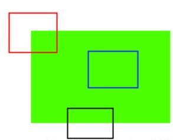
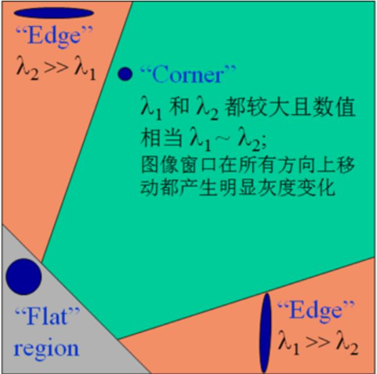
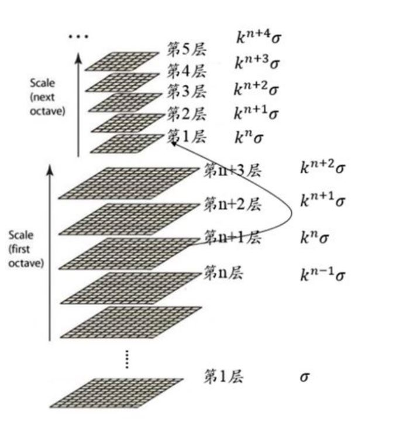

# OpenCV Python 8_图像特征

图像的特征必须要使得计算机可以识别（比如角点）。

从图像中找到包含特征的区域，向不同方向移动图像会产生很大变化，这种方法称为特征检测。在其他图像中如果要寻找相同特征，需要先对周围区域进行特征描述，然后才能找到相同的特征。

## 1. Harris 角点检测

### Harris 角点检测原理



对于上图而言，红框框住的是角点，蓝框框住的是平凡面，黑框框住的是边界。角点是图像中最容易被发现的特征。

**角点检测：**使用一个固定的窗口在图像上进行任意方向上的滑动，比较滑动前与滑动后两种情况，窗口中的像素灰度变化程度，***如果存在任意方向上的滑动，都有着较大的灰度变化***，那么我们可以认为该窗口中存在角点。

首先用数学表达式表达像素灰度值在窗口移动时产生的变化：
$$
E(u,v) = \sum_{(u,v)}w(u,v)(I(u,v) - I(u+\Delta x,v + \Delta y))^2
$$
式中$w(u,v)$表示以$(u,v)$为窗口中心的窗口对应的窗口（加权）函数，$(\Delta x,\Delta y)$为窗口移动的大小。

> 简单的，可以使用
> $$
> w = \left [
> \begin{matrix}
> 1 & 1 & 1 \\
> 1 & 1 & 1 \\
> 1 & 1 & 1 \\
> \end{matrix}
> \right ]
> $$
> 此时，权重系数均为1；
>
> 但是更常用的是以窗口中心为原点的二元正态分布：
> $$
> w = \left[
> \begin{matrix}
> 1 & 2 & 1 \\
> 2 & 4 & 2 \\
> 1 & 2 & 1
> \end{matrix}
> \right ]
> $$
> 如果窗口中心点是角点时，移动前与移动后，该点的灰度变化应该最为剧烈，表示窗口移动时，该点在灰度变化贡献较大；离窗口中心(角点)较远的点，这些点的灰度变化几近平缓，以示该点对灰度变化贡献较小。

由泰勒公式：
$$
I(u+\Delta x,v + \Delta y) - I(u,v) = I_x(u,v)\Delta x + I_y(u,v)\Delta y \\
E(u,v) = \sum_w(I_x(u,v)\Delta x + I_y(u,v)\Delta y)^2 = [\Delta x,\Delta y]M(u,v)\left [\begin{matrix}\Delta x \\ \Delta y \end{matrix} \right]
\\
M(u,v) = \left[ \begin{matrix} 
\sum I_x^2 & \sum I_xI_y \\
\sum I_xI_y & \sum I_y^2
\end{matrix} \right]
$$
此时$E(u,v)$为二次型，为一个椭圆函数。将$M(u,v)$相似对角化：
$$
M(u,v) \sim \left[ \begin{matrix} 
\lambda_1 & \\
& \lambda_2
\end{matrix} \right]
$$
使用以下指标进行打分：
$$
R = det(M) - k(trace(M))^2
$$

> 在指标$R$中：
>
> - 若为平坦区域，则$|R|$比较小；
> - 若为边界区域，则$\lambda_2 >> \lambda_1$或$\lambda_1 >> \lambda_2$，则$R < 0$。
> - 若为边界区域，则$\lambda_2$和$\lambda_1$都比较大，$R$很大。



在Harris角点检测后生成一张角点检测图像。这样选出的角点可能会在某一区域特别多，并且角点窗口相互重合，为了能够更好地通过角点检测追踪目标，需要进行非极大值抑制操作。

选取适当的阈值进行二值化可得角点。

**Harris 检测器具有旋转不变性，但不具有尺度不变性，也就是说尺度变化可能会导致角点变为边缘。**

### OpenCV 的 Harris 角点检测

```python
"""
	Harris 角点检测函数
	第一个参数：图像，应为np.float32类型
	第二个参数：角点检测窗口大小
	第三个参数：Sobel算子卷积核大小
	第四个参数：R值公式中的k，取0.04到0.06的值
"""
cv2.cornerHarris()
```

```python
import cv2
import numpy as np

cap = cv2.VideoCapture(1)
cap.set(10, 2)

while cap.isOpened() == True:
    ret, frame = cap.read()
    if ret == True:
        gray = cv2.cvtColor(frame, cv2.COLOR_BGR2GRAY)
        gray = np.float32(gray)

        dst = cv2.cornerHarris(gray, 2, 3, 0.04)
        dst = cv2.dilate(dst, None)

        frame[dst > 0.01*(dst.max())] = [0, 0, 255]
        cv2.imshow('res', frame)
        key = cv2.waitKey(1)
        if key == 27:
            break
    else:
        break

cv2.destroyAllWindows()
cap.release()
```

### OpenCV 亚像素级的角点检测

```python
import cv2
import numpy as np

cap = cv2.VideoCapture(1)
cap.set(10, 2)

while cap.isOpened() == True:
    ret, frame = cap.read()
    if ret == True:
        gray = cv2.cvtColor(frame, cv2.COLOR_BGR2GRAY)
        gray = np.float32(gray)

        # 第一步：角点检测
        dst = cv2.cornerHarris(gray, 2, 3, 0.04)
        # 第二步：将检测到的角点进行膨胀操作
        dst = cv2.dilate(dst, None)

        # frame[dst > 0.01*(dst.max())] = [0, 0, 255]
        # 第三步：二值化角点图像，使用0.01倍最大值进行过滤
        res, dst = cv2.threshold(dst, (0.01*dst.max()), 255, cv2.THRESH_BINARY)
        dst = np.uint8(dst)

        # 第四步：取连通角点的质心进行修正
        res, labels, stats, centroids = cv2.connectedComponentsWithStats(dst)

        # 第五步：定义停止条件(迭代最近点算法的终止条件)
        """
            cv2.TERM_CRITERIA_EPS 指定收敛准则的epsilon值,即允许两点之间存在的最大差异。
            cv2.TERM_CRITERIA_MAX_ITER 指定算法允许的最大迭代次数,以便其收敛。如果在这么多的迭代次数内算法没有收敛,它将停止并返回当前的最佳解决方案。
            100 指定算法允许的最大迭代次数以使其收敛。在这种情况下,如果算法在100次迭代后仍未收敛,它将停止。
            0.01 指定收敛准则的容差级别。这意味着如果两个点之间的差异小于或等于0.01,它们将被视为相同。
        """
        criteria = (cv2.TERM_CRITERIA_EPS +
                    cv2.TERM_CRITERIA_MAX_ITER, 100, 0.01)

        # 第六步：
        corners = cv2.cornerSubPix(gray, np.float32(centroids),
                                   (5, 5), (-1, -1), criteria)
        result = np.hstack((centroids, corners))
        
        result = np.int0(result)
        frame[result[:, 1], result[:, 0]] = [0, 0, 255]
        frame[result[:, 3], result[:, 2]] = [0, 255, 0]

        cv2.imshow('res', frame)
        key = cv2.waitKey(1)
        if key == 27:
            break
    else:
        break

cv2.destroyAllWindows()
cap.release()
```

```python
"""
	检测和标记二值图像中的连通区域
	第一个参数：图像
	返回值：	  retval 输出标签矩阵，其中每个连通区域的标签从1开始。
				labels 输出的连通区域标签矩阵。
				stats  输出的连通区域统计信息矩阵，包括面积、质心等。
				centroids 输出的连通区域质心矩阵。
"""
cv2.connectedComponentsWithStats()
```

```python
"""
	进行形态学图像处理，以提高图像中角点检测的准确性
	第一个参数：图像
	第二个参数：角点质心坐标
	第三个参数：角点检测窗口大小
	第四个参数：形态学操作的卷积核大小
	第五个参数：迭代停止条件
	返回值：检测到的角点的坐标的数组
"""
cv2.cornerSubPix()
"""
    cv2.TERM_CRITERIA_EPS 指定收敛准则的epsilon值,即允许两点之间存在的最大差异。
    cv2.TERM_CRITERIA_MAX_ITER 指定算法允许的最大迭代次数,以便其收敛。如果在这么多的迭代次数内算法没有收敛,它将停止并返回当前的最佳解决方案。
    100 指定算法允许的最大迭代次数以使其收敛。在这种情况下,如果算法在100次迭代后仍未收敛,它将停止。
    0.01 指定收敛准则的容差级别。这意味着如果两个点之间的差异小于或等于0.01,它们将被视为相同。
"""
criteria = (cv2.TERM_CRITERIA_EPS +cv2.TERM_CRITERIA_MAX_ITER, 100, 0.01)
```

### Shi-Tomasi 角点检测

改进后的角点打分函数：
$$
	R = min(\lambda_1,\lambda_2)
$$


只有进入紫色区域$(\lambda_1,\lambda_2)$很大时,才能认为是角点。

```python
import cv2
import numpy as np

cap = cv2.VideoCapture(0)
cap.set(10, 2)

while cap.isOpened() == True:
    ret, frame = cap.read()
    if ret == True:
        gray = cv2.cvtColor(frame, cv2.COLOR_BGR2GRAY)
        gray = np.float32(gray)

        # shi-tomasi 角点检测
        corners = cv2.goodFeaturesToTrack(gray, 100, 0.01, 10)

        # 返回一个两层数组
        corners = np.intp(corners)
        for i in corners:
            x, y = i.ravel()
            cv2.circle(frame, (x, y), 3, 255, -1)

        cv2.imshow('res', frame)
        key = cv2.waitKey(1)
        if key == 27:
            break
    else:
        break

cv2.destroyAllWindows()
cap.release()
```

```python
"""
	角点检测函数
	第一个参数：灰度图（32位浮点型）
	第二个参数：角点个数（希望的）
	第三个参数：图像角点的最小可接受参数，质量测量值乘以这个参数就是最小特征值，小于这个数的会被抛弃。
	第四个参数：返回的角点之间最小的欧式距离。
	返回值：数组索引（双层数组，需要进行遍历提取）
"""
cv2.goodFeaturesToTrack()
```

## 2. SIFT 关键点检测

### 图像金字塔和尺度空间变换

#### 高斯金字塔的含义

人眼对图像的感知有以下特点：

1. 近大远小：同一物体，近处看时感觉比较大，远处看时感觉比较小；
2. 模糊：更准确说应该是"粗细"，看近处可以看到物体的细节，远处看只能看到该片的大概轮廓. 从频率的角度出发，图像的细节(比如纹理，轮廓等)代表图像的高频成分，图像较平滑区域表示图像的低频成分.

高斯金字塔实际上是一种**图像的尺度空间**，尺度的概念用来模拟观察者距离物体的远近程度，在模拟物体远近的同时，还得考虑物体的粗细程度.

**图像的尺度空间是模拟人眼看到物体的远近程度以及模糊程度。**

> 上/下采样方式（插值）模拟了物体的远近程度；高斯/拉普拉斯滤波器模拟模糊程度。

#### SIFT高斯金字塔构建

1. 对图像进行上采样，首先进行扩大，随后使用高斯滤波器进行卷积计算：
   $$
   G(x,y) = \frac{1}{2\pi\sigma^2}exp(-\frac{(x-x_0)^2+(y-y_0)^2}{2\sigma^2})
   $$
   $\sigma$在SIFT算子中通常取1.6。

2. 再次进行下采样，此时使用的高斯滤波器会乘以一个新的平滑因子$\sigma = k^2\sigma$，

3. 重复以上操作，得到一个组中的$L$层图像，在同一组中，每一层图像的尺寸都是一样的，只是平滑系数不一样。

4. 将第一组的倒数图像下采样，作为第二组第一层图像。重复以上操作，得到O组金字塔。
	$$
	O = log_2min(M,N)-3
	$$
	M 为原始图像的行高；N 为原始图像的列宽；O 为图像高斯金字塔的组数.
	
	高斯模糊系数如上图所示。

#### SIFT 高斯差分金字塔（DOG）构建

DOG金字塔的第1组第1层是由高斯金字塔的第1组第2层减第1组第1层得到的。以此类推，逐组逐层生成每一个差分图像，所有差分图像构成差分金字塔。

DOG金字塔的第$O$组第$I$层图像是有高斯金字塔的第$O$组第$I+1$层减第$O$组第$I$层得到的。

### 极值点定位

1. 阈值化滤除噪点；
2. 特征点是由DOG空间的局部极值点组成的。为了寻找DOG函数的极值点，每一个像素点要和它所有的相邻点比较，看其是否比它的**图像域和尺度域**的相邻点大或者小。
>  如果高斯差分金字塔每组有N层，则只能在中间N-2层图像寻 找极值点，两端的图像不连续，没有极值点.

3. 使用泰勒展开求得亚像素精度的极值点。

> 在极值点处进行三元泰勒展开
> $$
> f(\left[\begin{matrix}x \\ y \\ \sigma \end{matrix}\right]) = f(\left[\begin{matrix}x_0 \\ y_0 \\ \sigma_0 \end{matrix}\right])+
> \left[\begin{matrix}\frac{\partial f}{\partial x} & \frac{\partial f}{\partial y} & \frac{\partial f}{\partial \sigma} \end{matrix}\right](\left[\begin{matrix}x \\ y \\ \sigma \end{matrix}\right]-\left[\begin{matrix}x_0 \\ y_0 \\ \sigma_0 \end{matrix}\right])+\frac{1}{2}(\left[\begin{matrix}x \\ y \\ \sigma \end{matrix}\right]-\left[\begin{matrix}x_0 \\ y_0 \\ \sigma_0 \end{matrix}\right])^T\left[\begin{matrix}\frac{\partial^2 f}{\partial x\partial x} & \frac{\partial^2 f}{\partial x\partial y}&\frac{\partial^2 f}{\partial x\partial \sigma} \\ \frac{\partial^2 f}{\partial x\partial y} & \frac{\partial^2 f}{\partial y\partial y} & \frac{\partial^2 f}{\partial y\partial \sigma} \\ \frac{\partial^2 f}{\partial x\partial \sigma} & \frac{\partial^2 f}{\partial y\partial \sigma} & \frac{\partial^2 f}{\partial \sigma\partial \sigma} \end{matrix}\right](\left[\begin{matrix}x \\ y \\ \sigma \end{matrix}\right]-\left[\begin{matrix}x_0 \\ y_0 \\ \sigma_0 \end{matrix}\right]) \\
> f(X) = f(X_0)+\frac{\partial f^T}{\partial X}\hat{X} + \frac{1}{2}\hat{X}^T\frac{\partial ^2f}{\partial X^2}\hat{X} \\
> \frac{\partial f}{\partial X} = \frac{\partial f^T}{\partial X}+\frac{\partial ^2f}{\partial X^2}\hat{X} \\ 
> \to \hat{X} = -\frac{\partial ^2f^{-1}}{\partial X^2}\frac{\partial f}{\partial X} \\
> \to f(X) = f(X_0)+\frac{1}{2}\frac{\partial f^T}{\partial X}\hat{X}
> $$
> 上述求解达到一定精度时迭代停止。

4. 舍去低对比度的极值点（灰度值小于0.03倍的阈值）
5. 去除边界点

> 去掉DOG局部曲率非常不对称的像素。一个高斯差分算子的极值在横跨边缘的地方有较大的主曲率，而在垂直边缘的方向有较小的主曲率。
>
> 主曲率通过一个2×2的黑塞矩阵$\bold{H}$求出，D的主曲率和H的特征值成正比，令$\alpha$为较大特征值，$\beta$为较小的特征值。
> $$
> H(x,x) = \left[\begin{matrix}D_{xx} & D_{xy} \\
> 							 D_{yx} & D_{yy}	\end{matrix}\right] \\ 
> Tr(H) = D_{xx} + D_{yy} = \alpha + \beta \\
> |H| = \alpha\beta \\
> \alpha = \gamma\beta \\
> $$
>
> - 如果$|H|<0$则舍去$X$;
>
> - 如果$\frac{Tr(H)}{|H|} < 1.21$则舍去$X$，建议$\gamma = 10$。

6. 得到极值点坐标

### 确定关键点方向

通过尺度不变性求极值点，需要利用图像的局部特征为给每一个关键点分配一个基准方向，使描述子对图像旋转具有不变性。对于在DOG金字塔中检测出的关键点，采集其所在高斯金字塔图像$3\sigma$邻域窗口内像素的梯度和方向分布特征。
$$
m(x,y) = \sqrt{(L(x+1,y)-L(x-1,y))^2+(L(x,y+1)-L(x,y-1))^2} \\
\theta(x,y) = \frac{L(x+1,y)-L(x-1,y)}{L(x,y+1)-L(x,y-1)}
$$
梯度直方图统计法，统计以关键点为原点，一定区域内的图像像素点确定关键点方向。在完成关键点的梯度计算后，使用直方图统计邻域内像素的梯度和方向。梯度直方图将0~360度的方向范围分为36个柱，其中每柱10度。直方图的峰值方向代表了关键点的主方向，方向直方图的峰值则代表了该特征点处邻域梯度的方向，以直方图中最大值作为该关键点的主方向。为了增强匹配的鲁棒性，只保留峰值大于主方向峰值80％的方向作为该关键点的辅方向。

统计以特征点为圆心，以该特征点所在的高斯图像的尺度的1.5倍为半径的圆内的所有的像素的梯度方向及其梯度幅值，并做$1.5\sigma$的高斯滤波(高斯加权，离圆心也就是关键点近的幅值所占权重较高)。

### 关键点描述

选取与关键点周围的16×16的邻域，分为16个4×4的小方块，为每个方块创建具有8个分组的梯度直方图，组成长度为128的向量构成关键点描述符。

### 关键点匹配

使用关键点特征向量的欧氏距离作为两幅图像中关键点的相似度判定测量，取第一张图的某个关键点对第二张图进行遍历，找到第二幅图像中距离最近的关键点。

为了避免噪声带来的干扰，要计算最近距离和第二近距离的比值，如果大于0.8则忽略，此时会去除大量的错误匹配。

```python
"""
	创建SIFT对象
"""
cv2.xfeatures2d.SIFT_create()
```

```python
"""
	用于检测图像中的关键点
	第一个参数：输入图像
	第二个参数：掩膜图像
	返回值：一个包含检测到的关键点的数组
"""
sift.detect()
```

可以使用`cv2.drawKeypoints()`函数绘制关键点。

```python
import cv2
import numpy as np

cap = cv2.VideoCapture(1)
cap.set(10, 2)

while cap.isOpened() == True:
    ret, frame = cap.read()
    if ret == True:
        gray = cv2.cvtColor(frame, cv2.COLOR_BGR2GRAY)

        # SIFT 关键点检测
        sift = cv2.xfeatures2d.SIFT_create()
        kp = sift.detect(gray, None)

        # 绘制关键点
        frame = cv2.drawKeypoints(gray, kp, frame)
        cv2.imshow('res', frame)
        key = cv2.waitKey(1)
        if key == 27:
            break
    else:
        break

cv2.destroyAllWindows()
cap.release()

```

## 3. SURF 关键点检测

- SURF 相对于 SIFT 的优势：

> 1. SURF是SIFT的加速版，一般来说它比SIFT要快好几倍，且在多幅图像下具有更好的稳定性；
>
> 2. SURF采用了haar特征和积分图像的概念，大大加快了程序的运行时间。
>
> 3. SURF可以应用于物体识别以及3D重构。

### 图像尺度变换

使用Hessian矩阵判别图像关键点：
$$
H(f(x,y)) = \left[ \begin{matrix}\frac{\partial^2f}{\partial x^2} & \frac{\partial^2f}{\partial x\partial y} \\  \frac{\partial^2f}{\partial x\partial y} & \frac{\partial^2f}{\partial y^2}
\end{matrix}\right]
$$
由于特征点需要具备尺度无关性，所在在Hessian矩阵的构造前，需要首先对图像进行高斯平滑滤波。这样，在经过高斯平滑滤波之后，再对图像中的每一个像素点进行Hessian矩阵的求解。（卷积核为二阶微分后的高斯函数卷积核）

为了方便应用，Herbert Bay提出用近似值代替$L(x,\sigma)$。为了平衡准确值与近似值之间的误差引入了权值，权值随着尺度的变化而变化
$$
|H| = D_{xx}D_{yy}-0.9D_{xy}^2
$$

- 积分图 （提高计算效率）

当前的每个像素的灰度都是它与坐标原点(0,0)形成的对角线的矩形内的所有像素的灰度值之和。所以在计算某个矩阵框内的像素灰度值之和时，就可以很快得出结果。

- 盒状滤波器

由于求Hessian时，首先要先进行高斯平滑，然后求二阶导数，这在离散的像素点中应用模板的卷积就可以形成，那么，能不能用一个模板就可以将高斯平滑过程中的高斯平滑模板和在求图像二阶导数过程中的拉普拉斯算子的二阶微分模板代替。

SURF 作者使用积分图和盒状滤波器进行高斯模糊和二阶求导。


通过以上操作，得到一张$|H|$的图像，和SIFT算法中的DOG图像类似。在构建金字塔时，图片的大小是一直不变的，不同Octave层待检测图片是改变了高斯模糊尺寸的大小得到的，当然了，同一个Octave中不同图片用到的高斯模板的尺度(模糊程度)也是不同的。算法允许尺度空间多层图像同时被处理，不需要对图像进行二次抽样，从而提高了算法的性能。

### 极值点定位

 在SURF中，采用不断增大盒子滤波器模板尺寸与积分图像求取Hessian矩阵响应，然后在响应图像上采用3D非极大值抑制，求取各种不同尺度的斑点。以下和SIFT算法相似，进行比较，亚精度级定位，去除低对比度和边界点。

### 特征点描述

以特征点为中心，计算半径为6s(S为特征点所在的尺度值)的邻域内的点在x、y方向的Haar小波(Haar小波边长取4s)响应。

计算出图像在Harr小波的x和y方向上的响应值之后，对两个值进行因子为2s的高斯加权，加权后的值分别表示在水平和垂直方向上的方向分量。

Harr特征值反应了图像灰度变化的情况，这个主方向就是描述那些灰度变化特别剧烈的区域方向。

接着，以特征点为中心，张角为π/3的扇形滑动，计算窗口内的Harr小波响应值dx、dy的累加：


SURF 算法中，在特征点周围取一个4×4的矩形区域块，但是所取得矩形区域方向是沿着特征点的主方向。每个子区域统计25个像素的水平方向和垂直方向的Haar小波特征，这里的水平和垂直方向都是相对主方向而言的。该Haar小波特征为水平方向值之和、垂直方向值之和、水平方向绝对值之和以及垂直方向绝对值之和4个方向。把这4个值作为每个子块区域的特征向量。

```python
import cv2
import numpy as np

cap = cv2.VideoCapture(1)
cap.set(10, 2)

while cap.isOpened() == True:
    ret, frame = cap.read()
    if ret == True:
        gray = cv2.cvtColor(frame, cv2.COLOR_BGR2GRAY)
        # surf 关键点检测器生成
        surf = cv2.xfeatures2d.SURF_create()
        # Hessian 阈值限制
        surf.setHessianThreshold(30000)
        surf.setUpright(True) 
        # 检测关键点
        kp = surf.detect(gray, None)
        # 绘制关键点
        frame =  cv2.drawKeypoints(frame, kp, frame, (255, 0, 0), 3)
        cv2.imshow('res', frame)
        key = cv2.waitKey(1)
        if key == 27:
            break
    else:
        break

cv2.destroyAllWindows()
cap.release()
```

> 注意，由于专利保护，SURF算法需要再Python 3.7，OpenCV 4.4.0和OpenCV-contrib 3.4.2.17环境下方可正常运行。

## 4. FAST 角点检测

对于快速实时性而言，使用FAST角点检测效率更高。

1. 选取一个像素点$p$，以像素$p$为中心画一个半径为3像素的圆，取圆上的16个点，如下图所示：

   

2. 选取阈值$t$；

3. 考察$p1,p5,p9,p13$（四个方向的中点）与中心$p$的像素差，若它们的绝对值有至少3个超过阈值$t$，则当做候选角点，再进行下一步考察；否则，不可能是角点。

4. 在$p$是候选点的情况下，计算$p1$到$p16$这16个点与中心$p$的像素差， 若它们有至少连续9个超过阈值（也可以测试其他大小，实验表明9的效果更好），则是角点；否则，不是角点。一般情况下，n取12，所以这个标准定义为FAST-12，而实际上当n=9时，往往能取得较好的效果。

5. 遍历整个图像；

6. 对整个图片进行计算后，很可能大部分检测出来的点彼此之间相邻，要去除一部分这样的点。为了解决这一问题，采用**非极大值抑制的算法**，去除小区域内多个重复的特征点。

   > - 计算特征点处的FAST得分值$V$（或者说响应值），**即16个点与中心差值的绝对值总和。**
   > - 判断以特征点$p$为中心的一个邻域（可以设为3×3或着5×5）内，若有多个特征点，则判断每个特征点的响应值,如果$p$是其中最大的，则保留，否则，删除。如果只有一个特征点，就保留。

FAST 角点检测有一定缺点：

- 在首先的四点检测里，只有2个点同中心点不相似，也并不能说明这不是角点。
- 前面的四点检测结果和后面的16点检测的计算有一定重复。
- 检测出来的角点不一定是最优的，这是因为它的效率取决于问题的排序与角点的分布。

```python
"""
	FAST 角点检测器创建函数
	返回值：角点检测器
"""
cv2.FastFeatureDetector.create()
```

```python
import cv2
import numpy as np

cap = cv2.VideoCapture(1)
cap.set(10, 2)

while cap.isOpened() == True:
    ret, frame = cap.read()
    if ret == True:
        gray = cv2.cvtColor(frame, cv2.COLOR_BGR2GRAY)

        # 生成 FAST 角点检测器
        fast = cv2.FastFeatureDetector.create()
        # FAST 角点检测
        keypoints = fast.detect(gray, None)

        frame = cv2.drawKeypoints(gray, keypoints, frame)
        cv2.imshow('res',frame)
        key = cv2.waitKey(1)
        if key == 27:
            break
    else:
        break
    
cv2.destroyAllWindows()
cap.release()
```

