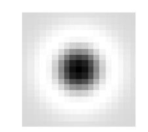

# OpenCV Python 8_图像特征

图像的特征必须要使得计算机可以识别（比如角点）。

从图像中找到包含特征的区域，向不同方向移动图像会产生很大变化，这种方法称为特征检测。在其他图像中如果要寻找相同特征，需要先对周围区域进行特征描述，然后才能找到相同的特征。

## 1. Harris 角点检测

### Harris 角点检测原理


对于上图而言，红框框住的是角点，蓝框框住的是平凡面，黑框框住的是边界。角点是图像中最容易被发现的特征。

**角点检测：**使用一个固定的窗口在图像上进行任意方向上的滑动，比较滑动前与滑动后两种情况，窗口中的像素灰度变化程度，***如果存在任意方向上的滑动，都有着较大的灰度变化***，那么我们可以认为该窗口中存在角点。

首先用数学表达式表达像素灰度值在窗口移动时产生的变化：


$$
E(u,v) = \sum_{(x,y)}w(x,y)(I(x,y) - I(x+u,y +v))^2
$$
式中$w(x,y)$表示以$(x,y)$为窗口中心的窗口对应的窗口（加权）函数，$(u,v)$为窗口移动的大小。

> 简单的，可以使用
> $$
> w = \left [
> \begin{matrix}
> 1 & 1 & 1 \\
> 1 & 1 & 1 \\
> 1 & 1 & 1 \\
> \end{matrix}
> \right ]
> $$
> 此时，权重系数均为1；
>
> 但是更常用的是以窗口中心为原点的二元正态分布：
> $$
> w = \left[
> \begin{matrix}
> 1 & 2 & 1 \\
> 2 & 4 & 2 \\
> 1 & 2 & 1
> \end{matrix}
> \right ]
> $$
> 如果窗口中心点是角点时，移动前与移动后，该点的灰度变化应该最为剧烈，表示窗口移动时，该点在灰度变化贡献较大；离窗口中心(角点)较远的点，这些点的灰度变化几近平缓，以示该点对灰度变化贡献较小。

希望关注的是 $(u,v)$ 在一个小范围变化时，$E(u,v)$ 的变化，也就是局部特征。范围大了，两个窗口距离太远了，找出的变化就没什么意义了。此外，更希望关注 $E(u,v)$ 在 $(0,0)$ 点附近的变化趋势，因为 $(0,0)$ 点就是当前点，要考虑在当前点附近 $E(u,v)$ 的变化，从而判断当前点是否为角点。

由泰勒公式：
$$
E(u,v) = E(0,0) + \left[ \begin{matrix} 
u & v
\end{matrix} \right]\left[ \begin{matrix} 
E_u(0,0) \\ E_v(0,0) 
\end{matrix} \right]
+ \frac{1}{2}\left[ \begin{matrix} 
u & v
\end{matrix} \right]
\left[ \begin{matrix} 
E_{uu}(0,0) & E_{uv}(0,0) \\
E_{vu}(0,0) & E_{vv}(0,0)
\end{matrix} \right]
\left[ \begin{matrix} 
u \\ v
\end{matrix} \right] \\
E_u(u,v) = \sum_{x,y}2w(x,y)[I(x+u,y+v)-I(x,y)]I_x(x+u,y+v) \\
E_v(u,v) = \sum_{x,y}2w(x,y)[I(x+u,y+v)-I(x,y)]I_y(x+u,y+v) \\
E_{uu}(u,v) = \sum_{x,y}2w(x,y)I_x(x+u,y+v)I_x(x+u,y+v)+\sum_{x,y}2w(x,y)[I(x+u,y+v)-I(x,y)]I_xx(x+u,y+v) \\
E_{uv}(u,v) = \sum_{x,y}2w(x,y)I_x(x+u,y+v)I_y(x+u,y+v)+\sum_{x,y}2w(x,y)[I(x+u,y+v)-I(x,y)]I_xy(x+u,y+v) \\
E_{vv}(u,v) = \sum_{x,y}2w(x,y)I_y(x+u,y+v)I_y(x+u,y+v)+\sum_{x,y}2w(x,y)[I(x+u,y+v)-I(x,y)]I_yy(x+u,y+v) \\
E(u,v) = \left[ \begin{matrix} 
u & v
\end{matrix} \right]
M
\left[ \begin{matrix} 
u \\ v
\end{matrix} \right]  \\
M  = \sum_{x,y}w(x,y)
\left[ \begin{matrix} 
I_x^2 & I_xI_y \\
I_xI_y & I_y^2
\end{matrix} \right]
$$
此时$E(u,v)$为二次型，其等值面是一个椭圆。$M$ 决定了这个二次曲面的具体形状，也就决定了 $E(u,v)$ 的变化情况。将$M(u,v)$相似对角化：
$$
M(u,v) = R^{-1} \left[ \begin{matrix} 
\lambda_1 & \\
& \lambda_2
\end{matrix} \right] R
$$
$λ_1$ 和 $λ_2$ 反映了椭圆的长轴和短轴，$λ_{max}$ 越大，则该轴越短，从二次曲面上看，就是爬升的速度越快，且在这个方向上速度是最快的。反之，在 $λ_{min}$ 这个轴上变化的最缓慢。椭圆的方向是由 $R$ 矩阵决定的，这是一个正交的旋转矩阵。由于角点有旋转不变性，所以一般不关注 $R$。


使用以下指标进行打分：
$$
R = det(M) - k(trace(M))^2
$$

> 在指标$R$中：
>
> - 若为平坦区域，则$|R|$比较小；
> - 若为边界区域，则$\lambda_2 >> \lambda_1$或$\lambda_1 >> \lambda_2$，则$R < 0$。
> - 若为边界区域，则$\lambda_2$和$\lambda_1$都比较大，$R$很大。


在Harris角点检测后生成一张角点检测图像。这样选出的角点可能会在某一区域特别多，并且角点窗口相互重合，为了能够更好地通过角点检测追踪目标，需要进行非极大值抑制操作。

选取适当的阈值进行二值化可得角点。

**Harris 检测器具有旋转不变性，但不具有尺度不变性，也就是说尺度变化可能会导致角点变为边缘。**

### OpenCV 的 Harris 角点检测

```python
"""
	Harris 角点检测函数
	第一个参数：图像，应为np.float32类型
	第二个参数：角点检测窗口大小
	第三个参数：Sobel算子卷积核大小
	第四个参数：R值公式中的k，取0.04到0.06的值
"""
cv2.cornerHarris()
```

```python
import cv2
import numpy as np

cap = cv2.VideoCapture(1)
cap.set(10, 2)

while cap.isOpened() == True:
    ret, frame = cap.read()
    if ret == True:
        gray = cv2.cvtColor(frame, cv2.COLOR_BGR2GRAY)
        gray = np.float32(gray)

        dst = cv2.cornerHarris(gray, 2, 3, 0.04)
        dst = cv2.dilate(dst, None)

        frame[dst > 0.01*(dst.max())] = [0, 0, 255]
        cv2.imshow('res', frame)
        key = cv2.waitKey(1)
        if key == 27:
            break
    else:
        break

cv2.destroyAllWindows()
cap.release()
```

### OpenCV 亚像素级的角点检测

```python
import cv2
import numpy as np

cap = cv2.VideoCapture(1)
cap.set(10, 2)

while cap.isOpened() == True:
    ret, frame = cap.read()
    if ret == True:
        gray = cv2.cvtColor(frame, cv2.COLOR_BGR2GRAY)
        gray = np.float32(gray)

        # 第一步：角点检测
        dst = cv2.cornerHarris(gray, 2, 3, 0.04)
        # 第二步：将检测到的角点进行膨胀操作
        dst = cv2.dilate(dst, None)

        # frame[dst > 0.01*(dst.max())] = [0, 0, 255]
        # 第三步：二值化角点图像，使用0.01倍最大值进行过滤
        res, dst = cv2.threshold(dst, (0.01*dst.max()), 255, cv2.THRESH_BINARY)
        dst = np.uint8(dst)

        # 第四步：取连通角点的质心进行修正
        res, labels, stats, centroids = cv2.connectedComponentsWithStats(dst)

        # 第五步：定义停止条件(迭代最近点算法的终止条件)
        """
            cv2.TERM_CRITERIA_EPS 指定收敛准则的epsilon值,即允许两点之间存在的最大差异。
            cv2.TERM_CRITERIA_MAX_ITER 指定算法允许的最大迭代次数,以便其收敛。如果在这么多的迭代次数内算法没有收敛,它将停止并返回当前的最佳解决方案。
            100 指定算法允许的最大迭代次数以使其收敛。在这种情况下,如果算法在100次迭代后仍未收敛,它将停止。
            0.01 指定收敛准则的容差级别。这意味着如果两个点之间的差异小于或等于0.01,它们将被视为相同。
        """
        criteria = (cv2.TERM_CRITERIA_EPS +
                    cv2.TERM_CRITERIA_MAX_ITER, 100, 0.01)

        # 第六步：
        corners = cv2.cornerSubPix(gray, np.float32(centroids),
                                   (5, 5), (-1, -1), criteria)
        result = np.hstack((centroids, corners))
        
        result = np.int0(result)
        frame[result[:, 1], result[:, 0]] = [0, 0, 255]
        frame[result[:, 3], result[:, 2]] = [0, 255, 0]

        cv2.imshow('res', frame)
        key = cv2.waitKey(1)
        if key == 27:
            break
    else:
        break

cv2.destroyAllWindows()
cap.release()
```

```python
"""
	检测和标记二值图像中的连通区域
	第一个参数：图像
	返回值：	  retval 输出标签矩阵，其中每个连通区域的标签从1开始。
				labels 输出的连通区域标签矩阵。
				stats  输出的连通区域统计信息矩阵，包括面积、质心等。
				centroids 输出的连通区域质心矩阵。
"""
cv2.connectedComponentsWithStats()
```

```python
"""
	进行形态学图像处理，以提高图像中角点检测的准确性
	第一个参数：图像
	第二个参数：角点质心坐标
	第三个参数：角点检测窗口大小
	第四个参数：形态学操作的卷积核大小
	第五个参数：迭代停止条件
	返回值：检测到的角点的坐标的数组
"""
cv2.cornerSubPix()
"""
    cv2.TERM_CRITERIA_EPS 指定收敛准则的epsilon值,即允许两点之间存在的最大差异。
    cv2.TERM_CRITERIA_MAX_ITER 指定算法允许的最大迭代次数,以便其收敛。如果在这么多的迭代次数内算法没有收敛,它将停止并返回当前的最佳解决方案。
    100 指定算法允许的最大迭代次数以使其收敛。在这种情况下,如果算法在100次迭代后仍未收敛,它将停止。
    0.01 指定收敛准则的容差级别。这意味着如果两个点之间的差异小于或等于0.01,它们将被视为相同。
"""
criteria = (cv2.TERM_CRITERIA_EPS +cv2.TERM_CRITERIA_MAX_ITER, 100, 0.01)
```

### Shi-Tomasi 角点检测

改进后的角点打分函数：
$$
	R = min(\lambda_1,\lambda_2)
$$


只有进入紫色区域$(\lambda_1,\lambda_2)$很大时,才能认为是角点。

```python
import cv2
import numpy as np

cap = cv2.VideoCapture(0)
cap.set(10, 2)

while cap.isOpened() == True:
    ret, frame = cap.read()
    if ret == True:
        gray = cv2.cvtColor(frame, cv2.COLOR_BGR2GRAY)
        gray = np.float32(gray)

        # shi-tomasi 角点检测
        corners = cv2.goodFeaturesToTrack(gray, 100, 0.01, 10)

        # 返回一个两层数组
        corners = np.intp(corners)
        for i in corners:
            x, y = i.ravel()
            cv2.circle(frame, (x, y), 3, 255, -1)

        cv2.imshow('res', frame)
        key = cv2.waitKey(1)
        if key == 27:
            break
    else:
        break

cv2.destroyAllWindows()
cap.release()
```

```python
"""
	角点检测函数
	第一个参数：灰度图（32位浮点型）
	第二个参数：角点个数（希望的）
	第三个参数：图像角点的最小可接受参数，质量测量值乘以这个参数就是最小特征值，小于这个数的会被抛弃。
	第四个参数：返回的角点之间最小的欧式距离。
	返回值：数组索引（双层数组，需要进行遍历提取）
"""
cv2.goodFeaturesToTrack()
```

## 2. SIFT 关键点检测

理论参考：[链接](https://zhuanlan.zhihu.com/p/31844794941)

### 尺度空间极值检测

Harris 角点检测有旋转不变特性(图片发生旋转的时候仍然能找到同样的角点)，但是如果使用同样的窗口，当图像被放大时，可能就检测不到角点了。

因此 D.Lowe 提出可尺度不变特征变换 SIFT。

#### 高斯二阶偏导核的尺度作用

用高斯一阶偏导可以进行边缘的检测，用高斯偏导核对信号做卷积，并找出极值点即可得到边缘信息。(Canny 边缘检测)

高斯的二阶偏导同样也能用于边缘的检测，其与阶跃信号卷积的结果在边缘处的值为0。


使用一个确定 $σ$ 的高斯二阶偏导和不同尺度的信号进行卷积，其响应会在某一特定尺度下达到最大。


在 $σ$ 确定的时候，高斯二阶偏导核能够对不同的尺度的信号进行一个筛选作用。其对应的那个中心响应最大的尺度，就是筛选出来的对应尺度。同理，如果用很多不同 $σ$ 的高斯二阶偏导核对同一个方波信号做卷积，看哪个 $σ$ 能产生最大响应，那么这个 $σ$ 就能表示该方波的尺度。

但是由于高斯二阶偏导核的幅值响应随 $σ$ 增大而衰减，相应的需要进行补偿：


对于高斯二阶偏导核，需要乘以 $\sigma^2$ 进行补偿(此处不证明)：


在图像中也可以使用高斯二阶偏导核(LoG,$\sigma^2\nabla^2 G$)进行尺度提取：


$$
G(x,y) = \frac{1}{2\pi\sigma^2}exp(-\frac{x^2+y^2}{2\sigma^2}) \\
$$
对于该卷积核，当斑点的尺度为 $r = \sqrt{2}\sigma$ 时，响应最大。

#### 尺度空间中的特征提取

用不同的 $σ$ 的高斯二阶偏导核和原图像做卷积，可以形成不同尺度的图像。在尺度空间中对每一个点进行极值点选取，可以知道这个点存在多大尺度的斑点特征。


> 1. **每个尺度都和相邻的两个尺度比对**，如果该尺度最大，则判定该点处有一个这个尺度的特征。这是因为在某个点上可能有同心圆的情况，那么这个点就可能在多个尺度下都有特征，在多个尺度下都有极值点存在。
> 2. 在同一尺度下邻近的像素点可能检测到同样的特征信息，因此，在一个尺度下要对每个点在其局部范围内判断是否为最大值，如果该点是其领域范围内最大值，则将该点输出，否则不输出。
>
> 对一个像素点要考虑其上下两个尺度和其当前尺度周围的值，共27个点进行比对，这里采用了非最大化抑制的思想。

但是使用 LoG 核的计算开销很大，需要进行效率优化。首先**使用高斯差分核 DoG 替代 LoG。**

DoG 和 LoG 函数曲线相似：


$$
DoG = G(x,y,k\sigma) - G(x,y,\sigma) \approx (k-1) LoG
$$
原先的 LoG 构造的算子，可以用 DoG 构造的算子替换。


首先使用高斯卷积核进行卷积，然后进行差分计算可以得到 DoG 构成的尺度空间，由此可以找到极值点。注意：DoG 使用了高斯卷积核，由于高斯卷积核可以分解为两个小的高斯卷积核依次卷积($\sigma^2 = \sigma_1^2 + \sigma_2^2$)，由此可以通过以下的方法得到高斯金字塔：最下层以 $σ$ 对原图做了一次卷积，而第二层不需要通过 $kσ$ 和原图卷积得到，而是可以通过一个 $\sqrt{(k\sigma)^2-\sigma^2}$ 的高斯核对第一层的卷积结果再卷积一次得到；同样的第三层是通过对第二层的卷积结果，再来一个 $\sqrt{(k^2\sigma)^2-(k\sigma)^2}$ 的卷积得到。这样会减小卷积核从而减小计算开销。

通过高斯差分的替代，减小了每次卷积所需要的卷积核大小，然而当尺度进一步增大，层数再往上走，高斯卷积核还是会不可避免地扩大。通过图像金字塔的方式对图像进行放大缩小，从而减小卷积核。

> 如果当前图像上有一个半径为 $r$ 的特征，用 $\sigma$ 检测出来了。如果把图像缩小一倍，特征的半径变成了 $\frac{r}{2}$，那么检测这个特征需要的 $σ$ 也就缩小到原来的一半，也就是所需要的高斯卷积核也减小了一半（高斯卷积核的半窗宽一般设置为3 $σ$）。而最终检测出来的特征尺度再放大一倍，就能得到原图的特征了。
>
> 原图缩小了，所需要的高斯核就缩小了。缩小原图会带来一些精度损失，但对于特征检测来说这点损失不算什么。


> 下面 5 层作为一组，以原图为基础进行卷积；上面 5 层是另一组，这里把原图像缩小一倍，如果沿用下方的 5 个 $σ$ 对缩小的图分别进行卷积，这个操作就相当于用 2 倍的下方的 $σ$ 对原图进行卷积，实际上检测的尺度为下面这一组的 2 倍。
>
> 继续往上扩展尺度的话，就再也不用增加高斯核的大小了，只需要每往上一个组，把图像缩小一倍，然后沿用第一个组中的高斯核，最后再把尺度放大回去即可。
>
> 由于尺度空间中只对比当前尺度和上下两个尺度的响应大小决定是否输出特征。在第一个组中，实际输出的尺度空间为 $k\sigma$ 和 $k^2\sigma$；同理，在上面这个组中，输出的是 $2k\sigma$ 和 $2k^2\sigma$。期望最终输出的每个点上的尺度空间是连续的(等比数列)，此时 $k=\sqrt{2}$。
>
> 如果每个组的输出尺度数量为 $s$，则令 $k = 2^{\frac{1}{s}}$ 就能保证输出尺度空间的连续性。

### 极值点定位

通过以上操作得到了很多极值点，用响应函数表示为 $f(x,y,\sigma)$，由于是离散的，所以这些极值点可能在真正的极值点附近。

在上述得到的极值点附近使用泰勒展开求得亚像素精度的极值点。

> 在极值点处进行三元泰勒展开
> $$
> f(\left[\begin{matrix}x \\ y \\ \sigma \end{matrix}\right]) = f(\left[\begin{matrix}x_0 \\ y_0 \\ \sigma_0 \end{matrix}\right])+
> \left[\begin{matrix}\frac{\partial f}{\partial x} & \frac{\partial f}{\partial y} & \frac{\partial f}{\partial \sigma} \end{matrix}\right](\left[\begin{matrix}x \\ y \\ \sigma \end{matrix}\right]-\left[\begin{matrix}x_0 \\ y_0 \\ \sigma_0 \end{matrix}\right])+\frac{1}{2}(\left[\begin{matrix}x \\ y \\ \sigma \end{matrix}\right]-\left[\begin{matrix}x_0 \\ y_0 \\ \sigma_0 \end{matrix}\right])^T\left[\begin{matrix}\frac{\partial^2 f}{\partial x\partial x} & \frac{\partial^2 f}{\partial x\partial y}&\frac{\partial^2 f}{\partial x\partial \sigma} \\ \frac{\partial^2 f}{\partial x\partial y} & \frac{\partial^2 f}{\partial y\partial y} & \frac{\partial^2 f}{\partial y\partial \sigma} \\ \frac{\partial^2 f}{\partial x\partial \sigma} & \frac{\partial^2 f}{\partial y\partial \sigma} & \frac{\partial^2 f}{\partial \sigma\partial \sigma} \end{matrix}\right](\left[\begin{matrix}x \\ y \\ \sigma \end{matrix}\right]-\left[\begin{matrix}x_0 \\ y_0 \\ \sigma_0 \end{matrix}\right]) \\
> f(X) = f(X_0)+\frac{\partial f^T}{\partial X}\hat{X} + \frac{1}{2}\hat{X}^T\frac{\partial ^2f}{\partial X^2}\hat{X} \\
> \frac{\partial f}{\partial X} = \frac{\partial f^T}{\partial X}+\frac{\partial ^2f}{\partial X^2}\hat{X} \\ 
> \to \hat{X} = -\frac{\partial ^2f^{-1}}{\partial X^2}\frac{\partial f}{\partial X} \\
> \to f(X) = f(X_0)+\frac{1}{2}\frac{\partial f^T}{\partial X}\hat{X}
> $$
> 上述求解达到一定精度时迭代停止。
>
> > 1. 当位移量三个分量都小于0.5时，说明位移量已经很小了，可以认为已经收敛。得到的就是精确极值点。
> >
> > 2. 当迭代次数超限，位移量的三个分量还不是全都小于0.5，则认为不能收敛，该点不在极值点附近，把该点丢弃掉。
> > 3. 如果收敛了，我极值点带回原函数得到的值超出原先极值点的值一定范围，则表示泰勒展开没有很好的拟合原函数，则该点也被丢弃。

舍去低对比度的极值点，如果 $|f(X)| < \frac{0.04}{s}$ ，认为对比度太低(响应太小，0.04是经验参数)，需要舍弃。

去除边界点，由于高斯差分函数对于边缘也有很强的响应，从而产生噪音。因此上面的得到的真极值点中，有一些是边缘点，而边缘点是不期望得到的。利用角点检测中的 $M$ 矩阵进行角点检查。

> 去掉DOG局部曲率非常不对称的像素。一个高斯差分算子的极值在横跨边缘的地方有较大的主曲率，而在垂直边缘的方向有较小的主曲率。
>
> 主曲率通过一个2×2的黑塞矩阵$\bold{H}$求出，D的主曲率和H的特征值成正比，令$\alpha$为较大特征值，$\beta$为较小的特征值。
> $$
> H(x,x) = \left[\begin{matrix}D_{xx} & D_{xy} \\
> 							 D_{yx} & D_{yy}	\end{matrix}\right] \\ 
> Tr(H) = D_{xx} + D_{yy} = \alpha + \beta \\
> |H| = \alpha\beta \\
> \alpha = \gamma\beta \\
> $$
>
> - 如果$|H|<0$则舍去$X$;
>
> - 如果$\frac{Tr(H)}{|H|} < 1.21$则舍去$X$，建议$\gamma = 10$。

得到极值点坐标。

### 确定关键点方向

通过尺度不变性求极值点，需要利用图像的局部特征为给每一个关键点分配一个基准方向，使描述子对图像旋转具有不变性。对于在DOG金字塔中检测出的关键点，采集其所在高斯金字塔图像$3\sigma$邻域窗口内像素的梯度和方向分布特征。
$$
m(x,y) = \sqrt{(L(x+1,y)-L(x-1,y))^2+(L(x,y+1)-L(x,y-1))^2} \\
\theta(x,y) = \frac{L(x+1,y)-L(x-1,y)}{L(x,y+1)-L(x,y-1)}
$$
梯度直方图统计法，统计以关键点为原点，一定区域内的图像像素点确定关键点方向。在完成关键点的梯度计算后，使用直方图统计邻域内像素的梯度和方向。梯度直方图将0~360度的方向范围分为36个柱，其中每柱10度。直方图的峰值方向代表了关键点的主方向，方向直方图的峰值则代表了该特征点处邻域梯度的方向，以直方图中最大值作为该关键点的主方向。为了增强匹配的鲁棒性，只保留峰值大于主方向峰值80％的方向作为该关键点的辅方向。

统计以特征点为圆心，以该特征点所在的高斯图像的尺度的1.5倍为半径的圆内的所有的像素的梯度方向及其梯度幅值，并做$1.5\sigma$的高斯滤波(高斯加权，离圆心也就是关键点近的幅值所占权重较高)。

### 关键点描述

选取与关键点周围的16×16的邻域，分为16个4×4的小方块，为每个方块创建具有8个分组的梯度直方图，组成长度为128的向量构成关键点描述符。

### 关键点匹配

使用关键点特征向量的欧氏距离作为两幅图像中关键点的相似度判定测量，取第一张图的某个关键点对第二张图进行遍历，找到第二幅图像中距离最近的关键点。

为了避免噪声带来的干扰，要计算最近距离和第二近距离的比值，如果大于0.8则忽略，此时会去除大量的错误匹配。

```python
"""
	创建SIFT对象
"""
cv2.xfeatures2d.SIFT_create()
```

```python
"""
	用于检测图像中的关键点
	第一个参数：输入图像
	第二个参数：掩膜图像
	返回值：一个包含检测到的关键点的数组
"""
sift.detect()
```

可以使用`cv2.drawKeypoints()`函数绘制关键点。

```python
import cv2
import numpy as np

cap = cv2.VideoCapture(1)
cap.set(10, 2)

while cap.isOpened() == True:
    ret, frame = cap.read()
    if ret == True:
        gray = cv2.cvtColor(frame, cv2.COLOR_BGR2GRAY)

        # SIFT 关键点检测
        sift = cv2.xfeatures2d.SIFT_create()
        kp = sift.detect(gray, None)

        # 绘制关键点
        frame = cv2.drawKeypoints(gray, kp, frame)
        cv2.imshow('res', frame)
        key = cv2.waitKey(1)
        if key == 27:
            break
    else:
        break

cv2.destroyAllWindows()
cap.release()

```

## 3. SURF 关键点检测

- SURF 相对于 SIFT 的优势：

> 1. SURF是SIFT的加速版，一般来说它比SIFT要快好几倍，且在多幅图像下具有更好的稳定性；
>
> 2. SURF采用了haar特征和积分图像的概念，大大加快了程序的运行时间。
>
> 3. SURF可以应用于物体识别以及3D重构。

### 图像尺度变换

使用Hessian矩阵判别图像关键点：
$$
H(f(x,y)) = \left[ \begin{matrix}\frac{\partial^2f}{\partial x^2} & \frac{\partial^2f}{\partial x\partial y} \\  \frac{\partial^2f}{\partial x\partial y} & \frac{\partial^2f}{\partial y^2}
\end{matrix}\right]
$$
由于特征点需要具备尺度无关性，所在在Hessian矩阵的构造前，需要首先对图像进行高斯平滑滤波。这样，在经过高斯平滑滤波之后，再对图像中的每一个像素点进行Hessian矩阵的求解。（卷积核为二阶微分后的高斯函数卷积核）

为了方便应用，Herbert Bay提出用近似值代替$L(x,\sigma)$。为了平衡准确值与近似值之间的误差引入了权值，权值随着尺度的变化而变化
$$
|H| = D_{xx}D_{yy}-0.9D_{xy}^2
$$

- 积分图 （提高计算效率）

当前的每个像素的灰度都是它与坐标原点(0,0)形成的对角线的矩形内的所有像素的灰度值之和。所以在计算某个矩阵框内的像素灰度值之和时，就可以很快得出结果。

- 盒状滤波器

由于求Hessian时，首先要先进行高斯平滑，然后求二阶导数，这在离散的像素点中应用模板的卷积就可以形成，那么，能不能用一个模板就可以将高斯平滑过程中的高斯平滑模板和在求图像二阶导数过程中的拉普拉斯算子的二阶微分模板代替。

SURF 作者使用积分图和盒状滤波器进行高斯模糊和二阶求导。


通过以上操作，得到一张$|H|$的图像，和SIFT算法中的DOG图像类似。在构建金字塔时，图片的大小是一直不变的，不同Octave层待检测图片是改变了高斯模糊尺寸的大小得到的，当然了，同一个Octave中不同图片用到的高斯模板的尺度(模糊程度)也是不同的。算法允许尺度空间多层图像同时被处理，不需要对图像进行二次抽样，从而提高了算法的性能。

### 极值点定位

 在SURF中，采用不断增大盒子滤波器模板尺寸与积分图像求取Hessian矩阵响应，然后在响应图像上采用3D非极大值抑制，求取各种不同尺度的斑点。以下和SIFT算法相似，进行比较，亚精度级定位，去除低对比度和边界点。

### 特征点描述

以特征点为中心，计算半径为6s(S为特征点所在的尺度值)的邻域内的点在x、y方向的Haar小波(Haar小波边长取4s)响应。

计算出图像在Harr小波的x和y方向上的响应值之后，对两个值进行因子为2s的高斯加权，加权后的值分别表示在水平和垂直方向上的方向分量。

Harr特征值反应了图像灰度变化的情况，这个主方向就是描述那些灰度变化特别剧烈的区域方向。

接着，以特征点为中心，张角为π/3的扇形滑动，计算窗口内的Harr小波响应值dx、dy的累加：


SURF 算法中，在特征点周围取一个4×4的矩形区域块，但是所取得矩形区域方向是沿着特征点的主方向。每个子区域统计25个像素的水平方向和垂直方向的Haar小波特征，这里的水平和垂直方向都是相对主方向而言的。该Haar小波特征为水平方向值之和、垂直方向值之和、水平方向绝对值之和以及垂直方向绝对值之和4个方向。把这4个值作为每个子块区域的特征向量。

> SIFT 和 SURF 区别：
>
> 1. 在生成尺度空间方面，SIFT 中下一组图像的尺寸是上一组的一半，同一组间图像尺寸一样，但是所使用的高斯模糊系数逐渐增大。而在SURF中，不同组间图像的尺寸都是一致的，但不同组间使用的盒式滤波器的模板尺寸逐渐增大，同一组间不同层间使用相同尺寸的滤波器，但是滤波器的模糊系数逐渐增大。
>
> 2. 在特征点检验时，SIFT 算子是先对图像进行非极大值抑制，再去除对比度较低的点。然后通过 Hessian 矩阵去除边缘的点。SURF 算法是先通过 Hessian 矩阵来检测候选特征点，然后再对非极大值的点进行抑制。
>
> 3. 在特征向量的方向确定上，SIFT算法是在正方形区域内统计梯度的幅值的直方图，找到最大梯度幅值所对应的方向。SIFT算子确定的特征点可以有一个或一个以上方向，其中包括一个主方向与多个辅方向。SURF算法则是在圆形邻域内，检测各个扇形范围内水平、垂直方向上的Haar小波响应，找到模值最大的扇形指向，且该算法的方向只有一个。
>
> 4. SIFT算法生成描述子时，是将16x16的采样点划分为4x4的区域，从而计算每个分区种子点的幅值并确定其方向，共计4x4x8=128维。SURF算法在生成特征描述子时将的正方形分割成4x4的小方格，每个子区域25个采样点，计算小波Haar响应，一共4x4x4=64维。

```python
import cv2
import numpy as np

cap = cv2.VideoCapture(1)
cap.set(10, 2)

while cap.isOpened() == True:
    ret, frame = cap.read()
    if ret == True:
        gray = cv2.cvtColor(frame, cv2.COLOR_BGR2GRAY)
        # surf 关键点检测器生成
        surf = cv2.xfeatures2d.SURF_create()
        # Hessian 阈值限制
        surf.setHessianThreshold(30000)
        surf.setUpright(True) 
        # 检测关键点
        kp = surf.detect(gray, None)
        # 绘制关键点
        frame =  cv2.drawKeypoints(frame, kp, frame, (255, 0, 0), 3)
        cv2.imshow('res', frame)
        key = cv2.waitKey(1)
        if key == 27:
            break
    else:
        break

cv2.destroyAllWindows()
cap.release()
```

> 注意，由于专利保护，SURF算法需要再Python 3.7，OpenCV 4.4.0和OpenCV-contrib 3.4.2.17环境下方可正常运行。

## 4. FAST 角点检测

对于快速实时性而言，使用FAST角点检测效率更高。

1. 选取一个像素点$p$，以像素$p$为中心画一个半径为3像素的圆，取圆上的16个点，如下图所示：

   

2. 选取阈值$t$；

3. 考察$p1,p5,p9,p13$（四个方向的中点）与中心$p$的像素差，若它们的绝对值有至少3个超过阈值$t$，则当做候选角点，再进行下一步考察；否则，不可能是角点。

4. 在$p$是候选点的情况下，计算$p1$到$p16$这16个点与中心$p$的像素差， 若它们有至少连续9个超过阈值（也可以测试其他大小，实验表明9的效果更好），则是角点；否则，不是角点。一般情况下，n取12，所以这个标准定义为FAST-12，而实际上当n=9时，往往能取得较好的效果。

5. 遍历整个图像；

6. 对整个图片进行计算后，很可能大部分检测出来的点彼此之间相邻，要去除一部分这样的点。为了解决这一问题，采用**非极大值抑制的算法**，去除小区域内多个重复的特征点。

   > - 计算特征点处的FAST得分值$V$（或者说响应值），**即16个点与中心差值的绝对值总和。**
   > - 判断以特征点$p$为中心的一个邻域（可以设为3×3或着5×5）内，若有多个特征点，则判断每个特征点的响应值,如果$p$是其中最大的，则保留，否则，删除。如果只有一个特征点，就保留。

FAST 角点检测有一定缺点：

- 在首先的四点检测里，只有2个点同中心点不相似，也并不能说明这不是角点。
- 前面的四点检测结果和后面的16点检测的计算有一定重复。
- 检测出来的角点不一定是最优的，这是因为它的效率取决于问题的排序与角点的分布。

```python
"""
	FAST 角点检测器创建函数
	返回值：角点检测器
"""
cv2.FastFeatureDetector.create()
```

```python
import cv2
import numpy as np

cap = cv2.VideoCapture(1)
cap.set(10, 2)

while cap.isOpened() == True:
    ret, frame = cap.read()
    if ret == True:
        gray = cv2.cvtColor(frame, cv2.COLOR_BGR2GRAY)

        # 生成 FAST 角点检测器
        fast = cv2.FastFeatureDetector.create()
        # FAST 角点检测
        keypoints = fast.detect(gray, None)

        frame = cv2.drawKeypoints(gray, keypoints, frame)
        cv2.imshow('res',frame)
        key = cv2.waitKey(1)
        if key == 27:
            break
    else:
        break
    
cv2.destroyAllWindows()
cap.release()
```

## 5. ORB 关键点检测

### BRIEF 描述符

BRIEF 对已检测到的特征点进行描述，它是一种二进制编码的描述子，摈弃了利用区域灰度直方图描述特征点的传统方法，大大的加快了特征描述符建立的速度，同时也极大的降低了特征匹配的时间，是一种非常快速，很有潜力的算法。

1. 对图像进行高斯滤波；
2. 以特征点为中心，取 $S \times S$ 的邻域，窗口内随机取一对点进行灰度值比较，比较结果用 0/1 进行赋值，在窗口中随机选取N对随机点，重复的二进制赋值，形成一个二进制编码，这个编码就是对特征点的描述，即特征描述子。（一般N=256）

随机点选取一般服从各向同性的同一高斯分布。

配对时，特征编码对应位小于 128 的一定不配对。两图中相同位最多的两个点进行配对。

但是，该描述符对噪声敏感，且不具备旋转和尺度不变性。

### ORB 关键点检测

ORB (Oriented FAST and Rotated BRIEF) 算法是对 FAST 特征点检测和 BRIEF 特征描述子的一种结合，在原有的基础上做了改进与优化，使得 ORB 特征具备多种局部不变性，并为实时计算提供了可能。

#### 改进 FAST 角点检测

ORB 首先利用 FAST 算法检测特征点，然后利用 Harris 角点的检测方式，从提取的 FAST 角点中筛选出 N 个 Harris 响应值最大的特征点。

FAST 检测特征点不具备尺度不变性，可以借助尺度空间理论构建图像高斯金字塔，然后在每一层金字塔图像上检测角点，以实现尺度不变性。

FAST 检测特征点不具备旋转不变性，ORB 使用灰度质心法解决：灰度质心法假设灰度质心法假设角点的灰度与质心之间存在一个偏移，这个向量可以用于表示一个方向。换言之，在半径为 $r$ 的邻域内求取灰度质心，从特征点到灰度质心的向量，定义为该特征点的主方向。

特征点的方向矢量定义为特征点的中心 O 与质心 C 形成的向量 OC 与 X 轴的夹角：
$$
\theta = arctan(m_{01},m_{10})
$$

#### 改进 BRIEF 特征描述子

ORB 中利用积分图像，在 31×31 的邻域中选取随机点对，并以选取的随机点为中心，在 5×5 的窗口内计算灰度平均值（灰度和），比较随机点对的邻域灰度均值，进行二进制编码，而不是仅仅由两个随机点对的像素值决定编码结果，可以有效地解决噪声问题。

对于旋转不变性问题，可利用 FAST 特征点检测时求取的主方向，旋转特征点邻域，这种方法称为SBRIEF 。但旋转整个邻域再提取 BRIEF 特征描述子的计算代价较大。

ORB 采用了一种更高效的方式，在每个特征点邻域内，先选取 N 对随机点，将其进行旋转，然后做判决编码为二进制串。通过上述方法得到的特征描述子具有旋转不变性，但匹配效果却不如原始 BRIEF 算法，因为可区分性减弱了。特征描述子的一个要求就是要尽可能地表达特征点的独特性，便于区分不同的特征点。BRIEF 令人惊喜的特性之一是描述子所有比特位的均值接近于 0.5 ，且方差很大。方差越大表明可区分性越好，不同特征点的描述子表现出较大的差异性，不易造成误匹配。但 SBRIEF 进行了坐标旋转，损失了这个特性，导致可区分性减弱，相关性变强，不利于匹配。

为了解决 SBRIEF 可区分性降低的问题，ORB 使用了一种基于学习的方法来选择一定数量的随机点对。首先建立一个大约 300k 特征点的数据集（特征点来源于 PASCAL2006 中的图像），对每个特征点，考虑其 31×31 的邻域，为了去除噪声的干扰，选择 5×5 的子窗口的灰度均值代替单个像素的灰度，这样每个邻域内就有 N=729 个子窗口，从中随机选取 2 个非重复的子窗口，一共有 M 种方法。这样，每个特征点便可提取出一个长度为 M 的二进制串，所有特征点可构成一个 300k × M 的二进制矩阵 Q 。
$$
Q = \left[ \begin{matrix}
p_{1,1} & p_{1,2} & ... & p_{1,M} \\
p_{2,1} & p_{2,2} & ... & p_{2,M} \\
... & ... & ... & ... \\
p_{300k,1} & p_{300k,2} & ... & p_{300k,M}
\end{matrix}\right]
$$
现在需要从 M 个点对中选取 256 个相关性最小、可区分性最大的点对，作为最终的二进制编码。筛选方法如下：

1. 对矩阵 Q 的每一列求取均值，并根据均值与 0.5 之间的距离从小到大的顺序，依次对所有列向量进行重新排序，得到矩阵 T；
2. 将 T 中的第一列向量放到结果矩阵 R 中；
3. 取出 T 中的下一列向量，计算其与矩阵 R 中所有列向量的相关性，如果相关系数小于给定阈值，则将 T 中的该列向量移至矩阵 R 中，否则丢弃；
4. 循环执行上一步，直到 R 中有 256 个列向量；如果遍历 T 中所有列， R 中向量列数还不满 256，则增大阈值，重复以上步骤；

这样，最后得到的就是相关性最小的 256 对随机点，该方法称为 rBRIEF 。

```python
import numpy as np
import cv2
from matplotlib import pyplot as plt

img = cv2.imread("test.jpg", 0)

# 创建 ORB 对象
orb = cv2.ORB.create()

# 寻找关键点
kp = orb.detect(img, None)

# 计算描述符
kp, des = orb.compute(img, kp)

# 绘制关键点
img2 = cv2.drawKeypoints(img, kp, None, (0, 255, 0), 0)
plt.imshow(img2), plt.show()
```

## 6. 特征匹配

### 暴力匹配 Brute-Force

BFMatcher（Brute-Force Matcher）是一种简单的特征匹配算法，它通过计算特征描述子之间的距离来寻找最佳匹配点。BFMatcher 适用于特征点数量较少的情况。

```python
"""
	BF 匹配器创建函数
	normType: 指定使用的距离测试类型,cv2.Norm_L2/cv2.Norm_L1 适合 SIFT/SURF,cv2.NORM_HAMMING 适合 ORB (如果ORB设置VTA_K = 3/4,设置为cv2.NORM_HAMMING2)
	crossCheck：匹配是否严格，如果是，只有两个特征点互相匹配时才形成匹配。
	返回值：BF 匹配器
"""
cv2.BFMatcher()
```

```python
import numpy as np
import cv2
from matplotlib import pyplot as plt

img1 = cv2.imread("test1.jpg", 0)
img2 = cv2.imread("test2.jpg", 0)

orb = cv2.ORB.create()

# 关键点检测
kp1, des1 = orb.detectAndCompute(img1, None)
kp2, des2 = orb.detectAndCompute(img2, None)

# 创建 BF 匹配器
bf = cv2.BFMatcher(cv2.NORM_HAMMING, crossCheck=True)

# 进行匹配
# 有两个方法，match和knnMatch，前者返回最佳匹配，后者返回k个最佳匹配
matches = bf.match(des1, des2)

# 按照距离排序
# matches 是一个 DMatch 对象列表
# DMatch.distance - 描述符之间的距离
# DMatch.trainIdx - 目标图像中描述符的索引
# DMatch.queryIdx - 查询图像中描述符的索引
# DMatch.imgIdx   - 目标图像的索引
matches = sorted(matches, key=lambda x: x.distance)

# 绘制匹配结果
img3 = cv2.drawMatches(
    img1,
    kp1,
    img2,
    kp2,
    matches[:10],
    None,
    flags=cv2.DrawMatchesFlags_NOT_DRAW_SINGLE_POINTS,
)

plt.imshow(img3)
plt.show()
```

### 最近邻匹配 FLANN

FLANN（Fast Library for Approximate Nearest Neighbors）是一种近似最近邻搜索算法，它通过构建KD树或K-means树来加速特征匹配过程。FLANN匹配器适用于特征点数量较多的情况。

```python
import numpy as np
import cv2
from matplotlib import pyplot as plt

# 读入图像
img1 = cv2.imread("test1.jpg", 0)
img2 = cv2.imread("test2.jpg", 0)

sift = cv2.SIFT_create()
kp1, des1 = sift.detectAndCompute(img1, None)
kp2, des2 = sift.detectAndCompute(img2, None)

# 传入两个字典
# index_params 确定使用的算法和相关参数，FLANN 文档有详情
# 使用了5棵树的核密度树索引算法，FLANN可以并行处理此算法。
index_params = dict(algorithm=1, tree=5)
# search_params 确定递归遍历的速度
search_params = dict(checks=50)
flann = cv2.FlannBasedMatcher(index_params, search_params)
matches = flann.knnMatch(des1, des2, k=2)

# 应用乘数为0.7的劳氏比率检验。同时，组建一个名为 mask_matches 的列表，其中每个元素都是长度为 k(与传给 KnnMatch 的 k 是一样的)的子列表，如果匹配成功，则将子列表对应的元素设为 1，否则设置为0.
# 准备一个空的掩膜来绘制好的匹配
mask_matches = [[0, 0] for i in range(len(matches))]

# 向掩膜中添加数据
for i, (m, n) in enumerate(matches):
    if m.distance < 0.7 * n.distance:
        mask_matches[i] = [1, 0]

img_matches = cv2.drawMatchesKnn(
    img1,
    kp1,
    img2,
    kp2,
    matches,
    None,
    matchColor=(0, 255, 0),
    singlePointColor=(255, 0, 0),
    matchesMask=mask_matches,
    flags=0,
)

cv2.imshow("FLANN", img_matches)
cv2.waitKey(0)
cv2.destroyAllWindows()
```

