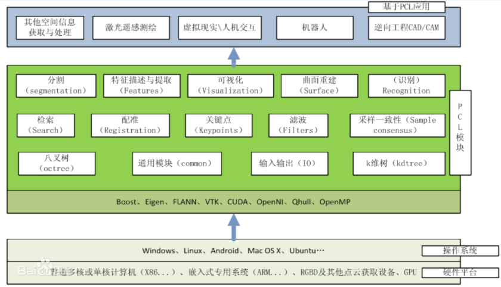
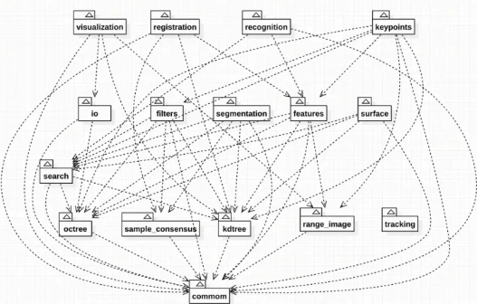
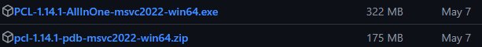
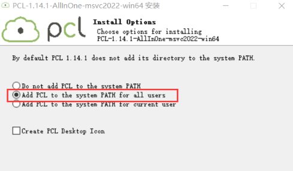
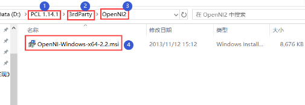
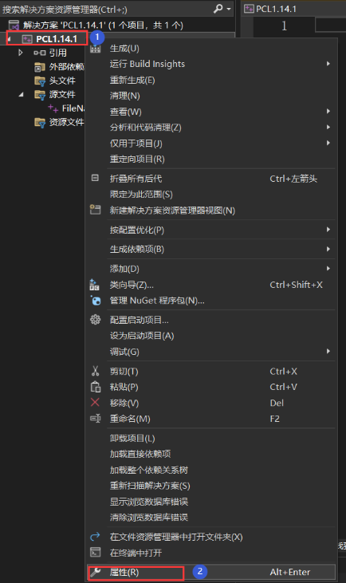
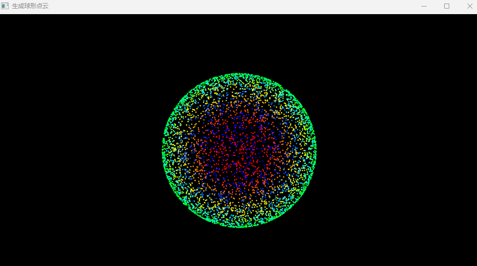

# PCL-C++ 0_PCL简介和环境配置

> 系列笔记参考资料：
>
> [PCL(Point Cloud Library)学习指南&资料推荐 (yuque.com)](https://www.yuque.com/huangzhongqing/pcl/rdk5k8)

> PCL 官网和 Github：
>
> [官网链接](https://pointclouds.org/)
>
> [Github 链接](https://github.com/PointCloudLibrary/pcl)

## 0. PCL 库简介

- 点云数据的处理可以采用获得广泛应用的**Point Cloud Library (点云库，PCL库)。**
- PCL库是一个最初发布于2013年的开源C++库。它实现了大量点云相关的通用算法和高效的数据管理。
- 支持多种操作系统平台，可在Windows、Linux、Android、Mac OS X、部分嵌入式实时系统上运行。如果说OpenCV是2D信息获取与处理的技术结晶，那么**PCL在3D信息获取与处理上，就与OpenCV具有同等地位**。
- PCL是BSD授权方式，可以免费进行商业和学术应用。

> PCL架构图所示，对于3D点云处理来说，PCL完全是一个的模块化的现代C++模板库。其基于以下第三方库：**Boost、Eigen、FLANN、VTK、CUDA、OpenNI、Qhull**，实现点云相关的**获取、滤波、分割、配准、检索、特征提取、识别、追踪、曲面重建、可视化等。**
>
> 

PCL 学习路线：



## 1. PCL 环境配置

### Windows 环境配置

> ~~不能使用 msys2 配置，差评。~~

1. PCL 库下载安装

    - Github 官网：[Releases · PointCloudLibrary/pcl (github.com)](https://github.com/PointCloudLibrary/pcl/releases)

        

    -  安装`PCL-1.14.1-AllInOne-msvc2022-win64.exe`

      

    - 安装在 `D:/PCL 1.14.1`即可。

    - **安装过程中会提示环境变量字符过长无法添加的报错**，之后手动添加环境变量即可。

    - 安装完成之后打开文件夹 `D:\PCL 1.14.1\3rdParty\OpenNI2`，双击`OpenNI-Windows-x64-2.2.msi` 选择路径（`D:\PCL 1.14.1\3rdParty\OpenNI2`）安装即可。

      

      > 对于一些电脑可能会出现安装 OpenNI2 时未弹出，默认安装在C盘的情况。此时需要到目标文件夹双击安装程序，先点击 REMOVE，将原本安装到c盘的卸载掉，之后重新安装到目标文件夹下。

    - 全部安装完成后，将`pcl-1.14.1-pdb-msvc2022-win64.zip`解压后的`.pdb`文件拷贝到（`D:\PCL 1.14.1\bin`）中。

    - 设置环境变量：在 `Path` 中添加：

      ```
      %PCL_ROOT%\3rdParty\FLANN\bin
      %PCL_ROOT%\3rdParty\VTK\bin
      %OPENNI2_REDIST64%
      %OPENNI2_LIB64%
      %OPENNI2_INCLUDE64%
      ```

      在系统变量中添加`PCL_ROOT`定义，文件夹为`D:\PCL 1.14.1`。

2. 设置 VS2022

    - 新建空项目。

    - 解决方案平台选择x64。

    - 新建一个C++源文件：

      ```c++
      #include <vtkNew.h>
      #include <vtkPointSource.h>
      #include <iostream>
      #include <pcl/io/pcd_io.h>
      #include <pcl/io/vtk_lib_io.h>
      #include <pcl/point_types.h>
      #include <boost/thread/thread.hpp>
      #include <pcl/visualization/pcl_visualizer.h>
      
      int main(int, char* [])
      {
      	// -------------------------生成位于球面上的点云---------------------------
      	vtkNew<vtkPointSource> pointSource;
      	pointSource->SetCenter(0.0, 0.0, 0.0);
      	pointSource->SetNumberOfPoints(5000);
      	pointSource->SetRadius(5.0);
      	pointSource->SetDistributionToShell();  // 设置点分布在球面上。
      	pointSource->Update();
      	// ---------------------------转为PCD点云并保存----------------------------
      	vtkSmartPointer<vtkPolyData> polydata = pointSource->GetOutput(); // 获取VTK中的PolyData数据
      	pcl::PointCloud<pcl::PointXYZ>::Ptr cloud(new pcl::PointCloud<pcl::PointXYZ>);
      	pcl::io::vtkPolyDataToPointCloud(polydata, *cloud);
      	pcl::PCDWriter w;
      	w.writeBinaryCompressed("sphere.pcd", *cloud);
      	// -------------------------------结果可视化-------------------------------
      	boost::shared_ptr<pcl::visualization::PCLVisualizer> viewer(new pcl::visualization::PCLVisualizer("3D Viewer"));
      	viewer->setBackgroundColor(0, 0, 0);
      	viewer->setWindowName(u8"生成球形点云");
      	pcl::visualization::PointCloudColorHandlerGenericField<pcl::PointXYZ> fildColor(cloud, "z"); // 按照z字段进行渲染
      	viewer->addPointCloud<pcl::PointXYZ>(cloud, fildColor, "sample cloud");
      	viewer->setPointCloudRenderingProperties(pcl::visualization::PCL_VISUALIZER_POINT_SIZE, 2, "sample cloud"); // 设置点云大小
      
      	while (!viewer->wasStopped())
      	{
      		viewer->spinOnce(100);
      		boost::this_thread::sleep(boost::posix_time::microseconds(100000));
      	}
      
      	return 0;
      }
      ```

    - 右击新建的项目—属性：打开属性表

      

    - 配置属性—调试—环境—添加：

      ```
      PATH=D:\PCL 1.14.1\\bin;D:\PCL 1.14.1\\3rdParty\FLANN\bin;D:\PCL 1.14.1\\3rdParty\VTK\bin;D:\PCL 1.14.1\\3rdParty\OpenNI2\Tools
      ```

    - C/C++—常规—SDL检查：否

    - C/C++—语言—符合模式：否

    - VC++目录—包含目录—添加：

      ```
      D:\PCL 1.14.1\include\pcl-1.14
      D:\PCL 1.14.1\3rdParty\Boost\include\boost-1_84
      D:\PCL 1.14.1\3rdParty\Eigen3\include\eigen3
      D:\PCL 1.14.1\3rdParty\FLANN\include
      D:\PCL 1.14.1\3rdParty\OpenNI2\Include
      D:\PCL 1.14.1\3rdParty\Qhull\include
      D:\PCL 1.14.1\3rdParty\VTK\include\vtk-9.3
      ```

    - VC++目录—库目录—添加：

      ```
      D:\PCL 1.14.1\lib
      D:\PCL 1.14.1\3rdParty\Boost\lib
      D:\PCL 1.14.1\3rdParty\FLANN\lib
      D:\PCL 1.14.1\3rdParty\OpenNI2\Lib
      D:\PCL 1.14.1\3rdParty\Qhull\lib
      D:\PCL 1.14.1\3rdParty\VTK\lib
      ```

    - C/C++—预处理器—预处理器定义—添加：

      ```
      BOOST_USE_WINDOWS_H
      NOMINMAX
      _CRT_SECURE_NO_DEPRECATE
      ```

    - 链接器—输入—附加依赖项—添加：

      > - Release版本附加依赖项：
      >
      > ```
      > pcl_common.lib
      > pcl_features.lib
      > pcl_filters.lib
      > pcl_io.lib
      > pcl_io_ply.lib
      > pcl_kdtree.lib
      > pcl_keypoints.lib
      > pcl_ml.lib
      > pcl_octree.lib
      > pcl_outofcore.lib
      > pcl_people.lib
      > pcl_recognition.lib
      > pcl_registration.lib
      > pcl_sample_consensus.lib
      > pcl_search.lib
      > pcl_segmentation.lib
      > pcl_stereo.lib
      > pcl_surface.lib
      > pcl_tracking.lib
      > pcl_visualization.lib
      > vtkcgns-9.3.lib
      > vtkChartsCore-9.3.lib
      > vtkCommonColor-9.3.lib
      > vtkCommonComputationalGeometry-9.3.lib
      > vtkCommonCore-9.3.lib
      > vtkCommonDataModel-9.3.lib
      > vtkCommonExecutionModel-9.3.lib
      > vtkCommonMath-9.3.lib
      > vtkCommonMisc-9.3.lib
      > vtkCommonSystem-9.3.lib
      > vtkCommonTransforms-9.3.lib
      > vtkDICOMParser-9.3.lib
      > vtkDomainsChemistry-9.3.lib
      > vtkDomainsChemistryOpenGL2-9.3.lib
      > vtkdoubleconversion-9.3.lib
      > vtkexodusII-9.3.lib
      > vtkexpat-9.3.lib
      > vtkFiltersAMR-9.3.lib
      > vtkFiltersCellGrid-9.3.lib
      > vtkFiltersCore-9.3.lib
      > vtkFiltersExtraction-9.3.lib
      > vtkFiltersFlowPaths-9.3.lib
      > vtkFiltersGeneral-9.3.lib
      > vtkFiltersGeneric-9.3.lib
      > vtkFiltersGeometry-9.3.lib
      > vtkFiltersGeometryPreview-9.3.lib
      > vtkFiltersHybrid-9.3.lib
      > vtkFiltersHyperTree-9.3.lib
      > vtkFiltersImaging-9.3.lib
      > vtkFiltersModeling-9.3.lib
      > vtkFiltersParallel-9.3.lib
      > vtkFiltersParallelImaging-9.3.lib
      > vtkFiltersPoints-9.3.lib
      > vtkFiltersProgrammable-9.3.lib
      > vtkFiltersReduction-9.3.lib
      > vtkFiltersSelection-9.3.lib
      > vtkFiltersSMP-9.3.lib
      > vtkFiltersSources-9.3.lib
      > vtkFiltersStatistics-9.3.lib
      > vtkFiltersTensor-9.3-gd.lib
      > vtkFiltersTensor-9.3.lib
      > vtkFiltersTexture-9.3.lib
      > vtkFiltersTopology-9.3.lib
      > vtkFiltersVerdict-9.3.lib
      > vtkfmt-9.3.lib
      > vtkfreetype-9.3.lib
      > vtkGeovisCore-9.3.lib
      > vtkgl2ps-9.3.lib
      > vtkglew-9.3.lib
      > vtkhdf5-9.3.lib
      > vtkhdf5_hl-9.3.lib
      > vtkImagingColor-9.3.lib
      > vtkImagingCore-9.3.lib
      > vtkImagingFourier-9.3.lib
      > vtkImagingGeneral-9.3.lib
      > vtkImagingHybrid-9.3.lib
      > vtkImagingMath-9.3.lib
      > vtkImagingMorphological-9.3.lib
      > vtkImagingSources-9.3.lib
      > vtkImagingStatistics-9.3.lib
      > vtkImagingStencil-9.3.lib
      > vtkInfovisCore-9.3.lib
      > vtkInfovisLayout-9.3.lib
      > vtkInteractionImage-9.3.lib
      > vtkInteractionStyle-9.3.lib
      > vtkInteractionWidgets-9.3.lib
      > vtkIOAMR-9.3.lib
      > vtkIOAsynchronous-9.3.lib
      > vtkIOCellGrid-9.3.lib
      > vtkIOCesium3DTiles-9.3.lib
      > vtkIOCGNSReader-9.3.lib
      > vtkIOChemistry-9.3.lib
      > vtkIOCityGML-9.3.lib
      > vtkIOCONVERGECFD-9.3.lib
      > vtkIOCore-9.3.lib
      > vtkIOEnSight-9.3.lib
      > vtkIOExodus-9.3.lib
      > vtkIOExport-9.3.lib
      > vtkIOExportGL2PS-9.3.lib
      > vtkIOExportPDF-9.3.lib
      > vtkIOFLUENTCFF-9.3.lib
      > vtkIOGeometry-9.3.lib
      > vtkIOHDF-9.3.lib
      > vtkIOImage-9.3.lib
      > vtkIOImport-9.3.lib
      > vtkIOInfovis-9.3.lib
      > vtkIOIOSS-9.3.lib
      > vtkIOLegacy-9.3.lib
      > vtkIOLSDyna-9.3.lib
      > vtkIOMINC-9.3.lib
      > vtkIOMotionFX-9.3.lib
      > vtkIOMovie-9.3.lib
      > vtkIONetCDF-9.3.lib
      > vtkIOOggTheora-9.3.lib
      > vtkIOParallel-9.3.lib
      > vtkIOParallelXML-9.3.lib
      > vtkIOPLY-9.3.lib
      > vtkIOSegY-9.3.lib
      > vtkIOSQL-9.3.lib
      > vtkioss-9.3.lib
      > vtkIOTecplotTable-9.3.lib
      > vtkIOVeraOut-9.3.lib
      > vtkIOVideo-9.3.lib
      > vtkIOXML-9.3.lib
      > vtkIOXMLParser-9.3.lib
      > vtkjpeg-9.3.lib
      > vtkjsoncpp-9.3.lib
      > vtkkissfft-9.3.lib
      > vtklibharu-9.3.lib
      > vtklibproj-9.3.lib
      > vtklibxml2-9.3.lib
      > vtkloguru-9.3.lib
      > vtklz4-9.3.lib
      > vtklzma-9.3.lib
      > vtkmetaio-9.3.lib
      > vtknetcdf-9.3.lib
      > vtkogg-9.3.lib
      > vtkParallelCore-9.3.lib
      > vtkParallelDIY-9.3.lib
      > vtkpng-9.3.lib
      > vtkpugixml-9.3.lib
      > vtkRenderingAnnotation-9.3.lib
      > vtkRenderingCellGrid-9.3.lib
      > vtkRenderingContext2D-9.3.lib
      > vtkRenderingContextOpenGL2-9.3.lib
      > vtkRenderingCore-9.3.lib
      > vtkRenderingFreeType-9.3.lib
      > vtkRenderingGL2PSOpenGL2-9.3.lib
      > vtkRenderingHyperTreeGrid-9.3.lib
      > vtkRenderingImage-9.3.lib
      > vtkRenderingLabel-9.3.lib
      > vtkRenderingLICOpenGL2-9.3.lib
      > vtkRenderingLOD-9.3.lib
      > vtkRenderingOpenGL2-9.3.lib
      > vtkRenderingSceneGraph-9.3.lib
      > vtkRenderingUI-9.3.lib
      > vtkRenderingVolume-9.3.lib
      > vtkRenderingVolumeOpenGL2-9.3.lib
      > vtkRenderingVtkJS-9.3.lib
      > vtksqlite-9.3.lib
      > vtksys-9.3.lib
      > vtkTestingRendering-9.3.lib
      > vtktheora-9.3.lib
      > vtktiff-9.3.lib
      > vtkverdict-9.3.lib
      > vtkViewsContext2D-9.3.lib
      > vtkViewsCore-9.3.lib
      > vtkViewsInfovis-9.3.lib
      > vtkWrappingTools-9.3.lib
      > vtkzlib-9.3.lib
      > ```
      >
      > - Debug版本附加依赖项
      >
      > ```
      > pcl_commond.lib
      > pcl_featuresd.lib
      > pcl_filtersd.lib
      > pcl_iod.lib
      > pcl_io_plyd.lib
      > pcl_kdtreed.lib
      > pcl_keypointsd.lib
      > pcl_mld.lib
      > pcl_octreed.lib
      > pcl_outofcored.lib
      > pcl_peopled.lib
      > pcl_recognitiond.lib
      > pcl_registrationd.lib
      > pcl_sample_consensusd.lib
      > pcl_searchd.lib
      > pcl_segmentationd.lib
      > pcl_stereod.lib
      > pcl_surfaced.lib
      > pcl_trackingd.lib
      > pcl_visualizationd.lib
      > vtkcgns-9.3-gd.lib
      > vtkChartsCore-9.3-gd.lib
      > vtkCommonColor-9.3-gd.lib
      > vtkCommonComputationalGeometry-9.3-gd.lib
      > vtkCommonCore-9.3-gd.lib
      > vtkCommonDataModel-9.3-gd.lib
      > vtkCommonExecutionModel-9.3-gd.lib
      > vtkCommonMath-9.3-gd.lib
      > vtkCommonMisc-9.3-gd.lib
      > vtkCommonSystem-9.3-gd.lib
      > vtkCommonTransforms-9.3-gd.lib
      > vtkDICOMParser-9.3-gd.lib
      > vtkDomainsChemistry-9.3-gd.lib
      > vtkDomainsChemistryOpenGL2-9.3-gd.lib
      > vtkdoubleconversion-9.3-gd.lib
      > vtkexodusII-9.3-gd.lib
      > vtkexpat-9.3-gd.lib
      > vtkFiltersAMR-9.3-gd.lib
      > vtkFiltersCellGrid-9.3-gd.lib
      > vtkFiltersCore-9.3-gd.lib
      > vtkFiltersExtraction-9.3-gd.lib
      > vtkFiltersFlowPaths-9.3-gd.lib
      > vtkFiltersGeneral-9.3-gd.lib
      > vtkFiltersGeneric-9.3-gd.lib
      > vtkFiltersGeometry-9.3-gd.lib
      > vtkFiltersGeometryPreview-9.3-gd.lib
      > vtkFiltersHybrid-9.3-gd.lib
      > vtkFiltersHyperTree-9.3-gd.lib
      > vtkFiltersImaging-9.3-gd.lib
      > vtkFiltersModeling-9.3-gd.lib
      > vtkFiltersParallel-9.3-gd.lib
      > vtkFiltersParallelImaging-9.3-gd.lib
      > vtkFiltersPoints-9.3-gd.lib
      > vtkFiltersProgrammable-9.3-gd.lib
      > vtkFiltersReduction-9.3-gd.lib
      > vtkFiltersSelection-9.3-gd.lib
      > vtkFiltersSMP-9.3-gd.lib
      > vtkFiltersSources-9.3-gd.lib
      > vtkFiltersStatistics-9.3-gd.lib
      > vtkFiltersTensor-9.3-gd.lib
      > vtkFiltersTexture-9.3-gd.lib
      > vtkFiltersTopology-9.3-gd.lib
      > vtkFiltersVerdict-9.3-gd.lib
      > vtkfmt-9.3-gd.lib
      > vtkfreetype-9.3-gd.lib
      > vtkGeovisCore-9.3-gd.lib
      > vtkgl2ps-9.3-gd.lib
      > vtkglew-9.3-gd.lib
      > vtkhdf5-9.3-gd.lib
      > vtkhdf5_hl-9.3-gd.lib
      > vtkImagingColor-9.3-gd.lib
      > vtkImagingCore-9.3-gd.lib
      > vtkImagingFourier-9.3-gd.lib
      > vtkImagingGeneral-9.3-gd.lib
      > vtkImagingHybrid-9.3-gd.lib
      > vtkImagingMath-9.3-gd.lib
      > vtkImagingMorphological-9.3-gd.lib
      > vtkImagingSources-9.3-gd.lib
      > vtkImagingStatistics-9.3-gd.lib
      > vtkImagingStencil-9.3-gd.lib
      > vtkInfovisCore-9.3-gd.lib
      > vtkInfovisLayout-9.3-gd.lib
      > vtkInteractionImage-9.3-gd.lib
      > vtkInteractionStyle-9.3-gd.lib
      > vtkInteractionWidgets-9.3-gd.lib
      > vtkIOAMR-9.3-gd.lib
      > vtkIOAsynchronous-9.3-gd.lib
      > vtkIOCellGrid-9.3-gd.lib
      > vtkIOCesium3DTiles-9.3-gd.lib
      > vtkIOCGNSReader-9.3-gd.lib
      > vtkIOChemistry-9.3-gd.lib
      > vtkIOCityGML-9.3-gd.lib
      > vtkIOCONVERGECFD-9.3-gd.lib
      > vtkIOCore-9.3-gd.lib
      > vtkIOEnSight-9.3-gd.lib
      > vtkIOExodus-9.3-gd.lib
      > vtkIOExport-9.3-gd.lib
      > vtkIOExportGL2PS-9.3-gd.lib
      > vtkIOExportPDF-9.3-gd.lib
      > vtkIOFLUENTCFF-9.3-gd.lib
      > vtkIOGeometry-9.3-gd.lib
      > vtkIOHDF-9.3-gd.lib
      > vtkIOImage-9.3-gd.lib
      > vtkIOImport-9.3-gd.lib
      > vtkIOInfovis-9.3-gd.lib
      > vtkIOIOSS-9.3-gd.lib
      > vtkIOLegacy-9.3-gd.lib
      > vtkIOLSDyna-9.3-gd.lib
      > vtkIOMINC-9.3-gd.lib
      > vtkIOMotionFX-9.3-gd.lib
      > vtkIOMovie-9.3-gd.lib
      > vtkIONetCDF-9.3-gd.lib
      > vtkIOOggTheora-9.3-gd.lib
      > vtkIOParallel-9.3-gd.lib
      > vtkIOParallelXML-9.3-gd.lib
      > vtkIOPLY-9.3-gd.lib
      > vtkIOSegY-9.3-gd.lib
      > vtkIOSQL-9.3-gd.lib
      > vtkioss-9.3-gd.lib
      > vtkIOTecplotTable-9.3-gd.lib
      > vtkIOVeraOut-9.3-gd.lib
      > vtkIOVideo-9.3-gd.lib
      > vtkIOXML-9.3-gd.lib
      > vtkIOXMLParser-9.3-gd.lib
      > vtkjpeg-9.3-gd.lib
      > vtkjsoncpp-9.3-gd.lib
      > vtkkissfft-9.3-gd.lib
      > vtklibharu-9.3-gd.lib
      > vtklibproj-9.3-gd.lib
      > vtklibxml2-9.3-gd.lib
      > vtkloguru-9.3-gd.lib
      > vtklz4-9.3-gd.lib
      > vtklzma-9.3-gd.lib
      > vtkmetaio-9.3-gd.lib
      > vtknetcdf-9.3-gd.lib
      > vtkogg-9.3-gd.lib
      > vtkParallelCore-9.3-gd.lib
      > vtkParallelDIY-9.3-gd.lib
      > vtkpng-9.3-gd.lib
      > vtkpugixml-9.3-gd.lib
      > vtkRenderingAnnotation-9.3-gd.lib
      > vtkRenderingCellGrid-9.3-gd.lib
      > vtkRenderingContext2D-9.3-gd.lib
      > vtkRenderingContextOpenGL2-9.3-gd.lib
      > vtkRenderingCore-9.3-gd.lib
      > vtkRenderingFreeType-9.3-gd.lib
      > vtkRenderingGL2PSOpenGL2-9.3-gd.lib
      > vtkRenderingHyperTreeGrid-9.3-gd.lib
      > vtkRenderingImage-9.3-gd.lib
      > vtkRenderingLabel-9.3-gd.lib
      > vtkRenderingLICOpenGL2-9.3-gd.lib
      > vtkRenderingLOD-9.3-gd.lib
      > vtkRenderingOpenGL2-9.3-gd.lib
      > vtkRenderingSceneGraph-9.3-gd.lib
      > vtkRenderingUI-9.3-gd.lib
      > vtkRenderingVolume-9.3-gd.lib
      > vtkRenderingVolumeOpenGL2-9.3-gd.lib
      > vtkRenderingVtkJS-9.3-gd.lib
      > vtksqlite-9.3-gd.lib
      > vtksys-9.3-gd.lib
      > vtkTestingRendering-9.3-gd.lib
      > vtktheora-9.3-gd.lib
      > vtktiff-9.3-gd.lib
      > vtkverdict-9.3-gd.lib
      > vtkViewsContext2D-9.3-gd.lib
      > vtkViewsCore-9.3-gd.lib
      > vtkViewsInfovis-9.3-gd.lib
      > vtkWrappingTools-9.3-gd.lib
      > vtkzlib-9.3-gd.lib
      > ```

    - 运行代码：
    
      
    


### Ubuntu 20.04 环境配置

> 参考教程：[链接](https://blog.csdn.net/qhu1600417010/article/details/120444440)

1. 下载依赖

   ```shell
   $ sudo apt-get update  
   $ sudo apt-get install git build-essential linux-libc-dev
   $ sudo apt-get install cmake cmake-gui
   $ sudo apt-get install libusb-1.0-0-dev libusb-dev libudev-dev
   $ sudo apt-get install mpi-default-dev openmpi-bin openmpi-common 
   $ sudo apt-get install libflann-* libflann-dev
   $ sudo apt-get install libeigen3-dev 
   $ sudo apt-get install libboost-all-dev
   $ sudo apt-get install libvtk7.1-qt libvtk7.1 libvtk7-qt-dev
   $ sudo apt-get install libqhull* libgtest-dev
   $ sudo apt-get install freeglut3-dev pkg-config
   $ sudo apt-get install libxmu-dev libxi-dev
   $ sudo apt-get install mono-complete
   $ sudo apt-get install openjdk-8-jdk openjdk-8-jre
   ```

2. 下载 PCL 源码：https://github.com/PointCloudLibrary/pcl/releases

3. 编译安装 PCL

   ```shell
   $ cd pcl-pcl-1.14.1
   $ mkdir build
   $ cd build
   $ cmake -DCMAKE_BUILD_TYPE=None -DCMAKE_INSTALL_PREFIX=/usr \ -DBUILD_GPU=ON-DBUILD_apps=ON -DBUILD_examples=ON \ -DCMAKE_INSTALL_PREFIX=/usr ..
   $ make
   $ sudo make install
   ```

   

   