# PCL-C++ 2_PCL点云分割

通过3D相机（雷达、激光扫描、立体相机）获取到的点云，一般数据量较大，分布不均匀，数据主要表征了目标物表面的大量点的集合。

这些离散的点如果希望实现**基于邻域关系的快速查找比对**功能，就必须对这些离散的点之间建立拓扑关系。常见的空间索引一般是自上而下逐级划分空间的各种索引结构，包括BSP树，k-d tree、KDB tree、R tree、CELL tree、八叉树等。

## 1. k-d Tree和K近邻搜索

### k-d Tree 的构建

k-d Tree 是计算机科学中用于在k维空间中一些点建立关系的数据结构。它是一个包含特定约束的二叉搜索树。k-d Tree 对于范围搜索和最近邻居搜索非常有用。

k-d Tree 的每个级别都使用垂直于相应轴的超平面沿特定维度拆分所有子级。在树的根部，所有子项都将根据第一维进行拆分（即，如果第一维坐标小于根，则它将位于左子树中，如果大于根，则显然位于右边的子树）。树中向下的每个级别都在下一个维度上划分，其他所有元素都用尽后，将返回到第一个维度。

构建 k-d Tree 的最有效方法是使用一种分区方法，将中值点放置在根上，所有具有较小一维值的东西都放置在根部，而右侧则更大。然后，在左右两个子树上都重复此过程，直到要分区的最后一棵树仅由一个元素组成。

在点云中，k-d Tree 的生成策略如下：

1. 按照 x-y-z-x-y-z... 顺序向下分割；

   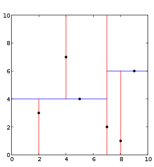

2. 取方差变化最大维度的中位数

   对于所有描述子数据（特征矢量），统计他们在每个维度上的数据方差，挑选出方差中最大值，对应的维就是下一个要分割的维度。

   数据方差大说明沿该坐标轴方向上数据点分散的比较开。这个方向上，进行数据分割可以获得最好的平衡。数据点集位于正中间的那个数据点被选为轴点。

   > 理论上空间均匀分布的点，但是一些特殊的情况中，还是会出现问题。
   >
   > 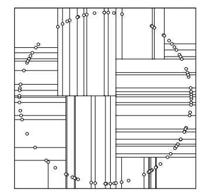
   >
   > 会出现很多长条的分割，对于k-d Tree来说是很不利的。

3. 数据范围最大维度的中位数

   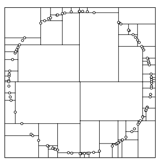

### k-d Tree 搜索

1. 从根结点出发，递归地向下访问 k-d Tree。若预测样本 S 的坐标在当前维小于切分点，则向左访问，反之，向右访问，直到访问到叶节点，取该叶节点作为当前 S 的最近邻点。
2. 以 S 和当前最近邻点做圆。
3. 从当前叶节点回退父节点，并访问父节点的另一个分支，检查该节点或者子空间是否与圆相交
	- 若相交，则需要往下访问子节点，查找是否存在比当前最近邻点更近的节点
		- 若存在更近的样本，则更新最近邻点，并重复步骤2；
		- 若不存在，则重复步骤3；
	- 若不相交，则不需要访问这一分支，继续回退到上一层父节点，重复步骤3。
4. 退回到根节点后结束搜索过程，并获得最近邻点。

> 1. 首先从根节点出发，由于预测点 S 的横坐标小于根节点横坐标，访问左子节点，由于 S 的纵坐标大于当前节点的纵坐标，访问右子节点，到达叶节点，停止向下访问，并以当前叶节点与 S 的距离为圆心画圆。
>
>    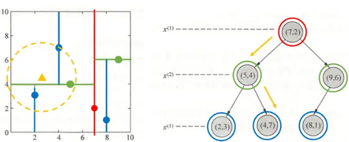
>
> 2. 接着开始回退其父节点，检查圆是否与另一个分支的空间相交，检查方法就是判断 S 的纵坐标和父节点的纵坐标之差是否小于圆半径，若小于半径，则有相交。
>
>    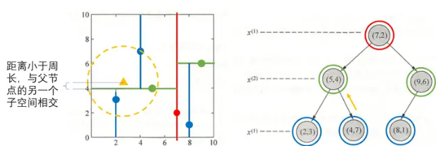
>
> 3. 由于相交，则检查父节点的另一个子空间中的节点，是否比当前最近邻点与 S 更近，因为（2，3）与 S 更近，则更新最近邻点为（2，3）。
>
>    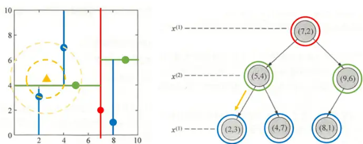
>
> 4. 接着回退到父节点（5，4），自然也要判断父节点与 S 的距离，由于距离较大，则不更新最近邻点。
>
>    最后，再次回退到上一层父节点，此时达到根节点（7，2），判断根节点的另一个子空间是否与圆相交，因没有相交，因此可以不访问另一个分支的子节点，也可以不用计算根节点与 S 的距离。
>
>    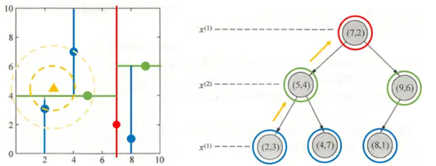
>
> 5. 如此找到最近邻点为（2，3）。
>
> 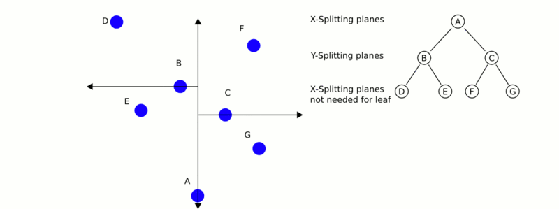

对于 k 个最近邻点，需要维护一个大根堆，也就是每一个父节点大于等于它的两个子节点的树结构的优先队列。

当出现一个距离更近的样本时，如果大根堆中的节点数量还不足 k 个，则增加一个节点并排序，如果大根堆已经有 k 个节点，则对比该样本的距离与大根堆中的根节点的距离，如果大于该距离，则不改变大根堆，如果小于该距离，则替换后再进行一次排序即可。

### PCL 中的 KNN

```c++
  /** \brief k-近邻搜索，搜索离point最近的k个点
   * \attention 此方法不对输入索引进行任何检查(即index >= cloud.points.size() || index < 0)，并假定是有效(即有限)数据。
   *
   * \param[in] point 搜索离point最近的k个点
   * \param[in] k 搜索离point最近的k个点
   * \param[out] k_indices 搜索到的点在数据源中的下标 
   * \param[out] k_distances point到被搜索点的距离，与下标相对应
   */
pcl::KdTreeFLANN<PointT, Dist>::nearestKSearch (const PointT &point, int k, std::vector<int> &k_indices, std::vector<float> &k_distances) const;
```

## 2. Radius Tree 和 Radius 搜索

k-d Tree 对于一些样本分布情况而言效率并不高，比如当大量样本落在一个超矩形的角落的情况，此时使用 Radius Tree 的效率会更高。

### Radius Tree 的构建

根节点选择方式：找到一个中心点，使所有样本点到这个中心点的距离最短。

对于每一个节点的子节点的选择方式：

1. 选择当前超球体区域离中心最远的点作为左子节点。
2. 选择距离左子节点距离最远的点作为右子节点。
3. 对于其他的样本点，计算到左子节点和右子节点对应样本点的欧式距离，并分配到距离较近的那一个对所有子节点做相同的操作。
4. 当子节点中包含的样本点数量小于一定阈值时，即可停止对这个子节点的分割。

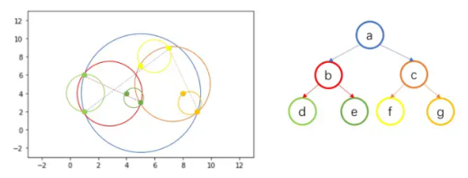

### Radius Tree 搜索

 Radius Tree 的搜索与 k-d Tree 的过程类似，只是 Radius Tree 多了一个查找范围 R，即最近邻点需要在测试样本点周围半径为 R 的超球体内。

根据测试样本点 Z，其坐标（x, y）与节点超球体 $λ$ 圆心的距离 $(λ_x, λ_y)$，与查找范围 R 和节点超球体的半径 $λ_r$ 之和进行对比。
$$
(x-λ_x)^2 + (y-λ_y)^2 ＞ R + λ_r ,不相交
$$

> 1. 测试样本点与超球体 b 相交，则向下访问节点 b，继续往下搜索，发现与超球体 d 不相交，则搜索另一分支，与超球体 e 相交，则向下访问至 e。
>
>    因 e 中存在两个训练样本点，计算两个样本点与 Z 之间的距离，得到当前最近邻点（5, 3）。
>
>    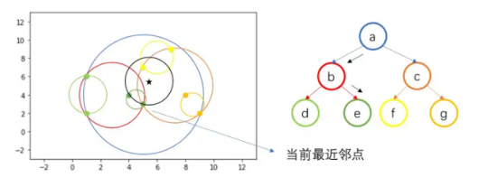
>
> 2. 接着回退父节点 b，不同于 kd 树，因为所有训练样本点都包含在叶节点中，即子节点包含的训练样本点为它们的父节点包含训练样本点的子集，因此回退到父节点后没有需要计算距离的样本，因此继续回退到根节点 a。
>
>    回退到根节点 a 后，搜索另一个分支 c，由于与 c 相交，因此向下访问 c，继续搜索，与 f 相交，向下访问 f，计算叶节点 f 中包含的训练样本点与测试样本点之间的距离，更新当前最近邻点为（5, 7）。
>
>    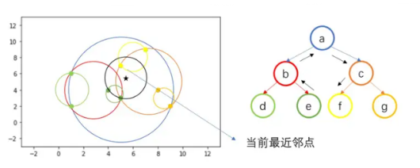
>
> 3. 叶节点 f 搜索完毕，回退父节点 c，搜索另一分支 g，发现不相交，回退到根节点 a，所有分支搜索完毕，得到最近邻点（5, 7）。

### PCL 中的 Radius Tree 搜索

```c++
template <typename PointT, typename Dist> int pcl::KdTreeFLANN<PointT,Dist>::radiusSearch (const PointT &point, double radius, std::vector<int> &k_indices,std::vector<float> &k_sqr_dists,unsigned int max_nn) const;
```

## 3. Oc Tree

八叉树的定义是：若不为空树的话，树中任一节点的子节点恰好只会有八个，或零个，也就是子节点不会有0与8以外的数目。八叉树就是用在3D空间中的场景管理，可以很快地知道物体在3D场景中的位置，或侦测与其它物体是否有碰撞以及是否在可视范围内。

> 1. 将当前的立方体细分为八个子立方体。
> 1. 如果任何一个子立方体内包含多个点，则将其进一步细分为八个子立方体。
> 1. 重复以上操作使得每个子立方体内包含最多一个点。

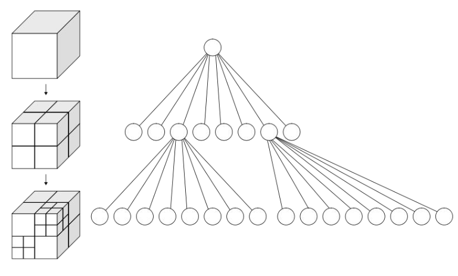

`pcl_octree` 实现提供了有效的最近邻居搜索（邻域搜索）API，例如“ 体素（`Voxel`）邻居搜索”，“K最近邻居搜索”和“半径搜索邻居”。叶子节点类也提供其他功能，例如空间“占用率”和“每个体素（`Voxel`）的点密度”检查；序列化和反序列化功能可将八叉树结构有效地编码为二进制格式；此外，内存池实现减少了昂贵的内存分配和释放操作，以便快速创建八叉树。
