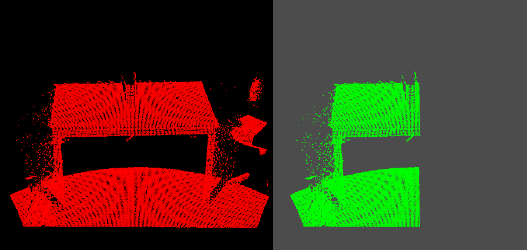
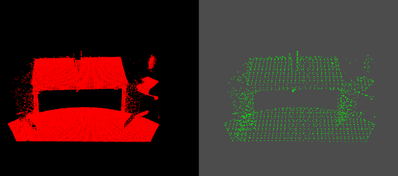
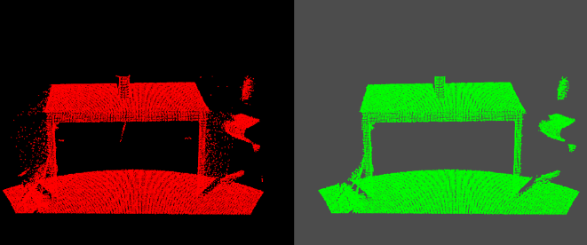
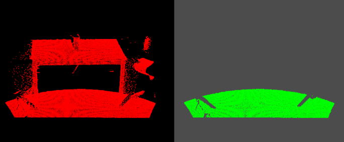
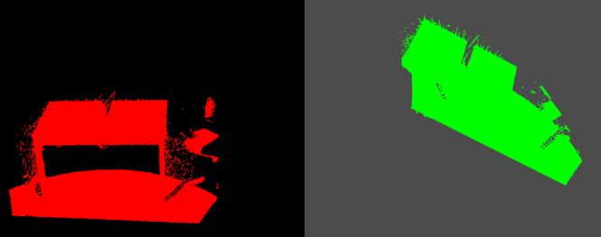
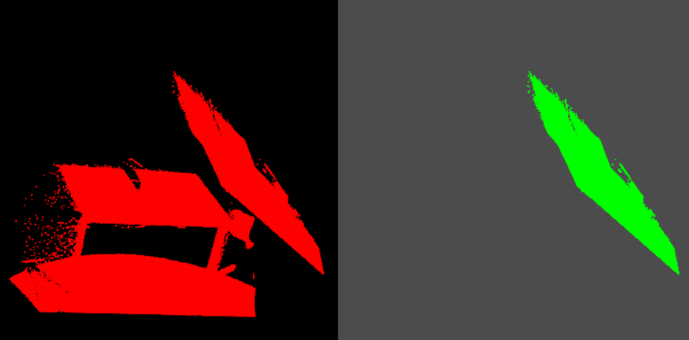
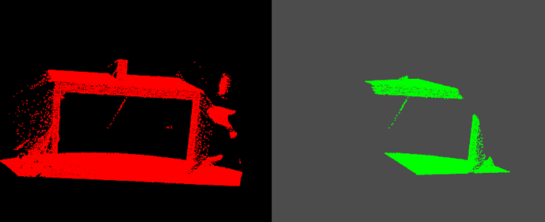

# PCL-C++ 3_点云滤波

在获取点云数据时，由于设备精度、操作者经验、环境因素等带来的影响，以及电磁波衍射特性、被测物体表面性质变化和数据拼接配准操作过程的影响，点云数据中将不可避免地出现一些**噪声点**。

实际应用中除了这些测量随机误差产生的噪声点之外，由于受到外界干扰如视线遮挡、障碍物等因素的影响，点云数据中往往存在着一些离主体点云较远的离散点，即**离群点**。不同的获取设备点云噪声结构也有不同。

通过滤波完成的功能还包括孔洞修复、最小信息损失的海量点云数据压缩处理等 。在点云处理流程中滤波处理作为预处理的第一步，往往对后续处理流程影响很大，只有在滤波预处理中将噪声点、离群点、孔洞、数据压缩等 按照后续需求处理，才能够更好地进行配准、特征提取、曲面重建、可视化等后续流程。

PCL中总结了几种需要进行点云滤波处理情况，这几种情况分别如下：

> 1. 点云数据密度不规则需要平滑；
> 2. 因为遮挡等问题造成离群点需要去除；
> 3. 大量数据需要下采样；
> 4. 噪声数据需要去除。

对应的方案如下：

> 1. 按照给定的规则限制过滤去除点；
> 2. 通过常用滤波算法修改点的部分属性；
> 3. 对数据进行下采样。

PCL点云格式分为**有序点云**和**无序点云**：

> 1. 针对有序点云提供了双边滤波、高斯滤波、中值滤波等；
> 2. 针对无序点云提供了体素栅格、随机采样等。

根据传感器的采集数据：

> 1. 一般深度相机采集到的点云的数据是有序点云；
> 2. 激光雷达采集的点云的数据是无序的点云。

## 1. 直通滤波器

直通滤波器对指定的某一维度进行滤波，**去除指定维度对应范围之外的点**。

直通滤波器的使用流程：读取点云 -> 创建滤波器对象 -> 设置滤波字段和滤波范围 -> 滤波 -> 保存结果。

直通滤波器类定义：[链接](https://pointclouds.org/documentation/classpcl_1_1_pass_through.html)

```c++
#include <pcl/io/pcd_io.h>
#include <pcl/filters/passthrough.h>
#include <pcl/visualization/cloud_viewer.h>

#include <X11/Xlib.h>

using namespace std;

int main()
{
	XInitThreads();

	pcl::PointCloud<pcl::PointXYZ>::Ptr cloud(new pcl::PointCloud<pcl::PointXYZ>);		//待滤波点云
	pcl::PointCloud<pcl::PointXYZ>::Ptr cloud_filtered(new pcl::PointCloud<pcl::PointXYZ>);	//滤波后点云

	/// 读入点云
	cout << "->正在读入点云..." << endl;
	if (pcl::io::loadPCDFile("test.pcd", *cloud) < 0)
	{
		PCL_ERROR("点云文件不存在！\n");
		system("pause");
		return -1;
	}
	cout << "\t\t<读入点云信息>\n" << *cloud << endl;

	/// 直通滤波
	cout << "->正在进行直通滤波..." << endl;
	pcl::PassThrough<pcl::PointXYZ> pt;	// 创建滤波器对象
	pt.setInputCloud(cloud);			// 设置输入点云
	pt.setFilterFieldName("x");			// 设置滤波所需字段
	pt.setFilterLimits(-0.1, 1);		// 设置字段过滤范围
	// pt.setFilterLimitsNegative(true);	// 默认false，保留范围内的点云；true，保存范围外的点云
	pt.filter(*cloud_filtered);			// 执行滤波，保存滤波后点云

	/// 保存滤波后点云
	cout << "->正在保存点云...\n";
	if (cloud_filtered->empty())
	{
		PCL_ERROR("保存点云为空!\n");
		return -1;
	}
	else
	{
		pcl::io::savePCDFileBinary("filter.pcd", *cloud_filtered);
		cout << "\t\t<保存点云信息>\n" << *cloud_filtered << endl;
	}

	//================================= 滤波前后对比可视化 ================================= ↓

	pcl::visualization::PCLVisualizer::Ptr viewer(new pcl::visualization::PCLVisualizer("滤波前后对比"));

	/*-----视口1-----*/
	int v1(0);
	viewer->createViewPort(0.0, 0.0, 0.5, 1.0, v1); //设置第一个视口在X轴、Y轴的最小值、最大值，取值在0-1之间
	viewer->setBackgroundColor(0, 0, 0, v1); //设置背景颜色，0-1，默认黑色（0，0，0）
	viewer->addText("befor_filtered", 10, 10, "v1_text", v1);
	viewer->addPointCloud<pcl::PointXYZ>(cloud, "befor_filtered_cloud", v1);
	
	/*-----视口2-----*/
	int v2(0);
	viewer->createViewPort(0.5, 0.0, 1.0, 1.0, v2);
	viewer->setBackgroundColor(0.3, 0.3, 0.3, v2);
	viewer->addText("after_filtered", 10, 10, "v2_text", v2);
	viewer->addPointCloud<pcl::PointXYZ>(cloud_filtered, "after_filtered_cloud", v2);

	/*-----设置相关属性-----*/
	viewer->setPointCloudRenderingProperties(pcl::visualization::PCL_VISUALIZER_POINT_SIZE, 2, "befor_filtered_cloud", v1);
	viewer->setPointCloudRenderingProperties(pcl::visualization::PCL_VISUALIZER_COLOR, 1, 0, 0, "befor_filtered_cloud", v1);

	viewer->setPointCloudRenderingProperties(pcl::visualization::PCL_VISUALIZER_POINT_SIZE, 2, "after_filtered_cloud", v2);
	viewer->setPointCloudRenderingProperties(pcl::visualization::PCL_VISUALIZER_COLOR, 0, 1, 0, "after_filtered_cloud", v2);

	while (!viewer->wasStopped())
	{
		viewer->spinOnce(100);
	}

	//================================= 滤波前后对比可视化 ================================= ↑

	return 0;
}
```



## 2. 体素滤波器(下采样)

对点云数据创建一个三维体素栅格（微小的空间三维立方体的集合），用每个体素重心近似代替体素中的其他点。这种方法比用体素中心来逼近的方法更慢，但它对于采样点对应曲面的表示更为准确。

> 1. 与使用体素中心和近似体素重心下采样相比，它需要更长的处理时间；
> 2. 它对嘈杂的输入空间敏感；
> 3. 它不能准确地表示下垫面（underlying surface）。

体素滤波器使用流程：读入点云 -> 创建滤波器对象 -> 设置体素大小 -> 执行滤波 -> 保存滤波点云。

体素滤波器类定义：[链接](https://pointclouds.org/documentation/classpcl_1_1_voxel_grid.html)

```c++
#include <pcl/io/pcd_io.h>
#include <pcl/filters/voxel_grid.h>
#include <pcl/visualization/cloud_viewer.h>

#include <X11/Xlib.h>

using namespace std;

int main()
{
	XInitThreads();

	pcl::PointCloud<pcl::PointXYZ>::Ptr cloud(new pcl::PointCloud<pcl::PointXYZ>);		//待滤波点云
	pcl::PointCloud<pcl::PointXYZ>::Ptr cloud_filtered(new pcl::PointCloud<pcl::PointXYZ>);	//滤波后点云

	///读入点云数据
	cout << "->正在读入点云..." << endl;
	pcl::PCDReader reader;
	reader.read("test.pcd", *cloud);
	cout << "\t\t<读入点云信息>\n" << *cloud << endl;

	///体素滤波器点云下采样
	cout << "->正在体素下采样..." << endl;
	pcl::VoxelGrid<pcl::PointXYZ> vg;		//创建滤波器对象
	vg.setInputCloud(cloud);				//设置待滤波点云
	vg.setLeafSize(0.05f, 0.05f, 0.05f);	//设置体素大小
	vg.filter(*cloud_filtered);			//执行滤波，保存滤波结果于cloud_filtered

	///保存下采样点云
	cout << "->正在保存下采样点云..." << endl;
	pcl::PCDWriter writer;
	writer.write("sub.pcd", *cloud_filtered, true);
	cout << "\t\t<保存点云信息>\n" << *cloud_filtered << endl;

	//================================= 滤波前后对比可视化 ================================= ↓

	pcl::visualization::PCLVisualizer::Ptr viewer(new pcl::visualization::PCLVisualizer("滤波前后对比"));

	/*-----视口1-----*/
	int v1(0);
	viewer->createViewPort(0.0, 0.0, 0.5, 1.0, v1); //设置第一个视口在X轴、Y轴的最小值、最大值，取值在0-1之间
	viewer->setBackgroundColor(0, 0, 0, v1); //设置背景颜色，0-1，默认黑色（0，0，0）
	viewer->addText("befor_filtered", 10, 10, "v1_text", v1);
	viewer->addPointCloud<pcl::PointXYZ>(cloud, "befor_filtered_cloud", v1);

	/*-----视口2-----*/
	int v2(0);
	viewer->createViewPort(0.5, 0.0, 1.0, 1.0, v2);
	viewer->setBackgroundColor(0.3, 0.3, 0.3, v2);
	viewer->addText("after_filtered", 10, 10, "v2_text", v2);
	viewer->addPointCloud<pcl::PointXYZ>(cloud_filtered, "after_filtered_cloud", v2);

	/*-----设置相关属性-----*/
	viewer->setPointCloudRenderingProperties(pcl::visualization::PCL_VISUALIZER_POINT_SIZE, 2, "befor_filtered_cloud", v1);
	viewer->setPointCloudRenderingProperties(pcl::visualization::PCL_VISUALIZER_COLOR, 1, 0, 0, "befor_filtered_cloud", v1);

	viewer->setPointCloudRenderingProperties(pcl::visualization::PCL_VISUALIZER_POINT_SIZE, 2, "after_filtered_cloud", v2);
	viewer->setPointCloudRenderingProperties(pcl::visualization::PCL_VISUALIZER_COLOR, 0, 1, 0, "after_filtered_cloud", v2);

	while (!viewer->wasStopped())
	{
		viewer->spinOnce(100);
	}

	//================================= 滤波前后对比可视化 ================================= ↑

	return 0;
}
```


## 3. 体素滤波器(均匀采样)

对点云数据创建一个三维体素栅格，然后，在每个体素保留一个最接近体素中心的点，代替体素中所有点。

体素滤波器使用流程：读入点云 -> 创建滤波器对象 -> 设置滤波球体半径 -> 执行滤波 -> 保存滤波点云

```c++
#include <pcl/io/pcd_io.h>
#include <pcl/keypoints/uniform_sampling.h>
#include <pcl/visualization/cloud_viewer.h>

using namespace std;

int main(int argc, char** argv)
{
	pcl::PointCloud<pcl::PointXYZ>::Ptr cloud(new pcl::PointCloud<pcl::PointXYZ>);			//待滤波点云
	pcl::PointCloud<pcl::PointXYZ>::Ptr cloud_filtered(new pcl::PointCloud<pcl::PointXYZ>);	//滤波后点云

	///读入点云数据
	cout << "->正在读入点云..." << endl;
	pcl::PCDReader reader;
	reader.read("test.pcd", *cloud);
	cout << "\t\t<读入点云信息>\n" << *cloud << endl;

	///均匀采样
	cout << "->正在均匀采样..." << endl;
	pcl::UniformSampling<pcl::PointXYZ> us;	//创建滤波器对象
	us.setInputCloud(cloud);				//设置待滤波点云
	us.setRadiusSearch(0.05f);				//设置滤波球体半径
	us.filter(*cloud_filtered);				//执行滤波，保存滤波结果于cloud_filtered

	///保存下采样点云
	cout << "->正在保存采样点云..." << endl;
	pcl::PCDWriter writer;
	writer.write("UniformSampling.pcd", *cloud_filtered, true);
	cout << "\t\t<保存点云信息>\n" << *cloud_filtered << endl;

	//================================= 滤波前后对比可视化 ================================= ↓

	pcl::visualization::PCLVisualizer::Ptr viewer(new pcl::visualization::PCLVisualizer("滤波前后对比"));

	/*-----视口1-----*/
	int v1(0);
	viewer->createViewPort(0.0, 0.0, 0.5, 1.0, v1); //设置第一个视口在X轴、Y轴的最小值、最大值，取值在0-1之间
	viewer->setBackgroundColor(0, 0, 0, v1); //设置背景颜色，0-1，默认黑色（0，0，0）
	viewer->addText("befor_filtered", 10, 10, "v1_text", v1);
	viewer->addPointCloud<pcl::PointXYZ>(cloud, "befor_filtered_cloud", v1);

	/*-----视口2-----*/
	int v2(0);
	viewer->createViewPort(0.5, 0.0, 1.0, 1.0, v2);
	viewer->setBackgroundColor(0.3, 0.3, 0.3, v2);
	viewer->addText("after_filtered", 10, 10, "v2_text", v2);
	viewer->addPointCloud<pcl::PointXYZ>(cloud_filtered, "after_filtered_cloud", v2);

	/*-----设置相关属性-----*/
	viewer->setPointCloudRenderingProperties(pcl::visualization::PCL_VISUALIZER_POINT_SIZE, 2, "befor_filtered_cloud", v1);
	viewer->setPointCloudRenderingProperties(pcl::visualization::PCL_VISUALIZER_COLOR, 1, 0, 0, "befor_filtered_cloud", v1);

	viewer->setPointCloudRenderingProperties(pcl::visualization::PCL_VISUALIZER_POINT_SIZE, 2, "after_filtered_cloud", v2);
	viewer->setPointCloudRenderingProperties(pcl::visualization::PCL_VISUALIZER_COLOR, 0, 1, 0, "after_filtered_cloud", v2);

	while (!viewer->wasStopped())
	{
		viewer->spinOnce(100);
	}

	//================================= 滤波前后对比可视化 ================================= ↑

	return 0;
}

```



## 4. 统计滤波器(移除离群点)

对每一点的邻域进行统计分析，基于点到所有邻近点的距离分布特征，过滤掉一些不满足要求的离群点。该算法对整个输入进行两次迭代：

第一次迭代：

> 1. 对于点云中的每一个点，找到该点的K近邻；
> 2. 计算每个点与它K近邻点的平均距离，结果满足高斯分布；
> 3. 计算这些距离的均值 $\mu$ 和标准差 $\sigma$ ；
> 4. 设置距离阈值 $d_{threshold}=\mu±k·\sigma$，$k$ 为标准差乘数；

第二次迭代：

> 如果点的平均邻域距离在区间  $[\mu-k·\sigma,\mu+k·\sigma]$  ，则该点为内点，予以保留，区间外的点为噪声点，予以删除。

统计滤波器使用流程：读入点云 -> 创建滤波器对象 -> 设置离群点阈值 -> 执行统计滤波 -> 保存滤波点云。

统计滤波器类定义：[链接](https://pointclouds.org/documentation/classpcl_1_1_statistical_outlier_removal.html)

```c++
#include <pcl/io/pcd_io.h>
#include <pcl/filters/statistical_outlier_removal.h>
#include <pcl/visualization/cloud_viewer.h>

using namespace std;

int main()
{
	pcl::PointCloud<pcl::PointXYZ>::Ptr cloud(new pcl::PointCloud<pcl::PointXYZ>);			//待滤波点云
	pcl::PointCloud<pcl::PointXYZ>::Ptr cloud_filtered(new pcl::PointCloud<pcl::PointXYZ>);	//滤波后点云

	///读入点云数据
	cout << "->正在读入点云..." << endl;
	pcl::PCDReader reader;
	reader.read("test.pcd", *cloud);
	cout << "\t\t<读入点云信息>\n" << *cloud << endl;

	///统计滤波
	cout << "->正在进行统计滤波..." << endl;
	pcl::StatisticalOutlierRemoval<pcl::PointXYZ> sor;	//创建滤波器对象
	sor.setInputCloud(cloud);							//设置待滤波点云
	sor.setMeanK(50);									//设置查询点近邻点的个数
	sor.setStddevMulThresh(1.0);						//设置标准差乘数，来计算是否为离群点的阈值
	//sor.setNegative(true);							//默认false，保存内点；true，保存滤掉的离群点
	sor.filter(*cloud_filtered);						//执行滤波，保存滤波结果于cloud_filtered

	///保存下采样点云
	cout << "->正在保存滤波点云..." << endl;
	pcl::PCDWriter writer;
	writer.write("StatisticalOutlierRemoval.pcd", *cloud_filtered, true);
	cout << "\t\t<保存点云信息>\n" << *cloud_filtered << endl;

	//================================= 滤波前后对比可视化 ================================= ↓

	pcl::visualization::PCLVisualizer::Ptr viewer(new pcl::visualization::PCLVisualizer("滤波前后对比"));

	/*-----视口1-----*/
	int v1(0);
	viewer->createViewPort(0.0, 0.0, 0.5, 1.0, v1); //设置第一个视口在X轴、Y轴的最小值、最大值，取值在0-1之间
	viewer->setBackgroundColor(0, 0, 0, v1); //设置背景颜色，0-1，默认黑色（0，0，0）
	viewer->addText("befor_filtered", 10, 10, "v1_text", v1);
	viewer->addPointCloud<pcl::PointXYZ>(cloud, "befor_filtered_cloud", v1);

	/*-----视口2-----*/
	int v2(0);
	viewer->createViewPort(0.5, 0.0, 1.0, 1.0, v2);
	viewer->setBackgroundColor(0.3, 0.3, 0.3, v2);
	viewer->addText("after_filtered", 10, 10, "v2_text", v2);
	viewer->addPointCloud<pcl::PointXYZ>(cloud_filtered, "after_filtered_cloud", v2);

	/*-----设置相关属性-----*/
	viewer->setPointCloudRenderingProperties(pcl::visualization::PCL_VISUALIZER_POINT_SIZE, 2, "befor_filtered_cloud", v1);
	viewer->setPointCloudRenderingProperties(pcl::visualization::PCL_VISUALIZER_COLOR, 1, 0, 0, "befor_filtered_cloud", v1);

	viewer->setPointCloudRenderingProperties(pcl::visualization::PCL_VISUALIZER_POINT_SIZE, 2, "after_filtered_cloud", v2);
	viewer->setPointCloudRenderingProperties(pcl::visualization::PCL_VISUALIZER_COLOR, 0, 1, 0, "after_filtered_cloud", v2);

	while (!viewer->wasStopped())
	{
		viewer->spinOnce(100);
	}

	//================================= 滤波前后对比可视化 ================================= ↑

	return 0;
}
```



## 5. 半径滤波器(移除离群点)

对整个输入迭代一次，对于每个点进行半径R邻域搜索，如果邻域点的个数低于某一阈值，则该点将被视为噪声点并被移除。

```c++
#include <pcl/io/pcd_io.h>
#include <pcl/filters/radius_outlier_removal.h>
#include <pcl/visualization/cloud_viewer.h>

using namespace std;

int main()
{
	pcl::PointCloud<pcl::PointXYZ>::Ptr cloud(new pcl::PointCloud<pcl::PointXYZ>);			//待滤波点云
	pcl::PointCloud<pcl::PointXYZ>::Ptr cloud_filtered(new pcl::PointCloud<pcl::PointXYZ>);	//滤波后点云

	///读入点云数据
	cout << "->正在读入点云..." << endl;
	pcl::PCDReader reader;
	reader.read("test.pcd", *cloud);
	cout << "\t\t<读入点云信息>\n" << *cloud << endl;

	///半径滤波
	cout << "->正在进行半径滤波..." << endl;
	pcl::RadiusOutlierRemoval<pcl::PointXYZ> ror;	//创建滤波器对象
	ror.setInputCloud(cloud);						//设置待滤波点云
	ror.setRadiusSearch(0.02);						//设置查询点的半径范围
	ror.setMinNeighborsInRadius(5);					//设置判断是否为离群点的阈值，即半径内至少包括的点数
	//ror.setNegative(true);						//默认false，保存内点；true，保存滤掉的外点
	ror.filter(*cloud_filtered);					//执行滤波，保存滤波结果于cloud_filtered

	///保存下采样点云
	cout << "->正在保存滤波点云..." << endl;
	pcl::PCDWriter writer;
	writer.write("RadiusOutlierRemoval.pcd", *cloud_filtered, true);
	cout << "\t\t<保存点云信息>\n" << *cloud_filtered << endl;

	//================================= 滤波前后对比可视化 ================================= ↓

	pcl::visualization::PCLVisualizer::Ptr viewer(new pcl::visualization::PCLVisualizer("滤波前后对比"));

	/*-----视口1-----*/
	int v1(0);
	viewer->createViewPort(0.0, 0.0, 0.5, 1.0, v1); //设置第一个视口在X轴、Y轴的最小值、最大值，取值在0-1之间
	viewer->setBackgroundColor(0, 0, 0, v1); //设置背景颜色，0-1，默认黑色（0，0，0）
	viewer->addText("befor_filtered", 10, 10, "v1_text", v1);
	viewer->addPointCloud<pcl::PointXYZ>(cloud, "befor_filtered_cloud", v1);

	/*-----视口2-----*/
	int v2(0);
	viewer->createViewPort(0.5, 0.0, 1.0, 1.0, v2);
	viewer->setBackgroundColor(0.3, 0.3, 0.3, v2);
	viewer->addText("after_filtered", 10, 10, "v2_text", v2);
	viewer->addPointCloud<pcl::PointXYZ>(cloud_filtered, "after_filtered_cloud", v2);

	/*-----设置相关属性-----*/
	viewer->setPointCloudRenderingProperties(pcl::visualization::PCL_VISUALIZER_POINT_SIZE, 2, "befor_filtered_cloud", v1);
	viewer->setPointCloudRenderingProperties(pcl::visualization::PCL_VISUALIZER_COLOR, 1, 0, 0, "befor_filtered_cloud", v1);

	viewer->setPointCloudRenderingProperties(pcl::visualization::PCL_VISUALIZER_POINT_SIZE, 2, "after_filtered_cloud", v2);
	viewer->setPointCloudRenderingProperties(pcl::visualization::PCL_VISUALIZER_COLOR, 0, 1, 0, "after_filtered_cloud", v2);

	while (!viewer->wasStopped())
	{
		viewer->spinOnce(100);
	}

	//================================= 滤波前后对比可视化 ================================= ↑

	return 0;
}
```


## 6. 条件滤波器

筛选满足特定条件的点云数据。有两种类型的条件：

> `ConditionAnd`：所有条件都要满足；
> `ConditionOr`：满足一个条件即可；

可以设置一个或多个条件对象，并为条件对象添加比较算子。条件比较算子包含三项：

> 1. 名称：对应于点云`XYZ`字段名称（`x`|`y`|`z`）、强度字段（`intensity`）等。
> 2. 比较运算符：`GT`、`GE`、`LT`、`LE`、`EQ`。

| 运算符 | 含义                           |
| ------ | ------------------------------ |
| `GT`   | greater than 大于              |
| `GE`   | greater than or equal 大于等于 |
| `LT`   | less than 小于                 |
| `LE`   | less than or equal 小于等于    |
| `EQ`   | equal 等于                     |

条件滤波器使用流程：读入点云 -> 创建条件对象 -> 添加比较算子 -> 创建条件限定下的滤波器对象 -> 执行滤波 -> 保存滤波结果.

```c++
#include <pcl/io/pcd_io.h>
#include <pcl/filters/conditional_removal.h>
#include <pcl/visualization/cloud_viewer.h>

using namespace std;

int main()
{
	pcl::PointCloud<pcl::PointXYZ>::Ptr cloud(new pcl::PointCloud<pcl::PointXYZ>);			//待滤波点云
	pcl::PointCloud<pcl::PointXYZ>::Ptr cloud_filtered(new pcl::PointCloud<pcl::PointXYZ>);	//滤波后点云

	///读入点云数据
	cout << "->正在读入点云..." << endl;
	pcl::PCDReader reader;
	reader.read("test.pcd", *cloud);
	cout << "\t\t<读入点云信息>\n" << *cloud << endl;

	///条件滤波
	cout << "->正在进行条件滤波..." << endl;
	/*创建条件限定下的滤波器*/
	pcl::ConditionAnd<pcl::PointXYZ>::Ptr range_cond(new pcl::ConditionAnd<pcl::PointXYZ>());//创建条件定义对象range_cond
	//为条件定义对象添加比较算子
	range_cond->addComparison(pcl::FieldComparison<pcl::PointXYZ>::ConstPtr(new
		pcl::FieldComparison<pcl::PointXYZ>("x", pcl::ComparisonOps::GT, -0.1)));//添加在x字段上大于 -0.1 的比较算子
	range_cond->addComparison(pcl::FieldComparison<pcl::PointXYZ>::ConstPtr(new
		pcl::FieldComparison<pcl::PointXYZ>("x", pcl::ComparisonOps::LT, 1.0)));//添加在x字段上小于 1.0 的比较算子
	pcl::ConditionalRemoval<pcl::PointXYZ> cr;	//创建滤波器对象
	cr.setCondition(range_cond);				//用条件定义对象初始化
	cr.setInputCloud(cloud);					//设置待滤波点云
	//cr.setKeepOrganized(true);				//设置保持点云的结构
	//cr.setUserFilterValue(5);					//将过滤掉的点用（5，5，5）代替
	cr.filter(*cloud_filtered);					//执行滤波，保存滤波结果于cloud_filtered

	///保存滤波点云
	cout << "->正在保存滤波点云..." << endl;
	pcl::PCDWriter writer;
	writer.write("ConditionalRemoval.pcd", *cloud_filtered, true);
	cout << "\t\t<保存点云信息>\n" << *cloud_filtered << endl;

	//================================= 滤波前后对比可视化 ================================= ↓

	pcl::visualization::PCLVisualizer::Ptr viewer(new pcl::visualization::PCLVisualizer("滤波前后对比"));

	/*-----视口1-----*/
	int v1(0);
	viewer->createViewPort(0.0, 0.0, 0.5, 1.0, v1); //设置第一个视口在X轴、Y轴的最小值、最大值，取值在0-1之间
	viewer->setBackgroundColor(0, 0, 0, v1); //设置背景颜色，0-1，默认黑色（0，0，0）
	viewer->addText("befor_filtered", 10, 10, "v1_text", v1);
	viewer->addPointCloud<pcl::PointXYZ>(cloud, "befor_filtered_cloud", v1);

	/*-----视口2-----*/
	int v2(0);
	viewer->createViewPort(0.5, 0.0, 1.0, 1.0, v2);
	viewer->setBackgroundColor(0.3, 0.3, 0.3, v2);
	viewer->addText("after_filtered", 10, 10, "v2_text", v2);
	viewer->addPointCloud<pcl::PointXYZ>(cloud_filtered, "after_filtered_cloud", v2);

	/*-----设置相关属性-----*/
	viewer->setPointCloudRenderingProperties(pcl::visualization::PCL_VISUALIZER_POINT_SIZE, 2, "befor_filtered_cloud", v1);
	viewer->setPointCloudRenderingProperties(pcl::visualization::PCL_VISUALIZER_COLOR, 1, 0, 0, "befor_filtered_cloud", v1);

	viewer->setPointCloudRenderingProperties(pcl::visualization::PCL_VISUALIZER_POINT_SIZE, 2, "after_filtered_cloud", v2);
	viewer->setPointCloudRenderingProperties(pcl::visualization::PCL_VISUALIZER_COLOR, 0, 1, 0, "after_filtered_cloud", v2);

	while (!viewer->wasStopped())
	{
		viewer->spinOnce(100);
	}

	//================================= 滤波前后对比可视化 ================================= ↑

	return 0;
}
```

## 7. 索引提取

从原始点云中提取一组索引对应的点云子集，前提是要获取点云索引集合。

流程：读入点云 -> 平面分割获取索引集合 -> 创建点云索引提取对象 -> 执行索引提取 -> 保存提取点云。

索引提取类定义：[链接](https://pointclouds.org/documentation/classpcl_1_1_extract_indices.html)

**通常在读取点云后先进行下采样，再索引提取以加快分割速度。**

```c++
#include <pcl/io/pcd_io.h>
#include <pcl/ModelCoefficients.h>
#include <pcl/sample_consensus/method_types.h>
#include <pcl/sample_consensus/model_types.h>
#include <pcl/segmentation/sac_segmentation.h>
#include <pcl/filters/extract_indices.h>
#include <pcl/visualization/cloud_viewer.h>

using namespace std;

int main()
{
	pcl::PointCloud<pcl::PointXYZ>::Ptr cloud(new pcl::PointCloud<pcl::PointXYZ>);			//原始点云
	pcl::PointCloud<pcl::PointXYZ>::Ptr cloud_filtered(new pcl::PointCloud<pcl::PointXYZ>);	//提取的平面点云

	///读入点云数据
	cout << "->正在读入点云..." << endl;
	pcl::PCDReader reader;
	reader.read("test.pcd", *cloud);
	cout << "\t\t<读入点云信息>\n" << *cloud << endl;

	
	///ExtractIndices滤波
	/*点云分割*/
	cout << "->正在进行点云平面子集提取..." << endl;
	pcl::ModelCoefficients::Ptr coefficients(new pcl::ModelCoefficients());	//创建分割时所需要的模型系数对象coefficients
	pcl::PointIndices::Ptr inliers(new pcl::PointIndices());				//创建存储内点的点索引集合对象inliers
	pcl::SACSegmentation<pcl::PointXYZ> seg;								//创建分割对象
	seg.setOptimizeCoefficients(true);										//可选，对估计的模型参数进行优化处理
	seg.setModelType(pcl::SACMODEL_PLANE);									//设置分割模型类别
	seg.setMethodType(pcl::SAC_RANSAC);										//设置随即参数估计方法
	seg.setMaxIterations(1000);												//设置最大迭代次数
	seg.setDistanceThreshold(0.01);											//设置判断是否为模型内点的距离阈值

	/*平面点云提取*/
	///从点云中分割最大平面组成部分
	seg.setInputCloud(cloud);//设置输入点云，待分割
	seg.segment(*inliers, *coefficients);//引发分割实现：存储分割结果到点集合inliers；存储平面模型系数coefficients
	if (inliers->indices.size() == 0)
	{
		PCL_ERROR("不能从给定的点云数据集中提取出平面模型！\n");
	}

	pcl::ExtractIndices<pcl::PointXYZ> extract;	//创建点云提取对象
	extract.setInputCloud(cloud);				//设置输入点云
	extract.setIndices(inliers);				//设置分割后的内点inliers为需要提取的点集
	extract.setNegative(false);					//设置提取内点而非外点，默认false
	extract.filter(*cloud_filtered);			//提取点集并存储到 cloud_filtered
	cout << "平面点集点的个数为：" << cloud_filtered->points.size() << endl;
	pcl::PCDWriter writer;
	writer.write<pcl::PointXYZ>("plane.pcd", *cloud_filtered, true);
	

	//================================= 滤波前后对比可视化 ================================= ↓

	pcl::visualization::PCLVisualizer::Ptr viewer(new pcl::visualization::PCLVisualizer("滤波前后对比"));

	/*-----视口1-----*/
	int v1(0);
	viewer->createViewPort(0.0, 0.0, 0.5, 1.0, v1); //设置第一个视口在X轴、Y轴的最小值、最大值，取值在0-1之间
	viewer->setBackgroundColor(0, 0, 0, v1); //设置背景颜色，0-1，默认黑色（0，0，0）
	viewer->addText("befor_filtered", 10, 10, "v1_text", v1);
	viewer->addPointCloud<pcl::PointXYZ>(cloud, "befor_filtered_cloud", v1);

	/*-----视口2-----*/
	int v2(0);
	viewer->createViewPort(0.5, 0.0, 1.0, 1.0, v2);
	viewer->setBackgroundColor(0.3, 0.3, 0.3, v2);
	viewer->addText("after_filtered", 10, 10, "v2_text", v2);
	viewer->addPointCloud<pcl::PointXYZ>(cloud_filtered, "after_filtered_cloud", v2);

	/*-----设置相关属性-----*/
	viewer->setPointCloudRenderingProperties(pcl::visualization::PCL_VISUALIZER_POINT_SIZE, 2, "befor_filtered_cloud", v1);
	viewer->setPointCloudRenderingProperties(pcl::visualization::PCL_VISUALIZER_COLOR, 1, 0, 0, "befor_filtered_cloud", v1);

	viewer->setPointCloudRenderingProperties(pcl::visualization::PCL_VISUALIZER_POINT_SIZE, 2, "after_filtered_cloud", v2);
	viewer->setPointCloudRenderingProperties(pcl::visualization::PCL_VISUALIZER_COLOR, 0, 1, 0, "after_filtered_cloud", v2);

	while (!viewer->wasStopped())
	{
		viewer->spinOnce(100);
	}

	//================================= 滤波前后对比可视化 ================================= ↑

	return 0;
}
```



## 8. 投影滤波器

将点投影到一个参数化模型上，这个参数化模型可以是平面、圆球、圆柱、锥形等进行投影滤波。

投影滤波器类定义：[链接](https://pointclouds.org/documentation/classpcl_1_1_project_inliers.html)

```c++
#include <pcl/io/pcd_io.h>
#include <pcl/ModelCoefficients.h>
#include <pcl/filters/project_inliers.h>
#include <pcl/visualization/cloud_viewer.h>

using namespace std;

int main()
{
	pcl::PointCloud<pcl::PointXYZ>::Ptr cloud(new pcl::PointCloud<pcl::PointXYZ>);			//原始点云
	pcl::PointCloud<pcl::PointXYZ>::Ptr cloud_projected(new pcl::PointCloud<pcl::PointXYZ>);//投影点云

	///读入点云数据
	cout << "->正在读入点云..." << endl;
	pcl::PCDReader reader;
	reader.read("test.pcd", *cloud);
	cout << "\t\t<读入点云信息>\n" << *cloud << endl;

	///参数化模型投影
	cout << "->正在平面模型投影..." << endl;
	//创建 x+y+z=0 平面
	pcl::ModelCoefficients::Ptr coefficients(new pcl::ModelCoefficients());
	coefficients->values.resize(4);	//设置模型系数的大小
	coefficients->values[0] = 1.0;	//x系数
	coefficients->values[1] = 1.0;	//y系数
	coefficients->values[2] = 1.0;	//z系数
	coefficients->values[3] = 0.0;	//常数项
	//投影滤波
	pcl::ProjectInliers<pcl::PointXYZ> proj;//创建投影滤波器对象
	proj.setModelType(pcl::SACMODEL_PLANE);	//设置对象对应的投影模型
	proj.setInputCloud(cloud);				//设置输入点云
	proj.setModelCoefficients(coefficients);//设置模型对应的系数
	proj.filter(*cloud_projected);			//执行投影滤波，存储结果于cloud_projected

	///保存滤波点云
	cout << "->正在保存投影点云..." << endl;
	pcl::PCDWriter writer;
	writer.write("proj_PLANE.pcd", *cloud_projected, true);
	cout << "\t\t<保存点云信息>\n" << *cloud_projected << endl;

	//================================= 滤波前后对比可视化 ================================= ↓

	pcl::visualization::PCLVisualizer::Ptr viewer(new pcl::visualization::PCLVisualizer("滤波前后对比"));

	/*-----视口1-----*/
	int v1(0);
	viewer->createViewPort(0.0, 0.0, 0.5, 1.0, v1); //设置第一个视口在X轴、Y轴的最小值、最大值，取值在0-1之间
	viewer->setBackgroundColor(0, 0, 0, v1); //设置背景颜色，0-1，默认黑色（0，0，0）
	viewer->addText("befor_filtered", 10, 10, "v1_text", v1);
	viewer->addPointCloud<pcl::PointXYZ>(cloud, "befor_filtered_cloud", v1);

	/*-----视口2-----*/
	int v2(0);
	viewer->createViewPort(0.5, 0.0, 1.0, 1.0, v2);
	viewer->setBackgroundColor(0.3, 0.3, 0.3, v2);
	viewer->addText("after_filtered", 10, 10, "v2_text", v2);
	viewer->addPointCloud<pcl::PointXYZ>(cloud_projected, "after_filtered_cloud", v2);

	/*-----设置相关属性-----*/
	viewer->setPointCloudRenderingProperties(pcl::visualization::PCL_VISUALIZER_POINT_SIZE, 2, "befor_filtered_cloud", v1);
	viewer->setPointCloudRenderingProperties(pcl::visualization::PCL_VISUALIZER_COLOR, 1, 0, 0, "befor_filtered_cloud", v1);

	viewer->setPointCloudRenderingProperties(pcl::visualization::PCL_VISUALIZER_POINT_SIZE, 2, "after_filtered_cloud", v2);
	viewer->setPointCloudRenderingProperties(pcl::visualization::PCL_VISUALIZER_COLOR, 0, 1, 0, "after_filtered_cloud", v2);

	while (!viewer->wasStopped())
	{
		viewer->spinOnce(100);
	}

	//================================= 滤波前后对比可视化 ================================= ↑

	return 0;
}
```



## 9. 模型滤波器

根据点到模型的距离，设置距离阈值过滤非模型点。

```c++
#include <pcl/io/pcd_io.h>
#include <pcl/ModelCoefficients.h>
#include <pcl/filters/model_outlier_removal.h>
#include <pcl/visualization/cloud_viewer.h>

using namespace std;

int main()
{
	pcl::PointCloud<pcl::PointXYZ>::Ptr cloud(new pcl::PointCloud<pcl::PointXYZ>);			//原始点云
	pcl::PointCloud<pcl::PointXYZ>::Ptr cloud_filtered(new pcl::PointCloud<pcl::PointXYZ>);	//滤波点云

	///读入点云数据
	cout << "->正在读入点云..." << endl;
	pcl::PCDReader reader;
	reader.read("test.pcd", *cloud);
	cout << "\t\t<读入点云信息>\n" << *cloud << endl;

	cout << "->正在模型滤波..." << endl;
	//设置模型系数
	pcl::ModelCoefficients model_coeff;
	model_coeff.values.resize(4);
	model_coeff.values[0] = 1.0;
	model_coeff.values[1] = 1.0;
	model_coeff.values[2] = 1.0;
	model_coeff.values[3] = 0.0;
	///模型滤波
	pcl::ModelOutlierRemoval<pcl::PointXYZ> filter;	//创建模型滤波器对象
	filter.setModelCoefficients(model_coeff);		//为模型对象添加模型系数
	filter.setThreshold(0.1);						//设置判断是否为模型内点的阈值
	filter.setModelType(pcl::SACMODEL_PLANE);		//设置模型类别
	filter.setInputCloud(cloud);					//输入待滤波点云
	filter.setNegative(false);						//默认false，提取模型内点；true，提取模型外点
	filter.filter(*cloud_filtered);					//执行模型滤波，保存滤波结果于cloud_filtered

	///保存滤波点云
	cout << "->正在保存滤波点云..." << endl;
	pcl::PCDWriter writer;
	writer.write("ModelOutlierRemoval.pcd", *cloud_filtered, true);
	cout << "\t\t<保存点云信息>\n" << *cloud_filtered << endl;

	//================================= 滤波前后对比可视化 ================================= ↓

	pcl::visualization::PCLVisualizer::Ptr viewer(new pcl::visualization::PCLVisualizer("滤波前后对比"));

	/*-----视口1-----*/
	int v1(0);
	viewer->createViewPort(0.0, 0.0, 0.5, 1.0, v1); //设置第一个视口在X轴、Y轴的最小值、最大值，取值在0-1之间
	viewer->setBackgroundColor(0, 0, 0, v1); //设置背景颜色，0-1，默认黑色（0，0，0）
	viewer->addText("befor_filtered", 10, 10, "v1_text", v1);
	viewer->addPointCloud<pcl::PointXYZ>(cloud, "befor_filtered_cloud", v1);

	/*-----视口2-----*/
	int v2(0);
	viewer->createViewPort(0.5, 0.0, 1.0, 1.0, v2);
	viewer->setBackgroundColor(0.3, 0.3, 0.3, v2);
	viewer->addText("after_filtered", 10, 10, "v2_text", v2);
	viewer->addPointCloud<pcl::PointXYZ>(cloud_filtered, "after_filtered_cloud", v2);

	/*-----设置相关属性-----*/
	viewer->setPointCloudRenderingProperties(pcl::visualization::PCL_VISUALIZER_POINT_SIZE, 2, "befor_filtered_cloud", v1);
	viewer->setPointCloudRenderingProperties(pcl::visualization::PCL_VISUALIZER_COLOR, 1, 0, 0, "befor_filtered_cloud", v1);

	viewer->setPointCloudRenderingProperties(pcl::visualization::PCL_VISUALIZER_POINT_SIZE, 2, "after_filtered_cloud", v2);
	viewer->setPointCloudRenderingProperties(pcl::visualization::PCL_VISUALIZER_COLOR, 0, 1, 0, "after_filtered_cloud", v2);

	while (!viewer->wasStopped())
	{
		viewer->spinOnce(100);
	}

	//================================= 滤波前后对比可视化 ================================= ↑

	return 0;
}
```



## 10. 空间裁剪

### CropHull 滤波器

获取点云在 3D 封闭曲面上或 2D 封闭多边形内或外部的点。

流程：读入点云 -> 设置封闭范围顶点 -> 创建凸包对象 -> 执行 CropHull 滤波 -> 保存滤波点云。

```c++
#include <iostream>
#include <pcl/io/pcd_io.h>
#include <pcl/filters/crop_hull.h>
#include <pcl/surface/concave_hull.h>
#include <pcl/visualization/cloud_viewer.h>

using namespace std;

int main()
{
	pcl::PointCloud<pcl::PointXYZ>::Ptr cloud(new pcl::PointCloud<pcl::PointXYZ>);			//原始点云
	pcl::PointCloud<pcl::PointXYZ>::Ptr boundingbox(new pcl::PointCloud<pcl::PointXYZ>);	//封闭区域顶点
	pcl::PointCloud<pcl::PointXYZ>::Ptr surface_hull(new pcl::PointCloud<pcl::PointXYZ>);	//描述凸包形状的点云
	pcl::PointCloud<pcl::PointXYZ>::Ptr objects(new pcl::PointCloud<pcl::PointXYZ>);		//提取的封闭区域内部点云

	///读入点云数据
	cout << "->正在读入点云..." << endl;
	pcl::PCDReader reader;
	reader.read("test.pcd", *cloud);
	cout << "\t\t<读入点云信息>\n" << *cloud << endl;

	cout << "->正在提取封闭区域内部点云..." << endl;
	///设置封闭范围顶点
	boundingbox->push_back(pcl::PointXYZ(-0.04, -0.6, -1.3));
	boundingbox->push_back(pcl::PointXYZ(0.8, -0.5, -1.5));
	boundingbox->push_back(pcl::PointXYZ(-0.014, 0.3, -1.4));
	boundingbox->push_back(pcl::PointXYZ(-0.5, 0.1, -1.1));

	///构造凸包
	pcl::ConvexHull<pcl::PointXYZ> hull;//创建凸包对象
	hull.setInputCloud(boundingbox);	//设置输入点云：封闭区域顶点点云
	hull.setDimension(2);				//设置凸包维度
	std::vector<pcl::Vertices> polygons;//设置Vertices类型的向量，用于保存凸包顶点
	hull.reconstruct(*surface_hull, polygons);//计算凸包结果

	///CropHull滤波
	pcl::CropHull<pcl::PointXYZ> CH;//创建CropHull滤波对象
	CH.setDim(2);					//设置维度，与凸包维度一致
	CH.setInputCloud(cloud);		//设置需要滤波的点云
	CH.setHullIndices(polygons);	//输入封闭区域的顶点
	CH.setHullCloud(surface_hull);	//输入封闭区域的形状
	CH.filter(*objects);			//执行CropHull滤波，存储结果于objects

	///保存点云
	cout << "->正在保存点云..." << endl;
	pcl::PCDWriter writer;
	writer.write("polygons.pcd", *boundingbox, true);
	cout << "\t\t<封闭区域顶点点云信息>\n" << *boundingbox << endl;
	writer.write("surface_hull.pcd", *surface_hull, true);
	cout << "\t\t<封闭形状点云信息>\n" << *surface_hull << endl;
	writer.write("objects.pcd", *objects, true);
	cout << "\t\t<提取的点云信息>\n" << *objects << endl;

	//================================= 滤波前后对比可视化 ================================= ↓

	pcl::visualization::PCLVisualizer::Ptr viewer(new pcl::visualization::PCLVisualizer("滤波前后对比"));

	/*-----视口1-----*/
	int v1(0);
	viewer->createViewPort(0.0, 0.0, 0.5, 1.0, v1); //设置第一个视口在X轴、Y轴的最小值、最大值，取值在0-1之间
	viewer->setBackgroundColor(0, 0, 0, v1); //设置背景颜色，0-1，默认黑色（0，0，0）
	viewer->addText("befor_filtered", 10, 10, "v1_text", v1);
	viewer->addPointCloud<pcl::PointXYZ>(cloud, "befor_filtered_cloud", v1);

	/*-----视口2-----*/
	int v2(0);
	viewer->createViewPort(0.5, 0.0, 1.0, 1.0, v2);
	viewer->setBackgroundColor(0.3, 0.3, 0.3, v2);
	viewer->addText("after_filtered", 10, 10, "v2_text", v2);
	viewer->addPointCloud<pcl::PointXYZ>(objects, "after_filtered_cloud", v2);

	/*-----设置相关属性-----*/
	viewer->setPointCloudRenderingProperties(pcl::visualization::PCL_VISUALIZER_POINT_SIZE, 2, "befor_filtered_cloud", v1);
	viewer->setPointCloudRenderingProperties(pcl::visualization::PCL_VISUALIZER_COLOR, 1, 0, 0, "befor_filtered_cloud", v1);

	viewer->setPointCloudRenderingProperties(pcl::visualization::PCL_VISUALIZER_POINT_SIZE, 2, "after_filtered_cloud", v2);
	viewer->setPointCloudRenderingProperties(pcl::visualization::PCL_VISUALIZER_COLOR, 0, 1, 0, "after_filtered_cloud", v2);

	while (!viewer->wasStopped())
	{
		viewer->spinOnce(100);
	}

	//================================= 滤波前后对比可视化 ================================= ↑

	return 0;
}
```



> `setDimension()`和`CH.setDim()`的维度应保持一致
>
> 1. 当维度设置为2时，封闭区域为2D封闭多边形，只有X和Y两个维度。因此，该封闭多边形在三维空间中表示为垂直于XOY面的竖直曲面。得到的是曲面内部或外部的点云。
> 2. 当维度设置为3时，封闭区域为3D封闭曲面，仅得到位于该封闭曲面上的点。

### CropBox 滤波器

给出一个包围盒，获取包围盒内部点云。

### BoxClipper3D 滤波器

在 3D 中实现盒子裁剪器。实际上，它允许仿射变换，因此任何平行六面体都可以处于一般姿势。仿射变换用于在裁剪点之前对其进行变换，裁剪时使用以原点为中心的单位立方体，每个维度的延伸范围为 -1 到 1。

### Clipper3D 滤波器

略

## 11. 双边滤波器(噪声去除)

双边滤波算法，是通过取邻近采样点的加权平均来修正当前采样点的位置，从而达到滤波效果。同时也会有选择地剔除部分与当前采样点“差异”太大的相邻采样点，从而达到保持原特征的目的。

双边滤波器类定义：[链接](https://pointclouds.org/documentation/classpcl_1_1_bilateral_filter.html)

> 该类的实现利用的并非`XYZ`字段的数据进行，而是利用强度数据进行双边滤波算法的实现，所以在使用该类时点云的类型必须有强度字段，否则无法进行双边滤波处理。

```c++
#include <pcl/io/pcd_io.h>
#include <pcl/point_types.h>
#include <pcl/kdtree/kdtree_flann.h>
#include <pcl/filters/bilateral.h>

using namespace std;

int main()
{
	pcl::PointCloud<pcl::PointXYZI>::Ptr cloud(new pcl::PointCloud<pcl::PointXYZI>);
	pcl::PointCloud<pcl::PointXYZI>::Ptr outcloud(new pcl::PointCloud<pcl::PointXYZI>);
	// 加载点云
	if (pcl::io::loadPCDFile("test.pcd", *cloud) < 0)
	{
		return -1;
	}
	cout << "读入点云数据" << *cloud << endl;

	// 双边滤波
	pcl::search::KdTree<pcl::PointXYZI>::Ptr tree(new pcl::search::KdTree<pcl::PointXYZI>);
	pcl::BilateralFilter<pcl::PointXYZI> bf;
	bf.setInputCloud(cloud);
	bf.setSearchMethod(tree);
	bf.setHalfSize(0.1);	// 设置高斯双边滤波窗口的一半大小,即搜索半径。
	bf.setStdDev(0.03);		// 设置标准差参数
	bf.filter(*outcloud);

	//保存滤波点云
	pcl::io::savePCDFileBinary("filtered.pcd", *outcloud);

	return 0;
}
```

## 12. 高斯滤波器(噪声去除)

使用高斯卷积核对点云进行平滑（模糊）处理。每一个输出图片中的强度都是其输入图片中周围邻居强度的加权求和结果。其核心就是一个核函数的卷积操作，对点云进行低通滤波。
