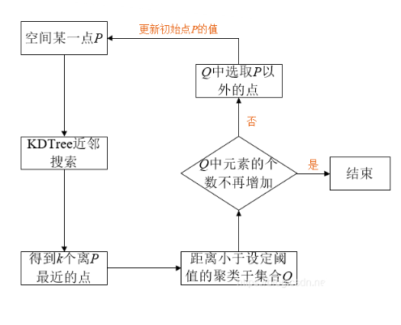

# PCL-C++ 5_点云分割(聚类)

点云分割（聚类）是根据空间、几何和纹理等特征对点云进行划分，使得同一划分区域内的点云拥有相似的特征 。 点云的有效分割往往是许多应用的前提。例如，在逆向工程CAD/CAM 领域，对零件的不同扫描表面进行分割，然后才能更好地进行孔洞修复、曲面重建、特征描述和提取，进而进行基于 3D内容的检索、组合重用等。在激光遥感领域，同样需要对地面、物体首先进行分类处理，然后才能进行后期地物的识别、重建。

PCL 库内现有实现的是鲁棒性比较好的 Cluster 聚类分割和 RANSAC 基于随机采样一致性的分割。

## 1. RANSAC 聚类

基于模型的 RANSAC 聚类和模型滤波器，RANSAC 拟合算法有相似之处。

### 平面模型分割

```c++
#include <iostream>
#include <pcl/ModelCoefficients.h>
#include <pcl/io/pcd_io.h>
#include <pcl/point_types.h>
#include <pcl/sample_consensus/method_types.h>
#include <pcl/sample_consensus/model_types.h>
#include <pcl/segmentation/sac_segmentation.h>

int main(int argc, char **argv) {
    pcl::PointCloud<pcl::PointXYZ>::Ptr cloud(new pcl::PointCloud<pcl::PointXYZ>);

    /***
     * 生成15个无序点云，x,y为随机数，z为1.0
     * 将points中0、3、6索引位置的z值进行修改，将之作为离群值
     */
    // Fill in the cloud data
    cloud->width = 15;
    cloud->height = 1;
    cloud->points.resize(cloud->width * cloud->height);

    // Generate the data
    for (std::size_t i = 0; i < cloud->points.size(); ++i) {
        cloud->points[i].x = 1024 * rand() / (RAND_MAX + 1.0f);
        cloud->points[i].y = 1024 * rand() / (RAND_MAX + 1.0f);
        cloud->points[i].z = 1.0;
    }

    // Set a few outliers
    cloud->points[0].z = 2.0;
    cloud->points[3].z = -2.0;
    cloud->points[6].z = 4.0;

    std::cerr << "Point cloud data: " << cloud->points.size() << " points" << std::endl;
    for (std::size_t i = 0; i < cloud->points.size(); ++i)
        std::cerr << "    " << cloud->points[i].x << " "
                  << cloud->points[i].y << " "
                  << cloud->points[i].z << std::endl;

    /**
     * 创建分割时所需要的模型系数对象 coefficients 及存储内点的点索引集合对象 inliers .
     * 这也是我们指定“阈值距离DistanceThreshold”的地方，该距离阈值确定点必须与模型有多远才能被视为离群点。
     * 这里距离阔值是 0.01m ,即只要点到 z=1 平面距离小于该阈值的点都作为内部点看待,而大于该阁值的则看做离群点。
     * 我们将使用RANSAC方法（`pcl::SAC_RANSAC`）作为可靠的估计器。因为RANSAC比较简单（其他强大的估算工具也以此为基础，并添加了其他更复杂的概念）。
     */
    pcl::ModelCoefficients::Ptr coefficients(new pcl::ModelCoefficients);
    pcl::PointIndices::Ptr inliers(new pcl::PointIndices);
    // Create the segmentation object
    pcl::SACSegmentation<pcl::PointXYZ> seg;
    // 可选配置：是否优化模型系数
    seg.setOptimizeCoefficients(true);
    // 必选配置：设置分割的模型类型、分割算法、距离阈值、输入点云
    seg.setModelType(pcl::SACMODEL_PLANE);
    seg.setMethodType(pcl::SAC_RANSAC);
    seg.setDistanceThreshold(0.01);
    seg.setInputCloud(cloud);
    // 执行分割操作，并存储分割结果保存到点集合 inliers 及存储平面模型系数 coefficients
    seg.segment(*inliers, *coefficients);

    if (inliers->indices.size() == 0) {
        PCL_ERROR ("Could not estimate a planar model for the given dataset.");
        return (-1);
    }
//    此段代码用来打印出估算的平面模型的参数（以 ax+by+ca+d=0 形式）,详见RANSAC采样一致性算法的SACMODEL_PLANE平面模型
    std::cerr << "Model coefficients: " << coefficients->values[0] << " "
              << coefficients->values[1] << " "
              << coefficients->values[2] << " "
              << coefficients->values[3] << std::endl;

    std::cerr << "Model inliers: " << inliers->indices.size() << std::endl;
    for (std::size_t i = 0; i < inliers->indices.size(); ++i)
        std::cerr << inliers->indices[i] << "    " << cloud->points[inliers->indices[i]].x << " "
                  << cloud->points[inliers->indices[i]].y << " "
                  << cloud->points[inliers->indices[i]].z << std::endl;

    return (0);
}
```

### 圆柱模型分割

```c++
#include <pcl/ModelCoefficients.h>
#include <pcl/io/pcd_io.h>
#include <pcl/point_types.h>
#include <pcl/filters/extract_indices.h>
#include <pcl/filters/passthrough.h>
#include <pcl/features/normal_3d.h>
#include <pcl/sample_consensus/method_types.h>
#include <pcl/sample_consensus/model_types.h>
#include <pcl/segmentation/sac_segmentation.h>

typedef pcl::PointXYZ PointT;

int
main(int argc, char **argv) {
    // All the objects needed
    pcl::PCDReader reader;                          // PCD文件读取对象
    pcl::PassThrough<PointT> pass;                  // 直通滤波器
    pcl::NormalEstimation<PointT, pcl::Normal> ne;  // 法线估算对象
    pcl::SACSegmentationFromNormals<PointT, pcl::Normal> seg;   // 分割器
    pcl::PCDWriter writer;                                      // PCD文件写出对象
    pcl::ExtractIndices<PointT> extract;                        // 点提取对象
    pcl::ExtractIndices<pcl::Normal> extract_normals;           // 法线提取对象
    pcl::search::KdTree<PointT>::Ptr tree(new pcl::search::KdTree<PointT>());

    // Datasets
    pcl::PointCloud<PointT>::Ptr cloud(new pcl::PointCloud<PointT>);
    pcl::PointCloud<PointT>::Ptr cloud_filtered(new pcl::PointCloud<PointT>);
    pcl::PointCloud<pcl::Normal>::Ptr cloud_normals(new pcl::PointCloud<pcl::Normal>);
    pcl::PointCloud<PointT>::Ptr cloud_filtered2(new pcl::PointCloud<PointT>);
    pcl::PointCloud<pcl::Normal>::Ptr cloud_normals2(new pcl::PointCloud<pcl::Normal>);
    pcl::ModelCoefficients::Ptr coefficients_plane(new pcl::ModelCoefficients), coefficients_cylinder(
            new pcl::ModelCoefficients);
    pcl::PointIndices::Ptr inliers_plane(new pcl::PointIndices), inliers_cylinder(new pcl::PointIndices);

    // Read in the cloud data 读取点云数据
    reader.read("test.pcd", *cloud);
    std::cerr << "PointCloud has: " << cloud->points.size() << " data points." << std::endl;

    // Build a passthrough filter to remove spurious NaNs
    pass.setInputCloud(cloud);
    pass.setFilterFieldName("z");
    pass.setFilterLimits(0, 1.5);
    pass.filter(*cloud_filtered);
    std::cerr << "PointCloud after filtering has: " << cloud_filtered->points.size() << " data points." << std::endl;

    // Estimate point normals
    ne.setSearchMethod(tree);
    ne.setInputCloud(cloud_filtered);
    ne.setKSearch(50);
    ne.compute(*cloud_normals);

    // Create the segmentation object for the planar model and set all the parameters
    seg.setOptimizeCoefficients(true);
    seg.setModelType(pcl::SACMODEL_NORMAL_PLANE);
    seg.setNormalDistanceWeight(0.1);
    seg.setMethodType(pcl::SAC_RANSAC);
    seg.setMaxIterations(100);
    seg.setDistanceThreshold(0.03);
    seg.setInputCloud(cloud_filtered);
    seg.setInputNormals(cloud_normals);
    // Obtain the plane inliers and coefficients
    seg.segment(*inliers_plane, *coefficients_plane);
    std::cerr << "Plane coefficients: " << *coefficients_plane << std::endl;

    // Extract the planar inliers from the input cloud
    extract.setInputCloud(cloud_filtered);
    extract.setIndices(inliers_plane);
    extract.setNegative(false);

    // Write the planar inliers to disk
    pcl::PointCloud<PointT>::Ptr cloud_plane(new pcl::PointCloud<PointT>());
    extract.filter(*cloud_plane);
    std::cerr << "PointCloud representing the planar component: " << cloud_plane->points.size() << " data points."
              << std::endl;
    writer.write("table_scene_mug_stereo_textured_plane.pcd", *cloud_plane, false);

    // Remove the planar inliers, extract the rest
    extract.setNegative(true);
    extract.filter(*cloud_filtered2);
    extract_normals.setNegative(true);
    extract_normals.setInputCloud(cloud_normals);
    extract_normals.setIndices(inliers_plane);
    extract_normals.filter(*cloud_normals2);

    // Create the segmentation object for cylinder segmentation and set all the parameters
    // 设置圆柱体分割对象参数
    seg.setOptimizeCoefficients(true);
    seg.setModelType(pcl::SACMODEL_CYLINDER);   // 设置分割模型为圆柱体
    seg.setMethodType(pcl::SAC_RANSAC);         // 设置采用RANSAC算法进行参数估计
    seg.setNormalDistanceWeight(0.1);           // 设置表面法线权重系数
    seg.setMaxIterations(10000);                // 设置最大迭代次数10000
    seg.setDistanceThreshold(0.05);             // 设置内点到模型的最大距离 0.05m
    seg.setRadiusLimits(0, 0.1);                // 设置圆柱体的半径范围0 -> 0.1m
    seg.setInputCloud(cloud_filtered2);
    seg.setInputNormals(cloud_normals2);

    // Obtain the cylinder inliers and coefficients
    seg.segment(*inliers_cylinder, *coefficients_cylinder);
    std::cerr << "Cylinder coefficients: " << *coefficients_cylinder << std::endl;

    // Write the cylinder inliers to disk
    extract.setInputCloud(cloud_filtered2);
    extract.setIndices(inliers_cylinder);
    extract.setNegative(false);
    pcl::PointCloud<PointT>::Ptr cloud_cylinder(new pcl::PointCloud<PointT>());
    extract.filter(*cloud_cylinder);
    if (cloud_cylinder->points.empty())
        std::cerr << "Can't find the cylindrical component." << std::endl;
    else {
        std::cerr << "PointCloud representing the cylindrical component: " << cloud_cylinder->points.size()
                  << " data points." << std::endl;
        writer.write("table_scene_mug_stereo_textured_cylinder.pcd", *cloud_cylinder, false);
    }
    return (0);
}
```

## 2. Cluster 聚类

Cluster 聚类是基于欧氏距离聚类的聚类算法。为了加速该聚类算法，通常配合 KNN 使用。



距离判断准则为欧氏距离。对于空间某点 $P$ ，通过 KNN 算法找到 $k$ 个离 $P$ 点最近的点，这些点中距离小于设定阈值的便聚类到集合 $Q$ 中。如果 $Q$ 中元素的数目不在增加，整个聚类过程便结束；否则须在集合 $Q$ 中选取 $P$ 点以外的点，重复上述过程，直到 $Q$ 中元素的数目不在增加为止。

欧式聚类比较适用于**没有连通性的点云聚类分割**。因此，对于现实中的大场景点云，通常需要使用渐进式形态学滤波、简单形态滤波(SMRF)算法或CSF布料模拟算法进行地面点的滤除。（或者先使用平面分割法去除大平面）

```c++
#include <iostream>
#include <pcl/point_types.h>
#include <pcl/io/pcd_io.h>
#include <pcl/filters/extract_indices.h>       // 根据索引提取点云
#include <pcl/filters/voxel_grid.h>            // 体素滤波
#include <pcl/kdtree/kdtree.h>                 // kd树
#include <pcl/sample_consensus/method_types.h> // 采样方法
#include <pcl/sample_consensus/model_types.h>  // 采样模型
#include <pcl/ModelCoefficients.h>             // 模型系数
#include <pcl/segmentation/sac_segmentation.h> // 随机采样分割
#include <pcl/segmentation/extract_clusters.h> // 欧式聚类分割
#include <pcl/visualization/pcl_visualizer.h> 
#include <boost/thread/thread.hpp>

using namespace std;

int
main(int argc, char** argv)
{
    //--------------------------读取桌面场景点云---------------------------------
    pcl::PointCloud<pcl::PointXYZ>::Ptr cloud(new pcl::PointCloud<pcl::PointXYZ>);
    pcl::io::loadPCDFile<pcl::PointXYZ>("test.pcd", *cloud);
    cout << "读取点云: " << cloud->points.size() << " 个." << endl;

    //---------------------------体素滤波下采样----------------------------------
    pcl::VoxelGrid<pcl::PointXYZ> vg;
    pcl::PointCloud<pcl::PointXYZ>::Ptr cloud_filtered(new pcl::PointCloud<pcl::PointXYZ>);
    vg.setInputCloud(cloud);
    vg.setLeafSize(0.01f, 0.01f, 0.01f);
    vg.filter(*cloud_filtered);
    cout << "体素滤波后还有: " << cloud_filtered->points.size() << " 个." << endl;

    //--------------------创建平面模型分割的对象并设置参数-----------------------
    pcl::SACSegmentation<pcl::PointXYZ> seg;
    pcl::PointIndices::Ptr inliers(new pcl::PointIndices);
    pcl::ModelCoefficients::Ptr coefficients(new pcl::ModelCoefficients);
    pcl::PointCloud<pcl::PointXYZ>::Ptr cloud_plane(new pcl::PointCloud<pcl::PointXYZ>);
    seg.setOptimizeCoefficients(true);
    seg.setModelType(pcl::SACMODEL_PLANE);    // 分割模型,平面模型
    seg.setMethodType(pcl::SAC_RANSAC);       // 参数估计方法,随机采样一致性　
    seg.setMaxIterations(100);                // 最大的迭代的次数
    seg.setDistanceThreshold(0.02);           // 设置符合模型的内点阈值

    // -------------模型分割,直到剩余点云数量在30%以上,确保模型点云较好----------
    int i = 0, nr_points = (int)cloud_filtered->points.size();// 下采样前点云数量
    while (cloud_filtered->points.size() > 0.3 * nr_points)

    {
        seg.setInputCloud(cloud_filtered);
        seg.segment(*inliers, *coefficients);// 分割
        if (inliers->indices.size() == 0)
        {
            cout << "Could not estimate a planar model for the given dataset." << endl;
            break;
        }
        //---------------------------根据索引提取点云-------------------------------
        pcl::ExtractIndices<pcl::PointXYZ> extract;
        extract.setInputCloud(cloud_filtered);
        extract.setIndices(inliers);         // 提取符合平面模型的内点
        extract.setNegative(false);
        //--------------------------平面模型内点------------------------------------
        extract.filter(*cloud_plane);
        cout << "平面模型: " << cloud_plane->points.size() << "个点." << endl;
        //-------------------移去平面局内点，提取剩余点云---------------------------
        pcl::PointCloud<pcl::PointXYZ>::Ptr cloud_f(new pcl::PointCloud<pcl::PointXYZ>);
        extract.setNegative(true);
        extract.filter(*cloud_f);
        *cloud_filtered = *cloud_f;         // 剩余点云
    }

    // --------------剩余的点云团,　使用欧式聚类的算法对点云聚类分割----------
    pcl::search::KdTree<pcl::PointXYZ>::Ptr tree(new pcl::search::KdTree<pcl::PointXYZ>);
    tree->setInputCloud(cloud_filtered);              // 剩余的点云
    vector<pcl::PointIndices> cluster_indices;        // 点云团索引
    pcl::EuclideanClusterExtraction<pcl::PointXYZ> ec;// 欧式聚类对象
    ec.setClusterTolerance(0.02);                     // 设置近邻搜索的搜索半径为2cm（也即两个不同聚类团点之间的最小欧氏距离）
    ec.setMinClusterSize(100);                        // 设置一个聚类需要的最少的点数目为100
    ec.setMaxClusterSize(25000);                      // 设置一个聚类需要的最大点数目为25000
    ec.setSearchMethod(tree);                         // 设置点云的搜索机制
    ec.setInputCloud(cloud_filtered);
    ec.extract(cluster_indices);                      // 从点云中提取聚类，并将点云索引保存在cluster_indices中
    pcl::PointCloud<pcl::PointXYZ>::Ptr cloud_cluster_all(new pcl::PointCloud<pcl::PointXYZ>);
    //------------迭代访问点云索引cluster_indices,直到分割处所有聚类---------------
    int j = 0;
    for (vector<pcl::PointIndices>::const_iterator it = cluster_indices.begin(); it != cluster_indices.end(); ++it)
    {
        pcl::PointCloud<pcl::PointXYZ>::Ptr cloud_cluster(new pcl::PointCloud<pcl::PointXYZ>);
        //创建新的点云数据集cloud_cluster，将所有当前聚类写入到点云数据集中
        for (vector<int>::const_iterator pit = it->indices.begin(); pit != it->indices.end(); ++pit)
            cloud_cluster->points.push_back(cloud_filtered->points[*pit]); //获取每一个点云团的点

        cloud_cluster->width = cloud_cluster->points.size();
        cloud_cluster->height = 1;
        cloud_cluster->is_dense = true;

        cout << "PointCloud representing the Cluster: " << cloud_cluster->points.size() << " data points." << endl;
        stringstream ss;
        ss << "cloud_cluster_" << j << ".pcd";
        pcl::PCDWriter writer;
        writer.write<pcl::PointXYZ>(ss.str(), *cloud_cluster, false);
        j++;

        *cloud_cluster_all += *cloud_cluster;
    }
    pcl::io::savePCDFileASCII("cloud_cluster_all.pcd", *cloud_cluster_all);

    //------------------------点云显示------------------------------------
    pcl::visualization::PCLVisualizer viewer("3D Viewer");
    viewer.setBackgroundColor(0, 0, 0);
    //viewer.addCoordinateSystem (1.0);
    viewer.initCameraParameters();
    //--------------------平面上的点云　红色------------------------------
    pcl::visualization::PointCloudColorHandlerCustom<pcl::PointXYZ> cloud_plane_handler(cloud_plane, 255, 0, 0);
    viewer.addPointCloud(cloud_plane, cloud_plane_handler, "plan point");
    viewer.setPointCloudRenderingProperties(pcl::visualization::PCL_VISUALIZER_POINT_SIZE, 1, "plan point");

    //--------------------平面外的点云　绿色------------------------------
    pcl::visualization::PointCloudColorHandlerCustom<pcl::PointXYZ> cloud_cluster_handler(cloud_cluster_all, 0, 255, 0);
    viewer.addPointCloud(cloud_cluster_all, cloud_cluster_handler, "cloud_cluster point");
    viewer.setPointCloudRenderingProperties(pcl::visualization::PCL_VISUALIZER_POINT_SIZE, 1, "cloud_cluster point");

    while (!viewer.wasStopped()) {
        viewer.spinOnce(100);
    }
    return (0);
}
```

