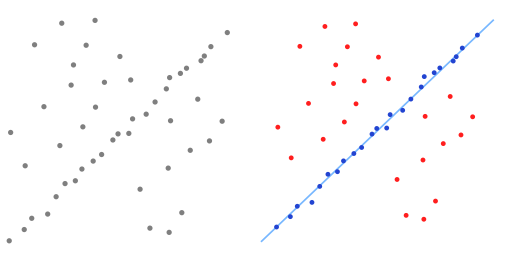

# PCL-C++ 5_点云分割(1)—点云拟合

## 1. 采样一致性算法

在计算机视觉领域广泛的使用各种不同的采样一致性参数估计算法用于排除错误的样本，样本不同对应的应用不同，例如剔除错误的配准点对，分割出处在模型上的点集。

PCL 中以随机采样一致性算法（RANSAC）为核心，同时实现了五种类似与随机采样一致形算法的随机参数估计算法，例如随机采样一致性算法（RANSAC），最大似然一致性算法（MLESAC），最小中值方差一致性算法（LMedS）等，所有估计参数算法都符合一致性原则。

在 PCL 中设计的采样一致性算法的应用主要就是对点云进行分割（拟合），根据设定的不同的几个模型，估计对应的几何参数模型的参数，在一定容许的范围内分割出在模型上的点云。

### RANSAC 随机采样一致性算法

RANSAC 是一种迭代方法，用于从包含异常值的一组数据中估计数学模型的参数。

RANSAC 算法假定我们要查看的所有数据均由内部值和异常值组成。可以用带有一组特定参数值的模型来解释离群值，而离群值在任何情况下都不适合该模型。其过程可以从数据中估计所选模型的最佳参数。



- RANSAC 算法过程

  RANSAC通过反复选择数据中的一组随机子集来达成目标。被选取的子集被假设为局内点，并用下述方法进行验证：

  > 1. 有一个模型适应于假设的局内点，即所有的未知参数都能从假设的局内点计算得出。
  > 2. 用1中得到的模型去测试所有的其它数据，如果某个点适用于估计的模型，认为它也是局内点。
  > 3. 如果有足够多的点被归类为假设的局内点，那么估计的模型就足够合理。
  > 4. 然后，用所有假设的局内点去重新估计模型，因为它仅仅被初始的假设局内点估计过。
  > 5. 最后，通过估计局内点与模型的错误率来评估模型。

- RANSAC 算法优缺点

  RANSAC 理论上可以剔除离群点的影响，并得到全局最优的参数估计。

  但是 RANSAC 有两个问题：

  > 1. 首先在每次迭代中都要区分局内点和离群点，因此需要事先设定阈值，当模型具有明显的物理意义时，这个阈值还比较容易设定，但是若模型比较抽象时，阈值就不那么容易设定了。而且固定阈值不适用于样本动态变化的应用；
  > 2. 第二个问题是，RANSAC的迭代次数是运行期决定的，不能预知迭代的确切次数（当然迭代次数的范围是可以预测的）。除此之外， RANSAC 只能从一个特定数据集中估计一个模型，当两个（或者更多个）模型存在时，RANSAC 同时找到多个模型。

### LMedS 最小中值法

LMedS 从样本中随机抽出N个样本子集，使用最大似然（通常是最小二乘）对每个子集计算模型参数和该模型的偏差，记录该模型参数及子集中所有样本中偏差居中的那个样本的偏差（即Med偏差），最后选取N个样本子集中Med偏差最小的所对应的模型参数作为要估计的模型参数。

### 采样一致性算法支持的模型

| 模型                             | 模型说明                                                     | 参数                                                         |
| -------------------------------- | ------------------------------------------------------------ | ------------------------------------------------------------ |
| `SACMODEL_PLANE`                 | 用于确定平面模型                                             | `normal_x normal_y normal_z d`（Hessian范式）                |
| `SACMODEL_LINE`                  | 用于确定线模型                                               | `point_on_line.x point_on_line.y point_on_line.z line_direction.x line_direction.y line_direction.z`（一个点和线的方向） |
| `SACMODEL_CIRCLE2D`              | 用于确定平面中的2D圆                                         | `center.x center.y radius`（中心和半径）                     |
| `SACMODEL_CIRCLE3D`              | 用于确定平面中的3D圆                                         | `center.x center.y center.z radius normal.x normal.y normal.z`（中心，半径和法线） |
| `SACMODEL_SPHERE`                | 用于确定球体模型                                             | `center.x center.y center.z radius`（中心和半径）            |
| `SACMODEL_CYLINDER`              | 用于确定圆柱模型                                             | `point_on_axis.x point_on_axis.y point_on_axis.z axis_direction.x axis_direction.y axis_direction.z radius`（轴线上的一个点，轴线方向和半径） |
| `SACMODEL_CONE`                  | 用于确定圆锥模型                                             | `apex.x，apex.y，apex.z，axis_direction.x，axis_direction.y，axis_direction.z， opening_angle`（顶点，轴方向和张开角） |
| `SACMODEL_PARALLEL_LINE`         | 用于在最大指定角度偏差内确定与给定轴平行的线的模型           |                                                              |
| `SACMODEL_PERPENDICULAR_PLANE`   | 用于在最大指定角度偏差内确定垂直于用户指定轴的平面的模型     |                                                              |
| `SACMODEL_NORMAL_PLANE`          | 用于使用附加约束确定平面模型的模型：每个内点的表面法线必须在最大指定角度偏差内平行于输出平面的表面法线 |                                                              |
| `SACMODEL_NORMAL_SPHERE`         | 用于确定球体模型，具有附加的表面法线的约束                   |                                                              |
| `SACMODEL_PARALLEL_PLANE`        | 用于在最大指定角度偏差内确定与用户指定的轴平行的平面的模型   |                                                              |
| `SACMODEL_NORMAL_PARALLEL_PLANE` | 使用附加的曲面法向约束定义3D平面分割的模型，平面法线必须平行于用户指定的轴。（等效于`SACMODEL_NORMAL_PLANE` + `SACMODEL_PERPENDICULAR_PLANE`） |                                                              |
| `SACMODEL_STICK`                 | 3D杆分割模型                                                 |                                                              |

> 实现的一致性估计量：
> ● `SAC_RANSAC` - RANdom SAmple Consensus
> ● `SAC_LMEDS` - Least Median of Squares
> ● `SAC_MSAC` - M-Estimator SAmple Consensus
> ● `SAC_RRANSAC` - Randomized RANSAC
> ● `SAC_RMSAC` - Randomized MSAC
> ● `SAC_MLESAC` - Maximum LikeLihood Estimation SAmple Consensus
> ● `SAC_PROSAC` - PROgressive SAmple Consensus

### 核心代码

```c++
pcl::SampleConsensusModelPlane<pcl::PointXYZ>::Ptr model_plane(new pcl::SampleConsensusModelPlane<pcl::PointXYZ>(cloud));  // 定义平面模型

pcl::RandomSampleConsensus<pcl::PointXYZ> ransac(model_plane);// 定义RANSAC算法模型
ransac.setDistanceThreshold(0.01);// 设定距离阈值
ransac.setMaxIterations(500);     // 设置最大迭代次数
ransac.setProbability(0.99);      // 设置从离群值中选择至少一个样本的期望概率
ransac.computeModel();            // 拟合平面
vector<int> inliers;              // 用于存放内点索引的vector
ransac.getInliers(inliers);       // 获取内点索引
Eigen::VectorXf coeff;
ransac.getModelCoefficients(coeff);  //获取拟合平面参数，coeff分别按顺序保存a,b,c,d
cout << "平面模型系数coeff(a,b,c,d): " << coeff[0] << " \t" << coeff[1] << "\t " << coeff[2] << "\t " << coeff[3] << endl;
```

