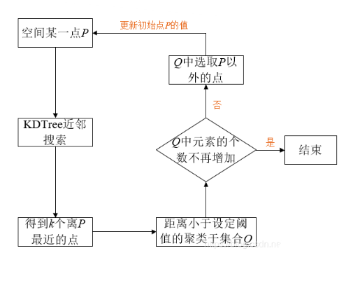

# PCL-C++ 6_点云分割(2)—点云聚类

点云分割（聚类）是根据空间、几何和纹理等特征对点云进行划分，使得同一划分区域内的点云拥有相似的特征 。 点云的有效分割往往是许多应用的前提。例如，在逆向工程CAD/CAM 领域，对零件的不同扫描表面进行分割，然后才能更好地进行孔洞修复、曲面重建、特征描述和提取，进而进行基于 3D内容的检索、组合重用等。在激光遥感领域，同样需要对地面、物体首先进行分类处理，然后才能进行后期地物的识别、重建。

PCL 库内现有实现的是鲁棒性比较好的 Cluster 聚类分割和 RANSAC 基于随机采样一致性的分割。

## 1. Cluster 聚类

Cluster 聚类是基于欧氏距离聚类的聚类算法。为了加速该聚类算法，通常配合 KNN 使用。



距离判断准则为欧氏距离。对于空间某点 $P$ ，通过 KNN 算法找到 $k$ 个离 $P$ 点最近的点，这些点中距离小于设定阈值的便聚类到集合 $Q$ 中。如果 $Q$ 中元素的数目不在增加，整个聚类过程便结束；否则须在集合 $Q$ 中选取 $P$ 点以外的点，重复上述过程，直到 $Q$ 中元素的数目不在增加为止。

欧式聚类比较适用于**没有连通性的点云聚类分割**。因此，对于现实中的大场景点云，通常需要使用渐进式形态学滤波、简单形态滤波(SMRF)算法或CSF布料模拟算法进行地面点的滤除。（或者先使用平面分割法去除大平面）

```c++
pcl::EuclideanClusterExtraction<pcl::PointXYZ> ec;// 欧式聚类对象

ec.setClusterTolerance(0.02);                     // 设置近邻搜索的搜索半径为2cm（也即两个不同聚类团点之间的最小欧氏距离）
ec.setMinClusterSize(100);                        // 设置一个聚类需要的最少的点数目为100
ec.setMaxClusterSize(25000);                      // 设置一个聚类需要的最大点数目为25000
ec.setSearchMethod(tree);                         // 设置点云的搜索机制
ec.setInputCloud(cloud_filtered);
ec.extract(cluster_indices);                      // 从点云中提取聚类，并将点云索引保存在cluster_indices中
```

## 2. KMeans 聚类

KMeans 聚类算法也称为 K 均值聚类算法，在聚类算法中比较成熟，以简单与经典为特征，以距离为切入点。该算法将距离作为相似性的评价参数基准，即认为两个目标距离与相似度呈现正比关系。这一算法将类簇作为多个距离对象组成的部分，因此，可以将紧凑与独立的簇作为最终研究目标。

- KMeans 聚类算法实现步骤：
  1. 规定数值 K 作为最终得到聚类个数的限定；
  2. K 个聚类中心需要从所有数据集合中随机选取；
  3. 当聚类中心确定之后，每当有一个样本被分配给聚类中心时，聚类中心会根据已有的分配对象数据进行新一轮运算，将每个对象与 K 个聚类中心之间的距离计算并得出数据，各个对象离哪一个聚类中心近，就划分到那个聚类中心所属的集合；
  4. 把所有数据归好集合后，一共有 K 个集合。然后重新计算每个集合的聚类中心；
  5. 当最终计算得出的聚类中心与原来随机选取聚类中心之间的距离小于原设定阈值时，即表示系统重新运算得出的聚类中心与初始聚类中心十分相近，该数据系统相对稳定，或者收敛，满足期望效果，此时，算法终止运行，这样的运算过程得到的最终结果误差相对最小；
  6. 如若新计算得出的聚类中心与初始聚类中心之间距离超出原设定阈值，则3 ~ 5 迭代运行。
  
- KMeans 算法优缺点：

  > **优点**：
  >
  > 1. 原理比较简单，实现也是很容易，收敛速度快；
  > 2. 当结果簇是密集的，而簇与簇之间区别明显时，它的效果较好；
  > 3. 主要需要调参的参数仅仅是簇数 K。

  > **缺点**：
  >
  > 1. K 值需要预先给定，很多情况下 K 值的估计是非常困难的；
  > 2. KMeans 算法能够敏锐的察觉到系统最初选取的质心点之间的细微区别，当随机种子点之间存在差异时，其运算得到的聚类结果也会各不相同，对结果影响很大；
  > 3. 对噪音和异常点比较的敏感，因此可以用来检测异常值；
  > 4. 采用迭代方法，可能只能得到局部的最优解，而无法得到全局的最优解。
