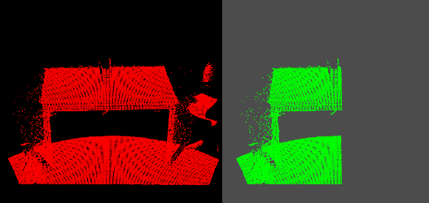
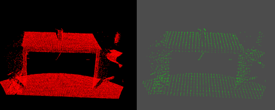
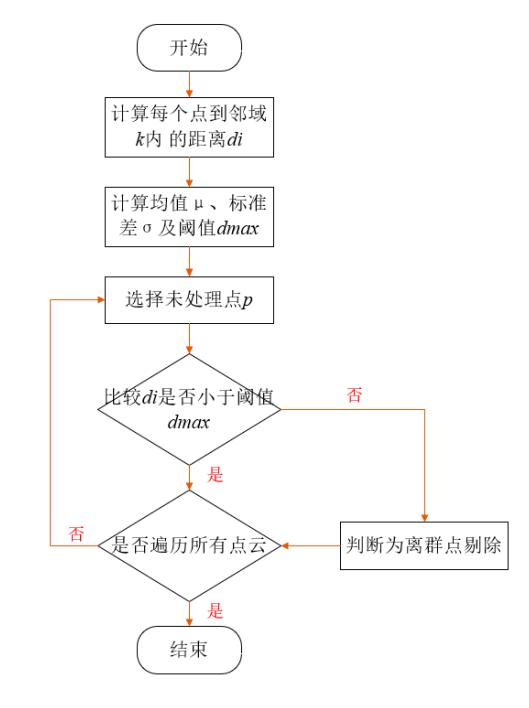
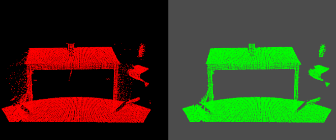
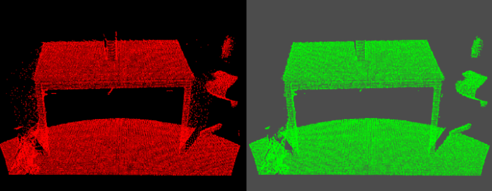
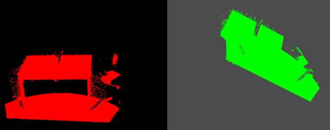
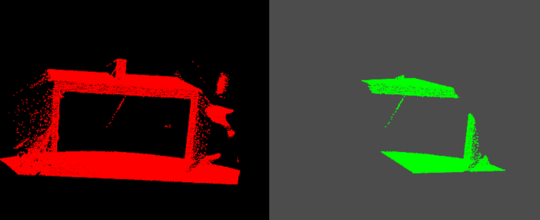

# PCL 4_点云滤波

在获取点云数据时，由于设备精度、操作者经验、环境因素等带来的影响，以及电磁波衍射特性、被测物体表面性质变化和数据拼接配准操作过程的影响，点云数据中将不可避免地出现一些**噪声点**。

实际应用中除了这些测量随机误差产生的噪声点之外，由于受到外界干扰如视线遮挡、障碍物等因素的影响，点云数据中往往存在着一些离主体点云较远的离散点，即**离群点**。不同的获取设备点云噪声结构也有不同。

通过滤波完成的功能还包括孔洞修复、最小信息损失的海量点云数据压缩处理等 。在点云处理流程中滤波处理作为预处理的第一步，往往对后续处理流程影响很大，只有在滤波预处理中将噪声点、离群点、孔洞、数据压缩等 按照后续需求处理，才能够更好地进行配准、特征提取、曲面重建、可视化等后续流程。

PCL中总结了几种需要进行点云滤波处理情况，这几种情况分别如下：

> 1. 点云数据密度不规则需要平滑；
> 2. 因为遮挡等问题造成离群点需要去除；
> 3. 大量数据需要下采样；
> 4. 噪声数据需要去除。

对应的方案如下：

> 1. 按照给定的规则限制过滤去除点；
> 2. 通过常用滤波算法修改点的部分属性；
> 3. 对数据进行下采样。

PCL点云格式分为**有序点云**和**无序点云**：

> 1. 针对有序点云提供了双边滤波、高斯滤波、中值滤波等；
> 2. 针对无序点云提供了体素栅格、随机采样等。

根据传感器的采集数据：

> 1. 一般深度相机采集到的点云的数据是有序点云；
> 2. 激光雷达采集的点云的数据是无序的点云。

## 1. 直通滤波器

`pcl::passthrough`类。

直通滤波器对指定的某一维度进行滤波，**去除指定维度对应范围之外的点**。

首先，指定一个维度以及该维度下的值域；其次，遍历点云中的每个点，判断该点在指定维度上的取值是否在值域内，删除取值不在值域内的点；最后，遍历结束，留下的点即构成滤波后的点云。直通滤波器简单高效，适用于消除背景等操作。

```c++
  /** \brief 设置直通滤波器的滤波限定字段
   * \param[in]  field_name 设置限定字段的名称字符串,例如"x"、"y"、"z"、"intensity"等。
   */
void setFilterFieldName (const std::string &field_name);

  /** \brief 设置滤波限制条件
   * \param[in]  limit_min 最小值 
   * \param[in]  limit_max 最大值
   */
void setFilterLimits (const double &limit_min, const double & limit_max);

  /** \brief 设置返回滤波限制条件外的点还是内部点
   * \param[in]  limit_negative 默认值为 false，输出点云为在设定字段的设定范围内的点集，如果设置为 true 则刚好相反 。
   */
void setFilterLimitsNegative (bool &!limit_negative);
```



## 2. 体素滤波器(下采样)

点云几何结构 不仅是宏观的几何外形，也包括其微观的排列方式，比如横向相似的尺寸，纵向相同的距离。如果使用高分辨率相机等设备对点云进行采集，往往点云会较为密集。 过多的点云数量会对后续分割工作带来困难。体素格滤波器可以达到向下采样同时不破坏点云本身几何结构的功能。

随机下采样虽然效率比体素滤波器高，但会破坏点云微观结构。 使用体素化网格方法实现下采样，即可以减少点的数量 又能保存点云的形状特征，在提高配准，曲面重建，形状识别等算法速度中非常实用。

1. `pcl::VoxelGrid`类。

    对点云数据创建一个三维体素栅格（微小的空间三维立方体的集合），用每个体素重心近似代替体素中的其他点。这种方法比用体素中心来逼近的方法更慢，但它对于采样点对应曲面的表示更为准确。

    > 1. 与使用体素中心和近似体素重心下采样相比，它需要更长的处理时间；
    > 2. 它对嘈杂的输入空间敏感；
    > 3. 它不能准确地表示下垫面（underlying surface）。

    > 1. 依据的点云数据坐标集合，求取 XYZ 三个坐标轴上的最大值和最小值 $X_{max},Y_{max},Z_{max},X_{min},Y_{min},Z_{min}$。
    >
    > 2. 根据 XYZ 三个坐标轴上的最大、最小值求得点云最小包围盒的边长$l_x,l_y,l_z$。
    >
    > 3. 设置体素小栅格的边长$r$，计算体素网格的尺寸：
    >    $$
    >    D_x =⌊\frac{l_x}{r} ⌋ \\
    >    D_y =⌊\frac{l_y}{r} ⌋ \\
    >    D_z =⌊\frac{l_z}{r} ⌋
    >    $$
    >
    > 4. 计算点云中每一个在体素小栅格内的索引$h$：
    >    $$
    >    h_x =⌊\frac{x-x_{min}}{r} ⌋ \\
    >    h_y =⌊\frac{y-y_{min}}{r} ⌋ \\
    >    h_z =⌊\frac{z-z_{min}}{r} ⌋ \\
    >    h = h_x + h_yD_x + h_zD_xD_y
    >    $$
    >
    > 5. 将$h$里的元素按照从小到大的顺序进行排序，计算每个体素小栅格重心，以重心代替小栅格内的所有点。

    ```c++
    // 通过lx,ly,Iz分别设置体素栅格在XYZ 3个方向上的尺寸。
    void setLeafSize(float lx, float ly, float lz);
    
    // 设置是否对全部字段进行下采样,若需要在全部字段下采样则设置参数downsammple为True,仅对XYZ字段下采样则设置为False
    void setDownsampleAllData(bool downsample);
    
    // 设置要使用的体素所需的最小点数
    void setMinimumPointsNumberPerVoxel(unsigned int min_points_per_voxel); 
    
    // 若需要保存叶结构信息以供将来访问则设置参数save_leaf_layout为True,否则为False。
    void setSaveLeafLayout(bool save_leaf_layout);
    ```

    

2. `pcl::ApproximateVoxelGrid`类

   对点云数据创建一个三维体素栅格，然后，在每个体素保留一个最接近体素中心的点，代替体素中所有点。这种计算中心的方法是基于哈希函数完成的，针对数据量巨大的大场景点云，要比`VoxelGrid`体素滤波器计算体素内所有点质心的方法快很多。

	

## 3. 统计滤波器(移除离群点)

`pcl::StatisticalOutlierRemoval`类。

对每一点的邻域进行统计分析，基于点到所有邻近点的距离分布特征，过滤掉一些不满足要求的离群点。该算法对整个输入进行两次迭代：

第一次迭代：

> 1. 对于点云中的每一个点，找到该点的K近邻；
> 2. 计算每个点与它K近邻点的平均距离，结果满足高斯分布；
> 3. 计算这些距离的均值 $\mu$ 和标准差 $\sigma$ ；
> 4. 设置距离阈值 $d_{threshold}=\mu±k·\sigma$，$k$ 为标准差乘数；

第二次迭代：

> 如果点的平均邻域距离在区间  $[\mu-k·\sigma,\mu+k·\sigma]$  ，则该点为内点，予以保留，区间外的点为噪声点，予以删除。



```c++
// 设置标准差乘法器进行距离阈值计算。里边的数字stddev_mult 表示标准差的倍数，1个标准差以上就是离群点。
// 即距离阈值等于:(mean - stddev_mult * stddev, mean + stddev_mult * stddev)。平均邻域距离低于或高于该阈值的点将被划分为内值点或离群点。
void setStddevMulThresh (double stddev_mult);

// 设置查询点近邻点的个数
void setMeanK (int nr_k);
```



## 4. 半径滤波器(移除离群点)

`pcl::RadiusOutlierRemoval`类

首先构建 k-d Tree，对整个输入迭代一次，对于每个点进行半径R邻域搜索，如果邻域点的个数低于某一阈值，则该点将被视为噪声点并被移除。

```c++
//设置查询点的半径范围
void setRadiusSearch(float radius);			

//设置判断是否为离群点的阈值，即半径内至少包括的点数
void setMinNeighborsInRadius(int number);					
```



## 5. 条件滤波器

`pcl::ConditionalRemoval`类。

筛选满足特定条件的点云数据。有两种类型的条件：

> `ConditionAnd`：所有条件都要满足；
> `ConditionOr`：满足一个条件即可；

可以设置一个或多个条件对象，并为条件对象添加比较算子。条件比较算子包含三项：

> 1. 名称：对应于点云`XYZ`字段名称（`x`|`y`|`z`）、强度字段（`intensity`）等。
> 2. 比较运算符：`GT`、`GE`、`LT`、`LE`、`EQ`。

| 运算符 | 含义                           |
| ------ | ------------------------------ |
| `GT`   | greater than 大于              |
| `GE`   | greater than or equal 大于等于 |
| `LT`   | less than 小于                 |
| `LE`   | less than or equal 小于等于    |
| `EQ`   | equal 等于                     |

```c++
// 条件算子的例子
pcl::ConditionAnd<pcl::PointXYZ>::Ptr range_cond(new pcl::ConditionAnd<pcl::PointXYZ>());	//创建条件定义对象range_cond

// 为条件定义对象添加比较算子
range_cond->addComparison(pcl::FieldComparison<pcl::PointXYZ>::ConstPtr(new pcl::FieldComparison<pcl::PointXYZ>("x", pcl::ComparisonOps::GT, -0.1))); // 添加在x字段上大于 -0.1 的比较算子
range_cond->addComparison(pcl::FieldComparison<pcl::PointXYZ>::ConstPtr(new pcl::FieldComparison<pcl::PointXYZ>("x", pcl::ComparisonOps::LT, 1.0))); // 添加在x字段上小于 1.0 的比较算子

cr.setCondition(range_cond);				//用条件定义对象初始化
```

## 6. 投影滤波器

`pcl::ProjectInliers`类。

将点投影到一个参数化模型上，这个参数化模型可以是平面、圆球、圆柱、锥形等进行投影滤波。

| 投影参数                         | 对应描述                                                     |
| -------------------------------- | ------------------------------------------------------------ |
| `SACMODEL_PLANE`                 | 用于确定平面模型。平面的四个系数是它的Hessian Normal形式:    |
| `SACMODEL_LINE`                  | 用于确定线模型。直线的六个系数由直线上的一个点和直线的方向给出 |
| `SACMODEL_CIRCLE2D`              | 用于确定平面上的二维圆。圆的三个系数由圆心和半径给出         |
| `SACMODEL_CIRCLE3D`              | 用于确定平面上的三维圆。圆的七个系数由圆心、半径和法线给出   |
| `SACMODEL_SPHERE`                | 用于确定球体模型。球体的四个系数由其三维中心和半径给出       |
| `SACMODEL_CYLINDER`              | 用于确定圆柱模型。圆柱的七个系数由其轴上的点、轴方向和半径给出 |
| `SACMODEL_CONE`                  | 用于确定圆锥模型。圆锥的七个系数由其顶点的一个点、轴的方向和开口的角度给出 |
| `SACMODEL_TORUS`                 | 圆环，未实现                                                 |
| `SACMODEL_PARALLEL_LINE`         | 在规定的最大角度偏差范围内，确定与给定轴平行的线的一种模型。线系数类似于SACMODEL_LINE。 |
| `SACMODEL_PERPENDICULAR_PLANE`   | 在指定的最大角度偏差范围内，确定垂直于用户指定轴的平面的模型。平面系数类似于SACMODEL_PLANE。 |
| `SACMODEL_PARALLEL_LINES`        | 未实现                                                       |
| `SACMODEL_NORMAL_PLANE`          | 使用附加约束来确定平面模型的一种模型:在最大指定的角度偏差范围内，每个内点的表面法线必须与输出平面的表面法线平行。平面系数类似于SACMODEL_PLANE。 |
| `SACMODEL_NORMAL_SPHERE`         | 类似于SACMODEL_SPHERE，但是附加了表面法线约束。              |
| `SACMODEL_PARALLEL_PLANE`        | 在指定的最大角度偏差范围内，确定平行于用户指定轴的平面的模型。平面系数类似于SACMODEL_PLANE。 |
| `SACMODEL_NORMAL_PARALLEL_PLANE` | 定义使用附加表面法向约束的3D平面分割模型。平面法线必须与用户指定的轴平行。因此，SACMODEL_NORMAL_PARALLEL_PLANE等价于SACMODEL_NORMAL_PLANE + sacmodel_orthicular_plane。平面系数类似于SACMODEL_PLANE。 |
| `SACMODEL_STICK`                 | 一种三维棒分割模型。STICK是用户指定最小/最大宽度的一条线。   |

```c++
// 通过用户给定的参数设置使用的模型类型,参数Model为模型类型。
void setModelType (int model);

// 设定指向模型系数的指针。model为指向模型系数的指针，对于不同的模型,有不同系数对象。(pcl::ModelCoefficients::Ptr类型)
void setModelCoefficients (const ModelCoefficientsConstPtr &model);

// 设置返回所有点还是仅返回投影内点后得到的点云。
void setCopyAllData(bool val);
```



## 7. 模型滤波器

`pcl::ModelOutlierRemoval`类。

根据点到模型的距离，设置距离阈值过滤非模型点。


## 8. 空间裁剪

### CropHull 滤波器

`pcl::crop_hull`类。

获取点云在 3D 封闭曲面上或 2D 封闭多边形内或外部的点。

流程：读入点云 -> 设置封闭范围顶点 -> 创建凸包对象 -> 执行 CropHull 滤波 -> 保存滤波点云。

```c++
// 设置外壳索引对应的点云 points
void setHullCloud (PointCloudPtr points);

// 设置外壳所要使用的维度，该值的设置要对应于pcl::ConvexHull 和pcl::ConcaveHull类所产生的多边形外壳的维度。参数dim是用于点云滤波的凸多边形的维数(值为2或3)。
void  setDim (int dim);
```

```c++
#include <iostream>
#include <pcl/io/pcd_io.h>
#include <pcl/point_types.h>
#include <pcl/filters/crop_hull.h>
#include <pcl/surface/convex_hull.h> // 凸包头文件
#include <pcl/visualization/cloud_viewer.h>

using namespace  std;

int main(int argc, char** argv)
{
	// 读取点云
	pcl::PointCloud<pcl::PointXYZ>::Ptr cloud(new pcl::PointCloud<pcl::PointXYZ>);
	pcl::PCDReader reader;
	reader.read("E://data//pig.pcd", *cloud);
    
	// 为了构造2D封闭多边形，首先输入2D平面点云，这些平面点是2D封闭多边形的顶点。
	pcl::PointCloud<pcl::PointXYZ>::Ptr bb(new pcl::PointCloud<pcl::PointXYZ>);
	//bb->push_back(pcl::PointXYZ(0.1, 0.1, 0));//四个顶点即可
	bb->push_back(pcl::PointXYZ(0.1, -0.1, 0));
	bb->push_back(pcl::PointXYZ(-0.1, 0.1, 0));
	bb->push_back(pcl::PointXYZ(-0.1, -0.1, 0));
	bb->push_back(pcl::PointXYZ(0.15, 0.1, 0));
    
	// 对上述平面点构造凸包
	pcl::ConvexHull<pcl::PointXYZ> hull;      // 创建凸包对象
	hull.setInputCloud(bb);                   // 设置输入点云
	hull.setDimension(2);                     // 设置凸包维度
	vector<pcl::Vertices> polygons;           // 设置pcl:Vertices类型的向量，用于保存凸包顶点
	pcl::PointCloud<pcl::PointXYZ>::Ptr surface_hull(new pcl::PointCloud<pcl::PointXYZ>);//该点云用于描述凸包形状
	hull.reconstruct(*surface_hull, polygons);// 计算2D凸包结果
    
	// 创建CropHull对象，滤波得到2D封闭凸包范围内的点云，此处的维度需要与输入凸包维度一致
	pcl::PointCloud<pcl::PointXYZ>::Ptr objects(new pcl::PointCloud<pcl::PointXYZ>);
	pcl::CropHull<pcl::PointXYZ> bb_filter;  // 创建CropHull对象
	bb_filter.setDim(2);                     // 设置维度
	bb_filter.setInputCloud(cloud);          // 设置需要滤波的点云
	bb_filter.setHullIndices(polygons);      // 输入封闭多边形的顶点
	bb_filter.setHullCloud(surface_hull);    // 输入封闭多边形的形状
	bb_filter.filter(*objects);              // 执行CropHull滤波，储存结果到objects
	cout << objects->size() << endl;
    
	// 可视化
	boost::shared_ptr<pcl::visualization::PCLVisualizer> viewer(new pcl::visualization::PCLVisualizer("crophull display"));
	//for_visualizer_v->setBackgroundColor(255,255,255);
	// 原始点云
	int v1(0);
	viewer->createViewPort(0.0, 0.0, 0.33, 1, v1);
	viewer->setBackgroundColor(0, 255, 0, v1);
	viewer->addPointCloud(cloud, "cloud", v1);
	viewer->setPointCloudRenderingProperties(pcl::visualization::PCL_VISUALIZER_COLOR, 255, 0, 0, "cloud");
	viewer->setPointCloudRenderingProperties(pcl::visualization::PCL_VISUALIZER_POINT_SIZE, 3, "cloud");
	viewer->addPolygon<pcl::PointXYZ>(surface_hull, 0, .069 * 255, 0.2 * 255, "backview_hull_polyline1", v1);
	// 封闭2D多边形凸包结果
	int v2(0);
	viewer->createViewPort(0.33, 0.0, 0.66, 1, v2);
	viewer->setBackgroundColor(0, 0, 255, v2);
	viewer->addPointCloud(surface_hull, "surface_hull", v2);
	viewer->setPointCloudRenderingProperties(pcl::visualization::PCL_VISUALIZER_COLOR, 255, 0, 0, "surface_hull");
	viewer->setPointCloudRenderingProperties(pcl::visualization::PCL_VISUALIZER_POINT_SIZE, 8, "surface_hull");
	viewer->addPolygon<pcl::PointXYZ>(surface_hull, 0, .069 * 255, 0.2 * 255, "backview_hull_polyline", v2);
	// CropHull滤波结果
	int v3(0);
	viewer->createViewPort(0.66, 0.0, 1, 1, v3);
	viewer->setBackgroundColor(0, 255, 0, v3);
	viewer->addPointCloud(objects, "objects", v3);
	viewer->setPointCloudRenderingProperties(pcl::visualization::PCL_VISUALIZER_COLOR, 255, 0, 0, "objects");
	viewer->setPointCloudRenderingProperties(pcl::visualization::PCL_VISUALIZER_POINT_SIZE, 3, "objects");

	while (!viewer->wasStopped())
	{
		viewer->spinOnce(1000);
	}
	return 0;
}
```



> `setDimension()`和`CH.setDim()`的维度应保持一致
>
> 1. 当维度设置为2时，封闭区域为2D封闭多边形，只有X和Y两个维度。因此，该封闭多边形在三维空间中表示为垂直于XOY面的竖直曲面。得到的是曲面内部或外部的点云。
> 2. 当维度设置为3时，封闭区域为3D封闭曲面，仅得到位于该封闭曲面上的点。

### CropBox 滤波器

给出一个包围盒，获取包围盒内部点云。

### BoxClipper3D 滤波器

在 3D 中实现盒子裁剪器。实际上，它允许仿射变换，因此任何平行六面体都可以处于一般姿势。仿射变换用于在裁剪点之前对其进行变换，裁剪时使用以原点为中心的单位立方体，每个维度的延伸范围为 -1 到 1。

### Clipper3D 滤波器

略

## 9. 双边滤波器(噪声去除)

`pcl::BilateralFilter`类。

双边滤波算法，是通过取邻近采样点的加权平均来修正当前采样点的位置，从而达到滤波效果。同时也会有选择地剔除部分与当前采样点“差异”太大的相邻采样点，从而达到保持原特征的目的。

> 该类的实现利用的并非`XYZ`字段的数据进行，而是利用强度数据进行双边滤波算法的实现，所以在使用该类时点云的类型必须有强度字段，否则无法进行双边滤波处理。

```c++
// 设置高斯双边滤波的窗口(卷积核)的一半大小
void  setHalfSize (const double sigma_s);

// 设置标准差参数
void  setStdDev (const double sigma_r);
```

## 10. 高斯滤波器(噪声去除)

使用高斯卷积核对点云进行平滑（模糊）处理。每一个输出图片中的强度都是其输入图片中周围邻居强度的加权求和结果。其核心就是一个核函数的卷积操作，对点云进行低通滤波。
