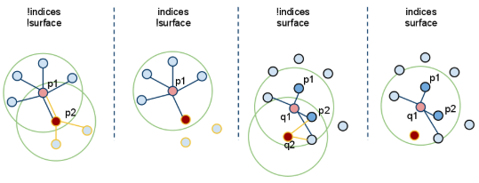
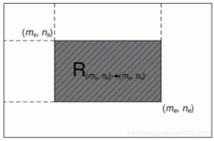
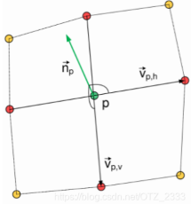
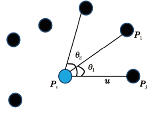
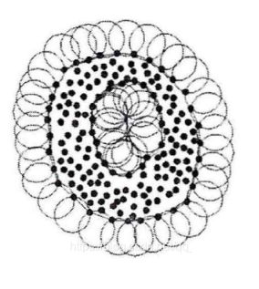
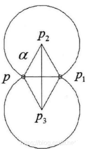

# PCL 点云属性

## 1. 输入数据处理

 `pcl::Feature` 类以以下方式接受输入数据：

1. `setInputCloud(PointCloudConstPtr &input)`：输入 `input` 点云数据集中所有的点，任何特征估计类都会尝试估计给定输入点云中每一个点的特征。
2. `setInputCloud(PointCloudConstPtr &input)` 和 `setIndices (IndicesConstPtr &index)` 结合：表示输入的是根据索引 `index` 在 `input` 中提取的子集，任何特征估计类都会尝试估计给定输入点云中带有索引的点的特征。
3. `setInputCloud(PointCloudConstPtr &input)`和 `setSearchSurface(PointCloudConstPtr &surface)` 结合：表示输入的是根据搜索面 `surface` 在 `input` 中提取的子集，任何特征估计类都会尝试估计给定输入点云中在搜索面上点的特征。



> - `setIndices()=false,setSearchSurface()=false`：无索引，无指定搜索面，搜索`setInputCloud()` 中输入的原始点云上每一个点的邻域。(首先估计 $p_1$ 最近邻，然后估计 $p_2$ 最近邻)；
> - `setIndices()=true,setSearchSurface()=false`：有索引，无指定搜索面，搜索`setInputCloud()` 中输入的原始点云上每一个点的邻域，特征估计方法只计算在给定索引点的特征。($p_2$ 不在索引中，不进行特征估计)；
> - `setIndices()=false, setSearchSurface()=true`：无索引，有指定搜索面，搜索指定的点云上每一个点的邻域。在 `setSearchSurface()` 给出的搜索表面中进行输入点云中每个点的最近邻搜索，而不是在 `setInputCloud()` 中。( $P$ 为 $Q$ 的搜索面，$q_1$，$q_2$ 的近邻点在 $P$ 中进行搜索)

**当有一个非常密集的输入点云数据集时，但是不想对所有点处进行特征估计，而是希望在找到的一些关键点处，或者在点云的下采样中进行特征估计。此时通过 `setInputCloud()` 来把下采样后的点云/关键点传递给特征估计算法，将原始数据通过 `setSearchSurface()` 设置为搜索集合，从而提高程序的运行效率。**

## 2. 点云法线

### 法向量估计

基于局部表面拟合的方法进行法向量估计，点云的采样表面处处光滑的情况下，任何点的局部邻域都可以用平面进行很好的拟合。

为此，对于点云中的每个扫描点 $p$，搜索到与其最近邻的 $K$ 个相邻点，然后计算这些点最小二乘意义上的局部平面 $P$，此平面可以表示为：
$$
P(\vec n,d) = argmin \sum^k_{i=1}(\vec n \cdot p_i - d)^2
$$
式中，$\vec n$ 为平面 $P$ 的法向量，$d$ 为 $P$ 到坐标原点的距离。

可以认为由 $K$ 个最近邻点拟合出的平面的法向量即当前扫描点的法向量。平面 $P$ 的法向量可以由主成分分析得到。

$P$ 经过其 $K$ 邻域点的质心 $p_0$ ，且法向量 $\vec{n}$ 满足 $||\vec{n}||=1$ 。
$$
M = \frac{1}{K}\sum^K_1(p_i-p_0)(p_i-p_0)^T
$$
对协方差矩阵 $M$ 进行特征值分解，求得 $M$ 的各特征值，$M$ 的最小特征值所对应的特征向量即 $P$ 的法向量。

> 协方差矩阵描述了数据的散布方向，最小特征值意味着数据在这个方向上的变化最小，即点几乎都沿着某个平面分布，而垂直于这个平面的方向变化最小。

- 法向量定向

  法向量具有二义性，即只是得到了法向量所在的直线，而没有确定以直线的哪个方向为法向量的最终方向。

  假设点云足够稠密且采样平面处处光滑，那么相邻两点的法向量会接近于平行。令 $\vec{n_i},\vec{n_j}$ 为相邻两点 $x_i,x_j$ 的法向量，如果法向量的方向是一致的，那么 $\vec{n_i}\cdot\vec{n_j}\approx1$ ，若此内积为负，则说明其中某个点的法向量需要被翻转。因此，首先为点云中某个点设定一个法向量朝向，然后遍历其他所有点，若当前点法向量设定为 $\vec{n_i}$，$\vec{n_j}$ 为下一个要遍历的点，如果 $\vec{n_i}\cdot\vec{n_j}<0$，则将 $ \vec{n_j}$ 翻转，否则保持不变。

```c++
    // 计算点云的法线
    std::cout << "\n=== Step 1: Computing Point Cloud Normals ===" << std::endl;
    auto normal_start_time = std::chrono::steady_clock::now();

    // 创建 OMP 加速的法线估计器
    pcl::NormalEstimationOMP<pcl::PointXYZ, pcl::Normal> normal_estimator;

    int threads_count = 10; // 定义一个变量来记录我们使用的线程数
    normal_estimator.setNumberOfThreads(threads_count);
    std::cout << "Using OMP with " << threads_count << " threads." << std::endl; // 使用变量

    normal_estimator.setInputCloud(cloud);
    pcl::search::KdTree<pcl::PointXYZ>::Ptr tree(new pcl::search::KdTree<pcl::PointXYZ>());
    normal_estimator.setSearchMethod(tree);
    normal_estimator.setKSearch(10); // 保持原参数

    pcl::PointCloud<pcl::Normal>::Ptr normals(new pcl::PointCloud<pcl::Normal>);
    normal_estimator.compute(*normals); // 计算法线

    auto normal_end_time = std::chrono::steady_clock::now();
    auto normal_duration = std::chrono::duration_cast<std::chrono::milliseconds>(normal_end_time - normal_start_time);
    std::cout << "Normals computed: " << normals->size() << std::endl;
    std::cout << "Normal computation time: " << normal_duration.count() << " ms" << std::endl;

    // 检查并清理法线中的 NaN 值
    int nan_count = 0;
    for (auto &normal : normals->points)
    {
        // 如果法线的模长是 NaN, 或者法线三个分量中有任意一个是NaN/无穷大
        if (!pcl::isFinite(normal))
        {
            nan_count++;
            // 将无效的法线设置为一个默认值, 以便可视化
            normal.normal_x = normal.normal_y = normal.normal_z = 0.0;
            normal.curvature = 0.0;
        }
    }
    if (nan_count > 0)
    {
        std::cout << "\nWarning: Found and fixed " << nan_count
                  << " invalid normals (containing NaN/Inf). They are set to zero vector for display."
                  << std::endl;
    }
    else
    {
        std::cout << "All normals are valid." << std::endl;
    }
```

### 积分图

> 参考链接：[链接](https://blog.csdn.net/OTZ_2333/article/details/107917018)

`pcl::IntegralImageNormalEstimation`类。

积分图像是对有序点云进行法线估计的一种方法。该算法将点云视为深度图像，并通过考虑相邻点之间的关系来创建在其上计算法线的某些矩形区域，而无需在诸如 KD 树的搜索结构上运行查找。因此，它的计算效率非常高，通常可在一瞬间计算出法线。**该方法仅适用于有序点云。**

- 将一张图片中的每一个像素点的取值替换为其在原始图片中左上角区域的所有像素值之和，就是积分图：

  
  $$
  I_O(m,n) = \sum_{i=0}^m\sum_{j=0}^nI(i,j)
  $$
  可以用迭代方式计算：
  $$
  I_O(m,n) = I(m,n)+I_O(m-1,n)+I_O(m,n-1)-I_O(m-1,n-1)
  $$
  计算方形区域的平均值：
  $$
  S(I_O,m,n,r) = \frac{1}{4r^2}(I_O(m+r,n+r)-I_O(m-r,n+r)-I_O(m+r,n-r)+I_O(m-r,n-r))
  $$

  1. 使用一张积分图：将上下左右的点连线叉乘

     
     $$
     \vec{v_{phx}} = \frac{1}{2}(I_x(m+r,n)-I_x(m-r,n)) \\
     \vec{v_{phy}} = \frac{1}{2}(I_y(m+r,n)-I_y(m-r,n)) \\
     \vec{v_{phz}} = \frac{1}{2}(S(I_{Oz},m+1,n,r-1)-S(I_{Oz},m-1,n,r-1)) \\
     \vec{v_{pvx}} = \frac{1}{2}(I_x(m,n+r)-I_x(m,n-r)) \\
     \vec{v_{pvy}} = \frac{1}{2}(I_y(m,n+r)-I_y(m,n-r)) \\
     \vec{v_{pvz}} = \frac{1}{2}(S(I_{Oz},m,n+1,r-1)-S(I_{Oz},m,n-1,r-1)) \\
     $$
  
     $I_x,I_y,I_z$ 为图像上的二维点经内参矩阵变换到三维点的每一个通道 $(x,y,z)$ 组成的图片。$I_{Oz}$ 表示 $z$ 对应的图片的积分图。

   2. 使用 9 张积分图

      首先获得三张积分图：$I_{Ox},I_{Oy},I_{Oz}$。然后计算六张积分图：$I_{Oxx},I_{Oxy},I_{Oxz},I_{Oyy},I_{Oyz},I_{Ozz}$，$I_{Oxx}$ 为 $I_{Ox}$ 和 $I_{Ox}$ 的点乘。
  
      记：$c_{ij} = S(I_{Oij},m,n,r);i,j=x,y,z$，$c_i = S(I_{Oi},m,n,r);i=x,y,z$，协方差矩阵为：
      $$
      M = \begin{bmatrix}
      c_{xx} & c_{xy} & c_{xz} \\
      c_{yx} & c_{yy} & c_{yz} \\
      c_{zx} & c_{zy} & c_{zz} \\
      \end{bmatrix}-
      \begin{bmatrix}
      c_x \\ c_y \\ c_z
      \end{bmatrix}
      \begin{bmatrix}
      c_x \\ c_y \\ c_z
      \end{bmatrix}^T
      $$
      其最小特征值对应的特征向量为法向量。
  

## 3. 点云曲率

### 表面曲率

表面曲率是点云数据表面的特征值来描述点云表面变化程度的一个概念，与数学意义上的曲率不同。

从法向量求取中得到的协方差矩阵可以估算**表面曲率**：

$$
\sigma _p = \frac{λ_0}{λ_0+λ_1+λ_2}
$$

$λ$为协方差矩阵 $M$ 的特征值，这里 $λ_0=min(λ_j)$，即三个特征值中的最小值。表面曲率越小表明邻域越平坦，越大则表明邻域的起伏变化越大。

### 主曲率/平均曲率/高斯曲率

曲率是曲线弯曲程度的一个度量。

平均曲率作为微分几何中一个外在的弯曲测量标准，对一个曲面嵌入周围空间的曲率进行了区部描述。

高斯曲率作为一个描述曲面的凹凸性质的量，当这个量变化程度较大的时候表面曲面内部变化也比较大，这就表明曲面的光滑程度越低。

记主曲率为 $k_1,k_2$，平均曲率为 $H$，高斯曲率为 $K$，则：
$$
k_1,k_2 = H \pm \sqrt{H^2-K} \\
K = k_1k_2,H=\frac{1}{2}(k_1+k_2)\\
H = \frac{EN-2FM+GL}{2(EG-F^2)} \\
K = \frac{LC-M^2}{EG-F^2}
$$
式中：$L = r_{xx}$，$N = r_{yy}$，$E = r_xr_x$，$F=r_xr_y$，$G = r_yr_y$，$r_x,r_y,r_{xx},r_{xy},r_{yy}$ 为曲面的偏微分，$E,F,G$ 为曲面的第一基本不变量，$L,M,N$为曲面的第二基本不变量。

- 二次曲面拟合求点云曲率

  在散乱点云中取一个数据点 $P_i$，然后以 $P_i$ 为中心在点云中均匀地取 $n$ 个点，这 $n$ 个点要尽量覆盖整个点云。通过这 $n$ 个点，利用最小二乘法拟合二次曲面 $z(x,y)=ax^2+bxy+cy^2$ ，解得系数后根据空间曲面曲线的性质计算数据点的高斯曲率和平均曲率。

  对于测量点云内任意数据点的 $m$ 邻域，根据最小二乘原理需使下式取最小值。
  $$
  Q^2 = \sum_j(ax_j^2+bx_jy_j+cy_j^2 = z_j^2),j \in (0,k)
  $$
  式中，$x_j,y_j,z_j$ 是邻域内的点。分别对系数求导，使其为 0，得出下式：
  $$
  \frac{\partial Q^2}{\partial a} = \sum_j 2x_j^2(ax_j^2+bx_jy_j+cy_j^2-z_j) = 0 \\
  \frac{\partial Q^2}{\partial b} = \sum_j 2x_jy_j(ax_j^2+bx_jy_j+cy_j^2-z_j) = 0 \\
  \frac{\partial Q^2}{\partial c} = \sum_j 2y_j^2(ax_j^2+bx_jy_j+cy_j^2-z_j) = 0
  $$
  由此，解出二次曲面系数。将曲线方程写成曲面参数方程形式：
  $$
  X(x,y) = x \\
  Y(x,y) = y \\
  Z(x,y) = ax^2+bxy+cy^2
  $$
  若曲面上存在一条曲线 $r$ ，则$r$的表达式为：
  $$
  r = r(x(t),y(t))
  $$
  若以 $s$ 表示曲线 $r$ 的弧长，则由复合函数求导公式可求得弧长微分公式：
  $$
  (ds)^2 = r_x^2(dx)^2 + 2r_xr_ydxdy+r_y^2(dy)^2 \\
  (ds)^2 = I = E(dx)^2 + 2Fdxdy + G(dy)^2 \\
  $$
  假如 $P$ 是曲线 $r$ 上一点，用 $\vec{t}$ 和 $\vec{n}$ 分别表示 $P$ 点的单位切向量和单位法向量,则曲率向量可分解为：
  $$
  \vec{k} = \frac{d\vec{t}}{ds} = k_n\vec{n} + k_g(\vec{n}\times\vec{t})
  $$
  曲线的单位法向量 $\vec{n}$ 表示为：
  $$
  \vec{n} = \frac{r_x\times r_y}{|r_x\times r_y|}
  $$
  可以得到：
  $$
  \prod  =-d\vec{r}\cdot d\vec{n} = L(dx)^2 + 2Mdxdy + N(dy)^2 \\
  L = r_{xx}\cdot \vec{n},M = r_{xy}\cdot\vec{n},N=r_{yy}\cdot\vec{n} 
  $$
  法曲率可表示为：
  $$
  k = \frac{\prod}{I} = \frac{L+2Mλ+Nλ^2}{E+2Fλ+Gλ^2}\\
  λ = \frac{dy}{dx}
  $$
  变量 $\lambda$ 可得到 $k_n$ 的两基根 $k_1,k_2$，从而根据曲率特性可求得 $K,H$。

- 利用相邻点的法向量求一点的曲率

  点云表面上特定点的所有相邻点决定了局部形状。如果通过曲面拟合来估计曲率，可能会产生较大的误差。因此，应该考虑法向量的贡献。为了估计一个点的曲率，只考虑一个相邻点的贡献，这一贡献被转换为一条正截面曲线的构造。将构造一个法向截面圆，并根据两个点(目标点和它的一个邻居)的位置和法向向量来估计法向曲率。

  假设 $p$ 点的附近有 $m$ 个近邻点，$q_i$ 为点 $p$ 的第 $i$ 个近邻点，$q_i$ 的法向量为 $M_i$，设正交坐标系 $\{p,X,Y,N\}$ 为 $p$ 点的局部坐标系 $L$，$N$ 表示 $p$ 点的法向量。$ X$ 和 $ Y$ 为正交的单位向量。在 $ L$ 中，$p,q_i,M_i$ 的坐标可以是 $(0,0,0)$，$q_i$ 为$(x_i,y_i,z_i)$，$M_i$ 为$(n_{xi}，n_{yi}，n_{zi})$。那么我们可以用一个通过点 $p$ 的密切圆来估计点 $p$ 的法曲率 $k_n^i$。

  

  则 $p$ 相对于 $q_i$ 的法曲率估计如下：
  $$
  k_n^i = \frac{sin\beta}{|pq_i|sin\alpha}
  $$
  $α$ 是向量 $-N$ 和 $pq_i$ 之间的夹角，$\beta$ 是向量 $N$ 和 $M_i$ 之间的夹角。

  近似值由下式给出：
  $$
  k_n^i = -\frac{n_{xy}}{\sqrt{n_{xy}^2+n_z^2}\sqrt{x_i^2+y_i^2}} \\
  n_{xy} = \frac{x_in_{xi}+y_in_{yi}}{\sqrt{x_i^2+y_i^2}}
  $$
  分析了所有法曲率与主曲率的关系。为了估计一个点的主曲率，相邻点的所有坐标被转换成局部坐标系的坐标。给定点 $p$ 处的法向量 $N$：$N = (n_{xp},n_{yp},n_{zp})$。$X=(−sinφ,cosφ,0)$，$Y =(cosψsinφ,cosψcosφ,−sinψ)$。其中：$ψ = a r c c o s ( n_ {zp}) , φ = a r c t a n ( n _{yp} / n_{xp} ) ) $。

  设 $S$ 为通过点 $p$ 的平面，法向量为 $N$，设 $e_1$ 和 $e_2$ 为点 $p$ 处的主方向，对应主曲率 $k_1$ 和 $k_2$，二者未知。设未知参数 $\theta$ 为向量 $e_1$ 和 $e_2$ 的夹角，$\theta_i$ 是矢量 $X$ 和矢量 $pQ_i$ 之间的夹角，其中 $pQ_i$ 是矢量$pq_i$ 在平面 $S$ 上的投影。$\theta_i$ 可以用点 $q_i$ 的局部坐标来计算。

  根据欧拉公式，法曲率和主曲率有以下关系：
  $$
  k_n^i=k_1cos(θ_i+θ)+k_2sin^2(θ_i+θ)
  $$
  $θ_i+θ$ 为点 $p$ 过 $q_i$ 的法截线的切线与主方向的夹角。

  可以形成优化问题：
  $$
  \min\sum^m_{i=0}[k_1cos^2(\theta_i+\theta)+k_2sin^2(\theta_i+\theta)-k_n^i]^2
  $$
  令：
  $$
  \mu = (A,B,C)^T \\
  A = k_1(cos\theta)^2 + k_2(sin\theta)^2 \\
  B = (k_2-k_1)cos\theta sin\theta \\
  C = k_1(sin\theta)^2 + k_2(cos\theta)^2
  $$
  最小二乘拟合之后，可以相应地获得 $\mu$ 的估计值。可以推断出：
  $$
  W = \left[
  \begin{matrix}
  A & B \\ B & C
  \end{matrix}
  \right]
  $$
  的特征值为主曲率。

```c++
    // 计算点云的法线
    std::cout << "\n=== Step 1: Computing Point Cloud Normals ===" << std::endl;

    auto normal_start_time = std::chrono::steady_clock::now();

    pcl::NormalEstimation<pcl::PointXYZ, pcl::Normal> normal_estimator;
    normal_estimator.setInputCloud(cloud);

    // 创建 KD 树用于搜索
    pcl::search::KdTree<pcl::PointXYZ>::Ptr tree(new pcl::search::KdTree<pcl::PointXYZ>());
    normal_estimator.setSearchMethod(tree);

    // 设置搜索参数
    normal_estimator.setKSearch(10); // K 近邻搜索

    // 计算法线
    pcl::PointCloud<pcl::Normal>::Ptr normals(new pcl::PointCloud<pcl::Normal>);
    normal_estimator.compute(*normals);

    auto normal_end_time = std::chrono::steady_clock::now();
    auto normal_duration = std::chrono::duration_cast<std::chrono::milliseconds>(normal_end_time - normal_start_time);

    std::cout << "Normal computation parameters:" << std::endl;
    std::cout << "  Search method: KdTree" << std::endl;
    std::cout << "  K nearest neighbors: 10" << std::endl;
    std::cout << "Normals computed: " << normals->size() << " normals" << std::endl;
    std::cout << "Normal computation time: " << normal_duration.count() << " ms" << std::endl;

    // 主曲率计算
    std::cout << "\n=== Step 2: Computing Principal Curvatures ===" << std::endl;

    auto curvature_start_time = std::chrono::steady_clock::now();

    pcl::PrincipalCurvaturesEstimation<pcl::PointXYZ, pcl::Normal, pcl::PrincipalCurvatures> curvature_estimator;
    curvature_estimator.setInputCloud(cloud);     // 提供原始点云
    curvature_estimator.setInputNormals(normals); // 为点云提供法线
    curvature_estimator.setSearchMethod(tree);    // 使用相同的 KD Tree

    // 设置搜索参数
    curvature_estimator.setKSearch(10);

    // 计算主曲率
    pcl::PointCloud<pcl::PrincipalCurvatures>::Ptr curvatures(new pcl::PointCloud<pcl::PrincipalCurvatures>());
    curvature_estimator.compute(*curvatures);

    auto curvature_end_time = std::chrono::steady_clock::now();
    auto curvature_duration = std::chrono::duration_cast<std::chrono::milliseconds>(curvature_end_time - curvature_start_time);

    std::cout << "Curvature computation parameters:" << std::endl;
    std::cout << "  Search method: KdTree" << std::endl;
    std::cout << "  K nearest neighbors: 10" << std::endl;
    std::cout << "Curvatures computed: " << curvatures->points.size() << " curvatures" << std::endl;
    std::cout << "Curvature computation time: " << curvature_duration.count() << " ms" << std::endl;

    // 显示样本点的曲率信息
    std::cout << "\n=== Sample Curvature Information ===" << std::endl;

    // 检查点云是否为空
    if (curvatures->empty())
    {
        std::cerr << "Error: No curvatures computed!" << std::endl;
        return -1;
    }

    // 显示前5个点的曲率信息
    int sample_count = std::min(5, static_cast<int>(curvatures->size()));
    for (int i = 0; i < sample_count; ++i)
    {
        std::cout << "\nPoint " << i << ":" << std::endl;
        std::cout << "  Position: (" << cloud->points[i].x << ", "
                  << cloud->points[i].y << ", "
                  << cloud->points[i].z << ")" << std::endl;
        std::cout << "  Maximum principal curvature: " << curvatures->points[i].pc1 << std::endl;
        std::cout << "  Minimum principal curvature: " << curvatures->points[i].pc2 << std::endl;
        std::cout << "  Principal curvature direction (max):" << std::endl;
        std::cout << "    X: " << curvatures->points[i].principal_curvature_x << std::endl;
        std::cout << "    Y: " << curvatures->points[i].principal_curvature_y << std::endl;
        std::cout << "    Z: " << curvatures->points[i].principal_curvature_z << std::endl;

        // 计算曲率差和高斯曲率
        double mean_curvature = (curvatures->points[i].pc1 + curvatures->points[i].pc2) / 2.0;
        double gaussian_curvature = curvatures->points[i].pc1 * curvatures->points[i].pc2;
        std::cout << "  Mean curvature: " << mean_curvature << std::endl;
        std::cout << "  Gaussian curvature: " << gaussian_curvature << std::endl;
    }
```

## 4. 点云包围盒

1. AABB 包围盒

   轴对齐包围盒是边与世界坐标系轴平行的最小六面体，直接取点云的三坐标极值即可。

2. OBB 包围盒

   有向包围盒能够根据物体自身形状方向旋转的最小六面体。首先使用 PCA 方法计算主方向，然后将所有点变换到以质心为原点、以三个主方向为轴的新坐标系下。在新坐标系下，像计算 AABB 一样，找出点云在三个新轴方向上的最小/最大值。这六个极值就定义了 OBB 在新坐标系中的大小。将新坐标系下的 OBB 八个角点，通过由三个主方向构成的旋转矩阵变换回原始世界坐标系，得到最终的 OBB。

```c++
    // 计算AABB包围盒
    std::cout << "\n=== Step 1: Computing AABB Bounding Box ===" << std::endl;
    auto aabb_start_time = std::chrono::steady_clock::now();

    pcl::PointXYZ minPtAabb, maxPtAabb;
    pcl::getMinMax3D(*cloud, minPtAabb, maxPtAabb);

    auto aabb_end_time = std::chrono::steady_clock::now();
    auto aabb_duration = std::chrono::duration_cast<std::chrono::milliseconds>(aabb_end_time - aabb_start_time);

    std::cout << "AABB Min Point: (" << minPtAabb.x << ", " << minPtAabb.y << ", " << minPtAabb.z << ")" << std::endl;
    std::cout << "AABB Max Point: (" << maxPtAabb.x << ", " << maxPtAabb.y << ", " << maxPtAabb.z << ")" << std::endl;
    std::cout << "AABB Dimensions: " << maxPtAabb.x - minPtAabb.x << " x "
              << maxPtAabb.y - minPtAabb.y << " x "
              << maxPtAabb.z - minPtAabb.z << std::endl;
    std::cout << "AABB computation time: " << aabb_duration.count() << " ms" << std::endl;

    // 计算OBB包围盒
    std::cout << "\n=== Step 2: Computing OBB Bounding Box ===" << std::endl;
    auto obb_start_time = std::chrono::steady_clock::now();

    pcl::MomentOfInertiaEstimation<pcl::PointXYZ> mie;
    mie.setInputCloud(cloud);
    mie.compute();

    float maxValue, midValue, minValue;       // 三个特征值
    Eigen::Vector3f maxVec, midVec, minVec;   // 特征值对应的特征向量
    Eigen::Vector3f centroid;                 // 点云质心
    pcl::PointXYZ minPtObb, maxPtObb, posObb; // OBB包围盒最小值、最大值以及位姿
    Eigen::Matrix3f rMatObb;                  // OBB包围盒对应的旋转矩阵

    mie.getOBB(minPtObb, maxPtObb, posObb, rMatObb);  // 获取OBB对应的相关参数
    mie.getEigenValues(maxValue, midValue, minValue); // 获取特征值
    mie.getEigenVectors(maxVec, midVec, minVec);      // 获取特征向量
    mie.getMassCenter(centroid);                      // 获取点云中心坐标

    auto obb_end_time = std::chrono::steady_clock::now();
    auto obb_duration = std::chrono::duration_cast<std::chrono::milliseconds>(obb_end_time - obb_start_time);

    std::cout << "OBB Min Point: (" << minPtObb.x << ", " << minPtObb.y << ", " << minPtObb.z << ")" << std::endl;
    std::cout << "OBB Max Point: (" << maxPtObb.x << ", " << maxPtObb.y << ", " << maxPtObb.z << ")" << std::endl;
    std::cout << "OBB Dimensions: " << maxPtObb.x - minPtObb.x << " x "
              << maxPtObb.y - minPtObb.y << " x "
              << maxPtObb.z - minPtObb.z << std::endl;
    std::cout << "Centroid: (" << centroid(0) << ", " << centroid(1) << ", " << centroid(2) << ")" << std::endl;
    std::cout << "Eigenvalues: " << maxValue << " (max), " << midValue << " (mid), " << minValue << " (min)" << std::endl;
    std::cout << "OBB computation time: " << obb_duration.count() << " ms" << std::endl;

    // 计算包围盒体积比
    double aabb_volume = (maxPtAabb.x - minPtAabb.x) * (maxPtAabb.y - minPtAabb.y) * (maxPtAabb.z - minPtAabb.z);
    double obb_volume = (maxPtObb.x - minPtObb.x) * (maxPtObb.y - minPtObb.y) * (maxPtObb.z - minPtObb.z);
    double volume_ratio = obb_volume / aabb_volume * 100.0;

    std::cout << "\n=== Step 3: Volume Analysis ===" << std::endl;
    std::cout << "AABB Volume: " << aabb_volume << std::endl;
    std::cout << "OBB Volume: " << obb_volume << std::endl;
    std::cout << "OBB/AABB Volume Ratio: " << volume_ratio << "%" << std::endl;

    if (volume_ratio < 100.0)
    {
        std::cout << "OBB is " << 100.0 - volume_ratio << "% smaller than AABB (better fit)" << std::endl;
    }
    else
    {
        std::cout << "OBB is " << volume_ratio - 100.0 << "% larger than AABB" << std::endl;
    }
```

## 5. 点云边界

### 基于法线的提取

3D 点云的边缘点往往位于最外围，边缘点周围的点大多处在边缘点的同一侧。

1. 对点云 $P$ 中的任意点 $p_i$ 设定搜索半径 $r$ 并将搜索半径 $r$ 内的邻域点记为集合 $N(p_i)$。
2. 求 $p_i$ 点的法向量 $n$；
3. 根据 $n$ 和 $p_i$ 做该点的切平面 $\psi$，将 $N(p_i)$ 内的点投影到切平面 $\psi$ 上，记为 $N(p_i^,)$。在 $N(p_i^,)$ 中选取一个点 $p_j^,$ ，以 $\frac{p_ip_j^,}{|p_ip_j^,|}$ 为 $u$ 轴，$n$ 为 $\omega$ 轴，$n \times \omega$ 为 $v$ 轴，构建局部坐标系 $(p_i,u,v,\omega)$。
4. 计算 $N(p_i^,)$ 中其他点 $p_n^,$ 到 $p_i$ 的向量 $p_ip_n^,$ 与坐标轴 $u$ 的顺时针夹角 $\Omega = (\theta_1,\theta_2,\cdots,\theta_n)$，做差得到夹角集合 $\Omega^, = (\theta_1^,,\theta_2^,,\cdots,\theta_{n-1}^,)$，其中 $\theta_{n-1}^, = \theta_n-\theta_{n-1}$，降序排列 $\Omega^,$ 找到 $\theta_{max}^,$ 当其大于一定阈值时，认定该点为边缘点。



```c++
    // 计算法向量
    std::cout << "\n=== Step 2: Computing Normals ===" << std::endl;
    auto normal_start_time = std::chrono::steady_clock::now();

    // 使用OMP加速的法线估计器
    pcl::NormalEstimationOMP<pcl::PointXYZ, pcl::Normal> normal_estimator;
    normal_estimator.setNumberOfThreads(8);
    std::cout << "Using OMP with 8 threads for normal computation." << std::endl;

    pcl::search::KdTree<pcl::PointXYZ>::Ptr tree(new pcl::search::KdTree<pcl::PointXYZ>());
    normal_estimator.setInputCloud(cloud);
    normal_estimator.setSearchMethod(tree);
    normal_estimator.setKSearch(50); // 保持原参数

    pcl::PointCloud<pcl::Normal>::Ptr normals(new pcl::PointCloud<pcl::Normal>);
    normal_estimator.compute(*normals);

    auto normal_end_time = std::chrono::steady_clock::now();
    auto normal_duration = std::chrono::duration_cast<std::chrono::milliseconds>(normal_end_time - normal_start_time);
    std::cout << "Normals computed: " << normals->size() << std::endl;
    std::cout << "Normal computation time: " << normal_duration.count() << " ms" << std::endl;

    // 边界特征提取
    std::cout << "\n=== Step 3: Extracting Boundary Features ===" << std::endl;
    auto boundary_start_time = std::chrono::steady_clock::now();

    pcl::BoundaryEstimation<pcl::PointXYZ, pcl::Normal, pcl::Boundary> boundary_estimator;
    boundary_estimator.setInputCloud(cloud);
    boundary_estimator.setInputNormals(normals);
    boundary_estimator.setSearchMethod(tree);
    boundary_estimator.setRadiusSearch(1);
    boundary_estimator.setAngleThreshold(M_PI / 15);

    pcl::PointCloud<pcl::Boundary> boundaries;
    boundary_estimator.compute(boundaries);

    // 提取边界点
    pcl::PointCloud<pcl::PointXYZ>::Ptr boundary_points(new pcl::PointCloud<pcl::PointXYZ>);
    int boundary_count = 0;
    for (size_t i = 0; i < cloud->size(); ++i)
    {
        if (boundaries[i].boundary_point)
        {
            boundary_points->push_back(cloud->points[i]);
            boundary_count++;
        }
    }

    // 设置点云的宽度和高度
    boundary_points->width = boundary_points->size();
    boundary_points->height = 1;

    auto boundary_end_time = std::chrono::steady_clock::now();
    auto boundary_duration = std::chrono::duration_cast<std::chrono::milliseconds>(boundary_end_time - boundary_start_time);
```

### Alpha-shape 提取

对于任意形状的平面点云，若一个半径为 $\alpha$ 的圆，绕其进行滚动。若滚动圆半径 $\alpha$ 足够小时，则点云中每一点均为边界点；若 $\alpha$ 适当增大到一定程度，其只在边界点上进行滚动，其滚动的轨迹为点云边界。



1. 对于任一点 $p$，滚动圆半径 $\alpha$，在点云内搜索到距离 $p$ 点 $2\alpha$ 内的所有点，记为点集 $Q$；

2. 选取 $Q$ 中任意一点 $p_1(x_1,y_1)$，根据这两点坐标和 $\alpha$，计算出圆心坐标：

   

   其中圆心 $p_2,p_3$ 为经过点 $p,p_1$ 两点且半径为 $\alpha$ 的两种情况下的圆心坐标。
   $$
   x_2 = x+\frac{1}{2}(x_1-x)-H(y_1-y) \\
   y_2 = y+\frac{1}{2}(y_1-y)-H(x-x_1) \\
   x_3 = x+\frac{1}{2}(x_2-x)-H(y_2-y) \\
   y_3 = y+\frac{1}{2}(y_2-y)-H(x-x_2) \\
   H = \sqrt{\frac{\alpha^2}{(x-x_1)^2(y-y_1)^2}-\frac{1}{4}}
   $$

3. 在 $Q$ 点集中除去 $p_1$ 点后，计算剩余点分别到 $p_2,p_3$ 点距离。若所有点到 $p_2$ 或者 $p_3$ 点的距离均大于 $\alpha$，则表明 $p$ 点为边界点。

4. 若剩余的点到点到 $p_2$ 或 $p_3$ 点距离不全都大于 $\alpha$，则遍历点集 $Q$ 内所有点轮换作为 $p_1$ 点。若存在某一点满足上述条件，则表明该点为边界点，终止该点的判断，判断下一点。若 $Q$ 中所有近邻点中均不存在 $p_1$ 这样的点，则表明 $p$ 点为非边界点。

有一半径为 $\alpha$ 的圆在点集外滚动，当 $\alpha$ 的值足够大时，该圆就不会滚动到点集内部，其滚动轨迹就是点集的轮廓边界线。提取结果在理论上会出现两种情况：1. 当 $\alpha$ 值不断减小且趋向于0时，每个点独立为一个边界；2. 当 $\alpha$ 不断增大且趋向于无穷时，集合的轮廓线 Alpha Shapes 就是点集的凸包。只有当点集中点密度比较均匀，且取适当的 $\alpha$ 值时，Alpha Shapes 可同时完成点集的内外轮廓线提取。该算法非常适合对铁路横断面这类密集且具有明显边界的点云数据轮廓进行提取。

```c++
    // 分析点云范围，帮助确定合适的alpha值
    pcl::PointXYZ min_pt, max_pt;
    pcl::getMinMax3D(*cloud, min_pt, max_pt);
    float cloud_size = std::max({max_pt.x - min_pt.x, max_pt.y - min_pt.y, max_pt.z - min_pt.z});
    std::cout << "Cloud bounding box: [" << min_pt.x << ", " << max_pt.x << "] x ["
              << min_pt.y << ", " << max_pt.y << "] x ["
              << min_pt.z << ", " << max_pt.z << "]" << std::endl;
    std::cout << "Cloud size (max dimension): " << cloud_size << std::endl;

    // 计算点云的平均密度，帮助确定alpha值
    pcl::search::KdTree<pcl::PointXYZ>::Ptr tree(new pcl::search::KdTree<pcl::PointXYZ>);
    tree->setInputCloud(cloud);
    std::vector<int> indices(2);
    std::vector<float> distances(2);
    double avg_distance = 0.0;
    int valid_points = 0;

    for (size_t i = 0; i < cloud->size(); i += 100) // 抽样计算，每100个点取一个
    {
        if (tree->nearestKSearch(cloud->points[i], 2, indices, distances) > 1)
        {
            avg_distance += std::sqrt(distances[1]); // 第二个最近邻的距离
            valid_points++;
        }
    }

    if (valid_points > 0)
    {
        avg_distance /= valid_points;
        std::cout << "Average nearest neighbor distance: " << avg_distance << std::endl;
        std::cout << "Suggested alpha range: " << avg_distance * 2 << " to " << avg_distance * 10 << std::endl;
    }

    // 计算凹包
    std::cout << "\n=== Step 2: Computing Concave Hull (Alpha-Shape) ===" << std::endl;
    std::cout << "Note: Concave hull is suitable for planar or 2.5D point clouds." << std::endl;
    std::cout << "For 3D point clouds, consider using convex hull or other methods." << std::endl;

    auto hull_start_time = std::chrono::steady_clock::now();

    // 设置凹包提取参数 - 基于点云密度自动调整alpha值
    float alpha_value = avg_distance * 5; // 基于平均距离的5倍作为默认alpha值
    if (alpha_value < 0.01)
        alpha_value = 0.01; // 设置最小阈值
    if (alpha_value > 1.0)
        alpha_value = 1.0; // 设置最大阈值

    std::cout << "Using alpha value: " << alpha_value << " (auto-adjusted)" << std::endl;
    std::cout << "Tip: Smaller alpha values create more concave shapes." << std::endl;
    std::cout << "     Larger alpha values create more convex shapes." << std::endl;

    pcl::PointCloud<pcl::PointXYZ>::Ptr cloudHull(new pcl::PointCloud<pcl::PointXYZ>);
    pcl::ConcaveHull<pcl::PointXYZ> concave_hull;

    concave_hull.setInputCloud(cloud);      // 输入点云
    concave_hull.setAlpha(alpha_value);     // 设置alpha值
    concave_hull.setKeepInformation(false); // 是否保留原始点云信息

    try
    {
        concave_hull.reconstruct(*cloudHull);
    }
    catch (const std::exception &e)
    {
        std::cerr << "Error during concave hull reconstruction: " << e.what() << std::endl;
        std::cerr << "Try adjusting the alpha value or ensure the point cloud is suitable for concave hull." << std::endl;

        // 尝试使用固定值重新计算
        std::cout << "Trying with fixed alpha value: 0.1" << std::endl;
        concave_hull.setAlpha(0.1);
        concave_hull.reconstruct(*cloudHull);
    }

    auto hull_end_time = std::chrono::steady_clock::now();
    auto hull_duration = std::chrono::duration_cast<std::chrono::milliseconds>(hull_end_time - hull_start_time);

    std::cout << "Concave hull computed successfully." << std::endl;
    std::cout << "Hull points: " << cloudHull->size() << std::endl;
    std::cout << "Processing time: " << hull_duration.count() << " ms" << std::endl;

    if (cloudHull->size() < 3)
    {
        std::cerr << "Warning: Concave hull contains less than 3 points." << std::endl;
        std::cerr << "This may indicate an issue with the alpha parameter or point cloud density." << std::endl;
        std::cerr << "Trying with a larger alpha value..." << std::endl;

        // 尝试使用更大的alpha值
        concave_hull.setAlpha(alpha_value * 2);
        concave_hull.reconstruct(*cloudHull);
        std::cout << "New hull points with alpha=" << alpha_value * 2 << ": " << cloudHull->size() << std::endl;
    }
```

