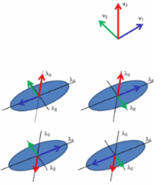
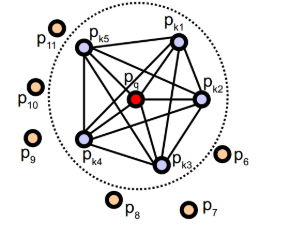
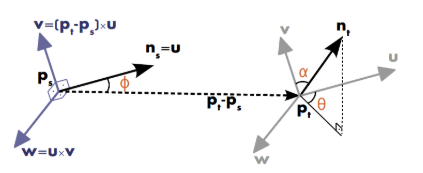
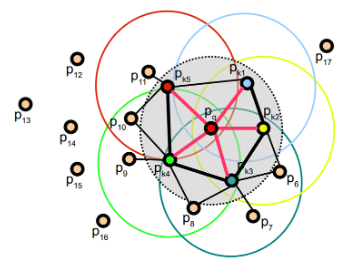
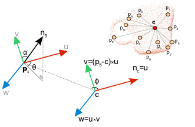
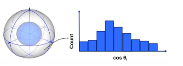
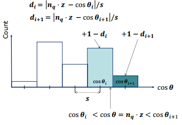
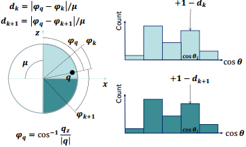
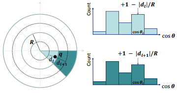

# PCL 点云关键点

## 1. 关键点提取

### ISS

内部形状描述子 ISS 是一种表示立体几何形状的方法，该算法含有丰富的几何特征信息，可以完成高质量的点云配准。

1. 对点云 $P$ 中的每个点 $p_i$ 建立一个局部坐标系，并对所有点设定一个搜索半径 $r$；

   

2. 确定点云 $P$ 中每个以 $p_i$ 为中心，$r$ 为半径区域内的所有点，并计算这些点的权值 $w_{ij}$，其表达式为：
   $$
   w_{ij} = \frac{1}{||p_i-p_j||},|p_i-p_j|<r
   $$

3. 计算每个点 $p_i$ 的协方差矩阵：
   $$
   M = \frac{\sum_{|p_i-p_j|<r}w_{ij}(p_i-p_j)(p_i-p_j)^T}{\sum_{|p_i-p_j|<r}w_{ij}}
   $$
   计算特征值 $\lambda_1,\lambda_2,\lambda_3$ 并按从大到小的顺序排列；

4. 根据以下规则选取关键点，显著性特征为最小的特征值：
   $$
   \frac{\lambda_2}{\lambda_1}≤\epsilon_1,\frac{\lambda_3}{\lambda_1}≤\epsilon_2,\rho(p_i)=\lambda_3(p_i)
   $$

避免在沿着主方向出现类似扩散的点上检测关键点，因为无法建立可重复的标准参考框架，因此，随后的描述阶段很难产生效果。在剩余的点中，显着性取决于最小特征值的大小。对设置半径 $r$ 内的显著性特征进行非极大值抑制，保留沿主方向变化较大的点为关键点。

```c++
    // ISS关键点提取
    cout << "Computing ISS Keypoints:" << endl;
    auto iss_start_time = std::chrono::steady_clock::now();

    pcl::ISSKeypoint3D<pcl::PointXYZ, pcl::PointXYZ> iss;
    pcl::PointCloud<pcl::PointXYZ>::Ptr keypoints(new pcl::PointCloud<pcl::PointXYZ>());
    pcl::search::KdTree<pcl::PointXYZ>::Ptr tree(new pcl::search::KdTree<pcl::PointXYZ>());

    iss.setInputCloud(cloud);
    iss.setSearchMethod(tree);
    iss.setNumberOfThreads(4);  // 初始化调度器并设置要使用的线程数
    iss.setSalientRadius(1.0f); // 设置用于计算协方差矩阵的球邻域半径
    iss.setNonMaxRadius(1.5f);  // 设置非极大值抑制应用算法的半径
    iss.setThreshold21(0.65);   // 设定第二个和第一个特征值之比的上限
    iss.setThreshold32(0.5);    // 设定第三个和第二个特征值之比的上限
    iss.setMinNeighbors(10);    // 在应用非极大值抑制算法时，设置必须找到的最小邻居数

    iss.compute(*keypoints);

    auto iss_end_time = std::chrono::steady_clock::now();
    auto iss_duration = std::chrono::duration_cast<std::chrono::milliseconds>(iss_end_time - iss_start_time);

    cout << "  ISS_3D keypoints extracted: " << keypoints->points.size() << endl;
    cout << "  Processing time: " << iss_duration.count() << " ms" << endl;
    cout << "  Keypoint ratio: " << static_cast<double>(keypoints->size()) / cloud->size() * 100 << "%" << endl;

```

### Harris

参考 OpenCV 中 Harris 角点的思想，但是使用点云的表面法线。该算法需对整个点云空间进行三维网格化，将落在每个网格中点的个数近似看作二维图像的像素值，并以此为基础以前后左右上下 6 个平移方向进行计算，最终求得所有特征点。

1. 求解离散点云的法线，构造法线协方差矩阵：
   $$
   M = \frac{1}{n}\sum_{x,y,z}
   \begin{bmatrix}
   n_x^2 & n_xn_y & n_xn_z \\
   n_yn_x & n_y^2 & n_yn_z \\
   n_zn_x & n_zn_y & n_z^2 \\
   \end{bmatrix}
   $$
   式中 $n$ 为当前点的邻域点个数。

2. 根据角点响应函数计算点云中每个点的角点响应值：
   $$
   R = |M| - 0.04(tr(M))^2
   $$
   根据角点响应阈值判断当前点是否为角点，若 $R$ 大于给定的阈值，同时为局部极大值点，则判定该点为点云的角点；否则，当前点不是角点。

   > 计算 Harris 角点响应值的方法有以下几种：HARRIS/NOBLE/LOWE/TOMASI/CURVATURE

```c++
    // Harris关键点提取
    cout << "Harris Keypoint Extraction:" << endl;
    auto harris_start_time = std::chrono::steady_clock::now();

    pcl::HarrisKeypoint3D<pcl::PointXYZ, pcl::PointXYZI> harris;
    pcl::PointCloud<pcl::PointXYZI>::Ptr harris_keypoints(new pcl::PointCloud<pcl::PointXYZI>);

    // Harris参数设置
    harris.setInputCloud(cloud);
    harris.setMethod(harris.LOWE);    // 设置要计算响应的方法
    harris.setRadius(10);             // 设置法线估计和非极大值抑制的半径
    harris.setRadiusSearch(10);       // 设置用于关键点检测的最近邻居的球半径
    harris.setNonMaxSupression(true); // 应用非最大值抑制
    harris.setThreshold(0.001);       // 设置角点检测阈值
    harris.setRefine(true);           // 检测到的关键点需要细化，设置为true时，关键点为点云中的点
    harris.setNumberOfThreads(6);     // 初始化调度程序并设置要使用的线程数

    harris.compute(*harris_keypoints);

    auto harris_end_time = std::chrono::steady_clock::now();
    auto harris_duration = std::chrono::duration_cast<std::chrono::milliseconds>(harris_end_time - harris_start_time);

    cout << "  Harris keypoints extracted: " << harris_keypoints->points.size() << endl;
    cout << "  Processing time: " << harris_duration.count() << " ms" << endl;
    cout << "  Keypoint ratio: " << static_cast<double>(harris_keypoints->size()) / cloud->size() * 100 << "%" << endl;

    // 获取关键点索引并转换为PointXYZ格式
    pcl::PointCloud<pcl::PointXYZ>::Ptr keypoints(new pcl::PointCloud<pcl::PointXYZ>);
    pcl::PointIndicesConstPtr keypoints_indices = harris.getKeypointsIndices();
    pcl::copyPointCloud(*cloud, *keypoints_indices, *keypoints);
```

### SUSAN 

利用相似性检测关键点，基于法向量夹角定义相似性判断函数：
$$
\begin{equation}
c(p_j,p_0) = \begin{cases}
1, &  \theta(n_j,n_0) ≤ \theta_t \\
0, &  \theta(n_j,n_0) > \theta_t \\
\end{cases}
\end{equation}
$$

> - 平滑改进形式：
>   $$
>   c(p_j,p_0) = e^{-(\frac{\theta(n_j,n_0)}{\theta_t})^6}
>   $$
>
> - 综合判断形式：
>   $$
>   c(p_j,p_0) = e^{-(\frac{\theta(n_j,n_0)}{\theta_t})^6 - (\frac{||p_j-p_0||}{d_t})^2}
>   $$

计算 USAN 值：
$$
S(p_0) = \sum_{p_j\in N(p_0)}c(p_j,p_0)
$$
响应函数：
$$
\begin{equation}
R(p_0) = \begin{cases}
g-S(p_0), &  S(p_0)<g \\
0, &  other \\
\end{cases}
\end{equation}
$$
通过阈值判断和非极大值抑制得到关键点。

```c++
    // SUSAN关键点提取
    cout << "Computing SUSAN Keypoints:" << endl;
    auto susan_start_time = std::chrono::steady_clock::now();

    pcl::search::KdTree<pcl::PointXYZ>::Ptr tree(new pcl::search::KdTree<pcl::PointXYZ>());
    pcl::SUSANKeypoint<pcl::PointXYZ, pcl::PointXYZI> susan;

    susan.setInputCloud(cloud);         // 设置输入点云
    susan.setSearchMethod(tree);        // 设置邻域搜索的方式
    susan.setNumberOfThreads(12);       // 设置多线程加速的线程数
    susan.setRadius(3.0f);              // 设置法向量估计和非极大值抑制的半径
    susan.setDistanceThreshold(0.001f); // 设置距离阈值
    susan.setAngularThreshold(0.0001f); // 设置用于角点检测的角度阈值
    susan.setIntensityThreshold(0.1f);  // 设置用于角点检测的强度阈值
    susan.setNonMaxSupression(true);    // 对响应应用非最大值抑制，以保持最强角

    pcl::PointCloud<pcl::PointXYZI>::Ptr keypoints_xyzi(new pcl::PointCloud<pcl::PointXYZI>());
    susan.compute(*keypoints_xyzi);

    // 带强度的点云PointXYZI转换成PointXYZ
    pcl::PointCloud<pcl::PointXYZ>::Ptr keypoints_xyz(new pcl::PointCloud<pcl::PointXYZ>);
    pcl::copyPointCloud(*keypoints_xyzi, *keypoints_xyz);

    auto susan_end_time = std::chrono::steady_clock::now();
    auto susan_duration = std::chrono::duration_cast<std::chrono::milliseconds>(susan_end_time - susan_start_time);

    cout << "  SUSAN keypoints extracted: " << keypoints_xyz->points.size() << endl;
    cout << "  Processing time: " << susan_duration.count() << " ms" << endl;
    cout << "  Keypoint ratio: " << static_cast<double>(keypoints_xyz->size()) / cloud->size() * 100 << "%" << endl;
```

### NARF

提取的过程必须将边缘及物体表面变化信息考虑在内；关键点的位置必须稳定，可以被重复探测，即使换了不同的视角；关键点所在的位置必须有稳定的支持区域，可以计算描述子并进行唯一的法向量估计。

1. 遍历每个深度图像点，通过寻找在近邻区域有深度突变的位置进行边缘检测。
2. 遍历每个深度图像点，根据近邻区域的表面变化决定一种测度表面变化的系数，以及变化的主方向。
3. 根据第二步找到的主方向计算兴趣值，表征该方向与其他方向的不同，以及该处表面的变化情况，即该点有多稳定。
4. 对兴趣值进行平滑过滤。
5. 进行无最大值压缩找到最终的关键点，即为 NARF 关键点。

```c++
    // 设置传感器的姿势
    auto pose_start_time = std::chrono::steady_clock::now();
    Eigen::Affine3f scene_sensor_pose(Eigen::Affine3f::Identity());
    scene_sensor_pose = Eigen::Affine3f(Eigen::Translation3f(point_cloud->sensor_origin_[0],
        point_cloud->sensor_origin_[1], point_cloud->sensor_origin_[2]))
        * Eigen::Affine3f(point_cloud->sensor_orientation_);
    auto pose_end_time = std::chrono::steady_clock::now();
    auto pose_duration = std::chrono::duration_cast<std::chrono::milliseconds>(pose_end_time - pose_start_time);
    
    cout << "  Sensor pose calculation time: " << pose_duration.count() << " ms" << endl;

    // 参数设置
    float angular_resolution = 0.5f; // 角坐标分辨率
    angular_resolution = pcl::deg2rad(angular_resolution);
    float support_size = 0.2f; // 感兴趣点的尺寸（球面的直径）
    pcl::RangeImage::CoordinateFrame coordinate_frame = pcl::RangeImage::CAMERA_FRAME;
    bool rotation_invariant = true;

    // 从点云创建深度图像
    cout << "Creating Range Image:" << endl;
    auto range_image_start_time = std::chrono::steady_clock::now();
    
    float noise_level = 0.0;
    float min_range = 0.0f;
    int border_size = 1;
    pcl::RangeImage::Ptr range_image(new pcl::RangeImage);
    
    range_image->createFromPointCloud(*point_cloud, angular_resolution, pcl::deg2rad(360.0f), pcl::deg2rad(180.0f),
        scene_sensor_pose, coordinate_frame, noise_level, min_range, border_size);
    
    auto range_image_end_time = std::chrono::steady_clock::now();
    auto range_image_duration = std::chrono::duration_cast<std::chrono::milliseconds>(range_image_end_time - range_image_start_time);
    
    cout << "  Range image created: " << range_image->width << "x" << range_image->height << endl;
    cout << "  Processing time: " << range_image_duration.count() << " ms" << endl;

    // 提取NARF关键点
    cout << "Extracting NARF Keypoints:" << endl;
    auto narf_keypoint_start_time = std::chrono::steady_clock::now();
    
    pcl::RangeImageBorderExtractor range_image_border_extractor;
    pcl::NarfKeypoint narf;
    narf.setRangeImageBorderExtractor(&range_image_border_extractor);
    narf.setRangeImage(&(*range_image));
    narf.getParameters().support_size = support_size;

    pcl::PointCloud<int> keypoint_indices;
    narf.compute(keypoint_indices);
    
    auto narf_keypoint_end_time = std::chrono::steady_clock::now();
    auto narf_keypoint_duration = std::chrono::duration_cast<std::chrono::milliseconds>(narf_keypoint_end_time - narf_keypoint_start_time);
    
    cout << "  NARF keypoints extracted: " << keypoint_indices.points.size() << endl;
    cout << "  Processing time: " << narf_keypoint_duration.count() << " ms" << endl;

    // 提取关键点坐标
    pcl::PointCloud<pcl::PointXYZ>::Ptr keypoints(new pcl::PointCloud<pcl::PointXYZ>);
    keypoints->resize(keypoint_indices.points.size());
    for (size_t i = 0; i < keypoint_indices.points.size(); ++i)
    {
        keypoints->points[i].getVector3fMap() = range_image->points[keypoint_indices.points[i]].getVector3fMap();
    }

    // 计算NARF描述子
    cout << "Computing NARF Descriptors:" << endl;
    auto narf_descriptor_start_time = std::chrono::steady_clock::now();
    
    std::vector<int> keypoint_indices2;
    keypoint_indices2.resize(keypoint_indices.points.size());
    for (unsigned int i = 0; i < keypoint_indices.size(); i++)
    {
        keypoint_indices2[i] = keypoint_indices.points[i];
    }
    
    pcl::NarfDescriptor narf_descriptor(&(*range_image), &keypoint_indices2);
    narf_descriptor.getParameters().support_size = support_size;
    narf_descriptor.getParameters().rotation_invariant = rotation_invariant;
    
    pcl::PointCloud<pcl::Narf36> narf_descriptors;
    narf_descriptor.compute(narf_descriptors);
    
    auto narf_descriptor_end_time = std::chrono::steady_clock::now();
    auto narf_descriptor_duration = std::chrono::duration_cast<std::chrono::milliseconds>(narf_descriptor_end_time - narf_descriptor_start_time);
    
    cout << "  NARF descriptors computed: " << narf_descriptors.size() << endl;
    cout << "  Processing time: " << narf_descriptor_duration.count() << " ms" << endl;
```

### SIFT

SIFT 即尺度不变特征变换，最初用于图像处理领域的一种描述。这种描述具有尺度不变性，可在图像中检测出关键点，是一种局部特征描述子，后被引入 3D 点云领域用于关键点检测。主要由三种改进方式：基于 z 方向梯度约束的 3D-SIFT 关键点检测，基于曲率不变特征约束的 3D-SIFT 关键点检测，基于 RGB 颜色特征约束的 3D-SIFT 关键点检测。

3D-SIFT 和图像 2D-SIFT 不同之处在于，3D-SIFT 方法将输入点云转换为规则的三维体素网格。每个体素中具有存储的值。使用的卷积核也是三维的 Gauss 卷积核，其余操作和 2D-SIFT 一致。

1. 基于 Z 方向梯度约束的 3D-SIFT 关键点检测：体素值为 z 坐标。

   同时在计算每个体素的三维梯度时，不再是简单地计算三个方向的偏导，而是赋予 z 方向梯度更高权重：在构建方向直方图或计算描述子时，对梯度幅度的计算进行加权使得 z 方向的变化对最终梯度的贡献更大。在关键点方向分配阶段，可以设定阈值，只考虑俯仰角接近垂直方向的梯度方向，将其计入主方向直方图。

   ```c++
       // SIFT算法参数
       const float min_scale = 0.05f;      // 设置尺度空间中最小尺度的标准偏差
       const int n_octaves = 3;            // 设置尺度空间层数，越小则特征点越多
       const int n_scales_per_octave = 15; // 设置尺度空间中计算的尺度个数
       const float min_contrast = 0.01f;  // 设置限制关键点检测的阈值
   
       // SIFT关键点检测
       cout << "Computing SIFT Keypoints:" << endl;
       auto sift_start_time = std::chrono::steady_clock::now();
   
       pcl::SIFTKeypoint<pcl::PointXYZ, pcl::PointWithScale> sift; // 创建sift关键点检测对象
       pcl::PointCloud<pcl::PointWithScale> result;
       sift.setInputCloud(cloud_xyz); // 设置输入点云
       pcl::search::KdTree<pcl::PointXYZ>::Ptr tree(new pcl::search::KdTree<pcl::PointXYZ>());
       sift.setSearchMethod(tree);                                // 创建一个空的kd树对象tree，并把它传递给sift检测对象
       sift.setScales(min_scale, n_octaves, n_scales_per_octave); // 指定搜索关键点的尺度范围
       sift.setMinimumContrast(min_contrast);                     // 设置限制关键点检测的阈值
       sift.compute(result);                                      // 执行sift关键点检测，保存结果在result
   
       auto sift_end_time = std::chrono::steady_clock::now();
       auto sift_duration = std::chrono::duration_cast<std::chrono::milliseconds>(sift_end_time - sift_start_time);
   
       cout << "  SIFT keypoints extracted: " << result.size() << endl;
       cout << "  Processing time: " << sift_duration.count() << " ms" << endl;
   ```

2. 基于曲率不变特征约束的 3D-SIFT 关键点检测：体素值为曲率。

   同时在初步检测到关键点后，除了对比度和边缘响应筛选，增加一个曲率一致性约束。在生成描述子时，除了三维梯度直方图，可以额外串联一个局部曲率分布直方图，或者用曲率信息对梯度幅度进行加权。

   ```c++
       // SIFT算法参数
       cout << "\nSIFT Algorithm Parameters:" << endl;
       const float min_scale = 0.05f;     // 设置尺度空间中最小尺度的标准偏差
       const int n_octaves = 3;           // 设置尺度空间层数，越小则特征点越多
       const int n_scales_per_octave = 4; // 设置尺度空间中计算的尺度个数
       const float min_contrast = 0.001f; // 设置限制关键点检测的阈值
   
       cout << "  Min scale: " << min_scale << endl;
       cout << "  Number of octaves: " << n_octaves << endl;
       cout << "  Scales per octave: " << n_scales_per_octave << endl;
       cout << "  Minimum contrast: " << min_contrast << endl;
   
       // 计算cloud_xyz的法向量和表面曲率
       cout << "\nComputing Surface Normals:" << endl;
       auto normal_start_time = std::chrono::steady_clock::now();
   
       pcl::NormalEstimation<pcl::PointXYZ, pcl::PointNormal> ne;
       pcl::PointCloud<pcl::PointNormal>::Ptr cloud_normals(new pcl::PointCloud<pcl::PointNormal>);
       pcl::search::KdTree<pcl::PointXYZ>::Ptr tree_n(new pcl::search::KdTree<pcl::PointXYZ>());
   
       ne.setInputCloud(cloud_xyz);
       ne.setSearchMethod(tree_n);
       ne.setRadiusSearch(0.1);
       ne.compute(*cloud_normals);
   
       auto normal_end_time = std::chrono::steady_clock::now();
       auto normal_duration = std::chrono::duration_cast<std::chrono::milliseconds>(normal_end_time - normal_start_time);
   
       cout << "  Normals computed: " << cloud_normals->size() << endl;
       cout << "  Processing time: " << normal_duration.count() << " ms" << endl;
       cout << "  Search radius: 0.1" << endl;
   
       // 从cloud_xyz复制xyz信息，并将其添加到cloud_normals中
       for (std::size_t i = 0; i < cloud_normals->size(); ++i)
       {
           (*cloud_normals)[i].x = (*cloud_xyz)[i].x;
           (*cloud_normals)[i].y = (*cloud_xyz)[i].y;
           (*cloud_normals)[i].z = (*cloud_xyz)[i].z;
       }
   
       // 使用法线值作为强度变量估计SIFT关键点
       cout << "\nComputing SIFT Keypoints:" << endl;
       auto sift_start_time = std::chrono::steady_clock::now();
   
       pcl::SIFTKeypoint<pcl::PointNormal, pcl::PointWithScale> sift;
       pcl::PointCloud<pcl::PointWithScale> result;
       pcl::search::KdTree<pcl::PointNormal>::Ptr tree(new pcl::search::KdTree<pcl::PointNormal>());
   
       sift.setSearchMethod(tree);
       sift.setScales(min_scale, n_octaves, n_scales_per_octave);
       sift.setMinimumContrast(min_contrast);
       sift.setInputCloud(cloud_normals);
       sift.compute(result);
   
       auto sift_end_time = std::chrono::steady_clock::now();
       auto sift_duration = std::chrono::duration_cast<std::chrono::milliseconds>(sift_end_time - sift_start_time);
   
       cout << "  SIFT keypoints extracted: " << result.size() << endl;
       cout << "  Processing time: " << sift_duration.count() << " ms" << endl;
   
   ```

## 2. 特征描述子

### PFH

PFH 是一种常用的点局部特征描述符，根据点与其邻域半径内的点所存在的空间差异 (点云估计法线方向的角度差异) 最终建立一个多维直方图来表示该点及其邻域点的几何属性。直方图所在的高维超空间为点及其邻域点的特征表示提供了一个可度量的信息空间，该信息空间对点云对应曲面的六维姿态来说是不变的，而且采样密度大小的不同及在含有噪声点的情况下也十分稳定。

PFH 基于点和它所在邻域中所有点之间的几何关系及其他们的估计法向量用以描述点云局部区域内的几何特征。在特征点邻域内搜索 $k$ 个点，$k+1$ 个点之间进行两两配对。



1. 假设邻域网格中任意两点 $p_i$ 和 $p_j$，并设它们的对应估计法线为 $n_i$ 和 $n_j$，选取两点间连线与点的估计法线夹角较小的点作为 $p_s$，另一点为 $p_t$。
   $$
   \begin{equation}
   p_s = \begin{cases}
   p_i, &  n_i\cdot(p_j-p_i)≤n_j\cdot(p_i-p_j) \\
   p_j, &  n_i\cdot(p_j-p_i)>n_j\cdot(p_i-p_j) \\
   \end{cases}
   \end{equation}
   $$

2. $p_s$ 和 $p_t$ 与它们所对应的估计法线 $n_s$ 和 $n_t$ 之间存在相对偏差，为了计算该相对偏差，构建点对坐标系 $uvw$：
   $$
   u = n_s \\
   v = (p_t-p_s)\times u \\
   w = u \times v
   $$
   

   使用 $\alpha,\beta,\gamma$ 来代表估计法线 $n_s,n_t$ 之间的相对偏差：
   $$
   \alpha = v\cdot n_t \\
   \beta = u \cdot \frac{p_t-p_s}{d} \\
   \gamma = \arctan (w\cdot n_t,u\times n_t)
   $$
   在特征点邻域半径内计算出每个点对的 $\alpha,\beta,\gamma,d$ ，形成每个点对之间的估计法线关系，也就可以用于表示曲面的几何特征。

3. 建立查询点 $p$ 的点特征直方图：

   将所有点的 $\alpha,\beta,\gamma,d$ 放入直方图中，按照 $b$ 个区间分类，通过 $\alpha,\beta,\gamma$ 划分区间构成 $b^3$ 维特征向量，然后根据 $\alpha,\beta,\gamma$ 统计子区间内的点数量形成直方图。


```c++
    // 计算法向量
    auto normal_start_time = std::chrono::steady_clock::now();

    pcl::search::KdTree<pcl::PointXYZ>::Ptr tree(new pcl::search::KdTree<pcl::PointXYZ>());
    pcl::NormalEstimation<pcl::PointXYZ, pcl::Normal> normal_estimator;
    normal_estimator.setInputCloud(cloud);
    normal_estimator.setSearchMethod(tree);
    normal_estimator.setRadiusSearch(0.1);

    pcl::PointCloud<pcl::Normal>::Ptr cloud_normals(new pcl::PointCloud<pcl::Normal>);
    normal_estimator.compute(*cloud_normals);

    auto normal_end_time = std::chrono::steady_clock::now();
    auto normal_duration = std::chrono::duration_cast<std::chrono::milliseconds>(normal_end_time - normal_start_time);

    cout << "\nNormal Computation:" << endl;
    cout << "  Normals computed: " << cloud_normals->points.size() << endl;
    cout << "  Processing time: " << normal_duration.count() << " ms" << endl;

    // 计算 PFH
    auto pfh_start_time = std::chrono::steady_clock::now();

    pcl::PFHEstimation<pcl::PointXYZ, pcl::Normal, pcl::PFHSignature125> pfh;
    pfh.setInputCloud(cloud);
    pfh.setInputNormals(cloud_normals);

    pcl::search::KdTree<pcl::PointXYZ>::Ptr tree2(new pcl::search::KdTree<pcl::PointXYZ>());
    pfh.setSearchMethod(tree2);
    pfh.setRadiusSearch(0.2);

    pcl::PointCloud<pcl::PFHSignature125>::Ptr pfh_features(new pcl::PointCloud<pcl::PFHSignature125>());
    pfh.compute(*pfh_features);

    auto pfh_end_time = std::chrono::steady_clock::now();
    auto pfh_duration = std::chrono::duration_cast<std::chrono::milliseconds>(pfh_end_time - pfh_start_time);

    cout << "\nPFH Feature Extraction:" << endl;
    cout << "  PFH features computed: " << pfh_features->points.size() << endl;
    cout << "  Processing time: " << pfh_duration.count() << " ms" << endl;

    // 直方图可视化
    cout << "\nOpening PFH feature histogram..." << endl;
    pcl::visualization::PCLPlotter plotter;
    plotter.addFeatureHistogram(*pfh_features, 300);
    plotter.plot();
```

### FPFH

对于一个查询点，计算 PFH 特征的时间复杂度为 $O(k^2)$，若一个点云有 $n$ 个点，则时间复杂度为 $O(nk^2)$，效率非常低，由此需要进行简化：

1. 对于所求的每个点 $p$，计算该点与其邻域点之间的一组 $\alpha,\beta,\gamma$，这一步的结果称为简化的特征直方图 SPFH。

2. 重新确定每个点的 $k$ 个邻域点，用邻近的 SPFH 来计算最终直方图 FPFH：
   $$
   FPFH(p) = SPFH(p)+\sum_{i=1}^k\frac{1}{w_k}SPFH(p_k)
   $$
   $w_k$​ 为权重，该权重是根据 $p$ 及其邻域内点之间的距离来度量。

   

> - FPFH 算法没有将查询点邻域内所有点进行联系，因此存在丢失一些值的可能性，而这些值可能存在某些明确的几何特征；
> - PFH 算法的范围仅仅是查询点 $p$ 邻域半径为 $r$ 内，而 FPFH 算法不仅包括以 $p$ 为中心半径为 $r$ 的邻域范围，同时也包括以邻近点 $p_{k}$ 为中心，半径为 $r$ 的范围；
> - FPFH 跟 PFH 描述子有所不同，FPFH 是把每个维度分成 11 个区间，统计每个维度区间上点的数量，以此取代了整个高纬度空间进行划分的方式，仅仅在三个维度上进行叠加，这样最终的FPFH 描述子只有33个维度，和 PFH 相比，FPFH 大大降低了描述子的维数；
> - 与 PFH 相比，FPFH 整体复杂度大大降低，计算速度更快，因此具有很高的实时应用价值。

```c++
    // 计算法向量
    cout << "\nComputing Surface Normals (OMP accelerated):" << endl;
    auto normal_start_time = std::chrono::steady_clock::now();

    pcl::NormalEstimationOMP<pcl::PointXYZ, pcl::Normal> normal_estimator;
    normal_estimator.setInputCloud(cloud);

    pcl::search::KdTree<pcl::PointXYZ>::Ptr tree(new pcl::search::KdTree<pcl::PointXYZ>());
    normal_estimator.setSearchMethod(tree);
    normal_estimator.setNumberOfThreads(4);
    normal_estimator.setKSearch(10);

    pcl::PointCloud<pcl::Normal>::Ptr normals(new pcl::PointCloud<pcl::Normal>);
    normal_estimator.compute(*normals);

    auto normal_end_time = std::chrono::steady_clock::now();
    auto normal_duration = std::chrono::duration_cast<std::chrono::milliseconds>(normal_end_time - normal_start_time);

    cout << "  Normals computed: " << normals->size() << endl;
    cout << "  Processing time: " << normal_duration.count() << " ms" << endl;
    cout << "  KSearch value: 10" << endl;
    cout << "  Threads: 4" << endl;

    // 计算 FPFH
    cout << "\nComputing FPFH Features:" << endl;
    auto fpfh_start_time = std::chrono::steady_clock::now();

    pcl::FPFHEstimation<pcl::PointXYZ, pcl::Normal, pcl::FPFHSignature33> fpfh;
    fpfh.setInputCloud(cloud);
    fpfh.setInputNormals(normals);

    pcl::search::KdTree<pcl::PointXYZ>::Ptr tree2(new pcl::search::KdTree<pcl::PointXYZ>());
    fpfh.setSearchMethod(tree2);
    fpfh.setRadiusSearch(0.1);

    pcl::PointCloud<pcl::FPFHSignature33>::Ptr fpfh_features(new pcl::PointCloud<pcl::FPFHSignature33>());
    fpfh.compute(*fpfh_features);

    auto fpfh_end_time = std::chrono::steady_clock::now();
    auto fpfh_duration = std::chrono::duration_cast<std::chrono::milliseconds>(fpfh_end_time - fpfh_start_time);

    cout << "  FPFH features computed: " << fpfh_features->size() << endl;
    cout << "  Processing time: " << fpfh_duration.count() << " ms" << endl;
    cout << "  Search radius: 0.1" << endl;
    cout << "  Feature dimension: 33" << endl;

    // 直方图可视化
    cout << "\nOpening FPFH feature histogram..." << endl;

    // 显示所有点的平均直方图
    pcl::visualization::PCLPlotter plotter;
    plotter.addFeatureHistogram(*fpfh_features, 300);
    plotter.plot();
```

### VFH

视点特征直方图扩展 FPFH，利用整个点云对象来进行计算估计，计算 FPFH 时以物体中心点与物体表面其他所有点之间的点对作为计算单元。添加视点方向与每个点估计法线之间额外的统计信息，在 FPFH 计算中将视点方向变量直接融入到相对法线角计算当中(直接在点云中心建立 $uvw$ 坐标)。



特征构成：关于质心的 $\alpha,\beta,\gamma$ (3*45 bin)，关于质心的一个形状分布型描述 $SDC$ (45 bin)，1个视角方向与点法向量之间的角度值 (128 bin)。
$$
SDC = \frac{(p_c-p_i)^2}{\max(p_c-p_i)^2}
$$

### SHOT 352 

基于邻域点建立局部坐标系，将点邻域空间分出几个子空间，然后对子空间中每个点的法向特征统计到直方图进行编码，再将每个子空间的直方图联合到一起得到三维描述子。

1. 对于点云中每个查询点 $p_i$，构建点邻域的协方差矩阵 $M$，其中 $r$ 表示邻域半径，$p_k$ 表示邻域内的每一个点，$\hat p$表示该点邻域内所有点的质心，$d_k$ 表示邻域内点到质心 $\hat p$ 的距离。
   $$
   M = \frac{\sum_{d_k ≤ r}(r-d_k)(p_k-\hat p)(p_k - \hat p)^T}{\sum_{d_k ≤ r}(r-d_k)}
   $$
   通过对协方差矩阵进行特征值分解得到特征值及特征值对应的特征向量，将特征值按从大到小排序可得 $\lambda_1 > \lambda_2 > \lambda_3$，其对应的特征向量 $v_1,v_2,v_3$ 分别代表 3 个坐标轴。

2. 以查询点 $p_i$ 为中心，建立半径为 $r$ 的球形邻域，将球形按照经线方向、纬线方向及径向方向分别划分为 8，2，2 个部分，形成 32 个子空间。

   

3. 计算分布在 32 个子空间内每个邻域点 $p_k$ 与查询点 $p_i$ 法向量之间的夹角余弦，其中 $n_{ni}$ 表示第 $n$ 个子空间内第 $i$ 个点的法向量，$v_3$ 表示查询点 $p_i$ 的法向量，即局部坐标系的 z 轴。

4. 统计子空间内各个点与查询点的夹角余弦值，分成 11 维直方图，再将每个子空间的直方图组合在一起，形成 352 维的高维直方图特征。

   

   

   

   

```c++
    // 为关键点计算描述子
    cout << "\nComputing SHOT Descriptors (OMP accelerated):" << endl;
    auto shot_start_time = std::chrono::steady_clock::now();
    
    pcl::PointCloud<pcl::SHOT352>::Ptr shot_descriptors(new pcl::PointCloud<pcl::SHOT352>());
    pcl::SHOTEstimationOMP<pcl::PointXYZ, pcl::Normal, pcl::SHOT352> shot352;
    
    shot352.setRadiusSearch(0.5);
    shot352.setInputCloud(cloud_filtered);
    shot352.setInputNormals(normals);
    shot352.setSearchSurface(cloud);
    shot352.compute(*shot_descriptors);
    
    auto shot_end_time = std::chrono::steady_clock::now();
    auto shot_duration = std::chrono::duration_cast<std::chrono::milliseconds>(shot_end_time - shot_start_time);
    
    cout << "  SHOT descriptors computed: " << shot_descriptors->size() << endl;
    cout << "  Processing time: " << shot_duration.count() << " ms" << endl;
    cout << "  Search radius: 0.5" << endl;
    cout << "  Feature dimension: 352" << endl;
    cout << "  Descriptor type: SHOT352" << endl;
```

### ESF

形状特征函数集合是点云识别中常用的描述符，由三种不同的全局形状特征构成，从距离、角度和面积三个方面描述区域特征。ESF 将点云栅格化处理，以随机选择的三个点为单位遍历区域中所有点，用 3D-Bresenham 算法连接三个点，结合连线与区域表面的关系构建距离、角度和面积的分布直方图。

ESF 是由统计信息得到的，受噪声及离群点影响较小，对噪声和点云部分缺失等情况表现稳定，能很好地适用于激光点云。

1. 距离特征描述：两两连接三个点并计算连线长度，根据连线与表面的关系，分为连线在表面内、在表面外、与表面相交三种情况建立三个直方图，将长度值归一化后分类到对应直方图。此外，针对连线与表面相交的情况建立描述连线在表面内与表面外比例的直方图。
2. 角度特征描述：通过三个点围成三角形的三个角度值构建直方图，与距离特征描述类似，按照角的对边与表面关系分为三个直方图。将角度值归一化后分类到对应直方图中。
3. 面积特征描述：计算由三个点构成的三角形面积的平方根。距离特征描述类似，按照三角形与表面的关系分为三个直方图，将面积值归一化后分类到对应直方图中。

由以上 10 个直方图的概率分布值组合构成的多维向量，从距离、角度和面积等方面综合描述区域特征。

### 3DSC 

参考链接：[链接](https://eason.blog.csdn.net/article/details/78168554)

### Spin image

参考链接：[链接](https://blog.csdn.net/qq_45006390/article/details/118404128)
