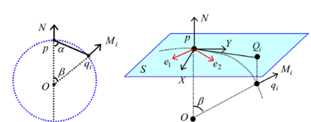

# PCL-C++ 7_点云特征描述

3D 点云特征描述与提取是点云信息处理中最基础也是最关键的一部分。点云的识别、分割、重采样、配准曲面重建等处理，大部分算法都依赖特征描述符提取的结果。从尺度上来分，一般分为局部特征的描述和全局特征的描述，例如局部的法线等几何形状特征的描述，全局的拓扑特征的描述，都属于 3D 点云特征描述与提取的范畴。

> **常用的点云特征描述：**
>
> 1. 法线和曲率计算
> 2. 特征值分析
> 3. PFH 点特征直方图描述子
> 4. FPFH 快速点特征直方图描述子 FPFH
> 5. 3D形状内容描述子
> 6. 纹理特征
> 7. 深度图
> 8. VFH  视点特征直方图
> 9. NARF 关键点特征
> 10. RoPs 特征
> 11. GASD 全局一致的空间分布描述子特征 
> 12. 旋转图像

特征描述子能够表征采样表面的几何性质，它有助于解决不适定的对比问题，理想情况下相同或相似表面上的点的特征值将非常相似（相对特定度量准则），而不同表面上的点的特征描述子将有明显差异。下面几个条件，通过能否获得相同的局部表面特征值，可以判定点特征表示方式的优劣。

> 1. **平移旋转不变性**（刚体变换）：即三维旋转和三维平移变化不会影响特征向量估计。
> 2. **抗密度干扰性**（改变采样密度）：原则上，一个局部表面小块的采样密度无论是大还是小，都应该有相同的特征向量值。
> 3. **对噪声具有稳定性**（噪声）：数据中有轻微噪声的情况下，点特征表示在它的特征向量中必须保持相同或者极其相似的值。

## 1. 法向量

- 法向量估计

    基于局部表面拟合的方法进行法向量估计，点云的采样表面处处光滑的情况下，任何点的局部邻域都可以用平面进行很好的拟合。

    为此，对于点云中的每个扫描点 $p$，搜索到与其最近邻的 $K$ 个相邻点，然后计算这些点最小二乘意义上的局部平面 $P$，此平面可以表示为：
    $$
    P(\vec n,d) = argmin \sum^k_{i=1}(\vec n \cdot p_i - d)^2
    $$
    式中，$\vec n$为平面 $P$ 的法向量，$d$ 为 $P$ 到坐标原点的距离。

    可以认为由 $K$ 个最近邻点拟合出的平面的法向量即当前扫描点的法向量。平面 $P$ 的法向量可以由主成分分析得到。

    $P$ 经过其 $K$ 邻域点的质心 $p_0$ ，且法向量 $\vec{n}$ 满足 $||\vec{n}||=1$ 。
    $$
    M = \frac{1}{K}\sum^K_1(p_i-p_0)(p_i-p_0)^T
    $$
    对协方差矩阵 $M$ 进行特征值分解，求得 $M$ 的各特征值，$M$ 的最小特征值所对应的特征向量即 $P$ 的法向量。

- 法向量定向

  法向量具有二义性，即只是得到了法向量所在的直线，而没有确定以直线的哪个方向为法向量的最终方向。

  假设点云足够稠密且采样平面处处光滑，那么相邻两点的法向量会接近于平行。令 $\vec{n_i},\vec{n_j}$ 为相邻两点 $x_i,x_j$ 的法向量，如果法向量的方向是一致的，那么 $\vec{n_i}\cdot\vec{n_j}\approx1$ ，若此内积为负，则说明其中某个点的法向量需要被翻转。因此，首先为点云中某个点设定一个法向量朝向，然后遍历其他所有点，若当前点法向量设定为$\vec{n_i}$，$\vec{n_j}$为下一个要遍历的点，如果$\vec{n_i}\cdot\vec{n_j}<0$，则将$ \vec{n_j}$翻转，否则保持不变。

    ```c++
        pcl::NormalEstimationOMP<pcl::PointXYZ, pcl::Normal> n;										//OMP加速
        pcl::PointCloud<pcl::Normal>::Ptr normals(new pcl::PointCloud<pcl::Normal>);
        pcl::search::KdTree<pcl::PointXYZ>::Ptr tree(new pcl::search::KdTree<pcl::PointXYZ>()); 	//建立kdtree来进行近邻点集搜索
        n.setNumberOfThreads(10);																	//设置openMP的线程数
        //n.setViewPoint(0,0,0);																	//设置视点，默认为（0，0，0）
        n.setInputCloud(cloud);
        n.setSearchMethod(tree);
        n.setKSearch(10);																			//点云法向计算时，需要所搜的近邻点大小
        //n.setRadiusSearch(0.03);																	//半径搜素
        n.compute(*normals);																		//开始进行法向量计算
    ```

    > `n.compute(*normal)`里计算出来的结果是：法向量的`x`,`y`,`z`坐标和表面曲率`curvature`。

- 积分图计算法向量

  `pcl::IntegralImageNormalEstimation`类。

  积分图像是对有序点云进行法线估计的一种方法。 该算法将点云视为深度图像，并通过考虑相邻点之间的关系来创建在其上计算法线的某些矩形区域，而无需在诸如KD树的搜索结构上运行查找 。 因此，它的计算效率非常高，通常可在一瞬间计算出法线。

  **该方法仅适用于有序点云。**
  
  ```c++
  // 设置法线估计方法。
  // COVARIANCE_MATRIX：从邻域的协方差矩阵中创建9个积分图去计算一个点的法线
  // AVERAGE_3D_GRADIENT： 创建了6个积分图去计算3D梯度里面垂直和水平方向的光滑部分，同时利用两个梯度的叉积来计算法线
  // AVERAGE_DEPTH_CHANGE： 创建一个单一的积分图，从平均深度的变化中来计算法线
  void setNormalEstimationMethod (NormalEstimationMethod normal_estimation_method);
  
  // 设置处理边界的策略, BORDER_POLICY_IGNORE 和 BORDER_POLICY_MIRROR 两种策略
  void setBorderPolicy (const BorderPolicy border_policy);
  ```
  

## 2. 曲率

- 表面曲率是点云数据表面的特征值来描述点云表面变化程度的一个概念，与数学意义上的曲率不同。

  从法向量求取中得到的协方差矩阵可以估算**表面曲率**：

  $$
  \sigma _p = \frac{λ_0}{λ_0+λ_1+λ_2}
  $$

  $λ$为协方差矩阵 $M$ 的特征值，这里 $λ_0=min(λ_j)$，即三个特征值中的最小值。表面曲率越小表明邻域越平坦，越大则表明邻域的起伏变化越大。
  
- 主曲率，平均曲率和高斯曲率

  曲率是曲线弯曲程度的一个度量。

  平均曲率作为微分几何中一个外在的弯曲测量标准，对一个曲面嵌入周围空间的曲率进行了区部描述。

  高斯曲率作为一个描述曲面的凹凸性质的量，当这个量变化程度较大的时候表面曲面内部变化也比较大，这就表明曲面的光滑程度越低。

  记主曲率为 $k_1,k_2$，平均曲率为 $H$，高斯曲率为 $K$，则：
  $$
  k_1,k_2 = H \pm \sqrt{H^2-K} \\
  H = \frac{EN-2FM+GL}{2(EG-F^2)} \\
  K = \frac{LC-M^2}{EG-F^2}
  $$
  式中：$L = r_{xx}$，$N = r_{yy}$，$E = r_xr_x$，$F=r_xr_y$，$G = r_yr_y$，$r_x,r_y,r_{xx},r_{xy},r_{yy}$ 为曲面的偏微分，$E,F,G$ 为曲面的第一基本不变量，$L,M,N$为曲面的第二基本不变量。

  - 二次曲面拟合求点云曲率

    在散乱点云中取一个数据点 $P_i$，然后以 $P_i$ 为中心在点云中均匀地取n $n$ 个点，这 $n$ 个点要尽量覆盖整个点云。通过这 $n$ 个点，利用最小二乘法拟合二次曲面 $z(x,y)=ax^2+bxy+cy^2$ ，解得系数后根据空间曲面曲线的性质计算数据点的高斯曲率和平均曲率。

    对于测量点云内任意数据点的 $m$ 邻域，根据最小二乘原理需使下式取最小值。
    $$
    Q^2 = \sum_j(ax_j^2+bx_jy_j+cy_j^2 = z_j^2),j \in (0,k)
    $$
    式中，$x_j,y_j,z_j$ 是邻域内的点。分别对系数求导，使其为 0，得出下式：
    $$
    \frac{\partial Q^2}{\partial a} = \sum_j 2x_j^2(ax_j^2+bx_jy_j+cy_j^2-z_j) = 0 \\
    \frac{\partial Q^2}{\partial b} = \sum_j 2x_jy_j(ax_j^2+bx_jy_j+cy_j^2-z_j) = 0 \\
    \frac{\partial Q^2}{\partial c} = \sum_j 2y_j^2(ax_j^2+bx_jy_j+cy_j^2-z_j) = 0
    $$
    由此，解出二次曲面系数。将曲线方程写成曲面参数方程形式：
    $$
    X(x,y) = x \\
    Y(x,y) = y \\
    Z(x,y) = ax^2+bxy+cy^2
    $$
    若曲面上存在一条曲线 $r$ ，则$r$的表达式为：
    $$
    r = r(x(t),y(t))
    $$
    若以 $s$ 表示曲线 $r$ 的弧长，则由复合函数求导公式可求得弧长微分公式：
    $$
    (ds)^2 = r_x^2(dx)^2 + 2r_xr_ydxdy+r_y^2(dy)^2 \\
    (ds)^2 = I = E(dx)^2 + 2Fdxdy + G(dy)^2 \\
    $$
    假如 $P$ 是曲线 $r$ 上一点，用 $\vec{t}$ 和 $\vec{n}$ 分别表示 $P$ 点的单位切向量和单位法向量,则曲率向量可分解为：
    $$
    \vec{k} = \frac{d\vec{t}}{ds} = k_n\vec{n} + k_g(\vec{n}\times\vec{t})
    $$
    曲线的单位法向量 $\vec{n}$ 表示为：
    $$
    \vec{n} = \frac{r_x\times r_y}{|r_x\times r_y|}
    $$
    可以得到：
    $$
    \prod  =-d\vec{r}\cdot d\vec{n} = L(dx)^2 + 2Mdxdy + N(dy)^2 \\
    L = r_{xx}\cdot \vec{n},M = r_{xy}\cdot\vec{n},N=r_{yy}\cdot\vec{n} 
    $$
    法曲率可表示为：
    $$
    k = \frac{\prod}{I} = \frac{L+2Mλ+Nλ^2}{E+2Fλ+Gλ^2}\\
    λ = \frac{dy}{dx}
    $$
    变量 $\lambda$ 可得到 $k_n$ 的两基根 $k_1,k_2$，从而根据曲率特性可求得 $K,H$。

  - 利用相邻点的法向量求一点的曲率

    点云表面上特定点的所有相邻点决定了局部形状。如果通过曲面拟合来估计曲率，可能会产生较大的误差。因此，应该考虑法向量的贡献。为了估计一个点的曲率，只考虑一个相邻点的贡献，这一贡献被转换为一条正截面曲线的构造。将构造一个法向截面圆，并根据两个点(目标点和它的一个邻居)的位置和法向向量来估计法向曲率。

    假设 $p$ 点的附近有 $m$ 个近邻点，$q_i$ 为点 $p$ 的第 $i$ 个近邻点，$q_i$ 的法向量为 $M_i$，设正交坐标系 $\{p,X,Y,N\}$ 为 $p$ 点的局部坐标系 $L$，$N$ 表示 $p$ 点的法向量。$ X$ 和 $ Y$ 为正交的单位向量。在 $ L$ 中，$p,q_i,M_i$ 的坐标可以是 $(0,0,0)$，$q_i$ 为$(x_i,y_i,z_i)$，$M_i$ 为$(n_{xi}，n_{yi}，n_{zi})$。那么我们可以用一个通过点 $p$ 的密切圆来估计点 $p$ 的法曲率 $k_n^i$。

    

    则 $p$ 相对于 $q_i$ 的法曲率估计如下：
    $$
    k_n^i = \frac{sin\beta}{|pq_i|sin\alpha}
    $$
    $α$ 是向量 $-N$ 和 $pq_i$ 之间的夹角，$\beta$ 是向量 $N$ 和 $M_i$ 之间的夹角。

    近似值由下式给出：
    $$
    k_n^i = -\frac{n_{xy}}{\sqrt{n_{xy}^2+n_z^2}\sqrt{x_i^2+y_i^2}} \\
    n_{xy} = \frac{x_in_{xi}+y_in_{yi}}{\sqrt{x_i^2+y_i^2}}
    $$
    分析了所有法曲率与主曲率的关系。为了估计一个点的主曲率，相邻点的所有坐标被转换成局部坐标系的坐标。给定点 $p$ 处的法向量 $N$：$N = (n_{xp},n_{yp},n_{zp})$。$X=(−sinφ,cosφ,0)$，$Y =(cosψsinφ,cosψcosφ,−sinψ)$。其中：$ψ = a r c c o s ( n_ {zp}) , φ = a r c t a n ( n _{yp} / n_{xp} ) ) $。

    设 $S$ 为通过点 $p$ 的平面，法向量为 $N$，设 $e_1$ 和 $e_2$ 为点 $p$ 处的主方向，对应主曲率 $k_1$ 和 $k_2$，二者未知。设未知参数 $\theta$ 为向量 $e_1$ 和 $e_2$ 的夹角，$\theta_i$ 是矢量 $X$ 和矢量 $pQ_i$ 之间的夹角，其中 $pQ_i$ 是矢量$pq_i$ 在平面 $S$ 上的投影。$\theta_i$ 可以用点 $q_i$ 的局部坐标来计算。

    根据欧拉公式，法曲率和主曲率有以下关系：
    $$
    k_n^i=k_1cos(θ_i+θ)+k_2sin^2(θ_i+θ)
    $$
    $θ_i+θ$ 为点 $p$ 过 $q_i$ 的法截线的切线与主方向的夹角。

    可以形成优化问题：
    $$
    min\sum^m_{i=0}[k_1cos^2(\theta_i+\theta)+k_2sin^2(\theta_i+\theta)-k_n^i]^2
    $$
    令：
    $$
    \mu = (A,B,C)^T \\
    A = k_1(cos\theta)^2 + k_2(sin\theta)^2 \\
    B = (k_2-k_1)cos\theta sin\theta \\
    C = k_1(sin\theta)^2 + k_2(cos\theta)^2
    $$
    最小二乘拟合之后，可以相应地获得 $\mu$ 的估计值。可以推断出：
    $$
    W = \left[
    \begin{matrix}
    A & B \\ B & C
    \end{matrix}
    \right]
    $$
    的特征值为主曲率。

