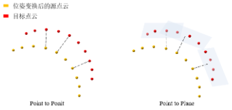

# PCL 点云配准

点云配准是一个十分重要的技术，给定一个源点云 $P$ 和一个目标点云 $Q$，需要找到一个平移变换 $t$ 和一个旋转变换 $R$，使得 $P$ 在变换后的点云 $T(P) = RP+t$ 和目标点云 $Q$ 的对齐误差最小化。
$$
(R^*,t^*) = \min_{R,t}\sum d(T(p_j),q_j)^2
$$
点云配准包括两个过程：**粗配准和精配准**。

粗配准在两个点云之间的初始相对位姿未知或相差较大时，提供一个初始对齐变换，该过程不依赖于任何初始变换猜测。而精配准在粗配准提供的初始变换基础上，进行迭代优化以求得高精度配准结果。

 ## 1. 粗配准

### 4PCS

4PCS 算法将近似共面的四点集合作为基底，根据点间距离和两线段交点的相对位置，在点云 $Q$ 中寻找所有与该四点集近似全等的集合，然后计算变换矩阵并寻找最优解。

4PCS 使用了广域基底中的不变量确定变换，和使用局部样本点确定变换的方式不同，小距离点集进行配准受到噪声的影响比较大，可能导致配准失败；使用广域基底可以使得配准更加稳定。由此 4PCS 方法对于噪声和离群点不敏感，可以用来直接配准未经过预处理的原始数据。

- 2D 平面一致性四点集的搜索

  在 2D 平面中，四点 $\{a,b,c,d\}$ 任意三点不共线，则必然存在交点 $e$，其与 $\{a,b,c,d\}$ 各点的相对位置可以表示为：
  $$
  r_1 = \frac{||a-e||}{||a-b||} \\
  r_2 = \frac{||c-e||}{||c-d||}
  $$
   $r_1,r_2$ 通过仿射变换之后仍然不变，由此可以唯一确定仿射变换后的点集 $Q$ 中与 $\{a,b,c,d\}$ 对应的四点集 $\{a^,,b^,,c^,,d^,\}$。

  

- 3D 空间一致性四点集的搜索

  方法和在 2D 中相似，首先在 $P$ 中随机选取不共线的三点，并找到与之近似共面的第四个点，点间距应当尽量大，由此构成了基础广域基点集 $B$。

  > 第四个点需要在重叠区域内，但是重叠区域通常未知，4PCS 引入重叠比例 $f$ 估算广域基点间的最大距离，在迭代时对 $f$ 递减，直到配准得到的变换最佳。

  在目标点云中根据仿射不变量 $r_1,r_2$ 搜索出误差阈值 $\delta$ 范围内与基础广域基 $B$ 近似全等的一致性四点集，约束条件为：
  $$
  e_1 = q_1 + r_1(q_2-q_1) \\
  e_2 = q_1 + r_2(q_2-q_1)
  $$
  对于 $Q$ 中的四点组成两个相交点对，分别计算两个交点：其中一个由 $r_1$ 计算得到，另一个由 $r_2$ 计算得到，当四点集相互对应时，$e_1,e_2$ 近似重合。

  

  同时仿射变换保证点间距离是不变的：
  $$
  d_1 = ||a-b|| \\
  d_2 = ||c-d||
  $$
  加入距离约束可以加速四点集搜索。

- 变换矩阵计算

  通过 3D-3D 匹配方法求解候选的变换矩阵 $R,t$，将 $P$ 通过候选变换变换为 $P^,$，统计 $P^,$ 中有多少点落在目标点云 $Q$ 中某个点的 $ε$-邻域内，选取匹配成功最多的变换为最优变换。

- PCL 中的 4PCS 算法：

  ```c++
  #include <pcl/registration/ia_fpcs.h>
  
  	// 创建 4PCS 配准对象
      pcl::registration::FPCSInitialAlignment<pcl::PointXYZ, pcl::PointXYZ> fpcs;
  
      // 设置输入源点云和目标点云
      fpcs.setInputSource(source_cloud);
      fpcs.setInputTarget(target_cloud);
  
      // 设置4PCS算法参数
      fpcs.setApproxOverlap(0.7);     // 设置源点云和目标点云之间大致的重叠度
      fpcs.setDelta(0.01);            // 设置配准后源点云和目标点云之间的距离
      fpcs.setNumberOfSamples(100);   // 设置验证配准效果时使用的采样点数量
      fpcs.setMaxComputationTime(30); // 设置最大计算时间
  
      std::cout << "\n=== Performing 4PCS Registration ===" << std::endl;
      std::cout << "Parameters: ApproxOverlap=0.7, Delta=0.01, NumberOfSamples=100" << std::endl;
  
      // 执行配准
      fpcs.align(*aligned_cloud);
  
      // 输出配准结果
      if (fpcs.hasConverged())
      {
          std::cout << "\n4PCS registration successful!" << std::endl;
          std::cout << "Fitness score: " << fpcs.getFitnessScore() << std::endl;
          std::cout << "Transformation matrix:" << std::endl;
          std::cout << fpcs.getFinalTransformation() << std::endl;
  
          // 保存配准后的点云
          pcl::io::savePCDFile<pcl::PointXYZ>("aligned_cloud.pcd", *aligned_cloud);
          std::cout << "Aligned point cloud saved to 'aligned_cloud.pcd'" << std::endl;
      }
      else
      {
          std::cout << "\n4PCS registration failed!" << std::endl;
          return -1;
      }
  ```

### K-4PCS 

原始 4PCS 算法在处理大规模点云时，由于需要在全局点云中搜索所有的共面四点基元，计算量非常大。K-4PCS 首先通过体素网格滤波器对原始点云进行下采样，在保持点云形状的同时减少点的数量；然后使用3D Harris 角点检测或 3D DoG 等方法在降采样后的点云上检测关键点；在得到源点云和目标点云的关键点集后，就在这些关键点集上应用标准的 4PCS 算法。

```c++
#include <pcl/registration/ia_kfpcs.h>    

	// 创建 KFPCS 配准对象
    pcl::registration::KFPCSInitialAlignment<pcl::PointXYZ, pcl::PointXYZ> kfpcs;

    // 设置输入源点云和目标点云
    kfpcs.setInputSource(source_cloud);
    kfpcs.setInputTarget(target_cloud);

    // 设置 KFPCS 算法参数
    kfpcs.setApproxOverlap(0.73);  // 源和目标之间的近似重叠
    kfpcs.setLambda(0.2);          // 平移矩阵的加权系数
    kfpcs.setDelta(0.07);          // 配准后源点云和目标点云之间的距离
    kfpcs.setNumberOfThreads(10);  // OpenMP 多线程加速的线程数
    kfpcs.setNumberOfSamples(400); // 配准时要使用的随机采样点数量

    std::cout << "\n=== Performing K-4PCS Registration ===" << std::endl;
    std::cout << "Parameters: ApproxOverlap=0.73, Delta=0.07, NumberOfSamples=200" << std::endl;

    // 执行配准
    kfpcs.align(*aligned_cloud);

    // 输出配准结果
    if (kfpcs.hasConverged())
    {
        std::cout << "\nK-4PCS registration successful!" << std::endl;
        std::cout << "Fitness score: " << kfpcs.getFitnessScore() << std::endl;
        std::cout << "Transformation matrix:" << std::endl;
        std::cout << kfpcs.getFinalTransformation() << std::endl;

        // 使用变换矩阵对源点云进行变换
        pcl::transformPointCloud(*source_cloud, *aligned_cloud, kfpcs.getFinalTransformation());

        // 保存配准后的点云
        pcl::io::savePCDFile<pcl::PointXYZ>("aligned_cloud.pcd", *aligned_cloud);
        std::cout << "Aligned point cloud saved to 'aligned_cloud.pcd'" << std::endl;
    }
    else
    {
        std::cout << "\nK-4PCS registration failed!" << std::endl;
        return -1;
    }
```

### SAC-IA

首先为点云中的点计算特征描述子，通常选择 FPFH/PFH/3D-Shape-Context，然后从源点云中随机选取一组采样点(加入几何约束：形状或者距离)，对于每个采样点，在目标点云中寻找特征最相似的点，作为候选对应点。对于每一组通过采样得到的候选对应点对，计算变换矩阵，然后取其中效果最优的矩阵为结果。

```c++
#include <pcl/features/normal_3d_omp.h>
#include <pcl/features/fpfh_omp.h>
#include <pcl/registration/ia_ransac.h>
	
	// 点云下采样
    std::cout << "\nDownsampling point clouds..." << std::endl;
    pcl::VoxelGrid<pcl::PointXYZ> voxel_filter;
    voxel_filter.setLeafSize(0.5f, 0.5f, 0.5f);

    voxel_filter.setInputCloud(source_cloud);
    voxel_filter.filter(*source_downsampled);

    voxel_filter.setInputCloud(target_cloud);
    voxel_filter.filter(*target_downsampled);

    std::cout << "Downsampled source: " << source_downsampled->size() << " points" << std::endl;
    std::cout << "Downsampled target: " << target_downsampled->size() << " points" << std::endl;

    // 创建KD树
    pcl::search::KdTree<pcl::PointXYZ>::Ptr kd_tree(new pcl::search::KdTree<pcl::PointXYZ>);

    // 计算法向量
    std::cout << "\nComputing normals..." << std::endl;
    pcl::PointCloud<pcl::Normal>::Ptr source_normals(new pcl::PointCloud<pcl::Normal>);
    pcl::PointCloud<pcl::Normal>::Ptr target_normals(new pcl::PointCloud<pcl::Normal>);

    pcl::NormalEstimationOMP<pcl::PointXYZ, pcl::Normal> normal_estimator;
    normal_estimator.setSearchMethod(kd_tree);
    normal_estimator.setKSearch(10);

    normal_estimator.setInputCloud(source_downsampled);
    normal_estimator.compute(*source_normals);

    normal_estimator.setInputCloud(target_downsampled);
    normal_estimator.compute(*target_normals);

    // 计算FPFH特征
    std::cout << "Computing FPFH features..." << std::endl;
    pcl::PointCloud<pcl::FPFHSignature33>::Ptr source_features(new pcl::PointCloud<pcl::FPFHSignature33>);
    pcl::PointCloud<pcl::FPFHSignature33>::Ptr target_features(new pcl::PointCloud<pcl::FPFHSignature33>);

    pcl::FPFHEstimationOMP<pcl::PointXYZ, pcl::Normal, pcl::FPFHSignature33> fpfh_estimator;
    fpfh_estimator.setSearchMethod(kd_tree);
    fpfh_estimator.setKSearch(15);

    fpfh_estimator.setInputCloud(source_downsampled);
    fpfh_estimator.setInputNormals(source_normals);
    fpfh_estimator.compute(*source_features);

    fpfh_estimator.setInputCloud(target_downsampled);
    fpfh_estimator.setInputNormals(target_normals);
    fpfh_estimator.compute(*target_features);

    std::cout << "Source features: " << source_features->size() << " descriptors" << std::endl;
    std::cout << "Target features: " << target_features->size() << " descriptors" << std::endl;

    // 创建 SAC-IA 配准对象
    pcl::SampleConsensusInitialAlignment<pcl::PointXYZ, pcl::PointXYZ, pcl::FPFHSignature33> sac_ia;

    // 设置输入源点云和目标点云
    sac_ia.setInputSource(source_downsampled);
    sac_ia.setSourceFeatures(source_features);
    sac_ia.setInputTarget(target_downsampled);
    sac_ia.setTargetFeatures(target_features);

    // 设置 SAC-IA 算法参数
    sac_ia.setMinSampleDistance(0.05f);        // 样本间最小距离
    sac_ia.setMaxCorrespondenceDistance(0.1f); // 最大对应距离
    sac_ia.setMaximumIterations(1000);         // 最大迭代次数
    sac_ia.setNumberOfSamples(3);              // 使用的样本数量
    sac_ia.setCorrespondenceRandomness(15);    // 使用的邻域数量

    std::cout << "\n=== Performing SAC-IA Registration ===" << std::endl;
    std::cout << "Parameters: MinSampleDistance=0.05, MaxCorrespondenceDistance=0.1" << std::endl;
    std::cout << "MaximumIterations=1000, NumberOfSamples=3" << std::endl;

    // 执行配准
    auto start_time = std::chrono::steady_clock::now();
    sac_ia.align(*aligned_cloud);
    auto end_time = std::chrono::steady_clock::now();
    auto duration = std::chrono::duration_cast<std::chrono::milliseconds>(end_time - start_time);

    std::cout << "Registration completed in: " << duration.count() << " ms" << std::endl;

    // 输出配准结果
    if (sac_ia.hasConverged())
    {
        std::cout << "\nSAC-IA registration successful!" << std::endl;
        std::cout << "Fitness score: " << sac_ia.getFitnessScore() << std::endl;
        std::cout << "Transformation matrix:" << std::endl;
        std::cout << sac_ia.getFinalTransformation() << std::endl;

        // 使用变换矩阵对原始源点云进行变换
        pcl::transformPointCloud(*source_cloud, *aligned_cloud, sac_ia.getFinalTransformation());

        // 保存配准后的点云
        pcl::io::savePCDFile<pcl::PointXYZ>("aligned_cloud.pcd", *aligned_cloud);
        std::cout << "Aligned point cloud saved to 'aligned_cloud.pcd'" << std::endl;

        // 质量评估
        if (sac_ia.getFitnessScore() < 0.05f)
        {
            std::cout << "Registration quality: Excellent" << std::endl;
        }
        else if (sac_ia.getFitnessScore() < 0.1f)
        {
            std::cout << "Registration quality: Good" << std::endl;
        }
        else if (sac_ia.getFitnessScore() < 0.2f)
        {
            std::cout << "Registration quality: Acceptable" << std::endl;
        }
        else
        {
            std::cout << "Registration quality: Poor - consider parameter adjustment" << std::endl;
        }
    }
    else
    {
        std::cout << "\nSAC-IA registration failed!" << std::endl;
        return -1;
    }
```

> - 改进的 SAC-IA 算法：对每一组通过采样得到的候选对应点对进行快速一致性检查，一般使用基于距离的一致性(计算样本点在原点云和目标点云之间的欧氏距离，形成相异向量，如果完全匹配该向量范数为 0，范数越大越不匹配)，如果不符合距离一致性则进行下一次迭代。

## 2. 精配准

### 点到点 ICP

点对点 ICP 的大概步骤是：

- 对点集 $P$ 中的每一个点 $p_i$ 施加初始变换 $T_0$ 得到 $P^,$ ，在点集 $Q$ 中寻找距离点 $p_i^,$ 最近的点 $q_i$ 形成对应点对；

- 求解最优变换：
  $$
  \Delta T = \min_{R,t}\sum||q_i-(Rp_i^,+t)||_2^2
  $$
  根据迭代误差和迭代次数判断收敛性，如果已经收敛，得到 $T = \Delta TT_0$。

1. 寻找最近对应点：该步骤可以使用 ANN 加速(比如使用 KD-Tree)；

2. 求解最优变换：(参考最小二乘问题，使用 SVD 求解)

   $\overline{p}$ 为点云 $P$ 的质心，$\overline{q}$ 为点云 $Q$ 的质心，令 $\hat p_i = p_i-\overline{p}$，$\hat q_i = q_i-\overline{q}$；令 $H = \sum \hat p_i\hat q_i^T$ ，对 $H$ 作 SVD 分解得到 $H = U\Sigma V^T$，则最优旋转：
   $$
   R^* = VU^T
   $$
   最优平移：
   $$
   t^* = \overline q - R^*\overline p
   $$

```c++
#include <pcl/registration/icp.h>    

	// ICP 精配准
    std::cout << "\n=== Step 2: Performing ICP Fine Registration ===" << std::endl;

    // 创建ICP配准对象
    pcl::IterativeClosestPoint<pcl::PointXYZ, pcl::PointXYZ> icp;

    // 设置ICP算法参数
    icp.setInputSource(coarse_aligned_cloud);  // 输入粗配准后的点云
    icp.setInputTarget(target_cloud);          // 目标点云
    icp.setTransformationEpsilon(1e-10);       // 为终止条件设置最小转换差异
    icp.setMaxCorrespondenceDistance(1e-2);    // 设置对应点对之间的最大距离
    icp.setEuclideanFitnessEpsilon(1e-10);     // 设置收敛条件是均方误差和小于阈值
    icp.setMaximumIterations(200);             // 最大迭代次数
    icp.setUseReciprocalCorrespondences(true); // 使用相互对应关系

    std::cout << "ICP Parameters: MaxCorrespondenceDistance=1e-2, EuclideanFitnessEpsilon=1e-10" << std::endl;
    std::cout << "MaximumIterations=200, TransformationEpsilon=1e-10" << std::endl;

    // 执行ICP配准
    auto start_time_fine = std::chrono::steady_clock::now();
    icp.align(*final_aligned_cloud, kfpcs.getFinalTransformation()); // 使用4PCS的结果作为初始变换
    auto end_time_fine = std::chrono::steady_clock::now();
    auto duration_fine = std::chrono::duration_cast<std::chrono::milliseconds>(end_time_fine - start_time_fine);

    // 检查ICP配准是否成功
    if (!icp.hasConverged())
    {
        std::cout << "\nICP fine registration failed!" << std::endl;
        return -1;
    }

    std::cout << "ICP registration completed in: " << duration_fine.count() << " ms" << std::endl;
    std::cout << "ICP fitness score: " << icp.getFitnessScore() << std::endl;
    std::cout << "ICP transformation matrix:" << std::endl;
    std::cout << icp.getFinalTransformation() << std::endl;
```

- KD-Tree 优化

  1. KD-Tree 优化

     通过 KD-tree，对粗配准后的点进行近邻搜索。以欧氏距离为判断标准，剔除欧氏距离大于阈值的配准关键点，保存配准精度高的点。

     > - 寻找目标点的叶节点：从根节点递归向下搜索 KD-Tree，如果目标点当前维度的坐标小于切分点坐标，则转移到左子节点；反之，转移到右子节点。进入叶节点后，将该叶节点内与待配准点之间距离最小的点作为当前最近点。
     > - 递归向上回溯：如果该节点保存的实例点比当前最近点距离目标点更近，则更新当前最近点；反之，检查另一子节点区域。如果该区域与以目标点为球心，以最近点间的距离为半径的球相交，则另外一个子节点区域内可能存在距离目标点更近的点，此时转移到另一子节点，继续递归搜索。如果不相交，则向上回溯。
     > - 直到退回根节点，搜索结束，当前搜索的最近点为目标点的近邻点。
     > - 设定阈值，当目标点与最近点之间的欧氏距离小于阈值时，认为配准精度高，保留该点。反之，则剔除该点。

  2. 双向 KD-Tree 优化

     初始配准后的 $P$ 和 $Q$ 具有相近的位置。在配准计算时，由于最近点对存在多对一的问题导致 ICP 算法的配准效率不高。

     > - 分别构建 $P$、$Q$ 点云的 KD-Tree；
     > - 在 $Q$ 内搜索 $p_i$ 的最近点 $q_i$；
     > - 若在 $P$ 内搜索 $q_i$ 的最近点为 $p_i$，则说明 $p_i$ 和 $q_i$ 为一对具有一一对应关系的最近点；若在 $P$ 内搜索 $q_i$ 的最近点不为 $p_i$，则继续寻找下一点 $q_{i+1}$ 在 $Q$ 内的最近点；遍历点云 $P$ 内各点。

     双向 KD-Tree 的优势在于能够确定一一对应的最近点对，虽然搜索时间是 KD-Tree 的二倍，但算法的迭代时间得到了大幅的缩减。

### 点到面 ICP

传统的 ICP 算法采用最小化源点云与目标点云对应点间距离作为配准准则，点到平面 ICP 采用最小化源点云中的点到目标点云对应点所在平面的距离作为配准准则。
$$
\min \sum||n_i^T(Rp_i+t-q_i)||_2^2
$$
$n_i$ 为 $q_i$ 的法线。相比于传统的 ICP 算法，点到平面 ICP 更能体现点云的空间结构。



- 线性化 SVD 方法

  对旋转矩阵使用小角度线性化(见机器人运动学)：
  $$
  R = E + \delta \theta^{\times}
  $$
  变换后的点为：
  $$
  p_i + p_i^{\times}\delta\theta+t
  $$
  由此残差线性化为：
  $$
  r_i = n_i^T(p_i-q_i)+n_i^Tp_i^{\times}\delta\theta+n_i^T\delta t
  $$
  对于 $N$ 个点构造线性化最小二乘问题 $Jx = -r$：

  $J$ 的第 $i$ 行：
  $$
  \begin{bmatrix}
  n_{iy}p_{iz}-n_{iz}p_{iy} \\
  n_{iz}p_{ix}-n_{ix}p_{iz} \\
  n_{ix}p_{iy}-n_{iy}p_{ix} \\
  n_{ix} \\
  n_{iy} \\
  n_{iz} \\
  \end{bmatrix}^T
  $$
  $r$ 的第 $i$ 行：
  $$
  r_i = n_i^T(p_i-q_i)
  $$
  $J = U\Sigma V^T$，最小二乘解：$x = -J^*r$，$J^* = Vdiag(\frac{1}{\sigma_1},\frac{1}{\sigma_2},\cdots,\frac{1}{\sigma_r},0,\cdots,0)U^T$。

  ```c++
      // 创建点到面的ICP配准对象
      pcl::IterativeClosestPointWithNormals<pcl::PointNormal, pcl::PointNormal> p_icp;
  
      // 使用线性最小二乘法估计点到面的刚体变换
      pcl::registration::TransformationEstimationPointToPlaneLLS<pcl::PointNormal, pcl::PointNormal>::Ptr point_to_plane(new pcl::registration::TransformationEstimationPointToPlaneLLS<pcl::PointNormal, pcl::PointNormal>);
  
      p_icp.setTransformationEstimation(point_to_plane); // 设置点到面的距离估计
      p_icp.setInputSource(coarse_with_normals);         // 输入粗配准后的点云（带法线）
      p_icp.setInputTarget(target_with_normals);         // 输入目标点云（带法线）
      p_icp.setTransformationEpsilon(1e-10);             // 设置最小转换差异
      p_icp.setMaxCorrespondenceDistance(10);            // 设置最大对应点对之间的距离
      p_icp.setEuclideanFitnessEpsilon(0.001);           // 设置均方误差阈值
      p_icp.setMaximumIterations(35);                    // 设置最大迭代次数
  
      std::cout << "Point-to-Plane ICP Parameters: MaxCorrespondenceDistance=10, EuclideanFitnessEpsilon=0.001" << std::endl;
      std::cout << "MaximumIterations=35, TransformationEpsilon=1e-10" << std::endl;
  
      // 执行点到面ICP配准（使用4PCS的结果作为初始变换）
      auto start_time_fine = std::chrono::steady_clock::now();
      p_icp.align(*coarse_with_normals, kfpcs.getFinalTransformation());
      auto end_time_fine = std::chrono::steady_clock::now();
      auto duration_fine = std::chrono::duration_cast<std::chrono::milliseconds>(end_time_fine - start_time_fine);
  
      // 检查ICP配准是否成功
      if (!p_icp.hasConverged())
      {
          std::cerr << "\nPoint-to-Plane ICP registration failed!" << std::endl;
          return -1;
      }
  
      std::cout << "\nICP has converged, score is " << p_icp.getFitnessScore() << std::endl;
  
      // 获取最终变换矩阵
      Eigen::Matrix4f icp_transformation = p_icp.getFinalTransformation();
      std::cout << "Point-to-Plane ICP transformation matrix:" << std::endl;
      std::cout << icp_transformation << std::endl;
  
      // 计算总变换矩阵（4PCS + 点到面ICP）
      Eigen::Matrix4f total_transform = p_icp.getFinalTransformation();
      std::cout << "\n=== Final Combined Transformation Matrix ===" << std::endl;
      std::cout << total_transform << std::endl;
  
      // 将最终变换应用于原始源点云
      pcl::transformPointCloud(*source_cloud, *final_aligned_cloud, total_transform);
  ```

- 非线性 LM 方法

  使用李代数表示齐次变换 $T = e^{\xi^\wedge}$，$\xi = [\theta_x,\theta_y,\theta_z,t_x,t_y,t_z]^T$；

  残差项：$r_i = n_i^T(Tp_i-q_i)$；

  雅可比矩阵：
  $$
  J_i = \frac{\partial r_i}{\partial \xi} = n_i^T\frac{\partial Tp_i}{\partial \xi} \\
  \frac{\partial Tp_i}{\partial \xi} = [E_{3\times3} , -(Tp_i)^{\times}]
  $$
  随后按照 LM 方法求解优化问题即可(见非线性优化)。

  ```c++
      // 创建点到面的ICP配准对象
      pcl::IterativeClosestPoint<pcl::PointNormal, pcl::PointNormal> lm_icp;
  
      // 使用点到面距离估计
      pcl::registration::TransformationEstimationPointToPlane<pcl::PointNormal, pcl::PointNormal>::Ptr PointToPlane(new pcl::registration::TransformationEstimationPointToPlane<pcl::PointNormal, pcl::PointNormal>);
  
      lm_icp.setTransformationEstimation(PointToPlane);
      lm_icp.setInputSource(coarse_with_normals); // 输入粗配准后的点云（带法线）
      lm_icp.setInputTarget(target_with_normals); // 输入目标点云（带法线）
      lm_icp.setTransformationEpsilon(1e-10);     // 为终止条件设置最小转换差异
      lm_icp.setMaxCorrespondenceDistance(0.1);   // 设置对应点对之间的最大距离
      lm_icp.setEuclideanFitnessEpsilon(0.001);   // 设置收敛条件是均方误差和小于阈值
      lm_icp.setMaximumIterations(35);            // 最大迭代次数
  
      std::cout << "Point-to-Plane ICP Parameters: MaxCorrespondenceDistance=10, EuclideanFitnessEpsilon=0.001" << std::endl;
      std::cout << "MaximumIterations=35, TransformationEpsilon=1e-10" << std::endl;
  
      // 执行点到面ICP配准（使用4PCS的结果作为初始变换）
      auto start_time_fine = std::chrono::steady_clock::now();
      lm_icp.align(*coarse_with_normals, kfpcs.getFinalTransformation());
      auto end_time_fine = std::chrono::steady_clock::now();
      auto duration_fine = std::chrono::duration_cast<std::chrono::milliseconds>(end_time_fine - start_time_fine);
  ```

- 目标函数的对称改进

  原有目标函数的误差为：
  $$
  (p_i-q_i) \cdot n_{qi}
  $$
  如果在一个表面的某个小区域内的任何地方采样 $(p_i,q_i)$，那么只有当这个表面是完美的平面时，这个值才为零。
  
  其中一种改进方式是改进目标函数：误差最小化的平面是基于对应点对中两个点的表面法线的，优化是在一个稳定的坐标系中进行的，两个网格同时向相反的方向移动。由此每当一对点对位于二阶(常曲率)曲面上时，对称目标函数就被最小化，而不是仅当这些点在平面上时才被最小化。因此，无须显式计算二阶表面属性和欧氏距离。
  
  改进的目标误差为：
  $$
  (p_i-q_i)\cdot (n_{pi}+n_{qi})
  $$
  
  
  对于从圆弧上采样的任意点 $p_i$ 和 $q_i$，它们之间的向量 $p_i-q_i$ 垂直于法线 $n_{pi}+n_{qi}$。可以看出当从一个圆中对 $(p_i,q_i)$ 进行采样时，对称函数为 0。当刚体变换应用于 $P$ 时，只要 $p_i$ 和 $q_i$ 的相对位置一致，这个表达式的值仍为 0。类似的属性在 3D 中也成立：只要 $p_i$ 和 $q_i$ 及其法线与某个圆柱体一致，对称函数的结果为 0。位于任意圆柱体上的 $(p_i,n_{pi})$ 集合有一个固定的对应 $(q_i,n_{qi})$。这个约束条件更加有用，不需要计算二次曲面的属性，这是计算效率和抗噪性的主要优势。
  
  
  
  将其作为目标函数，并应用正向和反向变换的技巧：设想在固定的中性坐标系中评估度量，并将相反的变换应用于 $P$ 和 $Q$。
  
  目标表述为：
  $$
  r = \sum||(Rp_i-R^{-1}q_i+t)(Rn_{pi}+R^{-1}n_{qi})||_2^2
  $$
  $P$ 到 $Q$ 的变换为 $RTR$。
  
  旋转分裂的优点：通过优化旋转角度的一半来减少线性化误差；当对应准确时，它能够将线性化误差减小到零。
  
  有一个更简单的方法：每个点对的最小化方向保持固定，而点本身以相反的方向旋转。
  $$
  r = \sum||(Rp_i-R^{-1}q_i+t)(n_{pi}+n_{qi})||_2^2
  $$
  
  ```c++
      // 创建对称点到平面的ICP配准对象
      pcl::IterativeClosestPoint<pcl::PointNormal, pcl::PointNormal> symm_icp;
  
      // 使用对称点到平面距离估计
      pcl::registration::TransformationEstimationSymmetricPointToPlaneLLS<pcl::PointNormal, pcl::PointNormal>::Ptr symm_point_to_plane(new pcl::registration::TransformationEstimationSymmetricPointToPlaneLLS<pcl::PointNormal, pcl::PointNormal>);
  
      symm_icp.setTransformationEstimation(symm_point_to_plane); // 设置对称点到平面距离
      symm_icp.setInputSource(coarse_with_normals);              // 设置源点云（粗配准后）
      symm_icp.setInputTarget(target_with_normals);              // 设置目标点云
      symm_icp.setMaxCorrespondenceDistance(0.08);                // 设置最大对应点对之间的距离
      symm_icp.setTransformationEpsilon(1e-10);                  // 设置终止条件：最小转换差异
      symm_icp.setEuclideanFitnessEpsilon(1e-10);                // 设置收敛条件：均方误差
      symm_icp.setMaximumIterations(50);                         // 设置最大迭代次数
  
      std::cout << "Symmetric Point-to-Plane ICP Parameters: MaxCorrespondenceDistance=0.01, EuclideanFitnessEpsilon=0.001" << std::endl;
      std::cout << "MaximumIterations=50, TransformationEpsilon=1e-10" << std::endl;
  
      // 执行对称点到平面ICP配准（使用4PCS的结果作为初始变换）
      auto start_time_fine = std::chrono::steady_clock::now();
      symm_icp.align(*coarse_with_normals, kfpcs.getFinalTransformation());
      auto end_time_fine = std::chrono::steady_clock::now();
      auto duration_fine = std::chrono::duration_cast<std::chrono::milliseconds>(end_time_fine - start_time_fine);
  ```

### 其他 ICP 算法

#### Trimmed ICP 

对于源点云 $P$ 中点的个数不等于目标点云 $Q$ 中点个数的两个点集，源点云中的一些点在目标点集中可能没有对应关系。假设可以配对的数据点的最小保证率为 $\sigma$，可以配对的数据点数量为 $N_{po} = \sigma N$，当 $\sigma=1$ 时就是 ICP。

> 1. 对于 $P$ 的每个点，找出 $Q$ 中最近的点，并计算各个点对之间的距离 $d_i^2$；
> 2. $d_i^2$ 按升序排列，选择前 $N_{po}$ 个点对并计算它们的和 $sum^,$；
> 3. 满足约束条件(与ICP相同)则退出，否则令 $sum = sum^,$ 并继续；
> 4. 为选定的 $N_{po}$ 对对应点对计算最小化 $sum = sum^,$ 的最佳变换 $(R,t)$；
> 5. 进行变换；

```c++
    pcl::recognition::TrimmedICP<pcl::PointXYZ, double> trimmed_icp;
    trimmed_icp.init(target_cloud); // 初始化目标点云

    float sigma = 0.96;                     // 设置内点比例
    int Np = icp_result->size();            // 使用ICP结果点云的点数
    int Npo = static_cast<int>(Np * sigma); // 参与配准的点对数量

    trimmed_icp.setNewToOldEnergyRatio(sigma); // 设置内点能量比例

    std::cout << "Trimmed ICP Parameters:" << std::endl;
    std::cout << "  Inlier ratio (sigma): " << sigma << std::endl;
    std::cout << "  Number of point pairs (Npo): " << Npo << std::endl;

    pcl::PointCloud<pcl::PointXYZ>::Ptr trimmed_result(new pcl::PointCloud<pcl::PointXYZ>);
    *trimmed_result = *icp_result;

    Eigen::Matrix4d trimmed_transformation = Eigen::Matrix4d::Identity();

    // 执行Trimmed ICP配准
    trimmed_icp.align(*trimmed_result, Npo, trimmed_transformation);
```

#### 3D-NDT

不直接匹配两个点云中的点对，而是将目标点云用概率模型来描述，然后寻找一个变换，使得源点云在该概率模型下出现的概率最大。

1. 转换为概率模型

   将参考点云所在的空间划分为一个个规则的三维立方体网格(体素)。对于每一个包含至少若干个点的体素，计算其内部所有点的样本均值和协方差矩阵。
   $$
   \mu = \frac{1}{n}\sum_{i=1}^n x_i
   $$

   $$
   \sigma = \frac{1}{n-1}\sum_{i=1}^n(x_i-\mu)(x_i-\mu)^T
   $$

   假设该体素内的点是由一个三维正态分布生成的，这个分布代表了点出现在这个体素内某个位置的概率。对于空间中的一个点 $x$，它落在某个体素对应的正态分布中的概率密度为：
   $$
   p(x) \sim e^{-\frac{1}{2}(x-\mu)^T\sigma(x-\mu)}
   $$

2. 目标函数：找到源点云 $P$ 的一个空间变换使得变换后的源点云在参考点云的概率场中的总似然最大。

   对于源点云中的每一个点应用变换，将变换后的点代入其所在体素的概率密度函数，得到单点似然。

   最后使用极大似然法进行优化。

```c++
#include <pcl/registration/ndt.h> 

	auto ndt_start_time = std::chrono::steady_clock::now();

    // 创建NDT配准对象
    pcl::NormalDistributionsTransform<pcl::PointXYZ, pcl::PointXYZ> ndt;

    // 设置NDT参数
    ndt.setStepSize(0.1);               // 为More-Thuente线搜索设置最大步长
    ndt.setResolution(1.0f);            // 设置NDT网格结构的分辨率
    ndt.setMaximumIterations(50);       // 设置最大迭代次数
    ndt.setTransformationEpsilon(0.01); // 设置终止条件的最小转换差异

    // 设置输入点云
    ndt.setInputSource(filtered_source);
    ndt.setInputTarget(filtered_target);

    std::cout << "NDT Parameters:" << std::endl;
    std::cout << "  Step Size: 0.1" << std::endl;
    std::cout << "  Resolution: 1.0" << std::endl;
    std::cout << "  Maximum Iterations: 50" << std::endl;
    std::cout << "  Transformation Epsilon: 0.01" << std::endl;

    // 执行NDT配准
    pcl::PointCloud<pcl::PointXYZ>::Ptr ndt_result_filtered(new pcl::PointCloud<pcl::PointXYZ>);
    ndt.align(*ndt_result_filtered);

    auto ndt_end_time = std::chrono::steady_clock::now();
    auto ndt_duration = std::chrono::duration_cast<std::chrono::milliseconds>(ndt_end_time - ndt_start_time);

    // 检查NDT配准是否成功
    if (!ndt.hasConverged())
    {
        std::cerr << "\nNDT registration failed to converge!" << std::endl;
        return -1;
    }

    std::cout << "NDT registration completed in: " << ndt_duration.count() << " ms" << std::endl;
    std::cout << "NDT has converged: " << (ndt.hasConverged() ? "Yes" : "No") << std::endl;
    std::cout << "NDT fitness score: " << ndt.getFitnessScore() << std::endl;
    std::cout << "Applied " << ndt.getFinalNumIteration() << " iterations" << std::endl;

    // 获取NDT变换矩阵
    Eigen::Matrix4f ndt_transformation = ndt.getFinalTransformation();
    std::cout << "NDT transformation matrix:" << std::endl;
    std::cout << ndt_transformation << std::endl;
```

