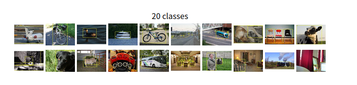
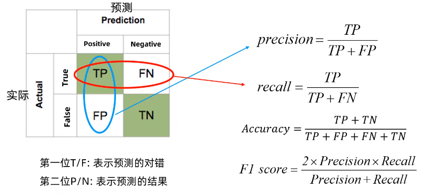
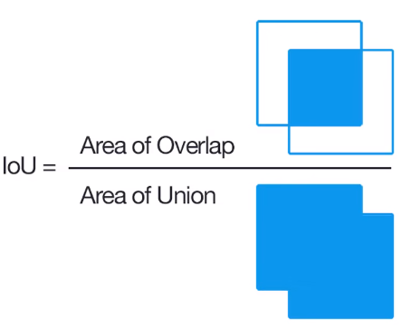
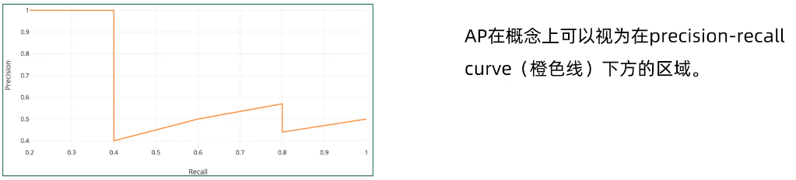
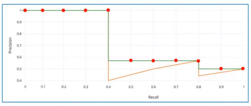
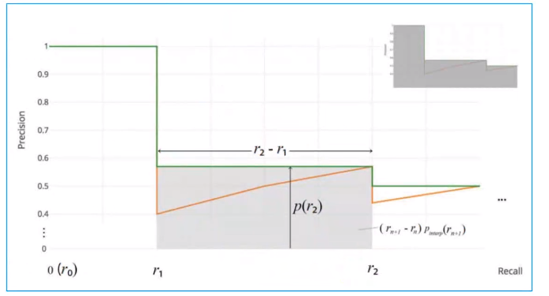

# Yolov5 1_目标检测(Object Detection)

## 1. 目标检测的概念

目标检测效果：得到图像中物体的定位（最小外接矩形），类型（类别标签Label 和 置信度得分Score）。

> - 定位和检测
>
> **定位**：找到检测图像中带有给定标签的单个目标；
>
> **检测**：找到图像中带有给定标签的所有目标。

## 2. 目标检测的常用数据集

- PASCAL VOC数据集

该数据集有20个分类：Person，bird，cat，bottle，chair，train...

[PASCAL VOC数据集](http://host.robots.ox.ac.uk/pascal/VOC/voc2012)

- MS COCO 数据集

[MS COCO数据集](http://cocodataset.org)

包含11.5万张训练集图像，5千张验证集图像，2万张测试集图像。

## 3. 目标检测的性能指标

### 检测精度

> 1. Precision，Recall，F1 score
> 2. IoU(Intersection over Union)
> 3. P-R curve(Precision-Recall curve)
> 4. AP(Average Precision)
> 5. mAP(mean Average Precision)

1. Precision，Recall，F1 Score

- 精度Precision评估预测的准确性（预测的Positive列）；召回率Recall评估检测是否完全（实际的True行）。

2. 交并比IoU

实际物体的框和预测框的交和并之比，对于PASCAL VOC数据集，如果$IoU \geq 0.5$，认为检测的为正样本TP；反之检测的为FP。

3. AP 和 mAP

AP衡量学习出来的模型在每个类别上的好坏；

mAP衡量学习出来的模型在所有类别上的好坏，取所有类型的AP均值。

> 对于MS COCO数据集，AP@.50为IoU在0.5时的mAP值，AP@.75为IoU在0.75时的mAP值，AP@[.5:.95]为IoU在0.5到0.95之间（以0.05为间距）时的mAP值。

通过平滑近似计算求得曲线下方面积，通常采用11点法（每隔0.1取一点向右作近似矩形）：
$$
AP = \frac{1}{11}(AP(0) + AP(0.1) + ... + AP(1.0))
$$

PASCAL VOC在2010年提出使用积分法计算AP值，假设N个样本中有M个正样本，会得到M个recall值，对于每个recall值，可以计算出对应的最大precision值，对M个precision值取平均即可。

### 检测速度

> 1. 前传耗时
> 2. 每秒帧数FPS
> 3. 浮点运算量FLOPS
