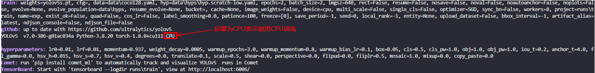

# Yolov5 2_环境配置

## 1. CUDA cuCNN

**存在独立显卡时可使用CUDA和cuCNN进行训练。**

2006年，NVIDIA公司发布了CUDA(Compute Unified Device Architecture)，是一种新的操作GPU计算的硬件和软件架构，是建立在NVIDIA的GPUs上的一个通用并行计算平台和编程模型，它提供了GPU编程的简易接口，基于CUDA编程可以构建基于GPU计算的应用程序，利用GPUs的并行计算引擎来更加高效地解决比较复杂的计算难题。它将GPU视作一个数据并行计算设备，而且无需把这些计算映射到图形API。操作系统的多任务机制可以同时管理CUDA访问GPU和图形程序的运行库，其计算特性支持利用CUDA直观地编写GPU核心程序。

cuDNN是NVIDIACUDA®深度神经网络库，是GPU加速的用于深度神经网络的原语库。cuDNN为标准例程提供了高度优化的实现，例如向前和向后卷积，池化，规范化和激活层。全球的深度学习研究人员和框架开发人员都依赖cuDNN来实现高性能GPU加速。它使他们可以专注于训练神经网络和开发软件应用程序，而不必花时间在底层GPU性能调整上。cuDNN的加快广泛使用的深度学习框架，包括Caffe2，Chainer，Keras，MATLAB，MxNet，PyTorch和TensorFlow。已将cuDNN集成到框架中的NVIDIA优化深度学习框架容器，访问NVIDIA GPU CLOUD了解更多信息并开始使用。

### CUDA 下载和安装

## 2. Anaconda

（略）

## 3. Yolov5 环境配置

### 源码下载

[Yolov5 Github源码地址](https://github.com/ultralytics/yolov5)

```shell
$ git clone https://github.com/ultralytics/yolov5
```

### 预训练模型下载


为了缩短网络的训练时间，并达到更好的精度，一般加载预训练权重进行网络的训练。yolov5提供了以上几个预训练权重，可以对应不同的需求选择不同的版本的预训练权重。在实际场景中是比较看重速度，所以`YOLOv5s`是比较常用的。

### 安装依赖

在yolov5路径下执行：

```shell
$ pip install -r requirements.txt 
```

### 检查安装

在yolov5路径下运行`detect.py`文件，若正常运行则说明yolov5安装成功，运行结果可以`runs\`文件夹下看到。


