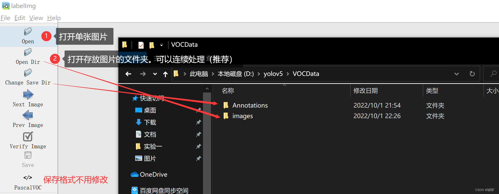
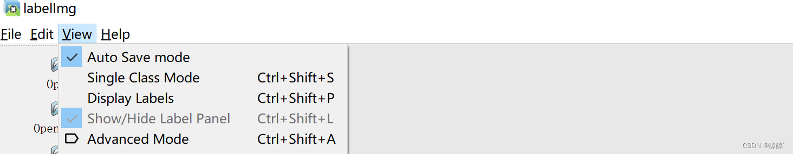
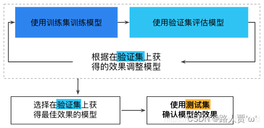

# Yolov5 3_自建数据集目标检测

## 1. labelimg 图片标记

1. 在`yolov5`路径下新建`VOCData`文件夹。
2. 在`VOCData`文件夹下创建 `Annotations` 和 `images` 文件夹

> - `Annotations` 文件夹用于存放使用labelimg标记后的图片（XML格式）。
> - `images` 文件夹用于存放用于标记的图片。

3. 在cmd窗口下输入 `labelimg` 或者运行 `labelimg.py` 文件进入labelimg的可执行程序（注：如果是在虚拟环境下安装的labelimg，记得先激活虚拟环境）。

4. 分别设置需要标注图片的文件夹和存放标记结果的文件夹的地址。





> 标记图片快捷键：`w：标记`  `a：上一张图片`  `d：下一张图片`

5. 进行标记，在`Annotations`文件夹下可以看到标记好的`xml`文件。

## 2. 格式转换

使用YOLO算法进行训练，需要将数据集格式由VOC格式转换为YOLO格式，方便进行训练。

在`VOCData`文件夹内新建`labels`文件夹。

```python
import os
import xml.etree.ElementTree as ET

# 定义自己的类别，自己数据集有几类就填写几类 Define the classes
classes = ["DA"]

# 定义自己的输出文件夹 Define the output directory
output_dir = "S:/STM32SSC/Visual/Yolov5/Code/yolov5/VOCData/labels"

# 定义自己的输入文件夹 Define the input directory
input_dir = "S:/STM32SSC/Visual/Yolov5/Code/yolov5/VOCData/Annotations"

# 把每一个输入文件夹里的VOC格式的xml文件转换为yolo格式
# Loop through each xml file in the input directory and convert to yolo format
for file in os.listdir(input_dir):
    if file.endswith(".xml"):
        file_path = os.path.join(input_dir, file)
        tree = ET.parse(file_path)
        root = tree.getroot()

        # 获取照片的尺寸，这是转换计算需要的参数
        # Get the image size
        size = root.find("size")
        width = int(size.find("width").text)
        height = int(size.find("height").text)

        # 创建yolo格式文件
        # Create the yolo format file
        out_file = open(os.path.join(output_dir, file.replace("xml", "txt")), "w")

        # 遍历每个对象并写入yolo格式文件
        # Iterate over each object and write to the yolo format file
        for obj in root.iter("object"):
            cls = obj.find("name").text
            if cls not in classes:
                continue
            cls_id = classes.index(cls)
            xmlbox = obj.find("bndbox")
            b = (
                int(xmlbox.find("xmin").text),
                int(xmlbox.find("ymin").text),
                int(xmlbox.find("xmax").text),
                int(xmlbox.find("ymax").text),
            )

            bbx_w = (b[2] - b[0]) / float(width)
            bbx_h = (b[3] - b[1]) / float(height)
            bbx_x = (b[0] + b[2]) / 2.0 / float(width)
            bbx_y = (b[1] + b[3]) / 2.0 / float(height)

            out_file.write(
                str(cls_id)
                + " "
                + str(bbx_x)
                + " "
                + str(bbx_y)
                + " "
                + str(bbx_w)
                + " "
                + str(bbx_h)
                + "\n"
            )
        out_file.close()

```

## 3. 划分数据集

通常把训练的数据分为三个文件夹：**训练集、测试集和验证集**。

> - 训练集（train set）：用于训练模型以及确定参数。
> - 验证集（validation set）：用于确定网络结构以及调整模型的超参数。
> - 测试集（test set）：用于检验模型的泛化能力。
> - 参数（parameters）：指由模型通过学习得到的变量，如权重和偏置。
> - 超参数（hyperparameters）：指根据经验进行设定的参数，如迭代次数，隐层的层数，每层神经元的个数，学习率等。



1. 在`VOCData`文件夹下创建`ImageSets`文件夹，用来保存划分好的训练集、测试集和验证集。
2. 在`yolov5`文件夹下创建`split.py`文件。

3. 打乱数据集顺序

数据集有`images`和`Annotations`这两个文件夹，需要把这两个文件夹的文件绑定，然后将其打乱顺序。
首先设置空列表，将for循环读取这两个文件的每个数据放入对应表中，再将这两个文件通过`zip()`函数绑定，计算总长度。

```python
def split_data(file_path,xml_path, new_file_path, train_rate, val_rate, test_rate):
    each_class_image = []
    each_class_label = []
    for image in os.listdir(file_path):
        each_class_image.append(image)
    for label in os.listdir(xml_path):
        each_class_label.append(label)
    data = list(zip(each_class_image,each_class_label))
    total = len(each_class_image)
```

然后用`random.shuffle()`函数打乱顺序，再将两个列表解绑。

```python
    random.shuffle(data)
    each_class_image,each_class_label=zip(*data)
```

3. 按照确定好的比例将两个列表元素分割

```python
    train_images = each_class_image[0:int(train_rate * total)]
    val_images = each_class_image[int(train_rate * total):int((train_rate + val_rate) * total)]
    test_images = each_class_image[int((train_rate + val_rate) * total):]
    train_labels = each_class_label[0:int(train_rate * total)]
    val_labels = each_class_label[int(train_rate * total):int((train_rate + val_rate) * total)]
    test_labels = each_class_label[int((train_rate + val_rate) * total):]
```

4. 在本地生成文件夹，将划分好的数据集分别保存

```python
 for image in train_images:
        print(image)
        old_path = file_path + '/' + image
        new_path1 = new_file_path + '/' + 'train' + '/' + 'images'
        if not os.path.exists(new_path1):
            os.makedirs(new_path1)
        new_path = new_path1 + '/' + image
        shutil.copy(old_path, new_path)
 
    for label in train_labels:
        print(label)
        old_path = xml_path + '/' + label
        new_path1 = new_file_path + '/' + 'train' + '/' + 'labels'
        if not os.path.exists(new_path1):
            os.makedirs(new_path1)
        new_path = new_path1 + '/' + label
        shutil.copy(old_path, new_path)
 
    for image in val_images:
        old_path = file_path + '/' + image
        new_path1 = new_file_path + '/' + 'val' + '/' + 'images'
        if not os.path.exists(new_path1):
            os.makedirs(new_path1)
        new_path = new_path1 + '/' + image
        shutil.copy(old_path, new_path)
 
    for label in val_labels:
        old_path = xml_path + '/' + label
        new_path1 = new_file_path + '/' + 'val' + '/' + 'labels'
        if not os.path.exists(new_path1):
            os.makedirs(new_path1)
        new_path = new_path1 + '/' + label
        shutil.copy(old_path, new_path)
 
    for image in test_images:
        old_path = file_path + '/' + image
        new_path1 = new_file_path + '/' + 'test' + '/' + 'images'
        if not os.path.exists(new_path1):
            os.makedirs(new_path1)
        new_path = new_path1 + '/' + image
        shutil.copy(old_path, new_path)
 
    for label in test_labels:
        old_path = xml_path + '/' + label
        new_path1 = new_file_path + '/' + 'test' + '/' + 'labels'
        if not os.path.exists(new_path1):
            os.makedirs(new_path1)
        new_path = new_path1 + '/' + label
        shutil.copy(old_path, new_path)
```

5. 设置路径并设置划分比例

- `file_path`：图片所在位置，就是images文件夹
- `txt_path`：标签所在位置，就是labels文件夹
- `new_file_path`：划分后三个文件的保存位置，就是ImageSets文件夹

```python
if __name__ == '__main__':
    file_path = "D:\yolov5-6.1\datasets\image"
    txt_path = "D:\yolov5-6.1\datasets\labels"
    new_file_path = "D:\yolov5-6.1\datasets\ImageSets"
    split_data(file_path,xml_path, new_file_path, train_rate=0.7, val_rate=0.1, test_rate=0.2)
```

## 4. 训练数据集

1. 修改数据集配置文件

首先在`yolov5/data`的目录下新建一个`myVOC.yaml`文件。

- `train`和`val`：通过`split.py`划分好的数据集文件；
- `nc`：存放检测目标类别个数；
- `name`：存放检测目标类别的名字。

2. 修改模型配置文件

在model文件夹下有4种不同大小的网络模型，分别是YOLOv5s、YOLOv5m、YOLOv5l、YOLOv5x，这几个模型的结构基本一样，不同的是`depth_multiple`模型深度和`width_multiple`模型宽度这两个参数。

通常选择YOLOv5s，同样修改`nc`参数。

## 5. 训练模型

通过`train.py`训练模型。

```python
def parse_opt(known=False):
    parser = argparse.ArgumentParser()
    parser.add_argument('--weights', type=str, default=ROOT / 'yolov5s.pt', help='initial weights path')
    parser.add_argument('--cfg', type=str, default='models/yolov5s_fire.yaml', help='model.yaml path')
    parser.add_argument('--data', type=str, default=ROOT / 'data/fire.yaml', help='dataset.yaml path')
    parser.add_argument('--hyp', type=str, default=ROOT / 'data/hyps/hyp.scratch-low.yaml', help='hyperparameters path')
    parser.add_argument('--epochs', type=int, default=300)
    parser.add_argument('--batch-size', type=int, default=1, help='total batch size for all GPUs, -1 for autobatch')
    parser.add_argument('--imgsz', '--img', '--img-size', type=int, default=640, help='train, val image size (pixels)')
    parser.add_argument('--rect', action='store_true', help='rectangular training')
    parser.add_argument('--resume', nargs='?', const=True, default=False, help='resume most recent training')
    parser.add_argument('--nosave', action='store_true', help='only save final checkpoint')
    parser.add_argument('--noval', action='store_true', help='only validate final epoch')
    parser.add_argument('--noautoanchor', action='store_true', help='disable AutoAnchor')
    parser.add_argument('--evolve', type=int, nargs='?', const=300, help='evolve hyperparameters for x generations')
    parser.add_argument('--bucket', type=str, default='', help='gsutil bucket')
    parser.add_argument('--cache', type=str, nargs='?', const='ram', help='--cache images in "ram" (default) or "disk"')
    parser.add_argument('--image-weights', action='store_true', help='use weighted image selection for training')
    parser.add_argument('--device', default='', help='cuda device, i.e. 0 or 0,1,2,3 or cpu')
    parser.add_argument('--multi-scale', action='store_true', help='vary img-size +/- 50%%')
    parser.add_argument('--single-cls', action='store_true', help='train multi-class data as single-class')
    parser.add_argument('--optimizer', type=str, choices=['SGD', 'Adam', 'AdamW'], default='SGD', help='optimizer')
    parser.add_argument('--sync-bn', action='store_true', help='use SyncBatchNorm, only available in DDP mode')
    parser.add_argument('--workers', type=int, default=0, help='max dataloader workers (per RANK in DDP mode)')
    parser.add_argument('--project', default=ROOT / 'runs/train', help='save to project/name')
    parser.add_argument('--name', default='exp', help='save to project/name')
    parser.add_argument('--exist-ok', action='store_true', help='existing project/name ok, do not increment')
    parser.add_argument('--quad', action='store_true', help='quad dataloader')
    parser.add_argument('--cos-lr', action='store_true', help='cosine LR scheduler')
    parser.add_argument('--label-smoothing', type=float, default=0.0, help='Label smoothing epsilon')
    parser.add_argument('--patience', type=int, default=100, help='EarlyStopping patience (epochs without improvement)')
    parser.add_argument('--freeze', nargs='+', type=int, default=[0], help='Freeze layers: backbone=10, first3=0 1 2')
    parser.add_argument('--save-period', type=int, default=-1, help='Save checkpoint every x epochs (disabled if < 1)')
    parser.add_argument('--local_rank', type=int, default=-1, help='DDP parameter, do not modify')
 
    # Weights & Biases arguments
    parser.add_argument('--entity', default=None, help='W&B: Entity')
    parser.add_argument('--upload_dataset', nargs='?', const=True, default=False, help='W&B: Upload data, "val" option')
    parser.add_argument('--bbox_interval', type=int, default=-1, help='W&B: Set bounding-box image logging interval')
    parser.add_argument('--artifact_alias', type=str, default='latest', help='W&B: Version of dataset artifact to use')
 
    opt = parser.parse_known_args()[0] if known else parser.parse_args()
    return opt
```

> **opt参数解析：** 
>
> - `cfg:`  模型配置文件，网络结构
> - `data:`  数据集配置文件，数据集路径，类名等
> - `hyp:`  超参数文件
> - `epochs:`  训练总轮次
> - `batch-size:`  批次大小
> - `img-size:`  输入图片分辨率大小
> - `rect:`  是否采用矩形训练，默认False
> - `resume:`  接着打断训练上次的结果接着训练
> - `nosave:`  不保存模型，默认False
> - `notest:`  不进行test，默认False
> - `noautoanchor:`  不自动调整anchor，默认False
> - `evolve:`  是否进行超参数进化，默认False
> - `bucket:`  谷歌云盘bucket，一般不会用到
> - `cache-images:`  是否提前缓存图片到内存，以加快训练速度，默认False
> - `weights:`  加载的权重文件
> - `name:`  数据集名字，如果设置：results.txt to results_name.txt，默认无
> - `device:`  训练的设备，cpu；0(表示一个gpu设备cuda:0)；0,1,2,3(多个gpu设备)
> - `multi-scale:` 是否进行多尺度训练，默认False
> - `single-cls:`   数据集是否只有一个类别，默认False
> - `adam:`  是否使用adam优化器
> - `sync-bn:`  是否使用跨卡同步BN,在DDP模式使用
> - `local_rank:`  gpu编号
> - `logdir:`  存放日志的目录
> - `workers:`  dataloader的最大worker数量

```python
parser.add_argument('--weights', type=str, default=ROOT / 'yolov5s.pt', help='initial weights path')
```

`--weight`：先选用官方的yolov5s.pt权重，当自己的训练完成后可更换为自己的权重

```python
 parser.add_argument('--cfg', type=str, default='models/myyolov5s.yaml', help='model.yaml path')
```

`--cfg`：选用上一步model目录下我们刚才改好的模型配置文件

```python
parser.add_argument('--data', type=str, default=ROOT / 'data/myvoc.yaml', help='dataset.yaml path')
```

`--data`：选用上一步data目录下我们刚才改好的数据集配置文件

```python
parser.add_argument('--epochs', type=int, default=300)
```

 `--epochs`：指的就是训练过程中整个数据集将被迭代多少轮，默认是300，显卡不行就调小点

```python
parser.add_argument('--batch-size', type=int, default=16, help='total batch size for all GPUs, -1 for autobatch')
```

`--batch-size`：一次看完多少张图片才进行权重更新，默认是16，显卡不行就调小点

```python
parser.add_argument('--workers', type=int, default=0, help='max dataloader workers (per RANK in DDP mode)')
```

`--workers`:dataloader的最大worker数量，一般用来处理多线程问题，默认是8，显卡不行就调小点

